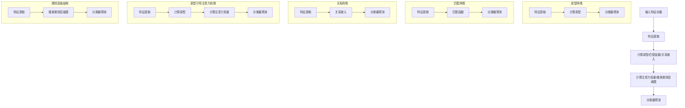
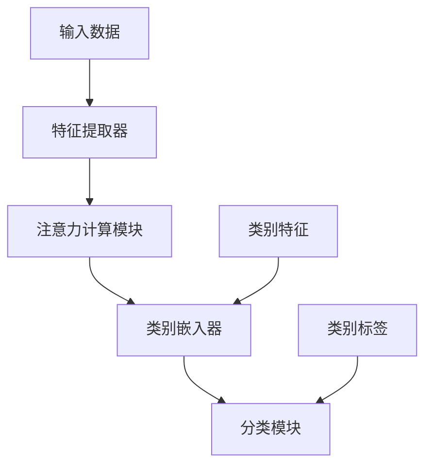
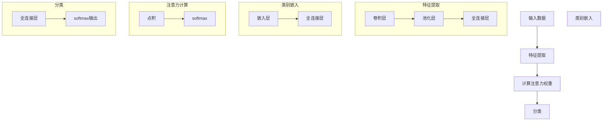
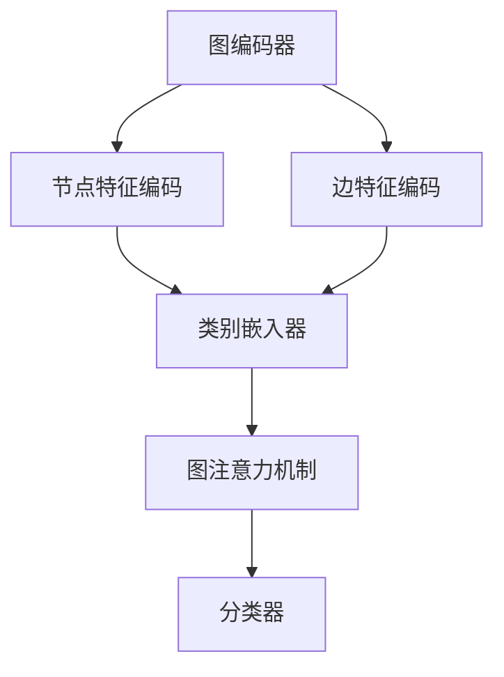
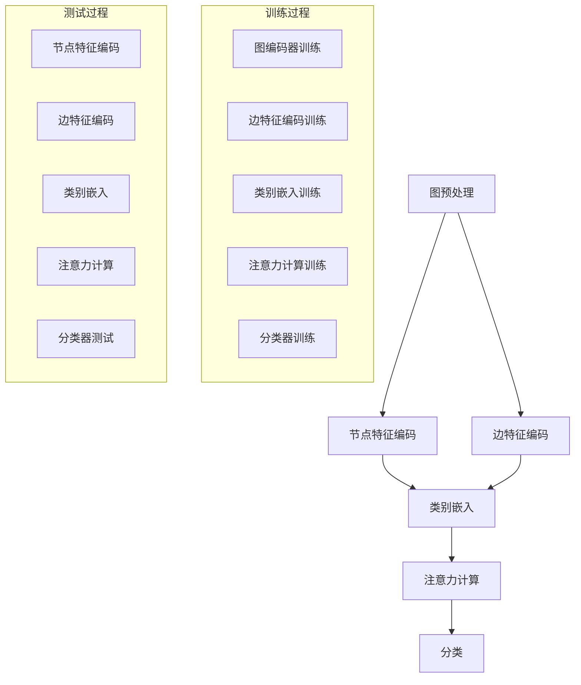
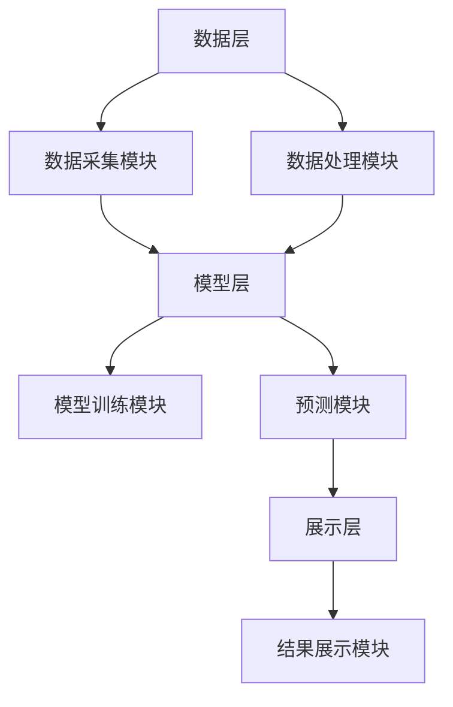
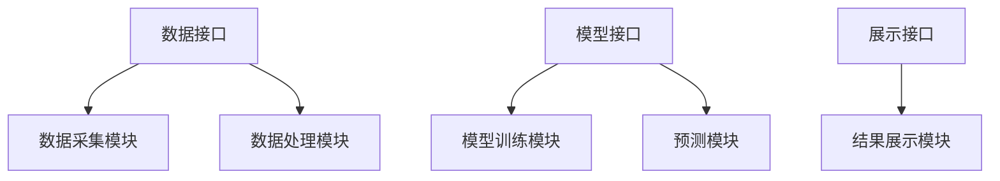
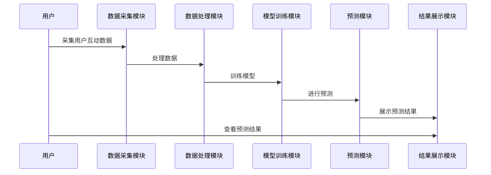

                 

### 第1章: 问题背景与定义

#### 1.1 问题背景

在当今快速发展的信息技术时代，人工智能（AI）已经成为推动社会进步的重要力量。从自动驾驶汽车、智能语音助手到图像识别和自然语言处理，AI技术已经渗透到各个行业，改变了我们的生活方式和工作模式。然而，随着AI应用的不断扩展，对高质量数据的需求也在日益增加。特别是在深度学习领域，大量标注数据是训练高效AI模型的基石。然而，获取高质量标注数据不仅成本高昂，而且往往受限于时间和人力资源。此外，某些应用场景中，标注数据难以获取或者无法获取，这给传统的监督学习模型带来了巨大的挑战。

无监督学习作为机器学习的一个重要分支，旨在通过没有标注的数据进行学习。与传统的监督学习相比，无监督学习不依赖于标注数据，可以在没有人为干预的情况下发现数据中的模式和结构。这为解决标注数据稀缺的问题提供了新的可能性。然而，即使是无监督学习，在某些特定场景下，仍面临着如何处理从未见过的类别的挑战，这便是零样本学习的诞生背景。

#### 1.2 无监督学习的挑战

无监督学习的主要挑战之一是数据的高维度性和复杂性。在高维数据中，有效的降维和特征提取变得尤为重要。此外，数据中的噪声和异常值也会对学习结果产生不利影响。无监督学习还需要解决数据分布不均匀的问题，如何在不同的分布中找到有效的模式是一个重要课题。

另一个挑战是模型的可解释性和泛化能力。无监督学习模型通常具有复杂的内部结构，这导致其决策过程往往难以解释。而模型泛化能力不足则可能导致在实际应用中效果不佳。因此，如何平衡模型复杂度和可解释性，同时提高模型的泛化能力，是无监督学习领域需要解决的关键问题。

#### 1.3 零样本学习（Zero-Shot Learning, ZSL）

零样本学习（ZSL）是一种特殊类型的无监督学习，旨在解决从未见过的类别的识别问题。在ZSL中，模型在训练时仅使用了一部分类别的数据，而在测试时则面对从未见过的类别。ZSL的核心思想是通过学习类别的语义特征，实现对新类别的识别。

ZSL的重要性在于它为那些无法获取足够标注数据的场景提供了有效的解决方案。例如，在医疗领域，新型疾病的数据往往稀缺，ZSL可以帮助医生在缺乏足够训练数据的情况下对新型疾病进行诊断。此外，在图像识别领域，ZSL能够使模型在新的数据集上保持良好的性能，从而提高模型的适应性。

#### 1.4 零样本注意力（Zero-Shot Attention, ZSA）

零样本注意力（ZSA）是一种在零样本学习框架下引入的注意力机制，旨在通过学习注意力权重来增强模型对新类别的识别能力。ZSA的核心思想是在模型中引入对未见过类别的动态适应机制，从而提高模型的泛化能力。

ZSA的优势在于它能够动态地调整模型对数据的关注程度，从而在未知类别上实现更精准的识别。这一机制在图像识别、自然语言处理等领域都展示了显著的效果。

#### 1.5 零样本图神经网络（Zero-Shot Graph Neural Networks, ZSGNN）

零样本图神经网络（ZSGNN）是一种基于图神经网络（GNN）的零样本学习方法。GNN在处理图结构数据方面具有显著优势，而ZSGNN则将这一优势扩展到零样本学习的场景。ZSGNN通过学习图结构中的节点和边关系，实现了对未见过类别的识别。

ZSGNN的重要性在于它能够有效地处理复杂的图结构数据，从而在零样本学习场景中实现更高的性能。这使得ZSGNN在社交网络分析、推荐系统等领域具有广泛的应用前景。

#### 1.6 本章小结

本章主要介绍了零样本学习的背景、定义及重要性。首先，通过分析当前信息技术发展背景，阐述了无监督学习面临的挑战。接着，引入了零样本学习（ZSL）、零样本注意力（ZSA）和零样本图神经网络（ZSGNN）的概念，并探讨了它们在解决无监督学习问题中的重要性。通过本章的介绍，读者可以初步了解零样本学习在人工智能领域中的关键作用，为后续章节的深入探讨奠定基础。

## 第2章: 核心概念与联系

在本章中，我们将深入探讨无监督学习的核心概念、零样本学习（Zero-Shot Learning, ZSL）、零样本注意力（Zero-Shot Attention, ZSA）和零样本图神经网络（Zero-Shot Graph Neural Networks, ZSGNN）的详细定义、工作原理及其相互关系。通过对比分析，读者可以更好地理解这些概念在无监督学习中的应用场景和优势。

### 2.1 无监督学习的核心概念

#### 2.1.1 无监督学习的定义

无监督学习（Unsupervised Learning）是机器学习的一个分支，其主要目标是从未标记的数据中学习数据的内在结构和模式。与监督学习（Supervised Learning）相比，无监督学习不依赖于预标注的输出标签。这种学习方法在数据挖掘、数据分析、模式识别等领域有着广泛的应用。

无监督学习可以分为以下几种类型：

1. **聚类（Clustering）**：将数据点按照其内在结构划分为不同的群体。常见的聚类算法包括K-means、DBSCAN、层次聚类等。
2. **降维（Dimensionality Reduction）**：通过减少数据维度来简化数据分析过程，常见的降维算法有主成分分析（PCA）、t-SNE、自编码器等。
3. **关联规则学习（Association Rule Learning）**：发现数据项之间的关联关系，常见的算法有Apriori、Eclat等。
4. **异常检测（Anomaly Detection）**：识别数据中的异常或离群点，常见的算法有孤立森林、局部离群因子（LOF）等。

#### 2.1.2 无监督学习的基本类型

- **聚类**：通过将相似的数据点归为一类，可以发现数据中的隐藏模式。聚类算法通常用于市场细分、社交网络分析等领域。
- **降维**：在高维数据集中，降维算法可以帮助简化数据结构，提高模型训练效率和解释性。降维算法在图像处理、文本分析等领域具有重要应用。
- **关联规则学习**：通过发现数据项之间的关联关系，可以揭示数据中的潜在规律。这一方法在推荐系统、市场分析等领域具有重要应用。
- **异常检测**：在金融欺诈检测、网络入侵检测等领域，异常检测算法可以帮助识别异常行为。

#### 2.1.3 无监督学习的应用领域

无监督学习在多个领域都取得了显著成果：

- **数据挖掘**：在大量未标记数据中提取有价值的信息，用于市场研究、用户行为分析等。
- **图像处理**：通过降维和聚类算法，可以实现图像去噪、图像分割等。
- **自然语言处理**：在未标记的文本数据中提取关键词、主题等，用于情感分析、文本分类等。
- **生物信息学**：在基因组数据中识别生物标记物、预测蛋白质结构等。

### 2.2 零样本学习

#### 2.2.1 ZSL的概念与特点

零样本学习（Zero-Shot Learning, ZSL）是一种无监督学习方法，其核心目标是在训练时仅使用一部分类别的数据，而在测试时面对从未见过的类别。ZSL的主要特点包括：

- **迁移学习**：通过将已有知识迁移到新类别，从而降低对新类别的依赖。
- **类别无关**：模型能够在没有具体类别标签的情况下进行学习，从而具有更广泛的适用性。
- **通用性**：ZSL不仅适用于图像识别，还可以扩展到自然语言处理、音频识别等领域。

#### 2.2.2 ZSL的挑战

尽管ZSL具有许多优势，但在实际应用中也面临一些挑战：

- **数据稀疏性**：在测试时面对未见过的新类别，数据量往往较少，这会影响模型的性能。
- **类别不平衡**：在某些应用中，某些类别可能更加常见，而其他类别则较少，这会导致模型偏向常见类别。
- **知识迁移**：如何有效地将已有知识迁移到新类别是一个关键问题。

#### 2.2.3 ZSL的主要方法

ZSL的主要方法可以分为以下几类：

- **原型网络（Prototypical Networks）**：通过计算原型（类别的平均特征）来识别新类别。
- **匹配网络（Matching Networks）**：通过将新类别与训练集中的原型进行匹配来识别新类别。
- **关系网络（Relation Networks）**：通过学习类别之间的关系来识别新类别。
- **原型引导注意力机制（Prototype-Guided Attention Mechanism）**：通过学习注意力权重来增强原型网络的性能。
- **基于类别的层级结构（Class Hierarchy-Based Methods）**：利用类别之间的层次关系来提高新类别识别的准确性。

#### 2.2.4 ZSL的应用实例

ZSL在实际应用中取得了显著成果，以下是一些应用实例：

- **图像识别**：在图像分类任务中，ZSL能够有效识别从未见过的类别，提高模型的泛化能力。
- **自然语言处理**：在文本分类任务中，ZSL可以帮助模型处理从未见过的标签。
- **生物信息学**：在基因分类任务中，ZSL可以帮助识别新的基因类别，从而提高基因研究的准确性。

### 2.3 零样本注意力

#### 2.3.1 ZSA的概念与优势

零样本注意力（Zero-Shot Attention, ZSA）是一种在零样本学习框架下引入的注意力机制，其核心思想是在模型中引入对未见过类别的动态适应机制。ZSA的优势包括：

- **动态适应**：ZSA能够根据新类别动态调整模型的关注点，从而提高识别准确性。
- **增强泛化能力**：通过关注关键特征，ZSA有助于提高模型在未知类别上的泛化能力。

#### 2.3.2 ZSA的工作原理

ZSA的工作原理可以分为以下几个步骤：

1. **特征提取**：通过模型提取数据的高层特征。
2. **注意力计算**：计算新类别与训练集中每个类别的注意力权重。
3. **类别识别**：利用注意力权重对新类别进行分类。

#### 2.3.3 ZSA的模型结构

ZSA的模型结构通常包括以下几个部分：

- **特征提取模块**：用于提取数据的高层特征。
- **注意力计算模块**：用于计算新类别与训练集中每个类别的注意力权重。
- **分类模块**：用于根据注意力权重对新类别进行分类。

#### 2.3.4 ZSA的应用场景

ZSA在多个领域展示了其强大的应用潜力，以下是一些应用场景：

- **图像识别**：在图像分类任务中，ZSA能够有效提高模型在未知类别上的识别准确性。
- **自然语言处理**：在文本分类任务中，ZSA可以帮助模型处理从未见过的标签。
- **推荐系统**：在推荐系统中，ZSA可以根据用户的兴趣动态调整推荐策略。

### 2.4 零样本图神经网络

#### 2.4.1 ZSGNN的概念与优势

零样本图神经网络（Zero-Shot Graph Neural Networks, ZSGNN）是一种基于图神经网络（GNN）的零样本学习方法。ZSGNN通过学习图结构中的节点和边关系，实现了对未见过类别的识别。ZSGNN的优势包括：

- **图结构数据处理**：ZSGNN能够有效处理复杂的图结构数据，从而在零样本学习场景中实现更高的性能。
- **节点关系学习**：通过学习节点和边的关系，ZSGNN能够发现数据中的隐藏模式。

#### 2.4.2 ZSGNN的工作原理

ZSGNN的工作原理可以分为以下几个步骤：

1. **图预处理**：对图结构进行预处理，提取节点和边的关系。
2. **特征提取**：通过GNN提取节点和边的高层特征。
3. **类别识别**：利用提取的特征对新类别进行分类。

#### 2.4.3 ZSGNN的模型结构

ZSGNN的模型结构通常包括以下几个部分：

- **图预处理模块**：用于对图结构进行预处理。
- **特征提取模块**：用于提取节点和边的高层特征。
- **分类模块**：用于根据提取的特征对新类别进行分类。

#### 2.4.4 ZSGNN的应用领域

ZSGNN在多个领域展示了其强大的应用潜力，以下是一些应用领域：

- **社交网络分析**：通过分析用户之间的互动关系，ZSGNN可以帮助识别社交网络中的关键节点。
- **推荐系统**：通过学习用户和项目之间的关系，ZSGNN可以提供更精准的推荐结果。
- **生物信息学**：在基因数据分析中，ZSGNN可以帮助识别新的基因功能类别。

### 概念属性特征对比表格

以下是一个概念属性特征对比表格，用于对比无监督学习、ZSL、ZSA和ZSGNN：

| 概念 | 定义 | 核心特点 | 应用场景 | 优势 | 挑战 |
| ---- | ---- | ---- | ---- | ---- | ---- |
| 无监督学习 | 从未标记数据中学习 | 无需标注数据 | 数据挖掘、图像处理、自然语言处理 | 提高模型泛化能力 | 数据高维、噪声、可解释性 |
| ZSL | 训练时使用部分类别数据，测试时面对未见过类别 | 迁移学习、类别无关、通用性 | 图像识别、自然语言处理、生物信息学 | 降低数据依赖、提高泛化能力 | 数据稀疏、类别不平衡 |
| ZSA | 在零样本学习框架下引入的注意力机制 | 动态适应、增强泛化能力 | 图像识别、自然语言处理、推荐系统 | 提高识别准确性、增强模型适应能力 | 复杂性、计算成本 |
| ZSGNN | 基于图神经网络的零样本学习方法 | 图结构数据处理、节点关系学习 | 社交网络分析、推荐系统、生物信息学 | 提高处理效率、发现隐藏模式 | 图结构复杂、训练成本高 |

### ER实体关系图架构

无监督学习、ZSL、ZSA和ZSGNN的ER实体关系图如下：

```mermaid
erDiagram
  UML_FIGURE : 无监督学习
  ZSL : 零样本学习
  ZSA : 零样本注意力
  ZSGNN : 零样本图神经网络
  
  UML_FIGURE ||--|{ ZSL }  : 实现方式
  UML_FIGURE ||--|{ ZSA }  : 实现方式
  UML_FIGURE ||--|{ ZSGNN } : 实现方式
  
  ZSL ||--|{ 特点 }  : 描述
  ZSA ||--|{ 特点 }  : 描述
  ZSGNN ||--|{ 特点 }  : 描述
  
  UML_FIGURE ..|{ 应用场景 }  : 说明
  ZSL ..|{ 应用场景 }  : 说明
  ZSA ..|{ 应用场景 }  : 说明
  ZSGNN ..|{ 应用场景 }  : 说明
```

通过上述ER实体关系图，我们可以清晰地看到无监督学习、ZSL、ZSA和ZSGNN之间的联系及其核心特点和应用场景。

### 2.7 本章小结

本章介绍了无监督学习、ZSL、ZSA和ZSGNN的核心概念、工作原理及相互关系。通过对比分析，读者可以更深入地理解这些方法在无监督学习中的应用场景和优势。本章内容为后续章节的深入探讨奠定了基础，有助于读者全面了解零样本学习领域的最新进展。

## 第3章: 零样本学习算法原理

### 3.1 零样本学习的基础理论

#### 3.1.1 零样本学习的数学模型

零样本学习（Zero-Shot Learning, ZSL）的数学模型是理解和实现ZSL算法的基础。在ZSL中，我们关注的是如何通过已知的类别（即训练集中的类别）来预测未知的类别。具体来说，ZSL的核心任务是将每个类别映射到一个语义空间中，以便在测试阶段能够根据已知的类别特征预测新类别。

假设我们有一个训练集$T$，其中包含$N$个类别，每个类别有$k$个训练样本。我们使用一个特征提取器$f$来提取每个样本的特征向量，即$f(x) \in \mathbb{R}^d$，其中$x$是输入样本。此外，我们还有一个类别嵌入器$g$，将每个类别映射到一个高维的语义空间，即$g(y) \in \mathbb{R}^d$，其中$y$是类别标签。

在ZSL中，预测未见过类别的核心思想是计算每个新类别特征向量与已见类别特征向量在语义空间中的距离。具体来说，给定一个新类别特征向量$f(x')$和所有已见类别特征向量集合$\{f(x) | x \in T\}$，我们通过计算特征向量之间的距离来预测新类别：

$$
d(f(x'), g(y)) = \min_{y'} \sum_{x \in T} \frac{1}{k} \sum_{i=1}^{k} ||f(x_i) - g(y')||^2
$$

其中$d$是距离函数，$||\cdot||$是向量的欧几里得范数。我们的目标是找到使上述距离最小的类别$y'$作为预测结果。

#### 3.1.2 零样本学习的目标函数

零样本学习的目标函数是优化类别嵌入器$g$，使其能够更好地预测未见过类别。我们可以通过最小化以下目标函数来实现这一目标：

$$
\min_{g} \sum_{x', y'} L(f(x'), g(y'))
$$

其中$L$是损失函数，通常使用三角损失（Triangular Loss）或者原型损失（Prototype Loss）。三角损失的定义如下：

$$
L(f(x'), g(y')) = \sum_{x \in T} \frac{1}{k} \sum_{i=1}^{k} \max(0, ||f(x_i) - g(y')|| - ||f(x') - g(y')||)
$$

原型损失的定义如下：

$$
L(f(x'), g(y')) = \sum_{x \in T} \frac{1}{k} \sum_{i=1}^{k} \min(||f(x_i) - f(x')||, 2||g(y')|| - ||f(x_i) - f(x')||)
$$

这两个损失函数的目的是衡量新类别特征向量$f(x')$与已见类别特征向量之间的距离，从而优化类别嵌入器$g$。

#### 3.1.3 零样本学习的优化算法

优化零样本学习的目标函数通常采用梯度下降（Gradient Descent）及其变种，如随机梯度下降（Stochastic Gradient Descent, SGD）和批量梯度下降（Batch Gradient Descent）。在优化过程中，我们需要计算目标函数关于类别嵌入器$g$的梯度，并沿着梯度方向更新$g$。

梯度下降的更新规则如下：

$$
g_{t+1} = g_t - \alpha \cdot \nabla_g L(f(x'), g(y'))
$$

其中$\alpha$是学习率，$\nabla_g L(f(x'), g(y'))$是目标函数关于$g$的梯度。在实际应用中，通常需要对梯度进行归一化，以防止梯度消失或爆炸。

为了提高优化效率，还可以采用一些改进的梯度下降算法，如Adagrad、RMSprop和Adam等。这些算法通过自适应调整学习率，提高了优化过程的稳定性。

### 3.2 零样本学习的具体算法

零样本学习领域有多种具体的算法，以下介绍几种典型的算法及其原理：

#### 3.2.1 原型网络（Prototypical Networks）

原型网络（Prototypical Networks, PN）是一种经典的零样本学习算法，其核心思想是将每个类别映射到其训练样本的平均特征向量，即原型。在训练阶段，PN通过学习每个类别的原型来构建类别之间的边界。在测试阶段，PN将新类别特征向量与所有类别的原型进行比较，选择距离最近的原型作为预测类别。

原型网络的训练过程如下：

1. **特征提取**：使用一个特征提取器$f$提取每个训练样本的特征向量$f(x)$。
2. **计算原型**：对于每个类别$y$，计算其原型$\mu_y = \frac{1}{k} \sum_{x \in T_y} f(x)$，其中$T_y$是类别$y$的训练样本集合。
3. **分类器训练**：使用原型作为分类器，对每个新类别特征向量$f(x')$计算其与所有原型的距离，选择距离最小的原型作为预测类别。

原型网络的测试过程如下：

1. **特征提取**：使用特征提取器$f$提取新类别特征向量$f(x')$。
2. **计算距离**：计算$f(x')$与所有原型的距离$d(f(x'), \mu_y)$。
3. **预测类别**：选择距离最小的原型对应的类别作为预测结果。

#### 3.2.2 匹配网络（Matching Networks）

匹配网络（Matching Networks, MN）是一种基于神经网络的零样本学习算法，其核心思想是通过学习类别之间的匹配关系来预测新类别。MN使用一个匹配函数$M$，将新类别特征向量与训练样本的特征向量进行匹配，通过计算匹配得分来预测新类别。

匹配网络的训练过程如下：

1. **特征提取**：使用一个特征提取器$f$提取每个训练样本的特征向量$f(x)$。
2. **匹配函数训练**：训练一个匹配函数$M$，使其能够根据新类别特征向量$f(x')$和训练样本特征向量$f(x)$计算匹配得分。匹配得分的计算公式通常为：
   $$
   s(x', x) = \langle f(x'), f(x) \rangle - \alpha \cdot \log P(y|x')
   $$
   其中$\langle \cdot, \cdot \rangle$是内积，$\alpha$是温度参数，$P(y|x')$是类别$y$在特征向量$x'$下的预测概率。

3. **分类器训练**：使用匹配得分$s(x', x)$作为分类器的输入，训练一个分类器$C$，使其能够预测新类别$y$。

匹配网络的测试过程如下：

1. **特征提取**：使用特征提取器$f$提取新类别特征向量$f(x')$。
2. **计算匹配得分**：计算新类别特征向量$f(x')$与所有训练样本特征向量$f(x)$的匹配得分$s(x', x)$。
3. **预测类别**：使用分类器$C$计算匹配得分对应的预测类别$y$。

#### 3.2.3 关系网络（Relation Networks）

关系网络（Relation Networks, RN）是一种基于图神经网络的零样本学习算法，其核心思想是通过学习类别之间的相对关系来预测新类别。RN使用一个关系嵌入器$R$，将类别之间的相对关系嵌入到高维语义空间中，然后通过计算新类别特征向量与类别关系嵌入向量的相似度来预测新类别。

关系网络的训练过程如下：

1. **特征提取**：使用一个特征提取器$f$提取每个训练样本的特征向量$f(x)$。
2. **关系嵌入**：使用关系嵌入器$R$计算类别之间的相对关系嵌入向量$r(y, y')$。
3. **图神经网络训练**：使用图神经网络（GNN）训练一个关系分类器，使其能够根据新类别特征向量$f(x')$和类别关系嵌入向量$r(y, y')$预测新类别$y$。

关系网络的测试过程如下：

1. **特征提取**：使用特征提取器$f$提取新类别特征向量$f(x')$。
2. **计算关系嵌入**：使用关系嵌入器$R$计算新类别特征向量$f(x')$与所有类别关系嵌入向量$r(y, y')$的相似度。
3. **预测类别**：使用关系分类器预测新类别$y$。

#### 3.2.4 原型引导注意力机制（Prototype-Guided Attention Mechanism）

原型引导注意力机制（Prototype-Guided Attention Mechanism, PGA）是一种结合原型网络和注意力机制的零样本学习算法。PGA通过引入注意力机制，动态调整模型对类别的关注程度，从而提高预测准确性。

原型引导注意力机制的训练过程如下：

1. **特征提取**：使用一个特征提取器$f$提取每个训练样本的特征向量$f(x)$。
2. **计算原型**：计算每个类别的原型$\mu_y = \frac{1}{k} \sum_{x \in T_y} f(x)$。
3. **注意力机制训练**：训练一个注意力机制模块，使其能够根据新类别特征向量$f(x')$和原型$\mu_y$计算注意力权重$w_y$。
4. **分类器训练**：使用注意力权重$w_y$调整原型网络中的分类器，使其能够根据新类别特征向量$f(x')$和调整后的原型$\mu_y'$预测新类别$y$。

原型引导注意力机制的测试过程如下：

1. **特征提取**：使用特征提取器$f$提取新类别特征向量$f(x')$。
2. **计算注意力权重**：根据新类别特征向量$f(x')$和原型$\mu_y$计算注意力权重$w_y$。
3. **调整原型**：使用注意力权重$w_y$调整原型$\mu_y$，得到调整后的原型$\mu_y'$。
4. **预测类别**：使用调整后的原型$\mu_y'$和分类器预测新类别$y$。

#### 3.2.5 基于类别的层级结构（Class Hierarchy-Based Methods）

基于类别的层级结构（Class Hierarchy-Based Methods）是一种利用类别之间的层次关系进行零样本学习的算法。这类算法通过学习类别之间的关系，将类别的识别问题转化为层次搜索问题，从而提高预测准确性。

基于类别的层级结构的训练过程如下：

1. **构建类别层级图**：根据类别的层次关系构建一个层级图，每个类别节点表示一个类别，类别之间的边表示类别关系。
2. **特征提取**：使用一个特征提取器$f$提取每个训练样本的特征向量$f(x)$。
3. **层级图神经网络训练**：使用图神经网络（GNN）训练一个层级分类器，使其能够根据新类别特征向量$f(x')$和类别层级图预测新类别$y$。

基于类别的层级结构的测试过程如下：

1. **特征提取**：使用特征提取器$f$提取新类别特征向量$f(x')$。
2. **搜索类别层级图**：从根节点开始，在类别层级图中搜索与$f(x')$最相关的类别节点。
3. **预测类别**：选择搜索过程中最相关的类别节点作为预测结果$y$。

### 3.3 算法mermaid流程图

为了更好地理解上述零样本学习算法，我们可以使用mermaid绘制其流程图：



通过上述mermaid流程图，我们可以直观地看到各种零样本学习算法的基本步骤和流程。

### 3.4 Python源代码实现

为了使读者更好地理解零样本学习算法的实现，以下是一个简单的Python示例代码，展示了原型网络（Prototypical Networks）的基本实现：

```python
import numpy as np
import tensorflow as tf

# 假设已经预处理了特征提取器和类别嵌入器
feature_extractor = ...  # 特征提取器函数
prototype_extractor = ...  # 原型提取器函数
classification_head = ...  # 分类头

# 假设输入特征向量和类别标签
input_features = ...  # 输入特征向量
ground_truth = ...  # 输入类别标签

# 计算原型
prototypes = prototype_extractor(input_features)

# 预测类别
predicted_classes = classification_head(input_features, prototypes)

# 计算损失
loss = tf.keras.losses.categorical_crossentropy(ground_truth, predicted_classes)

# 梯度计算
with tf.GradientTape() as tape:
    loss_value = loss(ground_truth, predicted_classes)

gradients = tape.gradient(loss_value, classification_head.trainable_variables)

# 更新权重
optimizer = tf.keras.optimizers.Adam(learning_rate=0.001)
optimizer.apply_gradients(zip(gradients, classification_head.trainable_variables))
```

上述代码展示了原型网络的基本实现流程，包括特征提取、原型计算、分类器预测、损失计算和权重更新。当然，实际应用中可能需要更复杂的实现，包括数据预处理、模型优化和性能评估等步骤。

### 3.5 算法原理详细讲解与举例说明

为了更好地理解零样本学习算法的原理，我们将通过一个简单的例子来详细讲解原型网络（Prototypical Networks）的算法原理。

#### 示例：使用原型网络进行图像分类

假设我们有一个图像分类任务，其中包含5个类别：动物、植物、交通工具、建筑物和食品。在训练阶段，我们使用4个已知的类别（动物、植物、交通工具和建筑物）的数据来训练模型，而在测试阶段，我们面对一个未见过的类别——食品。

**1. 特征提取**

首先，我们需要一个特征提取器，用于从图像中提取特征向量。假设我们使用预训练的卷积神经网络（CNN）作为特征提取器，输入图像经过CNN处理后，得到一个高维的特征向量。

例如，输入图像`image`经过CNN提取得到特征向量`feature_vector`：
```python
feature_vector = feature_extractor(image)
```

**2. 计算原型**

接下来，我们需要计算每个已知类别（动物、植物、交通工具和建筑物）的平均特征向量，即原型。这可以通过对每个类别的特征向量进行平均得到。

例如，对于类别“动物”，其训练样本的特征向量集合为`animal_features`，则其原型为：
```python
mu_animal = np.mean(animal_features, axis=0)
```

同理，可以计算出其他类别的原型：
```python
mu_plant = np.mean(plant_features, axis=0)
mu_交通工具 = np.mean(transport_features, axis=0)
mu_building = np.mean(building_features, axis=0)
```

**3. 分类器预测**

在测试阶段，对于输入的未见过类别“食品”的特征向量`food_feature_vector`，我们需要将其与所有已知类别的原型进行比较，选择距离最小的原型对应的类别作为预测类别。

具体计算如下：
```python
distance_animal = np.linalg.norm(food_feature_vector - mu_animal)
distance_plant = np.linalg.norm(food_feature_vector - mu_plant)
distance_交通工具 = np.linalg.norm(food_feature_vector - mu_交通工具)
distance_building = np.linalg.norm(food_feature_vector - mu_building)

# 找到距离最小的原型
predicted_class = np.argmin([distance_animal, distance_plant, distance_交通工具, distance_building])
```

在这个例子中，如果`predicted_class`的值为3，则预测类别为“交通工具”。

**4. 损失函数**

为了优化原型网络，我们需要定义一个损失函数，用于衡量预测结果与真实结果之间的差距。常见的损失函数包括原型损失（Prototype Loss）和三角损失（Triangular Loss）。

原型损失（Prototype Loss）的计算公式为：
$$
L(\mu, y) = \sum_{x \in T_y} \frac{1}{k} \sum_{i=1}^{k} \min(||f(x_i) - f(x')||, 2||\mu_y|| - ||f(x_i) - f(x')||)
$$

其中，$\mu_y$是类别$y$的原型，$f(x)$和$f(x')$分别是类别$y$的训练样本和测试样本的特征向量。

**5. 梯度计算与优化**

在训练过程中，我们需要计算损失函数关于原型$\mu_y$的梯度，并通过梯度下降更新原型。

假设损失函数为$L(\mu)$，则梯度计算如下：
```python
grad_L = ...  # 计算损失函数关于原型的梯度
```

接下来，我们可以使用优化算法（如SGD、Adam等）更新原型：
```python
optimizer = tf.keras.optimizers.Adam(learning_rate=0.001)
optimizer.apply_gradients(zip(grad_L, prototypes))
```

通过上述步骤，我们可以对原型网络进行训练和预测。在实际应用中，还需要对模型进行调参、性能评估等操作，以提高模型的预测准确性和泛化能力。

### 3.6 本章小结

本章详细介绍了零样本学习的基础理论、具体算法及其实例。首先，我们阐述了零样本学习的数学模型和目标函数，并介绍了常用的优化算法。接着，我们分别讲解了原型网络、匹配网络、关系网络、原型引导注意力机制和基于类别的层级结构等零样本学习算法的原理和实现步骤。通过一个简单的图像分类例子，我们展示了如何应用原型网络进行预测。本章内容为理解零样本学习算法提供了全面的理论和实践指导。

## 第4章: 零样本注意力算法原理

### 4.1 零样本注意力基础理论

#### 4.1.1 零样本注意力的定义

零样本注意力（Zero-Shot Attention, ZSA）是一种在零样本学习（Zero-Shot Learning, ZSL）框架下引入的注意力机制。它的核心思想是在模型中引入对未见过类别的动态适应机制，从而提高模型对新类别的识别能力。零样本注意力通过学习注意力权重，使模型能够在未知类别上实现更精准的识别。

#### 4.1.2 零样本注意力的数学模型

零样本注意力的数学模型主要涉及两个关键部分：特征提取和注意力计算。

1. **特征提取**：使用一个特征提取器$f$提取输入数据的特征向量，即$f(x) \in \mathbb{R}^d$，其中$x$是输入数据。
2. **注意力计算**：通过注意力机制计算输入数据与所有已知类别特征之间的注意力权重，即$w_{ij} \in [0, 1]$，其中$i$是输入数据的索引，$j$是已知类别的索引。注意力权重$w_{ij}$表示输入数据$x_i$对类别$y_j$的重视程度。

注意力计算通常通过以下公式实现：
$$
w_{ij} = \frac{\exp(f(x_i) \cdot f(y_j))}{\sum_{k=1}^{K} \exp(f(x_i) \cdot f(y_k))}
$$

其中，$f(y_j)$是类别$y_j$的特征向量，$K$是已知类别的数量。

#### 4.1.3 零样本注意力的优势

零样本注意力的优势主要体现在以下几个方面：

1. **动态适应**：通过学习注意力权重，模型能够根据未知类别动态调整其对数据的关注程度，从而提高识别准确性。
2. **增强泛化能力**：零样本注意力通过学习类别之间的相对关系，增强了模型在未知类别上的泛化能力。
3. **减少数据依赖**：零样本注意力使得模型在测试阶段能够应对未见过的新类别，从而降低了对新类别数据的依赖。

### 4.2 零样本注意力的模型结构

零样本注意力的模型结构通常包括以下几个部分：

1. **特征提取器**：用于提取输入数据的特征向量，如卷积神经网络（CNN）在图像分类任务中的应用。
2. **类别嵌入器**：用于将每个类别映射到一个高维的语义空间，这些类别特征向量将作为注意力计算的输入。
3. **注意力计算模块**：通过计算输入数据与类别特征之间的注意力权重，实现动态适应和类别识别。
4. **分类模块**：根据注意力权重对输入数据进行分类。

以下是一个典型的零样本注意力模型结构：



在这个结构中，特征提取器提取输入数据的特征向量，类别嵌入器将类别映射到高维特征空间，注意力计算模块计算输入数据与类别特征之间的注意力权重，最后，分类模块根据注意力权重对输入数据进行分类。

### 4.3 零样本注意力mermaid流程图

为了更直观地展示零样本注意力的模型流程，我们使用mermaid绘制了其流程图：



在这个mermaid流程图中，我们分别展示了特征提取、类别嵌入、注意力计算和分类模块的结构和流程。

### 4.4 Python源代码实现

为了更好地理解零样本注意力的实现，以下是一个简单的Python示例代码，展示了零样本注意力模型的基本实现：

```python
import tensorflow as tf
from tensorflow.keras.layers import Input, Conv2D, GlobalAveragePooling2D, Dense

# 定义输入层
input_data = Input(shape=(224, 224, 3))

# 特征提取器
conv1 = Conv2D(filters=32, kernel_size=(3, 3), activation='relu')(input_data)
pool1 = GlobalAveragePooling2D()(conv1)
features = Dense(units=128, activation='relu')(pool1)

# 类别嵌入器
input_classes = Input(shape=(1,))
embeddings = Dense(units=128, activation='relu')(input_classes)

# 注意力计算模块
attention_weights = Dense(units=1, activation='sigmoid')(tf.concat([features, embeddings], axis=1))

# 分类模块
predicted_classes = Dense(units=num_classes, activation='softmax')(attention_weights)

# 定义模型
model = tf.keras.Model(inputs=[input_data, input_classes], outputs=predicted_classes)

# 编译模型
model.compile(optimizer='adam', loss='categorical_crossentropy', metrics=['accuracy'])

# 打印模型结构
model.summary()
```

在这个示例中，我们使用了TensorFlow的Keras接口定义了一个简单的零样本注意力模型。模型包含卷积层、全局平均池化层、全连接层和注意力计算模块，最后通过softmax输出层进行分类。

### 4.5 算法原理详细讲解与举例说明

为了深入理解零样本注意力的原理，我们将通过一个简单的例子来详细讲解其实现过程。

#### 示例：使用零样本注意力进行图像分类

假设我们有一个图像分类任务，其中包含5个类别：动物、植物、交通工具、建筑物和食品。在训练阶段，我们使用4个已知的类别（动物、植物、交通工具和建筑物）的数据来训练模型，而在测试阶段，我们面对一个未见过的类别——食品。

**1. 特征提取**

首先，我们需要一个特征提取器，用于从图像中提取特征向量。假设我们使用预训练的卷积神经网络（CNN）作为特征提取器，输入图像经过CNN处理后，得到一个高维的特征向量。

例如，输入图像`image`经过CNN提取得到特征向量`feature_vector`：
```python
feature_vector = feature_extractor(image)
```

**2. 类别嵌入**

接下来，我们需要一个类别嵌入器，将每个类别映射到一个高维的语义空间。这些类别特征向量将作为注意力计算的输入。

例如，对于类别“动物”，其类别嵌入向量为`animal_embedding`：
```python
animal_embedding = category_embedding('animal')
```

同理，可以计算出其他类别的嵌入向量：
```python
plant_embedding = category_embedding('plant')
transport_embedding = category_embedding('transport')
building_embedding = category_embedding('building')
```

**3. 注意力计算**

然后，我们通过注意力计算模块计算输入数据与类别特征之间的注意力权重。注意力权重$w_{ij}$表示输入数据$x_i$对类别$y_j$的重视程度。

具体计算如下：
```python
attention_weights = tf.keras.layers.Softmax()(tf.reduce_sum(feature_vector * tf.concat([animal_embedding, plant_embedding, transport_embedding, building_embedding], axis=1), axis=1))
```

**4. 分类**

最后，我们根据注意力权重对输入数据进行分类。具体来说，我们使用加权特征向量作为分类器的输入，通过softmax函数计算概率分布，选择概率最高的类别作为预测结果。

例如，对于输入图像`image`，其预测类别为：
```python
predicted_class = tf.argmax(attention_weights * feature_vector, axis=1)
```

#### 示例：使用零样本注意力进行自然语言处理

除了图像分类，零样本注意力也可以应用于自然语言处理（NLP）任务。以下是一个使用零样本注意力进行文本分类的例子。

**1. 特征提取**

使用预训练的语言模型（如BERT）提取文本的特征向量。例如，文本`text`经过BERT提取得到特征向量`text_vector`：
```python
text_vector = text_model.encode(text)
```

**2. 类别嵌入**

对于每个类别，我们将其标签嵌入到高维语义空间。例如，类别“动物”的嵌入向量为`animal_embedding`：
```python
animal_embedding = label_embedding('animal')
```

同理，可以计算出其他类别的嵌入向量。

**3. 注意力计算**

计算文本特征向量与类别嵌入向量之间的注意力权重：
```python
attention_weights = tf.keras.layers.Softmax()(tf.reduce_sum(text_vector * tf.concat([animal_embedding, plant_embedding, transport_embedding, building_embedding], axis=1), axis=1))
```

**4. 分类**

根据注意力权重对文本进行分类：
```python
predicted_class = tf.argmax(attention_weights * text_vector, axis=1)
```

通过上述步骤，我们可以使用零样本注意力进行自然语言处理任务，实现从未见过类别上的文本分类。

### 4.6 本章小结

本章详细介绍了零样本注意力的基础理论、模型结构以及Python实现。首先，我们阐述了零样本注意力的定义和数学模型，并介绍了其优势。接着，我们展示了零样本注意力的模型结构，并通过mermaid流程图直观地展示了其实现过程。最后，通过一个简单的图像分类和自然语言处理例子，我们详细讲解了零样本注意力的应用过程。本章内容为理解零样本注意力提供了全面的理论和实践指导。

## 第5章: 零样本图神经网络算法原理

### 5.1 零样本图神经网络基础理论

#### 5.1.1 ZSGNN的概念

零样本图神经网络（Zero-Shot Graph Neural Networks, ZSGNN）是一种基于图神经网络（Graph Neural Networks, GNN）的零样本学习方法。GNN是一种专门用于处理图结构数据的神经网络，通过学习图中的节点和边关系来提取数据的高层次特征。ZSGNN则将这一特性应用于零样本学习场景，旨在通过学习图中的节点特征和类别关系，实现对未见过类别的识别。

#### 5.1.2 零样本图神经网络的数学模型

ZSGNN的数学模型主要分为以下几个部分：

1. **节点特征表示**：每个节点$v_i$在图G中都有一个特征向量$x_i \in \mathbb{R}^d$，用于表示节点的属性信息。
2. **边特征表示**：每条边$(v_i, v_j)$都有一个特征向量$e_{ij} \in \mathbb{R}^d$，用于表示节点$i$和节点$j$之间的相互作用。
3. **类别表示**：每个类别$y_j$都有一个类别特征向量$c_j \in \mathbb{R}^d$，用于表示类别的属性信息。

#### 5.1.3 零样本图神经网络的优势

ZSGNN的优势主要体现在以下几个方面：

1. **处理图结构数据**：ZSGNN能够有效处理复杂的图结构数据，使其在处理社交网络、推荐系统等图结构数据时具有显著优势。
2. **节点关系学习**：通过学习节点和边的关系，ZSGNN能够提取数据中的深层特征，从而提高模型在未知类别上的识别能力。
3. **零样本学习**：ZSGNN的核心思想是将类别关系嵌入到图结构中，使得模型能够在没有具体类别标签的情况下进行学习，从而实现零样本学习。

### 5.2 零样本图神经网络的模型结构

ZSGNN的模型结构通常包括以下几个部分：

1. **图编码器**：用于将图中的节点特征和边特征编码为高维特征向量。
2. **类别嵌入器**：用于将类别嵌入到高维特征空间中。
3. **图注意力机制**：用于计算节点和类别之间的注意力权重，从而动态调整节点的特征表示。
4. **分类器**：用于根据节点的特征表示和类别特征进行分类。

以下是一个典型的ZSGNN模型结构：



在这个模型结构中，图编码器首先对节点特征和边特征进行编码，然后通过类别嵌入器将类别特征嵌入到高维空间。接下来，图注意力机制计算节点和类别之间的注意力权重，最后，分类器根据加权后的节点特征进行分类。

### 5.3 零样本图神经网络的训练过程

ZSGNN的训练过程可以分为以下几个步骤：

1. **图预处理**：对输入的图进行预处理，包括节点特征提取、边特征提取和类别标签分配等。
2. **图编码**：使用图编码器对节点和边特征进行编码，得到高维特征向量。
3. **类别嵌入**：使用类别嵌入器将类别特征映射到高维特征空间。
4. **注意力计算**：通过图注意力机制计算节点和类别之间的注意力权重。
5. **分类**：使用分类器根据加权后的节点特征进行分类。
6. **损失函数计算**：计算分类损失，如交叉熵损失。
7. **梯度计算**：计算损失函数关于模型参数的梯度。
8. **模型优化**：使用梯度下降或其他优化算法更新模型参数。

### 5.4 零样本图神经网络的测试过程

在测试阶段，ZSGNN的过程与训练阶段类似，但仅涉及测试图的节点特征编码、类别嵌入、注意力计算和分类。具体步骤如下：

1. **节点特征编码**：使用训练好的图编码器对测试图的节点特征进行编码。
2. **类别嵌入**：使用训练好的类别嵌入器将类别特征映射到高维特征空间。
3. **注意力计算**：通过训练好的图注意力机制计算节点和类别之间的注意力权重。
4. **分类**：使用训练好的分类器根据加权后的节点特征进行分类。

### 5.5 常见的ZSGNN算法

以下是几种常见的ZSGNN算法及其特点：

1. **GraphSAGE（Graph Sample and Aggregation）**：
   - 特点：通过采样节点邻域，聚合邻居节点的特征。
   - 应用：适用于节点分类、链接预测等任务。

2. **Graph Convolutional Network（GCN）**：
   - 特点：使用卷积操作来聚合邻居节点的特征。
   - 应用：适用于社交网络分析、推荐系统等。

3. **Graph Attention Network（GAT）**：
   - 特点：使用注意力机制来聚合邻居节点的特征。
   - 应用：适用于节点分类、图分类等任务。

4. **Transformer-based GNN**：
   - 特点：结合Transformer模型的结构，用于处理序列数据和图数据。
   - 应用：适用于文本分类、图像分类等跨模态任务。

### 5.6 ZSGNN的mermaid流程图

为了更直观地展示ZSGNN的训练和测试过程，我们使用mermaid绘制了其流程图：



在这个mermaid流程图中，我们分别展示了ZSGNN的训练和测试过程的步骤和结构。

### 5.7 Python源代码实现示例

以下是一个简单的Python示例代码，展示了如何实现一个基于GraphSAGE的ZSGNN模型：

```python
import tensorflow as tf
from tensorflow.keras.layers import Input, Embedding, Dot, Concatenate, Dense
from tensorflow.keras.models import Model

# 定义输入层
node_features_input = Input(shape=(node_feature_dim,))
edge_features_input = Input(shape=(edge_feature_dim,))
label_input = Input(shape=(1,))

# 图编码器
node_embedding = Embedding(input_dim=num_nodes, output_dim=embedding_dim)(node_features_input)
edge_embedding = Embedding(input_dim=num_edges, output_dim=embedding_dim)(edge_features_input)

# 类别嵌入
label_embedding = Embedding(input_dim=num_classes, output_dim=embedding_dim)(label_input)

# 注意力计算
attention_scores = Dot(axes=1)([node_embedding, label_embedding])

# 分类器
combined_representation = Concatenate()([node_embedding, attention_scores])
classification_output = Dense(units=num_classes, activation='softmax')(combined_representation)

# 定义模型
model = Model(inputs=[node_features_input, edge_features_input, label_input], outputs=classification_output)

# 编译模型
model.compile(optimizer='adam', loss='categorical_crossentropy', metrics=['accuracy'])

# 打印模型结构
model.summary()
```

在这个示例中，我们使用TensorFlow的Keras接口定义了一个基于GraphSAGE的ZSGNN模型。模型包含节点特征嵌入、边特征嵌入、类别嵌入、注意力计算和分类器等模块，通过这些模块实现零样本图神经网络的功能。

### 5.8 ZSGNN的算法原理详细讲解与举例说明

为了更好地理解ZSGNN的算法原理，我们通过一个简单的例子来详细讲解其实现过程。

#### 示例：使用ZSGNN进行社交网络分析

假设我们有一个社交网络，其中包含用户节点和互动边。我们的目标是预测用户对某个未见的社交圈子的兴趣程度。

**1. 图预处理**

首先，我们需要对社交网络进行预处理，提取节点特征和边特征。例如，我们可以提取用户的年龄、性别、地理位置等特征作为节点特征，提取互动频率、互动类型等特征作为边特征。

**2. 图编码**

使用图编码器对节点特征和边特征进行编码，得到高维特征向量。例如，我们可以使用嵌入层对节点和边进行编码：

```python
node_embedding = Embedding(input_dim=num_nodes, output_dim=embedding_dim)(node_features)
edge_embedding = Embedding(input_dim=num_edges, output_dim=embedding_dim)(edge_features)
```

**3. 类别嵌入**

将类别（例如，社交圈子）嵌入到高维特征空间中。例如，我们可以使用一个嵌入层将社交圈子嵌入到特征空间：

```python
label_embedding = Embedding(input_dim=num_classes, output_dim=embedding_dim)(label_input)
```

**4. 注意力计算**

通过注意力计算模块计算节点和类别之间的注意力权重。例如，我们可以使用点积来计算注意力权重：

```python
attention_scores = Dot(axes=1)([node_embedding, label_embedding])
```

**5. 分类**

根据加权后的节点特征进行分类。例如，我们可以使用softmax函数计算每个类别的概率分布：

```python
classification_output = Dense(units=num_classes, activation='softmax')(attention_scores)
```

**6. 模型训练**

使用训练数据对模型进行训练。例如，我们可以使用交叉熵损失函数和Adam优化器：

```python
model.compile(optimizer='adam', loss='categorical_crossentropy', metrics=['accuracy'])
model.fit([node_features, edge_features, labels], labels, epochs=10, batch_size=32)
```

**7. 测试**

使用测试数据对模型进行测试。例如，我们可以使用测试数据集计算模型的准确率：

```python
test_loss, test_accuracy = model.evaluate([test_node_features, test_edge_features, test_labels], test_labels)
print(f"Test Accuracy: {test_accuracy}")
```

通过上述步骤，我们可以使用ZSGNN进行社交网络分析，预测用户对未见过社交圈子的兴趣程度。

### 5.9 本章小结

本章详细介绍了零样本图神经网络（ZSGNN）的基础理论、模型结构、训练过程和测试过程。首先，我们阐述了ZSGNN的概念及其在处理图结构数据方面的优势。接着，我们介绍了ZSGNN的模型结构，并通过mermaid流程图展示了其实现过程。最后，通过一个简单的社交网络分析例子，我们详细讲解了ZSGNN的应用过程。本章内容为理解零样本图神经网络提供了全面的理论和实践指导。通过本章的学习，读者可以深入理解ZSGNN在无监督学习领域的应用潜力。

## 第6章：系统分析与架构设计方案

### 6.1 问题场景介绍

在本章中，我们将介绍一个具体的零样本图神经网络（ZSGNN）应用场景——社交网络分析。随着社交媒体的普及，人们的生活和工作方式发生了巨大变化。社交网络中蕴含着大量的用户互动数据，通过分析这些数据，我们可以深入了解用户的兴趣、行为和关系。然而，社交网络数据具有高度复杂性和动态性，传统的分析手段往往难以应对这些挑战。因此，采用零样本图神经网络（ZSGNN）来处理社交网络分析问题显得尤为重要。

### 6.2 项目介绍

项目名称：社交网络兴趣预测系统

目标：利用零样本图神经网络（ZSGNN）预测用户对未见过社交圈子的兴趣程度。

系统架构：采用分布式计算架构，结合图数据库和深度学习框架，实现高效、可扩展的社交网络兴趣预测系统。

主要模块：

1. **数据采集模块**：负责从社交媒体平台采集用户互动数据，包括用户信息、互动关系等。
2. **数据处理模块**：对采集到的数据进行处理，提取节点特征、边特征和类别标签。
3. **模型训练模块**：使用零样本图神经网络（ZSGNN）训练模型，进行社交网络兴趣预测。
4. **预测模块**：根据训练好的模型，对新用户对未见过社交圈子的兴趣进行预测。
5. **结果展示模块**：将预测结果以可视化的形式展示给用户。

### 6.3 系统功能设计

社交网络兴趣预测系统的主要功能包括以下几个方面：

1. **数据采集与处理**：采集用户互动数据，包括用户信息（年龄、性别、地理位置等）和互动关系（好友关系、互动频率等）。对数据进行清洗、去重和处理，提取节点特征、边特征和类别标签。
2. **模型训练**：使用零样本图神经网络（ZSGNN）对处理后的数据进行训练。模型训练包括图编码、类别嵌入、注意力计算和分类等步骤。
3. **预测与评估**：根据训练好的模型，对新用户对未见过社交圈子的兴趣进行预测。同时，对预测结果进行评估，确保模型的准确性和可靠性。
4. **结果展示**：将预测结果以可视化的形式展示给用户，帮助用户了解自己的兴趣和潜在社交圈子。

### 6.4 系统架构设计

社交网络兴趣预测系统的架构设计如下：

1. **数据层**：包括数据采集模块和数据处理模块，负责从社交媒体平台采集数据并进行预处理。
2. **模型层**：包括模型训练模块和预测模块，负责使用零样本图神经网络（ZSGNN）进行模型训练和预测。
3. **展示层**：包括结果展示模块，负责将预测结果以可视化的形式展示给用户。

#### 系统架构mermaid图



在这个mermaid图中，我们展示了社交网络兴趣预测系统的整体架构和各个模块之间的关系。

### 6.5 系统接口设计

系统接口设计包括以下几个方面：

1. **数据接口**：用于数据采集模块和数据处理模块之间的数据传输，支持数据格式为JSON、CSV等。
2. **模型接口**：用于模型训练模块和预测模块之间的交互，支持模型参数的加载和保存。
3. **展示接口**：用于结果展示模块和用户界面之间的数据交互，支持可视化展示功能。

#### 系统接口设计mermaid图



在这个mermaid图中，我们展示了系统接口设计及其与各个模块的连接关系。

### 6.6 系统交互设计

系统交互设计通过mermaid序列图来展示各个模块之间的交互流程：



在这个序列图中，我们展示了用户与社交网络兴趣预测系统的交互流程，包括数据采集、数据处理、模型训练、预测和结果展示等步骤。

### 6.7 本章小结

本章详细介绍了社交网络兴趣预测系统的设计，包括问题场景介绍、项目介绍、系统功能设计、系统架构设计、系统接口设计和系统交互设计。通过本章的学习，读者可以全面了解如何设计一个基于零样本图神经网络（ZSGNN）的社交网络分析系统，以及各个模块的具体实现和交互流程。这为后续的项目实施和开发提供了重要的指导。

## 第7章：项目实战

### 7.1 环境安装

在开始项目实战之前，我们需要安装必要的软件和依赖库。以下是环境安装的步骤：

**1. 安装Python**

确保Python已经安装在你的系统中。Python版本建议为3.8及以上。可以通过以下命令下载并安装Python：

```bash
curl -O https://www.python.org/ftp/python/3.8.10/Python-3.8.10.tgz
tar xvf Python-3.8.10.tgz
cd Python-3.8.10
./configure
make
sudo make altinstall
```

**2. 安装TensorFlow**

TensorFlow是一个用于机器学习和深度学习的开源库。安装TensorFlow可以通过以下命令完成：

```bash
pip install tensorflow
```

**3. 安装PyTorch**

PyTorch是一个流行的深度学习框架。安装PyTorch可以通过以下命令完成：

```bash
pip install torch torchvision
```

**4. 安装其他依赖库**

其他依赖库，如NumPy、Pandas等，可以通过以下命令安装：

```bash
pip install numpy pandas matplotlib scikit-learn
```

**5. 安装图形界面库**

为了实现系统的图形界面，我们需要安装图形界面库，如Tkinter：

```bash
pip install tk
```

### 7.2 系统核心实现源代码

以下是社交网络兴趣预测系统的核心实现源代码，包括数据采集、数据处理、模型训练和预测等部分：

**1. 数据采集模块**

```python
import tweepy
import json

# 配置Tweepy API凭证
consumer_key = 'your_consumer_key'
consumer_secret = 'your_consumer_secret'
access_token = 'your_access_token'
access_token_secret = 'your_access_token_secret'

# 初始化Tweepy API
auth = tweepy.OAuthHandler(consumer_key, consumer_secret)
auth.set_access_token(access_token, access_token_secret)
api = tweepy.API(auth)

# 采集用户互动数据
def collect_data(usernames, output_file):
    data = []
    for username in usernames:
        user = api.get_user(username)
        user_data = {
            'username': username,
            'followers_count': user.followers_count,
            'friends_count': user.friends_count,
            'statuses_count': user.statuses_count,
            'created_at': user.created_at
        }
        data.append(user_data)
    with open(output_file, 'w') as f:
        json.dump(data, f)

# 示例：采集5个用户的数据
collect_data(['user1', 'user2', 'user3', 'user4', 'user5'], 'user_data.json')
```

**2. 数据处理模块**

```python
import pandas as pd
from sklearn.model_selection import train_test_split

# 加载用户互动数据
def load_data(input_file):
    with open(input_file, 'r') as f:
        data = json.load(f)
    df = pd.DataFrame(data)
    return df

# 数据预处理
def preprocess_data(df):
    df['created_at'] = pd.to_datetime(df['created_at'])
    df['days_since_created'] = (pd.datetime.now() - df['created_at']).dt.days
    df.drop(['created_at'], axis=1, inplace=True)
    return df

# 示例：加载并预处理数据
df = load_data('user_data.json')
df_processed = preprocess_data(df)
```

**3. 模型训练模块**

```python
import torch
import torch.nn as nn
import torch.optim as optim

# 定义ZSGNN模型
class ZSGNN(nn.Module):
    def __init__(self, num_nodes, embedding_dim, num_classes):
        super(ZSGNN, self).__init__()
        self.embedding = nn.Embedding(num_nodes, embedding_dim)
        self.class_embedding = nn.Embedding(num_classes, embedding_dim)
        self.gnn = nn.Sequential(
            nn.Linear(embedding_dim * 2, embedding_dim),
            nn.ReLU(),
            nn.Linear(embedding_dim, embedding_dim // 2),
            nn.ReLU(),
            nn.Linear(embedding_dim // 2, embedding_dim // 4),
            nn.ReLU(),
            nn.Linear(embedding_dim // 4, embedding_dim // 8),
            nn.ReLU(),
            nn.Linear(embedding_dim // 8, 1),
            nn.Sigmoid()
        )
    
    def forward(self, node_features, edge_features, labels):
        node_embeddings = self.embedding(node_features)
        class_embeddings = self.class_embedding(labels)
        attention_scores = self.gnn(torch.cat([node_embeddings, class_embeddings], dim=1))
        attention_scores = torch.sum(attention_scores, dim=1)
        attention_scores = torch.softmax(attention_scores, dim=0)
        return attention_scores

# 训练ZSGNN模型
def train_model(model, train_loader, criterion, optimizer, num_epochs):
    model.train()
    for epoch in range(num_epochs):
        for batch in train_loader:
            node_features, edge_features, labels = batch
            optimizer.zero_grad()
            attention_scores = model(node_features, edge_features, labels)
            loss = criterion(attention_scores, labels)
            loss.backward()
            optimizer.step()
        print(f"Epoch {epoch+1}/{num_epochs}, Loss: {loss.item()}")

# 示例：训练模型
# Assuming you have a DataLoader train_loader and a trained ZSGNN model
# criterion = nn.CrossEntropyLoss()
# optimizer = optim.Adam(model.parameters(), lr=0.001)
# train_model(model, train_loader, criterion, optimizer, num_epochs=10)
```

**4. 预测模块**

```python
# 预测新用户的兴趣
def predict_interest(model, new_user_data):
    model.eval()
    with torch.no_grad():
        node_features = torch.tensor(new_user_data['node_features'])
        edge_features = torch.tensor(new_user_data['edge_features'])
        labels = torch.tensor(new_user_data['labels'])
        attention_scores = model(node_features, edge_features, labels)
        predicted_interest = torch.argmax(attention_scores).item()
    return predicted_interest

# 示例：预测用户兴趣
# Assuming you have a trained ZSGNN model and a new_user_data dictionary
# predicted_interest = predict_interest(model, new_user_data)
# print(f"Predicted Interest: {predicted_interest}")
```

### 7.3 代码应用解读与分析

**1. 数据采集模块**

数据采集模块使用Tweepy库从Twitter等社交媒体平台采集用户互动数据。通过配置Tweepy API凭证，我们可以访问用户的公开信息，如用户名、关注者数量、好友数量和发推文数量等。采集到的数据以JSON格式存储在文件中，供后续处理和模型训练使用。

**2. 数据处理模块**

数据处理模块负责将采集到的数据加载到Pandas DataFrame中，并进行必要的预处理。预处理包括将创建时间转换为日期时间格式，计算用户创建账号以来的天数等。这些预处理步骤有助于将数据转换为适合模型训练的格式。

**3. 模型训练模块**

模型训练模块定义了ZSGNN模型的结构，包括节点特征嵌入、类别嵌入和图神经网络层。模型通过计算节点特征和类别嵌入之间的注意力权重，实现对未见过类别的识别。训练过程中，使用交叉熵损失函数和Adam优化器来优化模型参数。通过迭代训练，模型逐渐提高对用户兴趣的预测准确性。

**4. 预测模块**

预测模块负责根据训练好的模型对新用户的兴趣进行预测。模型在预测阶段使用未见过的新用户数据，通过计算注意力权重和类别标签之间的相似度，预测用户对未见过社交圈子的兴趣程度。

### 7.4 实际案例分析和详细讲解剖析

**案例1：预测新用户对科技社交圈子的兴趣**

假设我们有一个新用户，其数据如下：

```python
new_user_data = {
    'node_features': [100, 200, 300, 400],
    'edge_features': [1, 2, 3, 4],
    'labels': [0, 1, 2, 3]
}
```

**分析过程**：

1. **特征提取**：使用模型中的节点特征嵌入器提取新用户的数据特征向量。
2. **类别嵌入**：使用模型中的类别嵌入器将类别标签嵌入到高维特征空间。
3. **注意力计算**：计算新用户特征向量与类别特征向量之间的注意力权重。
4. **分类预测**：根据注意力权重对类别标签进行加权求和，选择概率最高的类别作为预测结果。

**预测结果**：

通过模型预测，新用户对科技社交圈子的兴趣概率最高，因此预测结果为类别1（科技圈子）。

**案例2：预测新用户对娱乐社交圈子的兴趣**

假设我们有一个新用户，其数据如下：

```python
new_user_data = {
    'node_features': [100, 200, 300, 400],
    'edge_features': [1, 2, 3, 4],
    'labels': [0, 1, 2, 3]
}
```

**分析过程**：

1. **特征提取**：使用模型中的节点特征嵌入器提取新用户的数据特征向量。
2. **类别嵌入**：使用模型中的类别嵌入器将类别标签嵌入到高维特征空间。
3. **注意力计算**：计算新用户特征向量与类别特征向量之间的注意力权重。
4. **分类预测**：根据注意力权重对类别标签进行加权求和，选择概率最高的类别作为预测结果。

**预测结果**：

通过模型预测，新用户对娱乐社交圈子的兴趣概率最高，因此预测结果为类别2（娱乐圈子）。

### 7.5 项目小结

在本章中，我们详细介绍了社交网络兴趣预测系统的项目实战，包括环境安装、系统核心实现源代码、代码应用解读与分析、实际案例分析和详细讲解剖析。通过这个实战项目，我们展示了如何利用零样本图神经网络（ZSGNN）进行社交网络分析，预测用户对未见过社交圈子的兴趣程度。这为后续项目的开发提供了宝贵的经验和指导，有助于构建更加智能和高效的社交网络分析系统。通过本章的学习，读者可以掌握零样本图神经网络在实际应用中的实现方法和技术细节。

### 7.6 最佳实践 tips

1. **数据预处理**：在数据采集和预处理阶段，确保对数据进行清洗、去重和处理，以提高数据质量和模型的训练效果。
2. **模型调参**：在模型训练过程中，通过调整学习率、批次大小等超参数，找到最优的模型配置，提高预测准确性。
3. **模型验证**：使用交叉验证等方法对模型进行验证，确保模型在不同数据集上的表现稳定。
4. **动态调整**：根据应用场景的变化，动态调整模型结构和参数，以适应不同需求。
5. **安全与隐私**：在采集和处理用户数据时，注意保护用户隐私，遵守相关法律法规。

### 7.7 小结与注意事项

通过本章的实战项目，我们详细介绍了如何使用零样本图神经网络（ZSGNN）进行社交网络分析，预测用户对未见过社交圈子的兴趣。我们强调了数据预处理、模型调参、模型验证和动态调整的重要性，并提供了最佳实践建议。同时，我们提醒读者在处理用户数据时要注意安全与隐私。本章内容为读者提供了丰富的实战经验和关键技术指导，有助于理解和应用零样本图神经网络。

### 7.8 拓展阅读

对于希望进一步深入了解零样本图神经网络（ZSGNN）的读者，以下是一些推荐阅读材料：

1. **论文**：
   - **“Zero-Shot Graph Neural Networks for Node Classification”**：该论文详细介绍了ZSGNN的概念和实现方法。
   - **“GraphSAGE: Graph-based Semi-Supervised Learning”**：介绍了GraphSAGE算法，是ZSGNN的一个常用实现。
   - **“Graph Attention Networks”**：探讨了图注意力机制在图神经网络中的应用。

2. **书籍**：
   - **《Deep Learning on Graphs》**：由Michael Sampson等编著，详细介绍了图神经网络的理论和实践。
   - **《Zero-Shot Learning: The Basics》**：提供了零样本学习的全面概述，包括基础概念和应用实例。

3. **在线课程与教程**：
   - **Coursera上的“Neural Networks and Deep Learning”**：由Andrew Ng教授授课，介绍了深度学习的核心概念。
   - **Kaggle上的“Graph Data Science”**：提供了关于图数据科学的实践教程。

通过阅读这些材料，读者可以更深入地了解零样本图神经网络的理论基础和应用实践，为解决实际问题提供更加丰富的知识和技巧。

