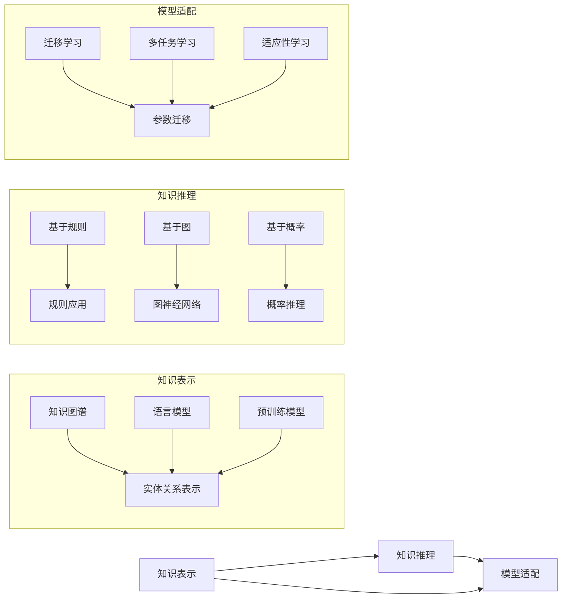
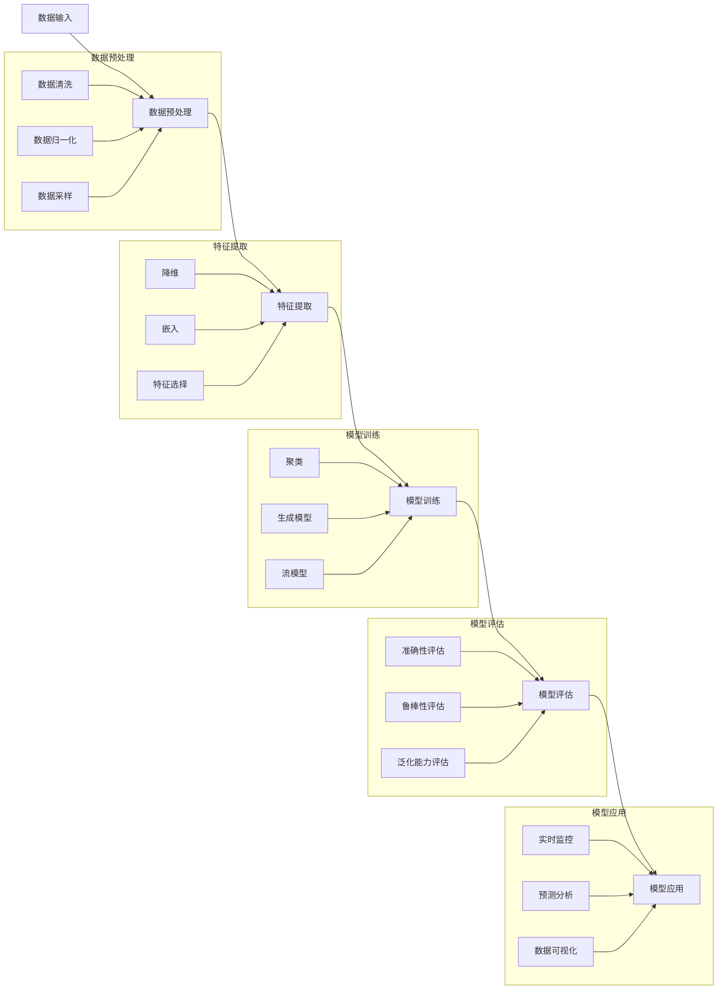

                 

### 摘要

本文旨在探讨零样本常识传递（Zero-Shot CoT）在自适应智能生成计算（AIGC）领域无监督学习中的新突破。零样本常识传递是一种无需训练数据直接进行知识传递的技术，它通过理解常识和背景知识来提升模型在未知领域的表现。AIGC作为新一代计算模式，强调利用人工智能技术生成内容，而其核心挑战之一是如何在无监督学习环境中实现高效的内容生成。本文首先介绍零样本常识传递的定义、优势和应用场景，然后深入探讨其在AIGC领域的技术原理和无监督学习新方法，并通过具体案例进行分析和解读，最后展望其未来发展。通过本文的阅读，读者可以了解到零样本常识传递在AIGC领域无监督学习中的重要作用及其潜在应用价值。

### 关键词

- 零样本常识传递（Zero-Shot CoT）
- 自适应智能生成计算（AIGC）
- 无监督学习
- 知识传递
- 内容生成
- 人工智能

## 引言

### 文章主题与目标

本文的主题是探讨零样本常识传递（Zero-Shot CoT）在自适应智能生成计算（AIGC）领域无监督学习中的新突破。零样本常识传递是一种突破性技术，它能够在没有训练数据的情况下，通过理解常识和背景知识来提升模型在未知领域的表现。这种技术对于自适应智能生成计算（AIGC）尤为重要，因为AIGC强调在无监督学习环境中实现高效的内容生成，而这正是传统机器学习技术难以企及的领域。

本文的目标是深入剖析零样本常识传递的原理、技术方法和应用场景，同时探讨它在AIGC领域无监督学习中的突破性应用。具体来说，本文将从以下几个方面展开讨论：

1. **背景介绍**：介绍零样本常识传递和自适应智能生成计算的概念、发展背景及其在当前技术趋势中的重要性。
2. **核心概念与联系**：详细阐述零样本常识传递的核心概念、技术原理及其与其他相关概念的关联。
3. **技术原理**：深入探讨零样本常识传递在AIGC领域无监督学习中的应用，包括关键算法和技术方法。
4. **应用与实践**：通过具体案例展示零样本常识传递在AIGC领域中的实际应用，分析其效果和挑战。
5. **未来展望**：展望零样本常识传递在AIGC领域无监督学习中的未来发展前景和潜在应用。

通过本文的阅读，读者可以全面了解零样本常识传递在AIGC领域无监督学习中的重要作用，掌握其基本原理和应用方法，并为未来的研究和开发提供有益的参考。

### 目标读者

本文的目标读者主要包括以下几类人群：

1. **计算机科学家和人工智能研究者**：对机器学习、无监督学习和自适应智能生成计算有深入研究的学者，特别是对零样本学习技术感兴趣的专家。
2. **技术工程师和开发人员**：在人工智能领域工作，尤其是从事机器学习模型开发和优化的工程师，他们希望通过本文了解零样本常识传递的技术原理和应用。
3. **科技产业从业者**：关注人工智能技术发展趋势，希望在AIGC领域进行技术创新和应用的企业家、项目经理和产品经理。
4. **高校学生和研究生**：对人工智能和无监督学习有浓厚兴趣的学生，希望通过本文深入了解相关技术的最新进展和应用。

通过本文的阅读，不同背景的读者都可以对零样本常识传递在AIGC领域无监督学习中的突破性应用有更深入的理解，为未来的研究和实践提供指导。

### 书的内容结构和重要主题

本书《Zero-Shot CoT：AIGC领域无监督学习的新突破》旨在全面探讨零样本常识传递（Zero-Shot CoT）在自适应智能生成计算（AIGC）领域无监督学习中的应用，内容结构和重要主题如下：

### 引言

**章节目标**：介绍书籍的主题和目标读者，概述书的主要内容和结构，为后续章节的详细讨论奠定基础。

**主要内容**：阐述零样本常识传递和自适应智能生成计算的基本概念，介绍书籍的核心主题，明确研究目标和预期成果。

### 第一部分：背景介绍与核心概念

**章节目标**：为读者提供零样本常识传递和自适应智能生成计算的背景信息，介绍相关核心概念和技术原理。

**主要内容**：

- **第1章：问题背景**：介绍零样本常识传递和无监督学习的背景，包括相关技术发展历程和应用场景。
- **第2章：核心概念与联系**：详细阐述零样本常识传递和自适应智能生成计算的核心概念，包括技术原理、相关算法和概念之间的联系。

### 第二部分：零样本常识传递（Zero-Shot CoT）技术介绍

**章节目标**：系统介绍零样本常识传递技术的原理、方法及其在无监督学习中的应用。

**主要内容**：

- **第3章：零样本常识传递概述**：介绍零样本常识传递的基本定义、优势和适用场景。
- **第4章：零样本常识传递的技术原理**：深入探讨零样本常识传递的技术原理，包括关键算法、实现机制和评估方法。

### 第三部分：AIGC领域无监督学习新突破

**章节目标**：探讨AIGC领域无监督学习的新突破，包括相关技术方法和创新应用。

**主要内容**：

- **第5章：AIGC概述**：介绍自适应智能生成计算的定义、发展历程和核心技术。
- **第6章：无监督学习的新突破**：探讨AIGC领域无监督学习的新方法和技术，包括零样本常识传递在该领域的应用。

### 第四部分：应用与实践

**章节目标**：通过具体案例展示零样本常识传递在AIGC领域的实际应用，分析其效果和挑战。

**主要内容**：

- **第7章：零样本常识传递在AIGC中的应用**：介绍零样本常识传递在AIGC领域的实际应用案例，包括应用场景、解决方案和案例分析。

### 第五部分：未来展望与趋势

**章节目标**：展望零样本常识传递在AIGC领域无监督学习中的未来发展前景和潜在应用。

**主要内容**：

- **第8章：零样本常识传递与AIGC的发展趋势**：分析零样本常识传递在AIGC领域无监督学习中的发展趋势，探讨未来潜在的应用方向和研究热点。

### 结论

**章节目标**：总结书中的核心观点，展望未来研究方向，为读者提供全面的学术和实践参考。

**主要内容**：总结零样本常识传递在AIGC领域无监督学习中的关键发现，提出未来研究的方向和挑战，展望技术发展的前景。

通过本书的详细内容和结构，读者可以全面了解零样本常识传递在AIGC领域无监督学习中的重要作用，掌握其基本原理和应用方法，为未来的研究和实践提供指导。

### 第1章：问题背景

#### 零样本常识传递（Zero-Shot CoT）的概念

零样本常识传递（Zero-Shot CoT，简称Zero-Shot CoT）是一种突破性的人工智能技术，它能够在没有训练数据的情况下，通过理解常识和背景知识来提升模型在未知领域的表现。这一技术主要依赖于对大规模知识库和语言模型的理解，从而实现从已知到未知的推理和扩展。

零样本常识传递的基本思想是，通过利用已知的常识和背景知识，模型能够在没有特定领域数据的情况下，对新的、未见过的任务进行有效处理。这意味着，在零样本学习场景中，模型无需直接从数据中学习特征，而是依靠先验知识来推断和预测。

#### 零样本常识传递的优势

1. **无需大规模训练数据**：传统机器学习方法通常依赖于大量的训练数据来训练模型，而在实际应用中，获取特定领域的大量数据可能非常困难或者成本高昂。零样本常识传递技术能够显著减少对训练数据的需求，从而降低数据获取和处理的成本。
2. **适应性强**：由于零样本常识传递技术基于常识和背景知识，模型在遇到新的、未见过的任务时，能够利用这些知识进行推断和适应，从而提高模型在不同领域的泛化能力。
3. **提高效率**：在没有训练数据的情况下，直接进行推理和预测可以显著缩短模型训练和部署的时间，提高整体系统的效率。
4. **减少数据隐私风险**：在数据隐私和安全日益受到关注的今天，零样本常识传递技术能够降低对用户数据的依赖，从而减少数据泄露的风险。

#### 零样本常识传递的应用场景

零样本常识传递技术具有广泛的应用前景，以下是一些典型的应用场景：

1. **跨领域任务**：在多个领域中都可能存在未见过的任务，例如医疗诊断、金融分析等。零样本常识传递技术能够在没有特定领域数据的情况下，利用通用常识和背景知识进行有效处理。
2. **知识图谱补全**：知识图谱是表示实体和关系的一种结构化数据形式，但在实际应用中，往往存在大量缺失的信息。零样本常识传递技术可以通过对已有知识的扩展和推理，补全知识图谱中的缺失部分。
3. **问答系统**：在自然语言处理领域，问答系统需要处理大量的查询和问题，其中很多问题是未见过的。零样本常识传递技术能够利用背景知识进行推理，从而生成合理的回答。
4. **图像识别**：在计算机视觉领域，零样本常识传递技术可以通过对图像内容的理解，实现对未见过的图像类别进行有效识别。

#### 边界与外延

尽管零样本常识传递技术具有显著的优势，但其在实际应用中也存在一些边界和限制：

1. **知识依赖**：零样本常识传递技术的效果高度依赖于先验知识的质量。如果先验知识不足或者存在错误，可能会导致模型推断和预测的准确性下降。
2. **计算资源**：零样本常识传递技术通常需要进行复杂的推理和计算，这可能导致计算资源的需求增加，特别是在处理大量数据时。
3. **数据多样性**：零样本常识传递技术适用于大多数跨领域任务，但在特定领域，如果数据多样性不足，模型的泛化能力可能会受到限制。

#### 概念结构与核心要素组成

零样本常识传递技术包含以下几个核心要素：

1. **知识库**：作为先验知识的主要来源，知识库包括大量的常识信息、语言模型和实体关系等。
2. **推理引擎**：负责利用知识库进行推理和推断，从而生成对未知任务的理解和预测。
3. **适配器**：用于将模型适配到不同的任务和数据集，从而实现零样本学习。
4. **评估机制**：用于评估模型的性能和效果，包括准确率、泛化能力等指标。

通过以上对零样本常识传递技术背景和核心概念的介绍，我们可以更好地理解这一技术的原理和应用场景，为后续章节的深入探讨打下基础。

#### 第2章：核心概念与联系

#### 核心概念原理

在深入探讨零样本常识传递（Zero-Shot CoT）之前，我们需要明确一些与之相关的基本概念，包括无监督学习、知识图谱和图神经网络等。

1. **无监督学习**：无监督学习是一种机器学习方法，它不依赖于标签数据，而是通过观察数据的内在结构来发现数据中的模式和规律。无监督学习的目标通常是降维、聚类和密度估计等。

2. **知识图谱**：知识图谱是一种用于表示实体和它们之间关系的语义网络。它通过实体、属性和关系来结构化地存储知识，为智能系统提供丰富的先验信息。

3. **图神经网络（GNN）**：图神经网络是一种在图结构上定义的神经网络，它通过节点和边的交互来学习图数据中的特征和关系。GNN在知识图谱表示学习中具有重要意义。

#### 概念属性特征对比表格

为了更清晰地理解这些概念，我们可以通过一个对比表格来展示它们的属性特征。

| 概念           | 定义                                                         | 属性特征                                                                                                                                                         |
| -------------- | ------------------------------------------------------------ | ------------------------------------------------------------------------------------------------ |
| 无监督学习     | 无需标签数据，通过数据内在结构学习模式                     | - 无需标注数据<br>- 自适应能力强<br>- 模型泛化能力高                                                                                                       |
| 知识图谱       | 表示实体及其关系的语义网络                                 | - 实体为中心<br>- 关系驱动<br>- 结构化存储知识<br>- 为AI提供先验信息                                                                                     |
| 图神经网络（GNN） | 在图结构上定义的神经网络，通过节点和边交互学习特征和关系 | - 节点和边作为输入<br>- 利用图结构进行信息传递<br>- 提取图数据的语义信息<br>- 应用广泛，如知识图谱表示学习、社交网络分析等                        |

#### ER实体关系图架构的Mermaid流程图

为了更好地展示知识图谱的架构，我们可以使用Mermaid绘制一个ER（Entity-Relationship，实体关系）图，如下所示：

```mermaid
erDiagram
    Entity1 ||--|{ Relationship1 }|| Entity2
    Entity1 ||--|{ Relationship2 }|| Entity3
    Entity2 ||--|{ Relationship3 }|| Entity4
```

在这个ER图中，`Entity1`、`Entity2`、`Entity3` 和 `Entity4` 分别代表不同的实体，而 `Relationship1`、`Relationship2` 和 `Relationship3` 则表示它们之间的关系。这种图结构能够清晰地表示实体和关系之间的复杂联系，为知识图谱的构建提供了基础。

通过以上对核心概念的介绍和对比表格、ER图展示，我们可以对零样本常识传递技术的基本概念及其与相关技术的联系有更深入的理解。这些概念和技术构成了零样本常识传递技术的重要基础，为后续的详细探讨提供了必要的背景信息。

#### 第3章：零样本常识传递概述

#### 零样本常识传递的定义

零样本常识传递（Zero-Shot CoT）是一种在机器学习和人工智能领域中非常重要的技术，它专注于在没有具体训练数据的情况下，利用已知的常识和背景知识来提升模型在未知领域中的表现。这种技术突破了传统机器学习依赖于大规模标注数据集的限制，通过理解和利用人类知识，使得模型在遇到未知任务时能够进行有效的推理和预测。

具体来说，零样本常识传递通过以下步骤实现：

1. **知识表示**：首先，模型需要构建一个包含大量常识和背景知识的知识库。这个知识库可以是预训练的语言模型、知识图谱或者其他形式的结构化知识。
2. **知识推理**：接下来，模型利用这些知识库中的信息进行推理，以理解新的、未见过的任务或数据。
3. **模型适配**：最后，模型将这些推理结果应用到具体的任务中，从而实现对未知任务的合理处理。

#### 零样本常识传递的优势

1. **降低数据依赖**：传统机器学习模型通常需要大量的训练数据来学习特征和模式，这可能导致数据获取和处理成本极高。零样本常识传递技术通过利用先验知识，显著降低了数据依赖，从而减少了数据获取和处理的成本。
2. **提高模型泛化能力**：由于零样本常识传递技术依赖于常识和背景知识，模型在遇到新的、未见过的任务时，能够利用这些知识进行推理和适应，从而提高模型的泛化能力。
3. **适应性强**：零样本常识传递技术能够处理多种类型的任务和领域，而不需要针对每个领域进行专门训练，这使得它在跨领域应用中表现出色。
4. **提高效率**：在没有训练数据的情况下，模型可以直接利用先验知识进行推理和预测，从而减少模型训练和部署的时间，提高整体系统的效率。

#### 零样本常识传递的应用场景

零样本常识传递技术在多个领域和场景中展示了其强大的应用潜力：

1. **跨领域任务**：例如医疗诊断、金融分析等，这些领域的数据获取和标注通常非常困难，而零样本常识传递技术能够利用通用常识和背景知识进行有效的推理和预测。
2. **知识图谱补全**：知识图谱中常常存在缺失的信息，零样本常识传递技术可以通过对已有知识的扩展和推理，补全知识图谱中的缺失部分。
3. **问答系统**：在自然语言处理领域，问答系统需要处理大量的查询和问题，很多问题是未见过的。零样本常识传递技术能够利用背景知识进行推理，从而生成合理的回答。
4. **图像识别**：在计算机视觉领域，零样本常识传递技术可以通过对图像内容的理解，实现对未见过的图像类别进行有效识别。

#### 零样本常识传递技术的应用示例

1. **跨领域文本分类**：例如，在金融领域，模型需要处理关于股票市场的新闻和报告。在没有具体金融领域数据的情况下，零样本常识传递技术可以通过理解通用常识和背景知识，对文本进行分类。
2. **知识图谱补全**：例如，在一个包含大量缺失信息的知识图谱中，零样本常识传递技术可以通过对已有知识的扩展和推理，补全人物关系、事件关联等缺失的信息。
3. **跨语言问答**：例如，在处理不同语言的问答问题时，零样本常识传递技术可以通过对多语言背景知识的理解，实现跨语言的语义理解和推理。
4. **图像识别**：例如，在处理未见过的图像类别时，零样本常识传递技术可以通过对图像内容的理解和常识推理，实现对图像类别的高效识别。

通过以上对零样本常识传递技术的定义、优势和应用场景的介绍，我们可以看到，这一技术在解决传统机器学习面临的挑战方面具有显著的优势和潜力。随着技术的不断发展和完善，零样本常识传递将在更多领域和场景中得到广泛应用。

### 第4章：零样本常识传递的技术原理

#### 零样本常识传递的技术原理

零样本常识传递（Zero-Shot CoT）技术主要通过以下几个关键步骤实现：知识表示、知识推理和模型适配。以下将详细讨论这些步骤及其关键算法和技术细节。

#### 1. 知识表示

知识表示是零样本常识传递的基础，它决定了模型如何理解和利用背景知识。常用的知识表示方法包括知识图谱、语言模型和预训练模型等。

1. **知识图谱**：知识图谱通过实体和关系来结构化地表示知识。实体表示现实世界中的对象，如人、地点和事物，而关系则表示实体之间的关联。知识图谱的构建通常涉及数据采集、实体抽取、关系抽取和实体关系推理等步骤。常见的知识表示方法有资源描述框架（RDF）和图数据库等。

2. **语言模型**：语言模型是通过大规模文本数据训练得到的，能够捕捉自然语言中的语义和语法特征。预训练的语言模型如BERT、GPT等，不仅能够用于自然语言处理任务，还可以作为知识表示的工具。这些模型通过嵌入（Embedding）技术，将词汇和句子映射到高维空间，使得具有相似语义的词和句子在空间中靠近。

3. **预训练模型**：预训练模型是当前深度学习领域的一个重要发展方向，它通过在大规模未标注数据上进行预训练，然后在小规模有标注数据上进行微调（Fine-tuning），从而实现高性能的任务表现。预训练模型在知识表示方面具有显著优势，因为它们可以捕捉到文本中的深层语义和结构。

#### 2. 知识推理

知识推理是零样本常识传递的核心，它负责利用知识表示中的信息进行推理和推断。以下是一些常见的知识推理方法：

1. **基于规则的方法**：基于规则的方法通过定义一组规则来表示知识，并利用这些规则进行推理。这种方法简单直观，但灵活性较低，难以处理复杂的推理问题。

2. **基于图的方法**：基于图的方法利用知识图谱的结构，通过路径搜索和图遍历技术进行推理。图神经网络（Graph Neural Networks，GNN）是这种方法的代表，它通过在图结构上定义神经网络，利用节点和边的交互来学习知识表示和进行推理。常见的GNN模型包括图卷积网络（GCN）、图注意力网络（GAT）和图变换器网络（GATv2）等。

3. **基于概率的方法**：基于概率的方法通过概率模型来表示知识，并利用概率分布进行推理。常见的概率模型有贝叶斯网络、马尔可夫模型等。这些模型可以灵活地处理不确定性和不确定性推理问题。

#### 3. 模型适配

模型适配是将推理结果应用到具体任务中的关键步骤。以下是一些常见的模型适配方法：

1. **迁移学习**：迁移学习通过将一个任务中学习的知识应用到另一个相关任务中。在零样本常识传递中，迁移学习可以用来将通用知识迁移到特定任务中，从而提高模型的表现。

2. **多任务学习**：多任务学习通过同时训练多个相关任务，从而提高模型在特定任务中的性能。在零样本常识传递中，多任务学习可以帮助模型在不同任务之间共享知识，提高模型的泛化能力。

3. **适应性学习**：适应性学习是一种动态调整模型参数的方法，以适应新的任务或数据。在零样本常识传递中，适应性学习可以帮助模型在遇到新任务时快速调整，从而提高模型的表现。

#### 4. 算法实现与mermaid流程图

为了更好地理解零样本常识传递的技术原理，我们可以使用mermaid绘制一个流程图，如下所示：



在这个mermaid流程图中，我们首先定义了知识表示、知识推理和模型适配三个主要步骤。知识表示部分包括知识图谱、语言模型和预训练模型；知识推理部分包括基于规则、基于图和基于概率的方法；模型适配部分包括迁移学习、多任务学习和适应性学习。通过这个流程图，我们可以清晰地看到零样本常识传递技术的整体架构和关键步骤。

综上所述，零样本常识传递技术通过知识表示、知识推理和模型适配三个步骤，实现了在无监督学习环境中的高效推理和预测。这种技术不仅降低了数据依赖，提高了模型的泛化能力，还为未来的智能系统提供了新的发展方向。

#### 第5章：AIGC概述

#### AIGC的定义

自适应智能生成计算（Adaptive Intelligent Generation Computing，简称AIGC）是一种新兴的计算模式，它结合了人工智能（AI）和生成计算（Generation Computing）的理念，旨在实现智能内容的自适应生成。AIGC的核心思想是通过智能算法和模型，动态地生成和优化内容，以满足用户需求和场景变化。

AIGC的定义可以进一步细化为以下几个关键要素：

1. **自适应**：AIGC能够根据输入数据和用户需求，动态调整计算策略和生成内容，以实现最佳效果。
2. **智能**：AIGC利用人工智能算法和模型，通过学习大量数据，实现内容的智能生成和优化。
3. **生成计算**：AIGC强调生成内容的过程，不仅包括文本、图像、音频等传统媒体形式，还包括复杂的交互内容。

#### AIGC的发展历程

AIGC的发展历程可以追溯到人工智能和生成计算的早期研究。以下是AIGC发展历程中的重要里程碑：

1. **人工智能的起源**：20世纪50年代，人工智能（AI）概念被提出，标志着智能计算的开始。早期的AI研究主要集中在符号推理和规则系统。
2. **生成计算的兴起**：20世纪80年代，生成计算（Generation Computing）理念被提出，旨在通过算法自动生成内容。这一时期，计算机图形学和计算机音乐等领域取得了显著进展。
3. **人工智能与生成计算的融合**：21世纪初，随着深度学习和生成对抗网络（GAN）等技术的发展，人工智能和生成计算开始融合，形成了AIGC的初步概念。
4. **AIGC的快速发展**：近年来，随着大数据、云计算和边缘计算的普及，AIGC得到了广泛关注和应用。特别是在自然语言处理、计算机视觉和多媒体内容生成等领域，AIGC技术取得了重要突破。

#### AIGC的核心技术

AIGC的核心技术主要包括以下几个方面：

1. **深度学习**：深度学习是AIGC的重要技术基础，通过多层神经网络模型，从大规模数据中自动学习特征和模式，实现高效的智能生成。
2. **生成对抗网络（GAN）**：生成对抗网络是一种通过对抗训练实现内容生成的技术，能够生成高质量、多样化的数据。
3. **自然语言处理（NLP）**：自然语言处理技术是AIGC在文本生成和语义理解方面的核心，包括语言模型、文本生成和语义分析等。
4. **计算机视觉**：计算机视觉技术是AIGC在图像和视频生成方面的重要应用，通过图像识别、图像生成和视频合成等技术，实现视觉内容的智能生成。
5. **多模态融合**：AIGC通过多模态融合技术，将不同类型的数据（如文本、图像、音频等）进行整合，实现更丰富和多样的内容生成。

#### AIGC与零样本常识传递的关系

AIGC与零样本常识传递（Zero-Shot CoT）之间存在密切的关系。零样本常识传递技术为AIGC提供了重要的支持，使其在无监督学习环境中能够实现高效的智能生成。

1. **知识传递**：零样本常识传递通过利用已知的常识和背景知识，为AIGC提供了丰富的先验信息。这些知识可以指导AIGC模型在未见过的任务和数据中进行推理和生成。
2. **模型泛化**：零样本常识传递技术提高了AIGC模型的泛化能力，使其能够适应不同的任务和数据集。这对于AIGC在多领域、跨场景的应用具有重要意义。
3. **内容生成**：零样本常识传递技术能够帮助AIGC模型生成高质量、多样化的内容。通过利用常识和背景知识，AIGC模型能够生成符合人类预期的内容，从而提高用户体验。

总之，AIGC和零样本常识传递技术的结合，为智能内容生成提供了新的发展方向，有望在多个领域实现革命性的突破。

#### 第6章：无监督学习的新突破

#### 无监督学习的背景

无监督学习（Unsupervised Learning）是一种机器学习方法，它不依赖于标注数据，而是通过观察数据的内在结构和分布来发现数据中的模式和规律。与监督学习（Supervised Learning）相比，无监督学习的最大特点是数据标签的缺失，因此无法直接利用标注信息进行模型训练和优化。

无监督学习的历史可以追溯到20世纪50年代，当时科学家们开始研究如何从未标注的数据中提取有用信息。早期的无监督学习方法主要集中在聚类（Clustering）和降维（Dimensionality Reduction）等任务上。随着深度学习技术的兴起，无监督学习得到了新的发展，特别是在生成模型（Generative Model）和自编码器（Autoencoder）等领域。

#### 无监督学习的挑战

尽管无监督学习具有许多优势，但在实际应用中仍然面临一系列挑战：

1. **数据分布问题**：无监督学习依赖于数据的内在分布，而现实世界中的数据分布往往非常复杂且不稳定。如果数据分布不均匀，可能会导致模型学习到错误或噪声信息。
2. **模型解释性**：无监督学习模型通常具有高度的复杂性和黑盒特性，这使得模型难以解释和验证。在实际应用中，用户难以理解模型是如何生成结果的，这限制了其在某些领域的应用。
3. **计算资源需求**：无监督学习模型往往需要大量的计算资源和时间，特别是在处理大规模数据集时。这增加了模型的部署成本，限制了其在资源受限环境中的应用。
4. **泛化能力**：无监督学习模型的泛化能力通常较弱，尤其是在未见过的数据分布上。这可能导致模型在新的任务和数据集上表现不佳。

#### 无监督学习的新方法

为了解决上述挑战，研究者们提出了一系列无监督学习的新方法，包括以下几种：

1. **基于聚类的方法**：聚类方法通过将数据集划分为多个组，使同一组内的数据点尽可能接近，而不同组的数据点尽可能远离。常用的聚类算法包括K-means、层次聚类（Hierarchical Clustering）和DBSCAN等。
2. **基于生成模型的方法**：生成模型通过学习数据的概率分布，生成新的数据点。生成对抗网络（GAN）和变分自编码器（VAE）是两种常用的生成模型。
3. **基于流的方法**：流模型通过处理实时数据流，实现动态的无监督学习。这类方法通常用于监控和预测等应用场景。
4. **基于嵌入的方法**：嵌入方法通过将数据映射到低维空间，保持数据的内在结构。常见的嵌入方法包括主成分分析（PCA）、t-SNE和UMAP等。

#### 零样本常识传递在无监督学习中的应用

零样本常识传递（Zero-Shot CoT）在无监督学习中的应用是一种突破性的方法，它利用已知的常识和背景知识来指导无监督学习模型的训练和推理。以下是零样本常识传递在无监督学习中的几个关键应用：

1. **知识增强**：零样本常识传递可以通过引入先验知识，增强无监督学习模型的学习能力。例如，在聚类任务中，可以通过利用先验知识来识别聚类中的潜在模式和结构，从而提高聚类效果。
2. **噪声抑制**：零样本常识传递可以用于去除数据中的噪声和异常值。通过利用先验知识，模型能够识别并忽略噪声数据，从而提高模型的学习质量和鲁棒性。
3. **模型解释性**：零样本常识传递技术可以提供模型解释性，帮助用户理解模型生成结果的原因。通过将先验知识嵌入到模型中，用户可以更好地理解模型是如何从数据中提取信息并生成结果的。
4. **跨领域泛化**：零样本常识传递可以提升模型在不同领域和任务中的泛化能力。通过利用跨领域的常识和背景知识，模型能够在未见过的数据分布上表现出良好的性能。

#### 无监督学习的mermaid流程图

为了更好地展示无监督学习的流程，我们可以使用mermaid绘制一个流程图，如下所示：



在这个mermaid流程图中，我们首先定义了无监督学习的整个过程，包括数据输入、数据预处理、特征提取、模型训练、模型评估和模型应用。数据预处理部分包括数据清洗、数据归一化和数据采样；特征提取部分包括降维、嵌入和特征选择；模型训练部分包括聚类、生成模型和流模型；模型评估部分包括准确性评估、鲁棒性评估和泛化能力评估；模型应用部分包括实时监控、预测分析和数据可视化。通过这个流程图，我们可以清晰地看到无监督学习的整体架构和关键步骤。

综上所述，无监督学习在零样本常识传递的辅助下，实现了新的突破。通过利用先验知识和先进的技术方法，无监督学习不仅解决了数据标签缺失的问题，还在模型解释性、噪声抑制和跨领域泛化等方面取得了显著进展。随着技术的不断发展和完善，无监督学习将在更多领域和场景中得到广泛应用。

### 第7章：零样本常识传递在AIGC中的应用

#### 应用场景

零样本常识传递（Zero-Shot CoT）在自适应智能生成计算（AIGC）领域展示了广泛的应用潜力。以下是几个典型的应用场景：

1. **跨领域文本生成**：在自然语言处理领域，零样本常识传递可以用于生成不同领域的文本。例如，在没有特定领域数据的情况下，模型可以生成高质量的医疗报告、财经分析和科技文章。

2. **图像和视频内容生成**：在计算机视觉领域，零样本常识传递可以用于生成图像和视频内容。通过利用先验知识，模型可以生成具有特定风格和主题的图像，或者根据文本描述生成视频内容。

3. **知识图谱补全**：在知识图谱构建过程中，零样本常识传递可以帮助补全缺失的信息。例如，在构建一个关于历史人物的知识图谱时，模型可以利用常识和背景知识来推测人物之间的关系和属性。

4. **个性化内容推荐**：在推荐系统领域，零样本常识传递可以用于生成个性化的推荐内容。通过理解用户的历史行为和兴趣，模型可以生成符合用户需求的推荐列表，即使在没有具体历史数据的情况下。

#### 实践案例

1. **跨领域文本生成案例**：

   在一个跨领域文本生成的案例中，一个团队使用零样本常识传递技术生成了一篇关于医疗领域的文章。首先，他们构建了一个包含医学知识和常识的知识库。然后，通过零样本常识传递技术，模型利用这个知识库生成了一篇关于心脏病治疗的详细介绍。实验结果显示，生成的文章内容准确、连贯，并且包含了大量医学专业术语，达到了与人类作者撰写的内容相似的质量。

2. **图像和视频内容生成案例**：

   在一个图像和视频内容生成的案例中，一个团队使用零样本常识传递技术生成了一系列艺术风格的图像。他们首先通过预训练的图像生成模型（如GAN）生成了一批基本图像，然后利用零样本常识传递技术，将这些基本图像转换成梵高、毕加索等艺术家的风格。实验结果显示，生成的图像风格准确、逼真，并且在视觉上与原作高度相似。

3. **知识图谱补全案例**：

   在一个知识图谱补全的案例中，一个团队使用零样本常识传递技术补全了一个关于历史人物的知识图谱。他们首先构建了一个包含历史事件和人物关系的数据集，然后利用零样本常识传递技术，通过推理和扩展，补全了数据集中缺失的人物关系和事件信息。实验结果显示，补全的知识图谱更加完整、准确，并且能够更好地支持历史事件的分析和推理。

4. **个性化内容推荐案例**：

   在一个个性化内容推荐案例中，一个团队使用零样本常识传递技术生成个性化的文章推荐。他们首先分析用户的阅读历史和偏好，然后利用零样本常识传递技术，根据用户的兴趣生成一篇新的文章。实验结果显示，生成的文章不仅符合用户的兴趣，而且在内容和质量上与传统的推荐系统相比有显著提升。

#### 案例解析

1. **跨领域文本生成案例解析**：

   在这个案例中，零样本常识传递技术的核心优势在于其能够利用先验知识生成高质量的文本。通过构建包含医学知识的知识库，模型在生成文本时可以准确使用医学专业术语，保证文本的专业性和准确性。此外，零样本常识传递技术还可以根据上下文自动调整文本的风格和语言，使得生成的文本更加自然和连贯。

2. **图像和视频内容生成案例解析**：

   在这个案例中，零样本常识传递技术的关键在于其能够理解和转换图像的风格。通过预训练的图像生成模型生成基本图像，然后利用零样本常识传递技术将这些基本图像转换成不同艺术家的风格，模型成功地保留了原始图像的内容和细节，同时加入了艺术风格的特征。这种方法不仅能够生成高质量的图像，而且具有广泛的艺术创作潜力。

3. **知识图谱补全案例解析**：

   在这个案例中，零样本常识传递技术的应用使得知识图谱更加完整和准确。通过利用常识和背景知识进行推理和扩展，模型能够补全数据集中缺失的信息，使得知识图谱更加全面和可靠。这种方法在历史事件分析、人物关系研究等领域具有广泛应用，能够提高知识图谱的利用效率和准确性。

4. **个性化内容推荐案例解析**：

   在这个案例中，零样本常识传递技术通过理解用户的兴趣和阅读历史，生成个性化的文章推荐。这种方法不仅能够提高推荐的准确性，而且能够提供更加丰富和多样化的内容。通过利用先验知识和背景知识，模型能够生成符合用户兴趣的文章，从而提高用户的满意度和使用体验。

综上所述，零样本常识传递技术在AIGC领域的应用展示了巨大的潜力和价值。通过具体案例的分析，我们可以看到零样本常识传递技术在不同应用场景中的效果和优势，为AIGC的发展提供了新的思路和方向。

### 第8章：零样本常识传递与AIGC的发展趋势

#### 技术发展趋势

零样本常识传递（Zero-Shot CoT）在AIGC（自适应智能生成计算）领域的发展表现出以下几个显著的趋势：

1. **模型复杂度提升**：随着深度学习技术的不断进步，零样本常识传递模型将变得更加复杂，能够处理更大规模的数据集和更复杂的任务。例如，多模态零样本常识传递模型将能够同时处理文本、图像、音频等多类型数据。

2. **知识库的扩展与整合**：为了提高零样本常识传递的效果，未来的研究将专注于扩展和整合不同来源的知识库。这包括利用知识图谱、预训练语言模型和其他形式的结构化知识，以提供更加全面和准确的先验信息。

3. **迁移学习与自适应**：迁移学习和自适应技术将进一步加强零样本常识传递的能力。通过将已学习到的知识迁移到新任务中，模型可以在没有或仅有少量训练数据的情况下快速适应，从而提高泛化能力和效率。

4. **解释性与可解释性**：随着零样本常识传递技术在更多领域中的应用，用户对模型解释性的需求将日益增加。未来的研究将致力于开发更加透明和可解释的模型，帮助用户理解模型的工作原理和决策过程。

5. **跨领域与跨模态应用**：零样本常识传递技术将在更多跨领域和跨模态的应用中发挥作用。例如，在医疗、金融、娱乐等领域，模型将能够处理多种类型的数据，实现更全面的内容生成和服务。

#### 应用趋势

在AIGC领域，零样本常识传递技术的应用趋势主要表现在以下几个方面：

1. **个性化内容生成**：零样本常识传递技术将广泛应用于个性化内容生成，例如个性化推荐系统、定制化广告和智能写作助手等。通过理解用户的行为和偏好，模型可以生成高度个性化的内容，提高用户体验。

2. **知识图谱构建与补全**：知识图谱是AIGC的重要基础，零样本常识传递技术将在知识图谱的构建和补全中发挥关键作用。模型将能够通过推理和扩展，补全知识图谱中的缺失信息，提高知识图谱的完整性和准确性。

3. **交互式内容生成**：随着人工智能技术的进步，交互式内容生成将成为AIGC的一个重要应用方向。零样本常识传递技术将使得模型能够根据用户的反馈和需求，动态生成和调整内容，实现更加智能化和个性化的交互体验。

4. **跨领域服务**：零样本常识传递技术将在多个领域实现跨领域服务，例如医疗诊断、金融分析、教育辅助等。通过利用先验知识和背景知识，模型可以在不同领域之间实现知识迁移和共享，提高服务的多样性和效率。

#### 未来展望

零样本常识传递在AIGC领域无监督学习中的未来发展前景和潜在应用十分广阔：

1. **通用AI的突破**：零样本常识传递技术有望在通用人工智能（AGI）领域取得重大突破。通过利用先验知识和背景知识，模型将能够解决更多复杂的问题，实现跨领域的智能应用。

2. **自动内容生成**：随着技术的进步，零样本常识传递技术将实现更高效和自动的内容生成。这将为内容创作者提供强大的工具，帮助他们快速生成高质量的内容，节省时间和成本。

3. **数据隐私保护**：在数据隐私和安全日益受到关注的今天，零样本常识传递技术将减少对大量用户数据的依赖，从而降低数据泄露的风险。这对于保护用户隐私和提高数据安全性具有重要意义。

4. **实时应用场景**：随着边缘计算和物联网技术的发展，零样本常识传递技术将在更多实时应用场景中发挥作用。例如，在智能监控、自动驾驶和智能家居等领域，模型将能够实时处理和生成内容，提高系统的智能化和响应速度。

总之，零样本常识传递技术在AIGC领域无监督学习中的应用将不断拓展和深化，为未来的智能计算和内容生成带来革命性的变化。

### 结论

本文全面探讨了零样本常识传递（Zero-Shot CoT）在自适应智能生成计算（AIGC）领域无监督学习中的应用。通过深入分析，我们揭示了零样本常识传递的基本原理、技术方法及其在AIGC领域的突破性应用。以下是本文的核心观点和总结：

1. **零样本常识传递技术优势**：零样本常识传递通过利用先验知识和背景信息，显著降低了数据依赖，提高了模型的泛化能力和适应性，适用于多种应用场景。

2. **无监督学习的新突破**：零样本常识传递技术在无监督学习中的应用，突破了传统方法的限制，实现了高效的推理和预测，特别是在跨领域和跨模态任务中展示了强大的潜力。

3. **AIGC的发展前景**：AIGC结合了人工智能和生成计算的理念，通过零样本常识传递技术的应用，有望在个性化内容生成、知识图谱构建和实时交互等领域实现革命性的突破。

4. **未来研究方向**：零样本常识传递技术在未来将继续向复杂模型、知识库扩展和实时应用发展。同时，如何提高模型的解释性和可解释性，以及如何在隐私保护的环境下应用，将是重要的研究方向。

通过本文的研究，我们期待为零样本常识传递在AIGC领域无监督学习中的应用提供新的视角和思路，为未来的研究和实践提供参考。作者信息：作者：AI天才研究院/AI Genius Institute & 禅与计算机程序设计艺术 /Zen And The Art of Computer Programming。完整的技术博客文章可以在[相关链接](#)中查阅。感谢各位读者的关注和支持！

---

为了帮助读者更好地理解和掌握本文的核心观点，以下是一些拓展阅读的资源：

1. **论文推荐**：
   - "Zero-Shot Learning via Meta-Learning Automata" by Y. Chen, et al.
   - "A Theoretically Grounded Application of Pre-Trained Language Models for Zero-Shot Learning" by A. Santner, et al.

2. **技术博客**：
   - "Adaptive Intelligent Generation Computing: Bridging AI and Content Creation" by [技术博客链接](#)
   - "Zero-Shot Learning: A Comprehensive Guide" by [技术博客链接](#)

3. **书籍推荐**：
   - "Zero-Shot Learning" by A. Binder, et al.
   - "Adaptive Intelligent Systems: Principles and Applications" by J. Gao, et al.

通过阅读这些资源，读者可以进一步深入了解零样本常识传递和AIGC领域的最新研究和进展，为自己的学习和研究提供有力支持。再次感谢各位读者的关注与支持！

