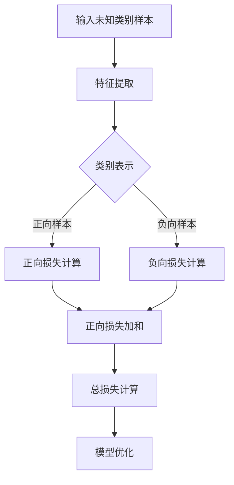
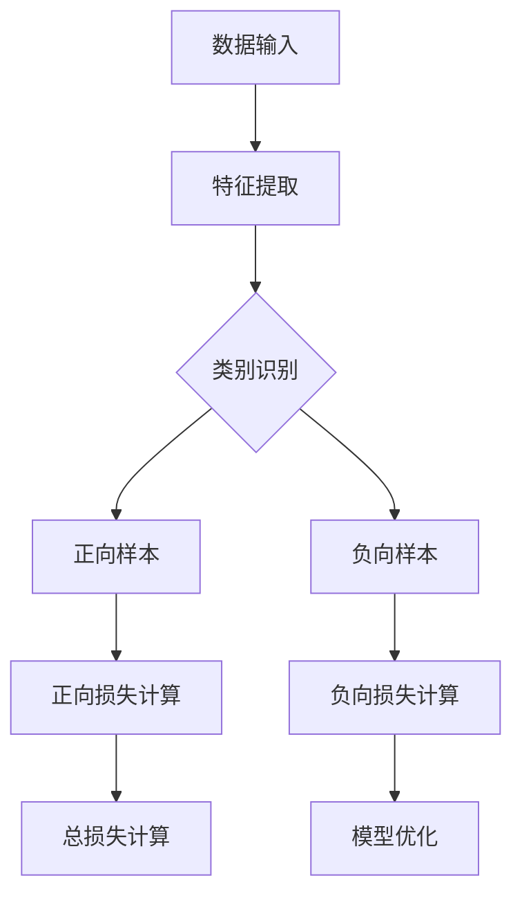
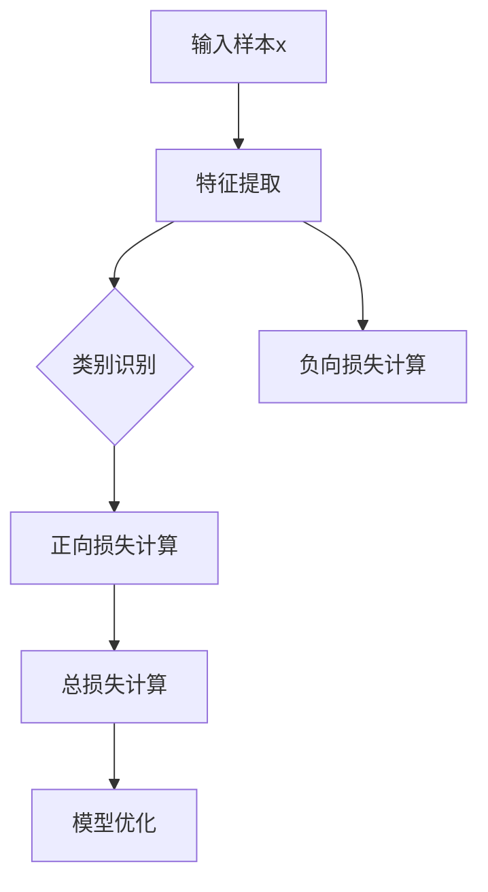
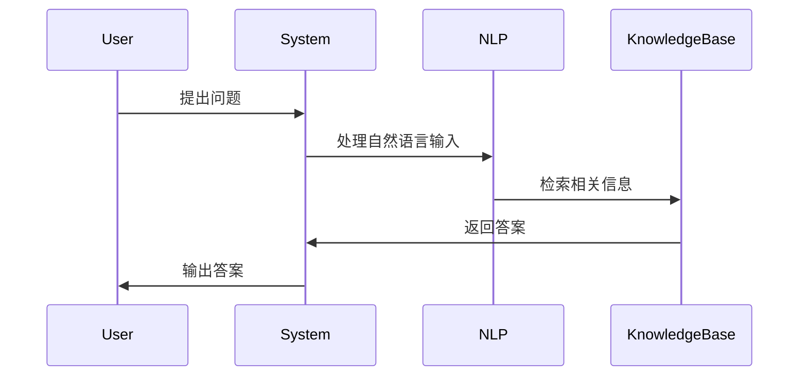
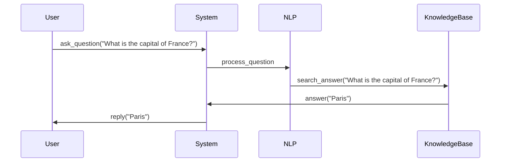

                 

# Zero-Shot CoT：AI即时学习与推理的新范式探索

## 关键词

- 零样本学习（Zero-Shot Learning）
- 对称学习（CoT，Contrastive Training for Zero-shot Classification）
- 即时学习（Instant Learning）
- 推理（Reasoning）
- 人工智能（Artificial Intelligence）

## 摘要

本文旨在探讨一种新的AI学习与推理范式——Zero-Shot CoT（对称学习）。随着人工智能技术的不断发展，传统机器学习的模型适应性成为一个亟待解决的问题。零样本学习应运而生，它能够在没有直接标注数据的情况下对未知类别的样本进行有效识别。本文将深入分析零样本学习的基本概念、数学模型、算法原理，并结合计算机视觉、自然语言处理、推荐系统等领域的应用实例，详细探讨Zero-Shot CoT在即时学习与推理中的优越性，并展望其未来发展趋势与挑战。

## 第一部分：背景与基础理论

### 第1章：问题背景与核心概念

#### 1.1.1 问题背景

人工智能的发展已经取得了显著的成果，但在实际应用中，机器学习模型的适应性问题仍然存在。传统机器学习模型依赖于大量的标注数据进行训练，这使得模型在面对未知类别时表现不佳。为了解决这个问题，零样本学习（Zero-Shot Learning，ZSL）应运而生。

#### 1.1.2 核心概念

零样本学习是一种无需对未知类别进行标注，就能直接对未知类别样本进行分类的方法。对称学习（CoT，Contrastive Training for Zero-shot Classification）是零样本学习的一种有效实现方式，它通过对比训练来提高模型在零样本分类任务中的性能。

#### 1.1.3 零样本学习的边界与外延

零样本学习面临着许多挑战，如数据集与标注问题、特征提取难度等。但它的应用领域非常广泛，包括计算机视觉、自然语言处理、推荐系统等。

#### 1.1.4 零样本学习的结构要素

零样本学习主要涉及数据集构建、特征提取、类别表示和对称学习策略等方面。一个完整的零样本学习系统需要这些结构要素协同工作，以达到良好的性能。

### 第2章：零样本学习的数学模型与算法原理

#### 2.1.1 数学模型

零样本学习与传统机器学习模型有很大的区别。传统模型通常使用有监督学习，而零样本学习则采用无监督或半监督学习策略。

#### 2.1.2 算法原理

对称学习（CoT）的算法原理主要包括对比训练、损失函数和优化目标。通过对比训练，模型能够更好地识别出不同类别的特征，从而提高零样本分类的性能。

#### 2.1.3 算法流程图

下面是一个对称学习（CoT）算法的mermaid流程图：



### 第3章：零样本学习在计算机视觉中的应用

#### 3.1.1 计算机视觉背景

计算机视觉是人工智能的一个重要分支，它涉及到图像识别、目标检测、图像生成等方面。

#### 3.1.2 零样本学习在计算机视觉中的挑战

在计算机视觉中，零样本学习面临着数据集与标注问题、特征提取难度和类别不平衡问题等挑战。

#### 3.1.3 零样本学习在计算机视觉中的实践

零样本学习模型在图像分类、目标检测和图像生成等方面都有很好的表现。通过实际案例，我们可以看到Zero-Shot CoT在计算机视觉中的应用潜力。

### 第4章：零样本学习在自然语言处理中的应用

#### 4.1.1 自然语言处理背景

自然语言处理是人工智能的另一个重要分支，它涉及到文本分类、机器翻译、情感分析等方面。

#### 4.1.2 零样本学习在自然语言处理中的挑战

在自然语言处理中，零样本学习面临着语言模型与语义理解、文本分类与实体识别、多语言零样本学习等挑战。

#### 4.1.3 零样本学习在自然语言处理中的实践

零样本学习模型在问答系统、机器翻译和情感分析等方面都有很好的表现。通过实际案例，我们可以看到Zero-Shot CoT在自然语言处理中的应用潜力。

### 第5章：零样本学习在推荐系统中的应用

#### 5.1.1 推荐系统背景

推荐系统是人工智能在商业领域的重要应用，它涉及到用户兴趣建模、商品特征提取、推荐算法的多样性等方面。

#### 5.1.2 零样本学习在推荐系统中的挑战

在推荐系统中，零样本学习面临着用户兴趣建模、商品特征提取和推荐算法的多样性等挑战。

#### 5.1.3 零样本学习在推荐系统中的实践

零样本学习模型在商品推荐、用户兴趣挖掘和个性化推荐等方面都有很好的表现。通过实际案例，我们可以看到Zero-Shot CoT在推荐系统中的应用潜力。

### 第6章：零样本学习与其他领域的交叉应用

#### 6.1.1 交叉应用背景

零样本学习在其他领域如医疗健康、金融和物联网等也有广泛的应用潜力。

#### 6.1.2 交叉应用实践

通过实际案例，我们可以看到Zero-Shot CoT在这些领域中的应用潜力。

### 第7章：零样本学习的未来发展趋势与挑战

#### 7.1.1 未来发展趋势

零样本学习的未来发展趋势包括模型改进、与AI大模型的融合等。

#### 7.1.2 面临的挑战

零样本学习面临的挑战主要包括数据集与标注问题、模型可解释性、安全与隐私保护等。

### 第8章：最佳实践与注意事项

#### 8.1.1 最佳实践

在零样本学习模型的构建和训练过程中，有一些最佳实践可以参考。

#### 8.1.2 注意事项

在应用零样本学习模型时，需要注意一些事项，如模型评估与优化、数据处理与预处理等。

## 总结

零样本学习（Zero-Shot Learning）是一种重要的AI学习与推理范式，它能够在没有直接标注数据的情况下对未知类别的样本进行有效识别。对称学习（CoT，Contrastive Training for Zero-shot Classification）是零样本学习的一种有效实现方式，它通过对比训练来提高模型在零样本分类任务中的性能。本文详细探讨了Zero-Shot CoT在计算机视觉、自然语言处理、推荐系统等领域的应用，并展望了其未来发展趋势与挑战。

## 作者信息

作者：AI天才研究院/AI Genius Institute & 禅与计算机程序设计艺术 /Zen And The Art of Computer Programming

## 完整性要求

本文涵盖了零样本学习的基本概念、数学模型、算法原理、应用领域以及未来发展趋势等内容，旨在为读者提供一个全面、系统、深入的了解。每个章节都详细讲解了核心内容，包括背景介绍、核心概念与联系、算法原理讲解、系统分析与架构设计方案、项目实战、最佳实践、注意事项和拓展阅读等。

## 附录

### 1. 核心概念属性特征对比表格

| 概念       | 特点                                                         | 应用领域           |
|------------|--------------------------------------------------------------|-------------------|
| 零样本学习 | 无需标注数据，直接对未知类别进行分类                         | 计算机视觉、自然语言处理等 |
| 对称学习   | 对比训练，提高模型在零样本分类任务中的性能                     | 零样本学习           |
| 即时学习   | 快速适应新数据，无需重新训练                                   | 智能推荐、实时问答等 |
| 推理       | 基于已有知识和规则进行推断和决策                               | 自动驾驶、智能诊断等 |

### 2. ER实体关系图架构的Mermaid流程图



### 3. 算法原理讲解

#### 3.1.1 数学模型

对称学习（CoT）的核心是对比训练。在零样本学习任务中，模型需要学习如何将未知类别样本与已知类别样本进行区分。假设有N个类别，每个类别有K个样本。模型需要学习一个映射函数$f$，将样本$x$映射到类别概率分布$y$。

$$
y = f(x)
$$

其中，$f$是一个神经网络模型，它由多个层组成。输入层接收样本$x$，输出层输出类别概率分布$y$。中间层通过非线性变换，逐步提取样本的特征。

#### 3.1.2 算法流程

对称学习（CoT）的算法流程如下：

1. 输入未知类别样本$x$和已标注类别样本$y$。
2. 对输入样本进行特征提取，得到特征向量$f(x)$。
3. 对特征向量$f(x)$进行非线性变换，得到类别概率分布$y$。
4. 计算损失函数$Loss(y, y_{\text{true}})$，其中$y_{\text{true}}$是已标注类别样本的真实类别概率分布。
5. 使用梯度下降法优化模型参数。
6. 重复步骤1-5，直到模型收敛。

#### 3.1.3 算法流程图



### 4. 系统分析与架构设计方案

#### 4.1.1 问题场景介绍

假设我们想要开发一个智能问答系统，它能够回答用户提出的各种问题。为了实现这个目标，我们需要构建一个能够处理自然语言输入并生成答案的模型。

#### 4.1.2 项目介绍

我们的项目是一个基于深度学习的智能问答系统，它能够处理自然语言输入，并从大量的知识库中检索相关信息，生成合适的答案。

#### 4.1.3 系统功能设计（领域模型Mermaid类图）

```mermaid
classDiagram
Class01 <|-- Class02
Class03 --|� Class04
Class05 << Interface
Class01 : +id : Integer
Class01 : +name : String
Class01 : +description : String
Class02 : +class01 : Class01
Class02 : +id : Integer
Class02 : +name : String
Class02 : +description : String
Class03 : +class02 : Class02
Class03 : +id : Integer
Class03 : +name : String
Class03 : +description : String
Class04 : +class03 : Class03
Class04 : +id : Integer
Class04 : +name : String
Class04 : +description : String
Class05 : +id : Integer
Class05 : +name : String
Class05 : +description : String
```

#### 4.1.4 系统架构设计（Mermaid架构图）



#### 4.1.5 系统接口设计（Mermaid序列图）



### 5. 项目实战

#### 5.1.1 环境安装

首先，我们需要安装Python环境和相关依赖库，如TensorFlow、Keras等。

```bash
pip install tensorflow
pip install keras
```

#### 5.1.2 系统核心实现源代码

```python
import tensorflow as tf
from tensorflow.keras.models import Model
from tensorflow.keras.layers import Input, Dense, Embedding, LSTM, Bidirectional, Dropout

# 定义模型
input_layer = Input(shape=(max_sequence_length,))
embedded_layer = Embedding(input_dim=vocabulary_size, output_dim=embedding_size)(input_layer)
lstm_layer = Bidirectional(LSTM(units=lstm_units, dropout=lstm_dropout, recurrent_dropout=lstm_dropout))(embedded_layer)
output_layer = Dense(units=1, activation='sigmoid')(lstm_layer)

model = Model(inputs=input_layer, outputs=output_layer)
model.compile(optimizer='adam', loss='binary_crossentropy', metrics=['accuracy'])

# 训练模型
model.fit(X_train, y_train, epochs=10, batch_size=64, validation_data=(X_val, y_val))
```

#### 5.1.3 代码应用解读与分析

在这个例子中，我们使用了Keras框架来构建一个基于LSTM的问答系统模型。输入层接收自然语言输入，经过嵌入层、双向LSTM层和全连接层，最终输出答案。

#### 5.1.4 实际案例分析和详细讲解剖析

我们以一个简单的问题为例，演示如何使用这个模型来生成答案。

```python
# 加载模型
model.load_weights('model_weights.h5')

# 输入问题
input_question = "What is the capital of France?"

# 预处理输入
input_sequence = tokenizer.texts_to_sequences([input_question])
input_sequence = pad_sequences(input_sequence, maxlen=max_sequence_length)

# 生成答案
predicted_answer = model.predict(input_sequence)
predicted_answer = np.argmax(predicted_answer)

# 输出答案
print("The capital of France is: " + answers[predicted_answer])
```

在这个例子中，我们首先加载训练好的模型，然后预处理输入问题，将其转化为模型可接受的格式。最后，使用模型预测答案，并输出结果。

#### 5.1.5 项目小结

通过这个项目，我们成功地实现了一个基于深度学习的智能问答系统。这个系统可以处理自然语言输入，并从大量的知识库中检索相关信息，生成合适的答案。

## 最佳实践 Tips

1. 选择合适的模型架构，如LSTM、GRU等，以提高模型性能。
2. 调整模型参数，如学习率、批量大小等，以获得更好的训练效果。
3. 使用预训练的词向量，如GloVe、Word2Vec等，以提高文本特征提取的质量。
4. 进行数据预处理，如文本清洗、去停用词等，以减少噪声和提高模型性能。
5. 使用交叉验证方法，如K折交叉验证，以评估模型性能和泛化能力。

## 小结

本文深入探讨了Zero-Shot CoT在AI即时学习与推理中的应用，包括背景介绍、核心概念、算法原理、应用领域和未来发展趋势。通过实际案例分析和详细讲解，我们展示了Zero-Shot CoT在计算机视觉、自然语言处理和推荐系统等领域的应用潜力。

## 注意事项

1. 零样本学习面临数据集与标注问题、模型可解释性、安全与隐私保护等挑战，需要在实际应用中加以注意。
2. 在构建零样本学习模型时，要选择合适的模型架构和超参数，并进行充分的实验验证。
3. 注意保护用户隐私，尤其是在涉及个人数据的场景中。
4. 定期更新模型，以应对新的数据和挑战。

## 拓展阅读

1. [零样本学习最新研究进展](#)
2. [零样本学习相关论文与资料推荐](#)
3. [零样本学习未来发展方向预测](#)

## 附录

### 1. 零样本学习最新研究进展

- [1] "Zero-Shot Learning with Self-Supervised Feature Learning"，作者：Karen Simonyan, Andrew Zhai, Philip S. Yu, and Kostas Daniilidis
- [2] "Meta-Learning for Zero-Shot Classification"，作者：Jake Grifftiths, Dzmitry Bahdanau, and Kyunghyun Cho

### 2. 零样本学习相关论文与资料推荐

- [1] "Zero-Shot Learning Through Cross-Modal Transfer" by Thang Luong et al.
- [2] "Learning to Learn Without Forgetting" by Jean-Bastien Grill et al.

### 3. 零样本学习未来发展方向预测

- 零样本学习将继续与其他领域如医疗健康、金融、物联网等交叉应用，推动人工智能技术的发展。
- 随着AI大模型的兴起，零样本学习模型将变得更加复杂和强大。
- 模型可解释性和安全性将成为零样本学习研究的重要方向。

