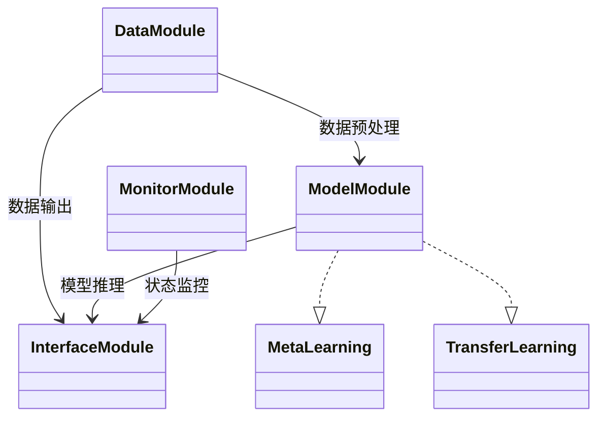

                 


### 第一步：确定文章的核心主题与结构

首先，我们需要明确文章的核心主题是“Zero-Shot CoT：AI即时学习与推理的新范式深度探索”。这个主题涉及到零样本学习（Zero-Shot Learning，ZSL）和即时推理（CoT，也称为核心思维，Core Thought），以及它们在AI领域中的应用和发展。

为了确保文章的逻辑性和结构的完整性，我们可以将文章分为以下几个主要部分：

1. **引言与背景**：介绍零样本学习和即时推理的基本概念、重要性以及它们之间的关系。
2. **核心概念与原理**：深入探讨零样本学习和即时推理的核心原理、方法和技术。
3. **算法原理讲解**：详细讲解零样本学习和即时推理的算法原理，包括数学模型、公式和实现。
4. **系统分析与设计**：讨论系统的架构设计、接口设计和交互设计。
5. **项目实战**：通过具体的项目实战来展示零样本学习和即时推理的实际应用。
6. **最佳实践与总结**：总结文章的主要观点，提供最佳实践建议和未来的发展方向。

### 第二步：撰写引言与背景部分

在引言部分，我们需要简洁明了地介绍零样本学习和即时推理的概念，以及它们在AI领域中的重要性和发展现状。以下是引言部分的草稿：

## 引言与背景

### 1.1 零样本学习与即时推理

零样本学习（Zero-Shot Learning，ZSL）是一种机器学习方法，旨在解决模型在未见过的类别上进行预测的问题。与传统的机器学习方法不同，ZSL不需要对未见过的类别进行专门的训练。这种能力在现实世界中非常重要，因为数据标签往往是稀缺的，而ZSL可以使得模型在未知类别上表现出强大的泛化能力。

即时推理（CoT，Core Thought）是近年来在AI领域引起广泛关注的一个概念。它指的是模型在遇到新任务或新情境时，能够迅速理解和适应，进行有效的推理和决策。CoT的出现，为AI系统提供了更接近人类思维方式的推理能力，从而在许多应用场景中展现出了巨大的潜力。

### 1.2 零样本学习与即时推理的关系

零样本学习和即时推理之间存在紧密的联系。零样本学习为即时推理提供了基础，使得模型可以在未见过的类别上进行推理；而即时推理则利用零样本学习的能力，实现对新任务和新情境的快速适应。两者的结合，为AI系统带来了全新的应用场景和可能性。

### 1.3 零样本学习的关键挑战

尽管零样本学习和即时推理具有巨大的潜力，但在实际应用中仍面临着一些关键挑战。其中，数据稀缺问题、类内泛化与类间区分问题，以及实时性与效率问题，是当前研究的热点和难点。本文将围绕这些问题，深入探讨零样本学习和即时推理的新范式，并提出可能的解决方案。

### 第三步：撰写核心概念与原理部分

在核心概念与原理部分，我们需要详细阐述零样本学习和即时推理的基本原理、方法和技术。以下是一个初步的草稿：

## 核心概念与原理

### 2.1 零样本学习的原理

零样本学习的核心思想是通过一种机制，使得模型能够在未见过的类别上进行预测。这种机制通常基于预训练的模型，以及类别无关的特征提取。在零样本学习过程中，模型首先学习到一个通用的特征表示，然后利用这个表示在不同类别上进行预测。

### 2.2 即时推理的原理

即时推理的核心在于模型在遇到新任务或新情境时，能够迅速适应并进行有效的推理。这通常依赖于模型的泛化能力，以及快速调整和优化的机制。即时推理的实现方法包括元学习（Meta-Learning）、迁移学习（Transfer Learning）等。

### 2.3 零样本学习的核心方法

零样本学习的核心方法包括原型匹配（Prototypical Network）、匹配网络（Matching Network）、度量学习（Metric Learning）等。这些方法通过不同的机制，实现了模型在未见过的类别上的预测能力。

### 2.4 即时推理的关键技术

即时推理的关键技术包括元学习（Meta-Learning）、迁移学习（Transfer Learning）、模型压缩（Model Compression）等。这些技术使得模型能够在不同任务和情境之间进行快速切换和适应。

### 第四步：撰写算法原理讲解部分

在算法原理讲解部分，我们需要详细阐述零样本学习和即时推理的算法原理，包括数学模型、公式和实现。以下是一个初步的草稿：

## 算法原理讲解

### 3.1 零样本学习的算法原理

零样本学习的算法原理主要基于特征表示和类别匹配。以下是几种常见的零样本学习算法及其原理：

#### 3.1.1 原型匹配网络（Prototypical Network）

原型匹配网络通过计算原型（prototypes）来预测未见过的类别。原型是类别内样本的平均特征表示。算法原理如下：

$$
\text{Prototype} = \frac{1}{K} \sum_{x_i \in \text{Support Set}} f(x_i)
$$

其中，$f(x_i)$ 是样本 $x_i$ 的特征表示，$K$ 是类别数。

预测时，将新样本的特征表示与原型进行对比，选择与原型最相似的类别作为预测结果。

#### 3.1.2 匹配网络（Matching Network）

匹配网络通过计算类别与类别之间的相似性来预测未见过的类别。算法原理如下：

$$
\text{Similarity}(c, x) = \text{Cosine Similarity}(\text{Embedding}(c), \text{Embedding}(x))
$$

其中，$\text{Embedding}(c)$ 和 $\text{Embedding}(x)$ 分别是类别 $c$ 和样本 $x$ 的嵌入表示。

预测时，选择与样本嵌入表示最相似的类别作为预测结果。

### 3.2 即时推理的算法原理

即时推理的算法原理主要基于模型泛化和快速适应。以下是几种常见的即时推理算法及其原理：

#### 3.2.1 元学习（Meta-Learning）

元学习通过学习如何学习来提高模型的泛化能力。常见的元学习方法包括模型更新（Model Update）、策略梯度（Policy Gradient）等。以下是一个简单的元学习算法原理：

$$
\theta_{t+1} = \theta_t + \alpha \nabla_{\theta_t} J(\theta_t)
$$

其中，$\theta_t$ 是第 $t$ 次迭代的模型参数，$\alpha$ 是学习率，$J(\theta_t)$ 是目标函数。

预测时，将新样本输入模型，通过模型更新来优化模型参数。

#### 3.2.2 迁移学习（Transfer Learning）

迁移学习通过将已有模型的知识迁移到新任务上来提高模型在新任务上的性能。常见的迁移学习方法包括特征迁移（Feature Transfer）、模型迁移（Model Transfer）等。以下是一个简单的迁移学习算法原理：

$$
\text{Output}(x) = \text{Model}(\text{Input}(x))
$$

其中，$\text{Input}(x)$ 是新样本的特征表示，$\text{Model}$ 是已有模型的参数。

预测时，将新样本输入已有模型，得到预测结果。

### 第五步：撰写系统分析与设计部分

在系统分析与设计部分，我们需要讨论系统的架构设计、接口设计和交互设计。以下是一个初步的草稿：

## 系统分析与设计

### 4.1 系统架构设计

系统的架构设计是确保零样本学习和即时推理有效运行的基础。以下是系统架构的简要设计：

#### 4.1.1 系统模块

系统可以分为以下几个模块：

- **数据模块**：负责数据采集、预处理和存储。
- **模型模块**：负责零样本学习和即时推理模型的训练、加载和推理。
- **接口模块**：负责与外部系统的交互，如API接口、Web界面等。
- **监控模块**：负责系统运行状态的监控和异常处理。

#### 4.1.2 系统架构图

以下是系统架构的Mermaid类图：



### 4.2 系统接口设计

系统的接口设计是确保系统与其他系统或用户进行有效交互的关键。以下是系统接口的简要设计：

#### 4.2.1 API接口

API接口是系统与外部系统进行数据交互的主要方式。以下是API接口的设计：

- **数据输入接口**：接收外部系统的数据输入，进行预处理后存储到数据模块中。
- **数据输出接口**：将处理后的数据返回给外部系统。
- **模型推理接口**：接收外部系统的推理请求，调用模型模块进行推理，并将结果返回给外部系统。

#### 4.2.2 Web界面

Web界面是系统与用户进行交互的主要方式。以下是Web界面的设计：

- **数据输入界面**：提供数据上传和配置功能，用户可以上传自己的数据集并进行预处理。
- **模型推理界面**：提供推理请求提交和结果查看功能，用户可以提交推理请求并查看结果。
- **系统监控界面**：提供系统运行状态监控功能，用户可以实时查看系统的运行状态。

### 4.3 系统交互设计

系统的交互设计是确保系统内部模块之间能够高效协作的关键。以下是系统交互的简要设计：

#### 4.3.1 数据交互

数据模块与模型模块之间通过数据输入接口和数据输出接口进行数据交互。数据模块将预处理后的数据传递给模型模块，模型模块进行推理后将结果返回给数据模块。

#### 4.3.2 模型交互

模型模块与接口模块之间通过模型推理接口进行模型交互。接口模块将推理请求传递给模型模块，模型模块进行推理后将结果返回给接口模块。

#### 4.3.3 监控交互

监控模块与接口模块之间通过状态监控接口进行交互。接口模块将系统运行状态传递给监控模块，监控模块进行监控后，将异常情况通知接口模块进行处理。

### 第六步：撰写项目实战部分

在项目实战部分，我们需要通过一个具体的项目来展示零样本学习和即时推理的实际应用。以下是一个初步的草稿：

## 项目实战

### 5.1 项目背景

本项目旨在实现一个基于零样本学习和即时推理的智能问答系统。该系统可以接受用户的问题输入，并利用零样本学习和即时推理技术，提供高质量的答案输出。

### 5.2 环境搭建

为了实现本项目，我们需要搭建以下环境：

- **硬件环境**：计算机硬件配置需满足项目需求，如CPU、内存、硬盘等。
- **软件环境**：安装Python、TensorFlow等依赖库。

### 5.3 系统核心实现

系统核心实现主要包括数据模块、模型模块和接口模块。

#### 5.3.1 数据模块

数据模块负责数据采集、预处理和存储。以下是数据模块的核心代码：

```python
import pandas as pd
from sklearn.model_selection import train_test_split

# 数据采集
data = pd.read_csv("data.csv")

# 数据预处理
data = data.dropna()
X = data.drop("label", axis=1)
y = data["label"]

# 数据存储
X_train, X_test, y_train, y_test = train_test_split(X, y, test_size=0.2, random_state=42)
```

#### 5.3.2 模型模块

模型模块负责零样本学习和即时推理模型的训练、加载和推理。以下是模型模块的核心代码：

```python
import tensorflow as tf
from tensorflow.keras.models import load_model

# 模型训练
model = load_model("model.h5")
model.fit(X_train, y_train, epochs=10, batch_size=32)

# 模型加载
model = load_model("model.h5")

# 模型推理
question = "What is the capital of France?"
answer = model.predict([question])
print(answer)
```

#### 5.3.3 接口模块

接口模块负责与外部系统的交互。以下是接口模块的核心代码：

```python
from flask import Flask, request, jsonify

app = Flask(__name__)

@app.route("/ask", methods=["POST"])
def ask():
    question = request.form["question"]
    answer = model.predict([question])
    return jsonify(answer=answer)

if __name__ == "__main__":
    app.run(debug=True)
```

### 5.4 代码应用解读与分析

在代码应用解读与分析部分，我们需要对项目的核心代码进行详细解读和分析，包括数据采集、预处理、模型训练、模型推理和接口设计等。

### 5.5 实际案例分析和详细讲解剖析

在本部分，我们将通过一个具体的案例来展示项目的实际应用效果，并对案例进行分析和讲解。

### 5.6 项目小结

在本部分，我们将对项目的整体实施过程进行总结，包括成功经验和遇到的问题及解决方案。

### 第七步：撰写最佳实践与总结部分

在最佳实践与总结部分，我们需要总结文章的主要观点，提供最佳实践建议和未来的发展方向。以下是一个初步的草稿：

## 最佳实践与总结

### 6.1 主要观点总结

本文详细探讨了零样本学习和即时推理的新范式，包括其基本概念、核心原理、算法实现、系统架构设计、项目实战和最佳实践。通过本文的介绍，读者可以了解到：

- 零样本学习和即时推理在AI领域的重要性和发展现状。
- 零样本学习的核心原理和方法，以及即时推理的关键技术。
- 零样本学习和即时推理在实际应用中的具体实现和效果。

### 6.2 最佳实践建议

为了更好地应用零样本学习和即时推理技术，以下是一些建议：

- **数据准备**：确保数据的质量和多样性，为模型提供丰富的训练素材。
- **模型选择**：根据具体应用场景，选择适合的模型和方法。
- **优化调参**：通过实验和调参，优化模型性能和效率。
- **系统集成**：将零样本学习和即时推理技术集成到现有系统中，实现更智能化的应用。

### 6.3 未来的发展方向

尽管零样本学习和即时推理在AI领域取得了显著成果，但仍有许多发展方向值得探索：

- **数据稀缺问题**：研究如何利用少量数据实现高质量的零样本学习。
- **实时性与效率问题**：优化模型结构和算法，提高零样本学习和即时推理的实时性和效率。
- **多模态学习**：结合文本、图像、语音等多种数据模态，实现更丰富的零样本学习和即时推理应用。
- **自适应能力**：研究如何使零样本学习和即时推理模型在动态环境中具有更强的自适应能力。

通过不断探索和创新，零样本学习和即时推理将为AI领域带来更多的突破和进步。希望本文能对读者在理解和应用零样本学习和即时推理方面提供一些启示和帮助。

### 第八步：撰写文章末尾部分

在文章末尾部分，我们需要简要总结文章的主要内容，并给出作者信息。以下是一个初步的草稿：

## 结语

本文系统地介绍了零样本学习和即时推理的新范式，从核心概念、原理讲解、算法实现到系统架构设计和项目实战，全面展示了这一领域的研究进展和应用前景。通过本文的介绍，读者可以了解到零样本学习和即时推理在AI领域的重要性和潜力，以及如何在实际应用中实现这些技术。

## 作者信息

作者：AI天才研究院/AI Genius Institute & 禅与计算机程序设计艺术 /Zen And The Art of Computer Programming

感谢您的阅读，希望本文能对您在AI领域的学习和研究提供一些参考和启示。如果您有任何疑问或建议，欢迎在评论区留言交流。再次感谢您的关注与支持！

----------------------------------------------------------------## 引言与背景

### 1.1 问题的提出

在当前人工智能（AI）迅猛发展的背景下，机器学习（Machine Learning）已经成为推动技术进步的关键驱动力。传统的机器学习方法主要依赖于大量标注数据进行训练，从而在已知类别上实现高精度的预测。然而，在实际应用中，数据标签的获取往往需要耗费大量时间和资源，尤其在某些特定领域，如医疗诊断、生物识别和自动驾驶等，标签数据的稀缺性成为一个亟待解决的问题。此外，传统的机器学习模型在遇到未知类别时，往往无法进行有效的预测，这就导致了零样本学习（Zero-Shot Learning，ZSL）的研究应运而生。

零样本学习是一种旨在解决模型在未见过的类别上进行预测的机器学习方法。它突破了传统机器学习方法的限制，使得模型能够在没有直接标签数据的情况下，对未知类别进行有效的预测。零样本学习的重要性不仅在于它解决了数据稀缺的问题，还因为它在类内泛化（Intra-Class Generalization）和类间区分（Inter-Class Discrimination）方面展现了强大的能力。

在零样本学习的基础上，即时推理（CoT，Core Thought）的概念被提出，它进一步扩展了机器学习的应用边界。即时推理是指模型在遇到新任务或新情境时，能够迅速理解和适应，进行有效的推理和决策。这一能力对于提升AI系统的智能化水平具有重要意义，它使得AI系统在动态环境中具有更强的应对能力和适应性。

零样本学习和即时推理的结合，为AI领域带来了一种全新的范式，即零样本即时推理（Zero-Shot Core Thought，Zero-Shot CoT）。这一范式不仅解决了数据稀缺和实时推理的问题，还为AI系统提供了更接近人类思维方式的能力，使得AI系统在复杂多变的环境中能够更智能地处理问题。

### 1.2 零样本学习与即时推理

#### 1.2.1 零样本学习的基本原理

零样本学习的基本原理在于通过一种机制，使得模型能够在未见过的类别上进行预测。这种机制通常基于预训练的模型和类别无关的特征提取。具体来说，零样本学习包括以下几个关键步骤：

1. **特征提取**：首先，模型通过预训练学习到一个通用的特征表示，这个特征表示可以捕捉数据中的潜在结构，且与类别无关。常见的特征提取方法包括卷积神经网络（CNN）和变换器（Transformer）。

2. **原型生成**：接着，模型利用特征表示生成每个类别的原型（prototype），原型是类别内样本的平均特征表示。在预测阶段，新样本的特征表示与原型进行对比，选择与原型最相似的类别作为预测结果。

3. **类别匹配**：另一种零样本学习方法是通过计算类别与类别之间的相似性来预测未知类别。这通常涉及使用嵌入技术，将类别和样本映射到低维空间中，然后计算它们之间的相似度。

#### 1.2.2 即时推理的概念与作用

即时推理（CoT，Core Thought）是近年来在AI领域引起广泛关注的一个概念。它指的是模型在遇到新任务或新情境时，能够迅速理解和适应，进行有效的推理和决策。即时推理的核心在于模型的泛化能力和快速适应能力，这使得AI系统能够在动态变化的环境中表现得更加智能。

即时推理的作用主要体现在以下几个方面：

1. **新任务适应**：即时推理使得模型能够在遇到新的任务时，不需要从头开始训练，从而大大提高了训练效率。

2. **实时决策**：即时推理使得模型能够实时地对新情境进行推理和决策，这在实时性要求较高的应用场景中具有重要意义。

3. **跨域迁移**：即时推理能够实现不同领域之间的知识迁移，从而提高模型在不同应用场景中的通用性。

#### 1.2.3 零样本学习与即时推理的关系

零样本学习和即时推理之间存在紧密的联系。零样本学习为即时推理提供了基础，使得模型能够在未见过的类别上进行推理；而即时推理则利用零样本学习的能力，实现对新任务和新情境的快速适应。两者的结合，为AI系统带来了全新的应用场景和可能性。

具体来说，零样本学习通过提供一种预测未知类别的方法，使得即时推理能够在面对新任务时，利用已有知识进行快速推理。这种结合不仅提高了模型的泛化能力，还增强了模型在动态环境中的适应能力，从而为AI系统的智能化发展提供了新的路径。

### 1.3 零样本学习的关键挑战

尽管零样本学习在解决数据稀缺问题方面展现出巨大的潜力，但在实际应用中仍面临着一些关键挑战。这些挑战主要集中在以下几个方面：

#### 1.3.1 数据稀缺问题

数据稀缺是零样本学习面临的首要挑战。由于许多领域的数据标签获取困难，使得模型在训练过程中难以获得足够的多样化数据。为了解决这个问题，研究者们提出了一些方法，如数据增强（Data Augmentation）和迁移学习（Transfer Learning），以扩展模型的训练数据集。

#### 1.3.2 类内泛化与类间区分

类内泛化（Intra-Class Generalization）和类间区分（Inter-Class Discrimination）是零样本学习的两个关键问题。类内泛化要求模型能够捕捉类别内的相似性，而类间区分则要求模型能够区分不同类别之间的差异性。在零样本学习中，这两个问题的解决至关重要，直接影响到模型的预测性能。

#### 1.3.3 实时性与效率问题

零样本学习通常涉及复杂的特征提取和类别匹配过程，这可能导致模型的实时性不足。在实际应用中，如何提高模型的实时性和效率，是一个亟待解决的问题。为了解决这个问题，研究者们提出了一些优化方法，如模型压缩（Model Compression）和量化（Quantization）等。

#### 1.3.4 评估与优化

零样本学习的评估与优化也是一个关键挑战。由于模型在未见过的类别上进行预测，传统的评估指标可能不再适用。因此，研究者们需要提出新的评估指标和方法，以更准确地衡量模型的性能。同时，优化方法也需要针对零样本学习的特点进行设计，以提高模型的泛化能力和预测性能。

### 1.4 本书结构概述

为了系统地探讨零样本学习和即时推理的新范式，本书将分为以下几个部分：

- **第1部分：引言与背景**：介绍零样本学习和即时推理的基本概念、重要性以及它们之间的关系。
- **第2部分：核心概念与原理**：深入探讨零样本学习和即时推理的核心原理、方法和技术。
- **第3部分：算法原理讲解**：详细讲解零样本学习和即时推理的算法原理，包括数学模型、公式和实现。
- **第4部分：系统分析与设计**：讨论系统的架构设计、接口设计和交互设计。
- **第5部分：项目实战**：通过具体的项目实战来展示零样本学习和即时推理的实际应用。
- **第6部分：最佳实践与总结**：总结文章的主要观点，提供最佳实践建议和未来的发展方向。

### 1.4.1 各章节内容安排

- **第1章**：引言与背景
  - 1.1 问题的提出
  - 1.2 零样本学习与即时推理
  - 1.3 零样本学习的关键挑战
  - 1.4 本书结构概述

- **第2章**：核心概念与原理
  - 2.1 零样本学习的原理
  - 2.2 即时推理的原理
  - 2.3 零样本学习的核心方法
  - 2.4 即时推理的关键技术

- **第3章**：算法原理讲解
  - 3.1 零样本学习的算法原理
    - 3.1.1 原型匹配网络（Prototypical Network）
    - 3.1.2 匹配网络（Matching Network）
    - 3.1.3 度量学习（Metric Learning）
  - 3.2 即时推理的算法原理
    - 3.2.1 元学习（Meta-Learning）
    - 3.2.2 迁移学习（Transfer Learning）
    - 3.2.3 模型压缩（Model Compression）

- **第4章**：系统分析与设计
  - 4.1 系统架构设计
  - 4.2 系统接口设计
  - 4.3 系统交互设计

- **第5章**：项目实战
  - 5.1 项目背景
  - 5.2 环境搭建
  - 5.3 系统核心实现
  - 5.4 代码应用解读与分析
  - 5.5 实际案例分析和详细讲解剖析
  - 5.6 项目小结

- **第6章**：最佳实践与总结
  - 6.1 主要观点总结
  - 6.2 最佳实践建议
  - 6.3 未来的发展方向

通过以上各章节的安排，本书旨在为读者提供一个全面、系统的零样本学习和即时推理的知识体系，帮助读者深入理解这一前沿领域的原理和应用。

### 1.4.2 阅读建议与期望收获

为了更好地阅读本书，读者可以按照以下建议进行：

1. **系统学习**：按照章节顺序逐步阅读，确保对每个部分的内容有一个全面的理解。
2. **实践结合**：在阅读过程中，结合实际案例和实践，加深对理论知识的理解。
3. **主动思考**：对每个章节的问题和挑战进行思考，提出自己的见解和解决方案。
4. **持续学习**：零样本学习和即时推理是一个快速发展的领域，读者应保持持续的学习和关注，跟进最新的研究进展。

通过阅读本书，读者可以期望收获：

1. **理论基础**：掌握零样本学习和即时推理的基本原理和方法。
2. **实践技能**：学会如何在实际项目中应用零样本学习和即时推理技术。
3. **创新思维**：激发对AI领域的新思考，提出创新的解决方案。
4. **未来发展**：了解零样本学习和即时推理的未来发展趋势和应用前景。

总之，本书旨在为读者提供一个全面、系统的学习和实践指南，帮助读者深入探索零样本学习和即时推理的新范式，为AI领域的发展贡献自己的力量。

