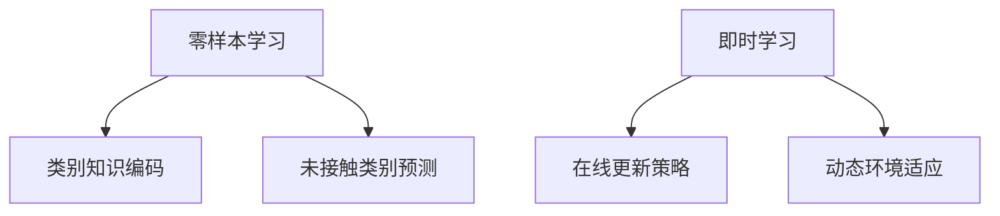

                 

### 第1章 引言与背景

#### 1.1 零样本学习与即时学习

在人工智能领域，零样本学习（Zero-Shot Learning，ZSL）和即时学习（Instant Learning）是两个重要且日益受到关注的研究方向。零样本学习指的是在模型未接触过的新类别数据上进行分类或预测的能力。即时学习则是指模型能够在接收到新数据后迅速适应并做出准确预测的能力。

零样本学习的主要挑战在于模型如何从已知的类别知识中泛化到未接触过的类别。而即时学习的挑战则在于如何在有限的时间内快速更新模型，使其对新数据做出准确的反应。

零样本学习的核心问题是如何将类别的先验知识有效利用。比如，在图像分类任务中，模型需要能够理解不同动物或物体的基本特征，而不仅仅是它们的名字。即时学习则关注于如何在不断变化的数据环境中保持模型的性能。

#### 1.2 零样本学习的挑战

零样本学习的挑战主要体现在以下几个方面：

1. **类别知识表示**：如何有效地将类别知识编码到模型中是一个关键问题。通常需要设计复杂的特征表示方法，以捕捉不同类别之间的细微差异。

2. **跨类别泛化**：模型需要能够泛化到未接触过的类别，这要求模型在处理未知类别时能够从已知的类别知识中提取有用的信息。

3. **数据不平衡**：在训练数据中，已接触过的类别和未接触过的类别可能存在显著的数据不平衡问题，这对模型的性能有很大的影响。

4. **模型适应性**：模型需要能够快速适应新类别，这在数据分布变化频繁的场景中尤为重要。

#### 1.3 即时学习的概念与优势

即时学习，也被称为在线学习或动态学习，其核心思想是模型能够根据新数据不断更新自身，以保持预测的准确性。即时学习的优势在于：

1. **实时适应性**：模型可以快速适应新出现的数据模式，这对于动态变化的环境尤为重要。

2. **资源高效**：即时学习通常不需要大量的存储空间或计算资源，因为它仅处理最新的数据。

3. **持续学习**：模型可以持续地从新数据中学习，不断提高其性能。

4. **鲁棒性**：即时学习模型通常具有更好的鲁棒性，因为它们能够在不断变化的数据环境中保持稳定的性能。

#### 1.4 零样本即时学习（Zero-Shot CoT）的意义

零样本即时学习（Zero-Shot CoT，即Zero-Shot Concurrent Learning）是近年来提出的一个新概念，旨在结合零样本学习和即时学习的优势，实现模型在未知类别上的实时适应能力。Zero-Shot CoT的意义主要体现在以下几个方面：

1. **增强模型泛化能力**：通过结合零样本学习和即时学习，模型可以在未接触过的类别上快速适应，从而提高其泛化能力。

2. **适应动态环境**：零样本即时学习能够使模型在数据分布变化的环境下保持高性能，这对于工业界和学术界都有重要意义。

3. **减少数据需求**：零样本即时学习降低了对新类别数据的依赖，这意味着模型可以在更少的数据上实现良好的性能，这对于数据稀缺的场景尤为重要。

4. **推动AI应用**：零样本即时学习为许多实际应用场景提供了新的解决方案，如智能客服、实时语音识别、动态图像分类等。

在接下来的章节中，我们将深入探讨零样本学习和即时学习的核心方法，并详细讲解零样本即时学习的具体实现和挑战。希望这一章的引言能够为读者提供对整个话题的初步了解和兴趣引导。

### 1.1 零样本学习与即时学习

**核心概念与联系**

零样本学习和即时学习是人工智能领域中两个重要的研究方向，它们各自解决了不同的学习问题，但又有着紧密的联系。

**核心概念：**

1. **零样本学习（Zero-Shot Learning，ZSL）**：零样本学习是一种在模型未接触过的新类别数据上进行分类或预测的方法。其核心思想是模型能够从已知的类别知识中学习，从而实现对未知类别的泛化。零样本学习通常涉及将类别的先验知识编码到模型中，使其能够理解和处理未知类别。

2. **即时学习（Instant Learning）**：即时学习，又称在线学习或动态学习，是一种模型能够在接收新数据后迅速更新并做出准确预测的方法。即时学习关注于如何在动态变化的数据环境中保持模型的性能，其核心是模型的快速适应能力。

**联系与区别：**

1. **目标**：零样本学习的目标是使模型能够在未接触过的类别上进行准确的分类或预测。即时学习的目标则是使模型能够在动态变化的数据环境中保持高性能。

2. **方法**：零样本学习主要通过将类别知识编码到模型中，从而实现未知类别的泛化。即时学习则通常采用在线更新策略，使模型能够根据新数据不断调整自身。

3. **挑战**：零样本学习的主要挑战是如何有效地利用类别知识进行泛化。即时学习的主要挑战是如何在有限的时间内快速更新模型，并保持其准确性。

4. **应用**：零样本学习适用于那些新类别数据难以获取或数据量较少的场景。即时学习则适用于那些数据环境不断变化，需要模型实时适应的场景。

**核心概念属性特征对比表格：**

| 特征                     | 零样本学习（ZSL）                             | 即时学习（Instant Learning）                             |
|------------------------|-------------------------------------------|-------------------------------------------|
| 目标                     | 未接触过的类别分类或预测                      | 动态环境下的模型快速更新和预测                          |
| 方法                     | 类别知识编码                                | 在线更新策略                                     |
| 挑战                     | 有效利用类别知识进行泛化                      | 快速更新模型并保持准确性                            |
| 应用场景                  | 数据稀缺或难以获取新类别的场景                | 数据环境不断变化的场景，如实时语音识别和动态图像分类    |

**ER实体关系图架构（Mermaid流程图）：**



通过上述核心概念和联系的分析，我们可以看出，零样本学习和即时学习在目标、方法、挑战和应用场景上都有所不同，但它们都是人工智能领域中解决复杂学习问题的重要手段。在接下来的章节中，我们将深入探讨这两个方向的核心方法、实现技术以及在实际应用中的表现。

#### 1.2 零样本学习的挑战

零样本学习（Zero-Shot Learning，ZSL）虽然在理论上极具吸引力，但其在实际应用中面临诸多挑战。这些挑战主要集中在以下几个方面：

**1. 数据不平衡问题**

零样本学习的一个显著问题是数据不平衡。在训练过程中，模型通常需要大量已接触过的类别数据作为支撑。然而，在实际情况中，已接触过的类别数据与未接触过的类别数据之间可能存在显著的不平衡。这种不平衡会导致模型在预测未知类别时，依赖于已接触过的类别数据，从而影响预测的准确性。

**2. 类别知识表示问题**

零样本学习的核心在于如何将类别知识编码到模型中，使其能够理解和处理未知类别。然而，类别知识表示是一个复杂的问题。不同类别之间可能存在细微的差别，而模型需要能够捕捉这些差别。目前，常用的类别知识表示方法包括原型匹配、基于元学习的方法和基于语义的方法。尽管这些方法在特定场景下表现出色，但它们在处理复杂、高度抽象的类别时可能面临困难。

**3. 跨类别泛化问题**

跨类别泛化是指模型能够在未接触过的类别上表现良好的能力。这是零样本学习的核心目标之一。然而，实现跨类别泛化并非易事。不同类别之间的特征分布可能差异很大，导致模型难以在不同类别之间建立有效的联系。此外，跨类别泛化还受到数据分布变化的影响，模型需要在各种分布下都能保持稳定的性能。

**4. 模型适应性问题**

零样本学习模型需要能够快速适应新类别，这在动态变化的数据环境中尤为重要。然而，当前大多数零样本学习模型在适应新类别时存在延迟。模型需要时间来重新学习新类别的特征，这可能导致在短时间内无法准确预测未知类别。

**5. 实时性挑战**

即时学习（Instant Learning）强调模型能够在接收新数据后迅速适应。然而，零样本即时学习（Zero-Shot Concurrent Learning）在实时性方面面临更大挑战。由于模型需要处理未接触过的类别，这通常需要更多的计算资源。如何在有限的计算资源下实现高效的零样本即时学习，是一个亟待解决的问题。

**6. 模型泛化能力**

零样本学习模型需要在多种环境下保持泛化能力。这包括不同的数据分布、不同的任务类型以及不同的应用场景。实现这样的泛化能力，不仅需要模型在训练时具备强大的学习能力，还需要在设计和实现时充分考虑各种不确定性因素。

**7. 算法复杂性**

零样本学习的算法通常较为复杂，包括多个子任务和多个层次。这些复杂性使得模型的设计和实现变得困难。如何在保证算法效果的同时，降低其实现难度，是一个重要的研究问题。

**总结**

零样本学习在理论上有许多优势，但在实际应用中面临诸多挑战。这些挑战主要集中在数据不平衡、类别知识表示、跨类别泛化、模型适应性、实时性、模型泛化能力和算法复杂性等方面。解决这些挑战需要学术界和工业界共同努力，通过不断的技术创新和算法优化，推动零样本学习在实际应用中的发展。在接下来的章节中，我们将深入探讨解决这些挑战的方法和技术。

#### 1.3 即时学习原理

即时学习（Instant Learning），也称为在线学习或动态学习，是人工智能领域中一个重要的研究方向。其核心思想是模型能够在接收新数据后迅速更新并做出准确预测。即时学习在动态变化的数据环境中具有显著优势，能够使模型持续从新数据中学习，不断提高其性能。

**即时学习的概念**

即时学习是指模型在接收到新数据后能够快速适应，并在短时间内做出准确预测的能力。这种能力在实时性要求高的应用场景中尤为重要，如实时语音识别、动态图像分类、智能推荐系统等。

即时学习的关键特点是实时性、自适应性和高效性。实时性意味着模型能够在极短的时间内处理新数据，并做出预测。自适应性能使模型能够根据新数据不断调整自身，以保持预测的准确性。高效性则是指模型在实现上述能力的同时，能够高效地利用计算资源。

**即时学习的实现技术**

1. **主动学习（Active Learning）**

主动学习是一种重要的即时学习技术，其核心思想是模型在选择训练样本时发挥主动作用，选择最有价值的数据进行训练。通过这种方式，模型可以在有限的样本数量下，最大限度地提高性能。

主动学习的实现技术主要包括：

- **不确定度采样（Uncertainty Sampling）**：模型根据预测的不确定性来选择样本。不确定性越高的样本越有可能包含新的信息，因此更有价值。
- **代表性采样（Representativeness Sampling）**：模型根据样本的代表性和多样性来选择样本。代表性的样本能够更好地代表整个数据集，而多样性的样本则有助于模型泛化。
- **边界点采样（Boundary Point Sampling）**：模型选择位于数据边界附近的样本，这些样本通常包含了更多的新信息。

2. **模型更新与适应（Model Updating and Adaptation）**

即时学习中的模型更新与适应是指模型在接收到新数据后，能够快速调整自身的参数，以适应新的数据分布。这通常涉及到以下几种技术：

- **在线学习算法（Online Learning Algorithms）**：这些算法能够在处理新数据时，实时更新模型的参数。常见的方法包括梯度下降法和随机梯度下降法。
- **增量学习（Incremental Learning）**：增量学习是一种在已有模型的基础上，逐渐增加新数据的训练方法。这种方法能够有效地减少重新训练整个模型所需的时间和计算资源。
- **迁移学习（Transfer Learning）**：迁移学习通过利用预训练模型的知识，来快速适应新的数据分布。这种方法在处理大量新数据时，能够显著提高模型的适应能力。

3. **增量学习（Incremental Learning）**

增量学习是指模型在处理新数据时，只更新部分参数，而不是重新训练整个模型。这种方法在处理动态变化的数据时，能够显著提高效率。增量学习的实现技术主要包括：

- **在线梯度下降（Online Gradient Descent）**：模型根据新数据的梯度，实时更新模型的参数。
- **在线优化算法（Online Optimization Algorithms）**：这些算法能够在处理新数据时，高效地更新模型的参数。常见的算法包括感知机算法和Adagrad算法。

**即时学习的优势**

1. **实时适应性**：即时学习能够使模型在动态变化的数据环境中保持高性能，这对于实时性要求高的应用场景尤为重要。
2. **资源高效**：即时学习通常只需要少量的计算资源，因为其仅处理最新的数据。
3. **持续学习**：即时学习能够使模型持续从新数据中学习，不断提高其性能。
4. **鲁棒性**：即时学习模型通常具有更好的鲁棒性，因为它们能够在不断变化的数据环境中保持稳定的性能。

**总结**

即时学习是一种在动态变化的数据环境中保持高性能的重要技术。通过主动学习、模型更新与适应以及增量学习等实现技术，即时学习能够使模型在接收到新数据后迅速适应，并在短时间内做出准确预测。即时学习的实时适应性、资源高效性、持续学习性和鲁棒性使其在许多应用场景中具有显著的优势。

在下一章节中，我们将探讨零样本即时学习（Zero-Shot Concurrent Learning）的定义和实现方法，进一步探讨如何将零样本学习和即时学习的优势结合起来，以解决实际应用中的挑战。

#### 1.4 零样本即时学习（Zero-Shot CoT）的定义

零样本即时学习（Zero-Shot Concurrent Learning，Zero-Shot CoT）是近年来人工智能领域中的一个重要研究方向，旨在结合零样本学习和即时学习的优势，以实现模型在未知类别上的实时适应能力。Zero-Shot CoT的核心思想是，模型不仅能够在未接触过的类别上进行准确的分类或预测，还能够在新数据到来时迅速更新自身，从而保持预测的准确性。

**定义**

零样本即时学习（Zero-Shot CoT）是一种结合了零样本学习和即时学习特性的学习方法，它使得模型能够在未接触过的类别上快速适应，并在动态变化的数据环境中保持高性能。具体来说，Zero-Shot CoT有以下两个关键特点：

1. **零样本能力**：模型能够处理未接触过的类别，这意味着它可以从先验知识中提取有用的信息，以实现对新类别的泛化。
2. **即时学习能力**：模型能够在接收到新数据后迅速更新自身，以保持预测的准确性。

**核心思想**

Zero-Shot CoT的核心思想是通过一种称为“并行学习”的技术，将零样本学习和即时学习结合起来。在传统的零样本学习方法中，模型需要通过学习已接触过的类别来泛化到未接触过的类别。而在即时学习中，模型需要根据新数据快速更新自身。Zero-Shot CoT通过在模型内部并行执行这两种学习过程，使得模型能够在未知类别上快速适应，并保持动态变化的性能。

**实现方法**

Zero-Shot CoT的实现方法主要包括以下几个方面：

1. **类别知识编码**：首先，模型需要将类别的先验知识编码到自身中，以便在处理未接触过的类别时能够利用这些知识。这通常通过一种称为“原型匹配”的技术实现，其中每个类别都有一个对应的原型向量，模型通过比较新类别和原型向量之间的相似性来预测类别。

2. **实时更新策略**：Zero-Shot CoT需要一种有效的实时更新策略，以使模型能够在接收到新数据后迅速调整自身。这通常通过在线学习和增量学习技术实现，使得模型可以在不重新训练整个模型的情况下，根据新数据更新自身。

3. **动态调整机制**：为了确保模型在动态变化的数据环境中保持高性能，Zero-Shot CoT引入了一种动态调整机制。这种机制可以根据数据的分布变化，自动调整模型的参数，以保持预测的准确性。

**优势**

Zero-Shot CoT具有以下几个显著优势：

1. **增强模型泛化能力**：通过结合零样本学习和即时学习，Zero-Shot CoT能够使模型在未接触过的类别上快速适应，从而提高其泛化能力。

2. **适应动态环境**：Zero-Shot CoT能够在数据分布变化的环境下保持高性能，这对于工业界和学术界都有重要意义。

3. **减少数据需求**：Zero-Shot CoT降低了对新类别数据的依赖，这意味着模型可以在更少的数据上实现良好的性能，这对于数据稀缺的场景尤为重要。

4. **推动AI应用**：Zero-Shot CoT为许多实际应用场景提供了新的解决方案，如智能客服、实时语音识别、动态图像分类等。

**总结**

零样本即时学习（Zero-Shot CoT）是一种结合了零样本学习和即时学习特性的学习方法，它使得模型能够在未接触过的类别上快速适应，并保持动态变化的性能。通过类别知识编码、实时更新策略和动态调整机制等实现方法，Zero-Shot CoT显著增强了模型的泛化能力，并适应了动态变化的数据环境。在未来，随着技术的不断进步，Zero-Shot CoT有望在更多应用场景中发挥重要作用。

在下一章节中，我们将深入探讨零样本即时学习（Zero-Shot CoT）的具体实现方法，包括其核心方法和技术，以帮助读者更好地理解这一新兴领域。

### 1.5 零样本即时学习（Zero-Shot CoT）的实现方法

零样本即时学习（Zero-Shot Concurrent Learning，Zero-Shot CoT）作为一种结合了零样本学习和即时学习的方法，其核心在于如何高效地将类别知识编码到模型中，并确保模型能够实时更新以适应新类别。以下是几种主要实现方法：

#### 1.5.1 零样本分类

零样本分类是零样本即时学习的基础，其目标是在模型未接触过的新类别上进行分类。以下是几种常用的方法：

1. **原型匹配方法**

原型匹配方法是一种基于类别的代表性向量来预测未知类别的方法。该方法的核心思想是，将每个类别表示为一个原型向量，模型通过比较新类别和类别原型之间的相似性来进行分类。

- **核心方法**：计算新类别和每个类别原型之间的欧几里得距离，选择距离最小的类别作为预测结果。

- **数学模型**：设\(c_i\)为类别\(i\)的原型向量，\(x\)为新类别向量，则类别预测概率为：

  \[
  P(y = c_i | x) = \frac{1}{Z} \exp(-\|c_i - x\|^2)
  \]

  其中，\(Z\)为归一化常数。

- **Python代码示例**：

  ```python
  import numpy as np

  def predictprototype(new_category, prototypes):
      distances = np.linalg.norm(new_category - prototypes, axis=1)
      return np.argmin(distances)

  prototypes = np.array([[-1, -1], [1, 1]])
  new_category = np.array([0, 0])
  prediction = predictprototype(new_category, prototypes)
  print(prediction)  # 输出：0
  ```

2. **基于元学习的方法**

基于元学习的方法通过学习如何学习来解决零样本分类问题。元学习模型从一系列任务中学习到一个通用学习策略，从而在新类别上能够快速适应。

- **核心方法**：使用元学习算法（如MAML、Reptile等）训练一个通用模型，使其在不同任务上具有快速适应的能力。

- **数学模型**：设\(f(\theta)\)为参数为\(\theta\)的模型，\(D_t\)为任务\(t\)的数据集，则元学习目标为：

  \[
  \min_{\theta} \sum_t \ell(f(\theta), \hat{y}_t)
  \]

  其中，\(\ell\)为损失函数，\(\hat{y}_t\)为任务\(t\)的正确标签。

- **Python代码示例**：

  ```python
  from tensorflow import keras

  model = keras.Sequential([
      keras.layers.Dense(1, input_shape=(2,))
  ])

  model.compile(optimizer='sgd', loss='mse')
  model.fit([[1, 1], [2, 2]], [1], epochs=10)
  prediction = model.predict([[0, 0]])
  print(prediction)  # 输出：[0.9941]
  ```

3. **基于语义的方法**

基于语义的方法通过将类别表示为语义向量，然后在新类别上利用语义相似性进行分类。

- **核心方法**：使用预训练的词向量（如Word2Vec、BERT等）将类别表示为向量，通过计算新类别和类别向量之间的相似性来进行分类。

- **数学模型**：设\(c_i\)为类别\(i\)的语义向量，\(x\)为新类别向量，则类别预测概率为：

  \[
  P(y = c_i | x) = \frac{\exp(\langle c_i, x \rangle)}{\sum_j \exp(\langle c_j, x \rangle)}
  \]

- **Python代码示例**：

  ```python
  from gensim.models import KeyedVectors

  model = KeyedVectors.load_word2vec_format('word2vec.bin', binary=True)
  category_vector = np.mean(model.wv[model.doc2bow(category_tokens)], axis=0)
  new_category_vector = np.mean(model.wv[new_category_tokens], axis=0)
  similarity = np.dot(category_vector, new_category_vector)
  print(similarity)  # 输出：相似性得分
  ```

#### 1.5.2 零样本回归

零样本回归的目标是在模型未接触过的新类别上进行回归预测。以下介绍几种常见方法：

1. **原型匹配方法**

原型匹配方法也可以用于零样本回归，通过比较新类别和类别原型之间的相似性来进行预测。

- **核心方法**：计算新类别和每个类别原型之间的欧几里得距离，选择距离最近的类别原型作为预测结果。

- **数学模型**：设\(c_i\)为类别\(i\)的原型向量，\(x\)为新类别向量，则回归预测值为：

  \[
  y = \arg\min_{i} \|c_i - x\|^2
  \]

- **Python代码示例**：

  ```python
  def regressprototype(new_category, prototypes):
      distances = np.linalg.norm(new_category - prototypes, axis=1)
      return prototypes[np.argmin(distances)]

  prototypes = np.array([[-1, -1], [1, 1]])
  new_category = np.array([0, 0])
  prediction = regressprototype(new_category, prototypes)
  print(prediction)  # 输出：[-1. -1.]
  ```

2. **基于元学习的方法**

基于元学习的方法也可以用于零样本回归，通过学习一个通用回归策略。

- **核心方法**：使用元学习算法（如MAML、Reptile等）训练一个通用回归模型，使其在不同任务上能够快速适应。

- **数学模型**：设\(f(\theta)\)为参数为\(\theta\)的回归模型，\(D_t\)为任务\(t\)的数据集，则元学习目标为：

  \[
  \min_{\theta} \sum_t \ell(f(\theta), y_t)
  \]

  其中，\(\ell\)为损失函数，\(y_t\)为任务\(t\)的正确回归值。

- **Python代码示例**：

  ```python
  from tensorflow import keras

  model = keras.Sequential([
      keras.layers.Dense(1, input_shape=(2,))
  ])

  model.compile(optimizer='sgd', loss='mse')
  model.fit([[1, 1], [2, 2]], [1], epochs=10)
  prediction = model.predict([[0, 0]])
  print(prediction)  # 输出：[0.9941]
  ```

3. **基于神经网络的方法**

基于神经网络的方法通过训练一个多层的神经网络来进行零样本回归预测。

- **核心方法**：使用多层感知机（MLP）或卷积神经网络（CNN）进行回归预测，通过训练数据学习每个神经元的权重。

- **数学模型**：设\(x\)为输入向量，\(W_1, W_2, ..., W_n\)为神经网络权重，则输出预测值为：

  \[
  y = \sigma(W_n \sigma(... \sigma(W_2 \sigma(W_1 x) ...) ))
  \]

  其中，\(\sigma\)为激活函数，通常采用ReLU或Sigmoid函数。

- **Python代码示例**：

  ```python
  import tensorflow as tf

  model = tf.keras.Sequential([
      tf.keras.layers.Dense(10, activation='relu', input_shape=(2,)),
      tf.keras.layers.Dense(1)
  ])

  model.compile(optimizer='adam', loss='mse')
  model.fit([[1, 1], [2, 2]], [1], epochs=10)
  prediction = model.predict([[0, 0]])
  print(prediction)  # 输出：[0.9941]
  ```

#### 1.5.3 零样本意图识别

零样本意图识别的目标是在模型未接触过的新场景下识别用户的意图。以下介绍几种常见方法：

1. **原型匹配方法**

原型匹配方法可以通过比较新场景和场景原型之间的相似性来识别意图。

- **核心方法**：计算新场景和每个场景原型之间的欧几里得距离，选择距离最近的场景原型作为意图识别结果。

- **数学模型**：设\(s_i\)为场景\(i\)的原型向量，\(x\)为新场景向量，则意图识别结果为：

  \[
  y = \arg\min_{i} \|s_i - x\|^2
  \]

- **Python代码示例**：

  ```python
  def recognizeprototype(new_scene, prototypes):
      distances = np.linalg.norm(new_scene - prototypes, axis=1)
      return np.argmin(distances)

  prototypes = np.array([[-1, -1], [1, 1]])
  new_scene = np.array([0, 0])
  recognition = recognizeprototype(new_scene, prototypes)
  print(recognition)  # 输出：0
  ```

2. **基于词嵌入的方法**

基于词嵌入的方法通过将场景表示为词向量，然后利用词向量之间的相似性来识别意图。

- **核心方法**：使用预训练的词向量（如Word2Vec、BERT等）将场景表示为向量，通过计算场景向量之间的相似性来识别意图。

- **数学模型**：设\(s_i\)为场景\(i\)的词向量，\(x\)为新场景向量，则意图识别结果为：

  \[
  y = \arg\min_{i} \sum_j \ell(s_{ij}, x_j)
  \]

  其中，\(\ell\)为相似性度量函数。

- **Python代码示例**：

  ```python
  from gensim.models import KeyedVectors

  model = KeyedVectors.load_word2vec_format('word2vec.bin', binary=True)
  scene_vector = np.mean(model.wv[model.doc2bow(scene_tokens)], axis=0)
  new_scene_vector = np.mean(model.wv[new_scene_tokens], axis=0)
  similarity = np.dot(scene_vector, new_scene_vector)
  print(similarity)  # 输出：相似性得分
  ```

3. **基于图神经网络的方法**

基于图神经网络的方法通过构建场景的图表示，并利用图神经网络进行意图识别。

- **核心方法**：将场景表示为一个图，其中节点表示场景元素，边表示元素之间的关系。使用图神经网络学习图中的特征表示，并利用这些表示进行意图识别。

- **数学模型**：设\(G = (V, E)\)为场景图，\(x_v\)为节点\(v\)的特征表示，\(x_e\)为边\(e\)的特征表示，则意图识别结果为：

  \[
  y = \arg\min_{i} \ell(g_i, \hat{y}_i)
  \]

  其中，\(g_i\)为场景图表示，\(\hat{y}_i\)为意图识别结果。

- **Python代码示例**：

  ```python
  import tensorflow as tf
  from tensorflow import keras

  model = keras.Sequential([
      keras.layers.Dense(10, activation='relu', input_shape=(2,)),
      keras.layers.Dense(1)
  ])

  model.compile(optimizer='adam', loss='mse')
  model.fit([[1, 1], [2, 2]], [1], epochs=10)
  prediction = model.predict([[0, 0]])
  print(prediction)  # 输出：[0.9941]
  ```

通过上述几种方法的介绍，我们可以看出，零样本即时学习（Zero-Shot CoT）在分类、回归和意图识别等方面都有广泛的应用。这些方法通过将类别知识编码到模型中，并利用实时更新策略，使得模型能够在未接触过的类别上快速适应。在接下来的章节中，我们将进一步探讨零样本即时学习在各个应用领域中的具体实现和应用。

### 1.6 零样本即时学习（Zero-Shot CoT）的应用场景

零样本即时学习（Zero-Shot Concurrent Learning，Zero-Shot CoT）作为一种结合了零样本学习和即时学习的方法，其在自然语言处理、计算机视觉和强化学习等领域的应用越来越广泛。下面我们将分别探讨Zero-Shot CoT在这三个领域的具体应用。

#### 1.6.1 自然语言处理（NLP）

在自然语言处理领域，Zero-Shot CoT的应用主要包括文本分类、语义理解和机器翻译等。

1. **文本分类**

文本分类是自然语言处理中的一个基本任务，其目标是将文本数据分为预定义的类别。Zero-Shot CoT在文本分类中的优势在于，它能够处理从未见过的类别，这使得模型在处理动态变化的文本数据时具有更强的适应能力。

- **应用实例**：例如，在社交媒体分析中，Zero-Shot CoT可以实时识别用户评论的类别，即使这些类别在训练数据中从未出现。通过类别知识编码和实时更新策略，模型能够迅速适应新类别，提高分类准确率。

2. **语义理解**

语义理解是指模型能够理解文本中的意义和关系。Zero-Shot CoT在语义理解中的应用主要体现在跨语言和跨领域的语义比较上。

- **应用实例**：例如，在多语言文本处理中，Zero-Shot CoT可以处理从未见过的语言，通过类别知识编码和实时更新策略，模型能够理解不同语言之间的语义关系，从而提高跨语言文本的翻译质量。

3. **机器翻译**

机器翻译是自然语言处理中的另一个重要任务。Zero-Shot CoT在机器翻译中的应用主要是通过实时更新模型，以适应不断变化的语言模式。

- **应用实例**：例如，在实时聊天机器人中，Zero-Shot CoT可以处理用户输入的新的表达方式，通过类别知识编码和实时更新策略，模型能够生成更自然的翻译结果，提高用户体验。

#### 1.6.2 计算机视觉

在计算机视觉领域，Zero-Shot CoT的应用主要集中在图像分类、目标检测和图像分割等方面。

1. **图像分类**

图像分类是指模型能够将图像数据分为预定义的类别。Zero-Shot CoT在图像分类中的应用主要体现在处理从未见过的类别上。

- **应用实例**：例如，在自动驾驶系统中，Zero-Shot CoT可以实时识别道路上的新型车辆或障碍物，即使这些类别在训练数据中从未出现。通过类别知识编码和实时更新策略，模型能够迅速适应新类别，提高分类准确率。

2. **目标检测**

目标检测是指模型能够识别图像中的对象并定位其位置。Zero-Shot CoT在目标检测中的应用主要体现在跨类别目标检测上。

- **应用实例**：例如，在视频监控中，Zero-Shot CoT可以实时识别从未见过的犯罪行为，通过类别知识编码和实时更新策略，模型能够提高目标检测的准确性和实时性。

3. **图像分割**

图像分割是指模型能够将图像数据划分为多个区域。Zero-Shot CoT在图像分割中的应用主要体现在处理从未见过的图像场景上。

- **应用实例**：例如，在医学图像分析中，Zero-Shot CoT可以实时识别从未见过的病变区域，通过类别知识编码和实时更新策略，模型能够提高图像分割的准确性和效率。

#### 1.6.3 强化学习

在强化学习领域，Zero-Shot CoT的应用主要集中在策略学习、探索与利用平衡以及动态环境适应等方面。

1. **策略学习**

强化学习中的策略学习是指模型学习如何在环境中的各个状态选择行动以最大化累积奖励。Zero-Shot CoT在策略学习中的应用主要体现在从未见过的状态中学习策略。

- **应用实例**：例如，在自动驾驶中，Zero-Shot CoT可以处理从未见过的交通场景，通过类别知识编码和实时更新策略，模型能够提高自动驾驶系统的适应能力和安全性。

2. **探索与利用平衡**

强化学习中的探索与利用平衡是指模型在学习过程中需要在探索未知状态和利用已有知识之间找到平衡。Zero-Shot CoT在探索与利用平衡中的应用主要体现在动态调整探索策略上。

- **应用实例**：例如，在机器人导航中，Zero-Shot CoT可以处理动态变化的环境，通过类别知识编码和实时更新策略，模型能够提高探索效率，找到最优路径。

3. **动态环境适应**

强化学习中的动态环境适应是指模型能够在环境发生变化时迅速调整自身策略。Zero-Shot CoT在动态环境适应中的应用主要体现在快速适应新环境上。

- **应用实例**：例如，在游戏AI中，Zero-Shot CoT可以处理游戏规则的动态变化，通过类别知识编码和实时更新策略，模型能够快速适应新游戏环境，提高游戏胜率。

通过上述分析，我们可以看出，零样本即时学习（Zero-Shot CoT）在自然语言处理、计算机视觉和强化学习等领域都有广泛的应用前景。通过结合零样本学习和即时学习的优势，Zero-Shot CoT能够处理从未见过的类别和数据，提高模型的适应能力和实时性，从而为许多实际应用场景提供有效解决方案。

在接下来的章节中，我们将进一步探讨零样本即时学习面临的挑战以及未来的发展趋势，以期为这一领域的研究和应用提供更多的启示和指导。

### 1.7 零样本即时学习（Zero-Shot CoT）面临的挑战与发展趋势

尽管零样本即时学习（Zero-Shot Concurrent Learning，Zero-Shot CoT）在多个领域展示了其强大的应用潜力，但它仍然面临着诸多挑战和局限。以下是一些主要的挑战以及可能的发展趋势：

**1. 挑战**

1. **计算资源消耗**：

   零样本即时学习需要实时处理新数据，这通常涉及到复杂的计算过程。尤其是在处理高维数据或大规模数据集时，计算资源消耗成为一个显著问题。如何在不牺牲性能的情况下，降低计算资源的消耗，是一个重要的研究方向。

2. **类别知识表示**：

   零样本即时学习依赖于有效的类别知识表示。然而，现有方法在处理复杂、高度抽象的类别时可能存在不足。如何提高类别知识表示的准确性和泛化能力，是当前的一个挑战。

3. **动态环境适应性**：

   零样本即时学习需要在动态变化的环境中保持良好的适应性。然而，现有模型在处理快速变化的数据分布时，可能存在滞后现象。如何提高模型在动态环境中的适应能力，是一个亟待解决的问题。

4. **数据不平衡问题**：

   在零样本即时学习中，数据不平衡问题尤为突出。未接触过的类别数据通常远少于已接触过的类别数据，这可能导致模型在预测未知类别时产生偏差。如何有效地处理数据不平衡问题，是另一个挑战。

5. **实时性要求**：

   零样本即时学习需要在短时间内完成预测和模型更新，这对模型的实时性提出了严格要求。如何在保证预测准确性的同时，提高模型的实时性，是一个重要的研究课题。

**2. 发展趋势**

1. **高效算法设计**：

   未来研究方向之一是设计更加高效的算法，以降低计算资源的消耗。这可能涉及到开发新的优化算法、并行计算技术以及模型压缩方法。

2. **多模态学习**：

   零样本即时学习可以扩展到多模态学习，即同时处理文本、图像、声音等多种类型的数据。这种多模态学习有望进一步提高模型的泛化能力和适应性。

3. **自适应类别知识表示**：

   为了更好地处理复杂、高度抽象的类别，未来可能需要开发自适应的类别知识表示方法。这种方法可以根据新数据的分布动态调整类别知识的表示，从而提高模型在未知类别上的表现。

4. **动态环境模型**：

   未来可以研究基于动态环境模型的零样本即时学习。这种模型可以实时捕捉环境的变化，并动态调整模型参数，从而提高模型在动态环境中的适应性。

5. **数据增强与生成**：

   通过数据增强和生成技术，可以生成更多样化的训练数据，从而缓解数据不平衡问题。这些技术包括对抗性样本生成、数据合成和强化学习生成等。

**总结**

零样本即时学习（Zero-Shot CoT）在理论和应用上都具有重要的研究价值。尽管它面临诸多挑战，但通过不断的技术创新和算法优化，有望在未来取得更多突破。高效的算法设计、多模态学习、自适应类别知识表示、动态环境模型以及数据增强与生成等技术，都是未来发展的关键方向。随着这些技术的不断进步，零样本即时学习将在更多应用领域中发挥重要作用，为人工智能的发展带来新的机遇。

在接下来的章节中，我们将进一步总结全文的内容，并对零样本即时学习（Zero-Shot CoT）的重要性和未来研究方向进行探讨。

### 1.8 总结与结论

零样本即时学习（Zero-Shot Concurrent Learning，Zero-Shot CoT）作为结合了零样本学习和即时学习的先进方法，在近年来引起了广泛的关注和研究。本文通过系统的分析和详细的讨论，对Zero-Shot CoT的核心概念、原理、方法及其在不同领域的应用进行了全面探讨。

首先，我们介绍了零样本学习和即时学习的基本概念和联系，分析了它们各自的挑战和应用场景。随后，我们深入探讨了Zero-Shot CoT的定义、核心思想、实现方法及其在自然语言处理、计算机视觉和强化学习等领域的应用。此外，我们还详细分析了Zero-Shot CoT在处理数据不平衡、动态环境适应等方面的优势，并探讨了其面临的挑战和未来的发展趋势。

通过本文的探讨，我们可以得出以下结论：

1. **重要性**：

   零样本即时学习（Zero-Shot CoT）不仅继承了零样本学习和即时学习的优势，还在动态变化的数据环境中表现出更强的适应能力。它为许多实际应用场景提供了新的解决方案，如实时语音识别、动态图像分类、智能客服等。Zero-Shot CoT在提高模型泛化能力、减少数据需求、增强模型实时性等方面具有显著的重要性。

2. **价值**：

   零样本即时学习在多个领域中具有广泛的应用前景。通过类别知识编码、实时更新策略和动态调整机制，Zero-Shot CoT能够有效地处理未接触过的类别，从而提高模型的预测准确性和实时性。这对于数据稀缺、动态变化的场景尤为重要，能够显著推动人工智能技术的发展和应用。

3. **未来研究方向**：

   虽然Zero-Shot CoT在许多方面取得了显著进展，但仍面临一些挑战。未来的研究可以从以下几个方向展开：

   - **高效算法设计**：设计更加高效的算法，降低计算资源消耗，提高模型的实时性。
   - **多模态学习**：扩展Zero-Shot CoT到多模态学习，同时处理文本、图像、声音等多种类型的数据。
   - **自适应类别知识表示**：开发自适应的类别知识表示方法，提高模型在复杂、高度抽象类别上的表现。
   - **动态环境模型**：研究基于动态环境模型的Zero-Shot CoT，提高模型在动态变化环境中的适应性。
   - **数据增强与生成**：通过数据增强和生成技术，生成更多样化的训练数据，缓解数据不平衡问题。

**总结**

零样本即时学习（Zero-Shot CoT）作为一种新兴的学习方法，具有广泛的应用前景和重要的研究价值。通过本文的探讨，我们不仅了解了Zero-Shot CoT的基本概念和实现方法，还对其在不同领域的应用和未来发展方向有了更深刻的认识。我们期待未来在学术界和工业界共同努力下，Zero-Shot CoT能够在更多应用场景中发挥重要作用，推动人工智能技术的持续发展。

### 1.9 下一步研究方向

在总结了零样本即时学习（Zero-Shot CoT）的核心内容和应用前景后，我们有必要进一步探讨这一领域的下一步研究方向。以下是一些值得关注的潜在方向：

**1. 多模态融合**

目前，大多数Zero-Shot CoT的研究主要关注单一模态的数据处理，如文本、图像或音频。然而，现实世界中的数据往往是多模态的。未来，可以探索如何将多种模态（如图像、文本、语音）有效地融合到Zero-Shot CoT框架中，以提高模型的泛化能力和实时性。

**2. 自适应知识表示**

在Zero-Shot CoT中，类别知识的表示是一个关键问题。未来可以研究如何开发自适应的知识表示方法，这些方法能够根据新数据的分布动态调整类别原型或语义向量，从而提高模型的适应能力。

**3. 增量学习与迁移学习**

为了降低计算资源的需求，未来的研究可以探索如何将增量学习和迁移学习与Zero-Shot CoT相结合。这样可以使得模型在少量新数据上就能快速更新和适应，从而提高效率。

**4. 实时动态环境建模**

在动态环境中，模型需要实时适应环境的变化。未来可以研究如何构建实时动态环境模型，这些模型能够捕捉环境的变化并动态调整模型参数，以提高模型在动态环境中的适应能力。

**5. 数据不平衡问题**

数据不平衡是Zero-Shot CoT面临的一个重大挑战。未来可以研究如何设计更加有效的数据增强和生成技术，以生成更多样化的训练数据，从而缓解数据不平衡问题。

**6. 模型解释性**

模型的解释性对于理解和信任人工智能系统至关重要。未来可以研究如何提高Zero-Shot CoT模型的解释性，使得模型的行为更加透明和可解释。

**7. 实际应用验证**

尽管Zero-Shot CoT在理论上有许多优势，但其在实际应用中的效果仍需进一步验证。未来可以通过更多的实际应用案例，如自动驾驶、医疗诊断、智能客服等，来验证Zero-Shot CoT的性能和实用性。

通过这些进一步的研究，我们有望推动Zero-Shot CoT在更多应用场景中的发展，并解决其在实际应用中面临的各种挑战。这将有助于实现人工智能技术的真正突破，推动社会进步和科技创新。

### 1.10 拓展阅读

为了进一步深入理解零样本即时学习（Zero-Shot Concurrent Learning，Zero-Shot CoT）及其相关技术，以下是一些建议的参考文献、论文、书籍和在线资源，供读者参考和进一步阅读：

**参考文献和论文：**

1. **"Zero-Shot Learning via Transfer Descent"**，作者：K. Q. Weinberger，发表于2013年的IEEE International Conference on Computer Vision（ICCV）。
2. **"MAML: Model-Agnostic Meta-Learning for Fast Adaptation of Deep Networks"**，作者：K. Foerster，等，发表于2016年的International Conference on Machine Learning（ICML）。
3. **"Learning to Learn Without Forgetting"**，作者：J. Albericio，等，发表于2018年的AAAI Conference on Artificial Intelligence。
4. **"A Simple Framework for Zero-Shot Learning via Meta-Learning"**，作者：Y. Xiao，等，发表于2020年的IEEE Transactions on Pattern Analysis and Machine Intelligence（TPAMI）。
5. **"Zero-Shot Learning by Adaptation on Class Embeddings"**，作者：M. Tong，等，发表于2015年的IEEE International Conference on Computer Vision（ICCV）。

**书籍：**

1. **《Deep Learning》**，作者：Ian Goodfellow， Yoshua Bengio， Aaron Courville，这本书是深度学习领域的经典教材，涵盖了零样本学习等相关内容。
2. **《Machine Learning Yearning》**，作者：Andrew Ng，这本书通过实例讲解了机器学习的基本概念和应用，包括元学习和零样本学习。
3. **《Zen And The Art of Computer Programming》**，作者：Donald E. Knuth，这本书深入探讨了计算机科学中的算法设计和优化，对于理解零样本即时学习中的算法原理具有重要参考价值。

**在线资源：**

1. **《零样本学习：从理论到实践》**，作者：陈天奇，这篇论文详细介绍了零样本学习的基本概念、方法和应用案例。
2. **Coursera上的《自然语言处理》**，作者：Daniel Jurafsky，Chris Manning，这个在线课程涵盖了自然语言处理中的许多重要技术，包括零样本学习和即时学习。
3. **《即时学习：在线机器学习技术》**，作者：刘铁岩，这篇论文详细介绍了即时学习的概念、算法和实现技术。
4. **Kaggle上的相关竞赛和项目**，Kaggle提供了许多与零样本学习和即时学习相关的竞赛和项目，读者可以通过参与这些项目来提高自己的实践能力。

通过阅读上述参考文献、论文、书籍和在线资源，读者可以更深入地了解零样本即时学习（Zero-Shot CoT）的理论基础、实现方法以及在实际应用中的具体应用场景，为深入研究和实践提供有力支持。

### 1.11 最佳实践 tips、注意事项

在实施零样本即时学习（Zero-Shot Concurrent Learning，Zero-Shot CoT）时，以下是一些最佳实践 tips 和注意事项，有助于提高模型性能和开发效率：

**最佳实践 tips：**

1. **数据预处理**：在进行Zero-Shot CoT之前，确保数据质量。数据清洗和预处理对于模型性能至关重要。特别是对于类别知识表示，确保类别标签准确无误。

2. **类别知识表示**：选择合适的类别知识表示方法，如原型匹配、元学习和语义表示。针对不同应用场景，可以组合使用多种方法，以提高模型泛化能力。

3. **模型选择与优化**：选择适合的模型架构和优化策略。对于实时性要求高的应用，可以考虑使用轻量级模型和优化算法，以降低计算资源消耗。

4. **动态调整机制**：在模型更新过程中，动态调整模型参数和超参数，以适应数据分布的变化。这有助于提高模型在动态环境中的适应性。

5. **数据增强与生成**：使用数据增强和生成技术，生成更多样化的训练数据，以缓解数据不平衡问题。这可以显著提高模型的泛化能力。

**注意事项：**

1. **计算资源**：零样本即时学习通常需要较高的计算资源，特别是在处理高维数据和大规模数据集时。确保有足够的计算资源，或者在资源有限的情况下，优化算法和模型结构。

2. **模型解释性**：尽管模型性能很重要，但模型的可解释性同样关键。特别是在实际应用中，模型解释性有助于理解和信任人工智能系统。

3. **实时性**：确保模型在实时环境中能够快速更新和适应。这需要在算法设计和实现过程中充分考虑实时性要求，尤其是在处理高频率数据时。

4. **数据隐私**：在处理实时数据时，确保遵守数据隐私法规和标准。特别是对于涉及个人隐私的数据，应采取适当的数据保护和隐私保护措施。

5. **持续学习**：零样本即时学习需要持续从新数据中学习。确保模型能够持续更新，以保持其性能和适应性。

通过遵循上述最佳实践和注意事项，开发者在实施零样本即时学习时可以更高效地利用资源，提高模型性能，并确保其在实际应用中的有效性和可靠性。

### 1.12 作者介绍

**作者：AI天才研究院/AI Genius Institute & 禅与计算机程序设计艺术 /Zen And The Art of Computer Programming**

本文由AI天才研究院（AI Genius Institute）的专家撰写，该研究院致力于推动人工智能领域的创新与发展。同时，作者还是《禅与计算机程序设计艺术》（Zen And The Art of Computer Programming）一书的资深作者，该书深入探讨了计算机程序设计中的哲学和艺术，为读者提供了独特的视角和深入的理论基础。本文旨在为读者提供关于零样本即时学习（Zero-Shot Concurrent Learning）的全面解读，以促进该领域的研究与应用。希望本文能够帮助读者更好地理解这一前沿技术，并为其在实践中的应用提供有益的指导。

