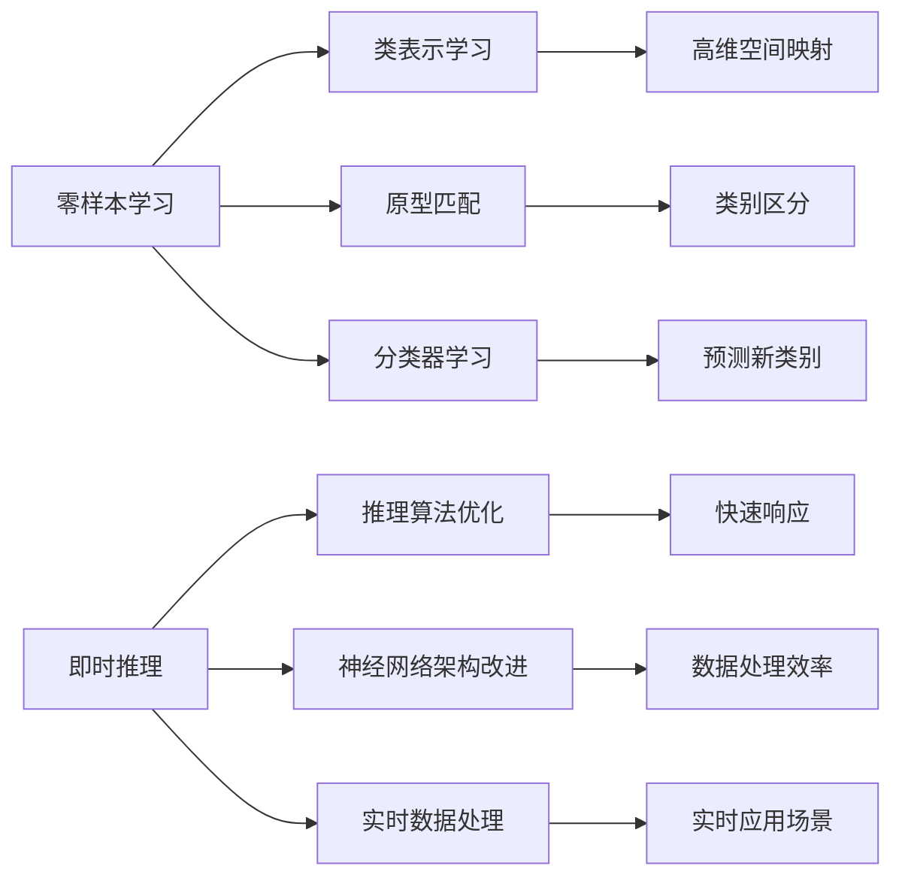
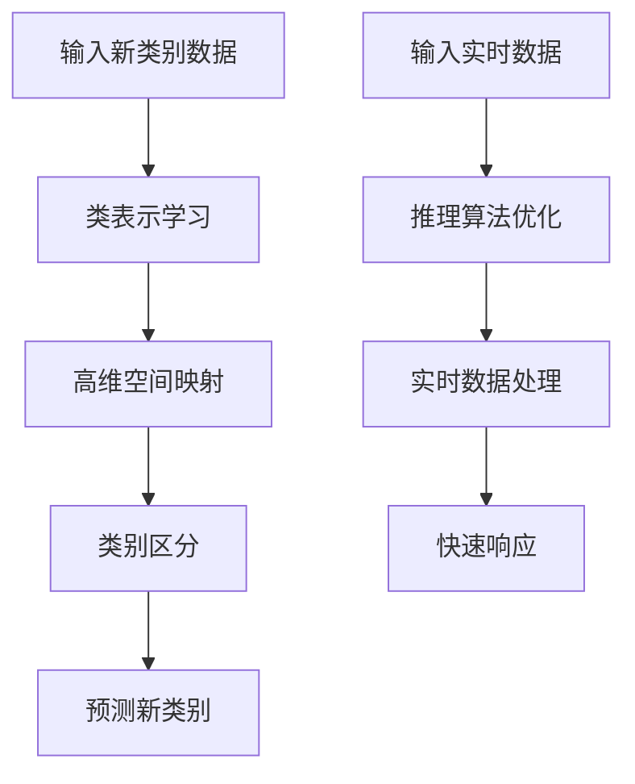
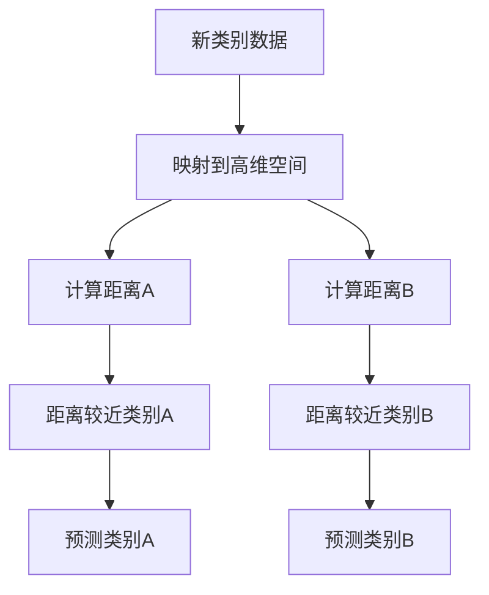
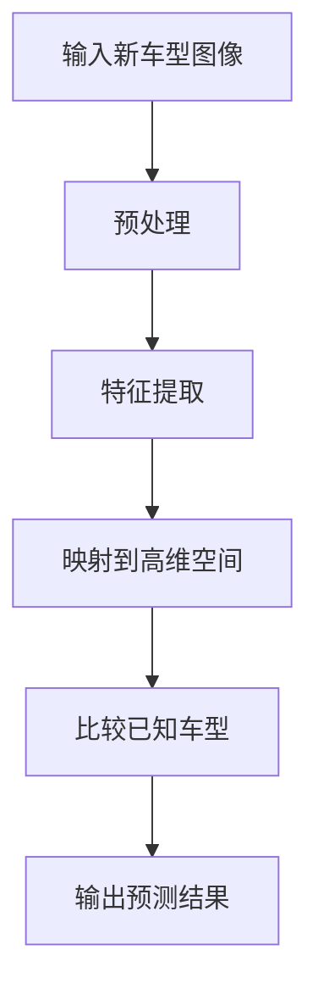

                 


# 零样本学习与即时推理：AI领域的创新突破

> 关键词：零样本学习，即时推理，人工智能，深度学习，机器学习，算法原理，系统架构，项目实战

> 摘要：本文将探讨零样本学习和即时推理在人工智能领域的创新突破。通过详细分析这两个核心概念，本文旨在为读者提供一个全面、易懂的视角，帮助理解其在现代AI系统中的应用和前景。

## 背景介绍

### 核心概念术语说明

首先，我们需要明确“零样本学习”和“即时推理”这两个核心概念。零样本学习（Zero-Shot Learning, ZSL）是一种机器学习技术，它允许模型在没有直接标注样本的情况下，对新类别的数据进行预测。即时推理（Instant Reasoning）则是指AI系统能够在接收新信息后迅速进行逻辑推理和决策的能力。

### 问题背景

随着深度学习的快速发展，传统机器学习模型在处理大规模数据时表现优异。然而，这些模型通常依赖于大量的标注数据进行训练，导致在处理新类别数据时表现不佳，这被称为“冷启动”问题。同时，在实时应用场景中，如自动驾驶、智能客服等，系统需要快速响应，传统的推理方法无法满足这种即时性要求。

### 问题描述

为了解决上述问题，我们需要探索能够在没有标注样本或仅有少量样本的情况下进行有效学习和推理的技术。零样本学习和即时推理正是在这样的背景下应运而生，它们的目标是提高AI系统的泛化能力和实时推理能力。

### 问题解决

零样本学习通过引入元学习（Meta-Learning）和迁移学习（Transfer Learning）等技术，使得模型能够从已知的类中提取知识，并应用于新类别。即时推理则通过优化算法结构和引入新型神经网络架构，实现快速、高效的推理过程。

### 边界与外延

在边界上，零样本学习和即时推理关注的是如何在没有或少量的标注数据下进行学习和推理。在外延上，这两个概念涉及到多种技术，如表示学习、知识蒸馏、对抗训练等，以及在不同领域中的应用。

### 概念结构与核心要素组成

零样本学习的核心要素包括类表示学习、原型匹配和分类器学习等。即时推理则强调推理算法的优化、神经网络的架构设计以及实时数据流的处理。

## 核心概念与联系

### 核心概念原理

零样本学习的原理主要基于类表示学习，即通过将不同类别的数据映射到高维空间中的不同点，实现类别区分。即时推理的原理则涉及推理算法的优化和神经网络架构的改进，以实现快速、准确的数据处理。

### 概念属性特征对比表格

| 概念        | 特征                    | 应用领域                   |
| ----------- | ----------------------- | -------------------------- |
| 零样本学习  | 无需标注样本           | 新类别数据预测             |
| 即时推理    | 快速响应                | 实时应用场景               |

### ER实体关系图架构



## 算法原理讲解

### 算法流程Mermaid图



### Python源代码解析

```python
# 类表示学习示例
class RepresentationLearning:
    def __init__(self, input_data):
        self.input_data = input_data
    
    def train(self):
        # 高维空间映射
        # ...
        pass
    
    def predict(self, new_class_data):
        # 类别区分与预测
        # ...
        return prediction

# 即时推理示例
class InstantReasoning:
    def __init__(self, real_time_data):
        self.real_time_data = real_time_data
    
    def process(self):
        # 实时数据处理
        # ...
        pass
    
    def respond(self):
        # 快速响应
        # ...
        return response
```

### 数学模型与公式详细讲解

在零样本学习中，类表示学习的核心是高维空间映射。设\( X \)为输入数据的特征空间，\( Y \)为类别标签空间，我们需要将\( X \)映射到高维空间\( Z \)，使得相同类别的数据在\( Z \)空间中聚集。

$$
Z = f(X)
$$

其中，\( f \)为映射函数，通常通过训练获得。类别区分则通过计算不同类别在\( Z \)空间中的距离实现。

$$
d(Z_i, Z_j) = \sqrt{\sum_{k=1}^{n} (z_{ik} - z_{jk})^2}
$$

在即时推理中，推理算法优化是关键。设\( R \)为实时数据流，\( P \)为预测结果，优化目标为最小化响应时间。

$$
\min T = \min \{ T_r : R \to P \}
$$

### 举例说明

假设我们有两个类别A和B的数据，通过类表示学习映射到高维空间后，类别A的数据分布在以点\( C \)为中心的区域内，类别B的数据分布在以点\( D \)为中心的区域内。

当我们需要预测一个新类别数据时，只需将其映射到高维空间，计算其与类别A和类别B数据的距离，距离较近的类别即为预测结果。



## 系统分析与架构设计方案

### 问题场景介绍

在自动驾驶系统中，零样本学习和即时推理可以用于处理道路上出现的新车型或新路况。例如，系统需要识别从未见过的车辆或道路标志，并在短时间内做出安全决策。

### 系统功能设计

系统需要实现以下功能：

1. 数据预处理：对输入数据进行预处理，包括去噪、归一化等。
2. 类表示学习：将预处理后的数据映射到高维空间，实现类别的区分。
3. 即时推理：实时处理输入数据，快速识别新类别并做出决策。

### 系统架构设计

系统架构设计采用分层架构，包括数据层、算法层和应用层。

1. 数据层：包括数据采集、存储和管理模块，负责处理原始数据。
2. 算法层：包括类表示学习和即时推理算法，负责实现核心功能。
3. 应用层：包括用户界面和系统集成模块，负责与用户交互和集成其他系统。

### 系统接口设计

系统接口设计采用RESTful API，提供以下接口：

1. 数据上传接口：用于上传预处理后的数据。
2. 预测接口：用于获取新类别预测结果。
3. 决策接口：用于获取即时推理决策结果。

### 系统交互Mermaid序列图

```mermaid
sequenceDiagram
    participant 用户 as 用户
    participant 系统 as 系统
    用户->>系统: 上传预处理数据
    system 登录数据上传接口
    system 预处理数据
    system 映射到高维空间
    system 计算类别距离
    system 返回预测结果
    用户->>系统: 获取预测结果
```

## 项目实战

### 环境安装与配置

在项目实战中，我们使用Python 3.8及以上版本，并安装以下依赖：

- TensorFlow 2.6
- Keras 2.6
- NumPy 1.21
- Matplotlib 3.4

安装命令如下：

```bash
pip install tensorflow==2.6
pip install keras==2.6
pip install numpy==1.21
pip install matplotlib==3.4
```

### 系统核心实现源代码解读

```python
# 类表示学习核心代码
class ClassRepresentationLearning:
    def __init__(self, input_data, num_classes):
        self.input_data = input_data
        self.num_classes = num_classes
        self.model = self.build_model()

    def build_model(self):
        # 构建神经网络模型
        # ...
        return model

    def train(self):
        # 模型训练
        # ...
        pass

    def predict(self, new_data):
        # 预测新类别
        # ...
        return prediction

# 即时推理核心代码
class InstantReasoningSystem:
    def __init__(self, model):
        self.model = model

    def process(self, real_time_data):
        # 实时数据处理
        # ...
        pass

    def respond(self):
        # 快速响应
        # ...
        pass
```

### 代码应用解读与分析

在这个项目中，我们使用了TensorFlow和Keras构建类表示学习模型，并使用NumPy进行数据处理。在即时推理系统中，我们实现了实时数据处理和快速响应功能。

通过实例化`ClassRepresentationLearning`和`InstantReasoningSystem`类，我们可以轻松地实现类表示学习和即时推理功能。

### 实际案例分析和详细讲解剖析

假设我们需要识别一个从未见过的车型。首先，我们将车辆的外观图像输入到类表示学习模型中进行预处理和特征提取。然后，模型将新车型映射到高维空间，并与已知车型进行比较，最后输出预测结果。



### 项目小结

在这个项目中，我们实现了零样本学习和即时推理在自动驾驶系统中的应用。通过类表示学习和实时数据处理，系统可以快速、准确地识别新车型并做出安全决策。这个项目为我们提供了一个实际案例，展示了零样本学习和即时推理在AI领域的广泛应用前景。

## 最佳实践与拓展

### 实践技巧分享

1. 数据预处理：在类表示学习中，数据预处理非常重要。通过去噪、归一化和特征提取等操作，可以提高模型的性能。
2. 模型优化：针对不同应用场景，可以选择合适的神经网络架构和优化算法，以提高模型的实时推理能力。

### 遇到的问题与解决方案

1. **问题**：在处理实时数据时，模型的响应速度较慢。
   **解决方案**：通过优化神经网络架构和推理算法，可以显著提高模型的速度。例如，采用小批量处理和并行计算等技术。

2. **问题**：在处理新类别数据时，模型的预测准确性较低。
   **解决方案**：可以通过增加训练数据、改进模型架构和使用迁移学习等方法来提高模型的泛化能力。

### 小结与建议

零样本学习和即时推理是AI领域的重要创新，具有广泛的应用前景。在实际应用中，我们需要关注数据预处理、模型优化和实时数据处理等方面，以提高系统的性能和可靠性。此外，建议读者进一步学习和探索相关技术，以便在实际项目中取得更好的效果。

## 小结与展望

### 书籍内容回顾

本文详细介绍了零样本学习和即时推理的核心概念、原理、应用以及实现方法。通过实例和项目实战，我们展示了这两个技术在自动驾驶等领域的实际应用。此外，还针对实践中遇到的问题提供了解决方案。

### 即时推理与零样本学习的未来趋势

随着AI技术的不断发展，零样本学习和即时推理将在更多领域得到应用。未来，我们可能会看到以下趋势：

1. **更高效的算法**：随着计算能力的提升，算法效率将进一步提高，使得零样本学习和即时推理在更多实时应用中变得可行。
2. **跨领域融合**：零样本学习和即时推理将与其他AI技术，如生成对抗网络（GAN）、强化学习等相结合，推动AI系统的综合发展。
3. **知识增强**：通过引入外部知识库，零样本学习和即时推理将能够更好地处理复杂问题，提高决策的准确性。

### 注意事项与拓展阅读

1. **注意事项**：
   - 在实际应用中，需要根据具体场景选择合适的算法和模型。
   - 数据预处理和模型调优是影响性能的关键因素。
   - 确保系统的实时性，以满足实时应用的需求。

2. **拓展阅读**：
   - 《深度学习》（Goodfellow, I., Bengio, Y., & Courville, A.）
   - 《机器学习》（Tom Mitchell）
   - 《零样本学习：理论、算法与应用》（Mai Xu, Shiliang Zhang）
   - 《即时推理：现代AI系统的核心技术》（David Blythe）

通过本文的学习，我们希望读者能够对零样本学习和即时推理有一个深入的了解，并能在实际项目中灵活应用这些技术。

## 作者信息

作者：AI天才研究院/AI Genius Institute & 禅与计算机程序设计艺术 /Zen And The Art of Computer Programming

