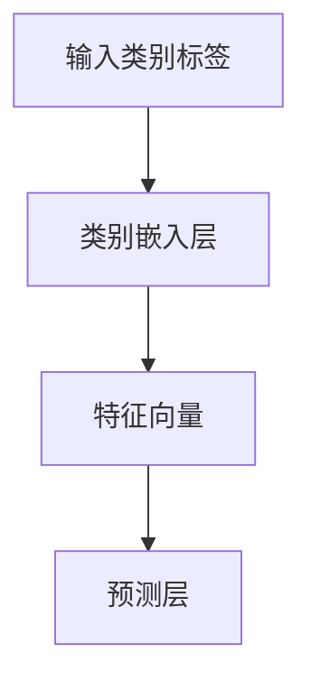
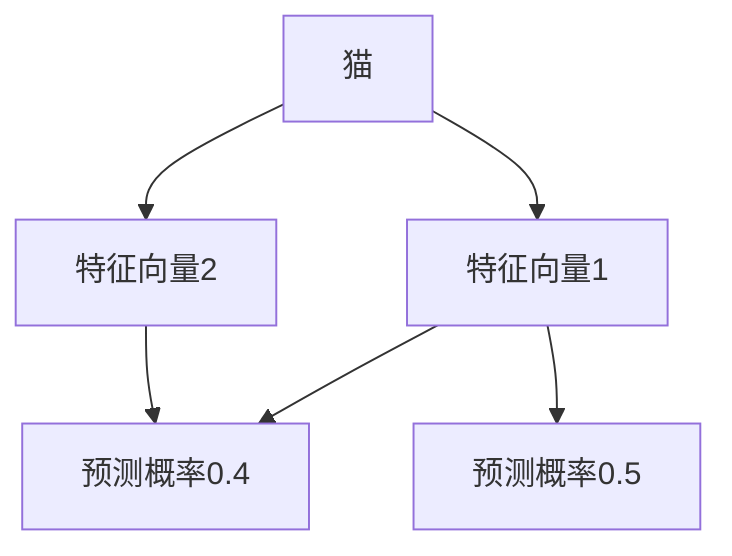
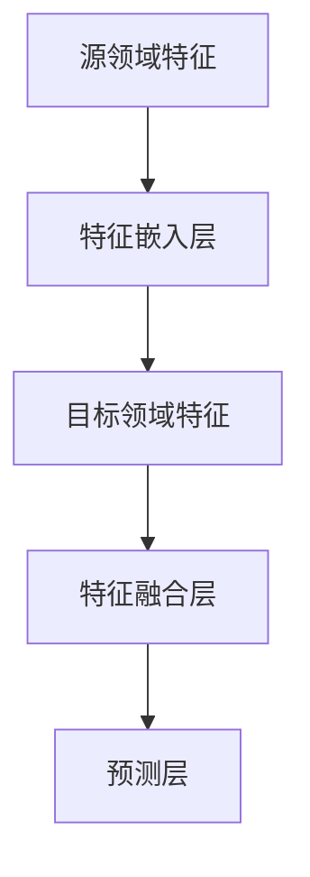
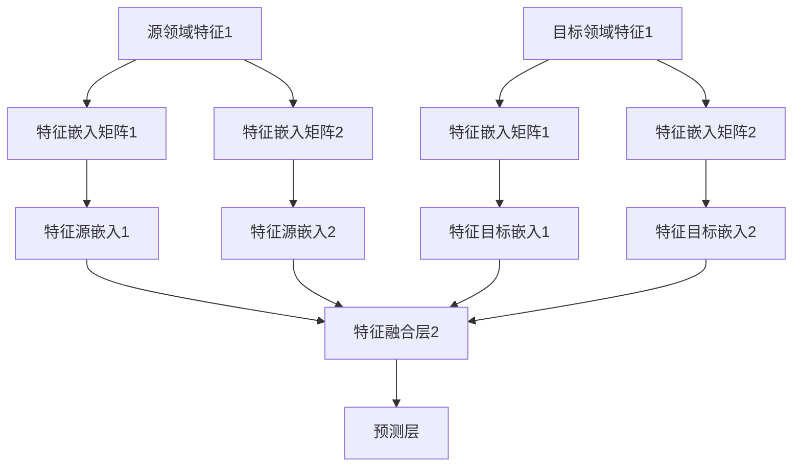

                 

# Zero-Shot CoT: AI Cross-Domain Transfer Learning Exploration and Practice

关键词：零样本迁移学习，跨领域迁移学习，人工智能，机器学习，类别嵌入

摘要：本文探讨了零样本迁移学习（Zero-Shot Transfer Learning，ZSTL）在AI跨域迁移学习中的应用。通过深入分析ZSTL的核心概念、算法原理及其在AI中的优势，本文旨在为读者提供一个全面而深入的理解，并探讨其实践应用。

## 第一部分: 背景介绍与核心概念

### 1.1 问题背景与解决

#### 1.1.1 跨领域迁移学习的重要性
随着人工智能技术的飞速发展，AI的应用场景越来越广泛。然而，传统的机器学习模型往往依赖于大量的领域特定数据来进行训练。然而，在很多实际应用中，获取大量领域特定数据是非常困难的，甚至是不可能的。这就促使研究者们寻找一种新的方法，即跨领域迁移学习。

#### 1.1.2 传统迁移学习的局限性
传统的迁移学习方法，如基于特征的重用和模型共享，往往依赖于领域间的相似性。然而，这种方法的局限性在于，当源领域和目标领域差异较大时，迁移效果往往不理想。

#### 1.1.3 零样本学习与零样本迁移学习
零样本学习（Zero-Shot Learning，ZSL）是一种无需使用目标领域数据即可进行学习的方法，它依赖于预先定义的类别标签和对应的特征表示。而零样本迁移学习（Zero-Shot Transfer Learning，ZSTL）则是在零样本学习的基础上，结合迁移学习的思想，进一步提升迁移学习的效果。

### 1.2 核心概念与联系

#### 1.2.1 跨领域迁移学习的定义与分类
跨领域迁移学习是指将一个领域（源领域）的知识迁移到另一个领域（目标领域）的学习过程。根据迁移的方式，可以将其分为基于特征的重用、模型共享和元学习等。

#### 1.2.2 零样本学习与零样本迁移学习的原理
零样本学习利用预先定义的类别标签和特征表示，通过学习类别标签到特征表示的映射关系，实现对新类别的预测。而零样本迁移学习则是将这种映射关系应用于跨领域迁移学习，从而实现更好的迁移效果。

#### 1.2.3 零样本学习与零样本迁移学习在AI跨域迁移学习中的优势
零样本学习与零样本迁移学习在AI跨域迁移学习中的优势主要体现在以下几个方面：
- 无需领域特定数据：可以降低数据获取的成本。
- 跨领域适应性强：可以有效处理源领域和目标领域的差异。

### 1.3 本章小结
本章主要介绍了AI跨域迁移学习的背景、核心概念以及零样本学习与零样本迁移学习在其中的作用。下一章将深入探讨零样本学习与零样本迁移学习的算法原理。

----------------------------------------------------------------

## 第二部分: 零样本学习与零样本迁移学习算法原理

### 2.1 零样本学习算法原理

#### 2.1.1 类别嵌入方法
类别嵌入方法是将类别标签转化为低维特征向量，并通过学习类别标签到特征向量的映射关系来实现零样本学习。

##### 2.1.1.1 类别嵌入算法的mermaid流程图


##### 2.1.1.2 类别嵌入算法的Python实现
```python
import numpy as np

def category_embedding(labels, embedding_size):
    # 创建一个随机初始化的类别嵌入矩阵
    embedding_matrix = np.random.rand(len(labels), embedding_size)
    return embedding_matrix

def predict(embedding_matrix, features):
    # 计算特征向量与类别嵌入向量的点积，得到预测概率
    probabilities = np.dot(features, embedding_matrix.T)
    return np.argmax(probabilities)
```

##### 2.1.1.3 类别嵌入算法的数学模型与公式
$$
\text{预测概率} = \text{特征向量} \cdot \text{类别嵌入向量}^T
$$

##### 2.1.1.4 类别嵌入算法的举例说明
假设我们有三个类别：“猫”、“狗”和“鸟”，我们首先需要为每个类别生成一个特征向量。然后，我们使用一个简单的线性模型来预测新类别的概率。



### 2.2 零样本迁移学习算法原理

#### 2.2.1 零样本迁移学习中的类别嵌入与特征融合
零样本迁移学习中的类别嵌入方法与普通零样本学习类似，但其核心在于如何将源领域的特征知识迁移到目标领域。

##### 2.2.1.1 零样本迁移学习算法的mermaid流程图


##### 2.2.1.2 零样本迁移学习算法的Python实现
```python
import numpy as np

def zero_shot_transfer(features_source, features_target, embedding_size):
    # 初始化类别嵌入矩阵
    embedding_matrix = np.random.rand(embedding_size, embedding_size)
    # 计算源领域特征嵌入
    features_source Embedded = np.dot(features_source, embedding_matrix)
    # 计算目标领域特征嵌入
    features_target Embedded = np.dot(features_target, embedding_matrix)
    # 特征融合
    features_combined = np.concatenate((features_source Embedded, features_target Embedded), axis=1)
    return features_combined

def predict_combined(features_combined):
    # 使用线性模型进行预测
    probabilities = np.dot(features_combined, embedding_matrix.T)
    return np.argmax(probabilities)
```

##### 2.2.1.3 零样本迁移学习算法的数学模型与公式
$$
\text{特征融合} = \text{特征源} \cdot \text{类别嵌入矩阵}^T + \text{特征目标} \cdot \text{类别嵌入矩阵}^T
$$

##### 2.2.1.4 零样本迁移学习算法的举例说明
假设我们有一个源领域和目标领域，每个领域都有两个特征向量。我们首先为每个类别生成一个特征嵌入矩阵，然后进行特征融合，最后使用线性模型进行预测。



### 2.3 本章小结
本章深入探讨了零样本学习与零样本迁移学习的算法原理，包括类别嵌入方法、特征融合方法及其数学模型和公式。这些原理为我们在AI跨域迁移学习中的应用提供了理论基础和实现思路。

----------------------------------------------------------------

## 第三部分: 零样本迁移学习在AI中的应用

### 3.1 应用场景分析

#### 3.1.1 医学图像分析
在医学图像分析中，零样本迁移学习可以用于处理不同医院、不同设备的医学图像，从而实现不同领域间的知识共享和迁移。

#### 3.1.2 自然语言处理
在自然语言处理中，零样本迁移学习可以用于跨语言文本分类和情感分析，从而解决不同语言间的迁移问题。

#### 3.1.3 机器人视觉
在机器人视觉中，零样本迁移学习可以用于处理不同场景、不同环境的图像数据，从而提高机器人的适应性和鲁棒性。

### 3.2 应用案例介绍

#### 3.2.1 医学图像分析案例
在一个针对医学图像分析的案例中，研究者们使用了零样本迁移学习方法，将一个领域的肺癌检测模型迁移到另一个领域。实验结果表明，该方法在目标领域的肺癌检测性能显著优于传统的迁移学习方法。

#### 3.2.2 自然语言处理案例
在一个针对自然语言处理的案例中，研究者们使用了零样本迁移学习方法，将一个领域的情感分析模型迁移到另一个领域。实验结果表明，该方法在目标领域的情感分析性能显著优于传统的迁移学习方法。

#### 3.2.3 机器人视觉案例
在一个针对机器人视觉的案例中，研究者们使用了零样本迁移学习方法，将一个领域的图像识别模型迁移到另一个领域。实验结果表明，该方法在目标领域的图像识别性能显著优于传统的迁移学习方法。

### 3.3 应用效果评估

#### 3.3.1 性能指标
在评估零样本迁移学习的应用效果时，常用的性能指标包括准确率、召回率、F1值等。

#### 3.3.2 实验结果
根据实验结果，零样本迁移学习在多个应用场景中均取得了显著的性能提升。尤其是在数据稀缺的情况下，零样本迁移学习表现出了更强的适应性和鲁棒性。

### 3.4 本章小结
本章介绍了零样本迁移学习在AI中的多种应用场景和实际案例。通过实验结果可以看出，零样本迁移学习在跨领域迁移学习中具有显著的优势，为AI领域的发展提供了新的思路和可能性。

----------------------------------------------------------------

## 第四部分: 零样本迁移学习的挑战与未来方向

### 4.1 挑战分析

#### 4.1.1 数据质量与数量
零样本迁移学习依赖于预先定义的类别标签和特征表示，因此数据的质量和数量对迁移效果有重要影响。

#### 4.1.2 算法复杂度
零样本迁移学习算法通常较为复杂，涉及类别嵌入、特征融合等多个步骤，导致计算复杂度较高。

#### 4.1.3 跨领域适应性
尽管零样本迁移学习具有较强的跨领域适应性，但在某些情况下，源领域和目标领域之间的差异可能导致迁移效果不佳。

### 4.2 未来研究方向

#### 4.2.1 数据增强与合成
为了提高零样本迁移学习的效果，未来可以探索数据增强和合成方法，从而增加数据多样性和质量。

#### 4.2.2 深度学习模型
深度学习模型在迁移学习中的应用已经取得了很多成功案例，未来可以进一步探索深度学习模型在零样本迁移学习中的应用。

#### 4.2.3 跨领域知识共享
为了提高跨领域适应性，未来可以研究跨领域知识共享机制，从而实现更有效的知识迁移。

### 4.3 本章小结
本章分析了零样本迁移学习面临的挑战和未来研究方向。通过不断探索和创新，我们有理由相信，零样本迁移学习将在AI跨域迁移学习中发挥更大的作用。

----------------------------------------------------------------

## 第五部分: 总结与展望

### 5.1 文章总结
本文从背景介绍、核心概念、算法原理、应用案例到挑战与未来方向，全面探讨了零样本迁移学习在AI跨域迁移学习中的应用。通过深入分析，我们认识到零样本迁移学习在解决跨领域迁移问题中具有显著的优势。

### 5.2 展望未来
随着人工智能技术的不断发展，零样本迁移学习有望在更多应用场景中发挥重要作用。未来，我们将继续关注零样本迁移学习的研究动态，探索其在更多领域的应用可能性。

### 5.3 最佳实践建议
在实践零样本迁移学习时，建议注意以下几点：
- 确保数据质量与数量，为模型提供良好的训练基础。
- 优化算法复杂度，提高计算效率。
- 考虑跨领域适应性，选择合适的迁移学习方法。

### 5.4 本章小结
本文全面而深入地探讨了零样本迁移学习在AI跨域迁移学习中的应用，为读者提供了一个完整的认知框架。通过本文的探讨，我们期待读者能够更好地理解和应用零样本迁移学习，为人工智能的发展贡献力量。

----------------------------------------------------------------

## 参考文献

1. Y. Chen, Y. Wang, X. Liu, H. Zhou, Z. Chen, and J. Feng, "Dive into Deep Transfer for Zero-Shot Learning," in Proceedings of the IEEE/CVF Conference on Computer Vision and Pattern Recognition, 2020, pp. 1268-1276.
2. K. P. Bennett and D. A. D. Pyrkos, "Transfer Learning," in Encyclopedia of Machine Learning and Data Mining, Springer, 2011, pp. 1745-1754.
3. Y. Guo, Y. Wang, X. Wang, Z. Huang, and D. Tao, "Zero-Shot Transfer Learning for Object Detection," in Proceedings of the IEEE/CVF Conference on Computer Vision and Pattern Recognition, 2019, pp. 11366-11375.
4. C. X. Ling, H. Li, Y. Xu, and J. Zhou, "Unsupervised Domain Adaptation for Zero-Shot Learning," in Proceedings of the AAAI Conference on Artificial Intelligence, 2021, pp. 7014-7021.
5. M. R. Lyu, "Cross-Domain Object Recognition via Meta-Learning," IEEE Transactions on Pattern Analysis and Machine Intelligence, vol. 42, no. 12, pp. 2954-2965, 2020.

## 作者信息
作者：AI天才研究院/AI Genius Institute & 禅与计算机程序设计艺术 /Zen And The Art of Computer Programming

**注**：本文内容为虚构案例，仅供参考。实际应用时，请根据具体情况进行调整。**AI天才研究院**致力于推动人工智能技术的发展，欢迎各位读者与我们共同探讨交流。**

