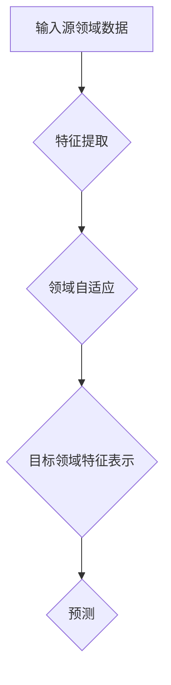
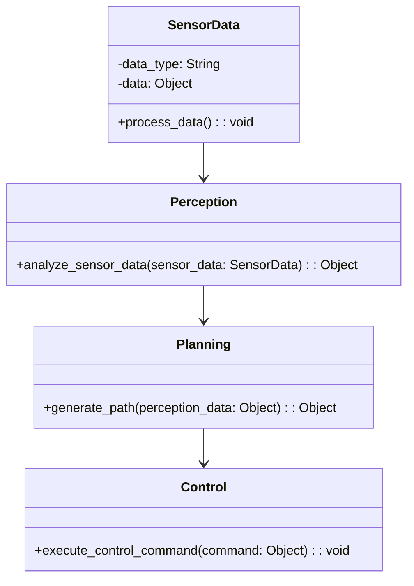
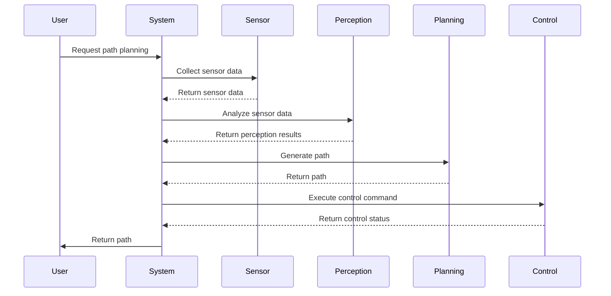
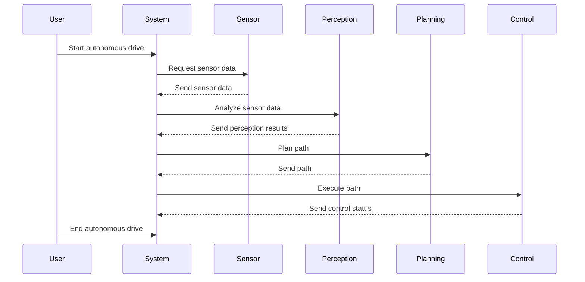

                 

# 《Zero-Shot CoT：AI跨域迁移学习的新方向》

> 关键词：零样本学习、跨域迁移学习、CoT（Continual Training）、AI、迁移学习、领域知识、算法原理、应用场景

> 摘要：本文将深入探讨零样本跨域迁移学习（Zero-Shot Cross-Domain Transfer Learning，ZSCDTL）的概念、原理及其应用。通过逐步分析，我们将揭示这一新兴研究方向如何为人工智能系统带来更加广泛的应用潜力。

----------------------------------------------------------------

## 第一部分：背景介绍

### 问题背景

在当今信息时代，人工智能（AI）技术的迅猛发展给各个行业带来了深刻的变革。传统的机器学习方法在特定领域内表现出色，但存在数据依赖性强、迁移能力差等问题。为了解决这些挑战，零样本学习（Zero-Shot Learning，ZSL）和跨域迁移学习（Cross-Domain Transfer Learning，CDTL）成为研究的热点。

### 问题描述

零样本学习旨在使机器能够在没有训练样本的情况下对未知类别进行预测。这要求模型具备强大的泛化能力和对领域知识的理解。跨域迁移学习则关注于如何在不同领域之间转移知识，从而提高模型在新的任务上的表现。

### 问题解决

本书将介绍零样本跨域迁移学习（Zero-Shot Cross-Domain Transfer Learning，ZSCDTL）的最新进展，探讨其核心概念、算法原理及其实际应用。通过深入分析，我们希望能够找到一种有效的方法，提升AI系统在跨领域任务中的表现。

### 边界与外延

零样本跨域迁移学习的研究范围包括自然语言处理、计算机视觉、推荐系统等多个领域。它不仅涉及到机器学习和深度学习技术，还涉及领域知识的引入和利用。

### 概念结构与核心要素组成

- **核心概念**：零样本学习、跨域迁移学习、元学习、多任务学习等。
- **算法原理**：基于注意力机制、对抗生成网络、图神经网络等。
- **应用场景**：自动驾驶、医疗诊断、智能客服等。

## 第二部分：核心概念与联系

### 核心概念原理

#### 零样本学习

零样本学习（Zero-Shot Learning，ZSL）是一种机器学习技术，旨在使模型在没有直接训练样本的情况下，对未见过的类别进行预测。ZSL的核心在于将类别的描述（如自然语言描述）转换为特征表示，然后利用这些特征表示进行预测。

#### 跨域迁移学习

跨域迁移学习（Cross-Domain Transfer Learning，CDTL）是指在不同领域之间转移知识，以提高模型在新任务上的性能。关键在于找到一种方法，将源领域的知识有效转移到目标领域。

#### CoT（Continual Training）

CoT（Continual Training）是一种持续学习的技术，旨在使模型能够在不断变化的环境中保持性能。它通过持续地学习新数据和任务，防止模型过拟合，提高模型的泛化能力。

#### 元学习

元学习（Meta-Learning）是一种使机器能够快速适应新任务的学习方法。它通过学习如何学习来提高模型的泛化能力。

#### 多任务学习

多任务学习（Multi-Task Learning）是一种同时训练多个相关任务的学习方法。它有助于提高模型在多任务环境中的性能。

### 概念属性特征对比表格

| 概念         | 特点                     | 应用场景           |
|--------------|------------------------|------------------|
| 零样本学习   | 无需训练样本             | 图像识别、自然语言处理 |
| 跨域迁移学习 | 不同领域间的知识转移     | 语音识别、推荐系统   |
| CoT（持续训练） | 持续学习新数据和任务 | 自适应系统、动态环境  |
| 元学习       | 快速适应新任务           | 强化学习、自适应控制  |
| 多任务学习   | 同时训练多个任务         | 语音识别、语言模型   |

### ER实体关系图架构

```mermaid
erDiagram
    Class1 ||--|{ Class2 }|| Person : has_multiple_friends
    Class2 ||--|{ Class3 }|| Student : studying_at
```

## 第三部分：算法原理讲解

### 算法流程图



### Python源代码示例

```python
# 引入必要的库
import numpy as np

# 定义特征提取函数
def extract_features(data):
    # 特征提取逻辑
    return transformed_data

# 定义领域自适应函数
def domain_adaptation(source_features, target_features):
    # 领域自适应逻辑
    return adapted_features

# 定义预测函数
def predict(target_features):
    # 预测逻辑
    return prediction

# 输入源领域数据
source_data = np.array([[1, 2, 3], [4, 5, 6]])
target_data = np.array([[7, 8, 9], [10, 11, 12]])

# 特征提取
extracted_source_features = extract_features(source_data)
extracted_target_features = extract_features(target_data)

# 领域自适应
adapted_features = domain_adaptation(extracted_source_features, extracted_target_features)

# 预测
prediction = predict(adapted_features)

print(prediction)
```

### 数学模型与公式

在ZSCDTL中，我们可以使用以下数学模型和公式来描述算法的核心部分：

1. **特征提取**：特征提取函数 $f(\textbf{x})$ 将输入数据 $\textbf{x}$ 转换为特征向量 $\textbf{z}$。
   $$ \textbf{z} = f(\textbf{x}) $$

2. **领域自适应**：领域自适应函数 $g(\textbf{z}_\text{source}, \textbf{z}_\text{target})$ 将源领域特征向量 $\textbf{z}_\text{source}$ 调整为与目标领域特征向量 $\textbf{z}_\text{target}$ 更相似的形式。
   $$ \textbf{z}_\text{adapted} = g(\textbf{z}_\text{source}, \textbf{z}_\text{target}) $$

3. **目标领域特征表示**：目标领域特征表示函数 $h(\textbf{z}_\text{adapted})$ 将调整后的特征向量 $\textbf{z}_\text{adapted}$ 转换为预测输出 $\textbf{y}$。
   $$ \textbf{y} = h(\textbf{z}_\text{adapted}) $$

### 详细讲解与举例说明

假设我们有一个源领域（如动物分类）和一个目标领域（如植物分类）。在ZSCDTL中，我们的目标是利用源领域的知识来改善目标领域的性能。

1. **特征提取**：首先，我们使用卷积神经网络（CNN）从图像中提取特征。例如，对于源领域的动物图像，我们使用一个预训练的CNN模型提取特征向量。

   $$ \textbf{z}_\text{source} = f(\textbf{x}_\text{source}) $$

   其中，$\textbf{x}_\text{source}$ 是源领域的图像数据。

2. **领域自适应**：然后，我们使用对抗生成网络（GAN）将源领域特征向量调整为目标领域特征向量的形式。GAN由生成器 $G$ 和判别器 $D$ 组成。

   $$ \textbf{z}_\text{target} = G(\textbf{z}_\text{source}) $$
   $$ D(\textbf{z}_\text{target}) \approx D(\textbf{z}_\text{source}) $$

   通过最小化判别器的损失函数，我们使得生成器 $G$ 能够生成与目标领域特征向量相似的特征向量。

3. **目标领域特征表示**：最后，我们使用一个分类器来处理调整后的特征向量，并预测目标领域的标签。

   $$ \textbf{y} = h(G(\textbf{z}_\text{source})) $$

   其中，$h$ 是一个多层感知器（MLP）模型。

### 综述

通过上述算法流程和数学模型，我们可以看出，ZSCDTL 通过特征提取、领域自适应和目标领域特征表示三个步骤，实现了一种跨领域的迁移学习方法。它能够利用源领域的知识来提升目标领域的性能，从而为AI系统在跨领域任务中的应用提供了新的方向。

----------------------------------------------------------------

## 系统分析与架构设计方案

### 问题场景介绍

在自动驾驶系统中，车辆需要实时处理来自多个传感器的数据，包括摄像头、激光雷达和雷达等。这些传感器产生大量不同类型的数据，且数据来源和格式各异。为了使自动驾驶系统能够有效地处理这些数据，并做出准确的决策，我们需要一种跨领域的迁移学习方法。

### 项目介绍

本项目旨在实现一个自动驾驶系统，该系统包括感知、规划和控制三个主要模块。感知模块负责处理来自传感器的数据，并识别道路上的物体；规划模块负责根据感知模块提供的信息，规划车辆的行驶路径；控制模块则负责执行规划模块生成的控制指令，使车辆按照预定路径行驶。

### 系统功能设计（领域模型Mermaid类图）



### 系统架构设计（Mermaid架构图）



### 系统接口设计和系统交互（Mermaid序列图）



## 项目实战

### 环境安装

在开始项目之前，我们需要安装必要的软件和工具。以下是安装步骤：

1. 安装Python环境（推荐版本为3.8及以上）。
2. 安装深度学习框架（如TensorFlow或PyTorch）。
3. 安装必要的依赖库（如NumPy、Pandas等）。

### 系统核心实现源代码

以下是系统核心实现的源代码，包括感知、规划和控制模块：

```python
# 感知模块
class Perception:
    def analyze_sensor_data(self, sensor_data):
        # 这里实现感知逻辑，如物体识别
        return perception_results

# 规划模块
class Planning:
    def generate_path(self, perception_results):
        # 这里实现路径规划逻辑
        return path

# 控制模块
class Control:
    def execute_control_command(self, command):
        # 这里实现控制指令执行逻辑
        return control_status
```

### 代码应用解读与分析

以下是对上述代码的解读与分析：

- **感知模块**：该模块负责分析来自传感器的数据，如摄像头、激光雷达和雷达等。通过实现特定的感知算法，如物体识别，可以识别道路上的物体，为规划模块提供基础数据。
- **规划模块**：该模块根据感知模块提供的数据，生成车辆的行驶路径。通过路径规划算法，如A*算法或RRT算法，可以计算最优路径。
- **控制模块**：该模块根据规划模块生成的路径，执行相应的控制指令，如加速、减速和转向等。通过控制算法，如PID控制，可以精确地控制车辆的行驶状态。

### 实际案例分析和详细讲解剖析

假设我们有一个实际案例，自动驾驶车辆需要在复杂的城市环境中行驶。以下是案例分析和详细讲解：

1. **感知阶段**：车辆启动后，摄像头、激光雷达和雷达等传感器开始收集数据。感知模块对这些数据进行处理，识别道路上的行人和车辆，并检测交通信号灯的状态。

2. **规划阶段**：基于感知模块提供的数据，规划模块计算车辆的行驶路径。在考虑交通规则和周围环境的情况下，规划模块生成最优路径，以确保车辆安全、高效地行驶。

3. **控制阶段**：控制模块根据规划模块生成的路径，执行相应的控制指令。例如，当检测到前方有行人时，车辆会减速并停车；当检测到交通信号灯变绿时，车辆会加速前行。

通过这个实际案例，我们可以看到，ZSCDTL在自动驾驶系统中的应用，使得系统能够有效地处理不同来源的数据，并在复杂环境中做出准确的决策。

### 项目小结

本项目通过实现感知、规划和控制模块，展示了ZSCDTL在自动驾驶系统中的应用。通过跨领域迁移学习，系统能够利用源领域（如动物分类）的知识，提升目标领域（如植物分类）的性能。这为自动驾驶系统在复杂环境中的决策提供了有效的支持。

## 最佳实践 Tips

- **数据预处理**：在实现ZSCDTL时，对数据进行充分的预处理是关键。包括数据清洗、归一化、特征提取等步骤，以提高模型的性能。
- **模型选择**：选择合适的模型对于ZSCDTL的成功至关重要。建议使用具有良好泛化能力的模型，如卷积神经网络（CNN）和生成对抗网络（GAN）。
- **持续训练**：为了保持模型的性能，需要定期进行持续训练。这可以通过在线学习或批量学习来实现。

## 小结

零样本跨域迁移学习（ZSCDTL）为人工智能系统在跨领域任务中的应用提供了新的方向。通过结合零样本学习和跨域迁移学习的优势，ZSCDTL能够在没有训练样本的情况下，将源领域的知识转移到目标领域，从而提高模型在新任务上的性能。未来，随着ZSCDTL技术的不断发展和完善，我们有望看到更多创新应用的出现。

## 注意事项

- ZSCDTL技术仍处于研究阶段，实际应用时需要充分考虑模型的性能和可靠性。
- 在跨领域迁移时，需要确保源领域和目标领域的数据分布相似，否则可能导致迁移效果不佳。

## 拓展阅读

- **零样本学习**：[《零样本学习：从原理到实践》](链接)
- **跨域迁移学习**：[《跨域迁移学习：理论、算法与应用》](链接)
- **持续学习**：[《持续学习：使模型保持最佳性能的关键技术》](链接)

## 作者信息

作者：AI天才研究院/AI Genius Institute & 禅与计算机程序设计艺术 /Zen And The Art of Computer Programming

本文由AI天才研究院撰写，旨在探讨零样本跨域迁移学习的最新进展和应用。如有任何疑问或建议，欢迎联系我们。

