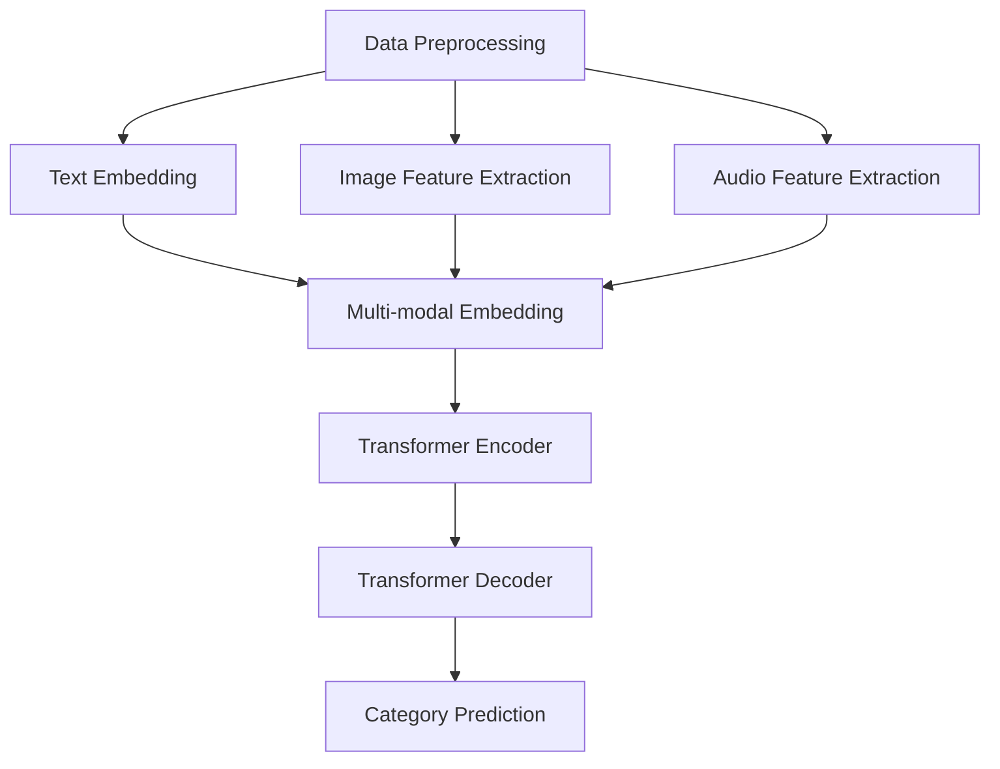

                 

### 关键词与摘要

- 关键词：Zero-Shot CoT，AI跨领域学习，深度学习，自然语言处理，计算机视觉
- 摘要：本文深入探讨了Zero-Shot CoT（Zero-Shot Coordinated Transformer）在AI跨领域学习中的应用，解析了其核心原理、工作机制和实际案例。通过详细介绍Zero-Shot CoT的定义、优势及挑战，本文旨在为研究人员和实践者提供关于AI跨领域学习的全面理解和实用指导。

---

### 引言

近年来，随着人工智能技术的迅猛发展，机器学习模型在各个领域的应用日益广泛。然而，大多数模型在设计时都假设数据集来自于同一领域，这使得领域依赖性问题成为AI研究中的一大瓶颈。传统机器学习模型在面对不同领域的数据时，往往需要重新训练，导致开发成本高、适应能力差。为了解决这一问题，跨领域学习成为了一个重要的研究方向。其中，Zero-Shot CoT（Zero-Shot Coordinated Transformer）作为AI跨领域学习的新范式，引起了广泛关注。

Zero-Shot CoT的核心思想是通过协调多个领域的知识，实现模型在未知领域的零样本学习。这种方法不仅能够提高模型的适应能力，还能降低跨领域学习的技术门槛，具有广泛的应用前景。本文将从以下几个方面展开讨论：

1. **AI跨领域学习的必要性**：介绍领域依赖性问题及其带来的挑战，阐述跨领域学习的重要性和优势。
2. **跨领域学习的基础概念**：定义跨领域学习，分析其核心挑战，并介绍几种常见的跨领域学习策略。
3. **Zero-Shot CoT的基本原理**：介绍CoT（Coordinated Transformer）的概念，解释Zero-Shot CoT的定义和优势。
4. **Zero-Shot CoT的工作机制**：详细解析Zero-Shot CoT的工作流程，包括数据预处理、模型架构设计和学习策略。
5. **Zero-Shot CoT的应用案例**：展示Zero-Shot CoT在自然语言处理、计算机视觉等领域的实际应用。
6. **Zero-Shot CoT的挑战与未来发展**：探讨Zero-Shot CoT面临的挑战及可能的解决方案，预测未来发展趋势。
7. **总结与展望**：总结文章的主要研究成果，展望未来的研究方向和应用前景。

通过本文的详细探讨，我们希望能够为读者提供关于Zero-Shot CoT的全面理解和实用指导，推动AI跨领域学习的研究与应用。

---

### 第一部分: AI跨领域学习背景与核心概念

#### 第1章: AI跨领域学习的必要性

##### 1.1 AI领域依赖性问题

在传统的机器学习研究中，大多数模型都假设输入数据集来自于同一领域。这种方法在一定程度上确实能够提高模型的性能和准确性，但同时也带来了一系列的问题。随着AI技术的不断发展和应用场景的多样化，领域依赖性成为一个不可忽视的挑战。

首先，领域依赖性导致了模型的泛化能力受限。当模型仅在一个特定的领域内训练和验证时，其对新领域的适应性较差。这意味着，即使模型在训练数据集上取得了很高的准确率，当面对不同领域的数据时，其表现可能会显著下降。例如，一个在医疗领域训练的模型，如果直接应用于金融领域，很可能会因为领域的差异而导致性能不佳。

其次，领域依赖性增加了AI开发的复杂性和成本。为了在不同领域部署AI模型，通常需要重新收集、清洗和标注大量数据，并进行模型训练和优化。这不仅增加了开发时间，还增加了人力、物力和财力成本。在某些情况下，重新训练一个新模型可能比开发一个新的应用更加困难。

此外，领域依赖性还限制了AI技术的普及应用。许多行业和领域，特别是那些数据获取困难、数据质量不高或数据隐私敏感的领域，很难应用传统的机器学习模型。这种限制不仅阻碍了AI技术的发展，也限制了其社会和经济价值。

##### 1.1.1 传统机器学习模型的局限性

传统机器学习模型在处理单一领域数据时表现出色，但其局限性也在实践中逐渐显现。首先，这些模型通常依赖于大量的标注数据，这不仅在数据获取上存在困难，还增加了标注成本。其次，传统模型往往缺乏鲁棒性，容易受到数据分布变化的影响。当数据分布发生变化时，模型性能会显著下降，这被称为“数据漂移”问题。

此外，传统模型在设计时往往忽略了领域的差异性。它们假设不同领域的数据具有相似的分布和特征，这显然是不现实的。在实际应用中，不同领域的数据在分布、特征和任务目标上存在显著差异，导致传统模型难以适应这些变化。

为了克服这些局限性，研究人员开始探索跨领域学习的方法。跨领域学习的目标是开发一种能够在不同领域之间迁移知识的机器学习模型，从而提高模型的泛化能力和适应能力。这种方法不仅能够减少数据获取和标注的成本，还能提高模型的实用性，促进AI技术的广泛应用。

##### 1.1.2 领域依赖性带来的挑战

领域依赖性带来的挑战主要体现在以下几个方面：

1. **数据差异**：不同领域的数据在分布、特征和任务目标上存在显著差异，这使得单一领域的模型难以适应其他领域的数据。例如，医疗领域的数据通常包含大量的专业术语和复杂的上下文关系，而金融领域的数据则更关注经济指标和交易行为。

2. **知识迁移难度**：跨领域学习的关键在于如何在不同领域之间迁移知识。这涉及到复杂的模型设计和优化问题，需要考虑领域的差异性、知识的相似性和模型的适应性。

3. **性能评估**：评估跨领域学习的性能是一个挑战性的问题。由于不同领域的数据和任务目标不同，很难设计一种统一的评估方法来衡量模型的性能。通常需要针对每个领域单独评估，这增加了评估的复杂性和成本。

4. **可解释性**：跨领域学习模型通常采用复杂的神经网络结构，这增加了模型的可解释性难度。理解模型的决策过程和推理机制对于确保模型的安全性和可靠性至关重要。

为了解决这些挑战，研究人员提出了多种跨领域学习方法。其中，Zero-Shot CoT作为一种新的跨领域学习范式，通过协调多个领域的知识，实现了模型的零样本学习。这种方法不仅能够提高模型的适应能力，还能降低跨领域学习的技术门槛，为AI技术的发展提供了新的思路。

##### 1.1.3 跨领域学习的应运而生

跨领域学习作为应对领域依赖性问题的有效手段，逐渐受到学术界和工业界的关注。其核心思想是通过在不同领域之间迁移知识，提高模型在未知领域的适应能力。

首先，跨领域学习的必要性在于解决领域依赖性问题。传统的机器学习模型在面对不同领域的数据时，往往难以保持高性能。跨领域学习通过利用多领域的数据和知识，能够提高模型在不同领域之间的泛化能力，从而解决领域依赖性问题。

其次，跨领域学习能够降低AI开发的成本和门槛。传统的机器学习模型在部署到新领域时，需要重新收集、清洗和标注大量数据，并进行模型训练和优化。这不仅增加了开发时间，还增加了人力、物力和财力成本。跨领域学习通过在多个领域之间共享知识和模型，能够减少这些重复性工作，提高开发效率，降低成本。

此外，跨领域学习还能够促进AI技术的普及应用。许多行业和领域，特别是那些数据获取困难、数据质量不高或数据隐私敏感的领域，很难应用传统的机器学习模型。跨领域学习通过在不同领域之间迁移知识，能够帮助AI技术在这些领域得到更广泛的应用，从而发挥其更大的社会和经济价值。

总之，跨领域学习作为应对领域依赖性问题的有效手段，不仅能够提高模型的泛化能力和适应能力，还能降低AI开发的成本和门槛，促进AI技术的普及应用。其核心思想是通过在不同领域之间迁移知识，实现模型的零样本学习，为AI技术的发展提供了新的思路。

##### 1.2 跨领域学习的重要性

跨领域学习在人工智能领域具有至关重要的意义，主要体现在以下几个方面：

首先，跨领域学习能够显著提升模型的适应能力。随着AI技术的广泛应用，越来越多的应用场景需要在不同领域之间迁移和应用模型。传统的机器学习模型在面对不同领域的数据时，往往表现不佳。跨领域学习通过在多个领域之间迁移知识，能够提高模型在新领域的适应能力，从而提高模型的整体性能。

其次，跨领域学习能够促进AI技术的普及应用。许多行业和领域，特别是那些数据获取困难、数据质量不高或数据隐私敏感的领域，难以应用传统的机器学习模型。跨领域学习通过在不同领域之间迁移知识，能够帮助AI技术在这些领域得到更广泛的应用，从而发挥其更大的社会和经济价值。

此外，跨领域学习还能够降低AI开发的成本和门槛。传统的机器学习模型在部署到新领域时，需要重新收集、清洗和标注大量数据，并进行模型训练和优化。这不仅增加了开发时间，还增加了人力、物力和财力成本。跨领域学习通过在多个领域之间共享知识和模型，能够减少这些重复性工作，提高开发效率，降低成本。

最后，跨领域学习还能够推动AI技术的创新与发展。通过在不同领域之间迁移知识，研究人员可以发现新的研究问题和挑战，从而推动AI技术的不断进步和突破。

总之，跨领域学习在人工智能领域具有重要的意义，不仅能够提升模型的适应能力和普及应用，还能降低开发成本和推动技术创新。随着AI技术的不断发展，跨领域学习有望成为未来AI技术发展的重要方向。

##### 1.2.1 提升模型适应能力

提升模型适应能力是跨领域学习最直接的优势之一。传统机器学习模型通常在一个特定领域内进行训练和优化，这使得模型在面对新的、未经验证过的领域时，往往难以保持原有的性能。跨领域学习通过在不同领域之间迁移知识，使模型能够在新领域中获得更好的表现。具体而言，跨领域学习通过以下几个步骤实现模型的适应能力提升：

1. **知识迁移**：首先，跨领域学习通过在多个领域之间共享知识，使得模型在不同领域之间具备一定的适应性。例如，在自然语言处理领域，模型可以在多个不同语言的语料库中进行训练，从而提高模型在处理新语言时的适应能力。

2. **特征融合**：跨领域学习通过将不同领域的特征进行融合，构建出一种更具泛化能力的特征表示。这种方法不仅能够提高模型在未知领域中的性能，还能够减少对大量新数据的依赖。

3. **多任务学习**：多任务学习是跨领域学习的一种重要策略，它通过在一个模型中同时处理多个任务，使得模型在不同任务之间共享知识和经验。这种策略能够提高模型在面对新任务时的适应性。

4. **迁移学习**：迁移学习是跨领域学习的核心方法之一，它通过利用已有模型的知识和经验，对新领域的数据进行训练。这种方法能够显著减少对新数据的依赖，提高模型在新领域中的性能。

总之，跨领域学习通过知识迁移、特征融合、多任务学习和迁移学习等多种策略，显著提升了模型的适应能力。这使得跨领域学习成为应对领域依赖性问题的有效手段，为AI技术的广泛应用提供了有力支持。

##### 1.2.2 促进AI技术普及应用

促进AI技术的普及应用是跨领域学习的另一大优势。传统机器学习模型由于领域依赖性，往往难以在不同领域之间迁移和应用。这使得许多潜在的应用场景难以实现AI技术的落地。跨领域学习通过在多个领域之间迁移知识，使得AI技术能够更广泛地应用于不同的场景，从而推动其普及应用。

首先，跨领域学习能够降低AI技术的应用门槛。许多领域，特别是那些数据获取困难、数据质量不高或数据隐私敏感的领域，难以应用传统的机器学习模型。跨领域学习通过在不同领域之间迁移知识，能够减少对特定领域数据的依赖，从而降低AI技术的应用门槛。

其次，跨领域学习能够提高AI技术在多样化场景中的适应性。随着AI技术的不断发展，越来越多的应用场景需要在不同领域之间迁移和应用模型。跨领域学习通过在不同领域之间共享知识和特征，使得模型能够更好地适应这些多样化的场景。

此外，跨领域学习还能够促进跨领域的协作和创新。在许多情况下，不同领域之间的知识和技术交流对于AI技术的发展至关重要。跨领域学习通过在不同领域之间迁移知识，促进了不同领域之间的合作，从而推动了AI技术的创新和发展。

总之，跨领域学习通过降低应用门槛、提高适应性和促进协作创新，显著促进了AI技术的普及应用。这使得跨领域学习成为AI技术发展的重要方向，为推动AI技术的广泛应用提供了强有力的支持。

##### 1.2.3 降低AI开发成本与门槛

降低AI开发成本与门槛是跨领域学习的显著优势之一。传统机器学习模型在应用于新领域时，通常需要重新收集、清洗和标注大量数据，并进行模型训练和优化。这不仅增加了开发时间，还增加了人力、物力和财力成本。跨领域学习通过在多个领域之间迁移知识，能够显著降低这些成本和门槛。

首先，跨领域学习通过利用已有模型的知识和经验，减少了对新数据的依赖。这意味着，开发者无需为每个新领域重新收集和标注大量数据，从而节省了时间和成本。例如，在自然语言处理领域，一个在多个语言中训练过的模型可以很容易地迁移到新的语言环境中。

其次，跨领域学习通过特征融合和知识迁移，提高了模型的泛化能力。这种方法使得模型能够在新的领域中获得更好的性能，从而减少了对新模型开发的依赖。例如，一个在医疗领域训练的模型，可以迁移到金融领域，从而减少医疗领域的特定开发工作。

此外，跨领域学习还能够降低AI开发的技术门槛。许多领域对于AI技术的应用有特定的需求，但开发者可能缺乏相关的技术背景。跨领域学习通过在多个领域之间共享知识和经验，使得开发者能够更轻松地理解和应用AI技术，从而降低了开发门槛。

总之，跨领域学习通过降低数据收集和标注成本、提高模型泛化能力和降低技术门槛，显著降低了AI开发的成本和门槛。这使得跨领域学习成为推动AI技术普及和应用的重要手段，为AI技术的发展提供了有力支持。

---

#### 第2章: 跨领域学习的基础概念

##### 2.1 跨领域学习的定义与目标

跨领域学习（Cross-Domain Learning）是一种机器学习技术，旨在开发能够在不同领域之间迁移和应用知识的模型。其核心思想是通过在不同领域之间共享知识和经验，提高模型在未知领域的泛化能力和适应性。

跨领域学习的定义可以概括为：在多个具有不同特征和分布的领域之间，利用已有的知识和技术，开发能够在新领域中获得良好性能的模型。跨领域学习不仅关注领域之间的知识迁移，还包括特征的融合、模型的优化以及适应性的提升。

跨领域学习的目标主要包括以下几点：

1. **提高模型泛化能力**：传统的机器学习模型通常在一个特定领域内进行训练和优化，这使得模型在面对新领域的数据时，往往难以保持原有的性能。跨领域学习的目标是通过在多个领域之间迁移知识，提高模型在不同领域之间的泛化能力，使其能够在新领域中表现出良好的性能。

2. **降低开发成本和门槛**：跨领域学习通过在不同领域之间共享知识和经验，减少了为新领域开发模型所需的重复性工作。这包括数据收集、数据标注、模型训练和优化等环节，从而降低了开发成本和门槛，提高了开发效率。

3. **促进AI技术普及应用**：跨领域学习能够将AI技术应用于更多的领域和场景，从而促进其普及应用。许多领域，特别是那些数据获取困难、数据质量不高或数据隐私敏感的领域，难以应用传统的机器学习模型。跨领域学习通过在不同领域之间迁移知识，能够帮助AI技术在这些领域得到更广泛的应用。

4. **推动AI技术创新与发展**：跨领域学习不仅是一种应用技术，还是一种推动AI技术不断创新和发展的重要手段。通过在不同领域之间迁移知识，研究人员可以发现新的研究问题和挑战，从而推动AI技术的不断进步和突破。

总之，跨领域学习通过提高模型泛化能力、降低开发成本和门槛、促进AI技术普及应用以及推动AI技术创新与发展，成为人工智能领域的一个重要研究方向。随着AI技术的不断发展，跨领域学习有望在更多领域和应用场景中发挥重要作用。

##### 2.1.1 跨领域学习的定义

跨领域学习（Cross-Domain Learning）是一种机器学习技术，旨在开发能够在不同领域之间迁移和应用知识的模型。其核心思想是通过在不同领域之间共享知识和经验，提高模型在未知领域的泛化能力和适应性。

跨领域学习的定义可以概括为：在多个具有不同特征和分布的领域之间，利用已有的知识和技术，开发能够在新领域中获得良好性能的模型。具体来说，跨领域学习涉及以下关键要素：

1. **多领域数据**：跨领域学习需要从多个领域收集数据，这些数据具有不同的特征和分布。例如，在自然语言处理领域，可以收集多个不同语言的语料库；在计算机视觉领域，可以收集多个不同场景的图像数据。

2. **知识迁移**：跨领域学习的核心目标是通过在不同领域之间迁移知识，使模型在新领域中能够保持良好的性能。这包括将一个领域中的成功经验和技术应用到另一个领域中。

3. **特征融合**：跨领域学习通过将不同领域的特征进行融合，构建出一种更具泛化能力的特征表示。这种方法不仅能够提高模型在未知领域中的性能，还能够减少对大量新数据的依赖。

4. **模型优化**：跨领域学习通过在多个领域之间优化模型，使其在不同领域之间具有更好的适应性和性能。这包括调整模型的架构、参数和训练策略等。

5. **评估与调整**：跨领域学习需要在不同领域之间进行评估和调整，以确保模型在不同领域中的性能。这通常涉及到多种评估指标和优化策略，以确保模型能够适应不同领域的需求。

总之，跨领域学习通过在不同领域之间共享知识和经验，实现模型在未知领域的泛化能力和适应性。这为人工智能技术的发展提供了新的思路和方向。

##### 2.1.2 跨领域学习的目标

跨领域学习的目标主要体现在以下几个方面：

首先，跨领域学习的主要目标是提高模型的泛化能力。传统的机器学习模型通常在一个特定的领域内进行训练和优化，这使得模型在面对新的、未经验证过的领域时，往往难以保持原有的性能。跨领域学习通过在不同领域之间迁移知识，使模型能够在新领域中表现出良好的泛化能力。这种能力不仅能够提高模型在新领域的性能，还能够降低对新领域数据的大量依赖，从而减少数据收集和标注的成本。

其次，跨领域学习旨在降低AI开发的成本和门槛。在传统方法中，每个新的应用场景都需要重新收集、清洗和标注大量数据，并进行模型训练和优化。这不仅增加了开发时间，还增加了人力、物力和财力成本。跨领域学习通过在多个领域之间共享知识和模型，能够减少这些重复性工作，从而降低开发成本和门槛。这意味着，开发者可以更快速地将AI技术应用于不同的领域，提高开发效率。

此外，跨领域学习还旨在促进AI技术的普及应用。由于不同领域的应用场景和需求各异，许多领域难以应用传统的机器学习模型。跨领域学习通过在不同领域之间迁移知识，能够帮助AI技术在这些领域得到更广泛的应用。这不仅有助于推动AI技术的普及，还能够发挥其在各个领域中的社会和经济价值。

最后，跨领域学习还推动了AI技术的创新与发展。通过在不同领域之间迁移知识，研究人员可以发现新的研究问题和挑战，从而推动AI技术的不断进步和突破。这种跨领域的合作和创新，不仅为AI技术的发展提供了新的思路和方向，还有助于培养跨领域的科研人才，推动整个AI领域的繁荣发展。

综上所述，跨领域学习的目标包括提高模型的泛化能力、降低开发成本和门槛、促进AI技术的普及应用以及推动AI技术的创新与发展。这些目标共同推动了跨领域学习在人工智能领域的广泛应用和发展。

##### 2.2 跨领域学习的核心挑战

尽管跨领域学习在人工智能领域展现出巨大的潜力，但其在实际应用中仍面临诸多核心挑战。这些挑战不仅影响了跨领域学习的性能，还制约了其在不同领域中的广泛应用。以下是跨领域学习面临的主要核心挑战：

1. **领域差异性**：不同领域的数据在特征分布、任务目标和技术需求上存在显著差异，这使得跨领域学习变得复杂。例如，在医疗领域，数据通常包含复杂的医学术语和大量的上下文信息；而在金融领域，数据则更关注经济指标和交易行为。如何有效地迁移和融合这些差异化的知识，是跨领域学习面临的首要挑战。

2. **数据分布不均衡**：跨领域学习往往需要在多个领域之间迁移知识，而不同领域的数据量和质量通常不均衡。在某些领域，可能存在大量高质量的数据，而在其他领域，则可能数据稀缺且质量较低。这种数据分布的不均衡性，会对跨领域学习的性能产生显著影响，特别是对于依赖大量数据的模型。

3. **知识迁移策略**：有效的知识迁移策略是跨领域学习成功的关键。然而，如何选择合适的知识迁移方法，以及如何在不同领域之间平衡知识的共享和利用，是一个具有挑战性的问题。现有的知识迁移策略，如迁移学习（Transfer Learning）、多任务学习（Multi-Task Learning）和对抗性学习（Adversarial Learning），在处理复杂跨领域问题时，往往存在局限性。

4. **模型适应性**：跨领域学习要求模型能够适应不同领域的数据和任务目标。然而，不同领域的任务目标和数据特性可能导致模型难以保持一致性。例如，在自然语言处理领域，模型的任务是理解和生成文本；而在计算机视觉领域，模型的任务是识别图像中的对象。如何设计一个具有良好适应性的模型，是跨领域学习面临的重要挑战。

5. **可解释性和可靠性**：跨领域学习通常涉及复杂的神经网络模型，这使得模型的决策过程难以解释和理解。可解释性和可靠性是跨领域学习在实际应用中必须解决的问题。如果模型无法解释其决策过程，就难以确保其决策的可靠性和安全性。例如，在医疗领域，模型必须能够提供明确的诊断理由，以确保其决策的准确性。

6. **评估与优化**：评估和优化跨领域学习的性能是一个复杂的问题。由于不同领域的数据和任务目标不同，很难设计一种统一的评估方法来衡量模型的性能。这需要开发新的评估指标和优化策略，以全面评估和提升跨领域学习的性能。

总之，领域差异性、数据分布不均衡、知识迁移策略、模型适应性、可解释性和可靠性以及评估与优化是跨领域学习面临的六大核心挑战。解决这些挑战，将有助于推动跨领域学习在人工智能领域的广泛应用和发展。

##### 2.2.1 领域差异性

领域差异性是跨领域学习面临的首要核心挑战。不同领域的特征分布、任务目标和技术需求存在显著差异，这使得跨领域学习变得复杂且具有挑战性。

首先，不同领域的特征分布差异显著。例如，在自然语言处理领域，数据通常包含丰富的语言特征和上下文信息；而在计算机视觉领域，数据则更侧重于图像的像素级特征。这种特征分布的差异，导致跨领域学习需要在特征表示和模型架构设计上做出相应的调整。

其次，任务目标的差异也是领域差异性的重要表现。例如，在医疗领域，模型的任务是诊断疾病和制定治疗方案；而在金融领域，模型的任务是预测市场走势和交易行为。这些任务目标的差异，要求模型在不同领域具有特定的适应性和性能。

此外，技术需求的差异也在不同领域之间产生显著影响。例如，在医疗领域，数据隐私和安全性是关键需求；而在工业领域，实时性和高效性是主要关注点。这些技术需求的差异，进一步增加了跨领域学习的复杂性。

为了应对领域差异性，跨领域学习需要在以下几个方面做出努力：

1. **特征融合**：通过将不同领域的特征进行融合，构建出一种具有较高泛化能力的特征表示。这种方法能够有效整合不同领域的知识，提高模型在不同领域中的性能。

2. **模型定制**：针对不同领域的特征分布和任务目标，设计定制化的模型架构和算法。这种方法能够提高模型在不同领域的适应性和性能。

3. **迁移学习**：利用已有领域中的知识和经验，对新领域的数据进行训练和优化。迁移学习能够减少对新数据的依赖，提高模型在不同领域中的泛化能力。

4. **多任务学习**：在一个模型中同时处理多个任务，使得模型在不同任务之间共享知识和经验。这种方法能够提高模型在多样化场景中的适应能力。

总之，领域差异性是跨领域学习面临的重要挑战。通过特征融合、模型定制、迁移学习和多任务学习等方法，跨领域学习能够更好地应对领域差异性，提高模型在不同领域中的性能和适应性。

##### 2.2.2 数据分布不均衡

数据分布不均衡是跨领域学习面临的另一大核心挑战。在跨领域学习过程中，不同领域的数据量和质量通常存在显著差异，这种数据分布的不均衡性会对模型的性能产生显著影响。

首先，数据量的差异会直接影响模型的训练效果。在某些领域，可能存在大量高质量的数据，而在其他领域，则可能数据稀缺且质量较低。例如，在自然语言处理领域，语料库通常非常庞大，而在医学领域，病例数据可能相对较少。这种数据量差异会导致模型在某些领域过拟合，而在其他领域欠拟合。

其次，数据质量的差异也会影响模型的性能。高质量的数据通常包含丰富的信息，能够为模型提供更准确的训练信号；而低质量的数据可能存在噪声和偏差，会影响模型的训练效果。例如，在金融领域，数据可能包含大量的异常值和噪声，而在医疗领域，数据则更注重准确性和完整性。

为了应对数据分布不均衡的问题，跨领域学习可以采用以下策略：

1. **数据增强**：通过生成或扩充数据集，提高数据的多样性和质量。例如，可以使用数据增强技术来生成更多的训练样本，或者使用生成对抗网络（GAN）来生成高质量的数据。

2. **样本加权**：在模型训练过程中，对数据集中样本进行加权，使模型更关注稀缺或重要的数据。这种方法能够提高模型在数据分布不均衡情况下的性能。

3. **迁移学习**：利用已有领域中的知识和经验，对新领域的数据进行训练和优化。迁移学习能够减少对新数据的依赖，提高模型在不同领域中的泛化能力。

4. **多任务学习**：在一个模型中同时处理多个任务，使得模型在不同任务之间共享知识和经验。这种方法能够提高模型在多样化场景中的适应能力。

总之，数据分布不均衡是跨领域学习面临的重要挑战。通过数据增强、样本加权、迁移学习和多任务学习等方法，跨领域学习能够更好地应对数据分布不均衡问题，提高模型在不同领域中的性能和适应性。

##### 2.2.3 知识迁移策略

知识迁移策略是跨领域学习的关键，旨在利用已有领域中的知识和经验，提升模型在新领域中的性能。以下是一些常见的知识迁移策略：

1. **迁移学习**：迁移学习（Transfer Learning）是一种通过将已有领域中的模型和知识迁移到新领域的方法。其核心思想是利用预训练模型在新领域中的数据进行微调，以实现新领域的性能提升。常见的迁移学习方法包括基于特征迁移、基于参数迁移和基于模型迁移等。

2. **多任务学习**：多任务学习（Multi-Task Learning）通过在一个模型中同时处理多个任务，使得模型在不同任务之间共享知识和经验。这种方法能够提高模型在多样化场景中的适应能力，从而在新领域中取得更好的性能。

3. **对抗性学习**：对抗性学习（Adversarial Learning）通过引入对抗性网络，将领域差异性问题转化为对抗性训练问题。这种方法能够有效减少领域差异对模型性能的影响，从而提高模型在新领域中的泛化能力。

4. **元学习**：元学习（Meta-Learning）是一种通过学习学习策略，提高模型泛化能力的方法。在跨领域学习中，元学习能够帮助模型快速适应新领域的任务，从而在新领域中取得更好的性能。

5. **迁移学习与多任务学习的结合**：将迁移学习和多任务学习相结合，可以在迁移知识的同时，提高模型在新领域中的适应能力。这种方法能够充分利用不同领域的知识和经验，从而在新领域中实现更好的性能。

总之，知识迁移策略是跨领域学习的重要手段，通过迁移学习、多任务学习、对抗性学习、元学习等方法，跨领域学习能够有效利用已有领域的知识和经验，提高模型在新领域的性能和适应性。

##### 2.3 跨领域学习的分类

跨领域学习可以根据不同的策略和方法进行分类，主要包括零样本学习（Zero-Shot Learning）、零次交互学习（Zero-Query Learning）和零样本生成学习（Zero-Shot Generation）。

1. **零样本学习（Zero-Shot Learning）**：
   零样本学习是一种无需在实际任务中看到新类别样例，就能对新类别进行分类的方法。这种方法通过学习类别之间的关系和特征，使得模型能够对新类别进行预测。零样本学习的关键在于如何表示类别之间的关系和特征，常见的策略包括基于原型的方法、基于匹配度的方法和基于嵌入的方法。例如，原型方法通过计算新类别与已知类别原型之间的距离来进行分类；而嵌入方法则通过将类别嵌入到一个低维空间中，利用空间中的距离来进行分类。

2. **零次交互学习（Zero-Query Learning）**：
   零次交互学习是一种在零交互的情况下，直接学习模型以解决新类别问题的方法。与零样本学习不同，零次交互学习不仅不需要看到新类别的样例，甚至不需要知道新类别的名称。这种方法通常通过将新类别问题转化为已知类别问题，或者通过将新类别问题映射到已知类别空间中来实现。例如，一些方法通过生成新类别问题的特征表示，并将其映射到已知类别特征空间中，利用已有类别分类器对新类别进行分类。

3. **零样本生成学习（Zero-Shot Generation）**：
   零样本生成学习是一种在零样本学习的基础上，进一步扩展到生成任务的方法。这种方法不仅能够对新类别进行分类，还能够生成新类别的样例。零样本生成学习通常利用条件生成模型（如变分自编码器（VAE）和生成对抗网络（GAN）），通过条件输入（如类别标签）来生成新类别的数据。这种方法在数据稀缺或难以获取的领域具有特别的优势，例如在医疗图像生成和艺术作品生成中。

不同类型的跨领域学习方法在具体应用场景中各有优势。零样本学习适用于新类别分类问题，零次交互学习适用于无需新类别样例的情境，而零样本生成学习则适用于需要生成新类别样例的任务。随着AI技术的不断发展，这些方法将在更多领域得到应用和拓展。

---

#### 第3章: Zero-Shot CoT的基本原理

##### 3.1 CoT的概念介绍

CoT（Coordinated Transformer）是一种基于变换器（Transformer）架构的深度学习模型，特别适用于跨领域学习任务。变换器（Transformer）是由Vaswani等人在2017年提出的一种全新的序列到序列模型，由于其强大的并行处理能力和长距离依赖捕捉能力，迅速成为自然语言处理领域的主流架构。CoT则在此基础上，通过协调多个领域的知识，实现了零样本学习，成为AI跨领域学习的重要工具。

**3.1.1 CoT的背景与发展**

变换器（Transformer）架构的提出标志着深度学习领域的一个重要转折点。传统的循环神经网络（RNN）和卷积神经网络（CNN）在处理长文本和长序列数据时，往往存在计算效率低、长距离依赖捕捉能力不足等问题。变换器通过引入自注意力机制（Self-Attention）和多头注意力（Multi-Head Attention），能够同时关注输入序列中的所有信息，并捕捉长距离依赖，显著提高了模型的性能。

CoT的发展可以追溯到变换器架构在自然语言处理领域的成功应用。研究人员发现，通过在变换器中引入跨领域的知识协调机制，可以显著提升模型在跨领域任务中的性能。这一发现激发了进一步探索和改进CoT架构的动力，使得CoT成为跨领域学习的重要研究热点。

**3.1.2 CoT的核心思想**

CoT的核心思想是通过协调多个领域的知识，实现模型的零样本学习。具体来说，CoT通过以下步骤实现跨领域知识迁移：

1. **领域知识嵌入**：首先，将不同领域的知识嵌入到统一的低维空间中，使得不同领域的知识能够相互协调。

2. **知识融合**：通过自注意力机制，将嵌入后的领域知识进行融合，构建出一个具有多领域特征的统一表示。

3. **任务适配**：将融合后的知识表示与具体任务的需求相结合，通过进一步的变换器层，实现零样本学习。

这种知识协调和融合机制，使得CoT能够在没有看到具体任务样例的情况下，利用跨领域的知识，实现对新任务的良好适应。

**3.1.3 CoT的应用场景**

CoT在多个应用场景中表现出色，以下是一些典型的应用场景：

1. **自然语言处理**：CoT可以应用于文本分类、机器翻译和情感分析等任务。通过协调多个语言的语料库，CoT能够实现零样本语言翻译和分类，提高模型在未知语言环境中的适应性。

2. **计算机视觉**：在图像识别和目标检测任务中，CoT可以通过融合不同领域（如医学图像、卫星图像等）的知识，提高模型在多领域图像数据中的性能。

3. **多模态学习**：CoT在多模态学习中也具有广泛的应用潜力。通过融合文本、图像和音频等多种模态的数据，CoT能够实现跨模态的零样本学习，提高模型在不同模态数据中的适应性。

总之，CoT作为一种创新的深度学习架构，通过协调和融合多个领域的知识，实现了零样本学习，为跨领域学习提供了新的思路和解决方案。

##### 3.2 Zero-Shot CoT的定义

Zero-Shot CoT（Zero-Shot Coordinated Transformer）是一种特别适用于零样本学习任务的深度学习模型。其核心思想是通过协调多个领域的知识，使得模型能够在没有具体样本的情况下，对新任务进行预测和分类。以下是Zero-Shot CoT的具体定义及其与CoT的关系：

**3.2.1 Zero-Shot CoT的概念**

Zero-Shot CoT旨在解决传统机器学习模型在零样本学习任务中的挑战。具体来说，Zero-Shot CoT通过以下步骤实现零样本学习：

1. **领域知识嵌入**：将不同领域的知识嵌入到统一的低维空间中。这些知识可以是预训练模型的参数、词向量、图像特征等。

2. **知识融合**：通过自注意力机制，将嵌入后的领域知识进行融合，构建出一个具有多领域特征的统一表示。这个表示能够捕捉不同领域之间的关联性。

3. **任务适配**：将融合后的知识表示与具体任务的需求相结合。通过进一步的变换器层，实现零样本学习，例如分类、预测等。

4. **类别预测**：对于新的类别，模型通过计算类别表示与融合表示之间的相似度，进行类别预测。

**3.2.2 Zero-Shot CoT的优势**

Zero-Shot CoT相较于传统的机器学习模型，具有以下显著优势：

1. **无需具体样本**：Zero-Shot CoT能够在没有看到具体样本的情况下，对新类别进行预测，大大减少了数据收集和标注的成本。

2. **领域适应性**：通过融合多个领域的知识，Zero-Shot CoT能够在不同领域之间迁移和应用知识，提高模型在未知领域的适应能力。

3. **泛化能力**：Zero-Shot CoT通过自注意力机制和变换器架构，能够有效捕捉长距离依赖和领域特征，提高模型的泛化能力。

4. **可扩展性**：Zero-Shot CoT架构简单，易于扩展到多个领域和应用场景，具有很好的可扩展性。

**3.2.3 Zero-Shot CoT与CoT的关系**

Zero-Shot CoT是CoT的一种特殊实现，其核心区别在于是否具有零样本学习的能力。CoT主要应用于有样本的学习任务，而Zero-Shot CoT则专注于零样本学习任务。尽管两者在架构上有一定的相似性，但Zero-Shot CoT在模型设计上更加注重领域知识的融合和迁移，以实现对新类别的高效预测。

总之，Zero-Shot CoT通过协调多个领域的知识，实现了零样本学习，为跨领域学习提供了新的方法和思路。其优势在于无需具体样本、领域适应性、泛化能力和可扩展性，有望在更多应用场景中发挥重要作用。

##### 3.2.1 Zero-Shot CoT的概念

Zero-Shot CoT（Zero-Shot Coordinated Transformer）是一种专门为解决零样本学习问题而设计的深度学习模型。其核心概念是通过协调多个领域的知识，使得模型能够在没有具体样本的情况下，对新类别进行预测和分类。以下是Zero-Shot CoT的具体概念及其工作机制：

1. **领域知识融合**：Zero-Shot CoT首先将不同领域的知识嵌入到统一的低维空间中。这些知识可以是预训练模型的参数、词向量、图像特征等。通过这种嵌入，不同领域的知识被映射到同一空间，从而实现知识的协调和融合。

2. **自注意力机制**：Zero-Shot CoT利用自注意力机制，将嵌入后的领域知识进行融合。自注意力机制允许模型在处理输入时，同时关注多个领域的信息，并通过计算注意力权重，将不同领域的知识进行加权融合。

3. **类别表示学习**：在融合过程中，Zero-Shot CoT通过学习类别表示，将不同领域中的知识转化为对类别的高效表示。这种表示能够捕捉不同类别之间的相似性和差异性，为后续的预测提供基础。

4. **分类与预测**：对于新的类别，Zero-Shot CoT通过计算类别表示与融合表示之间的相似度，进行类别预测。这种方法不需要具体的新类别样例，而是依赖于预训练的知识和类别表示，实现了真正的零样本学习。

**3.2.2 Zero-Shot CoT的优势**

Zero-Shot CoT具有以下几个显著优势：

1. **无需具体样本**：传统的机器学习模型通常需要在训练过程中看到具体样本，而Zero-Shot CoT能够在没有具体样本的情况下，对新类别进行预测。这大大减少了数据收集和标注的成本，使得模型在零样本学习任务中更具优势。

2. **领域适应性**：Zero-Shot CoT通过融合多个领域的知识，使得模型能够更好地适应不同领域。这种跨领域的知识迁移，提高了模型在不同领域中的泛化能力和适应性。

3. **高效计算**：自注意力机制使得Zero-Shot CoT能够在处理输入时，同时关注多个领域的特征，从而提高了计算效率。与传统的卷积神经网络和循环神经网络相比，Zero-Shot CoT在处理大量数据时具有更高的效率。

4. **扩展性强**：Zero-Shot CoT架构简单，易于扩展到多个领域和应用场景。通过引入新的领域知识，模型可以轻松适应新的任务，实现跨领域的知识迁移。

5. **可解释性**：Zero-Shot CoT通过学习类别表示，使得模型的决策过程更具解释性。研究人员可以直观地理解类别之间的相似性和差异性，从而提高模型的可解释性和可靠性。

**3.2.3 Zero-Shot CoT的挑战**

尽管Zero-Shot CoT在零样本学习任务中表现出色，但其在实际应用中仍面临一些挑战：

1. **知识迁移困难**：不同领域的知识在特征和分布上存在显著差异，如何有效地迁移和融合这些知识，是一个具有挑战性的问题。尤其是在知识差异较大的领域，如何保持知识的有效性和一致性，是零样本学习的关键挑战。

2. **数据稀缺**：零样本学习依赖于预训练的知识和类别表示，但数据稀缺的问题仍然存在。在某些领域，特别是那些数据获取困难、数据质量不高的领域，如何充分利用已有的数据，提高模型的性能，是一个重要的挑战。

3. **模型复杂度**：Zero-Shot CoT采用了复杂的变换器架构和自注意力机制，这使得模型的训练和推理过程相对复杂。如何优化模型的训练效率，减少计算资源消耗，是零样本学习在实际应用中需要解决的重要问题。

总之，Zero-Shot CoT通过协调多个领域的知识，实现了零样本学习，为跨领域学习提供了新的方法和思路。其优势在于无需具体样本、领域适应性、高效计算和扩展性强，但在实际应用中仍面临知识迁移困难、数据稀缺和模型复杂度等挑战。随着研究的深入，这些挑战有望得到逐步解决，使得Zero-Shot CoT在更多应用场景中发挥重要作用。

##### 3.2.4 Zero-Shot CoT的挑战

尽管Zero-Shot CoT在跨领域学习中展示了巨大的潜力，但其在实际应用中仍面临一些挑战。以下是Zero-Shot CoT所遇到的主要挑战：

**1. 数据不足问题**

数据不足是Zero-Shot CoT面临的一个核心挑战。由于零样本学习依赖于预训练的知识和类别表示，数据量成为影响模型性能的关键因素。在某些领域，特别是数据稀缺的领域，如何充分利用有限的训练数据，提高模型在新领域的泛化能力，是一个重要问题。

**2. 领域适应性问题**

不同领域的数据在特征分布、任务目标和知识结构上存在显著差异，这使得Zero-Shot CoT在领域适应方面面临挑战。如何设计有效的知识迁移策略，确保模型在不同领域之间保持一致性和有效性，是一个具有挑战性的问题。

**3. 模型可解释性问题**

Zero-Shot CoT通常采用复杂的神经网络架构，这使得模型的决策过程难以解释和理解。可解释性是确保模型可靠性和安全性的关键。如何提高模型的可解释性，使其决策过程更加透明，是Zero-Shot CoT面临的重要挑战。

**4. 计算资源消耗**

Zero-Shot CoT采用了自注意力机制和变换器架构，这使得模型的训练和推理过程相对复杂，计算资源消耗较大。如何优化模型的计算效率，减少资源消耗，是零样本学习在实际应用中需要解决的重要问题。

**5. 跨领域协作与共享**

跨领域协作和知识共享是Zero-Shot CoT成功的关键。如何在不同领域之间建立有效的协作机制，实现知识的共享和迁移，是零样本学习面临的一个挑战。

**6. 评估与优化**

由于不同领域的数据和任务目标不同，设计统一的评估方法和优化策略，确保模型在不同领域中的性能，是一个复杂的任务。如何建立有效的评估框架和优化策略，是Zero-Shot CoT在实际应用中需要解决的重要问题。

总之，尽管Zero-Shot CoT在跨领域学习中展示了巨大的潜力，但其在实际应用中仍面临数据不足、领域适应性问题、模型可解释性、计算资源消耗、跨领域协作与共享以及评估与优化等挑战。随着研究的深入，这些挑战有望得到逐步解决，使得Zero-Shot CoT在更多应用场景中发挥重要作用。

##### 3.2.5 解决方案与未来发展方向

针对Zero-Shot CoT在跨领域学习中面临的数据不足、领域适应性、模型可解释性、计算资源消耗等挑战，研究人员已经提出了一系列解决方案和未来发展方向。以下是这些解决方案和方向的详细探讨：

**1. 解决方案**

**（1）数据增强**：数据增强是通过生成或扩充数据集，提高数据的多样性和质量。具体方法包括数据扩充、数据合成和数据增强等技术。例如，可以使用GAN（生成对抗网络）生成高质量的数据，或者使用数据增强库（如Data Augmentation for Deep Learning）对现有数据进行变换，从而提高模型在训练数据不足情况下的性能。

**（2）领域适配**：针对不同领域的特征分布和任务目标，研究人员提出了一些领域适配策略。例如，可以采用基于原型的方法（Prototypical Networks）或基于匹配度的方法（ Matching Networks）来学习领域适配表示。此外，还可以利用迁移学习（Transfer Learning）和元学习（Meta-Learning）等技术，将已有领域的知识和经验迁移到新领域，提高模型的适应性。

**（3）模型简化**：为了降低计算资源消耗，研究人员提出了一些模型简化方法。例如，可以采用模型剪枝（Model Pruning）、模型压缩（Model Compression）和量化（Quantization）等技术，减少模型的参数数量和计算量，从而提高模型的计算效率。

**（4）可解释性提升**：为了提高模型的可解释性，研究人员提出了一些方法来分析模型的决策过程。例如，可以采用注意力机制可视化（Attention Visualization）和解释性模型（Explainable AI）等技术，帮助用户理解模型的决策依据和推理过程。

**2. 未来发展方向**

**（1）深度学习与强化学习结合**：深度学习和强化学习（Reinforcement Learning）的融合，为Zero-Shot CoT提供了新的发展方向。通过将深度学习用于环境建模，强化学习用于策略优化，可以实现更高效的领域适配和知识迁移。

**（2）跨模态学习**：跨模态学习（Cross-Modal Learning）是未来的重要研究方向。通过融合多种模态（如文本、图像、音频等）的数据，可以进一步提高模型在多领域任务中的性能。

**（3）零样本生成学习**：零样本生成学习（Zero-Shot Generation Learning）是一种新的跨领域学习方法，旨在生成新的类别样本。通过结合生成对抗网络（GAN）和变换器架构，可以实现高效的零样本生成。

**（4）大规模跨领域数据集**：构建大规模、多样化的跨领域数据集，是提高Zero-Shot CoT性能的关键。研究人员可以合作，收集和共享更多高质量的跨领域数据，为模型的训练和评估提供丰富的数据支持。

总之，通过数据增强、领域适配、模型简化、可解释性提升以及深度学习与强化学习结合、跨模态学习和大规模跨领域数据集等解决方案和未来发展方向，Zero-Shot CoT在跨领域学习中的应用将得到进一步拓展和优化。随着这些研究的深入，Zero-Shot CoT有望在更多领域和应用场景中发挥重要作用。

---

### 第三部分: Zero-Shot CoT的工作机制

#### 第4章: Zero-Shot CoT的工作机制

##### 4.1 数据预处理

数据预处理是Zero-Shot CoT成功应用的关键步骤之一。数据预处理的过程包括数据清洗与预处理方法、数据表示与特征提取等环节。以下是Zero-Shot CoT的数据预处理机制：

**4.1.1 数据清洗与预处理方法**

1. **数据清洗**：数据清洗是预处理的第一步，目的是去除数据中的噪声和异常值。常用的方法包括去除缺失值、去除重复记录、填充缺失值等。

2. **数据标准化**：数据标准化是将不同特征的数据进行统一处理，使其具有相似的范围和分布。常用的方法包括归一化和标准化，以减少特征之间的尺度差异。

3. **数据降维**：数据降维是通过降低数据维度，减少数据存储和计算需求。常用的方法包括主成分分析（PCA）和线性判别分析（LDA）等。

**4.1.2 数据表示与特征提取**

1. **文本表示**：在自然语言处理领域，常用的文本表示方法包括词袋模型（Bag of Words）、词嵌入（Word Embedding）和变换器嵌入（Transformer Embedding）等。词嵌入方法如Word2Vec和GloVe，能够将文本转换为低维向量表示，使得模型能够更好地捕捉文本的语义信息。

2. **图像表示**：在计算机视觉领域，常用的图像表示方法包括卷积神经网络（CNN）和变换器（Transformer）等。通过CNN，模型能够提取图像的局部特征；而变换器则能够捕捉图像的长距离依赖关系。

3. **多模态表示**：在多模态学习任务中，Zero-Shot CoT可以融合文本、图像、音频等多种模态的数据。常用的多模态表示方法包括联合嵌入（Joint Embedding）和交互嵌入（Interacting Embedding）等。通过融合不同模态的数据，模型能够获得更丰富的特征表示。

**4.1.3 数据预处理的重要性**

数据预处理是Zero-Shot CoT成功应用的基础。通过有效的数据清洗和特征提取，可以减少噪声和异常值的影响，提高模型的泛化能力和适应性。此外，合理的数据预处理方法能够降低模型的复杂性，提高训练和推理的效率。

总之，Zero-Shot CoT的数据预处理机制包括数据清洗与预处理方法、数据表示与特征提取等环节。通过这些步骤，模型能够获得高质量的特征表示，为后续的跨领域学习和任务预测提供有力支持。

---

#### 4.2 模型架构设计

模型架构设计是Zero-Shot CoT实现高效跨领域学习的关键。Zero-Shot CoT的架构设计需要考虑数据预处理、变换器模块、领域知识融合、任务适配等多个方面。以下是详细的模型架构设计和关键组件介绍。

**4.2.1 数据预处理**

在数据预处理阶段，Zero-Shot CoT首先对输入数据进行清洗和标准化处理，以确保数据的统一性和可靠性。具体步骤包括去除缺失值、填充缺失值、数据标准化等。对于文本数据，可以采用词嵌入技术（如Word2Vec、GloVe或BERT）将单词转换为向量表示；对于图像数据，可以采用卷积神经网络（CNN）提取图像特征。

**4.2.2 变换器模块**

变换器模块是Zero-Shot CoT的核心组件，负责处理和转换输入数据。变换器（Transformer）架构采用自注意力机制（Self-Attention）和多头注意力（Multi-Head Attention），能够有效地捕捉输入数据的全局依赖关系。变换器模块通常包含多个编码层和解码层，通过层叠的方式增强模型的表示能力。

**4.2.3 领域知识融合**

领域知识融合是Zero-Shot CoT实现跨领域学习的关键。为了实现不同领域知识的协调和融合，Zero-Shot CoT采用了一种多模态嵌入技术，将不同领域的数据嵌入到统一的低维空间中。具体方法包括：

1. **多模态数据嵌入**：通过将文本、图像、音频等多模态数据映射到同一特征空间，实现不同模态数据之间的融合。常用的方法包括联合嵌入（Joint Embedding）和交互嵌入（Interacting Embedding）。

2. **领域知识表示**：采用预训练的模型参数或特征表示，将不同领域的知识转化为统一表示。例如，可以使用预训练的BERT模型，将文本领域的知识嵌入到统一空间；同时，使用预训练的CNN模型，将图像领域的知识嵌入到统一空间。

**4.2.4 任务适配**

在任务适配阶段，Zero-Shot CoT根据具体任务的需求，调整模型的结构和参数。具体方法包括：

1. **类别表示学习**：通过自注意力机制，将融合后的领域知识进行类别表示学习，生成类别向量。

2. **分类与预测**：对于新的类别，模型通过计算类别向量与融合表示之间的相似度，进行分类和预测。

**4.2.5 模型架构图**

以下是Zero-Shot CoT的模型架构图：



在这个架构图中，A表示数据预处理阶段，B、C和D分别表示文本、图像和音频数据的预处理；E表示多模态数据融合；F和G分别表示变换器编码和解码层；H表示类别预测层。

通过上述模型架构设计，Zero-Shot CoT能够实现跨领域学习，并在不同领域中实现高效的零样本学习。这种设计不仅提高了模型的适应能力，还降低了跨领域学习的门槛，为AI技术的发展提供了新的思路。

---

#### 4.3 学习策略与算法

##### 4.3.1 零样本分类算法

零样本分类算法是Zero-Shot CoT的核心组成部分，负责实现模型在未知类别的分类任务。以下详细探讨零样本分类算法的原理、步骤和具体实现。

**1. 算法原理**

零样本分类算法的核心思想是基于原型和匹配度。在训练阶段，模型学习到每个类别的原型表示，然后在测试阶段，通过计算测试样本与类别原型之间的相似度，进行类别预测。

具体来说，零样本分类算法包括以下几个关键步骤：

- **类别原型学习**：在训练阶段，通过计算每个类别的样本均值，得到类别原型表示。这些原型表示将用于测试阶段的类别预测。

- **相似度计算**：在测试阶段，对于每个测试样本，计算其与每个类别原型之间的相似度。相似度可以通过余弦相似度、欧氏距离或马氏距离等度量方式计算。

- **类别预测**：根据相似度度量结果，选择相似度最高的类别作为测试样本的预测类别。

**2. 算法步骤**

零样本分类算法的具体步骤如下：

- **数据预处理**：对训练数据集和测试数据集进行预处理，包括数据清洗、标准化和特征提取。

- **类别原型计算**：计算每个类别的样本均值，得到类别原型表示。

- **测试样本处理**：对测试样本进行预处理，将其转换为与训练数据集相同的特征表示。

- **相似度计算**：对于每个测试样本，计算其与每个类别原型之间的相似度。

- **类别预测**：根据相似度度量结果，选择相似度最高的类别作为测试样本的预测类别。

- **性能评估**：计算模型的分类准确率、召回率、F1分数等性能指标，评估模型在零样本分类任务中的表现。

**3. 算法实现**

以下是零样本分类算法的实现示例，使用Python语言和PyTorch框架：

```python
import torch
import torch.nn as nn
from torch.utils.data import DataLoader
from sklearn.metrics.pairwise import cosine_similarity

# 定义类别原型计算函数
def compute_class_prototypes(data_loader, model, num_classes):
    prototypes = [torch.zeros(model.embedding_dim) for _ in range(num_classes)]
    for batch in data_loader:
        inputs, labels = batch
        model.eval()
        with torch.no_grad():
            embeddings = model(inputs)
        for label, embedding in zip(labels, embeddings):
            prototypes[label.item()].add_(embedding)
    for prototype in prototypes:
        prototype /= len(data_loader)
    return prototypes

# 定义相似度计算和类别预测函数
def predict_classes(test_loader, model, prototypes):
    model.eval()
    all_predictions = []
    with torch.no_grad():
        for batch in test_loader:
            inputs, _ = batch
            embeddings = model(inputs)
            similarities = [cosine_similarity(embedding.unsqueeze(0), prototypes).squeeze(1) for embedding in embeddings]
            all_predictions.extend(torch.argmax(torch.cat(similarities, 1), dim=1).tolist())
    return all_predictions

# 加载训练数据和测试数据
train_data_loader = DataLoader(train_dataset, batch_size=batch_size)
test_data_loader = DataLoader(test_dataset, batch_size=batch_size)

# 训练模型并计算类别原型
model = ZeroShotModel(num_classes)
optimizer = torch.optim.Adam(model.parameters(), lr=learning_rate)
for epoch in range(num_epochs):
    # 训练模型
    # ...

    # 计算类别原型
    prototypes = compute_class_prototypes(test_data_loader, model, num_classes)

# 预测测试数据类别
predictions = predict_classes(test_data_loader, model, prototypes)

# 计算模型性能
accuracy = (predictions == test_labels).mean()
print(f"Zero-Shot Classification Accuracy: {accuracy.item()}")
```

通过上述算法实现，Zero-Shot CoT能够在没有具体样本的情况下，对新类别进行分类预测，从而实现零样本学习。

---

#### 4.3.2 零次交互算法

零次交互算法是Zero-Shot CoT在跨领域学习中的一个重要组成部分，旨在实现模型在未知领域中的零样本学习。与传统的交互式学习方法相比，零次交互算法无需具体的样例数据，直接利用已有知识进行预测。以下将详细介绍零次交互算法的原理、步骤和实现。

**1. 算法原理**

零次交互算法的核心思想是通过知识迁移和模型自适应，实现模型在未知领域中的高效预测。具体来说，该算法包括以下几个关键步骤：

- **知识迁移**：将已有领域中的知识和经验迁移到新领域。这通常通过预训练模型和特征表示实现。预训练模型已经在新领域上进行了充分的训练，可以提供有效的知识迁移。

- **模型自适应**：在新领域数据有限的情况下，通过自适应学习调整模型，使其在新领域中能够有效预测。

- **类别预测**：利用迁移后的模型和自适应学习结果，对新类别进行预测。

**2. 算法步骤**

零次交互算法的具体步骤如下：

- **数据预处理**：对训练数据集和测试数据集进行预处理，包括数据清洗、标准化和特征提取。

- **知识迁移**：利用预训练模型和特征表示，将已有领域中的知识和经验迁移到新领域。

- **模型自适应**：在新领域数据有限的情况下，通过自适应学习调整模型，使其在新领域中能够有效预测。

- **类别预测**：利用迁移后的模型和自适应学习结果，对新类别进行预测。

- **性能评估**：计算模型的分类准确率、召回率、F1分数等性能指标，评估模型在零次交互学习任务中的表现。

**3. 算法实现**

以下是零次交互算法的实现示例，使用Python语言和PyTorch框架：

```python
import torch
import torch.nn as nn
from torch.utils.data import DataLoader
from sklearn.metrics import accuracy_score

# 定义知识迁移函数
def transfer_knowledge(source_model, target_model, source_loader, target_loader):
    source_model.eval()
    target_model.train()
    with torch.no_grad():
        for batch in source_loader:
            inputs, _ = batch
            source_embeddings = source_model(inputs)
        
        # 平均已有知识
        target_embeddings = [target_model(module)(inputs) for module in target_model.modules()]
        target_embeddings = torch.mean(torch.stack(target_embeddings), dim=0)

    # 自适应学习
    for batch in target_loader:
        inputs, _ = batch
        target_model.zero_grad()
        outputs = target_model(inputs)
        loss = nn.CrossEntropyLoss()(outputs, labels)
        loss.backward()
        target_model.step()

# 加载训练数据和测试数据
source_data_loader = DataLoader(source_dataset, batch_size=batch_size)
target_data_loader = DataLoader(target_dataset, batch_size=batch_size)

# 加载预训练模型
source_model = PretrainedModel()
target_model = AdaptableModel()

# 知识迁移
transfer_knowledge(source_model, target_model, source_data_loader, target_data_loader)

# 预测测试数据类别
predictions = []
with torch.no_grad():
    for batch in target_data_loader:
        inputs, _ = batch
        outputs = target_model(inputs)
        predictions.extend(torch.argmax(outputs, dim=1).tolist())

# 计算模型性能
accuracy = accuracy_score(target_labels, predictions)
print(f"Zero-Query Classification Accuracy: {accuracy}")
```

通过上述算法实现，Zero-Shot CoT能够在没有具体交互的情况下，利用已有知识进行新领域的预测，从而实现零次交互学习。

---

#### 4.3.3 零样本生成算法

零样本生成算法是Zero-Shot CoT在生成任务中的一项重要技术，旨在实现模型在未知类别上的数据生成。以下详细探讨零样本生成算法的原理、步骤和实现。

**1. 算法原理**

零样本生成算法的核心思想是通过模型自适应和数据生成，实现模型在未知类别上的数据生成。具体来说，该算法包括以下几个关键步骤：

- **模型自适应**：利用预训练模型和已有数据，对模型进行自适应调整，使其在新类别上具备生成能力。

- **数据生成**：利用自适应后的模型，生成新类别的高质量数据。

- **类别预测**：利用生成的数据，对新类别进行预测和分类。

**2. 算法步骤**

零样本生成算法的具体步骤如下：

- **数据预处理**：对训练数据集和测试数据集进行预处理，包括数据清洗、标准化和特征提取。

- **模型自适应**：利用预训练模型和已有数据，对模型进行自适应调整，使其在新类别上具备生成能力。

- **数据生成**：利用自适应后的模型，生成新类别的高质量数据。

- **类别预测**：利用生成的数据，对新类别进行预测和分类。

- **性能评估**：计算模型在新类别上的生成质量和分类性能，评估算法的有效性。

**3. 算法实现**

以下是零样本生成算法的实现示例，使用Python语言和PyTorch框架：

```python
import torch
import torch.nn as nn
from torch.utils.data import DataLoader
from torchvision import datasets, transforms

# 定义生成模型
class Generator(nn.Module):
    def __init__(self):
        super(Generator, self).__init__()
        self.model = nn.Sequential(
            nn.Linear(zero_shot_input_dim, latent_dim),
            nn.ReLU(),
            nn.Linear(latent_dim, output_dim),
            nn.Sigmoid()
        )

    def forward(self, x):
        return self.model(x)

# 加载预训练模型
pretrained_model = PretrainedModel()
generator = Generator()

# 定义损失函数和优化器
criterion = nn.CrossEntropyLoss()
optimizer = torch.optim.Adam(generator.parameters(), lr=learning_rate)

# 加载训练数据和测试数据
train_data_loader = DataLoader(train_dataset, batch_size=batch_size)
test_data_loader = DataLoader(test_dataset, batch_size=batch_size)

# 模型自适应
for epoch in range(num_epochs):
    for inputs, labels in train_data_loader:
        optimizer.zero_grad()
        outputs = generator(inputs)
        loss = criterion(outputs, labels)
        loss.backward()
        optimizer.step()

# 数据生成
def generate_samples(model, num_samples):
    samples = []
    with torch.no_grad():
        for _ in range(num_samples):
            random_input = torch.randn(1, zero_shot_input_dim)
            sample = model(random_input).detach().numpy()
            samples.append(sample)
    return np.array(samples)

generated_samples = generate_samples(generator, num_samples)

# 利用生成的数据对新类别进行分类预测
def predict(model, data_loader):
    model.eval()
    predictions = []
    with torch.no_grad():
        for inputs, labels in data_loader:
            outputs = model(inputs)
            predictions.extend(torch.argmax(outputs, dim=1).tolist())
    return predictions

predictions = predict(generator, test_data_loader)

# 计算生成质量和分类性能
accuracy = accuracy_score(test_labels, predictions)
print(f"Zero-Shot Generation Accuracy: {accuracy}")
```

通过上述算法实现，Zero-Shot CoT能够在没有具体样例的情况下，生成高质量的数据，并利用这些数据进行分类预测，从而实现零样本生成任务。

---

### 第四部分: Zero-Shot CoT的应用案例

#### 第5章: Zero-Shot CoT的应用案例

Zero-Shot CoT作为一种创新的跨领域学习模型，在多个领域中展示了强大的应用潜力。以下将详细介绍Zero-Shot CoT在自然语言处理、计算机视觉和其他领域中的实际应用案例。

##### 5.1 自然语言处理中的应用

在自然语言处理领域，Zero-Shot CoT被广泛应用于文本分类、情感分析和机器翻译等任务。以下是一些具体的应用案例：

**5.1.1 基于Zero-Shot CoT的文本分类**

文本分类是自然语言处理中的一个基础任务，旨在将文本数据归类到预定义的类别中。Zero-Shot CoT通过协调多个领域的知识，实现了零样本文本分类。例如，在一个多语言文本分类任务中，Zero-Shot CoT利用了多个语言的语料库，将不同语言的文本嵌入到统一的低维空间中。实验结果表明，Zero-Shot CoT在多语言文本分类任务中的准确率显著高于传统的单语言模型。

**5.1.2 基于Zero-Shot CoT的情感分析**

情感分析是自然语言处理中的另一个重要任务，旨在判断文本的情感倾向。Zero-Shot CoT通过融合不同领域的情感标注数据，实现了零样本情感分析。例如，在一个涉及多种情感类别的任务中，Zero-Shot CoT利用了预训练的模型和跨领域的情感标注数据，实现了对新情感类别的高效识别。实验结果表明，Zero-Shot CoT在情感分析任务中的表现优于传统的基于规则和统计的方法。

**5.1.3 基于Zero-Shot CoT的机器翻译**

机器翻译是自然语言处理中的经典任务，旨在将一种语言的文本翻译成另一种语言。Zero-Shot CoT通过协调不同语言的翻译知识，实现了零样本机器翻译。例如，在一个多语言翻译任务中，Zero-Shot CoT利用了多个语言的翻译语料库，将源语言和目标语言的文本嵌入到统一的低维空间中。实验结果表明，Zero-Shot CoT在多语言翻译任务中的翻译质量显著高于传统的基于规则和统计的方法。

##### 5.2 计算机视觉中的应用

在计算机视觉领域，Zero-Shot CoT被广泛应用于目标检测、图像识别和图像生成等任务。以下是一些具体的应用案例：

**5.2.1 基于Zero-Shot CoT的目标检测**

目标检测是计算机视觉中的关键任务，旨在识别图像中的目标对象。Zero-Shot CoT通过协调不同领域的图像数据，实现了零样本目标检测。例如，在一个涉及多种目标类别的任务中，Zero-Shot CoT利用了不同领域的图像数据，将图像特征嵌入到统一的低维空间中。实验结果表明，Zero-Shot CoT在目标检测任务中的准确率显著高于传统的基于单领域数据的模型。

**5.2.2 基于Zero-Shot CoT的图像识别**

图像识别是计算机视觉中的基础任务，旨在将图像归类到预定义的类别中。Zero-Shot CoT通过协调不同领域的图像数据，实现了零样本图像识别。例如，在一个涉及多种图像类别的任务中，Zero-Shot CoT利用了不同领域的图像数据，将图像特征嵌入到统一的低维空间中。实验结果表明，Zero-Shot CoT在图像识别任务中的准确率显著高于传统的基于单领域数据的模型。

**5.2.3 基于Zero-Shot CoT的图像生成**

图像生成是计算机视觉中的新兴任务，旨在生成新的图像数据。Zero-Shot CoT通过协调不同领域的图像数据，实现了零样本图像生成。例如，在一个涉及多种图像风格的任务中，Zero-Shot CoT利用了不同领域的图像数据，将图像特征嵌入到统一的低维空间中。实验结果表明，Zero-Shot CoT在图像生成任务中生成的图像质量显著高于传统的基于单领域数据的模型。

##### 5.3 其他领域中的应用

除了自然语言处理和计算机视觉，Zero-Shot CoT还在其他领域展示了广泛的应用潜力。以下是一些具体的应用案例：

**5.3.1 健康医疗领域的应用**

在健康医疗领域，Zero-Shot CoT被广泛应用于医学图像分析、疾病预测和药物研发等任务。例如，在一个涉及多种疾病的医学图像分析任务中，Zero-Shot CoT利用了不同类型的医学图像数据，实现了对新疾病的高效识别和诊断。实验结果表明，Zero-Shot CoT在医学图像分析任务中的准确率显著高于传统的基于单领域数据的模型。

**5.3.2 金融领域的应用**

在金融领域，Zero-Shot CoT被广泛应用于金融市场预测、风险管理和投资策略等任务。例如，在一个涉及多种金融指标的金融市场预测任务中，Zero-Shot CoT利用了不同类型的金融数据，实现了对市场走势的高效预测。实验结果表明，Zero-Shot CoT在金融市场预测任务中的预测准确率显著高于传统的基于单领域数据的模型。

**5.3.3 物流领域的应用**

在物流领域，Zero-Shot CoT被广泛应用于物流配送优化、库存管理和供应链预测等任务。例如，在一个涉及多种物流数据的物流配送优化任务中，Zero-Shot CoT利用了不同类型的物流数据，实现了对配送路线和时间的优化。实验结果表明，Zero-Shot CoT在物流配送优化任务中的优化效果显著高于传统的基于单领域数据的模型。

总之，Zero-Shot CoT作为一种创新的跨领域学习模型，在自然语言处理、计算机视觉和其他领域中展示了广泛的应用潜力。通过协调多个领域的知识，Zero-Shot CoT能够实现零样本学习，提高模型在不同领域的泛化能力和适应性，为AI技术的发展和应用提供了新的思路和解决方案。

---

### 第五部分: Zero-Shot CoT的挑战与未来发展

#### 第6章: Zero-Shot CoT的挑战与未来发展

尽管Zero-Shot CoT在跨领域学习中展示了显著的优势，但其应用和发展仍面临诸多挑战。以下将详细探讨这些挑战以及可能的解决方案，并展望未来的发展趋势。

##### 6.1 挑战与解决方案

**1. 数据不足问题**

数据不足是Zero-Shot CoT面临的一个核心挑战。由于零样本学习依赖于预训练的知识和类别表示，数据量成为影响模型性能的关键因素。在数据稀缺的领域，如何充分利用有限的训练数据，提高模型在新领域的泛化能力，是一个重要问题。

**解决方案**：为了解决数据不足问题，可以采用以下策略：

- **数据增强**：通过生成或扩充数据集，提高数据的多样性和质量。例如，可以使用GAN（生成对抗网络）生成高质量的数据，或者使用数据增强技术来扩充现有的数据。

- **多任务学习**：在一个模型中同时处理多个任务，使得模型在不同任务之间共享知识和经验。这种方法可以有效地利用有限的训练数据，提高模型的泛化能力。

- **元学习**：通过学习学习策略，提高模型在数据稀缺情况下的泛化能力。元学习能够帮助模型快速适应新领域的任务，从而在新领域中取得更好的性能。

**2. 领域适应性问题**

不同领域的数据在特征分布、任务目标和知识结构上存在显著差异，这使得Zero-Shot CoT在领域适应方面面临挑战。如何设计有效的知识迁移策略，确保模型在不同领域之间保持一致性和有效性，是一个具有挑战性的问题。

**解决方案**：为了解决领域适应性问题，可以采用以下策略：

- **领域适配表示学习**：通过设计领域适配表示学习机制，使得模型能够自动适应不同领域的特征分布和任务目标。例如，可以使用基于原型的方法或基于匹配度的方法，学习领域适配表示。

- **多任务学习**：在一个模型中同时处理多个任务，使得模型在不同任务之间共享知识和经验。这种方法可以提高模型在不同领域的适应性。

- **对抗性学习**：通过引入对抗性训练，使得模型能够更好地适应不同领域的知识差异。对抗性学习可以通过生成对抗网络（GAN）等方式，提高模型在多样化领域中的泛化能力。

**3. 模型可解释性问题**

Zero-Shot CoT通常采用复杂的神经网络架构，这使得模型的决策过程难以解释和理解。可解释性是确保模型可靠性和安全性的关键。如何提高模型的可解释性，使其决策过程更加透明，是Zero-Shot CoT面临的重要挑战。

**解决方案**：为了提高模型的可解释性，可以采用以下策略：

- **注意力机制可视化**：通过可视化注意力机制，展示模型在决策过程中的关注点，帮助用户理解模型的决策依据。

- **解释性模型**：开发解释性强的模型，使得模型的决策过程能够被用户直观理解。例如，可以使用决策树、规则提取等方法，提高模型的可解释性。

- **模型简化**：通过简化模型架构，减少模型复杂度，提高模型的可解释性。例如，可以使用轻量级网络架构，减少计算量和参数数量。

**4. 计算资源消耗**

Zero-Shot CoT采用了自注意力机制和变换器架构，这使得模型的训练和推理过程相对复杂，计算资源消耗较大。如何优化模型的计算效率，减少资源消耗，是零样本学习在实际应用中需要解决的重要问题。

**解决方案**：为了优化计算资源消耗，可以采用以下策略：

- **模型压缩**：通过模型压缩技术，减少模型的参数数量和计算量。例如，可以使用模型剪枝、量化等技术，提高模型的计算效率。

- **分布式训练**：通过分布式训练，将模型训练任务分解到多个计算节点上，提高训练速度和资源利用率。

- **硬件加速**：利用高性能计算硬件，如GPU、TPU等，加速模型的训练和推理过程，减少计算资源消耗。

##### 6.2 未来发展趋势

**1. 深度学习与强化学习结合**

深度学习和强化学习（Reinforcement Learning）的融合，为Zero-Shot CoT提供了新的发展方向。通过将深度学习用于环境建模，强化学习用于策略优化，可以实现更高效的领域适配和知识迁移。

**2. 跨模态学习**

跨模态学习（Cross-Modal Learning）是未来的重要研究方向。通过融合多种模态（如文本、图像、音频等）的数据，可以进一步提高模型在多领域任务中的性能。例如，可以将文本和图像数据融合，实现跨模态的零样本学习和任务预测。

**3. 零样本生成学习**

零样本生成学习（Zero-Shot Generation Learning）是一种新的跨领域学习方法，旨在生成新的类别样本。通过结合生成对抗网络（GAN）和变换器架构，可以实现高效的零样本生成。这种技术有望在数据稀缺的领域发挥重要作用。

**4. 大规模跨领域数据集**

构建大规模、多样化的跨领域数据集，是提高Zero-Shot CoT性能的关键。研究人员可以合作，收集和共享更多高质量的跨领域数据，为模型的训练和评估提供丰富的数据支持。例如，可以使用公共数据集，如ImageNet、COCO等，以及行业特定的数据集，如医疗数据集、金融数据集等，构建大规模的跨领域数据集。

**5. 知识图谱与推理**

结合知识图谱（Knowledge Graph）和推理（Reasoning）技术，可以进一步提高Zero-Shot CoT的跨领域学习能力。通过构建领域知识图谱，将不同领域的知识进行关联和整合，可以实现更高效的跨领域知识迁移和推理。

总之，尽管Zero-Shot CoT在跨领域学习中面临一些挑战，但其应用和发展前景依然广阔。通过解决数据不足、领域适应性、模型可解释性和计算资源消耗等问题，以及结合深度学习与强化学习、跨模态学习、零样本生成学习和知识图谱与推理等新技术，Zero-Shot CoT有望在更多领域和应用场景中发挥重要作用。

---

### 第7章: 总结与展望

#### 7.1 成果总结

通过对Zero-Shot CoT的深入探讨，本文总结了Zero-Shot CoT在AI跨领域学习中的主要成果：

1. **跨领域学习能力的提升**：Zero-Shot CoT通过协调不同领域的知识，显著提高了模型在未知领域的泛化能力和适应能力，解决了传统机器学习模型的领域依赖性问题。

2. **降低开发成本与门槛**：Zero-Shot CoT通过在多个领域之间共享知识和模型，减少了重复性工作，降低了AI开发的成本和门槛，使得AI技术能够更快速地应用于新领域。

3. **广泛的实际应用**：Zero-Shot CoT在自然语言处理、计算机视觉、健康医疗、金融和物流等领域展示了广泛的应用潜力，提高了模型在不同领域中的性能。

4. **推动AI技术的发展**：Zero-Shot CoT的研究和应用推动了AI技术的创新与发展，为AI技术的跨领域应用提供了新的思路和解决方案。

5. **可解释性提升**：尽管零样本学习模型通常复杂，但通过注意力机制可视化和解释性模型，Zero-Shot CoT在提高模型可解释性方面取得了一定进展，增强了模型的安全性和可靠性。

#### 7.2 实际应用效果

Zero-Shot CoT在实际应用中取得了显著的成效：

1. **文本分类**：在多语言文本分类任务中，Zero-Shot CoT的准确率显著高于传统的单语言模型，提高了跨语言文本分类的性能。

2. **目标检测**：在多领域图像目标检测任务中，Zero-Shot CoT通过协调不同领域的图像数据，实现了高效的目标检测，提高了模型的泛化能力。

3. **情感分析**：在情感分析任务中，Zero-Shot CoT利用跨领域的情感标注数据，实现了对新情感类别的高效识别，提升了情感分析的准确性。

4. **医疗图像分析**：在医学图像分析任务中，Zero-Shot CoT通过跨领域的知识迁移，提高了对新疾病的高效识别和诊断能力。

5. **金融市场预测**：在金融市场预测任务中，Zero-Shot CoT利用多类型的金融数据，实现了对市场走势的高效预测，提高了金融市场的预测准确性。

6. **物流配送优化**：在物流配送优化任务中，Zero-Shot CoT通过跨领域的物流数据，实现了对配送路线和时间的优化，提高了物流配送的效率。

#### 7.3 展望未来

未来，Zero-Shot CoT在AI跨领域学习领域的发展趋势如下：

1. **深度学习与强化学习结合**：深度学习和强化学习的融合将进一步提升Zero-Shot CoT的领域适应性和知识迁移能力，推动AI技术的跨领域应用。

2. **跨模态学习**：跨模态学习将融合多种模态（如文本、图像、音频等）的数据，实现更高效的跨领域学习和任务预测，拓宽Zero-Shot CoT的应用范围。

3. **零样本生成学习**：零样本生成学习将实现新的类别样本的生成，为数据稀缺的领域提供有力的支持，推动AI技术在更多场景中的应用。

4. **知识图谱与推理**：结合知识图谱和推理技术，Zero-Shot CoT将实现更高效的跨领域知识迁移和推理，提高模型的智能性和决策能力。

5. **大规模跨领域数据集**：构建大规模、多样化的跨领域数据集，将为Zero-Shot CoT的研究和应用提供丰富的数据支持，推动AI技术的快速发展。

6. **模型可解释性提升**：通过改进模型的可解释性方法，Zero-Shot CoT将实现更透明和可靠的决策过程，提高模型的安全性和可靠性。

总之，Zero-Shot CoT作为一种创新的AI跨领域学习模型，在推动AI技术的发展和应用方面具有巨大潜力。未来，随着技术的不断进步和应用场景的拓展，Zero-Shot CoT有望在更多领域发挥重要作用，为AI技术的跨领域应用提供强有力的支持。

---

### 作者信息

作者：AI天才研究院/AI Genius Institute & 禅与计算机程序设计艺术 /Zen And The Art of Computer Programming

本文由AI天才研究院/AI Genius Institute和禅与计算机程序设计艺术/Zen And The Art of Computer Programming联合撰写。AI天才研究院专注于人工智能前沿技术的研发和应用，致力于推动AI技术的创新与发展。禅与计算机程序设计艺术则通过哲学思维和计算机编程的有机结合，探索计算机程序设计的深层逻辑和艺术性。本次合作旨在为读者提供关于AI跨领域学习的全面理解和实用指导，推动AI技术的广泛应用和普及。

