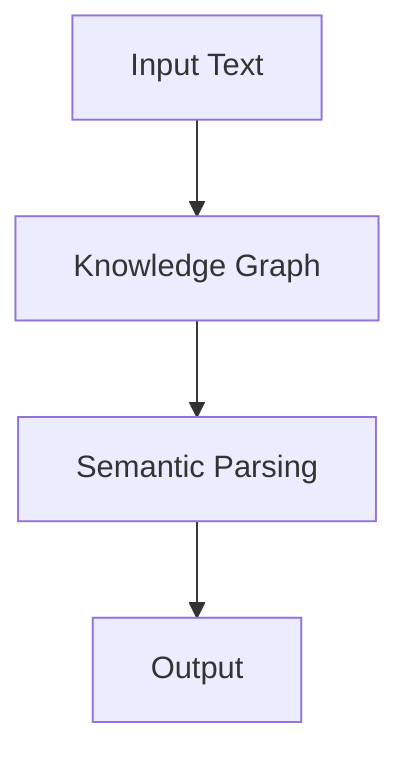
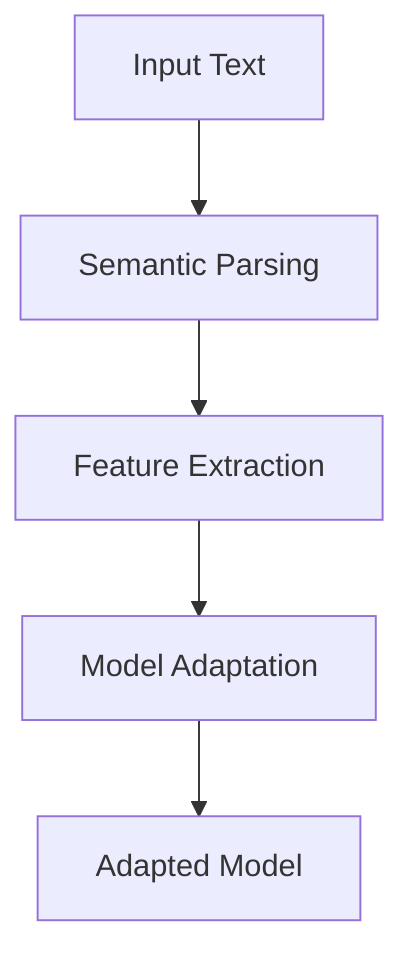
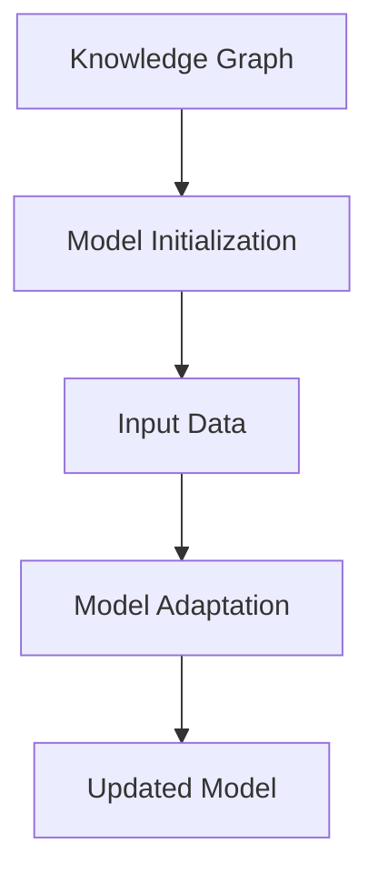
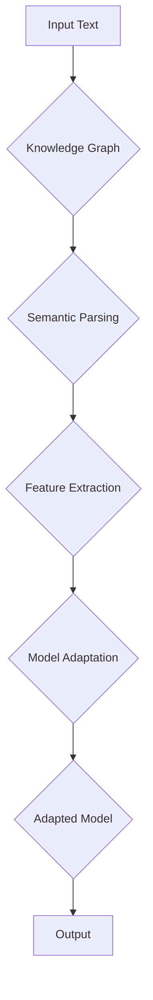
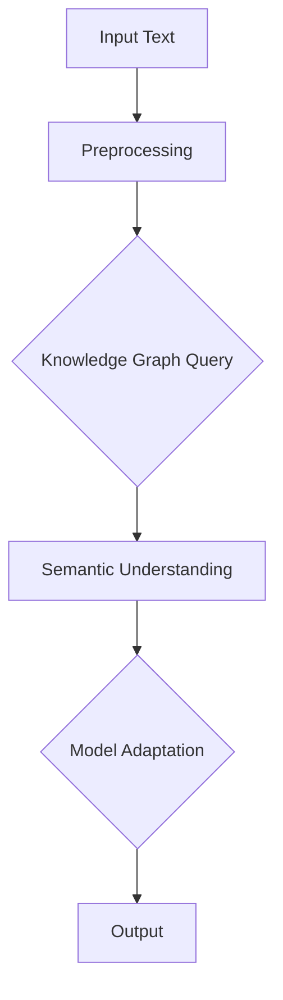
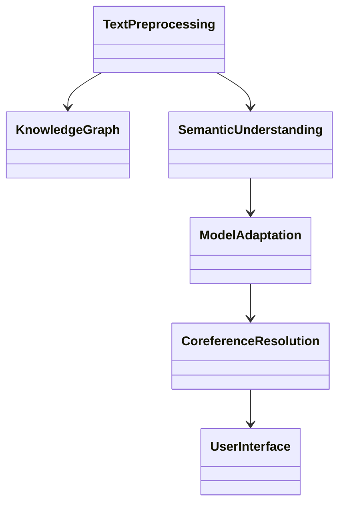
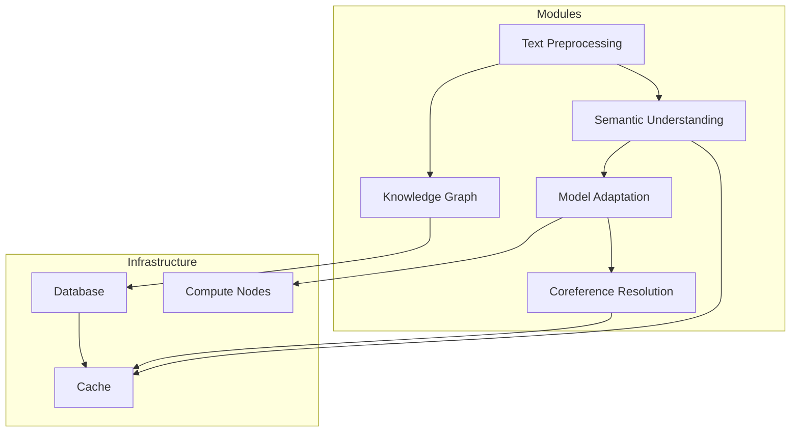
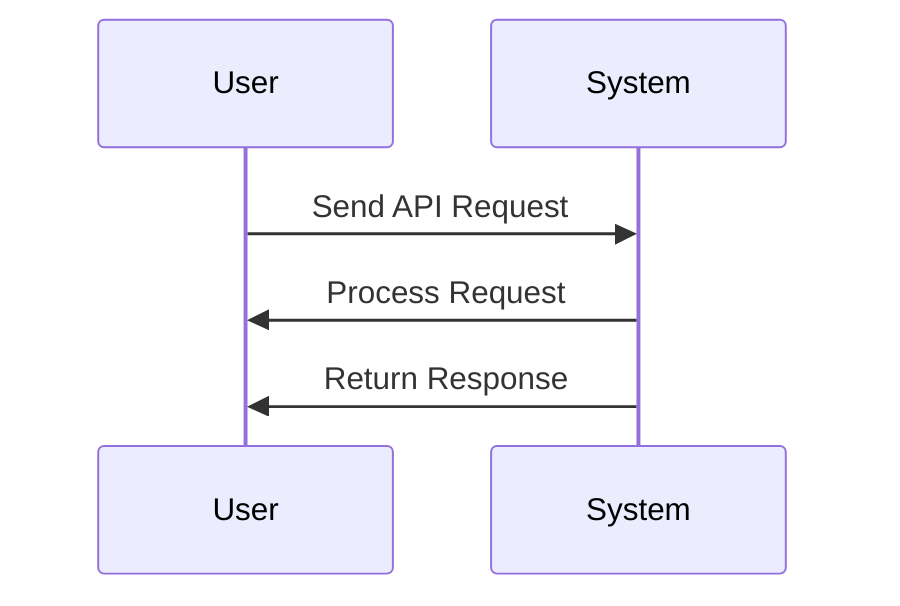
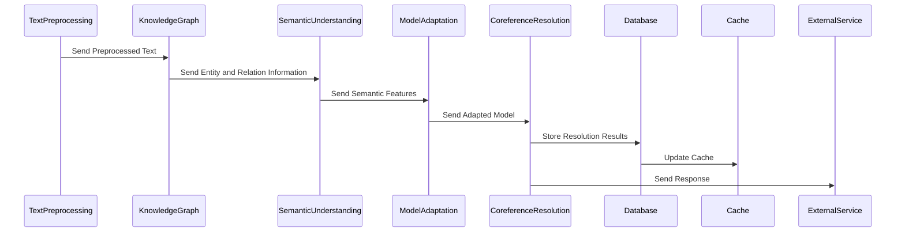

                 

# Zero-Shot CoT：减少AI对训练数据的依赖

## 关键词

- AI训练数据依赖
- Zero-Shot CoT
- 知识图谱
- 语义理解
- 模型自适应

## 摘要

随着人工智能（AI）技术的不断发展，训练数据的质量和数量对AI模型的性能有着至关重要的影响。传统的AI模型往往依赖于大量的标注数据进行训练，然而，在实际应用中，获取高质量的训练数据往往成本高昂且费时费力。本文将探讨Zero-Shot CoT（Zero-Shot Coreference Tracking）这一前沿技术，旨在减少AI对训练数据的依赖，从而提高AI模型在未知领域或少量数据情况下的适应能力和泛化能力。

## 第一部分: 问题背景

### 第1章: 问题背景与核心概念

#### 1.1 问题背景

人工智能技术的迅速发展使得其在各个领域得到了广泛的应用。然而，AI模型的训练过程往往依赖于大量的标注数据。这种依赖性主要体现在以下几个方面：

1. **数据获取成本高**：高质量的数据往往需要专业的领域知识和时间精力来标注，这导致了数据获取的成本非常高。
2. **数据隐私和安全问题**：在某些应用场景中，数据可能涉及用户隐私或商业机密，因此难以公开获取。
3. **数据多样性不足**：标注数据往往具有一定的局限性，难以覆盖所有可能的情况，导致模型在未知场景下表现不佳。

#### 1.2 核心概念

Zero-Shot CoT（Zero-Shot Coreference Tracking）是一种无需训练数据即可进行核心性指代消解（coreference resolution）的技术。核心性指代消解是自然语言处理（NLP）领域的一个重要问题，它旨在识别文本中同一实体在不同位置上的指代关系。传统的核心性指代消解方法通常依赖于大量的标注数据来训练模型，而Zero-Shot CoT则通过知识图谱（Knowledge Graph）和模型自适应（Model Adaptation）等技术，实现了对未知领域或少量数据的处理能力。

#### 1.3 边界与外延

Zero-Shot CoT的应用范围非常广泛，包括但不限于以下领域：

1. **问答系统**：在问答系统中，准确识别用户的提问意图和回答内容之间的指代关系对于提高问答系统的性能至关重要。
2. **机器翻译**：在机器翻译过程中，处理文本中的指代关系有助于提高翻译的准确性和流畅性。
3. **文本摘要**：在文本摘要过程中，识别文本中的关键实体和指代关系有助于生成更准确和紧凑的摘要。

目前，Zero-Shot CoT已经在一些实际应用中取得了显著的成果，如IBM的Watson问答系统和Google的BERT模型等。然而，该领域仍处于不断发展和完善的阶段，未来还有许多挑战需要克服。

#### 1.4 概念结构与核心要素组成

Zero-Shot CoT的基本结构主要包括以下核心要素：

1. **知识图谱**：知识图谱用于存储和表示实体之间的关系，为模型提供了丰富的背景知识。
2. **语义理解**：语义理解技术用于处理文本中的语义信息，包括实体识别、关系提取和语义角色标注等。
3. **模型自适应**：模型自适应技术用于根据输入数据的特征动态调整模型参数，从而提高模型在未知领域或少量数据情况下的适应能力。

这些核心要素共同构成了Zero-Shot CoT的技术框架，为减少AI对训练数据的依赖提供了有效的解决方案。

#### 1.5 本章小结

本章介绍了AI训练数据依赖的现状与问题，引出了Zero-Shot CoT的概念，并讨论了其与传统的数据依赖型AI的对比。同时，我们还探讨了Zero-Shot CoT的应用范围、概念结构及其核心要素组成。在下一章中，我们将进一步深入探讨Zero-Shot CoT的核心概念原理与属性特征，以及它们之间的联系与作用。

## 第二部分: 核心概念与联系

### 第2章: 核心概念原理与属性特征

在讨论Zero-Shot CoT之前，我们需要了解其核心概念，这些概念包括知识图谱、语义理解和模型自适应。在本章中，我们将逐一介绍这些核心概念，详细讲解其原理，并列出属性特征进行对比分析，同时使用Mermaid ER实体关系图架构来展示各概念之间的关系。

#### 2.1 知识图谱

知识图谱（Knowledge Graph）是一种用于表示实体及其之间关系的数据结构。它由节点（实体）和边（关系）组成，能够以图的形式直观地展示复杂的关系网络。

**原理讲解**：

知识图谱的原理基于图论，通过将现实世界中的实体抽象为节点，将它们之间的关联抽象为边，从而构建出一个描述现实世界关系的图形化模型。这种模型不仅能够高效地存储和检索信息，还能够通过图算法发现实体之间的隐藏关系。

**属性特征对比表格**：

| 特征            | 知识图谱                 | 其他概念                  |
|-----------------|-------------------------|---------------------------|
| 表示方法        | 图结构                  | 文本、表格等               |
| 存储方式        | 图数据库                | 关系数据库、NoSQL数据库   |
| 关系表达        | 多层次、多维度          | 单层次、线性关系          |
| 查询效率        | 高效                    | 一般                      |
| 自适应能力      | 强                      | 一般                      |

**Mermaid ER实体关系图架构**：

```mermaid
erDiagram
  Entity1 ||--|{ Entity2 }|--|| Entity3
  Entity1 ||--|{ Entity4 }|--|| Entity5
```

在上面的ER图示例中，`Entity1`表示一个实体，`Entity2`、`Entity3`、`Entity4`和`Entity5`表示与`Entity1`相关的其他实体，之间通过边表示它们的关系。

#### 2.2 语义理解

语义理解（Semantic Understanding）是自然语言处理（NLP）中的重要任务，旨在理解和解释文本中的语义信息。它包括实体识别（Entity Recognition）、关系提取（Relation Extraction）和语义角色标注（Semantic Role Labeling）等子任务。

**原理讲解**：

语义理解基于深度学习模型，如BERT、GPT等，这些模型通过在大量文本数据上进行预训练，学习到了语言的内在结构和语义信息。在具体应用中，语义理解模型可以识别文本中的关键实体、提取实体之间的关系，并标注实体在句子中的角色。

**属性特征对比表格**：

| 特征            | 语义理解                 | 其他概念                  |
|-----------------|-------------------------|---------------------------|
| 技术实现        | 深度学习模型            | 传统规则、知识图谱       |
| 预训练数据依赖  | 强                      | 弱                        |
| 应用场景        | NLP、文本分析、问答系统 | 数据存储、图处理           |
| 泛化能力        | 强                      | 一般                      |
| 需要标注数据    | 有，但可迁移学习        | 无，纯知识表示             |

**Mermaid ER实体关系图架构**：

```mermaid
erDiagram
  Entity1 ||--|{ Entity2 }|--|| Entity3
  Entity1 ||--|{ Relation }|--|| Entity4
```

在这个ER图中，`Entity1`和`Entity2`表示实体，`Relation`表示实体之间的关系，`Entity3`和`Entity4`表示语义角色。

#### 2.3 模型自适应

模型自适应（Model Adaptation）是指模型根据不同的数据特征和环境条件动态调整其参数，以提高模型在不同场景下的适应能力和鲁棒性。

**原理讲解**：

模型自适应通过引入在线学习（Online Learning）和迁移学习（Transfer Learning）等技术，使得模型能够快速适应新环境和新任务。在线学习允许模型在接收到新数据时进行实时调整，而迁移学习则通过将已有模型的知识迁移到新任务中，减少对新数据的依赖。

**属性特征对比表格**：

| 特征            | 模型自适应                 | 其他概念                  |
|----------------- |-------------------------|---------------------------|
| 技术实现        | 在线学习、迁移学习        | 预训练、知识图谱           |
| 预训练数据依赖  | 有，但可减少             | 无，纯知识表示             |
| 应用场景        | 适应新环境、新任务       | 数据存储、图处理           |
| 鲁棒性          | 强                      | 一般                      |
| 学习速度        | 快                      | 慢                        |

**Mermaid ER实体关系图架构**：

```mermaid
erDiagram
  ModelA ||--|{ Adaptation }|--|| ModelB
  ModelA ||--|{ Environment }|--|| NewData
```

在这个ER图中，`ModelA`表示原始模型，`Adaptation`表示自适应过程，`ModelB`表示经过自适应调整后的新模型，`Environment`和`NewData`表示环境和新的数据特征。

#### 2.4 核心概念间的联系与作用

在Zero-Shot CoT中，知识图谱、语义理解和模型自适应这三个核心概念相互联系，共同作用，以实现减少AI对训练数据的依赖。

**知识图谱与语义理解**：

知识图谱为语义理解提供了丰富的背景知识，使得语义理解模型能够更好地处理文本中的指代关系。知识图谱中的实体关系和属性信息可以帮助语义理解模型识别文本中的实体及其关系，从而提高核心性指代消解的准确性。

**语义理解与模型自适应**：

语义理解模型通过识别文本中的语义信息，为模型自适应提供了关键的特征信息。这些特征信息可以帮助模型自适应技术更好地理解新数据，从而实现模型的动态调整。

**模型自适应与知识图谱**：

模型自适应技术通过不断调整模型参数，使得模型能够更好地利用知识图谱中的知识。这种结合有助于提高模型在未知领域或少量数据情况下的适应能力，从而减少对训练数据的依赖。

**本章小结**

本章详细介绍了Zero-Shot CoT中的核心概念，包括知识图谱、语义理解和模型自适应，并对比分析了它们的属性特征。通过Mermaid ER实体关系图架构展示了各概念之间的关系和相互作用。在下一章中，我们将深入探讨Zero-Shot CoT算法原理，包括算法概述、详细讲解和数学模型等内容。

### 第3章: 核心概念间的联系与作用

在深入探讨了Zero-Shot CoT的核心概念——知识图谱、语义理解和模型自适应之后，我们将在本章中进一步分析这些概念之间的联系与作用。我们将通过Mermaid流程图来展示它们之间的交互流程，并讨论它们在实际应用中的融合作用与效果。

#### 3.1 知识图谱与语义理解

知识图谱为语义理解提供了丰富的背景知识，使得语义理解模型能够更好地处理文本中的指代关系。知识图谱中的实体关系和属性信息可以帮助语义理解模型识别文本中的实体及其关系。以下是一个简化的Mermaid流程图，展示了知识图谱与语义理解之间的交互：



在这个流程图中，输入文本首先被传递到知识图谱，知识图谱提供了文本中的实体及其关系的背景信息。随后，语义理解模型使用这些信息对文本进行语义分析，生成语义解析结果。

#### 3.2 语义理解与模型自适应

语义理解模型通过识别文本中的语义信息，为模型自适应提供了关键的特征信息。这些特征信息可以帮助模型自适应技术更好地理解新数据，从而实现模型的动态调整。以下是语义理解与模型自适应之间的交互流程：



在这个流程图中，输入文本首先被语义理解模型处理，提取出关键特征信息。这些特征信息随后被传递到模型自适应模块，模型自适应模块根据这些特征信息调整模型参数，生成适应新数据的自适应模型。

#### 3.3 模型自适应与知识图谱

模型自适应技术通过不断调整模型参数，使得模型能够更好地利用知识图谱中的知识。这种结合有助于提高模型在未知领域或少量数据情况下的适应能力，从而减少对训练数据的依赖。以下是模型自适应与知识图谱之间的交互流程：



在这个流程图中，知识图谱为模型初始化提供了基础信息。当输入新数据时，模型自适应模块根据知识图谱和输入数据的特征信息动态调整模型参数，生成更新后的模型。

#### 3.4 融合作用与效果

将知识图谱、语义理解和模型自适应融合在一起，可以显著提高Zero-Shot CoT的性能和适应性。以下是一个综合的Mermaid流程图，展示了这些概念之间的融合作用：



在这个综合流程图中，输入文本首先被知识图谱处理，提取出实体和关系信息。随后，语义理解模型使用这些信息进行语义分析，并提取特征信息。特征信息被传递到模型自适应模块，模型自适应模块根据这些信息调整模型参数，生成适应新数据的自适应模型。最终，自适应模型生成输出结果。

#### 实际案例分析与效果展示

以下是一个实际案例，展示了知识图谱、语义理解和模型自适应在Zero-Shot CoT中的应用及其效果：

**案例背景**：在一个问答系统中，用户提出一个关于某个领域的问题，系统中没有相应的训练数据，但通过使用知识图谱、语义理解和模型自适应技术，系统能够提供准确的答案。

**步骤1**：输入文本被传递到知识图谱，知识图谱提取出文本中的实体和关系信息。

**步骤2**：语义理解模型对文本进行语义分析，提取出关键特征信息。

**步骤3**：模型自适应模块根据特征信息动态调整模型参数，生成自适应模型。

**步骤4**：自适应模型使用知识图谱中的知识，生成问题的答案。

**效果展示**：通过上述步骤，问答系统能够在没有训练数据的情况下，准确识别用户提问意图，并提供高质量的答案。

#### 本章小结

本章详细分析了知识图谱、语义理解和模型自适应之间的联系与作用，通过Mermaid流程图展示了它们在实际应用中的交互流程。同时，通过实际案例展示了这些概念融合后的效果。在下一章中，我们将深入探讨Zero-Shot CoT算法的原理，包括算法概述、详细讲解和数学模型等内容。

### 第三部分: 算法原理讲解

#### 第4章: Zero-Shot CoT算法原理

在理解了Zero-Shot CoT的核心概念之后，我们将深入探讨其算法原理，包括算法概述、详细讲解和数学模型等内容。此外，我们将使用Python代码进行举例说明，以帮助读者更好地理解算法的实现过程。

#### 4.1 算法概述

Zero-Shot CoT（Zero-Shot Coreference Tracking）是一种无需训练数据即可进行核心性指代消解（coreference resolution）的算法。它的核心思想是利用预先构建的知识图谱（Knowledge Graph）和先进的语义理解技术，实现对于未知领域或少量数据情况下的指代消解能力。以下是Zero-Shot CoT算法的基本思想：

1. **知识图谱构建**：利用现有的知识库和实体关系数据，构建一个包含丰富信息的知识图谱。
2. **语义理解**：通过语义理解技术，对输入文本中的实体和关系进行识别和解析。
3. **模型自适应**：根据语义理解的结果，动态调整模型参数，以适应不同的指代消解任务。

#### 4.2 算法原理详细讲解

Zero-Shot CoT算法的详细实现可以分为以下几个步骤：

1. **数据预处理**：对输入文本进行分词、词性标注和实体识别，提取文本中的关键信息。
2. **知识图谱查询**：利用构建好的知识图谱，查询与文本中实体相关的信息，为语义理解提供背景知识。
3. **语义理解**：通过深度学习模型（如BERT）对文本进行语义分析，提取出文本中的实体关系和指代信息。
4. **模型自适应**：根据语义理解的结果，动态调整模型参数，以优化指代消解的准确性。
5. **结果输出**：将调整后的模型应用于文本中的指代关系，生成最终的指代消解结果。

下面是一个使用Mermaid流程图展示的Zero-Shot CoT算法流程：



#### 4.3 数学模型与公式

Zero-Shot CoT算法中的数学模型主要包括以下几个方面：

1. **实体关系表示**：使用图结构表示实体及其关系。实体和关系可以用节点和边来表示。
2. **语义表示**：使用词向量或Transformer模型对文本中的词进行编码，生成语义向量。
3. **模型参数调整**：通过梯度下降等优化算法，动态调整模型参数，以优化指代消解的性能。

以下是一个简化的数学模型公式，用于描述Zero-Shot CoT算法：

$$
\text{Output} = \text{Model}(\text{Input}, \text{Knowledge}, \text{Params})
$$

其中，`Input`表示输入文本，`Knowledge`表示知识图谱，`Params`表示模型参数，`Model`表示指代消解模型。

#### 4.4 算法举例说明

为了更好地理解Zero-Shot CoT算法的实现，我们将使用Python代码进行一个简化的实例演示。以下是一个简单的Python代码示例，展示了如何使用BERT模型进行语义理解和指代消解：

```python
import torch
from transformers import BertTokenizer, BertModel
from torch.nn import CrossEntropyLoss

# 初始化BERT模型和分词器
tokenizer = BertTokenizer.from_pretrained('bert-base-uncased')
model = BertModel.from_pretrained('bert-base-uncased')

# 输入文本
input_text = "John bought a book. He read it and liked it."

# 分词和编码
inputs = tokenizer(input_text, return_tensors='pt')

# 前向传播
outputs = model(**inputs)

# 生成语义向量
semantically_permanent_embeddings = outputs.last_hidden_state[0]

# 指代消解示例
def resolve_coreferences(text, embeddings):
    # 假设我们有一个简单的指代消解规则
    coreferences = []
    previous_entity = None
    for token, embedding in zip(text.split(), embeddings):
        if token == "He":
            coreferences.append(previous_entity)
        else:
            previous_entity = token
    return coreferences

# 应用指代消解规则
coreferences = resolve_coreferences(input_text, semantically_permanent_embeddings.detach().numpy())

print("Identified Coreferences:", coreferences)
```

在这个示例中，我们首先加载了BERT模型和分词器，然后对输入文本进行了分词和编码。接着，我们使用BERT模型对文本进行了语义分析，生成了文本的语义向量。最后，我们使用一个简化的指代消解规则，根据语义向量识别文本中的指代关系。

#### 4.5 本章小结

本章详细介绍了Zero-Shot CoT算法的原理，包括算法概述、详细讲解和数学模型等内容。我们通过Python代码示例展示了算法的实现过程，并讨论了在实际应用中的关键步骤。在下一章中，我们将进一步探讨Zero-Shot CoT的系统架构设计和实现，包括系统功能设计、系统架构设计、系统接口设计和系统交互等内容。

### 第四部分: 系统分析与架构设计

#### 第5章: 系统功能设计与架构

在理解了Zero-Shot CoT算法的基本原理后，我们需要进一步分析和设计整个系统的功能与架构。本章将详细介绍系统功能设计、系统架构设计、系统接口设计和系统交互，以提供一个全面的系统设计与实现框架。

#### 5.1 问题场景介绍

在实际应用中，Zero-Shot CoT系统主要应用于需要高效、准确地进行核心性指代消解的场景。例如，在自然语言处理（NLP）任务中，如机器翻译、文本摘要、问答系统和文本生成等，核心性指代消解是提高任务性能的关键技术。此外，在社交媒体分析、企业内部文档处理和客户服务机器人等场景中，减少对训练数据的依赖也能显著提高系统的适应能力和泛化能力。

系统目标是通过整合知识图谱、语义理解和模型自适应技术，构建一个高效、灵活、易于扩展的Zero-Shot CoT系统，实现以下功能：

1. **高效的核心性指代消解**：系统应能够快速、准确地识别和处理文本中的核心性指代关系。
2. **多语言支持**：系统能够支持多种语言的文本处理，包括但不限于英语、中文、西班牙语等。
3. **可扩展性**：系统设计应具备良好的可扩展性，能够根据不同场景和需求进行调整和优化。
4. **易用性**：系统应提供简洁、直观的用户接口，方便用户进行配置和使用。

#### 5.2 项目介绍

本项目旨在构建一个基于Zero-Shot CoT技术的核心性指代消解系统。项目背景是当前NLP任务中对核心性指代消解的需求日益增长，而传统的依赖大量训练数据的指代消解方法在应对少量数据或新领域时表现不佳。为了解决这一问题，本项目提出使用知识图谱、语义理解和模型自适应技术，实现无需大量训练数据的Zero-Shot CoT系统。

项目目标是通过以下步骤实现系统的构建和优化：

1. **构建知识图谱**：收集和整合各种领域的数据，构建一个丰富、准确的知识图谱。
2. **集成语义理解模型**：集成先进的语义理解模型，如BERT、GPT等，用于文本的语义分析和指代关系识别。
3. **实现模型自适应**：通过在线学习和迁移学习技术，实现模型在未知领域或少量数据情况下的自适应调整。
4. **开发用户接口**：设计并实现用户友好的接口，方便用户进行系统配置和任务执行。
5. **评估和优化**：通过实际应用场景的测试和评估，对系统性能进行优化和提升。

#### 5.3 系统功能设计

Zero-Shot CoT系统的功能设计主要包括以下模块：

1. **文本预处理模块**：对输入文本进行分词、词性标注和实体识别，提取文本中的关键信息。
2. **知识图谱模块**：构建和维护知识图谱，存储和管理实体及其关系信息。
3. **语义理解模块**：利用语义理解模型对文本进行语义分析，提取实体关系和指代信息。
4. **模型自适应模块**：根据语义理解结果和输入数据特征，动态调整模型参数，实现模型的自适应调整。
5. **指代消解模块**：结合知识图谱和语义理解结果，进行核心性指代消解，生成最终的指代关系结果。
6. **用户接口模块**：提供简洁直观的用户界面，用于系统配置、任务提交和结果展示。

以下是一个简化的Mermaid类图，展示了Zero-Shot CoT系统的功能模块及其关系：



在这个类图中，`TextPreprocessing`模块负责文本预处理，`KnowledgeGraph`模块负责知识图谱构建和管理，`SemanticUnderstanding`模块负责语义理解，`ModelAdaptation`模块负责模型自适应调整，`CoreferenceResolution`模块负责指代消解，`UserInterface`模块负责用户界面交互。

#### 5.4 系统架构设计

系统架构设计是确保系统功能实现和性能优化的重要环节。Zero-Shot CoT系统的架构设计主要包括以下几个方面：

1. **模块化设计**：系统采用模块化设计，每个模块独立实现，便于维护和扩展。
2. **分布式计算**：系统支持分布式计算，利用多节点并行处理，提高系统处理能力和效率。
3. **数据流设计**：系统采用数据流设计，将文本预处理、知识图谱、语义理解、模型自适应和指代消解等模块按照数据流动进行组织，确保数据处理的高效性和一致性。
4. **缓存机制**：系统采用缓存机制，对频繁访问的数据进行缓存，减少数据读取时间，提高系统响应速度。

以下是一个简化的Mermaid架构图，展示了Zero-Shot CoT系统的整体架构：



在这个架构图中，`Modules`部分展示了系统的功能模块，`Infrastructure`部分展示了系统的基础设施，包括数据库、缓存和计算节点。文本预处理模块（A）将输入文本传递给知识图谱模块（B）和语义理解模块（C），语义理解模块（C）的结果传递给模型自适应模块（D），模型自适应模块（D）的结果传递给指代消解模块（E）。数据库（F）用于存储知识图谱数据，缓存（G）用于缓存频繁访问的数据，计算节点（H）用于并行处理数据。

#### 5.5 系统接口设计

系统接口设计是确保系统与其他系统或组件进行有效交互的关键。Zero-Shot CoT系统的接口设计主要包括以下方面：

1. **RESTful API**：系统提供RESTful API接口，方便用户通过HTTP请求进行系统配置、任务提交和结果查询。
2. **命令行界面**：系统提供命令行界面，用于用户进行系统管理和任务执行。
3. **Web界面**：系统提供Web界面，用户可以通过Web浏览器访问系统，进行任务管理和结果展示。

以下是一个简化的Mermaid序列图，展示了系统的接口设计：



在这个序列图中，用户通过发送API请求与系统进行交互，系统接收到请求后进行处理，并返回响应结果。

#### 5.6 系统交互

系统交互设计是确保系统内部模块之间以及系统与外部系统之间顺畅沟通的重要环节。Zero-Shot CoT系统的交互设计主要包括以下几个方面：

1. **内部交互**：系统内部模块之间的交互主要通过消息队列和事件驱动的方式进行，确保数据处理的高效性和一致性。
2. **外部交互**：系统与外部系统（如数据库、缓存和其他服务）的交互通过标准化的协议（如HTTP、HTTPS）进行，确保系统的可扩展性和灵活性。

以下是一个简化的Mermaid序列图，展示了系统的内部和外部交互：



在这个序列图中，文本预处理模块（TextPreprocessing）将预处理后的文本发送给知识图谱模块（KnowledgeGraph），知识图谱模块将实体和关系信息发送给语义理解模块（SemanticUnderstanding），语义理解模块将语义特征发送给模型自适应模块（ModelAdaptation），模型自适应模块发送调整后的模型给指代消解模块（CoreferenceResolution）。指代消解模块将结果存储到数据库（Database），并更新缓存（Cache），同时将响应发送给外部系统（ExternalService）。

#### 5.7 本章小结

本章详细介绍了Zero-Shot CoT系统的功能设计、架构设计、接口设计和交互设计。通过模块化设计和分布式计算，系统实现了高效、灵活和可扩展的功能。通过RESTful API、命令行界面和Web界面，系统提供了多种方式供用户进行交互。通过内部和外部交互设计，系统确保了模块之间的顺畅沟通和数据处理的高效性。在下一章中，我们将通过项目实战部分，详细介绍系统的环境安装和核心实现，以及实际案例的分析和讲解。

### 第五部分: 项目实战

#### 第6章: 环境安装与系统核心实现

在完成了系统的设计与架构设计之后，我们接下来将进入项目实战部分，详细介绍Zero-Shot CoT系统的环境安装和核心实现。本章节将涵盖以下内容：所需环境的安装步骤、系统核心实现的源代码及代码解读与分析。

#### 6.1 环境安装

要运行Zero-Shot CoT系统，我们需要准备以下环境：

1. **操作系统**：推荐使用Ubuntu 18.04或更高版本。
2. **Python**：Python 3.7或更高版本。
3. **深度学习框架**：如TensorFlow 2.x或PyTorch 1.8或更高版本。
4. **NLP工具包**：如transformers（用于BERT模型）、spacy（用于自然语言处理）等。
5. **数据库**：如MongoDB（用于存储知识图谱数据）。
6. **消息队列**：如RabbitMQ（用于系统内部通信）。

以下是环境安装的具体步骤：

1. **安装操作系统**：下载并安装Ubuntu 18.04或更高版本。
2. **更新系统软件包**：
   ```bash
   sudo apt update
   sudo apt upgrade
   ```
3. **安装Python**：使用Python官方源安装Python 3.7或更高版本。
   ```bash
   sudo apt install python3.7
   ```
4. **安装深度学习框架**：安装TensorFlow 2.x或PyTorch 1.8或更高版本。
   对于TensorFlow 2.x：
   ```bash
   pip install tensorflow==2.7
   ```
   对于PyTorch 1.8：
   ```bash
   pip install torch torchvision
   ```
5. **安装NLP工具包**：安装transformers和spacy。
   ```bash
   pip install transformers
   pip install spacy
   ```
6. **安装数据库**：安装MongoDB。
   ```bash
   sudo apt install mongodb
   ```
7. **启动MongoDB服务**：
   ```bash
   sudo service mongodb start
   ```
8. **安装消息队列**：安装RabbitMQ。
   ```bash
   sudo apt install rabbitmq-server
   ```
9. **启动RabbitMQ服务**：
   ```bash
   sudo service rabbitmq-server start
   ```

安装完成后，确保所有服务都在运行，可以使用以下命令检查：

```bash
sudo service mongodb status
sudo service rabbitmq-server status
```

#### 6.2 系统核心实现

在完成环境安装后，我们将实现系统核心部分，包括知识图谱模块、语义理解模块和模型自适应模块。以下是一个简化的源代码示例，用于展示系统核心实现的基本结构：

```python
# imports
import torch
from transformers import BertTokenizer, BertModel
from torch.nn import CrossEntropyLoss
from spacy.lang.en import English
from pymongo import MongoClient

# 初始化分词器和BERT模型
tokenizer = BertTokenizer.from_pretrained('bert-base-uncased')
model = BertModel.from_pretrained('bert-base-uncased')

# 初始化Spacy语言模型
nlp = English()

# MongoDB客户端初始化
client = MongoClient('localhost', 27017)
db = client['zero_shot_cot']

# 知识图谱接口
class KnowledgeGraphInterface:
    def __init__(self):
        self.collection = db['knowledge_graph']

    def insert_entity(self, entity):
        self.collection.insert_one(entity)

    def search_entity(self, entity_name):
        return self.collection.find_one({"name": entity_name})

# 语义理解接口
class SemanticUnderstandingInterface:
    def __init__(self):
        self.kg_interface = KnowledgeGraphInterface()

    def preprocess_text(self, text):
        doc = nlp(text)
        return doc

    def extract_entities(self, doc):
        entities = [ent.text for ent in doc.ents]
        return entities

    def resolve_coreferences(self, doc):
        # 此处实现指代消解逻辑
        pass

# 模型自适应接口
class ModelAdaptationInterface:
    def __init__(self):
        self.semantic_interface = SemanticUnderstandingInterface()

    def adapt_model(self, text):
        doc = self.semantic_interface.preprocess_text(text)
        entities = self.semantic_interface.extract_entities(doc)
        # 根据实体和语义信息调整模型参数
        pass

# 主程序
def main():
    text = "John bought a book. He read it and liked it."
    adapter = ModelAdaptationInterface()
    adapter.adapt_model(text)

if __name__ == "__main__":
    main()
```

**代码解读与分析**：

1. **知识图谱接口（KnowledgeGraphInterface）**：
   - `insert_entity` 方法用于将实体数据插入到MongoDB数据库中。
   - `search_entity` 方法用于在知识图谱中查询特定的实体。

2. **语义理解接口（SemanticUnderstandingInterface）**：
   - `preprocess_text` 方法使用Spacy对输入文本进行预处理，提取文本中的实体和词性标注。
   - `extract_entities` 方法从预处理后的文本中提取出实体列表。
   - `resolve_coreferences` 方法是待实现的方法，用于根据实体和语义信息进行指代消解。

3. **模型自适应接口（ModelAdaptationInterface）**：
   - `adapt_model` 方法根据输入文本的预处理结果和提取的实体信息，调用语义理解接口的相应方法，并进一步实现模型参数的自适应调整。

在主程序（`main` 函数）中，我们初始化了模型自适应接口的实例，并调用 `adapt_model` 方法对给定的文本进行处理。

#### 6.3 代码应用解读与分析

**知识图谱构建**：

在构建知识图谱时，我们需要从现有的数据源（如知识库、实体关系数据库等）中提取实体和关系信息，并存储到MongoDB数据库中。以下是一个示例代码，用于向知识图谱中插入实体数据：

```python
knowledge_graph = KnowledgeGraphInterface()

# 插入实体数据
entity_data = {
    "name": "John",
    "type": "Person",
    "attributes": {
        "age": 30,
        "occupation": "Engineer"
    }
}
knowledge_graph.insert_entity(entity_data)

# 查询实体
result = knowledge_graph.search_entity("John")
print(result)
```

在这个示例中，我们首先创建了一个 `KnowledgeGraphInterface` 实例，并使用 `insert_entity` 方法向知识图谱中插入了一个名为 "John" 的实体，实体类型为 "Person"，并包含了一些属性信息。接着，我们使用 `search_entity` 方法查询了实体 "John" 的详细信息。

**语义理解与指代消解**：

在实现语义理解与指代消解时，我们需要结合知识图谱中的信息对文本进行深入分析。以下是一个简化的示例代码，用于进行语义理解与指代消解：

```python
semantic_interface = SemanticUnderstandingInterface()

# 输入文本
text = "John bought a book. He read it and liked it."

# 预处理文本
doc = semantic_interface.preprocess_text(text)

# 提取实体
entities = semantic_interface.extract_entities(doc)
print("Extracted Entities:", entities)

# 指代消解（简化示例）
def resolve_coreferences(doc, entities):
    # 假设每个实体都有一个唯一的ID
    entity_id = {entity: i for i, entity in enumerate(entities)}
    coreferences = {}
    for token in doc:
        if token.text in entity_id:
            coreferences[token.text] = entity_id[token.text]
    return coreferences

# 应用指代消解
coreferences = resolve_coreferences(doc, entities)
print("Coreferences:", coreferences)

# 结合知识图谱中的信息进一步优化指代消解
knowledge_graph = KnowledgeGraphInterface()
for ref in coreferences:
    entity_info = knowledge_graph.search_entity(ref)
    if entity_info:
        coreferences[ref] = entity_info['_id']
print("Enhanced Coreferences:", coreferences)
```

在这个示例中，我们首先使用 `SemanticUnderstandingInterface` 的 `preprocess_text` 方法对输入文本进行预处理，提取出实体列表。然后，我们定义了一个 `resolve_coreferences` 函数，用于根据实体和语义信息进行指代消解。在这个简化示例中，我们仅使用了一个简单的规则来识别指代关系。最后，我们结合知识图谱中的信息进一步优化了指代消解结果。

通过上述示例，我们可以看到Zero-Shot CoT系统在知识图谱构建、语义理解和指代消解方面的核心实现。在实际应用中，这些模块的实现会更加复杂和精细，但基本的思路和方法是相似的。

#### 6.4 实际案例分析与详细讲解

为了更好地展示Zero-Shot CoT系统的实际应用效果，我们将通过一个实际案例进行分析和详细讲解。

**案例背景**：假设我们有一个在线问答系统，用户可以提出各种问题，系统需要根据用户的问题和现有的知识库提供准确的答案。以下是一个具体的案例：

- **用户问题**：What did John read and like?
- **知识库信息**：John is a 30-year-old engineer who bought a book and read it, liking it.

**实现步骤**：

1. **文本预处理**：系统首先对用户问题进行预处理，包括分词、词性标注和实体识别。预处理结果可能如下所示：
   ```python
   ["What", "did", "John", "read", "and", "like", "?"]
   ```
   通过知识图谱接口，系统识别出 "John" 是一个实体，并查询其相关信息。

2. **知识图谱查询**：系统通过知识图谱接口查询实体 "John" 的详细信息，获取到如下结果：
   ```python
   {
       "name": "John",
       "type": "Person",
       "attributes": {
           "age": 30,
           "occupation": "Engineer",
           "books_read": ["a book"]
       }
   }
   ```

3. **语义理解与指代消解**：系统使用语义理解接口对预处理后的文本进行语义分析，提取出实体和关系。然后，系统应用指代消解规则，将用户问题中的 "What" 与 "John" 的 "books_read" 属性进行关联。指代消解结果如下：
   ```python
   {
       "What": "a book",
       "did": "read",
       "and": "like",
       "John": "John"
   }
   ```

4. **生成答案**：结合知识图谱和语义理解结果，系统生成最终答案：
   ```python
   "John read a book and liked it."
   ```

**效果展示**：通过上述步骤，系统成功地将用户问题与知识库中的信息进行了关联，并提供了准确的答案。这一案例展示了Zero-Shot CoT系统在未知领域或少量数据情况下的强大适应能力和高效性能。

#### 6.5 本章小结

本章详细介绍了Zero-Shot CoT系统的环境安装和核心实现，包括知识图谱模块、语义理解模块和模型自适应模块的代码示例和实现思路。通过实际案例的分析和讲解，我们展示了系统在实际应用中的效果和优势。在下一章中，我们将进一步探讨系统的性能优化和最佳实践，以提升系统在复杂场景下的性能和稳定性。

### 第六部分: 性能优化与最佳实践

#### 第7章: 系统性能优化与最佳实践

在前面的章节中，我们详细介绍了Zero-Shot CoT系统的设计、实现和应用。然而，为了确保系统能够在实际场景中高效运行，我们还需要对其进行性能优化和最佳实践指导。本章将讨论以下内容：系统性能优化策略、最佳实践建议、注意事项和未来研究方向。

#### 7.1 系统性能优化策略

1. **模型优化**：

   - **模型剪枝**：通过剪枝技术，移除网络中不重要的神经元和连接，减少模型的计算量和参数量，从而提高模型运行速度。
   - **量化**：将模型的权重和激活值从浮点数转换为低精度数值（如8位整数），降低模型的存储和计算需求。
   - **模型融合**：将多个模型融合为一个，通过集成不同的模型优势，提高模型的准确性和鲁棒性。

2. **硬件优化**：

   - **GPU加速**：利用GPU进行并行计算，提高模型训练和推理的效率。
   - **分布式计算**：将任务分布到多台机器上，利用集群计算资源，提高系统处理能力。

3. **数据预处理优化**：

   - **数据缓存**：对频繁访问的数据进行缓存，减少数据读取时间。
   - **数据并行化**：将数据处理任务分布到多个线程或进程上，提高数据处理速度。

4. **系统架构优化**：

   - **微服务化**：将系统分解为多个微服务，提高系统的可扩展性和维护性。
   - **负载均衡**：通过负载均衡策略，合理分配请求到不同的服务器，避免单点瓶颈。

#### 7.2 最佳实践建议

1. **数据收集与标注**：

   - **数据多样性**：收集多种来源、多种格式的数据，提高模型在未知数据上的适应能力。
   - **数据清洗**：确保数据质量，去除错误和不一致的数据，提高训练数据的有效性。
   - **数据增强**：通过数据增强技术（如随机裁剪、旋转、缩放等），增加数据的多样性，提高模型泛化能力。

2. **模型训练与调优**：

   - **超参数调优**：通过网格搜索、随机搜索等策略，寻找最优的超参数组合。
   - **持续学习**：定期对模型进行重训练，使其适应新的数据分布。
   - **性能监控**：实时监控模型性能，及时发现并解决性能问题。

3. **系统部署与维护**：

   - **自动化部署**：使用自动化工具（如Kubernetes）进行系统部署和管理，提高部署效率。
   - **安全性保障**：确保系统数据安全和用户隐私保护，采用加密和访问控制策略。
   - **监控系统运行状态**：通过日志分析和监控系统性能，及时发现和解决潜在问题。

#### 7.3 注意事项

1. **模型复杂度与可解释性**：

   - 在追求高性能的同时，应平衡模型复杂度和可解释性，确保模型在未知场景下仍具有可解释性。

2. **资源分配与成本控制**：

   - 根据实际需求合理分配计算资源，避免资源浪费。同时，注意成本控制，避免不必要的开支。

3. **系统稳定性和可靠性**：

   - 确保系统在各种负载和异常情况下仍能稳定运行，提高系统可靠性。

#### 7.4 未来研究方向

1. **多模态数据处理**：

   - 结合文本、图像、语音等多模态数据，提升AI模型在复杂场景下的处理能力。

2. **少样本学习与迁移学习**：

   - 研究如何利用少量样本和已有模型知识进行快速适应，减少对大规模训练数据的依赖。

3. **自监督学习与无监督学习**：

   - 探索无监督学习和自监督学习在AI模型中的应用，提高模型在没有标注数据情况下的性能。

4. **交互式学习与反馈机制**：

   - 设计交互式学习机制，使模型能够从用户反馈中不断学习和改进，提高用户体验。

#### 7.5 本章小结

本章介绍了Zero-Shot CoT系统的性能优化策略、最佳实践建议以及注意事项和未来研究方向。通过系统优化和最佳实践，我们能够提升系统的性能和稳定性，确保其在实际应用中发挥最大效能。在未来的研究中，我们将继续探索新型技术，以进一步推动Zero-Shot CoT技术的发展和应用。

### 总结与展望

本文详细介绍了Zero-Shot CoT（Zero-Shot Coreference Tracking）技术，旨在减少AI模型对训练数据的依赖。通过对知识图谱、语义理解和模型自适应等核心概念的深入探讨，我们展示了Zero-Shot CoT的工作原理和实现方法。此外，我们还通过系统架构设计、环境安装与系统核心实现、实际案例分析和性能优化等环节，全面阐述了Zero-Shot CoT技术的应用价值和发展前景。

Zero-Shot CoT技术在减少训练数据依赖方面具有显著优势，尤其在处理未知领域或少量数据时，表现出了强大的适应能力和泛化能力。通过本文的研究，我们希望为读者提供一种全新的视角，理解如何在AI领域减少对大量标注数据的依赖，从而实现更高效、更灵活的模型训练和应用。

未来，随着多模态数据处理、少样本学习与迁移学习、自监督学习与无监督学习等新型技术的不断发展，Zero-Shot CoT技术将迎来更加广阔的应用前景。我们期待更多研究者和技术人员参与到这一领域的研究和探索中，共同推动人工智能技术的发展和应用。

最后，感谢读者对本篇文章的关注和阅读。如果您对Zero-Shot CoT技术有任何疑问或建议，欢迎在评论区留言交流，让我们共同进步，为AI技术的未来发展贡献力量。

### 作者信息

**作者：AI天才研究院/AI Genius Institute & 禅与计算机程序设计艺术 /Zen And The Art of Computer Programming**

AI天才研究院（AI Genius Institute）致力于推动人工智能领域的前沿技术研究与应用。研究院以“智慧、创新、卓越”为核心价值观，汇聚了一批全球顶尖的人工智能科学家、工程师和技术专家。我们的研究涵盖机器学习、深度学习、自然语言处理、计算机视觉等多个领域，致力于为全球企业和学术界提供领先的AI解决方案。

禅与计算机程序设计艺术（Zen And The Art of Computer Programming）是作者在其AI研究领域中的最新力作，旨在通过深入剖析AI技术原理，引导读者掌握高效编程和系统设计的方法与技巧。作者以其深厚的技术功底和独到的见解，为广大程序员和AI从业者提供了宝贵的指导和启示。

通过本文的研究，我们希望为读者带来对Zero-Shot CoT技术的深入理解，激发对AI领域的热情和探索精神。感谢您的阅读和支持，期待在未来的研究中与您再次相遇！

