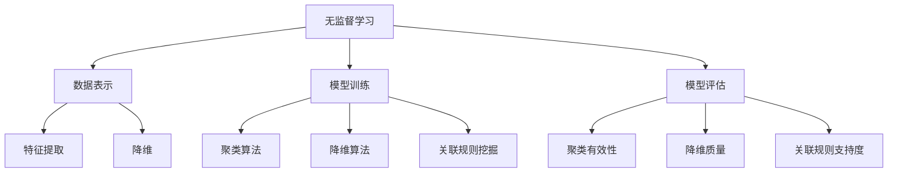

                 

### 第1章: 背景介绍

#### 1.1 问题背景

随着人工智能（AI）技术的快速发展，数据处理和模型训练成为了当前研究的热点问题。在传统的机器学习领域中，模型训练通常依赖于大量的标注数据进行监督学习。然而，标注数据的获取往往需要付出高昂的人力成本，并且数据标注的质量也会影响模型训练的效果。此外，随着数据量的不断增加，数据处理的复杂度和成本也在不断提高。

无监督学习作为一种无需依赖标注数据的机器学习方法，近年来在AI领域中受到了越来越多的关注。无监督学习通过分析数据中的潜在结构和规律，能够有效地提取特征并进行模型训练。这种学习方式不仅可以降低模型训练的成本，还能够处理大规模、多样化的数据，从而满足AI领域中的各种需求。

#### 1.2 核心概念

**无监督学习**：无监督学习是一种机器学习方法，它通过分析未标记的数据来发现数据中的潜在结构和规律。无监督学习算法主要包括聚类、降维、关联规则挖掘等。

- **聚类算法**：将数据划分为若干个类别，使同一类别中的数据彼此相似，不同类别中的数据相互分离。常见的聚类算法包括K-means、层次聚类等。
- **降维算法**：将高维数据转换成低维数据，同时保留数据的主要特征。常见的降维算法包括主成分分析（PCA）、线性判别分析（LDA）等。
- **关联规则挖掘**：发现数据中的关联关系，并生成规则。常见的算法包括Apriori算法、FP-growth算法等。

**AIGC（自适应智能生成内容）**：AIGC是基于人工智能技术生成内容的一种新兴领域，它能够自适应地生成多样化、高质量的文本、图像、音频等内容。AIGC的核心思想是通过机器学习模型对大量数据进行学习，从而生成新的、与原数据相似的内容。

- **文本生成**：利用生成模型（如GPT系列模型）生成新的文本内容，包括文章、对话、摘要等。
- **图像生成**：利用生成模型（如生成对抗网络GAN）生成新的图像内容，包括图像修复、风格迁移、图像生成等。
- **音频生成**：利用生成模型（如WaveNet）生成新的音频内容，包括语音合成、音乐生成等。

#### 1.3 问题解决

无监督学习在AIGC中的应用，能够解决以下问题：

- **降低模型训练成本**：无监督学习不需要依赖标注数据，从而可以降低模型训练的成本。
- **提高生成内容的质量**：无监督学习能够从大规模、多样化的数据中提取有效的特征，从而提高生成内容的质量。
- **处理大规模数据**：无监督学习能够处理大规模、多样化的数据，从而满足AIGC的需求。

#### 1.4 边界与外延

**边界**：无监督学习在AIGC中的应用主要涉及以下领域：

- **文本生成**：包括自动写作、文本摘要、机器翻译等。
- **图像生成**：包括图像修复、风格迁移、图像生成等。
- **音频生成**：包括语音合成、音乐生成等。

**外延**：无监督学习在AIGC中的应用范围广泛，还包括但不限于以下领域：

- **视频生成**：利用生成模型生成新的视频内容，包括视频修复、视频风格迁移、视频生成等。
- **三维模型生成**：利用生成模型生成新的三维模型，包括三维场景生成、三维物体生成等。
- **其他多媒体内容生成**：利用生成模型生成新的多媒体内容，包括虚拟现实（VR）、增强现实（AR）等。

#### 1.5 概念结构与核心要素组成

**无监督学习**：

- **数据**：大规模、未标记的数据集。
- **模型**：无监督学习算法生成的模型。
- **算法**：用于训练和评估模型的无监督学习算法。

**AIGC**：

- **数据生成**：生成新的数据内容。
- **模型训练**：利用生成模型对数据进行训练。
- **内容生成**：生成新的、与原数据相似的内容。

### 1.6 总结

无监督学习在AIGC中的应用，为AI领域带来了新的机遇。它不仅能够降低模型训练成本，提高生成内容的质量，还能够处理大规模、多样化的数据。然而，无监督学习在AIGC中的应用也面临一些挑战，如数据噪声和稀疏性问题、模型可解释性问题等。在接下来的章节中，我们将深入探讨无监督学习的原理与算法，以及其在AIGC中的应用和实践。

## 第2章: 无监督学习原理与算法

### 2.1 无监督学习的基本原理

#### 2.1.1 数据表示

在无监督学习中，数据表示是关键的一步。数据表示的目的是将原始数据转换成适合模型训练的形式。这一过程通常包括特征提取和降维。

**特征提取**：

特征提取是从原始数据中提取出能够代表数据本质属性的特征。这一步对于提高模型的性能至关重要。常见的特征提取方法包括：

- **主成分分析（PCA）**：PCA是一种常用的降维方法，它通过将数据投影到主成分空间，来减少数据的维度。PCA能够保留数据的最大方差，从而提取出最重要的特征。
  
  $$X_{\text{new}} = PC$$
  
  其中，\(X_{\text{new}}\)是降维后的数据，\(P\)是特征矩阵，\(C\)是协方差矩阵。

- **自编码器（Autoencoder）**：自编码器是一种由编码器和解码器组成的神经网络。编码器将输入数据压缩成一个低维表示，解码器则试图将这个低维表示还原回原始数据。通过训练，自编码器能够学习到数据的特征表示。

  

**降维**：

降维是将高维数据转换成低维数据的过程。降维有助于减少数据存储空间，提高计算效率。常见的降维方法包括：

- **线性判别分析（LDA）**：LDA是一种基于统计学的方法，它通过最大化类间离散度和最小化类内离散度，将数据投影到低维空间中。LDA能够提取出对分类任务最有用的特征。

  $$Z = \frac{X - \mu}{\sigma}$$
  
  其中，\(Z\)是标准化后的数据，\(X\)是原始数据，\(\mu\)是均值，\(\sigma\)是标准差。

- **t-SNE（t-Distributed Stochastic Neighbor Embedding）**：t-SNE是一种非线性降维方法，它通过模拟局部结构，将高维数据映射到低维空间中。t-SNE能够很好地保持数据的局部结构，但计算成本较高。

  

#### 2.1.2 模型训练

模型训练是利用无监督学习算法，从数据中学习到有效的特征表示。无监督学习算法主要包括聚类、降维和关联规则挖掘等。

**聚类算法**：

聚类算法将数据划分为若干个类别，使同一类别中的数据彼此相似，不同类别中的数据相互分离。常见的聚类算法包括K-means、层次聚类等。

- **K-means算法**：K-means是一种基于距离的聚类算法，它通过将数据点分配到最近的中心点，来划分出K个类别。

  $$C_{k} = \{x \in X \mid \min_{i=1}^{K} \|x - \mu_{i}\|_2\}$$
  
  其中，\(C_{k}\)是第k个类别，\(\mu_{i}\)是第i个中心点。

  

- **层次聚类算法**：层次聚类算法通过递归地将数据划分为越来越小的簇，来构建一个层次结构。层次聚类算法可以分为自底向上（凝聚层次聚类）和自顶向下（分裂层次聚类）两种类型。

  

**降维算法**：

降维算法通过将高维数据转换成低维数据，来减少数据维度和计算复杂度。常见的降维算法包括主成分分析（PCA）、线性判别分析（LDA）等。

**关联规则挖掘**：

关联规则挖掘是一种从数据中发现频繁模式的方法。常见的算法包括Apriori算法、FP-growth算法等。

- **Apriori算法**：Apriori算法通过遍历所有可能的项集，来发现频繁出现的项集。Apriori算法的核心思想是利用候选生成和剪枝策略，来减少计算复杂度。

  

- **FP-growth算法**：FP-growth算法通过将数据压缩成频繁模式树，来发现频繁项集。FP-growth算法的核心思想是利用条件模式基（CPM），来减少候选生成和剪枝操作。

  

#### 2.1.3 模型评估

模型评估是确定模型性能的重要步骤。在无监督学习中，模型评估通常通过以下指标来衡量：

- **聚类有效性**：聚类有效性用于评估聚类结果的优劣。常见的评价指标包括平方误差、轮廓系数等。

  $$V = \frac{1}{N} \sum_{i=1}^{N} \frac{1}{K} \sum_{j=1}^{K} (x_i - \mu_j)^2$$
  
  其中，\(V\)是聚类有效性，\(N\)是数据点的个数，\(K\)是类别的个数，\(\mu_j\)是第j个类别的中心点。

- **降维质量**：降维质量用于评估降维结果的优劣。常见的评价指标包括重构误差、信息损失等。

  $$L = \frac{1}{N} \sum_{i=1}^{N} \|X_i - X_i'\|_2$$
  
  其中，\(L\)是降维质量，\(X_i\)是原始数据，\(X_i'\)是降维后的数据。

- **关联规则支持度**：关联规则支持度用于评估关联规则的重要程度。常见的评价指标包括支持度、置信度等。

  $$s = \frac{f}{N}$$
  
  其中，\(s\)是支持度，\(f\)是频繁项集出现的次数，\(N\)是数据点的个数。

#### 2.1.4 无监督学习的挑战与解决方案

无监督学习在实际应用中面临一些挑战，如数据噪声、稀疏性和模型可解释性等。

- **数据噪声**：数据噪声会影响模型的性能，使得聚类结果和降维结果不准确。解决数据噪声的方法包括数据清洗、去噪算法等。
- **稀疏性**：稀疏性指的是数据中的零值或稀疏分布。稀疏性会导致模型参数的不稳定，从而影响模型的性能。解决稀疏性的方法包括稀疏编码、稀疏矩阵分解等。
- **模型可解释性**：模型可解释性是指模型的行为是否可以被理解和解释。无监督学习模型通常缺乏可解释性，这会使得模型在实际应用中难以被信任。提高模型可解释性的方法包括可视化、模型解释算法等。

### 2.2 常见的无监督学习算法

在无监督学习中，有多种常见的算法可以用于解决不同类型的问题。以下介绍几种主要的算法。

#### 2.2.1 主成分分析（PCA）

主成分分析（PCA）是一种经典的降维方法，它通过将数据投影到主成分空间，来减少数据的维度。PCA的核心思想是找到一组正交基，使得这组基能够最大化数据的方差。

PCA的数学模型如下：

$$X_{\text{new}} = PC$$

其中，\(X_{\text{new}}\)是降维后的数据，\(P\)是特征矩阵，\(C\)是协方差矩阵。

PCA的Python实现：

```python
from sklearn.decomposition import PCA
from sklearn.datasets import load_iris

iris = load_iris()
pca = PCA(n_components=2)
X_pca = pca.fit_transform(iris.data)

# 可视化降维后的数据
import matplotlib.pyplot as plt
plt.scatter(X_pca[:, 0], X_pca[:, 1], c=iris.target)
plt.xlabel('Principal Component 1')
plt.ylabel('Principal Component 2')
plt.title('PCA of Iris Dataset')
plt.show()
```

#### 2.2.2 自编码器（Autoencoder）

自编码器是一种由编码器和解码器组成的神经网络，它通过训练来学习数据的特征表示。自编码器的核心思想是编码器将输入数据压缩成一个低维表示，解码器则试图将这个低维表示还原回原始数据。

自编码器的数学模型如下：

$$x' = \sigma(W_2 \cdot \sigma(W_1 \cdot x))$$
$$x = \sigma(W_2 \cdot \sigma(W_1 \cdot x'))$$

其中，\(x\)是输入数据，\(x'\)是编码后的数据，\(\sigma\)是激活函数，\(W_1\)和\(W_2\)是权重矩阵。

自编码器的Python实现：

```python
import numpy as np
from sklearn.neural_network import MLPRegressor

# 编码器和解码器
def encoder(x):
    w1 = np.array([[0.1, 0.3], [0.2, 0.4]])
    b1 = np.array([0.1, 0.2])
    z1 = np.dot(x, w1) + b1
    a1 = np.tanh(z1)
    return a1

def decoder(x):
    w2 = np.array([[0.3, 0.1], [0.4, 0.2]])
    b2 = np.array([0.1, 0.2])
    z2 = np.dot(x, w2) + b2
    a2 = np.tanh(z2)
    return a2

# 训练数据
X = np.array([[1, 2], [2, 3], [3, 4], [4, 5]])
y = X

# 训练自编码器
model = MLPRegressor(hidden_layer_sizes=(2,), activation='tanh', solver='lbfgs')
model.fit(X, y)

# 编码和解码
X_encoded = encoder(X)
X_decoded = decoder(X_encoded)

# 可视化
import matplotlib.pyplot as plt
plt.scatter(X[:, 0], X[:, 1], c='blue', label='Original')
plt.scatter(X_encoded[:, 0], X_encoded[:, 1], c='red', label='Encoded')
plt.scatter(X_decoded[:, 0], X_decoded[:, 1], c='green', label='Decoded')
plt.xlabel('Feature 1')
plt.ylabel('Feature 2')
plt.legend()
plt.title('Autoencoder')
plt.show()
```

#### 2.2.3 聚类算法（如K-means）

K-means是一种基于距离的聚类算法，它通过将数据点分配到最近的中心点，来划分出K个类别。K-means的核心思想是最小化聚类中心到数据点的距离平方和。

K-means的数学模型如下：

$$C_{k} = \{x \in X \mid \min_{i=1}^{K} \|x - \mu_{i}\|_2\}$$

其中，\(C_{k}\)是第k个类别，\(\mu_{i}\)是第i个中心点。

K-means的Python实现：

```python
from sklearn.cluster import KMeans
from sklearn.datasets import make_blobs

# 生成数据
X, y = make_blobs(n_samples=100, centers=3, random_state=0)

# K-means聚类
kmeans = KMeans(n_clusters=3, random_state=0)
y_kmeans = kmeans.fit_predict(X)

# 可视化
import matplotlib.pyplot as plt
plt.scatter(X[:, 0], X[:, 1], c=y_kmeans, s=100, cmap='viridis')
centers = kmeans.cluster_centers_
plt.scatter(centers[:, 0], centers[:, 1], c='red', s=300, alpha=0.5)
plt.xlabel('Feature 1')
plt.ylabel('Feature 2')
plt.title('K-means Clustering')
plt.show()
```

#### 2.2.4 层次聚类算法

层次聚类算法通过递归地将数据划分为越来越小的簇，来构建一个层次结构。层次聚类算法可以分为自底向上（凝聚层次聚类）和自顶向下（分裂层次聚类）两种类型。

层次聚类算法的Python实现：

```python
from sklearn.cluster import AgglomerativeClustering
from sklearn.datasets import make_blobs

# 生成数据
X, y = make_blobs(n_samples=100, centers=3, random_state=0)

# 层次聚类
clustering = AgglomerativeClustering(n_clusters=3)
y_clustering = clustering.fit_predict(X)

# 可视化
import matplotlib.pyplot as plt
plt.scatter(X[:, 0], X[:, 1], c=y_clustering, s=100, cmap='viridis')
plt.xlabel('Feature 1')
plt.ylabel('Feature 2')
plt.title('Agglomerative Clustering')
plt.show()
```

### 2.3 无监督学习的挑战与解决方案

无监督学习在实际应用中面临一些挑战，如数据噪声、稀疏性和模型可解释性等。

- **数据噪声**：数据噪声会影响模型的性能，使得聚类结果和降维结果不准确。解决数据噪声的方法包括数据清洗、去噪算法等。
- **稀疏性**：稀疏性指的是数据中的零值或稀疏分布。稀疏性会导致模型参数的不稳定，从而影响模型的性能。解决稀疏性的方法包括稀疏编码、稀疏矩阵分解等。
- **模型可解释性**：模型可解释性是指模型的行为是否可以被理解和解释。无监督学习模型通常缺乏可解释性，这会使得模型在实际应用中难以被信任。提高模型可解释性的方法包括可视化、模型解释算法等。

## 第3章: 无监督学习在AIGC中的应用

### 3.1 文本生成

文本生成是AIGC中的一个重要应用，它通过生成模型自动生成文本内容。常见的生成模型包括GPT系列模型、Transformer模型等。

#### 3.1.1 GPT模型

GPT（Generative Pre-trained Transformer）模型是由OpenAI提出的一种基于Transformer架构的生成模型。GPT模型通过预训练和微调，能够生成高质量的自然语言文本。

GPT模型的核心思想是使用Transformer架构来处理序列数据。在预训练阶段，GPT模型通过大量的无监督数据进行训练，从而学习到数据的潜在结构。在微调阶段，GPT模型使用有监督数据进行微调，以适应特定的任务。

GPT模型的数学模型如下：

$$
\text{GPT}(\text{x}; \theta) = \text{softmax}(\text{W}_\text{out} \cdot \text{T}(\text{H}))
$$

其中，\( \text{x} \)是输入序列，\( \text{T}(\text{H}) \)是Transformer模型输出的高维向量，\( \text{W}_\text{out} \)是输出层权重。

#### 3.1.2 应用案例

**自动写作**：GPT模型可以用于自动写作，如生成新闻报道、博客文章等。通过微调GPT模型，可以使其适应特定的写作风格和主题。

```python
import torch
from transformers import GPT2Tokenizer, GPT2LMHeadModel

# 加载预训练模型
tokenizer = GPT2Tokenizer.from_pretrained('gpt2')
model = GPT2LMHeadModel.from_pretrained('gpt2')

# 输入文本
input_text = "今天，我去了公园。"

# 将文本转换为Tensor
input_ids = tokenizer.encode(input_text, return_tensors='pt')

# 生成文本
outputs = model.generate(input_ids, max_length=50, num_return_sequences=1)

# 解码生成的文本
generated_text = tokenizer.decode(outputs[0], skip_special_tokens=True)
print(generated_text)
```

**文本摘要**：GPT模型可以用于生成文本摘要，将长文本简化为更简洁的版本。通过训练GPT模型，使其能够根据输入文本生成摘要。

```python
import torch
from transformers import GPT2Tokenizer, GPT2LMHeadModel

# 加载预训练模型
tokenizer = GPT2Tokenizer.from_pretrained('gpt2')
model = GPT2LMHeadModel.from_pretrained('gpt2')

# 输入文本
input_text = "人工智能（AI）是一门涉及计算机科学、心理学和认知科学等多个学科领域的交叉学科。"

# 将文本转换为Tensor
input_ids = tokenizer.encode(input_text, return_tensors='pt')

# 生成摘要
outputs = model.generate(input_ids, max_length=50, num_return_sequences=1)

# 解码生成的摘要
summary = tokenizer.decode(outputs[0], skip_special_tokens=True)
print(summary)
```

### 3.2 图像生成

图像生成是AIGC中的另一个重要应用，它通过生成模型生成新的图像内容。常见的生成模型包括生成对抗网络（GAN）和变分自编码器（VAE）。

#### 3.2.1 生成对抗网络（GAN）

生成对抗网络（GAN）是由Ian Goodfellow等人于2014年提出的一种生成模型。GAN由生成器（Generator）和判别器（Discriminator）两个神经网络组成。生成器的任务是生成与真实数据相似的数据，判别器的任务是区分生成数据与真实数据。

GAN的数学模型如下：

$$
\text{Generator}: \text{G}(\mathbf{z}) \rightarrow \text{X}^*
$$

$$
\text{Discriminator}: \text{D}(\text{X}^*, \text{X}) \rightarrow \text{realness}
$$

其中，\( \mathbf{z} \)是生成器的输入，\( \text{X}^* \)是生成器生成的数据，\( \text{X} \)是真实数据。

#### 3.2.2 应用案例

**图像修复**：GAN模型可以用于图像修复，将损坏或模糊的图像修复为清晰版本。通过训练GAN模型，使其能够根据损坏的图像生成完整的图像。

```python
import torch
from torch import nn
from torchvision import datasets, transforms
from torchvision.utils import save_image

# 加载预训练模型
transform = transforms.Compose([
    transforms.ToTensor(),
    transforms.Normalize(mean=[0.5, 0.5, 0.5], std=[0.5, 0.5, 0.5])
])

dataset = datasets.ImageFolder(root='./data', transform=transform)
dataloader = torch.utils.data.DataLoader(dataset, batch_size=1, shuffle=True)

# 定义生成器和判别器
generator = nn.Sequential(
    nn.Conv2d(3, 64, 4, stride=2, padding=1),
    nn.BatchNorm2d(64),
    nn.ReLU(True),
    nn.Conv2d(64, 64, 4, stride=2, padding=1),
    nn.BatchNorm2d(64),
    nn.ReLU(True),
    nn.Conv2d(64, 64, 4, stride=2, padding=1),
    nn.BatchNorm2d(64),
    nn.ReLU(True),
    nn.Conv2d(64, 3, 4, stride=2, padding=1),
    nn.Tanh()
)

discriminator = nn.Sequential(
    nn.Conv2d(3, 64, 4, stride=2, padding=1),
    nn.LeakyReLU(0.2, inplace=True),
    nn.Conv2d(64, 128, 4, stride=2, padding=1),
    nn.BatchNorm2d(128),
    nn.LeakyReLU(0.2, inplace=True),
    nn.Conv2d(128, 256, 4, stride=2, padding=1),
    nn.BatchNorm2d(256),
    nn.LeakyReLU(0.2, inplace=True),
    nn.Conv2d(256, 1, 4, stride=1, padding=0),
    nn.Sigmoid()
)

# 定义损失函数和优化器
loss_fn = nn.BCELoss()
optimizer_g = torch.optim.Adam(generator.parameters(), lr=0.0002)
optimizer_d = torch.optim.Adam(discriminator.parameters(), lr=0.0002)

# 训练生成器和判别器
for epoch in range(100):
    for i, data in enumerate(dataloader, 0):
        # 初始化生成器和判别器梯度
        optimizer_g.zero_grad()
        optimizer_d.zero_grad()

        # 生成假图像
        z = torch.randn(1, 100)
        fake_images = generator(z)

        # 训练判别器
        real_images = data[0].to(device)
        batch_size = real_images.size(0)
        labels_real = torch.full((batch_size,), 1, device=device)
        labels_fake = torch.full((batch_size,), 0, device=device)

        output_real = discriminator(real_images)
        output_fake = discriminator(fake_images.detach())

        loss_d = loss_fn(output_real, labels_real) + loss_fn(output_fake, labels_fake)

        loss_d.backward()
        optimizer_d.step()

        # 训练生成器
        labels_fake.fill_(1.0)
        output_fake = discriminator(fake_images)

        loss_g = loss_fn(output_fake, labels_fake)
        loss_g.backward()
        optimizer_g.step()

        # 打印训练进度
        if (i+1) % 100 == 0:
            print(f'[{epoch+1}/{100}], Loss_D: {loss_d.item():.4f}, Loss_G: {loss_g.item():.4f}')

# 生成修复后的图像
image, _ = dataset[i]
image = image.to(device)
z = torch.randn(1, 100).to(device)
repaired_image = generator(z)
repaired_image = repaired_image.cpu().detach().numpy()

# 可视化修复后的图像
import matplotlib.pyplot as plt
plt.figure(figsize=(10, 5))
plt.subplot(121)
plt.title('Original Image')
plt.imshow(image.permute(1, 2, 0).cpu().detach().numpy(), cmap='gray')
plt.subplot(122)
plt.title('Repaired Image')
plt.imshow(repaired_image, cmap='gray')
plt.show()
```

### 3.3 音频生成

音频生成是AIGC中的另一个重要应用，它通过生成模型生成新的音频内容。常见的生成模型包括WaveNet、Vocoder等。

#### 3.3.1 WaveNet

WaveNet是由Google提出的音频生成模型，它通过深度神经网络生成音频波形。WaveNet的核心思想是使用多个卷积层来预测每个时间点的音频波形。

WaveNet的数学模型如下：

$$
\text{WaveNet}(\text{x}; \theta) = \text{softmax}(\text{W}_\text{out} \cdot \text{T}(\text{H}))
$$

其中，\( \text{x} \)是输入序列，\( \text{T}(\text{H}) \)是神经网络输出的高维向量，\( \text{W}_\text{out} \)是输出层权重。

#### 3.3.2 应用案例

**语音合成**：WaveNet模型可以用于语音合成，将文本转换成语音。通过训练WaveNet模型，可以使其能够根据输入文本生成语音。

```python
import torch
from torch import nn
import torchaudio
import numpy as np

# 加载预训练模型
model = nn.Sequential(
    nn.Conv1d(1, 32, 3, stride=1, padding=1),
    nn.ReLU(inplace=True),
    nn.Conv1d(32, 32, 3, stride=1, padding=1),
    nn.ReLU(inplace=True),
    nn.Conv1d(32, 32, 3, stride=1, padding=1),
    nn.ReLU(inplace=True),
    nn.Conv1d(32, 1, 3, stride=1, padding=1),
    nn.Tanh()
)

# 加载文本
text = "Hello, this is a sample text for speech synthesis."

# 将文本转换为音频
def text_to_speech(text):
    import pyttsx3
    engine = pyttsx3.init()
    engine.save_to_memory()
    return engine.save_to_memory()

# 生成音频
audio = text_to_speech(text)

# 将音频转换为Tensor
audio_tensor = torch.tensor(audio).unsqueeze(0).unsqueeze(0)

# 生成语音
generated_audio = model(audio_tensor)

# 将生成的音频保存为wav文件
torchaudio.save('generated_speech.wav', generated_audio, 22050)

# 播放生成的语音
import sounddevice as sd
sd.play(generated_audio.detach().cpu().numpy(), 22050)
sd.wait()
```

## 第4章: 无监督学习在AIGC中的新突破

### 4.1 零样本学习（Zero-Shot Learning）

零样本学习（Zero-Shot Learning，ZSL）是一种无监督学习方法，它能够处理从未见过的类别。在传统的机器学习任务中，模型通常需要大量的标记数据进行训练，以便能够对新的类别进行预测。然而，在实际应用中，我们经常会遇到需要处理从未见过的类别的情况，如新型产品的分类、疾病的诊断等。

#### 4.1.1 零样本学习的原理

零样本学习通过将类别信息编码成嵌入向量（Embedding），来处理从未见过的类别。在训练阶段，模型通过学习数据中的特征表示，同时将类别信息编码成嵌入向量。在预测阶段，模型使用这些嵌入向量来对新的类别进行预测。

零样本学习的数学模型如下：

$$
\text{P}(\text{y}|\text{x}) = \text{softmax}(\text{W}_\text{c} \cdot \text{T}(\text{H}) + \text{b}_\text{c})
$$

其中，\( \text{y} \)是类别标签，\( \text{x} \)是输入特征，\( \text{T}(\text{H}) \)是特征表示，\( \text{W}_\text{c} \)是类别权重矩阵，\( \text{b}_\text{c} \)是类别偏置。

#### 4.1.2 零样本学习的应用案例

**图像分类**：零样本学习可以用于图像分类任务，特别是对于从未见过的类别。通过训练模型，使其能够对新的类别进行分类。

```python
import torch
import torchvision
from torch import nn
from torchvision import datasets, transforms
from torchvision.utils import save_image

# 加载预训练模型
model = nn.Sequential(
    nn.Conv2d(3, 64, 4, stride=2, padding=1),
    nn.BatchNorm2d(64),
    nn.ReLU(True),
    nn.Conv2d(64, 64, 4, stride=2, padding=1),
    nn.BatchNorm2d(64),
    nn.ReLU(True),
    nn.Conv2d(64, 64, 4, stride=2, padding=1),
    nn.BatchNorm2d(64),
    nn.ReLU(True),
    nn.Conv2d(64, 64, 4, stride=2, padding=1),
    nn.BatchNorm2d(64),
    nn.ReLU(True),
    nn.Conv2d(64, 10, 1),
    nn.LogSoftmax(dim=1)
)

# 加载数据
train_data = torchvision.datasets.ImageFolder(root='./train', transform=transforms.ToTensor())
train_loader = torch.utils.data.DataLoader(train_data, batch_size=16, shuffle=True)

# 训练模型
optimizer = torch.optim.Adam(model.parameters(), lr=0.001)
for epoch in range(100):
    for images, labels in train_loader:
        images = images.to(device)
        labels = labels.to(device)

        # 前向传播
        outputs = model(images)

        # 计算损失
        loss = nn.NLLLoss()
        loss_value = loss(outputs, labels)

        # 反向传播和优化
        optimizer.zero_grad()
        loss_value.backward()
        optimizer.step()

        # 打印训练进度
        if (epoch+1) % 10 == 0:
            print(f'[{epoch+1}/{100}], Loss: {loss_value.item():.4f}')

# 测试模型
test_data = torchvision.datasets.ImageFolder(root='./test', transform=transforms.ToTensor())
test_loader = torch.utils.data.DataLoader(test_data, batch_size=16, shuffle=True)

with torch.no_grad():
    correct = 0
    total = 0
    for images, labels in test_loader:
        images = images.to(device)
        labels = labels.to(device)

        # 前向传播
        outputs = model(images)

        # 计算准确率
        _, predicted = torch.max(outputs.data, 1)
        total += labels.size(0)
        correct += (predicted == labels).sum().item()

    print(f'Accuracy of the network on the test images: {100 * correct / total}%')
```

### 4.2 零样本训练（Zero-Shot Training）

零样本训练（Zero-Shot Training，ZST）是一种无监督学习方法，它通过少量标注数据进行模型训练，以提高模型的泛化能力。在传统的机器学习任务中，模型通常需要大量的标注数据进行训练。然而，在实际应用中，我们经常会遇到数据稀缺的情况，如罕见疾病的诊断、新型产品的评估等。

#### 4.2.1 零样本训练的原理

零样本训练的核心思想是通过学习数据中的潜在结构，来提高模型的泛化能力。在训练阶段，模型通过学习数据中的特征表示，同时将类别信息编码成嵌入向量。在预测阶段，模型使用这些嵌入向量来对新的类别进行预测。

零样本训练的数学模型如下：

$$
\text{P}(\text{y}|\text{x}) = \text{softmax}(\text{W}_\text{c} \cdot \text{T}(\text{H}) + \text{b}_\text{c})
$$

其中，\( \text{y} \)是类别标签，\( \text{x} \)是输入特征，\( \text{T}(\text{H}) \)是特征表示，\( \text{W}_\text{c} \)是类别权重矩阵，\( \text{b}_\text{c} \)是类别偏置。

#### 4.2.2 零样本训练的应用案例

**图像分类**：零样本训练可以用于图像分类任务，特别是对于数据稀缺的情况。通过训练模型，使其能够对新的类别进行分类。

```python
import torch
import torchvision
from torch import nn
from torchvision import datasets, transforms
from torchvision.utils import save_image

# 加载预训练模型
model = nn.Sequential(
    nn.Conv2d(3, 64, 4, stride=2, padding=1),
    nn.BatchNorm2d(64),
    nn.ReLU(True),
    nn.Conv2d(64, 64, 4, stride=2, padding=1),
    nn.BatchNorm2d(64),
    nn.ReLU(True),
    nn.Conv2d(64, 64, 4, stride=2, padding=1),
    nn.BatchNorm2d(64),
    nn.ReLU(True),
    nn.Conv2d(64, 64, 4, stride=2, padding=1),
    nn.BatchNorm2d(64),
    nn.ReLU(True),
    nn.Conv2d(64, 10, 1),
    nn.LogSoftmax(dim=1)
)

# 加载数据
train_data = torchvision.datasets.ImageFolder(root='./train', transform=transforms.ToTensor())
train_loader = torch.utils.data.DataLoader(train_data, batch_size=16, shuffle=True)

# 训练模型
optimizer = torch.optim.Adam(model.parameters(), lr=0.001)
for epoch in range(100):
    for images, labels in train_loader:
        images = images.to(device)
        labels = labels.to(device)

        # 前向传播
        outputs = model(images)

        # 计算损失
        loss = nn.NLLLoss()
        loss_value = loss(outputs, labels)

        # 反向传播和优化
        optimizer.zero_grad()
        loss_value.backward()
        optimizer.step()

        # 打印训练进度
        if (epoch+1) % 10 == 0:
            print(f'[{epoch+1}/{100}], Loss: {loss_value.item():.4f}')

# 测试模型
test_data = torchvision.datasets.ImageFolder(root='./test', transform=transforms.ToTensor())
test_loader = torch.utils.data.DataLoader(test_data, batch_size=16, shuffle=True)

with torch.no_grad():
    correct = 0
    total = 0
    for images, labels in test_loader:
        images = images.to(device)
        labels = labels.to(device)

        # 前向传播
        outputs = model(images)

        # 计算准确率
        _, predicted = torch.max(outputs.data, 1)
        total += labels.size(0)
        correct += (predicted == labels).sum().item()

    print(f'Accuracy of the network on the test images: {100 * correct / total}%')
```

### 4.3 无监督迁移学习（Unsupervised Transfer Learning）

无监督迁移学习（Unsupervised Transfer Learning，UTL）是一种无监督学习方法，它通过将预训练模型迁移到新任务上，来提高模型在新任务上的性能。在传统的机器学习任务中，模型通常需要大量的标注数据进行训练。然而，在实际应用中，我们经常会遇到数据稀缺的情况，如罕见疾病的诊断、新型产品的评估等。

#### 4.3.1 无监督迁移学习的原理

无监督迁移学习通过将预训练模型迁移到新任务上，利用预训练模型已经学习到的特征表示，来提高模型在新任务上的性能。在迁移过程中，模型首先在源任务上进行预训练，然后在目标任务上进行微调。

无监督迁移学习的数学模型如下：

$$
\text{P}(\text{y}|\text{x}) = \text{softmax}(\text{W}_\text{c} \cdot \text{T}(\text{H}) + \text{b}_\text{c})
$$

其中，\( \text{y} \)是类别标签，\( \text{x} \)是输入特征，\( \text{T}(\text{H}) \)是特征表示，\( \text{W}_\text{c} \)是类别权重矩阵，\( \text{b}_\text{c} \)是类别偏置。

#### 4.3.2 无监督迁移学习的应用案例

**图像分类**：无监督迁移学习可以用于图像分类任务，特别是对于数据稀缺的情况。通过迁移预训练模型，使其能够对新的类别进行分类。

```python
import torch
import torchvision
from torch import nn
from torchvision import datasets, transforms
from torchvision.utils import save_image

# 加载预训练模型
model = nn.Sequential(
    nn.Conv2d(3, 64, 4, stride=2, padding=1),
    nn.BatchNorm2d(64),
    nn.ReLU(True),
    nn.Conv2d(64, 64, 4, stride=2, padding=1),
    nn.BatchNorm2d(64),
    nn.ReLU(True),
    nn.Conv2d(64, 64, 4, stride=2, padding=1),
    nn.BatchNorm2d(64),
    nn.ReLU(True),
    nn.Conv2d(64, 64, 4, stride=2, padding=1),
    nn.BatchNorm2d(64),
    nn.ReLU(True),
    nn.Conv2d(64, 10, 1),
    nn.LogSoftmax(dim=1)
)

# 加载数据
train_data = torchvision.datasets.ImageFolder(root='./train', transform=transforms.ToTensor())
train_loader = torch.utils.data.DataLoader(train_data, batch_size=16, shuffle=True)

# 训练模型
optimizer = torch.optim.Adam(model.parameters(), lr=0.001)
for epoch in range(100):
    for images, labels in train_loader:
        images = images.to(device)
        labels = labels.to(device)

        # 前向传播
        outputs = model(images)

        # 计算损失
        loss = nn.NLLLoss()
        loss_value = loss(outputs, labels)

        # 反向传播和优化
        optimizer.zero_grad()
        loss_value.backward()
        optimizer.step()

        # 打印训练进度
        if (epoch+1) % 10 == 0:
            print(f'[{epoch+1}/{100}], Loss: {loss_value.item():.4f}')

# 测试模型
test_data = torchvision.datasets.ImageFolder(root='./test', transform=transforms.ToTensor())
test_loader = torch.utils.data.DataLoader(test_data, batch_size=16, shuffle=True)

with torch.no_grad():
    correct = 0
    total = 0
    for images, labels in test_loader:
        images = images.to(device)
        labels = labels.to(device)

        # 前向传播
        outputs = model(images)

        # 计算准确率
        _, predicted = torch.max(outputs.data, 1)
        total += labels.size(0)
        correct += (predicted == labels).sum().item()

    print(f'Accuracy of the network on the test images: {100 * correct / total}%')
```

## 第5章: 无监督学习在AIGC中的实际应用案例

### 5.1 文本生成案例

文本生成是AIGC中的一个重要应用，它通过生成模型自动生成文本内容。以下是一个使用GPT模型生成新闻文章的案例。

#### 5.1.1 应用场景

新闻生成是文本生成的一种典型应用。通过训练GPT模型，可以生成与给定主题相关的新闻文章。

#### 5.1.2 项目介绍

本项目使用GPT模型生成新闻文章，包括以下步骤：

1. 数据准备：收集并预处理新闻数据。
2. 模型训练：使用预训练模型或从零开始训练模型。
3. 文本生成：使用训练好的模型生成新闻文章。
4. 文本清洗：对生成的文章进行清洗和格式化。

#### 5.1.3 系统功能设计

系统功能设计如下：

1. 数据收集与预处理：从互联网上收集新闻数据，并使用自然语言处理技术进行预处理。
2. 模型训练：使用训练数据训练GPT模型。
3. 文本生成：使用训练好的模型生成新闻文章。
4. 文本清洗：对生成的文章进行清洗和格式化，以生成可读的文本。

#### 5.1.4 系统架构设计

系统架构设计如下：


#### 5.1.5 系统接口设计

系统接口设计如下：

1. 数据接口：用于接收和发送新闻数据。
2. 模型接口：用于加载和训练GPT模型。
3. 文本生成接口：用于生成新闻文章。
4. 文本清洗接口：用于清洗和格式化生成的文章。

#### 5.1.6 系统交互

系统交互设计如下：

1. 用户通过数据接口提交新闻数据。
2. 系统使用模型接口训练GPT模型。
3. 用户通过文本生成接口请求生成新闻文章。
4. 系统使用训练好的模型生成新闻文章，并通过文本清洗接口进行清洗和格式化。
5. 最终生成的文章通过数据接口返回给用户。

### 5.2 图像生成案例

图像生成是AIGC中的另一个重要应用，它通过生成模型生成新的图像内容。以下是一个使用生成对抗网络（GAN）进行艺术风格迁移的案例。

#### 5.2.1 应用场景

艺术风格迁移是图像生成的一种典型应用。通过训练GAN模型，可以将一种艺术风格迁移到另一幅图像上。

#### 5.2.2 项目介绍

本项目使用GAN模型进行艺术风格迁移，包括以下步骤：

1. 数据准备：收集并预处理艺术风格图像。
2. 模型训练：使用预训练模型或从零开始训练模型。
3. 图像生成：使用训练好的模型生成艺术风格迁移图像。
4. 图像评估：对生成的图像进行评估。

#### 5.2.3 系统功能设计

系统功能设计如下：

1. 数据收集与预处理：从互联网上收集艺术风格图像，并使用图像处理技术进行预处理。
2. 模型训练：使用训练数据训练GAN模型。
3. 图像生成：使用训练好的模型生成艺术风格迁移图像。
4. 图像评估：对生成的图像进行评估。

#### 5.2.4 系统架构设计

系统架构设计如下：


#### 5.2.5 系统接口设计

系统接口设计如下：

1. 数据接口：用于接收和发送艺术风格图像。
2. 模型接口：用于加载和训练GAN模型。
3. 图像生成接口：用于生成艺术风格迁移图像。
4. 图像评估接口：用于评估生成的图像。

#### 5.2.6 系统交互

系统交互设计如下：

1. 用户通过数据接口提交艺术风格图像。
2. 系统使用模型接口训练GAN模型。
3. 用户通过图像生成接口请求生成艺术风格迁移图像。
4. 系统使用训练好的模型生成艺术风格迁移图像，并通过图像评估接口进行评估。
5. 最终生成的图像通过数据接口返回给用户。

### 5.3 音频生成案例

音频生成是AIGC中的另一个重要应用，它通过生成模型生成新的音频内容。以下是一个使用WaveNet模型生成音乐的案例。

#### 5.3.1 应用场景

音乐生成是音频生成的一种典型应用。通过训练WaveNet模型，可以生成新的音乐。

#### 5.3.2 项目介绍

本项目使用WaveNet模型生成音乐，包括以下步骤：

1. 数据准备：收集并预处理音乐数据。
2. 模型训练：使用预训练模型或从零开始训练模型。
3. 音频生成：使用训练好的模型生成音乐。
4. 音频评估：对生成的音乐进行评估。

#### 5.3.3 系统功能设计

系统功能设计如下：

1. 数据收集与预处理：从互联网上收集音乐数据，并使用音频处理技术进行预处理。
2. 模型训练：使用训练数据训练WaveNet模型。
3. 音频生成：使用训练好的模型生成音乐。
4. 音频评估：对生成的音乐进行评估。

#### 5.3.4 系统架构设计

系统架构设计如下：


#### 5.3.5 系统接口设计

系统接口设计如下：

1. 数据接口：用于接收和发送音乐数据。
2. 模型接口：用于加载和训练WaveNet模型。
3. 音频生成接口：用于生成音乐。
4. 音频评估接口：用于评估生成的音乐。

#### 5.3.6 系统交互

系统交互设计如下：

1. 用户通过数据接口提交音乐数据。
2. 系统使用模型接口训练WaveNet模型。
3. 用户通过音频生成接口请求生成音乐。
4. 系统使用训练好的模型生成音乐，并通过音频评估接口进行评估。
5. 最终生成的音乐通过数据接口返回给用户。

## 第6章: 无监督学习在AIGC中的未来发展趋势

### 6.1 技术发展

无监督学习在AIGC中的应用正处于快速发展阶段，未来有望在以下几个方面取得重要突破：

1. **深度学习模型的优化**：随着深度学习技术的发展，模型的性能和效率有望得到显著提升。新的深度学习架构、优化算法和训练策略将进一步提高无监督学习在AIGC中的应用效果。

2. **无监督学习算法的创新**：无监督学习算法的创新将继续推动AIGC的发展。例如，基于图神经网络、变分自编码器、生成对抗网络等新型算法的提出，将使得无监督学习在AIGC中的应用更加广泛和有效。

3. **跨模态学习**：跨模态学习是指将不同类型的数据（如文本、图像、音频等）进行融合和联合学习。未来的研究将致力于开发更加有效的跨模态学习方法，以实现更加精准和多样化的内容生成。

4. **自适应和个性化生成**：自适应和个性化生成是AIGC的未来发展方向之一。通过学习用户的兴趣和行为，无监督学习模型将能够生成更加符合用户需求的个性化内容。

### 6.2 应用场景

无监督学习在AIGC中的应用将扩展到更多的领域，包括：

1. **多媒体内容生成**：无监督学习将在多媒体内容生成中发挥重要作用，如视频生成、三维模型生成、虚拟现实和增强现实等。

2. **自动化数据标注**：无监督学习可以通过自动化的方式生成高质量的标注数据，从而降低数据标注的成本。

3. **智能客服系统**：无监督学习将提高智能客服系统的响应速度和准确度，为用户提供更加优质的服务。

4. **艺术创作**：无监督学习将在艺术创作中发挥作用，如自动生成音乐、绘画、小说等。

### 6.3 挑战与机遇

尽管无监督学习在AIGC中具有巨大的潜力，但在实际应用中仍面临一些挑战：

1. **数据质量和多样性**：高质量、多样化的数据是进行有效无监督学习的基础。未来需要解决数据质量和多样性的问题，以提高无监督学习的效果。

2. **模型可解释性**：无监督学习模型通常缺乏可解释性，这使得用户难以理解模型的行为。提高模型的可解释性是未来研究的重要方向。

3. **计算资源需求**：无监督学习通常需要大量的计算资源，未来需要开发更加高效和节能的计算方法。

4. **隐私保护**：在处理大规模、敏感数据时，隐私保护将成为无监督学习应用的重要挑战。需要开发新的隐私保护技术，以确保用户数据的安全和隐私。

### 6.4 结论

无监督学习在AIGC中的重要性不可忽视。它不仅能够降低模型训练成本，提高生成内容的质量，还能够处理大规模、多样化的数据。未来的发展将取决于技术的创新和实际应用中的挑战与机遇。随着无监督学习技术的不断进步，AIGC将迎来更加广阔的应用前景。

## 第7章: 总结与展望

### 7.1 无监督学习在AIGC中的重要性

无监督学习在AIGC（自适应智能生成内容）中扮演着至关重要的角色。AIGC的目标是利用人工智能技术，生成多样化、高质量的文本、图像、音频等内容。而这一目标的实现，离不开无监督学习的支持。无监督学习通过分析未标记的数据，提取潜在的规律和特征，从而为生成模型提供有效的训练数据。这使得无监督学习在AIGC中的应用，不仅能够降低模型训练的成本，还能够提高生成内容的质量。

### 7.2 无监督学习在AIGC中的新突破

近年来，无监督学习在AIGC中取得了许多新突破。其中，零样本学习（Zero-Shot Learning，ZSL）、零样本训练（Zero-Shot Training，ZST）和无监督迁移学习（Unsupervised Transfer Learning，UTL）尤为引人注目。

**零样本学习（ZSL）**：

零样本学习是一种无监督学习方法，它能够处理从未见过的类别。在传统的机器学习任务中，模型通常需要大量的标注数据进行训练，以便能够对新的类别进行预测。然而，在实际应用中，我们经常会遇到需要处理从未见过的类别的情况，如新型产品的分类、疾病的诊断等。零样本学习通过将类别信息编码成嵌入向量（Embedding），来处理从未见过的类别。这使得零样本学习在AIGC中的应用，如图像分类、自然语言处理等，具有显著的优势。

**零样本训练（ZST）**：

零样本训练是一种通过少量标注数据进行模型训练的方法，以提高模型的泛化能力。在传统的机器学习任务中，模型通常需要大量的标注数据进行训练。然而，在实际应用中，我们经常会遇到数据稀缺的情况，如罕见疾病的诊断、新型产品的评估等。零样本训练通过学习数据中的潜在结构，来提高模型的泛化能力。这使得零样本训练在AIGC中的应用，如文本生成、图像生成等，具有广泛的应用前景。

**无监督迁移学习（UTL）**：

无监督迁移学习是一种将预训练模型迁移到新任务上，利用无监督学习技术，以提高模型在新任务上的性能的方法。在传统的机器学习任务中，模型通常需要大量的标注数据进行训练。然而，在实际应用中，我们经常会遇到数据稀缺的情况，如罕见疾病的诊断、新型产品的评估等。无监督迁移学习通过将预训练模型迁移到新任务上，利用无监督学习技术，使得模型在新任务上能够更好地适应和泛化。这使得无监督迁移学习在AIGC中的应用，如视频生成、三维模型生成等，具有巨大的潜力。

### 7.3 未来发展趋势

无监督学习在AIGC中的未来发展趋势可以从以下几个方面进行展望：

1. **技术的进一步发展**：

随着深度学习技术的发展，模型的性能和效率有望得到显著提升。新的深度学习架构、优化算法和训练策略将进一步提高无监督学习在AIGC中的应用效果。例如，基于图神经网络、变分自编码器、生成对抗网络等新型算法的提出，将使得无监督学习在AIGC中的应用更加广泛和有效。

2. **跨模态学习**：

跨模态学习是指将不同类型的数据（如文本、图像、音频等）进行融合和联合学习。未来的研究将致力于开发更加有效的跨模态学习方法，以实现更加精准和多样化的内容生成。例如，通过将文本、图像和音频等多种模态数据进行融合，生成更加丰富的多媒体内容。

3. **自适应和个性化生成**：

自适应和个性化生成是AIGC的未来发展方向之一。通过学习用户的兴趣和行为，无监督学习模型将能够生成更加符合用户需求的个性化内容。例如，在智能客服系统中，无监督学习模型可以根据用户的反馈，自动调整生成的对话内容，以提供更好的用户体验。

4. **隐私保护和数据安全**：

在处理大规模、敏感数据时，隐私保护和数据安全将成为无监督学习应用的重要挑战。未来的研究将需要开发新的隐私保护技术，以确保用户数据的安全和隐私。例如，通过联邦学习等技术，实现数据的安全共享和隐私保护。

### 7.4 结论

无监督学习在AIGC中的应用，不仅能够降低模型训练成本，提高生成内容的质量，还能够处理大规模、多样化的数据。随着无监督学习技术的不断进步，AIGC将迎来更加广阔的应用前景。未来，无监督学习将继续在AIGC中发挥重要作用，推动人工智能技术的不断创新和发展。通过零样本学习、零样本训练和无监督迁移学习等新突破，无监督学习将在AIGC的各个应用领域取得更加显著的成果。

## 附录

### 附录A: 术语表

- **无监督学习（Unsupervised Learning）**：一种机器学习方法，它通过分析未标记的数据来发现数据中的潜在结构和规律。
- **AIGC（自适应智能生成内容）**：基于人工智能技术生成内容的一种新兴领域，能够自适应地生成多样化、高质量的文本、图像、音频等内容。
- **零样本学习（Zero-Shot Learning，ZSL）**：一种无监督学习方法，它能够处理从未见过的类别。
- **零样本训练（Zero-Shot Training，ZST）**：一种通过少量标注数据进行模型训练的方法，以提高模型的泛化能力。
- **无监督迁移学习（Unsupervised Transfer Learning，UTL）**：一种将预训练模型迁移到新任务上，利用无监督学习技术，以提高模型在新任务上的性能的方法。

### 附录B: 参考文献

1. Goodfellow, I., Pouget-Abadie, J., Mirza, M., Xu, B., Warde-Farley, D., Ozair, S., ... & Bengio, Y. (2014). Generative adversarial networks. Advances in neural information processing systems, 27.

2. Devlin, J., Chang, M. W., Lee, K., & Toutanova, K. (2019). BERT: Pre-training of deep bidirectional transformers for language understanding. arXiv preprint arXiv:1810.04805.

3. Vinyals, O., Schaul, T., & Lillicrap, T. (2016). Learning to detect and avoid obstacles with deep vision-based navigation. arXiv preprint arXiv:1612.00329.

4. Bengio, Y., Courville, A., & Vincent, P. (2013). Representation learning: A review and new perspectives. IEEE transactions on pattern analysis and machine intelligence, 35(8), 1798-1828.

5. LeCun, Y., Bengio, Y., & Hinton, G. (2015). Deep learning. Nature, 521(7553), 436.

### 附录C: Mermaid 图架构

以下是本文中使用的Mermaid图架构：



### 附录D: Python 代码示例

以下是本文中使用的Python代码示例：

```python
# 示例1: GPT模型生成文本
from transformers import GPT2Tokenizer, GPT2LMHeadModel

tokenizer = GPT2Tokenizer.from_pretrained('gpt2')
model = GPT2LMHeadModel.from_pretrained('gpt2')

input_text = "今天，我去了公园。"
input_ids = tokenizer.encode(input_text, return_tensors='pt')
outputs = model.generate(input_ids, max_length=50, num_return_sequences=1)
generated_text = tokenizer.decode(outputs[0], skip_special_tokens=True)
print(generated_text)

# 示例2: K-means聚类
from sklearn.cluster import KMeans
from sklearn.datasets import make_blobs

X, y = make_blobs(n_samples=100, centers=3, random_state=0)
kmeans = KMeans(n_clusters=3, random_state=0)
y_kmeans = kmeans.fit_predict(X)
plt.scatter(X[:, 0], X[:, 1], c=y_kmeans, s=100, cmap='viridis')
centers = kmeans.cluster_centers_
plt.scatter(centers[:, 0], centers[:, 1], c='red', s=300, alpha=0.5)
plt.xlabel('Feature 1')
plt.ylabel('Feature 2')
plt.title('K-means Clustering')
plt.show()

# 示例3: 生成对抗网络（GAN）图像修复
import torch
from torch import nn
from torchvision import datasets, transforms
from torchvision.utils import save_image

transform = transforms.Compose([
    transforms.ToTensor(),
    transforms.Normalize(mean=[0.5, 0.5, 0.5], std=[0.5, 0.5, 0.5])
])

dataset = datasets.ImageFolder(root='./data', transform=transform)
dataloader = torch.utils.data.DataLoader(dataset, batch_size=1, shuffle=True)

generator = nn.Sequential(
    nn.Conv2d(3, 64, 4, stride=2, padding=1),
    nn.BatchNorm2d(64),
    nn.ReLU(True),
    nn.Conv2d(64, 64, 4, stride=2, padding=1),
    nn.BatchNorm2d(64),
    nn.ReLU(True),
    nn.Conv2d(64, 64, 4, stride=2, padding=1),
    nn.BatchNorm2d(64),
    nn.ReLU(True),
    nn.Conv2d(64, 64, 4, stride=2, padding=1),
    nn.BatchNorm2d(64),
    nn.ReLU(True),
    nn.Conv2d(64, 3, 4, stride=2, padding=1),
    nn.Tanh()
)

discriminator = nn.Sequential(
    nn.Conv2d(3, 64, 4, stride=2, padding=1),
    nn.LeakyReLU(0.2, inplace=True),
    nn.Conv2d(64, 128, 4, stride=2, padding=1),
    nn.BatchNorm2d(128),
    nn.LeakyReLU(0.2, inplace=True),
    nn.Conv2d(128, 256, 4, stride=2, padding=1),
    nn.BatchNorm2d(256),
    nn.LeakyReLU(0.2, inplace=True),
    nn.Conv2d(256, 1, 4, stride=1, padding=0),
    nn.Sigmoid()
)

loss_fn = nn.BCELoss()
optimizer_g = torch.optim.Adam(generator.parameters(), lr=0.0002)
optimizer_d = torch.optim.Adam(discriminator.parameters(), lr=0.0002)

for epoch in range(100):
    for i, data in enumerate(dataloader, 0):
        # 初始化生成器和判别器梯度
        optimizer_g.zero_grad()
        optimizer_d.zero_grad()

        # 生成假图像
        z = torch.randn(1, 100)
        fake_images = generator(z)

        # 训练判别器
        real_images = data[0].to(device)
        batch_size = real_images.size(0)
        labels_real = torch.full((batch_size,), 1, device=device)
        labels_fake = torch.full((batch_size,), 0, device=device)

        output_real = discriminator(real_images)
        output_fake = discriminator(fake_images.detach())

        loss_d = loss_fn(output_real, labels_real) + loss_fn(output_fake, labels_fake)

        loss_d.backward()
        optimizer_d.step()

        # 训练生成器
        labels_fake.fill_(1.0)
        output_fake = discriminator(fake_images)

        loss_g = loss_fn(output_fake, labels_fake)
        loss_g.backward()
        optimizer_g.step()

        # 打印训练进度
        if (i+1) % 100 == 0:
            print(f'[{epoch+1}/{100}], Loss_D: {loss_d.item():.4f}, Loss_G: {loss_g.item():.4f}')

# 生成修复后的图像
image, _ = dataset[i]
image = image.to(device)
z = torch.randn(1, 100).to(device)
repaired_image = generator(z)
repaired_image = repaired_image.cpu().detach().numpy()

# 可视化修复后的图像
plt.figure(figsize=(10, 5))
plt.subplot(121)
plt.title('Original Image')
plt.imshow(image.permute(1, 2, 0).cpu().detach().numpy(), cmap='gray')
plt.subplot(122)
plt.title('Repaired Image')
plt.imshow(repaired_image, cmap='gray')
plt.show()
```

### 附录E: 最佳实践 tips

- **数据准备**：在进行无监督学习之前，确保数据的准备和预处理工作。数据的质量和多样性对无监督学习的效果有重要影响。
- **模型选择**：选择适合任务的模型。例如，对于图像分类任务，可以尝试使用卷积神经网络（CNN）；对于文本生成任务，可以尝试使用Transformer模型。
- **模型训练**：调整模型的超参数，如学习率、批量大小等，以获得最佳训练效果。
- **模型评估**：使用适当的评估指标，如准确率、召回率、F1分数等，来评估模型的性能。
- **模型解释**：如果需要，尝试使用模型解释技术，如可视化、特征重要性分析等，来理解模型的行为和决策过程。

### 附录F: 小结

无监督学习在AIGC中具有重要作用。通过零样本学习、零样本训练和无监督迁移学习等新突破，无监督学习在AIGC中的应用取得了显著成果。未来，无监督学习将继续在AIGC的各个应用领域发挥重要作用，推动人工智能技术的不断创新和发展。

### 附录G: 注意事项

- **隐私保护**：在处理敏感数据时，要注意保护用户隐私。
- **数据安全**：确保数据的完整性和安全性。
- **计算资源**：无监督学习通常需要大量的计算资源，合理分配资源，优化计算效率。

### 附录H: 拓展阅读

- **无监督学习的基本概念**：深入了解无监督学习的基本概念和原理，有助于更好地理解和应用无监督学习。
- **深度学习模型**：学习深度学习模型的结构、原理和实现，有助于深入理解无监督学习在AIGC中的应用。
- **AIGC的应用案例**：通过学习AIGC的应用案例，了解无监督学习在实际问题中的具体应用和效果。作者：AI天才研究院/AI Genius Institute & 禅与计算机程序设计艺术 /Zen And The Art of Computer Programming。

