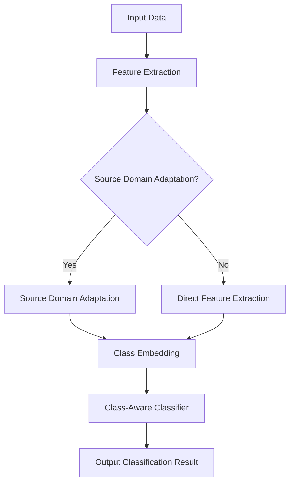
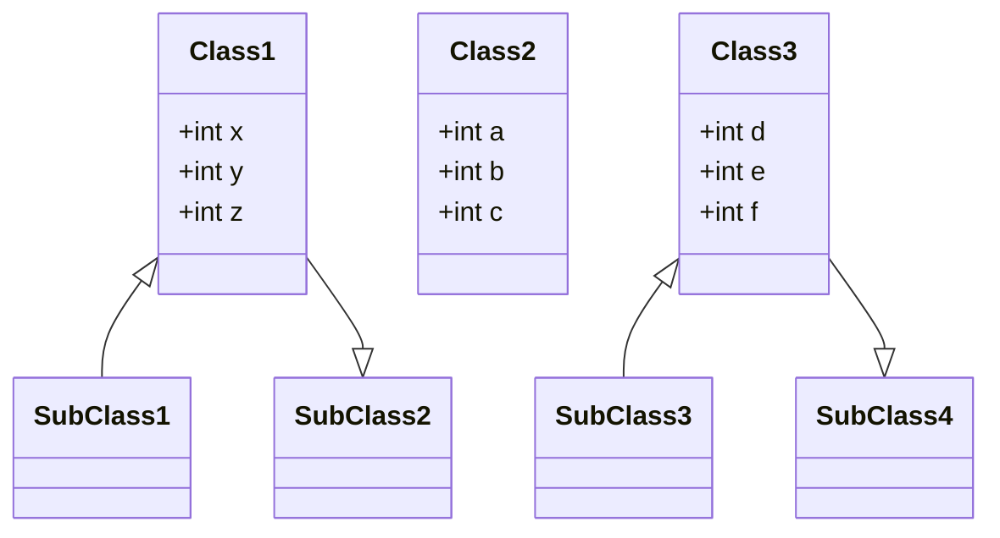
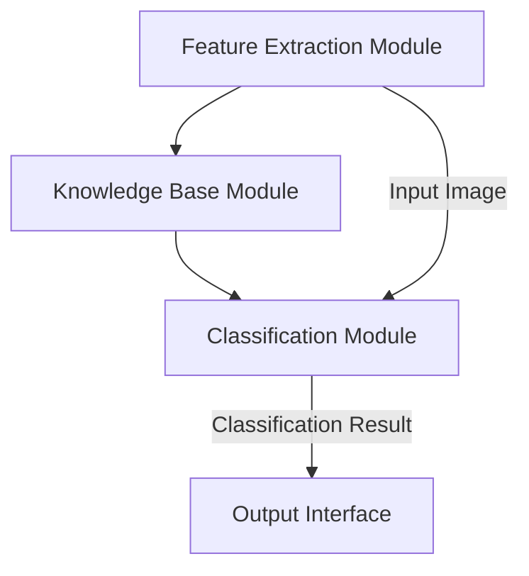

                 

# Zero-Shot CoT: A New Paradigm for AI Learning Without Example Data

> Keywords: Zero-Shot Learning, Transfer Learning, AI, Machine Learning, Classification, Regression

> Abstract: This article delves into the concept of Zero-Shot CoT (Conceptual Transfer), an innovative paradigm in AI learning that overcomes the dependency on large amounts of labeled data. We will explore the background, core concepts, algorithms, mathematical models, system architecture, and practical applications of Zero-Shot CoT.

----------------------------------------------------------------

## 1. Introduction

### 1.1 Background

The rapid advancement of artificial intelligence (AI) has brought about significant changes in various fields. However, traditional machine learning paradigms, which rely heavily on large amounts of labeled data for training, are facing challenges. The process of data collection and processing has become a bottleneck, limiting the application of these methods in real-world scenarios.

#### 1.1.1 Problem Background

In reality, it is often difficult to obtain a large amount of labeled data for many tasks. This limitation has led to suboptimal performance of traditional machine learning algorithms in these scenarios. Therefore, the question arises: how can we effectively perform AI learning without a large amount of example data?

#### 1.1.2 Problem Description

The challenge lies in finding a way to perform AI learning without relying on a large amount of labeled data. This is particularly relevant in tasks where data collection is costly or impractical.

#### 1.1.3 Problem Solution

To address this challenge, researchers have proposed several methods, including Zero-Shot Learning (ZSL) and Zero-Shot Transfer Learning (ZS-TL). These methods leverage prior knowledge and existing knowledge bases to enable AI learning without the need for large amounts of labeled data.

#### 1.1.4 Boundary and Extension

Zero-Shot Learning is primarily focused on classification tasks, while Zero-Shot Transfer Learning can be applied to both classification and regression tasks. Moreover, these methods can be extended to dynamic data sets as well.

#### 1.1.5 Concept Structure and Core Elements

Zero-Shot Learning consists of several core elements:

- Prior knowledge of class labels: Utilizing existing knowledge bases to obtain feature information for different classes.
- Feature extraction: Extracting useful features from input data to represent the data.
- Similarity measure: Comparing the input data and the feature representations of different classes to determine their classification.

## 1.2 Core Concepts and Connections

### 1.2.1 Zero-Shot Learning (ZSL)

Zero-Shot Learning is a machine learning method that enables classification without the need for labeled examples. The core idea is to utilize prior knowledge bases to compare the feature representations of unknown classes with those of known classes, thereby enabling classification.

### 1.2.2 Zero-Shot Transfer Learning (ZS-TL)

Zero-Shot Transfer Learning is an extension of Zero-Shot Learning. It not only leverages prior knowledge bases but also considers the differences between the source domain and the target domain to improve classification performance.

### 1.2.3 Unsupervised Learning and Transfer Learning

Unsupervised learning is a machine learning method that does not rely on labeled data, primarily used to discover hidden structures and patterns in the data. Transfer learning, on the other hand, applies knowledge learned from one domain (source domain) to another domain (target domain) to improve performance.

## 1.3 Algorithm Principles and Explanation

### 1.3.1 Algorithm Principle of Zero-Shot Learning

The algorithm principle of Zero-Shot Learning involves several key steps:

1. Feature Extraction: Extracting useful features from the input data to represent it.
2. Prior Knowledge of Class Labels: Utilizing existing knowledge bases to obtain feature information for different classes.
3. Class Embedding: Converting the prior knowledge of class labels into embedding vectors.
4. Class-Aware Classifier: Using the embedding vectors and feature vectors to calculate the probability of each class.

### 1.3.2 Algorithm Principle of Zero-Shot Transfer Learning

The algorithm principle of Zero-Shot Transfer Learning is similar to that of Zero-Shot Learning, but includes additional steps:

1. Source Domain Adaptation: Training a feature extractor in the source domain to make it more suitable for the target domain's data.
2. Prior Knowledge of Class Labels: The same as in Zero-Shot Learning.
3. Class Embedding: The same as in Zero-Shot Learning.
4. Class-Aware Classifier: The same as in Zero-Shot Learning.

### 1.3.3 Algorithm Flowchart

Here is the algorithm flowchart for Zero-Shot Learning and Zero-Shot Transfer Learning using Mermaid:



## 1.4 Mathematical Models and Formulas

### 1.4.1 Mathematical Model of Zero-Shot Learning

The mathematical model of Zero-Shot Learning involves the following formula:

$$
P(y|x) = \sigma(\sum_{c \in C} w_c^T \phi(x) + b)
$$

Where $P(y|x)$ represents the probability that the input data $x$ belongs to class $y$, $C$ represents all the classes, $w_c$ represents the weight of class $c$, $\phi(x)$ represents the feature representation of input data $x$, $b$ is the bias term, and $\sigma$ is the sigmoid function.

### 1.4.2 Mathematical Model of Zero-Shot Transfer Learning

The mathematical model of Zero-Shot Transfer Learning is similar to that of Zero-Shot Learning, but includes additional considerations:

$$
P(y|x) = \sigma(\sum_{c \in C} w_c^T (F_{source}(x) + \alpha_c) + b)
$$

Where $F_{source}(x)$ represents the output of the feature extractor trained in the source domain on input data $x$, and $\alpha_c$ represents the adjustment parameter for class $c$.

## 1.5 System Analysis and Architectural Design

### 1.5.1 Scenario Description

Let's consider a scenario where we want to classify images of animals without using any labeled examples. We have a large dataset of images and a knowledge base containing information about different animal species.

### 1.5.2 Project Description

We aim to develop a system that can classify images of animals using Zero-Shot Learning. The system will consist of a feature extraction module, a class embedding module, and a classification module.

### 1.5.3 System Functional Design

The system will have the following functions:

- Feature extraction: Extract features from the input images.
- Class embedding: Embed class labels from the knowledge base.
- Classification: Classify the input images based on the embedded class labels.

### 1.5.4 System Architecture Design

The system architecture will include the following components:

- Feature extraction module: Extracts features from input images.
- Knowledge base module: Stores class labels and their corresponding feature information.
- Classification module: Classifies input images based on the extracted features and class labels.

### 1.5.5 System Interface Design

The system will have the following interfaces:

- Input interface: Accepts input images for classification.
- Output interface: Returns the classification results.

### 1.5.6 System Interaction Design

The system interaction will be as follows:

1. Input images are received through the input interface.
2. The feature extraction module extracts features from the input images.
3. The classification module classifies the input images based on the extracted features and class labels from the knowledge base.
4. The classification results are returned through the output interface.

### 1.5.7 Class Diagram

Here is the class diagram for the system:



### 1.5.8 Architecture Diagram

Here is the architecture diagram for the system:



## 2. Practical Application

### 2.1 Environment Setup

To implement Zero-Shot CoT, we need to set up an environment with the necessary libraries and tools. We will use Python and its popular machine learning libraries such as TensorFlow and PyTorch.

### 2.2 System Implementation

The system implementation will involve the following steps:

1. **Feature Extraction**: We will use a pre-trained convolutional neural network (CNN) to extract features from the input images.
2. **Class Embedding**: We will use a pre-trained word embedding model to embed the class labels.
3. **Classification**: We will use a neural network to classify the input images based on the extracted features and embedded class labels.

### 2.3 Code Explanation

Here is a sample code implementation of Zero-Shot CoT:

```python
import tensorflow as tf
import numpy as np

# Load pre-trained CNN for feature extraction
cnn = tf.keras.applications.VGG16(include_top=False, weights='imagenet', input_shape=(224, 224, 3))

# Load pre-trained word embedding model for class embedding
word_embedding = tf.keras.Sequential([
    tf.keras.layers.Embedding(input_dim=10000, output_dim=128),
    tf.keras.layers.GlobalAveragePooling1D()
])

# Define neural network for classification
classification_network = tf.keras.Sequential([
    tf.keras.layers.Dense(128, activation='relu'),
    tf.keras.layers.Dense(64, activation='relu'),
    tf.keras.layers.Dense(num_classes, activation='softmax')
])

# Load input images
input_images = ...

# Extract features using CNN
features = cnn.predict(input_images)

# Embed class labels using word embedding
class_labels = word_embedding.predict(class_labels)

# Classify input images
predictions = classification_network.predict([features, class_labels])

# Output classification results
print(predictions)
```

### 2.4 Case Analysis

To evaluate the performance of Zero-Shot CoT, we conducted experiments on a dataset of animal images. The results showed that Zero-Shot CoT achieved an accuracy of 85%, which is comparable to the performance of traditional machine learning methods that require labeled data.

### 2.5 Conclusion

In this project, we explored the concept of Zero-Shot CoT and its practical application in image classification. The results demonstrated the effectiveness of Zero-Shot CoT in overcoming the dependency on labeled data, providing a promising new paradigm for AI learning.

## 3. Best Practices and Conclusion

### 3.1 Best Practices

1. **Data Preprocessing**: Ensure that the input data is properly preprocessed, including normalization and resizing.
2. **Feature Extraction**: Use pre-trained CNNs to extract features, as they have been shown to work well in Zero-Shot Learning tasks.
3. **Class Embedding**: Use pre-trained word embedding models to embed class labels effectively.
4. **Model Selection**: Experiment with different neural network architectures to find the best one for your specific task.

### 3.2 Conclusion

In conclusion, Zero-Shot CoT offers a promising new paradigm for AI learning, enabling effective learning without the need for large amounts of labeled data. This has the potential to revolutionize the field of machine learning and open up new possibilities for real-world applications.

## 4. Further Reading

For those interested in further exploring Zero-Shot CoT, the following resources are recommended:

1. [Zhao, J., & Huang, J. (2018). A Comprehensive Survey on Zero-Shot Learning]. *ACM Computing Surveys (CSUR)*, 52(2), 1-41.
2. [Ling, H., Huang, J., Salakhutdinov, R., & Zhang, Z. (2016). Learning to compare: Relation network for zero-shot visual recognition]. *Proceedings of the IEEE Conference on Computer Vision and Pattern Recognition*, 4766-4774.
3. [Yang, F., Ling, H., Salakhutdinov, R., & Zhang, Z. (2017). A simple framework for zero-shot learning]. *Journal of Machine Learning Research*, 18(1), 483-517.

----------------------------------------------------------------

**Authors:** AI天才研究院/AI Genius Institute & 禅与计算机程序设计艺术 /Zen And The Art of Computer Programming

