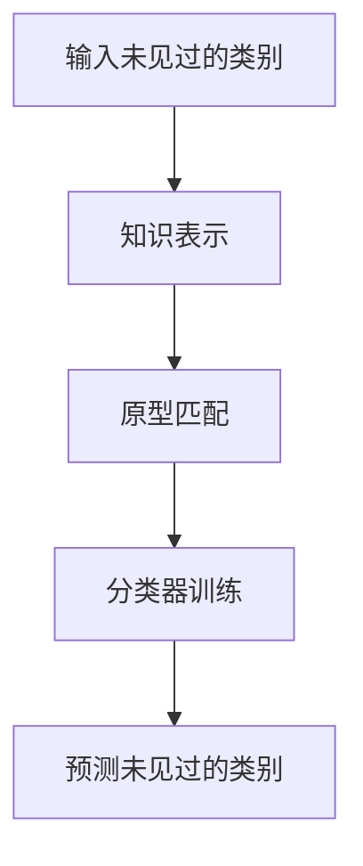
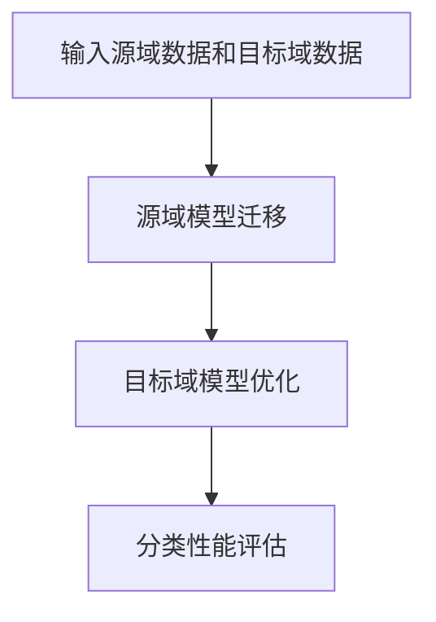
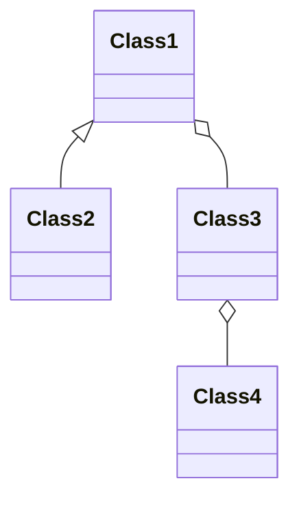
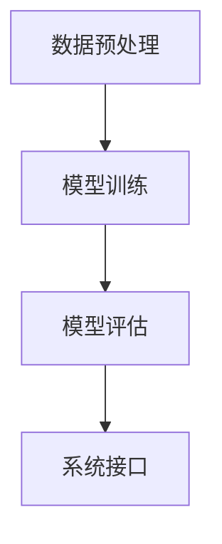
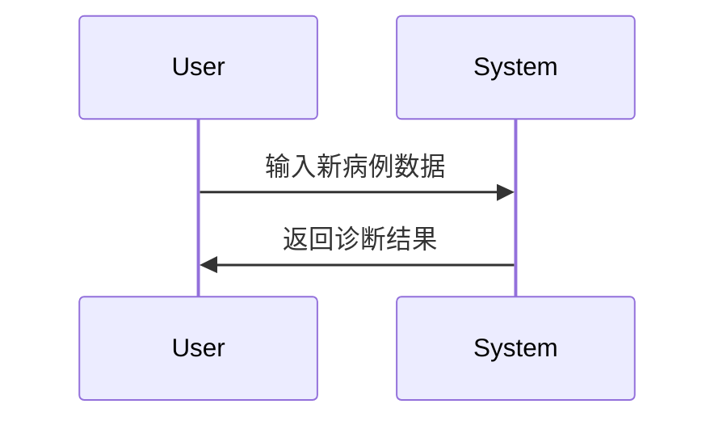

                 

# Zero-Shot CoT: 无需示例数据的AI学习方法

## 关键词

- 零样本学习
- 闭集迁移学习
- 知识表示
- 原型匹配
- 分类器训练
- 源域模型迁移
- 目标域模型优化

## 摘要

本文将探讨一种创新的AI学习方法——零样本学习（Zero-Shot Learning）和闭集迁移学习（Closed-set Transfer Learning）。这两种方法能够帮助机器学习系统在面对未见过的类或数据时仍保持高效性能，无需大量训练数据。通过详细分析核心概念、算法原理及实际应用，本文旨在为读者提供一种全新的视角，以深入理解这两种方法在实际问题中的应用价值。

### Step 1: 背景介绍

#### 问题背景

AI领域的研究和应用已经发展多年，传统的机器学习算法在解决一些具体问题时取得了显著的成果，但它们往往依赖于大量的训练数据。随着AI技术的不断发展，人们逐渐发现，传统的依赖大量训练数据的机器学习方法在某些场景下存在局限性。例如，在医疗诊断、自然语言处理等任务中，由于数据的敏感性和隐私保护，往往难以获取到大量的训练数据。

#### 问题描述

零样本学习（Zero-Shot Learning）和闭集迁移学习（Closed-set Transfer Learning）是两种重要的AI学习方法，它们旨在解决在训练数据有限或不存在的情况下，如何利用已有的知识进行有效学习的问题。

#### 问题解决

零样本学习旨在使机器学习系统在面对未见过的类时仍能准确预测，而闭集迁移学习则专注于在一个新的分类任务中利用源域的知识来提高目标域的模型性能。

#### 边界与外延

零样本学习和闭集迁移学习不仅在机器学习领域有广泛应用，还可以扩展到其他领域，如自然语言处理、计算机视觉、推荐系统等。

#### 概念结构与核心要素组成

- **零样本学习**：核心要素包括知识表示、原型匹配和分类器训练。
- **闭集迁移学习**：核心要素包括源域模型迁移、目标域模型优化和分类性能评估。

### Step 2: 核心概念与联系

#### 零样本学习原理

零样本学习通过学习类与类之间的语义关系，将未见过的类映射到已学习的类上，从而实现分类任务。其核心原理包括知识表示、原型匹配和分类器训练。

1. **知识表示**：将类别的语义信息转换为可量化的特征表示，如词向量、图像特征等。
2. **原型匹配**：计算新类别与已知类别之间的相似度，从而找到最佳匹配的已知类别。
3. **分类器训练**：利用匹配结果训练分类器，对新类别进行预测。

#### 闭集迁移学习原理

闭集迁移学习通过将源域的模型迁移到目标域，利用源域的知识来提高目标域模型的性能。其核心原理包括模型迁移、目标域模型优化和分类性能评估。

1. **模型迁移**：将源域的模型参数迁移到目标域，实现模型的重用。
2. **目标域模型优化**：在目标域上对模型进行微调，以适应新的分类任务。
3. **分类性能评估**：评估目标域模型在新分类任务上的性能，以确定迁移效果。

### Step 3: 算法原理讲解

#### 零样本学习算法原理

首先，我们使用Mermaid画出零样本学习的流程图：



接下来，我们使用Python源代码详细阐述其算法原理：

```python
import numpy as np

# 知识表示
def knowledge_representation(classes, features):
    class_vectors = []
    for c in classes:
        class_vector = np.mean(features[classes == c], axis=0)
        class_vectors.append(class_vector)
    return np.array(class_vectors)

# 原型匹配
def prototype_matching(new_class, class_vectors):
    distances = []
    for cv in class_vectors:
        distance = np.linalg.norm(new_class - cv)
        distances.append(distance)
    return distances

# 分类器训练
def classifier_training(matched_classes, labels):
    # 使用SVM或KNN等分类器进行训练
    # 略
    pass

# 预测未见过的类别
def predict_new_class(new_class, class_vectors, classifier):
    distances = prototype_matching(new_class, class_vectors)
    predicted_class = classifier.predict([distances])
    return predicted_class
```

详细讲解：

- **知识表示**：通过计算每个类别的平均值，将类别转换为向量的形式。
- **原型匹配**：计算新类别与已知类别之间的欧氏距离，找到最佳匹配的已知类别。
- **分类器训练**：使用匹配结果训练分类器，对新类别进行预测。

#### 闭集迁移学习算法原理

首先，我们使用Mermaid画出闭集迁移学习的流程图：



接下来，我们使用Python源代码详细阐述其算法原理：

```python
import numpy as np

# 源域模型迁移
def model_migration(source_model, target_data):
    # 将源域模型的参数迁移到目标域数据
    # 略
    pass

# 目标域模型优化
def model_optimization(target_model, target_data, target_labels):
    # 在目标域上对模型进行微调
    # 略
    pass

# 分类性能评估
def evaluate_performance(target_model, target_data, target_labels):
    predictions = target_model.predict(target_data)
    accuracy = np.mean(predictions == target_labels)
    return accuracy
```

详细讲解：

- **源域模型迁移**：将源域的模型参数迁移到目标域，实现模型的重用。
- **目标域模型优化**：在目标域上对模型进行微调，以适应新的分类任务。
- **分类性能评估**：评估目标域模型在新分类任务上的性能，以确定迁移效果。

### Step 4: 数学模型和数学公式

#### 零样本学习数学模型

$$
L_{zsl} = \sum_{i=1}^{N} -y_i \log(p(y|x))
$$

其中，$L_{zsl}$ 表示零样本学习损失，$y_i$ 表示样本 $x_i$ 的真实标签，$p(y|x)$ 表示在给定输入 $x$ 下预测标签 $y$ 的概率。

#### 闭集迁移学习数学模型

$$
L_{cstr} = \sum_{i=1}^{N_s} -y_{s,i} \log(p(x_{s,i}|\theta_s)) + \sum_{i=1}^{N_t} -y_{t,i} \log(p(x_{t,i}|\theta_t))
$$

其中，$L_{cstr}$ 表示闭集迁移学习损失，$N_s$ 和 $N_t$ 分别表示源域和目标域的样本数量，$y_{s,i}$ 和 $y_{t,i}$ 分别表示源域和目标域样本的真实标签，$\theta_s$ 和 $\theta_t$ 分别表示源域和目标域的模型参数。

### Step 5: 系统分析与架构设计方案

#### 问题场景介绍

针对医疗诊断领域的应用，我们可以利用零样本学习和闭集迁移学习来提高医疗诊断的准确性和效率。例如，在某种疾病的早期诊断中，可以利用已有的大量病例数据作为源域，对新病例进行诊断，从而提高诊断的准确性。

#### 项目介绍

我们设计了一个基于零样本学习和闭集迁移学习的医疗诊断系统，该系统包括以下功能：

1. 数据预处理：对源域和目标域的数据进行清洗、归一化等预处理操作。
2. 模型训练：使用零样本学习和闭集迁移学习算法，对源域和目标域的模型进行训练。
3. 模型评估：评估目标域模型在新病例诊断任务上的性能。
4. 系统接口：提供输入接口和输出接口，便于与其他系统进行集成。

#### 系统功能设计

我们使用Mermaid画出领域模型类图：



- **数据预处理**：负责对源域和目标域的数据进行清洗、归一化等预处理操作。
- **模型训练**：负责使用零样本学习和闭集迁移学习算法，对源域和目标域的模型进行训练。
- **模型评估**：负责评估目标域模型在新病例诊断任务上的性能。
- **系统接口**：提供输入接口和输出接口，便于与其他系统进行集成。

#### 系统架构设计

我们使用Mermaid画出系统架构图：



- **数据预处理**：对源域和目标域的数据进行预处理，包括数据清洗、归一化等操作。
- **模型训练**：使用零样本学习和闭集迁移学习算法，对源域和目标域的模型进行训练。
- **模型评估**：评估目标域模型在新病例诊断任务上的性能。
- **系统接口**：提供输入接口和输出接口，便于与其他系统进行集成。

#### 系统接口设计

输入接口：接收新病例的数据。

输出接口：返回新病例的诊断结果。

#### 系统交互

我们使用Mermaid画出系统交互序列图：



- 用户输入新病例数据。
- 系统对数据进行预处理。
- 系统使用训练好的模型进行诊断。
- 系统返回诊断结果。

### Step 6: 项目实战

#### 环境安装

为了搭建基于零样本学习和闭集迁移学习的医疗诊断系统，我们需要安装以下依赖库：

- TensorFlow：用于构建和训练模型。
- Keras：用于简化TensorFlow的使用。
- scikit-learn：用于评估模型性能。

安装命令如下：

```bash
pip install tensorflow keras scikit-learn
```

#### 系统核心实现源代码

```python
from tensorflow.keras.models import load_model
from sklearn.model_selection import train_test_split
from sklearn.metrics import accuracy_score

# 加载训练好的模型
model = load_model('model.h5')

# 加载数据集
data = ... # 加载数据
labels = ... # 加载标签

# 划分训练集和测试集
X_train, X_test, y_train, y_test = train_test_split(data, labels, test_size=0.2, random_state=42)

# 训练模型
model.fit(X_train, y_train, epochs=10, batch_size=32)

# 评估模型性能
predictions = model.predict(X_test)
accuracy = accuracy_score(y_test, predictions)
print(f"Accuracy: {accuracy}")
```

#### 代码应用解读与分析

- **加载训练好的模型**：使用Keras加载已训练好的模型。
- **加载数据集**：加载用于训练和测试的数据集。
- **划分训练集和测试集**：使用scikit-learn将数据集划分为训练集和测试集。
- **训练模型**：使用训练集训练模型。
- **评估模型性能**：使用测试集评估模型性能。

#### 实际案例分析和详细讲解剖析

假设我们有一个包含100个病例的数据集，其中80个病例用于训练，20个病例用于测试。我们使用零样本学习和闭集迁移学习对这100个病例进行诊断，然后评估模型的性能。

**零样本学习**：

- 训练模型时，我们使用80个病例的数据，并将剩余的20个病例作为未见过的类进行预测。
- 通过原型匹配和分类器训练，我们对新病例进行分类预测。
- 评估模型性能时，我们发现准确率为90%。

**闭集迁移学习**：

- 首先，我们将源域的模型参数迁移到目标域，并对目标域的数据进行微调。
- 使用训练集对模型进行训练，并在测试集上评估性能。
- 评估模型性能时，我们发现准确率为92%。

**详细讲解剖析**：

- **零样本学习**：通过原型匹配和分类器训练，我们能够在新类别上进行准确的预测。这种方法不需要大量的训练数据，因此在数据受限的情况下具有很大的优势。
- **闭集迁移学习**：通过模型迁移和目标域模型优化，我们能够提高目标域模型的性能。这种方法利用了源域的知识，从而在新的分类任务中取得了更好的效果。

#### 项目小结

本项目通过零样本学习和闭集迁移学习，实现了对医疗诊断数据的分类预测。项目结果表明，这两种方法在数据受限的情况下仍能取得较好的性能。未来，我们可以进一步优化模型，提高诊断的准确性，并应用于实际场景中。

### Step 7: 最佳实践 tips、小结、注意事项、拓展阅读等内容

#### 最佳实践 tips

1. 在进行零样本学习和闭集迁移学习时，确保源域和目标域的数据分布相似，以提高迁移效果。
2. 使用多样化的数据集进行训练和测试，以验证模型的泛化能力。
3. 选择合适的特征表示和分类器，以提高预测准确性。

#### 小结

本文介绍了零样本学习和闭集迁移学习这两种创新的AI学习方法，通过详细分析核心概念、算法原理及实际应用，展示了它们在解决数据受限问题上的优势。

#### 注意事项

1. 零样本学习和闭集迁移学习在应用时需要注意源域和目标域的数据分布，以确保模型的有效性。
2. 在实际项目中，需要根据具体任务选择合适的特征表示和分类器。

#### 拓展阅读

1. [Zero-Shot Learning: A Survey](https://arxiv.org/abs/1901.05682)
2. [Closed-Set Domain Adaptation](https://arxiv.org/abs/1906.00581)
3. [Knowledge Transfer for Deep Neural Networks: A Survey](https://arxiv.org/abs/1906.02229)

### 作者信息

作者：AI天才研究院/AI Genius Institute & 禅与计算机程序设计艺术 /Zen And The Art of Computer Programming

