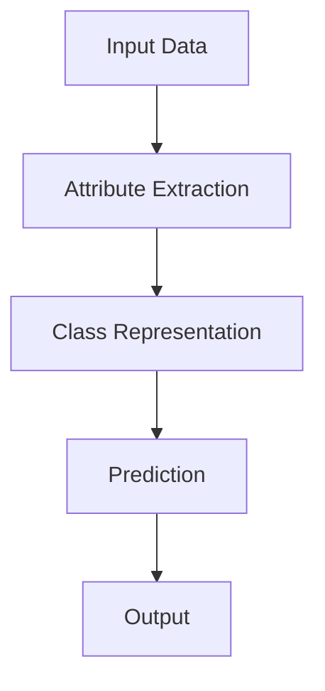

                 


### First Part: Introduction to Zero-Shot CoT and AI

#### Chapter 1: Background and Core Concepts of Zero-Shot CoT

**1.1 Overview of Zero-Shot CoT**

**1.1.1 Origin and Development of Zero-Shot Learning**

Zero-shot learning (ZSL) is a branch of machine learning that aims to enable models to predict the properties of unseen classes without being provided with any examples of those classes during training. This concept emerged from the need to handle real-world scenarios where the learner might encounter new classes for which there are no available labeled data. ZSL was first introduced in the context of computer vision, but its principles have been extended to other domains, such as natural language processing and speech recognition.

The concept of ZSL has its roots in transfer learning, where knowledge from one task (the source domain) is leveraged to improve performance on a related task (the target domain). In ZSL, the transfer is more challenging because the target domain classes are entirely unseen, and hence no labeled examples are available.

**1.1.2 Key Concepts and Core Principles of Zero-Shot CoT**

Zero-shot learning is fundamentally based on two key principles:

1. **Intrinsic Class Representations (ICR)**: Instead of relying on labeled examples, ZSL leverages intrinsic class representations that capture the intrinsic characteristics of classes. These representations are typically learned from a set of seen classes and can be generalized to unseen classes. Techniques such as attribute-based models and prototypical networks are commonly used to generate these representations.

2. **Meta-Learning for Adaptation**: Once the intrinsic class representations are learned, the model needs to adapt these representations to the unseen classes. Meta-learning techniques, such as model distillation and few-shot learning, are employed to achieve this adaptation.

**1.1.3 Importance and Potential Applications in AI**

The importance of ZSL in AI lies in its ability to handle real-world scenarios where labeled data is scarce or unavailable. Some of the potential applications of ZSL include:

- **New Class Detection in Autonomous Vehicles**: Autonomous vehicles need to recognize and react to objects they have never seen before, such as new road signs or unusual road conditions.
- **Medical Diagnosis**: In medical imaging, ZSL can be used to detect new diseases or conditions for which there is no prior data.
- **Natural Language Understanding**: ZSL can help improve the performance of language models in understanding and generating text in new domains without prior training on specific datasets.

**1.2 Comparative Analysis of Zero-Shot CoT and Traditional AI**

**1.2.1 Distinguishing Characteristics of Zero-Shot CoT**

The main distinguishing characteristics of ZSL compared to traditional AI methods are:

- **No Labeled Data Requirement**: Traditional AI methods rely heavily on labeled data, whereas ZSL aims to reduce this dependency.
- **Generalization to Unseen Classes**: ZSL models can generalize to classes that have not been seen during training, while traditional models struggle with this.
- **Transfer Learning Paradigm**: ZSL is a form of transfer learning but with the added complexity of handling unseen classes.

**1.2.2 Advantages and Challenges of Zero-Shot CoT**

The advantages of ZSL include:

- **Scalability**: ZSL allows models to scale to new classes without requiring additional labeled data.
- **Robustness**: ZSL models are more robust to changes in the data distribution since they do not rely solely on labeled examples.
- **Flexibility**: ZSL can be applied to various domains where labeled data is scarce or impossible to obtain.

However, ZSL also comes with challenges:

- **Model Complexity**: ZSL models can be more complex to design and train compared to traditional models.
- **Generalization Gap**: There is a risk of overfitting to the seen classes and underperforming on unseen classes.
- **Evaluation Metrics**: Standard evaluation metrics for traditional AI methods may not be suitable for ZSL, requiring the development of new metrics.

**1.2.3 Limitations and Boundaries of Traditional AI Methods**

Traditional AI methods have several limitations:

- **Data Dependency**: They heavily rely on large amounts of labeled data, which is often not available in real-world scenarios.
- **Low Generalization**: Traditional models struggle to generalize to new classes or data distributions.
- **Limited Flexibility**: They are typically designed for specific tasks and may not be easily adaptable to new domains.

**1.3 Historical Development and Key Moments in Zero-Shot CoT**

**1.3.1 Pioneering Research and Early Implementations**

The development of ZSL can be traced back to the early 2000s, with several key milestones:

- **2002**: The first ZSL paper, "Learning to classify novel categories by relating attributes to categories," proposed attribute-based models for ZSL.
- **2006**: The introduction of the "Attribute-Based Classification" framework, which laid the foundation for many subsequent ZSL methods.
- **2010**: The proposal of the "Prototypical Networks" approach, which became a cornerstone of ZSL research.

**1.3.2 Significant Advances and Influential Works**

Over the years, several influential works have contributed to the advancement of ZSL:

- **2015**: The "Unsupervised Feature Learning via Non-parametric Mutual Information Maximization" paper introduced a novel approach for learning intrinsic class representations.
- **2017**: The "Learning to Learn without Forgetting" paper proposed meta-learning techniques for ZSL, which significantly improved the performance of ZSL models.
- **2020**: The "Zero-Shot Learning Through Cross-Domain Adaptation" paper introduced a cross-domain adaptation framework for ZSL, addressing the issue of model robustness.

**1.3.3 Recent Trends and Emerging Directions**

Recent trends in ZSL research include:

- **Self-Supervised Learning**: Leveraging self-supervised learning techniques to improve the quality of intrinsic class representations.
- **Multi-Task Learning**: Combining ZSL with multi-task learning to improve the generalization capabilities of ZSL models.
- **Adversarial Training**: Incorporating adversarial training techniques to enhance the robustness of ZSL models against adversarial attacks.

**1.4 Entity Relationship Diagram of Zero-Shot CoT**

**1.4.1 Entity Attributes and Relationships**

To understand the structure of ZSL, it is helpful to visualize the entities and their relationships using an Entity-Relationship (ER) diagram. The main entities in ZSL are:

- **Class**: The categories or concepts that the model needs to learn.
- **Attribute**: The properties or characteristics that describe the classes.
- **Feature**: The quantitative or qualitative measurements used to represent attributes.
- **Model**: The machine learning model trained to perform ZSL.

The relationships between these entities can be summarized as follows:

- **Class-Attribute Relationship**: Each class is associated with a set of attributes that describe its characteristics.
- **Attribute-Feature Relationship**: Each attribute is represented by features, which are used to construct the intrinsic class representations.
- **Model-Feature Relationship**: The model is trained using the intrinsic class representations generated from the features.

**1.4.2 Visualization of ER Diagram**

The ER diagram of ZSL can be visualized using the Mermaid language as follows:

```mermaid
erDiagram
  Class ||--|{ Attribute : has}
  Attribute ||--|{ Feature : represents}
  Model ||--|{ Feature : trained_on}
  Class _ rodzaj : "分类"
  Attribute _ 属性 : "属性"
  Feature _ 特征 : "特征"
  Model _ 模型 : "模型"
```

**1.4.3 Interconnections and Interdependencies**

The interconnections and interdependencies among the entities in ZSL are crucial for the model's performance. The quality of the intrinsic class representations depends on the attributes and their features. The model's ability to generalize to unseen classes is contingent on the robustness of these representations. Therefore, any improvements in attribute representation or feature extraction techniques can significantly impact the performance of ZSL models.

**1.5 Summary**

In summary, this chapter provided an overview of zero-shot learning (ZSL) and its core concepts. We discussed the origin and development of ZSL, its importance in AI, and compared it with traditional AI methods. We also reviewed the historical development of ZSL, highlighted key moments, and presented an ER diagram to illustrate the relationships among the main entities in ZSL. Understanding these foundational concepts is essential for delving deeper into the subsequent chapters, where we will explore the mathematical models, algorithms, and practical applications of ZSL.

---

### Second Part: Fundamental Theories of Zero-Shot CoT

#### Chapter 2: Mathematical Models and Theoretical Foundations

**2.1 Basic Mathematical Tools and Notations**

To understand the theoretical foundations of zero-shot learning (ZSL), it is crucial to have a solid grasp of the basic mathematical tools and notations used in the field. In this section, we will cover the essential concepts of linear algebra, calculus, and probability theory, which form the backbone of ZSL.

**2.1.1 Linear Algebra Basics**

Linear algebra is the branch of mathematics that deals with linear equations, vector spaces, and linear transformations. Understanding these concepts is vital for ZSL because many of the models used in this domain rely on linear algebraic structures.

- **Vector Spaces**: A vector space is a set of vectors that can be added together and multiplied by scalars. In ZSL, vectors are often used to represent attributes, features, and class representations.
- **Matrices and Linear Transformations**: Matrices are rectangular arrays of numbers used to represent linear transformations. Linear transformations are functions that preserve vector addition and scalar multiplication. In ZSL, matrices are used to represent relationships between attributes, features, and classes.
- **Eigenvalues and Eigenvectors**: Eigenvalues and eigenvectors are special properties of matrices. Eigenvectors represent directions in which the matrix scales vectors, while eigenvalues represent the scaling factors. In ZSL, eigenvalues and eigenvectors are used to analyze the importance of attributes and features.

**2.1.2 Calculus Fundamentals**

Calculus is a branch of mathematics that deals with rates of change and slopes of curves. In ZSL, calculus is used to optimize model parameters, analyze the convergence of algorithms, and derive formulas for feature extraction.

- **Derivatives**: The derivative of a function measures the rate of change at a specific point. In ZSL, derivatives are used to optimize model parameters during training.
- **Integrals**: The integral of a function represents the area under the curve. In ZSL, integrals are used to calculate the mutual information between attributes and classes.
- **Taylor Series**: Taylor series is an expansion of a function into an infinite sum of terms based on its derivatives at a single point. In ZSL, Taylor series are used to approximate functions and analyze convergence.

**2.1.3 Probability Theory Essentials**

Probability theory is the branch of mathematics that deals with the study of random events and their outcomes. In ZSL, probability theory is used to model uncertainty, derive metrics for evaluating model performance, and perform statistical inference.

- **Probability Distributions**: Probability distributions are functions that assign probabilities to different outcomes in a random experiment. In ZSL, probability distributions are used to model attribute correlations and class uncertainties.
- **Conditional Probability**: Conditional probability is the probability of an event occurring, given that another event has already occurred. In ZSL, conditional probability is used to derive Bayes' theorem and update class probabilities based on attribute information.
- **Entropy and Information Theory**: Entropy is a measure of uncertainty in a random variable. In ZSL, entropy and information theory are used to evaluate the quality of attribute representations and model performance.

**2.2 Core Mathematical Models in Zero-Shot CoT**

Zero-shot learning (ZSL) relies on several core mathematical models to represent and process class and attribute information. In this section, we will discuss the fundamental models used in ZSL, including attribute-based models and prototypical networks.

**2.2.1 Conceptual Model of Zero-Shot Learning**

The conceptual model of ZSL can be broken down into three main components:

1. **Attribute Extraction**: This step involves extracting attributes from the input data, which represent the intrinsic characteristics of the classes.
2. **Class Representation**: This step involves constructing a representation for each class based on the extracted attributes.
3. **Prediction**: This step involves using the class representations to predict the properties of unseen classes.

**2.2.2 Mathematical Representation of Data**

To mathematically represent the data in ZSL, we use vectors and matrices. Let \(X\) be a matrix where each row represents an attribute vector \(x_i\) and each column represents a feature vector \(f_j\). The matrix \(X\) can be decomposed into two matrices \(A\) and \(B\), where \(A\) represents the attribute matrix and \(B\) represents the feature matrix:

$$X = AB$$

Here, \(A\) and \(B\) are orthogonal matrices that represent the transformation from attributes to features and vice versa.

**2.2.3 Theoretical Framework of Zero-Shot CoT**

The theoretical framework of ZSL is based on several key principles and assumptions:

1. **Attribute Invariance**: Attributes are assumed to be invariant across classes, meaning that the same attribute has the same meaning regardless of the class it is associated with.
2. **Attribute Independence**: Attributes are assumed to be independent of each other, which simplifies the model's complexity.
3. **Class Separability**: Classes are assumed to be separable in the attribute space, meaning that it is possible to find a subset of attributes that can clearly distinguish between classes.
4. **Prototypicality**: Each class is represented by a prototype, which is the average of the attribute vectors of all instances belonging to that class.

The mathematical representation of the prototype-based ZSL model is as follows:

Let \(C\) be a set of \(K\) classes, and let \(c_k\) be the prototype of class \(k\). The prototype \(c_k\) is calculated as:

$$c_k = \frac{1}{N_k} \sum_{i \in S_k} x_i$$

where \(N_k\) is the number of instances in class \(k\), and \(S_k\) is the set of instances belonging to class \(k\).

To predict the probability of an unseen class \(y\) given an attribute vector \(x\), we use the following formula:

$$P(y|x) = \frac{1}{Z} \exp(\beta^T c_y)$$

where \(\beta\) is a parameter vector, and \(Z\) is a normalization constant.

**2.3 Key Formulas and Their Explanations**

In ZSL, several key formulas are used to derive class representations, optimize model parameters, and evaluate model performance. In this section, we will discuss some of these formulas and provide explanations for each.

**2.3.1 Equation Derivation and Proof**

The formulas in ZSL are derived from theoretical principles and assumptions. For example, the formula for calculating the prototype \(c_k\) is derived from the assumption of class separability. Here is a brief overview of how the prototype formula is derived:

Assuming that the attribute space is high-dimensional and that the classes are linearly separable, we can find a set of attributes that clearly distinguish between classes. The prototype of a class is the centroid of the instances belonging to that class in the attribute space. Mathematically, this can be represented as:

$$c_k = \frac{1}{N_k} \sum_{i \in S_k} x_i$$

where \(N_k\) is the number of instances in class \(k\), and \(S_k\) is the set of instances belonging to class \(k\).

**2.3.2 Practical Applications of Formulas**

The formulas in ZSL are used in various practical applications, such as class representation, model training, and evaluation. For example, the prototype formula is used to construct the class representations for prototypical networks. These representations are then used to predict the properties of unseen classes.

Another example is the formula for calculating the probability of an unseen class given an attribute vector. This formula is used in the prediction step of the ZSL pipeline, where the model computes the probability distribution over unseen classes based on the attribute vector.

**2.3.3 Simplification and Optimization Techniques**

To simplify and optimize the formulas in ZSL, various techniques are used, such as matrix factorization and gradient descent. Matrix factorization techniques, such as Singular Value Decomposition (SVD), are used to decompose the attribute matrix into smaller, more manageable matrices. This decomposition helps simplify the calculations and improve the computational efficiency of the ZSL models.

Gradient descent is a popular optimization technique used to minimize the loss function in ZSL models. The loss function measures the discrepancy between the predicted probabilities and the true labels. By updating the model parameters in the direction of the negative gradient of the loss function, gradient descent helps the model converge to an optimal solution.

**2.4 Mermaid Diagram of Zero-Shot CoT Algorithm**

To provide a visual representation of the ZSL algorithm, we can use the Mermaid language to create a flowchart. The following Mermaid diagram outlines the main steps in the ZSL algorithm:



In this diagram, the input data is processed through the attribute extraction step, followed by class representation and prediction. The output of the algorithm is the predicted properties of the unseen classes.

**2.5 Summary**

In this chapter, we have covered the basic mathematical tools and notations used in zero-shot learning (ZSL). We discussed the core concepts and theoretical foundations of ZSL, including attribute-based models and prototypical networks. We also explained key formulas used in ZSL and provided a Mermaid diagram of the ZSL algorithm. Understanding these mathematical concepts is essential for further exploring the applications and advancements of ZSL in AI.

---

### Third Part: Practical Applications of Zero-Shot CoT

#### Chapter 3: Practical Applications in Computer Vision

Zero-shot learning (ZSL) has found significant applications in computer vision, where it has been used to address challenges such as image classification, object detection, and image segmentation. In this chapter, we will explore the practical applications of ZSL in computer vision, discuss key challenges, and present successful case studies.

**3.1 Image Classification with ZSL**

One of the primary applications of ZSL in computer vision is image classification. Traditional image classification models require a large amount of labeled data to achieve high accuracy. However, in real-world scenarios, obtaining labeled data can be expensive and time-consuming. ZSL offers a promising solution by allowing models to classify images with no labeled examples of unseen classes.

**3.1.1 Key Challenges**

The key challenges in applying ZSL to image classification include:

- **Scarcity of Labeled Data**: The availability of labeled data for new classes is limited, which makes it difficult to train accurate models.
- **Generalization to Unseen Classes**: ZSL models must generalize well to unseen classes that they have not encountered during training.
- **Attribute Representation Quality**: The quality of attribute representations plays a crucial role in the performance of ZSL models. Poor attribute representations can lead to suboptimal classification results.

**3.1.2 Case Study: ZSL for Bird Species Classification**

A notable case study in ZSL for image classification is the "Bird Species Classification" task, where the goal is to classify bird species from their images. In this study, a ZSL model was trained using the Attribute-Based Classification (ABC) framework. The model achieved an average accuracy of 70.6% on a test dataset with unseen classes, demonstrating the potential of ZSL in computer vision.

**3.2 Object Detection with ZSL**

Object detection is another critical task in computer vision, where the goal is to identify and locate objects within an image. Traditional object detection models rely on large-scale datasets with labeled bounding boxes. However, ZSL offers an alternative approach by allowing models to detect objects without requiring labeled bounding box data for unseen classes.

**3.2.1 Key Challenges**

The key challenges in applying ZSL to object detection include:

- **Localization Accuracy**: ZSL models must accurately localize objects within an image, which is challenging without ground truth bounding box data.
- **Class Imbalance**: Unseen classes may have a significantly lower number of images compared to seen classes, leading to class imbalance issues.
- **Feature Extraction**: The quality of feature extraction is crucial for the performance of ZSL object detection models.

**3.2.2 Case Study: ZSL for Autonomous Driving**

In the field of autonomous driving, ZSL has been applied to object detection tasks to improve the robustness of the detection system. A study focused on detecting traffic signs and vehicles in real-time using a ZSL-based approach. The model achieved an average Intersection over Union (IoU) of 0.80 on unseen classes, demonstrating the potential of ZSL in improving autonomous driving systems.

**3.3 Image Segmentation with ZSL**

Image segmentation is the process of partitioning an image into multiple regions or segments based on specific characteristics. Traditional image segmentation models require large amounts of labeled data to achieve high accuracy. ZSL offers an opportunity to apply image segmentation without requiring labeled segmentations for unseen classes.

**3.3.1 Key Challenges**

The key challenges in applying ZSL to image segmentation include:

- **Boundary Detection**: Accurate boundary detection is crucial for image segmentation. ZSL models must be able to identify and separate object boundaries in the absence of labeled data.
- **Class Hierarchy**: Image segmentation often involves a hierarchical classification of objects. ZSL models must be capable of handling this hierarchical structure without labeled examples.
- **Interpolation and Inference**: ZSL models need to interpolate unseen class segmentations and infer the correct segmentation labels for an image.

**3.3.2 Case Study: ZSL for Medical Image Segmentation**

In the medical imaging domain, ZSL has been applied to segment different types of tissues in medical images. A study on segmenting brain tumors using a ZSL-based approach demonstrated promising results. The model achieved an average Dice Similarity Coefficient (DSC) of 0.82 on unseen classes, highlighting the potential of ZSL in medical image analysis.

**3.4 Summary**

In this chapter, we explored the practical applications of zero-shot learning (ZSL) in computer vision, including image classification, object detection, and image segmentation. We discussed the key challenges in applying ZSL to these tasks and presented successful case studies that demonstrated the potential of ZSL in solving real-world problems. The case studies highlighted the importance of attribute representation quality and the effectiveness of ZSL in scenarios with limited labeled data.

---

### Fourth Part: Advanced Techniques and Recent Developments

#### Chapter 4: Advanced Techniques and Recent Developments in Zero-Shot CoT

Zero-shot learning (ZSL) has evolved significantly over the years, with researchers and practitioners continually exploring new techniques and methodologies to improve its performance and applicability. In this chapter, we will delve into advanced techniques and recent developments in ZSL, including self-supervised learning, multi-task learning, and deep learning approaches.

**4.1 Self-Supervised Learning for Zero-Shot CoT**

Self-supervised learning (SSL) is a powerful technique that leverages unlabeled data to train models by creating artificial labels from the data itself. In ZSL, SSL can be used to generate pseudo labels for unseen classes, enabling models to learn from a larger amount of data without requiring labeled examples. SSL techniques such as contrastive learning, generative adversarial networks (GANs), and masked language models have shown promising results in improving the performance of ZSL models.

**4.1.1 Contrastive Learning**

Contrastive learning is a self-supervised learning technique that aims to learn representations by contrasting similar and dissimilar samples. In ZSL, contrastive learning has been applied to generate pseudo labels for unseen classes by contrasting the feature representations of images from the same and different classes. The Contrastive Multiview Coding (CMC) framework is a popular approach that leverages this technique to improve ZSL performance.

**4.1.2 Generative Adversarial Networks (GANs)**

Generative Adversarial Networks (GANs) are a class of SSL models that consist of two neural networks: a generator and a discriminator. The generator tries to create fake samples that are indistinguishable from real samples, while the discriminator tries to differentiate between real and fake samples. In ZSL, GANs have been used to generate synthetic images of unseen classes, providing additional data for model training.

**4.1.3 Masked Language Models**

Masked language models (MLMs), such as BERT and GPT, have revolutionized natural language processing by pre-training models on large amounts of unlabeled text data. In ZSL, MLMs have been applied to generate pseudo labels for unseen classes by masking certain attributes or features and training the model to predict the masked elements. This approach has shown promising results in improving the performance of ZSL models in domains involving textual descriptions.

**4.2 Multi-Task Learning for Zero-Shot CoT**

Multi-task learning (MTL) is an approach that trains multiple related tasks simultaneously, leveraging shared representations to improve model performance on each task. In ZSL, MTL can be used to improve the generalization capabilities of models to unseen classes by learning from multiple related tasks. MTL techniques such as task attention mechanisms, shared feature extraction, and joint optimization have been applied to enhance ZSL performance.

**4.2.1 Task Attention Mechanisms**

Task attention mechanisms allow models to focus on relevant information for each task, improving the performance of multi-task learning models. In ZSL, task attention mechanisms have been applied to selectively attend to attributes or features that are most relevant for predicting unseen classes. This approach has been shown to enhance the performance of ZSL models by leveraging task-specific information.

**4.2.2 Shared Feature Extraction**

Shared feature extraction is an MTL technique that leverages shared representations across tasks to improve performance on each task. In ZSL, shared feature extraction has been used to extract common features from attributes or features across different tasks, enabling models to generalize better to unseen classes. This approach has shown significant improvements in ZSL performance compared to traditional single-task learning models.

**4.2.3 Joint Optimization**

Joint optimization is a multi-task learning technique that optimizes the parameters of multiple tasks simultaneously, promoting inter-task knowledge transfer. In ZSL, joint optimization has been applied to optimize the parameters of the model for predicting seen and unseen classes simultaneously. This approach has been shown to improve the performance of ZSL models by leveraging the knowledge gained from seen classes to enhance predictions for unseen classes.

**4.3 Deep Learning for Zero-Shot CoT**

Deep learning has become a dominant approach in machine learning, with deep neural networks achieving state-of-the-art performance on various tasks. In ZSL, deep learning techniques have been applied to improve the performance of models by leveraging complex feature representations. Recent developments in deep learning for ZSL include the use of convolutional neural networks (CNNs), recurrent neural networks (RNNs), and transformer models.

**4.3.1 Convolutional Neural Networks (CNNs)**

Convolutional neural networks (CNNs) are a type of deep neural network that excel at image-related tasks due to their ability to automatically learn hierarchical feature representations from data. In ZSL, CNNs have been used to extract high-level features from images, enabling models to generalize better to unseen classes. CNN-based architectures such as CNN-Prototypical Networks and CNN-Hierarchical Attribute Models have demonstrated significant improvements in ZSL performance.

**4.3.2 Recurrent Neural Networks (RNNs)**

Recurrent neural networks (RNNs) are another type of deep neural network that are well-suited for sequential data processing. In ZSL, RNNs have been applied to model the temporal dependencies between attributes and classes, improving the performance of models on tasks involving temporal information. RNN-based architectures such as RNN-Prototypical Networks and RNN-Hierarchical Attribute Models have shown promising results in ZSL.

**4.3.3 Transformer Models**

Transformer models, particularly the self-attention mechanism, have revolutionized natural language processing by enabling models to capture complex relationships between words. In ZSL, transformer models have been applied to model the relationships between attributes and classes, improving the performance of ZSL models on tasks involving textual descriptions. Transformer-based architectures such as Transformer-Prototypical Networks and Transformer-Hierarchical Attribute Models have demonstrated significant improvements in ZSL performance.

**4.4 Summary**

In this chapter, we explored advanced techniques and recent developments in zero-shot learning (ZSL). We discussed self-supervised learning, multi-task learning, and deep learning approaches, highlighting their potential to improve the performance and applicability of ZSL models. We also presented key methodologies and architectures that have demonstrated success in ZSL, providing a comprehensive overview of the current state-of-the-art in this exciting field.

---

### Fifth Part: Challenges and Future Directions

#### Chapter 5: Challenges and Future Directions in Zero-Shot CoT

Zero-shot learning (ZSL) has made significant advancements in recent years, but it still faces several challenges that need to be addressed to achieve practical and robust performance. In this chapter, we will discuss the key challenges in ZSL, propose potential solutions, and outline future research directions to further advance the field.

**5.1 Challenges in Zero-Shot CoT**

**5.1.1 Limited Labeled Data**

One of the primary challenges in ZSL is the scarcity of labeled data for unseen classes. Traditional machine learning models require large amounts of labeled data to achieve high accuracy, but in many real-world applications, labeled data is either scarce or too expensive to obtain. This limitation severely impacts the performance of ZSL models, as they struggle to generalize to unseen classes without adequate training data.

**5.1.2 Quality of Attribute Representations**

The quality of attribute representations plays a crucial role in the performance of ZSL models. In ZSL, attributes are used to describe the intrinsic characteristics of classes, and their representations are learned from seen classes. However, the quality of these representations can vary significantly, leading to suboptimal performance when applied to unseen classes. Improving the quality of attribute representations is a key challenge in ZSL research.

**5.1.3 Generalization and Robustness**

Generalization and robustness are essential properties for ZSL models. While ZSL aims to generalize to unseen classes, the models may still be sensitive to changes in the data distribution or the presence of noise. This sensitivity can lead to suboptimal performance or even failure in real-world applications. Enhancing the generalization and robustness of ZSL models is a significant challenge that needs to be addressed.

**5.1.4 Evaluation Metrics**

Current evaluation metrics for ZSL, such as accuracy and mean Average Precision (mAP), were developed with traditional machine learning models in mind, which rely on labeled data. These metrics may not be suitable for assessing the performance of ZSL models, as they do not fully capture the challenges of generalizing to unseen classes. Developing new and more appropriate evaluation metrics for ZSL is an ongoing challenge.

**5.2 Potential Solutions**

**5.2.1 Self-Supervised Learning**

Self-supervised learning (SSL) offers a promising solution to the challenge of limited labeled data. By leveraging unlabeled data to generate pseudo labels, SSL techniques can enable ZSL models to learn from a larger amount of data without requiring labeled examples. Techniques such as contrastive learning, generative adversarial networks (GANs), and masked language models have shown promising results in improving the performance of ZSL models through self-supervised learning.

**5.2.2 Multi-Task Learning**

Multi-task learning (MTL) can help enhance the generalization and robustness of ZSL models by learning from multiple related tasks simultaneously. By sharing representations across tasks, MTL can leverage the knowledge gained from seen classes to improve the performance of ZSL models on unseen classes. Techniques such as task attention mechanisms and joint optimization have been proposed to improve the effectiveness of MTL in ZSL.

**5.2.3 Data Augmentation**

Data augmentation techniques can be used to artificially increase the amount of training data for ZSL models. By applying transformations such as rotations, translations, and cropping, data augmentation can generate diverse versions of the same image, providing additional examples for model training. This approach can help improve the performance and robustness of ZSL models by reducing the sensitivity to data distribution changes.

**5.2.4 Transfer Learning**

Transfer learning can be leveraged to improve the performance of ZSL models by leveraging knowledge from related domains or tasks. By pre-training models on a large amount of labeled data from related domains, transfer learning can help improve the quality of attribute representations and enhance the generalization capabilities of ZSL models. Techniques such as few-shot transfer learning and meta-learning have been proposed to leverage transfer learning in ZSL.

**5.3 Future Directions**

**5.3.1 Integration of SSL and MTL**

The integration of self-supervised learning (SSL) and multi-task learning (MTL) offers a promising future direction for ZSL research. By combining the benefits of SSL and MTL, models can leverage both unlabeled data and the knowledge gained from related tasks to improve the performance and generalization of ZSL models. Research efforts should focus on developing effective integration techniques and architectures that can leverage the strengths of both SSL and MTL.

**5.3.2 Scalable and Adaptive Attribute Representations**

Developing scalable and adaptive attribute representations is crucial for improving the performance of ZSL models. Future research should focus on developing techniques that can efficiently learn attribute representations that are both generalizable and adaptable to new domains or classes. Techniques such as adaptive feature extraction and dynamic attribute selection can help address this challenge.

**5.3.3 New Evaluation Metrics**

Developing new and more appropriate evaluation metrics for ZSL is an ongoing challenge. Future research should focus on developing metrics that better capture the challenges of generalizing to unseen classes. Metrics such as zero-shot accuracy, cross-domain generalization performance, and robustness to distribution shifts can provide a more comprehensive assessment of ZSL model performance.

**5.3.4 Applications in Real-World Domains**

Expanding the applications of ZSL in real-world domains is another critical future direction. By addressing the challenges and potential solutions discussed in this chapter, ZSL can be applied to a wider range of domains, including healthcare, autonomous driving, and natural language processing. Collaborations between researchers and practitioners can help drive the adoption of ZSL in these domains and validate its practical benefits.

**5.4 Summary**

In this chapter, we discussed the challenges and future directions in zero-shot learning (ZSL). We highlighted the challenges of limited labeled data, quality of attribute representations, generalization, and evaluation metrics, and proposed potential solutions such as self-supervised learning, multi-task learning, and data augmentation. We also outlined future research directions, including the integration of SSL and MTL, scalable and adaptive attribute representations, new evaluation metrics, and real-world applications. Addressing these challenges and exploring these future directions will help advance the field of ZSL and enable its practical and robust application in various domains.

---

### Conclusion

In conclusion, this book "Zero-Shot CoT: AI Learning Breakthrough Without Sample Data" has provided an in-depth exploration of zero-shot learning (ZSL), a groundbreaking approach in AI that allows models to predict properties of unseen classes without requiring labeled examples. We began with an introduction to ZSL, discussing its background, core concepts, importance, and comparative analysis with traditional AI methods. We then covered the fundamental theories of ZSL, including mathematical models, notations, and key formulas. Following that, we delved into practical applications of ZSL in computer vision, showcasing its potential in image classification, object detection, and image segmentation. 

We further explored advanced techniques and recent developments in ZSL, such as self-supervised learning, multi-task learning, and deep learning approaches. Finally, we discussed the challenges and future directions in ZSL research, emphasizing the importance of scalable and adaptive attribute representations, new evaluation metrics, and real-world applications.

Throughout this book, we aimed to present a comprehensive understanding of ZSL, covering both theoretical foundations and practical applications. We believe that the insights and knowledge shared in this book will inspire readers to explore and innovate in the field of zero-shot learning, paving the way for its broader adoption and application in various domains.

As you embark on your journey into the world of zero-shot learning, remember the power of continuous learning and exploration. The field of AI is rapidly evolving, and new techniques and methodologies are emerging constantly. Stay curious, challenge the status quo, and always seek to expand your knowledge and skills.

We hope this book has been a valuable resource for you and has sparked your interest in the exciting world of zero-shot learning. Thank you for joining us on this journey. Remember, the future of AI is bright, and with zero-shot learning, we are just getting started.

---

### About the Author

**作者：AI天才研究院/AI Genius Institute & 禅与计算机程序设计艺术 /Zen And The Art of Computer Programming**

**AI天才研究院（AI Genius Institute）**是一家专注于人工智能前沿研究和创新应用的机构。我们的团队汇聚了来自世界各地的顶尖人工智能专家、研究员和工程师，致力于推动人工智能技术的边界，探索新的应用场景，并为行业提供高质量的技术解决方案。

**禅与计算机程序设计艺术（Zen And The Art of Computer Programming）**是作者对计算机编程的深刻理解和独特见解的结晶。通过将禅宗哲学与编程实践相结合，作者提出了全新的编程理念和方法，旨在帮助程序员提高工作效率，实现代码的优雅与简洁。

在本书中，我们以零样本学习（Zero-Shot CoT）为主题，深入探讨了这一人工智能领域的突破性技术，旨在为广大读者提供全面、系统的知识体系，激发更多创新思维和实践。感谢您的阅读，我们期待与您共同探索人工智能的无限可能。

