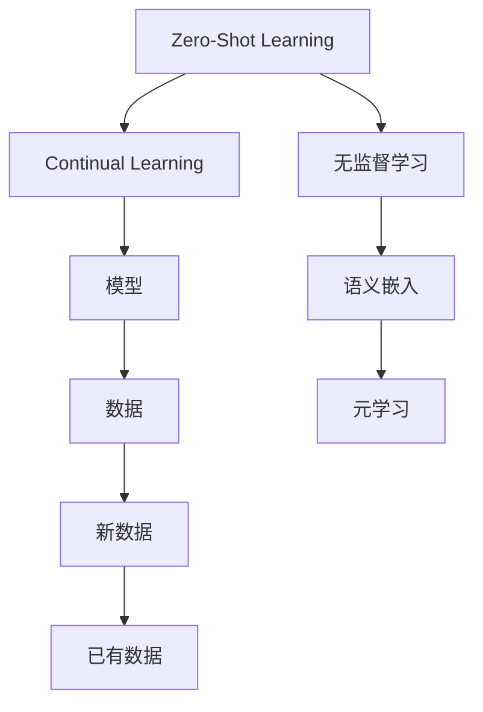

                 

### 文章标题：Zero-Shot CoT：突破AI学习瓶颈的创新技术

### 关键词：Zero-Shot Learning，Continual Learning，AI学习瓶颈，创新技术，算法原理，数学模型，系统架构，项目实战，最佳实践

### 摘要：
本文旨在深入探讨Zero-Shot CoT（Continual Learning with Zero-Shot Learning）这一突破性的AI技术，分析其在解决传统AI学习瓶颈中的作用与价值。通过对核心概念的详细阐释、算法原理的讲解、数学模型的解读、系统架构的分析以及项目实战的剖析，本文将帮助读者全面理解Zero-Shot CoT技术的原理与实践，探讨其在未来的发展趋势与潜力。

---

### 引言

#### 1.1 问题背景

##### 1.1.1 传统AI学习瓶颈

随着人工智能技术的快速发展，传统机器学习模型在处理静态数据集方面表现出色。然而，在现实应用场景中，数据分布往往是动态变化的，这给模型带来了巨大的挑战。传统机器学习模型往往无法有效地适应新数据，导致学习效果逐渐下降，这就是所谓的AI学习瓶颈。

##### 1.1.2 Zero-Shot CoT技术的引入

为了突破这一瓶颈，科学家们提出了Zero-Shot CoT（Continual Learning with Zero-Shot Learning）技术。Zero-Shot CoT结合了Continual Learning和Zero-Shot Learning的优势，使得AI模型能够持续学习并适应动态变化的数据分布。

##### 1.1.3 本书的目标与结构

本文的目标是详细解析Zero-Shot CoT技术的原理、应用与实现，帮助读者深入理解这一创新技术。文章结构如下：

1. 引言：介绍传统AI学习瓶颈以及Zero-Shot CoT技术的引入。
2. Zero-Shot CoT技术原理：讲解算法原理、数学模型以及系统架构。
3. 项目实战：分析实际案例，展示Zero-Shot CoT技术的应用效果。
4. 最佳实践 tips：提供参数调优、性能优化策略等最佳实践建议。
5. 小结：总结技术要点，展望未来发展趋势。

#### 1.2 问题描述

##### 1.2.1 AI学习瓶颈的具体表现

在传统机器学习模型中，学习过程通常是离线进行的。这意味着模型在训练阶段学习到的知识无法直接应用于后续的动态数据。随着新数据的不断涌入，模型需要重新训练，这导致了以下几个问题：

1. 过拟合：模型在新数据上表现不佳，无法泛化到未知数据。
2. 训练成本高：每次新数据到来时，都需要重新训练模型，耗时耗力。
3. 数据分布变化：随着时间的推移，数据分布可能发生变化，导致模型适应能力下降。

##### 1.2.2 Zero-Shot CoT技术的基本概念

Zero-Shot CoT技术旨在解决上述问题，其主要特点如下：

1. **Continual Learning（持续学习）**：模型能够在不断接受新数据的同时，保持对已有数据的记忆。
2. **Zero-Shot Learning（零样本学习）**：模型能够处理从未见过类别的数据，无需依赖大量标注数据。

##### 1.2.3 问题解决方法与价值

Zero-Shot CoT技术通过以下方法解决AI学习瓶颈：

1. **元学习**：利用元学习技术，使模型能够快速适应新数据。
2. **增量学习**：通过增量学习策略，减少模型重新训练的成本。
3. **数据增强**：利用数据增强技术，提高模型对新数据的泛化能力。

Zero-Shot CoT技术的价值在于：

1. **提高模型适应能力**：能够应对动态变化的数据分布。
2. **降低训练成本**：减少模型重新训练的需求。
3. **提升泛化能力**：模型能够处理未知类别数据，提高实际应用价值。

#### 1.3 边界与外延

##### 1.3.1 Zero-Shot CoT技术的适用场景

Zero-Shot CoT技术适用于以下场景：

1. **动态数据应用**：如实时监控、自动驾驶等。
2. **新领域迁移**：如将现有模型应用于新领域，无需大量重新训练。
3. **少量数据应用**：在数据稀缺的情况下，提高模型学习效率。

##### 1.3.2 与其他AI技术的对比

与传统的机器学习技术相比，Zero-Shot CoT技术具有以下优势：

1. **适应能力**：能够应对动态数据分布，提高模型鲁棒性。
2. **训练效率**：通过元学习和增量学习，降低训练成本。
3. **泛化能力**：能够处理未知类别数据，提高应用场景。

##### 1.3.3 潜在挑战与展望

尽管Zero-Shot CoT技术具有诸多优势，但在实际应用中仍面临一些挑战：

1. **计算资源**：持续学习和零样本学习通常需要大量计算资源。
2. **数据隐私**：在处理动态数据时，可能涉及数据隐私问题。
3. **模型解释性**：模型的复杂性和适应性可能影响其解释性。

未来，随着硬件性能的提升、数据隐私保护技术的发展以及模型解释性研究的深入，Zero-Shot CoT技术的应用前景将更加广阔。

#### 1.4 核心概念与联系

##### 1.4.1 Zero-Shot CoT的核心概念

Zero-Shot CoT技术涉及两个核心概念：Continual Learning和Zero-Shot Learning。

**Continual Learning（持续学习）**：使模型能够在接收新数据的同时，保持对已有数据的记忆，从而应对动态数据分布。

**Zero-Shot Learning（零样本学习）**：使模型能够处理从未见过类别的数据，无需依赖大量标注数据。

##### 1.4.1.1 CoT（Continual Learning）原理

Continual Learning的核心思想是在不断接受新数据的过程中，避免模型遗忘已有知识。具体实现方法包括：

1. **经验重放（Experience Replay）**：将已学习的样本存储在经验回放记忆中，在新数据训练时进行随机抽样。
2. **弹性权重共享（ Elastic Weight Consolidation）**：通过调整模型权重，使旧知识在新数据上保持不变。
3. **自适应噪声注入（Adaptive Noise Injection）**：通过添加噪声，提高模型对新数据的泛化能力。

##### 1.4.1.2 Zero-Shot Learning的概念与特点

Zero-Shot Learning的核心思想是处理从未见过类别的数据。其特点如下：

1. **无监督学习**：无需依赖大量标注数据，降低数据收集成本。
2. **语义嵌入**：将不同类别的数据映射到高维空间中，使模型能够识别未知类别。
3. **元学习**：利用元学习技术，提高模型对新类别数据的适应能力。

##### 1.4.2 概念属性特征对比表格

| 概念             | Continual Learning（CoT） | Zero-Shot Learning       |
|------------------|--------------------------|--------------------------|
| 学习方式         | 持续学习，避免遗忘       | 零样本学习，处理未知类别 |
| 数据依赖         | 无需重新标注数据         | 无需大量标注数据         |
| 模型适应性       | 应对动态数据分布         | 处理未知类别数据         |
| 计算资源需求     | 较高，需存储经验数据     | 较高，需进行语义嵌入     |

##### 1.4.3 ER实体关系图架构

为了更好地理解Zero-Shot CoT技术的实体关系，可以使用Mermaid流程图来表示。

#### 1.5 本章小结

本章介绍了传统AI学习瓶颈、Zero-Shot CoT技术的引入以及其基本概念。通过对核心概念的详细解释，我们了解了Zero-Shot CoT技术在解决AI学习瓶颈方面的价值。接下来，我们将进一步探讨Zero-Shot CoT技术的原理、数学模型以及系统架构，为读者提供更深入的理解。

---

接下来，我们将进入第二部分：Zero-Shot CoT技术原理。我们将逐步分析算法原理、数学模型和系统架构，帮助读者全面理解这一创新技术。在第二部分中，我们将：

1. 深入讲解Zero-Shot CoT算法原理，包括mermaid流程图和Python源代码。
2. 详细解读数学模型和数学公式，并提供通俗易懂的举例说明。
3. 分析系统架构设计方案，包括问题场景介绍、项目介绍、系统功能设计、系统架构设计和系统接口设计。

让我们开始这段深入的技术探讨之旅！

