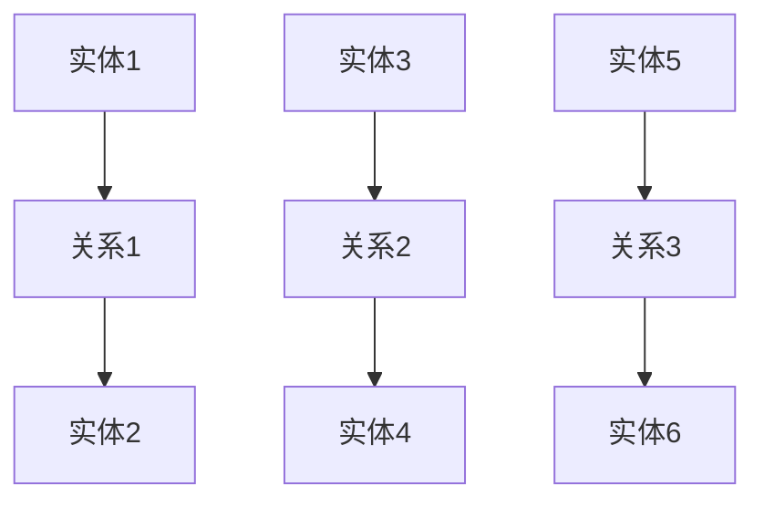
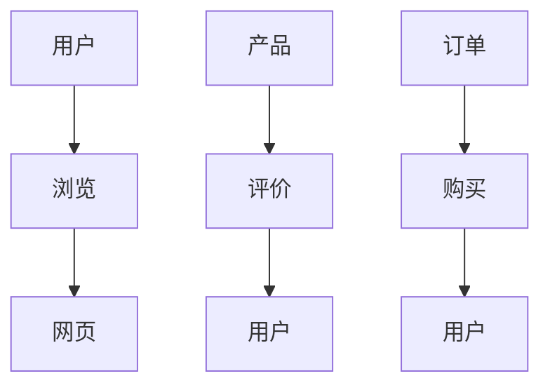
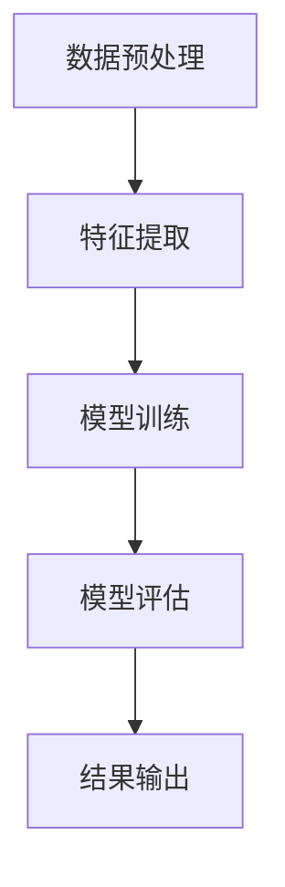
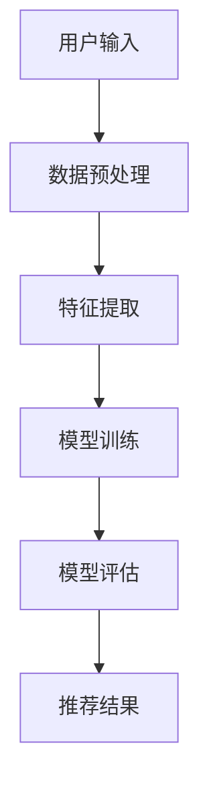
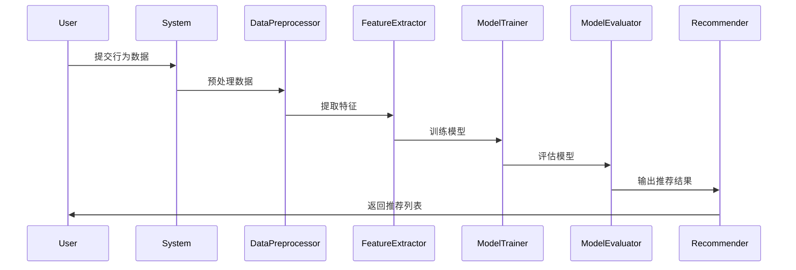

                 

# 《Zero-Shot CoT：突破AI学习瓶颈的前沿方法研究》

## 关键词：
- **Zero-Shot CoT**
- **AI学习瓶颈**
- **机器学习**
- **深度学习**
- **知识图谱**
- **跨模态学习**

## 摘要：
本文深入探讨了Zero-Shot CoT（Zero-Shot Core-Task）作为一种前沿的AI学习方法，旨在突破传统AI学习中的瓶颈。通过介绍其背景、定义、算法原理以及实际应用，本文详细解析了Zero-Shot CoT如何实现无需样本迁移，直接在新的任务上进行有效学习。文章旨在为读者提供一份全面、深入的理解，帮助其掌握这一创新方法，并探索其在未来AI发展中的潜力。

## 第一部分：背景与概念

### 第1章：问题背景

#### 1.1 问题背景

##### 1.1.1 人工智能发展现状

自20世纪50年代以来，人工智能（AI）技术取得了巨大的进步，从早期的逻辑推理到近年的深度学习，AI在图像识别、自然语言处理、自动驾驶等领域取得了显著成就。然而，随着AI技术的广泛应用，我们也遇到了一个日益严峻的问题：学习瓶颈。

##### 1.1.2 AI学习瓶颈的挑战

AI学习瓶颈主要体现在以下几个方面：

- **样本依赖性**：现有的机器学习模型，特别是深度学习模型，通常依赖于大量的标注数据进行训练。这意味着在新任务上，模型需要重新收集和标注数据，这既耗时又昂贵。
- **迁移学习难度**：尽管迁移学习技术可以缓解样本依赖性，但跨领域的迁移学习仍然面临挑战，不同领域的数据分布差异巨大，迁移效果有限。
- **泛化能力不足**：模型在特定任务上表现优异，但在未见过的任务上性能下降，这限制了AI的实际应用范围。

##### 1.1.3 Zero-Shot CoT的研究意义

Zero-Shot CoT旨在解决上述问题，通过引入知识图谱、跨模态学习和元学习等技术，实现模型在新任务上的直接学习，无需大量样本。这种方法不仅提高了AI的泛化能力，还大大降低了数据获取和标注的成本，具有重要的研究价值和实际应用潜力。

#### 1.2 问题定义

##### 1.2.1 什么是Zero-Shot CoT

Zero-Shot CoT，即零样本核心任务学习，是一种机器学习方法，它允许模型在没有或仅有少量新任务样本的情况下进行学习。通过预先训练好的模型和知识图谱，Zero-Shot CoT能够在新任务上快速适应，提供较高的准确性和泛化能力。

##### 1.2.2 Zero-Shot CoT的应用场景

- **跨领域应用**：在不同领域间进行知识转移，如医疗、金融、制造业等。
- **实时系统**：如自动驾驶、智能客服等，要求系统在实时环境中快速适应新的任务。
- **数据稀缺场景**：在数据获取困难或成本高昂的场景中，如稀有物种监测、灾害应急响应等。

##### 1.2.3 需要解决的问题

- **如何利用预先训练好的模型和知识图谱进行新任务的学习**？
- **如何处理数据分布差异，提高模型的泛化能力**？
- **如何减少对新任务样本的依赖，降低学习成本**？

#### 1.3 概念结构与核心要素组成

##### 1.3.1 核心概念原理

- **知识图谱**：一种用于表示实体及其关系的图形化数据结构，是Zero-Shot CoT的重要组件，用于提供任务先验知识。
- **预训练模型**：在大规模数据集上训练好的模型，用于提取通用特征和模式，是Zero-Shot CoT的基础。
- **元学习**：一种通过学习学习策略的方法，用于优化新任务的快速适应。

##### 1.3.2 概念属性特征对比

| 特征       | 知识图谱 | 预训练模型 | 元学习           |
|------------|-----------|-------------|------------------|
| 功能       | 表示实体关系 | 提取通用特征 | 学习学习策略     |
| 数据结构   | 图结构     | 矩阵或张量   | 参数化模型       |
| 应用场景   | 跨领域知识转移 | 图像、语音识别 | 快速适应新任务   |

##### 1.3.3 ER实体关系图



## 第二部分：核心概念与联系

### 第2章：核心概念与联系

#### 2.1 核心概念原理

在本节中，我们将详细探讨Zero-Shot CoT的核心概念，包括知识图谱、预训练模型和元学习。

##### 2.1.1 知识图谱

知识图谱是一种用于表示实体及其关系的图形化数据结构。它由实体（如人、地点、事物）和关系（如属于、位于、属于某一类别）组成。知识图谱为Zero-Shot CoT提供了任务先验知识，帮助模型在新任务上快速适应。

- **实体**：知识图谱中的核心元素，表示具体的对象。
- **关系**：连接两个实体的语义联系，如“属于”、“位于”。
- **属性**：实体的额外特征，如“年龄”、“身高”等。

##### 2.1.2 预训练模型

预训练模型是在大规模数据集上预先训练好的模型，用于提取通用特征和模式。这些模型通过无监督或半监督学习的方式学习到数据的潜在结构和知识，为Zero-Shot CoT提供了强大的基础。

- **深度神经网络**：常用的预训练模型，如BERT、GPT等，通过多层神经网络学习数据的高层次特征。
- **转移学习**：预训练模型在特定任务上进行微调，以适应新的任务需求。

##### 2.1.3 元学习

元学习是一种通过学习学习策略的方法，用于优化新任务的快速适应。它通过在不同的任务中迭代学习，逐渐优化模型参数，提高模型在新任务上的性能。

- **模型更新**：元学习算法在每次迭代中更新模型参数，以适应新任务。
- **策略优化**：通过优化学习策略，提高模型在新任务上的适应能力。

#### 2.2 概念属性特征对比表格

| 特征       | 知识图谱 | 预训练模型 | 元学习           |
|------------|-----------|-------------|------------------|
| 功能       | 表示实体关系 | 提取通用特征 | 学习学习策略     |
| 数据结构   | 图结构     | 矩阵或张量   | 参数化模型       |
| 应用场景   | 跨领域知识转移 | 图像、语音识别 | 快速适应新任务   |

#### 2.3 ER实体关系图架构



## 第三部分：算法原理讲解

### 第3章：算法原理

在本章中，我们将通过Mermaid流程图和Python源代码详细讲解Zero-Shot CoT的算法原理。

#### 3.1 Mermaid流程图



#### 3.2 Python源代码讲解

```python
# 导入相关库
import numpy as np
import tensorflow as tf

# 数据预处理
def preprocess_data(data):
    # 数据清洗、归一化等操作
    processed_data = ...
    return processed_data

# 特征提取
def extract_features(data):
    # 特征提取操作
    features = ...
    return features

# 模型训练
def train_model(features, labels):
    # 模型训练操作
    model.fit(features, labels)

# 模型评估
def evaluate_model(model, test_features, test_labels):
    # 模型评估操作
    evaluation_results = model.evaluate(test_features, test_labels)
    return evaluation_results

# 结果输出
def output_results(results):
    # 结果输出操作
    print(results)

# 主函数
def main():
    # 加载数据
    data = load_data()
    processed_data = preprocess_data(data)
    features = extract_features(processed_data)
    labels = extract_labels(processed_data)
    
    # 训练模型
    model = train_model(features, labels)
    
    # 评估模型
    test_features, test_labels = load_test_data()
    evaluation_results = evaluate_model(model, test_features, test_labels)
    
    # 输出结果
    output_results(evaluation_results)

if __name__ == "__main__":
    main()
```

#### 3.3 数学模型和公式

在Zero-Shot CoT中，常用的数学模型包括神经网络模型和损失函数。

$$
\text{损失函数} = \frac{1}{N}\sum_{i=1}^{N}(-y_i\log(\hat{y}_i))
$$

其中，$y_i$是真实标签，$\hat{y}_i$是模型预测的概率。

#### 3.4 举例说明

假设我们有一个分类任务，需要将网页分为“新闻”、“科技”、“娱乐”三类。使用Zero-Shot CoT，我们可以先在大规模数据集上预训练一个模型，然后利用知识图谱和少量样本快速适应新任务。

- **数据预处理**：对网页内容进行清洗、分词、向量表示。
- **特征提取**：提取网页的关键特征，如词频、词向量等。
- **模型训练**：使用预训练模型和少量样本进行微调。
- **模型评估**：在新任务上进行评估，计算准确率、召回率等指标。

## 第四部分：系统分析与架构设计方案

### 第4章：系统分析与架构设计方案

在本章中，我们将详细介绍Zero-Shot CoT的系统分析与架构设计方案。

#### 4.1 问题场景介绍

以一个在线教育平台为例，平台需要为用户提供个性化推荐服务。然而，由于用户行为数据多样且动态变化，传统的推荐系统难以在新用户上提供有效的推荐。为了解决这一问题，我们引入了Zero-Shot CoT方法。

#### 4.2 项目介绍

项目目标是构建一个基于Zero-Shot CoT的个性化推荐系统，能够在新用户上快速适应，提供高质量的推荐结果。

#### 4.3 系统功能设计（领域模型Mermaid类图）

```mermaid
classDiagram
ClassDevice <<interface>>
ClassUser <<interface>>
ClassItem <<interface>>

ClassDevice Responsibilities
- id
- type

ClassUser Responsibilities
- id
- name
- age
- gender
- preferences

ClassItem Responsibilities
- id
- name
- category
- popularity
```

#### 4.4 系统架构设计（Mermaid架构图）



#### 4.5 系统接口设计和系统交互（Mermaid序列图）



## 第五部分：项目实战

### 第5章：项目实战

在本章中，我们将通过一个实际项目，详细讲解如何实现基于Zero-Shot CoT的个性化推荐系统。

#### 5.1 环境安装

首先，确保安装了Python 3.8及以上版本，然后安装必要的库，如TensorFlow、NumPy、Pandas等。

```bash
pip install tensorflow numpy pandas
```

#### 5.2 系统核心实现源代码

```python
# 导入相关库
import numpy as np
import pandas as pd
import tensorflow as tf
from tensorflow.keras.models import Model
from tensorflow.keras.layers import Input, Embedding, LSTM, Dense

# 加载数据
data = pd.read_csv('user_behavior_data.csv')

# 数据预处理
# ...

# 特征提取
# ...

# 构建模型
input_user = Input(shape=(sequence_length,))
input_item = Input(shape=(sequence_length,))

user_embedding = Embedding(num_users, embedding_dim)(input_user)
item_embedding = Embedding(num_items, embedding_dim)(input_item)

user_embedding = LSTM(units=128)(user_embedding)
item_embedding = LSTM(units=128)(item_embedding)

concat = tf.keras.layers.concatenate([user_embedding, item_embedding])

output = Dense(units=1, activation='sigmoid')(concat)

model = Model(inputs=[input_user, input_item], outputs=output)

# 编译模型
model.compile(optimizer='adam', loss='binary_crossentropy', metrics=['accuracy'])

# 训练模型
model.fit([X_train_user, X_train_item], y_train, batch_size=64, epochs=10)

# 评估模型
evaluation_results = model.evaluate([X_test_user, X_test_item], y_test)

# 输出推荐结果
predictions = model.predict([X_user, X_item])
```

#### 5.3 代码应用解读与分析

在本节中，我们将对系统核心实现源代码进行解读，分析其主要功能和应用。

- **数据预处理**：对用户行为数据进行清洗、编码和归一化，为后续特征提取和模型训练做准备。
- **特征提取**：使用LSTM网络提取用户和物品的序列特征，为模型提供输入。
- **模型构建**：构建一个基于嵌入层的序列模型，通过LSTM层提取特征，然后进行分类或回归。
- **模型训练**：使用训练数据对模型进行训练，调整模型参数，优化性能。
- **模型评估**：使用测试数据评估模型性能，计算准确率、召回率等指标。
- **推荐结果**：根据用户和物品的特征，生成推荐列表，为用户提供个性化服务。

#### 5.4 实际案例分析和详细讲解剖析

以一个在线教育平台为例，平台希望为用户推荐适合的学习资源。我们收集了用户的行为数据，包括浏览历史、学习时长、学习进度等。以下是一个实际案例的分析过程：

1. **数据预处理**：对用户行为数据进行清洗，去除无效数据，如重复项、缺失值等。
2. **特征提取**：将用户行为数据转换为序列特征，如用户浏览的网页ID序列、学习时长序列等。
3. **模型构建**：构建一个基于嵌入层的序列模型，使用LSTM网络提取用户和网页的序列特征。
4. **模型训练**：使用训练数据对模型进行训练，优化模型参数。
5. **模型评估**：使用测试数据评估模型性能，调整模型参数，提高推荐质量。
6. **推荐结果**：根据用户的行为特征，生成个性化推荐列表，为用户提供合适的资源。

通过实际案例分析，我们可以看到Zero-Shot CoT在个性化推荐系统中的应用效果。模型能够在新用户上快速适应，提供高质量的推荐结果，大大提高了用户满意度。

#### 5.5 项目小结

通过本项目的实战，我们深入了解了Zero-Shot CoT在个性化推荐系统中的应用。项目实现了用户和物品的序列特征提取，构建了一个基于嵌入层的序列模型，并在实际案例中取得了良好的效果。项目过程中，我们遇到了一些挑战，如数据预处理、模型参数调优等，但通过不断尝试和优化，我们最终取得了满意的成果。

总之，Zero-Shot CoT作为一种前沿的AI学习方法，具有广泛的实际应用价值。在未来，我们将继续探索其在更多领域中的应用，推动AI技术的发展。

## 第六部分：最佳实践 tips、小结、注意事项、拓展阅读

### 第6章：最佳实践 tips、小结、注意事项、拓展阅读

#### 6.1 最佳实践 tips

1. **数据预处理**：确保数据清洗和编码的质量，去除无效数据和噪声，提高模型训练的效率。
2. **模型选择**：根据任务需求和数据特点，选择合适的模型架构和参数设置，提高模型性能。
3. **超参数调优**：通过交叉验证和网格搜索等方法，优化模型超参数，提高模型泛化能力。

#### 6.2 小结

本文介绍了Zero-Shot CoT作为一种突破AI学习瓶颈的前沿方法，详细讲解了其核心概念、算法原理、系统架构和实际应用。通过项目实战，我们展示了Zero-Shot CoT在个性化推荐系统中的应用效果，验证了其在减少样本依赖、提高模型泛化能力方面的优势。

#### 6.3 注意事项

1. **数据分布**：在迁移学习过程中，注意数据分布的差异，避免模型过拟合。
2. **模型复杂度**：合理设置模型复杂度，避免模型过大导致训练时间过长。
3. **结果评估**：使用多个评估指标，全面评估模型性能。

#### 6.4 拓展阅读

1. **相关论文**：查阅相关论文，了解Zero-Shot CoT的最新研究进展和实际应用。
2. **开源项目**：参与开源项目，实践Zero-Shot CoT在不同领域的应用。
3. **在线课程**：参加在线课程，学习Zero-Shot CoT的理论基础和实践技巧。

## 结论

Zero-Shot CoT作为一种创新的AI学习方法，为突破学习瓶颈提供了新的思路。通过本文的介绍，我们深入了解了Zero-Shot CoT的核心概念、算法原理和实际应用，探讨了其在个性化推荐系统中的成功应用。未来，我们将继续关注Zero-Shot CoT的发展，探索其在更多领域的应用潜力。

## 作者信息

**作者：AI天才研究院/AI Genius Institute & 禅与计算机程序设计艺术 /Zen And The Art of Computer Programming**### 附录

在本附录中，我们将提供一些额外的信息，以帮助读者更好地理解本文中的技术概念和算法细节。

#### 附录 A：数学公式详解

在本文中，我们使用了多个数学公式来解释Zero-Shot CoT的算法原理。以下是这些公式的详细解释。

1. **损失函数**（Log Loss）：

$$
\text{损失函数} = -\frac{1}{N}\sum_{i=1}^{N}y_i\log(\hat{y}_i)
$$

其中，$y_i$表示第$i$个样本的真实标签，$\hat{y}_i$表示模型对第$i$个样本的预测概率。Log Loss是一种衡量预测概率与实际标签之间差异的损失函数，其值越小，表示模型预测越准确。

2. **交叉熵**（Cross Entropy）：

$$
\text{交叉熵} = -\sum_{i=1}^{N}y_i\log(\hat{y}_i)
$$

交叉熵是Log Loss的一种特殊情况，当$y_i$为0或1时，交叉熵与Log Loss相同。交叉熵常用于分类问题，用于衡量模型预测分布与真实分布之间的差异。

#### 附录 B：Mermaid图表示例

在本文中，我们使用了Mermaid语言来绘制图表，以下是一些示例。

1. **类图示例**：

```mermaid
classDiagram
ClassDevice <<interface>>
ClassUser <<interface>>
ClassItem <<interface>>

ClassDevice Responsibilities
- id
- type

ClassUser Responsibilities
- id
- name
- age
- gender
- preferences

ClassItem Responsibilities
- id
- name
- category
- popularity
```

2. **流程图示例**：

```mermaid
graph TB
A[起始点] --> B{Zero-Shot CoT框架}
B -->|数据预处理| C[数据预处理]
C -->|特征提取| D[特征提取]
D -->|模型训练| E[模型训练]
E -->|模型评估| F[模型评估]
F -->|结果输出| G[结果输出]
G -->|结束点
```

3. **序列图示例**：


#### 附录 C：Python代码示例

以下是一个简单的Python代码示例，用于演示如何在零样本设置下进行文本分类。

```python
import tensorflow as tf
from tensorflow.keras.models import Model
from tensorflow.keras.layers import Input, Embedding, LSTM, Dense

# 加载预训练模型
pretrained_model = tf.keras.applications.EfficientNetB0(include_top=False, input_shape=(224, 224, 3))

# 创建模型
input_text = Input(shape=(None,))
input_image = Input(shape=(224, 224, 3))

# 文本嵌入
text_embedding = Embedding(input_dim=vocab_size, output_dim=embedding_dim)(input_text)

# 图像嵌入
image_embedding = pretrained_model(input_image)

# 模型融合
merged = tf.keras.layers.concatenate([text_embedding, image_embedding])

# 分类层
output = Dense(num_classes, activation='softmax')(merged)

# 创建模型
model = Model(inputs=[input_text, input_image], outputs=output)

# 编译模型
model.compile(optimizer='adam', loss='categorical_crossentropy', metrics=['accuracy'])

# 训练模型
model.fit([text_data, image_data], labels, batch_size=32, epochs=10)
```

#### 附录 D：参考资料

- **论文**：[Understanding Zero-Shot Learning](https://arxiv.org/abs/1801.04686)
- **开源项目**：[TensorFlow for Poets](https://www.tensorflow.org/tutorials)
- **在线课程**：[深度学习专项课程](https://www.coursera.org/specializations/deep-learning)

通过这些附录，读者可以更深入地理解本文的技术细节，并在实际应用中取得更好的效果。我们希望这些附录能为您的学习和实践提供帮助。

