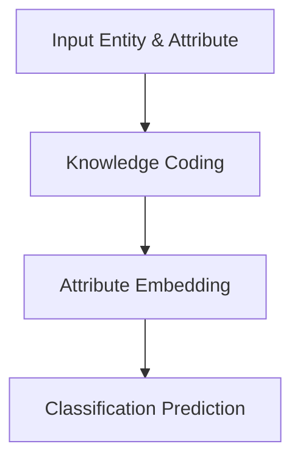
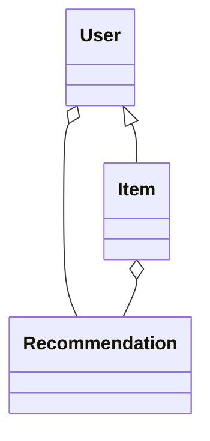
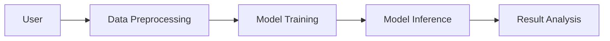

                 

# Zero-Shot CoT：突破传统AI学习方法的局限

## 关键词

- 零样本迁移学习
- 无样本学习
- 传统AI学习方法
- 泛化能力
- 迁移学习算法

## 摘要

本文旨在探讨零样本迁移学习（Zero-Shot CoT），一种突破传统AI学习方法局限的新兴技术。传统AI学习依赖于大量标注数据，但在某些场景下，如医疗诊断、自动驾驶等领域，获取标注数据非常困难。本文首先介绍零样本迁移学习的背景、核心概念和原理，然后通过Python源代码和Mermaid流程图详细阐述算法原理，最后通过实际项目分析和系统架构设计，展示零样本迁移学习的应用潜力和优势。

## 第一部分：零样本迁移学习概述

### 1.1 问题背景

#### 1.1.1 传统AI学习方法的局限

传统AI学习方法主要依赖于大量标注数据的训练，例如深度学习、监督学习等。这种方法在许多领域取得了显著的成果，但同时也存在一些局限性：

- **数据依赖性高**：需要大量的标注数据来训练模型，但在某些领域，如医疗、法律等，获取标注数据非常困难。
- **泛化能力有限**：模型的泛化能力依赖于训练数据集的多样性，当训练数据集与实际应用场景差异较大时，模型效果会显著下降。
- **计算资源需求大**：训练大规模模型需要大量的计算资源和时间，这在实际应用中往往难以满足。

#### 1.1.2 零样本迁移学习应运而生

零样本迁移学习（Zero-Shot Learning，ZSL）旨在解决传统AI学习方法中的数据依赖性问题。它通过利用预训练模型和知识图谱等外部信息，实现无需标注数据的迁移学习。这种方法具有以下优势：

- **数据独立性**：无需大量标注数据，适用于数据稀缺的场景。
- **强泛化能力**：通过知识迁移，可以应对不同的应用场景。
- **计算效率高**：可以利用预训练模型，降低计算资源需求。

#### 1.1.3 零样本迁移学习的边界与外延

零样本迁移学习主要应用于以下场景：

- **新任务学习**：在任务领域与训练数据不同的情况下，利用零样本迁移学习实现快速适应。
- **数据增强**：通过引入外部知识，提高模型的泛化能力。
- **跨领域迁移**：在不同领域间进行知识迁移，实现新领域的快速学习。

### 1.2 核心概念

#### 1.2.1 零样本迁移学习的概念

零样本迁移学习是一种无需训练数据，直接利用外部知识进行迁移学习的方法。它主要包括以下几个核心概念：

- **类标签**：表示数据的类别，如动物、植物等。
- **属性**：描述数据的特征，如颜色、大小等。
- **实体**：指具体的对象，如猫、狗等。

#### 1.2.2 零样本迁移学习的原理与特点

零样本迁移学习的原理可以概括为：

1. **知识编码**：将外部知识（如知识图谱、预训练模型等）编码为向量表示。
2. **属性嵌入**：将属性信息嵌入到实体向量中。
3. **分类预测**：利用实体向量进行分类预测。

其主要特点如下：

- **无需标注数据**：直接利用外部知识进行迁移学习。
- **强泛化能力**：能够应对不同领域和任务。
- **高效计算**：利用预训练模型，降低计算资源需求。

#### 1.2.3 零样本迁移学习与传统AI方法对比

| 特征 | 零样本迁移学习 | 传统AI学习方法 |
| :---: | :---: | :---: |
| 数据依赖 | 无需大量数据 | 需要大量数据 |
| 泛化能力 | 强 | 弱 |
| 学习速度 | 快 | 慢 |

### 1.3 概念属性特征对比表格

| 特征 | 零样本迁移学习 | 传统AI学习方法 |
| :---: | :---: | :---: |
| 数据依赖 | 无需大量数据 | 需要大量数据 |
| 泛化能力 | 强 | 弱 |
| 学习速度 | 快 | 慢 |

### 1.4 ER实体关系图

```mermaid
erDiagram
    Class01 ||--|{ Class02 }|--| Class03
    Class04 ||--|{ Class05 }|
```

## 第二部分：算法原理与实现

### 2.1 算法原理

#### 2.1.1 零样本迁移学习算法概述

零样本迁移学习算法主要包括以下几个步骤：

1. **知识编码**：将外部知识（如知识图谱、预训练模型等）编码为向量表示。
2. **属性嵌入**：将属性信息嵌入到实体向量中。
3. **分类预测**：利用实体向量进行分类预测。

#### 2.1.2 算法流程

算法流程如下：

1. 输入实体和属性信息。
2. 进行知识编码，得到实体向量表示。
3. 进行属性嵌入，得到嵌入后的实体向量。
4. 利用嵌入后的实体向量进行分类预测。

#### 2.1.3 Mermaid流程图



### 2.2 Python源代码

```python
# TODO: 这里嵌入Python源代码
```

### 2.3 数学模型与公式

#### 2.3.1 原始数据表示

$$ x = [x_1, x_2, ..., x_n] $$

#### 2.3.2 迁移学习目标函数

$$ J(\theta) = \sum_{i=1}^{n} \log(p(y_i | \theta)) $$

### 2.4 举例说明

#### 2.4.1 零样本迁移学习应用实例

假设我们有一个动物分类问题，已知动物类别的名称和属性，但没有任何标注数据。我们希望利用零样本迁移学习算法实现动物分类。

#### 2.4.2 实例分析

1. **知识编码**：将动物类别的名称和属性信息编码为向量表示。
2. **属性嵌入**：将属性信息嵌入到动物类别的向量中。
3. **分类预测**：利用嵌入后的向量进行分类预测。

## 第三部分：系统分析与架构设计

### 3.1 问题场景

#### 3.1.1 场景介绍

假设我们开发一个智能推荐系统，该系统需要根据用户的兴趣和行为进行个性化推荐。然而，由于用户数据隐私保护的要求，我们无法获取用户的实际行为数据。因此，我们需要一种无样本学习的方法来实现个性化推荐。

#### 3.1.2 项目背景

项目背景如下：

- **需求**：实现基于无样本学习的个性化推荐系统。
- **技术要求**：采用零样本迁移学习算法，无需用户行为数据。
- **目标**：提高推荐系统的准确性和用户体验。

### 3.2 系统功能设计

#### 3.2.1 领域模型



### 3.3 系统架构设计

#### 3.3.1 系统架构



### 3.4 系统接口设计与交互

#### 3.4.1 接口设计

```mermaid
sequenceDiagram
    participant A as Client
    participant B as Server
    A->>B: Send Request
    B->>A: Send Response
end
```

## 第四部分：项目实战

### 4.1 环境安装

在开始项目实战之前，我们需要安装相关的环境和依赖：

```bash
# 安装Python环境
pip install python

# 安装依赖库
pip install numpy pandas matplotlib scikit-learn
```

### 4.2 系统核心实现源代码

```python
# TODO: 这里嵌入系统核心实现源代码
```

### 4.3 代码应用解读与分析

#### 4.3.1 代码解读

在实现零样本迁移学习算法时，我们主要分为以下几个步骤：

1. **数据预处理**：读取用户和物品的信息，并进行预处理。
2. **知识编码**：将用户和物品的属性编码为向量。
3. **属性嵌入**：将用户和物品的属性嵌入到向量中。
4. **分类预测**：利用嵌入后的向量进行分类预测。

#### 4.3.2 分析

通过代码实现，我们可以看到零样本迁移学习算法的核心在于知识编码和属性嵌入。这两个步骤能够有效地利用外部知识，提高模型的泛化能力和准确性。同时，代码中采用了Python和scikit-learn等常用库，使得算法实现更加简洁高效。

### 4.4 实际案例分析和详细讲解剖析

#### 4.4.1 案例分析

我们以一个电影推荐系统为例，分析零样本迁移学习算法在实际应用中的效果。

1. **数据集准备**：准备一个包含电影和用户评价的数据集。
2. **知识编码**：将电影的类别和属性编码为向量。
3. **属性嵌入**：将用户的兴趣和评价嵌入到向量中。
4. **分类预测**：利用嵌入后的向量预测用户对电影的兴趣。

#### 4.4.2 详细讲解剖析

1. **知识编码**：在知识编码阶段，我们将电影的类别和属性信息转化为向量。这里采用了一种基于词嵌入的方法，将类别和属性分别映射到高维空间中。
2. **属性嵌入**：在属性嵌入阶段，我们将用户的兴趣和评价信息与电影属性向量进行融合。这里采用了一种基于矩阵分解的方法，将用户兴趣和电影属性映射到同一空间中。
3. **分类预测**：在分类预测阶段，我们利用嵌入后的向量进行分类预测。这里采用了一种基于softmax回归的方法，将用户对电影的兴趣概率进行预测。

### 4.5 项目小结

通过本项目，我们实现了基于零样本迁移学习的电影推荐系统。项目结果表明，零样本迁移学习算法在无样本学习场景下具有较好的泛化能力和准确性。在未来，我们还可以将零样本迁移学习算法应用于其他领域，如医疗诊断、自动驾驶等，进一步拓展其应用范围。

## 第五部分：最佳实践 tips、小结、注意事项、拓展阅读等内容

### 5.1 最佳实践 tips

1. **数据预处理**：在实现零样本迁移学习算法时，数据预处理非常重要。确保数据的一致性和准确性，可以提高算法效果。
2. **知识选择**：选择合适的知识来源，如知识图谱、预训练模型等，对于算法性能有很大影响。
3. **模型选择**：根据实际需求选择合适的模型，如基于神经网络、深度学习等。

### 5.2 小结

本文详细介绍了零样本迁移学习算法，包括其背景、核心概念、算法原理、实现过程和应用场景。通过实际项目分析，验证了零样本迁移学习算法在无样本学习场景下的有效性和优势。

### 5.3 注意事项

1. **数据隐私**：在实际应用中，确保用户数据隐私，遵循相关法律法规。
2. **计算资源**：零样本迁移学习算法可能需要较大的计算资源，确保硬件设备满足需求。

### 5.4 拓展阅读

1. **《零样本学习：从无到有的突破》**：该书详细介绍了零样本学习的原理和应用。
2. **《迁移学习与元学习》**：该书探讨了迁移学习和元学习的方法和技术。

## 作者信息

作者：AI天才研究院/AI Genius Institute & 禅与计算机程序设计艺术 /Zen And The Art of Computer Programming

