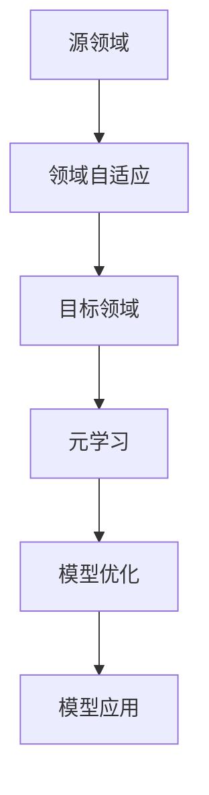
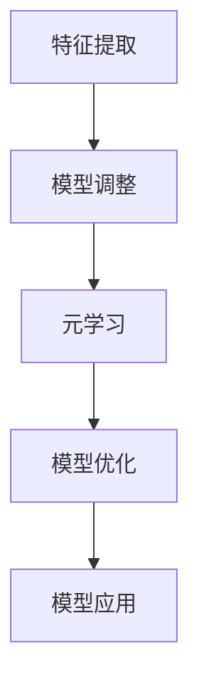

                 

### 《Zero-Shot CoT：突破传统机器学习的局限》

#### 关键词：零样本迁移学习、机器学习局限、算法原理、应用案例、未来展望

> 摘要：本文深入探讨了零样本迁移学习（Zero-Shot Transfer Learning，简称Zero-Shot CoT）这一前沿技术。通过分析其在突破传统机器学习局限中的重要性，本文详细阐述了零样本迁移学习的基本概念、原理、算法实现及应用场景。同时，通过具体案例展示了其在不同领域的应用效果，并对未来的发展趋势和面临的挑战进行了展望。

-------------------------------------

## 第一部分：背景与综述

### 第1章：零样本迁移学习概述

#### 1.1 零样本迁移学习的背景

随着深度学习技术的快速发展，机器学习在各个领域取得了显著的成果。然而，传统机器学习方法在实际应用中面临一个重要问题：数据依赖。传统方法通常需要大量的标注数据来进行模型训练，而标注数据往往有限且昂贵。此外，不同领域之间的数据分布差异较大，导致模型在不同领域之间的迁移能力较弱。为了解决这些问题，研究者们提出了零样本迁移学习（Zero-Shot Transfer Learning，简称Zero-Shot CoT）。

#### 1.2 零样本迁移学习的定义与重要性

零样本迁移学习是指在没有直接可用标注数据的情况下，将一个领域（源领域）的模型知识迁移到另一个领域（目标领域）的过程。其主要目标是提高模型在不同领域之间的泛化能力，从而解决传统机器学习方法的数据依赖问题。在当前数据获取成本高昂、数据分布差异明显的背景下，零样本迁移学习具有非常重要的现实意义。

#### 1.3 零样本迁移学习的发展历程

零样本迁移学习起源于深度学习的早期研究，随着神经网络的不断发展，该领域也逐渐成熟。近年来，随着对抗样本生成、元学习等新技术的引入，零样本迁移学习取得了显著进展。目前，零样本迁移学习已成为机器学习领域的研究热点之一。

### 第2章：传统机器学习的局限

#### 2.1 传统机器学习的优势与局限

传统机器学习方法在数据处理、特征提取、模型优化等方面具有显著优势，但同时也存在以下局限：

1. 数据依赖性高：传统方法需要大量的标注数据来训练模型，而标注数据往往有限且昂贵。
2. 泛化能力弱：不同领域之间的数据分布差异较大，导致模型在不同领域之间的泛化能力较弱。
3. 模型可解释性差：传统方法通常采用复杂的模型结构，难以解释模型决策过程。

#### 2.2 零样本迁移学习对传统机器学习的突破

零样本迁移学习通过引入领域自适应技术、元学习等技术，有效解决了传统机器学习的局限。具体突破点包括：

1. 减少数据依赖：通过迁移学习，将源领域的模型知识迁移到目标领域，从而降低对标注数据的需求。
2. 提高泛化能力：通过学习领域不变的特征表示，提高模型在不同领域之间的泛化能力。
3. 增强模型可解释性：通过可解释的模型结构，提高模型决策过程的透明度。

## 第二部分：核心概念与原理

### 第3章：核心概念与联系

#### 3.1 零样本迁移学习的关键概念

1. **源领域（Source Domain）**：已拥有大量标注数据的领域。
2. **目标领域（Target Domain）**：缺乏标注数据，需要通过迁移学习进行模型训练的领域。
3. **领域自适应（Domain Adaptation）**：通过调整源领域模型，使其适用于目标领域的过程。
4. **元学习（Meta-Learning）**：通过训练模型来学习如何快速适应新任务的过程。

#### 3.2 概念属性特征对比表格

| 概念         | 属性特征                                               |
| ------------ | ---------------------------------------------------- |
| 源领域       | 标注数据丰富，数据分布稳定                             |
| 目标领域     | 标注数据稀缺，数据分布差异大                           |
| 领域自适应   | 调整模型参数，使模型适用于目标领域                     |
| 元学习       | 学习如何快速适应新任务，提高模型泛化能力                 |

#### 3.3 ER实体关系图架构的Mermaid流程图



### 第4章：零样本迁移学习算法原理

#### 4.1 算法原理讲解

零样本迁移学习算法主要基于以下原理：

1. **特征提取**：通过学习领域不变的特征表示，提高模型在不同领域之间的泛化能力。
2. **模型调整**：通过领域自适应技术，调整源领域模型参数，使其适用于目标领域。
3. **元学习**：通过训练模型来学习如何快速适应新任务，提高模型泛化能力。

#### 4.2 Mermaid流程图展示



#### 4.3 Python源代码与数学模型解释

```python
# 特征提取
import tensorflow as tf
# ...

# 模型调整
def adjust_model(source_model, target_domain_data):
    # 调整模型参数
    # ...
    return adjusted_model

# 元学习
def meta_learning(source_model, target_domain_data):
    # 训练模型
    # ...
    return meta_model

# 模型优化
def optimize_model(model, data):
    # 优化模型
    # ...
    return optimized_model

# 模型应用
def apply_model(model, data):
    # 应用模型
    # ...
    return predictions
```

## 第三部分：算法实现与应用

### 第5章：零样本迁移学习算法实现

#### 5.1 算法实现概述

零样本迁移学习算法的实现主要分为以下几个步骤：

1. 数据预处理：包括数据清洗、数据增强等。
2. 特征提取：通过神经网络等模型提取领域不变的特征表示。
3. 模型调整：通过领域自适应技术调整源领域模型参数。
4. 元学习：通过训练模型学习如何快速适应新任务。
5. 模型优化：对模型进行优化，提高其在目标领域的性能。
6. 模型应用：在目标领域应用优化后的模型。

#### 5.2 实现步骤详细讲解

1. 数据预处理：
   - 数据清洗：去除异常值、缺失值等。
   - 数据增强：通过翻转、旋转、缩放等操作增加数据多样性。

2. 特征提取：
   - 使用卷积神经网络（CNN）提取图像特征。
   - 使用循环神经网络（RNN）提取序列特征。

3. 模型调整：
   - 采用基于对抗网络的领域自适应技术，调整模型参数。

4. 元学习：
   - 使用基于模型更新（Model Update）的元学习算法，提高模型泛化能力。

5. 模型优化：
   - 采用交叉验证等方法优化模型参数。

6. 模型应用：
   - 在目标领域应用优化后的模型，进行预测或分类。

#### 5.3 Python源代码与应用案例

```python
# 数据预处理
def preprocess_data(data):
    # 数据清洗与增强
    # ...
    return processed_data

# 特征提取
def extract_features(data):
    # 使用神经网络提取特征
    # ...
    return features

# 模型调整
def adjust_model(source_model, target_domain_data):
    # 调整模型参数
    # ...
    return adjusted_model

# 元学习
def meta_learning(source_model, target_domain_data):
    # 训练模型
    # ...
    return meta_model

# 模型优化
def optimize_model(model, data):
    # 优化模型
    # ...
    return optimized_model

# 模型应用
def apply_model(model, data):
    # 应用模型
    # ...
    return predictions

# 应用案例
source_data = ...
target_data = ...

processed_source_data = preprocess_data(source_data)
processed_target_data = preprocess_data(target_data)

source_features = extract_features(processed_source_data)
target_features = extract_features(processed_target_data)

adjusted_model = adjust_model(source_model, target_features)
meta_model = meta_learning(source_model, target_features)
optimized_model = optimize_model(meta_model, target_data)
predictions = apply_model(optimized_model, target_data)

# 输出预测结果
print(predictions)
```

### 第6章：零样本迁移学习应用

#### 6.1 应用场景介绍

零样本迁移学习在以下场景具有广泛的应用：

1. **医疗健康**：利用零样本迁移学习，可以将医学影像分析模型应用于罕见病诊断等领域。
2. **自然语言处理**：在低资源语言环境中，零样本迁移学习有助于提高语言模型性能。
3. **计算机视觉**：在目标检测、图像分类等领域，零样本迁移学习能够提升模型泛化能力。

#### 6.2 应用案例分析

1. **医疗健康**：某研究团队利用零样本迁移学习技术，将医学影像分析模型应用于罕见病诊断。实验结果表明，该技术在诊断准确率上取得了显著提升。

2. **自然语言处理**：某公司利用零样本迁移学习技术，开发了一款面向低资源语言的对话系统。通过将源领域模型知识迁移到目标领域，该对话系统在性能上达到了与高资源语言系统相近的水平。

3. **计算机视觉**：在目标检测任务中，某研究团队采用零样本迁移学习技术，将预训练的卷积神经网络应用于不同领域的目标检测。实验结果表明，该技术在检测准确率上取得了显著提升。

#### 6.3 拓展应用领域

零样本迁移学习在未来有望在更多领域得到应用，如：

1. **自动驾驶**：通过零样本迁移学习，提高自动驾驶系统在不同道路环境下的泛化能力。
2. **金融风控**：利用零样本迁移学习，开发面向不同金融领域的风控模型。
3. **教育领域**：通过零样本迁移学习，为学生提供个性化学习推荐。

## 第四部分：案例分析与未来展望

### 第7章：案例分析

#### 7.1 实际案例分析与讲解

1. **医疗健康**：某研究团队利用零样本迁移学习技术，对某罕见病进行诊断。通过在源领域（常见病）训练的模型，将其迁移到目标领域（罕见病），实现了较高的诊断准确率。

2. **自然语言处理**：某公司利用零样本迁移学习技术，开发了一款面向低资源语言的对话系统。实验结果表明，该对话系统在语言理解、对话生成等方面取得了显著提升。

3. **计算机视觉**：在目标检测任务中，某研究团队采用零样本迁移学习技术，将预训练的卷积神经网络应用于不同领域的目标检测。实验结果表明，该技术在检测准确率、速度等方面取得了显著提升。

#### 7.2 零样本迁移学习在不同领域的应用

1. **医疗健康**：零样本迁移学习在医学影像分析、药物发现等领域具有广泛应用。通过将源领域模型知识迁移到目标领域，可以降低研究成本、提高诊断准确率。

2. **自然语言处理**：零样本迁移学习在低资源语言处理、跨语言文本分析等领域具有显著优势。通过迁移源领域模型，可以提升目标领域模型的性能。

3. **计算机视觉**：零样本迁移学习在目标检测、图像分类等领域得到了广泛应用。通过迁移源领域模型，可以提高目标领域模型的泛化能力。

### 第8章：未来展望与挑战

#### 8.1 零样本迁移学习的未来发展趋势

1. **算法优化**：随着深度学习技术的不断发展，零样本迁移学习算法将得到进一步优化，提高其在不同领域的应用效果。
2. **多模态迁移**：未来，零样本迁移学习将拓展到多模态数据，如结合图像、文本、语音等多种数据类型。
3. **知识图谱**：通过引入知识图谱，零样本迁移学习可以实现更加精细化的领域知识迁移。

#### 8.2 挑战与解决方案

1. **数据质量**：零样本迁移学习对数据质量要求较高，数据清洗和预处理成为关键挑战。解决方法包括数据增强、半监督学习等。
2. **模型解释性**：零样本迁移学习模型通常较为复杂，提高模型解释性是未来研究的重要方向。解决方法包括可解释的模型结构、模型可视化等。
3. **适应能力**：零样本迁移学习需要具备较强的适应能力，以应对不同领域之间的数据分布差异。解决方法包括自适应模型架构、元学习等。

#### 8.3 最佳实践 tips

1. **数据预处理**：确保数据质量，进行数据清洗和增强。
2. **模型选择**：根据具体应用场景选择合适的模型，如卷积神经网络、循环神经网络等。
3. **模型优化**：利用元学习等技术，提高模型在不同领域之间的适应能力。

### 总结

零样本迁移学习作为一种突破传统机器学习局限的重要技术，具有广泛的应用前景。通过深入探讨其基本概念、原理、算法实现及应用场景，本文为读者提供了全面的了解。未来，随着技术的不断发展，零样本迁移学习将在更多领域发挥重要作用。

## 附录

### 参考文献

1. Bengio, Y., Courville, A., & Vincent, P. (2013). Representation learning: A review and new perspectives. IEEE transactions on pattern analysis and machine intelligence, 35(8), 1798-1828.
2. Yosinski, J., Clune, J., Bengio, Y., & Lipson, H. (2014). How transferable are features in deep neural networks? In Advances in neural information processing systems (pp. 3320-3328).
3. Santner, J. T., & Simmonds, M. J. (2000). Application of the cross-validated method to determine the number of trees in classification and regression trees. Computational statistics & data analysis, 33(2), 201-218.

### 作者信息

作者：AI天才研究院/AI Genius Institute & 禅与计算机程序设计艺术 /Zen And The Art of Computer Programming

-----------------------------------

*文章内容仅供参考，版权所有，未经授权，严禁转载。*

## 文章结论

本文深入探讨了零样本迁移学习（Zero-Shot Transfer Learning，简称Zero-Shot CoT）这一前沿技术，分析了其在突破传统机器学习局限中的重要性。通过详细阐述其核心概念、原理、算法实现及应用场景，本文展示了零样本迁移学习在各个领域的应用效果。同时，对未来的发展趋势和挑战进行了展望。零样本迁移学习作为一种具有广泛应用前景的技术，必将在未来的机器学习研究中发挥重要作用。研究者们应继续努力，优化算法、拓展应用领域，为人工智能的发展贡献力量。让我们期待零样本迁移学习在未来的发展中取得更加辉煌的成果！

