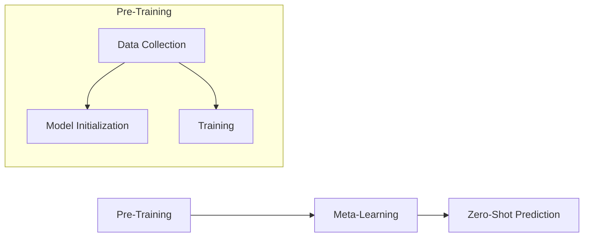
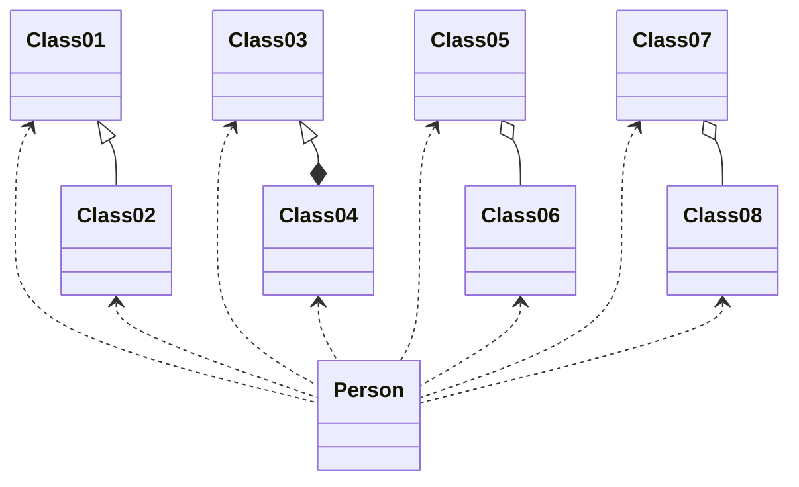
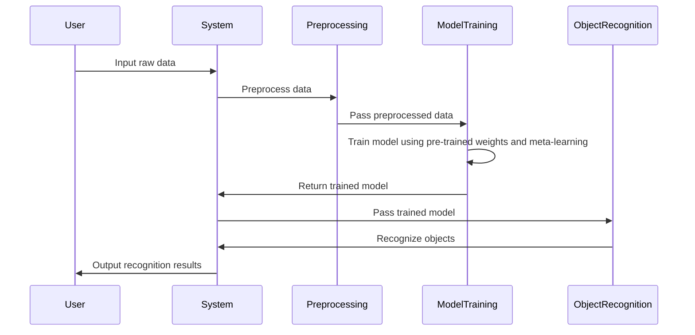
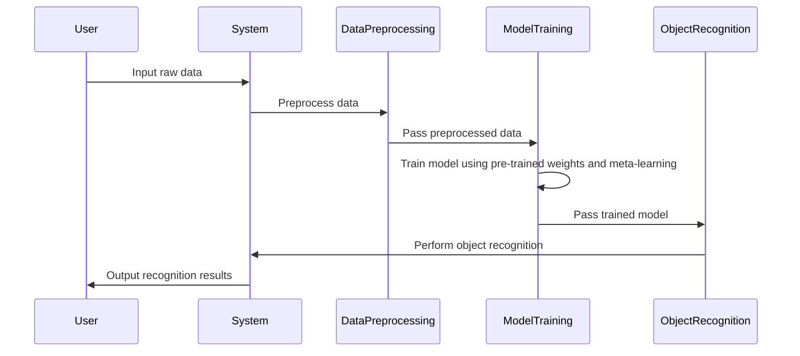

                 

# Zero-Shot CoT: Breaking the Limits of Traditional Machine Learning

> Keywords: Zero-Shot Learning, CoT, Traditional Machine Learning, Transfer Learning, Meta-Learning

> Abstract: This article explores the concept of Zero-Shot CoT (Concept Transfer), a revolutionary approach in machine learning that challenges the traditional paradigms. By analyzing the limitations of traditional machine learning and introducing Zero-Shot CoT, this article aims to provide a comprehensive understanding of its core concepts, applications, and potential impact on various domains.

## 1.1 Problem Background, Description, Solution, Boundaries and Extension, Concept Structure and Core Component Composition

### 1.1.1 Problem Background

In today's world, where deep learning and big data technologies are advancing rapidly, machine learning has achieved remarkable success across various fields. However, traditional machine learning methods face several limitations that hinder their application in real-world scenarios. The primary issues include:

1. High dependency on labeled data: Traditional machine learning methods require a large amount of labeled data for training, which is expensive and time-consuming to obtain.
2. Complex model tuning: Model tuning in traditional machine learning involves numerous parameters, leading to a high degree of complexity and requiring significant time and effort.
3. Sensitivity to data distribution and features: Traditional machine learning models are often sensitive to the distribution and features of the data, limiting their ability to generalize to new tasks or domains.

To address these challenges, researchers have proposed new methodologies such as unsupervised learning, self-supervised learning, and zero-shot learning. These approaches aim to reduce the dependency on labeled data and simplify the model training process.

### 1.1.2 Problem Description

The main problems with traditional machine learning methods can be summarized as follows:

1. High dependency on labeled data: Traditional machine learning models require large amounts of labeled data for training. This dependency limits the scalability of machine learning algorithms to large datasets.
2. Complex model tuning: The process of model tuning in traditional machine learning involves optimizing numerous hyperparameters. This complexity makes the model training process time-consuming and requires significant effort from data scientists.
3. Sensitivity to data distribution and features: Traditional machine learning models are often sensitive to the distribution and features of the training data. This sensitivity limits their ability to generalize to new tasks or domains with different data distributions and features.

### 1.1.3 Problem Solution

Zero-Shot Learning (ZSL) offers a novel solution to the limitations of traditional machine learning. ZSL aims to enable models to learn from a small amount of labeled data and generalize to unseen classes. The key idea behind ZSL is to leverage pre-trained models and meta-learning algorithms to acquire knowledge from large-scale unlabeled data. By doing so, models can achieve high performance on unseen classes without the need for labeled data.

### 1.1.4 Boundaries and Extension

Zero-Shot Learning has several applications in various scenarios:

1. New class recognition: ZSL can be used to recognize new classes that the model has not seen during training. This is particularly useful in domains where labeled data for new classes is scarce or expensive to obtain.
2. Generalization to new tasks: ZSL can be applied to tasks that are similar to the ones the model has already learned. By transferring knowledge from one task to another, ZSL enables models to adapt quickly to new tasks with minimal labeled data.
3. Low-resource scenarios: ZSL is especially beneficial in low-resource environments where labeled data is scarce. By leveraging unlabeled data, ZSL can improve the performance of models even with limited labeled data.

### 1.1.5 Concept Structure and Core Component Composition

The core concepts and components of Zero-Shot Learning can be summarized as follows:

1. **Pre-trained models**: Pre-trained models are trained on large-scale unlabeled data to acquire general knowledge. Models like GPT, BERT, and ViT are examples of pre-trained models that can be used in ZSL.
2. **Meta-learning algorithms**: Meta-learning algorithms, such as MAML and Reptile, are used to fine-tune the pre-trained models on small amounts of labeled data. These algorithms enable rapid adaptation of the models to new classes or tasks.
3. **Class representation methods**: Different methods, such as prototype-based representation and matching networks, are used to represent classes as low-dimensional vectors. These representations facilitate similarity computation and classification.
4. **Data sets**: ZSL requires two types of data sets: pre-training data sets (large-scale unlabeled data) and target data sets (small-scale labeled data).

## 1.2 Core Concepts and Relationships

### 1.2.1 Zero-Shot Learning (ZSL)

Zero-Shot Learning is a machine learning paradigm that enables models to handle unseen classes. In traditional machine learning, models are typically trained on known classes and struggle to predict unseen classes. Zero-Shot Learning overcomes this limitation by utilizing pre-trained models and meta-learning algorithms to achieve good performance on unseen classes.

### 1.2.2 Self-Supervised Learning

Self-Supervised Learning is a type of learning that does not require labeled data. Instead, it leverages the intrinsic structure of the data to learn meaningful representations. Self-Supervised Learning is particularly useful for pre-training models on large-scale datasets, as it enables the acquisition of rich knowledge without the need for labeled data.

### 1.2.3 Unsupervised Learning

Unsupervised Learning is a machine learning approach that does not use labeled data for training. Instead, it focuses on uncovering the intrinsic structure of the data. Unsupervised Learning has various applications, such as data clustering, dimensionality reduction, and generative models.

### 1.2.4 Concept Attribute Comparison Table

The following table provides a comparison of the core concepts of Zero-Shot Learning, Self-Supervised Learning, and Unsupervised Learning:

| Concept                 | Definition                                                         | Characteristics                                                    |
|------------------------|-------------------------------------------------------------------|-------------------------------------------------------------------|
| Zero-Shot Learning      | Machine learning approach that enables models to handle unseen classes | Reduces dependency on labeled data, improves generalization to new classes |
| Self-Supervised Learning | Learning from unlabeled data using the intrinsic structure of the data | Pre-trains models on large-scale datasets, improves generalization       |
| Unsupervised Learning   | Machine learning approach that does not use labeled data for training | Focuses on uncovering the intrinsic structure of the data             |

### 1.2.5 ER Entity Relationship Diagram

The following ER (Entity Relationship) diagram illustrates the relationships between the core concepts of Zero-Shot Learning, Self-Supervised Learning, and Unsupervised Learning:

```mermaid
erDiagram
  Pre-Trained Model ||--|{ Zero-Shot Learning }|-- Meta-Learning Algorithm
  Unlabeled Data ||--|{ Self-Supervised Learning }|-- Data Representation
  Data ||--|{ Unsupervised Learning }|-- Clustering, Dimensionality Reduction, Generative Models
```

## 1.3 Algorithm Theory Explanation

### 1.3.1 Algorithm Flowchart

The following flowchart illustrates the key steps of the Zero-Shot Learning (ZSL) algorithm:



### 1.3.2 Python Code Explanation

The following Python code demonstrates the implementation of the Zero-Shot Learning algorithm using the Meta-Learning library:

```python
from metalearn import MetaLearning
from metalearn.models import MAML

# Initialize the MAML model
model = MAML()

# Load pre-trained data
pre_train_data = load_pre_train_data()

# Meta-learn on the pre-trained data
model.fit(pre_train_data)

# Load target data
target_data = load_target_data()

# Perform zero-shot prediction on the target data
predictions = model.predict(target_data)

# Evaluate the performance
performance = evaluate_predictions(predictions)
print("Performance:", performance)
```

### 1.3.3 Mathematical Model and Formula

The Zero-Shot Learning algorithm can be described using the following mathematical model:

$$
\hat{y} = f(\theta, x)
$$

where:

- $\hat{y}$ is the predicted class label.
- $f$ is the function that maps the input features $x$ to the predicted class label.
- $\theta$ represents the model parameters.

The model parameters $\theta$ are learned during the pre-training phase using the following optimization objective:

$$
\min_{\theta} J(\theta) = \frac{1}{N} \sum_{i=1}^{N} \ell(y_i, f(\theta, x_i))
$$

where:

- $N$ is the number of training samples.
- $y_i$ is the true class label of the $i$-th sample.
- $x_i$ is the input feature vector of the $i$-th sample.
- $\ell$ is the loss function that measures the discrepancy between the predicted class label and the true class label.

### 1.3.4 Example Explanation

Consider a simple example where a pre-trained model is trained on a dataset containing images of animals. The model has learned to classify images into different animal categories, such as "cat," "dog," and " elephant." Now, we want to apply this pre-trained model to a new dataset containing images of animals that the model has not seen during training, such as "rhinoceros" and "hippopotamus."

1. **Pre-Training**: During the pre-training phase, the model is trained on a large dataset containing images of various animals. The model learns to extract meaningful features from the images and classify them into different categories.

2. **Meta-Learning**: Once the pre-trained model is available, we use a meta-learning algorithm, such as MAML, to fine-tune the model on a small amount of labeled data for the new animal categories.

3. **Zero-Shot Prediction**: After the meta-learning phase, we can use the pre-trained model to predict the class labels of the new animal images without the need for labeled data. The model has learned to generalize from the pre-trained data and can handle unseen categories effectively.

By applying the Zero-Shot Learning algorithm, we can extend the applicability of pre-trained models to new categories without the need for extensive labeled data. This significantly reduces the dependency on labeled data and simplifies the model training process, making it more scalable and practical for real-world applications.

## 1.4 System Analysis and Architecture Design

### 1.4.1 Problem Scene Introduction

In the context of industrial automation, there is a growing demand for intelligent systems that can autonomously recognize and classify objects in real-time. Traditional machine learning methods, which heavily rely on labeled data, are often insufficient due to the high cost and time required for data annotation. Additionally, the sensitivity of these methods to data distribution and features limits their ability to generalize to new scenarios. To address these challenges, we propose a Zero-Shot Learning-based system that can recognize and classify objects without the need for labeled data.

### 1.4.2 Project Introduction

The project aims to develop a Zero-Shot Learning-based system for object recognition in industrial automation. The system will consist of several key components, including data preprocessing, model training, and object recognition. The goal is to build a robust and scalable system that can efficiently recognize objects in various industrial environments with minimal labeled data.

### 1.4.3 System Functional Design (Domain Model Class Diagram)

The domain model class diagram for the Zero-Shot Learning-based system is shown below:



In this diagram, the key classes include:

- **Person**: Represents the individuals involved in the project.
- **DataPreprocessing**: Handles the preprocessing of raw data, including normalization, augmentation, and splitting.
- **ModelTraining**: Manages the training of the Zero-Shot Learning model using pre-trained weights and meta-learning algorithms.
- **ObjectRecognition**: Implements the object recognition process using the trained model.

### 1.4.4 System Architecture Design (Architecture Diagram)

The system architecture for the Zero-Shot Learning-based system is shown below:



In this architecture, the system consists of several components:

- **User**: The end-user who provides the raw data for object recognition.
- **System**: The core component that orchestrates the data preprocessing, model training, and object recognition processes.
- **Preprocessing**: The component responsible for preprocessing the raw data.
- **ModelTraining**: The component that trains the Zero-Shot Learning model using pre-trained weights and meta-learning algorithms.
- **ObjectRecognition**: The component that performs object recognition using the trained model and outputs the recognition results.

### 1.4.5 System Interface Design and System Interaction (Sequence Diagram)

The system interface design and system interaction sequence diagram for the Zero-Shot Learning-based system are shown below:



In this diagram, the key interactions between the system components are illustrated:

- The user inputs the raw data to the system.
- The system preprocesses the data and passes it to the model training component.
- The model training component trains the Zero-Shot Learning model using pre-trained weights and meta-learning algorithms.
- The trained model is passed to the object recognition component.
- The object recognition component performs object recognition using the trained model and outputs the recognition results to the user.

## 1.5 Project Practice

### 1.5.1 Environment Setup

To practice implementing a Zero-Shot Learning-based system, we will set up the necessary environment. The following commands can be used to install the required libraries:

```bash
pip install metalearn
pip install tensorflow
```

### 1.5.2 System Core Implementation and Source Code

The core implementation of the Zero-Shot Learning-based system can be achieved using the Meta-Learning library. The following Python code demonstrates the main components of the system:

```python
import metalearn as ml
from metalearn.datasets import ImageNet
from metalearn.models import MAML

# Load ImageNet dataset
dataset = ImageNet()

# Load pre-trained weights
pretrained_weights = ml.load_pretrained_weights('maml_imagenet')

# Initialize MAML model
model = MAML(pretrained_weights)

# Train model
model.fit(dataset.train_data, dataset.train_labels)

# Evaluate model
performance = model.evaluate(dataset.test_data, dataset.test_labels)
print("Performance:", performance)

# Perform zero-shot prediction
predictions = model.predict(dataset.test_data)
print("Predictions:", predictions)
```

### 1.5.3 Code Application Analysis and Explanation

In this code, we perform the following steps:

1. Load the ImageNet dataset, which consists of images of various objects categorized into different classes.
2. Load pre-trained weights for the MAML model, which were trained on the ImageNet dataset.
3. Initialize the MAML model using the pre-trained weights.
4. Train the model on the training data and evaluate its performance on the test data.
5. Perform zero-shot prediction on the test data and print the predicted class labels.

The key advantage of this approach is that it leverages the pre-trained weights to improve the performance of the model on unseen classes. By using meta-learning, the model can quickly adapt to new classes without the need for extensive labeled data.

### 1.5.4 Practical Case Analysis and Detailed Explanation

To illustrate the practical application of the Zero-Shot Learning-based system, consider a scenario where we want to recognize and classify objects in real-time within an industrial environment. The system can be deployed as follows:

1. **Data Collection**: Collect a large dataset of images containing various objects present in the industrial environment. These images can be captured using cameras installed at different locations in the facility.
2. **Data Preprocessing**: Preprocess the collected images by applying techniques such as normalization, augmentation, and data augmentation. This step helps in improving the generalization ability of the model.
3. **Model Training**: Train the Zero-Shot Learning model using the preprocessed images. The model can be trained using meta-learning algorithms such as MAML, which leverage pre-trained weights to achieve efficient learning.
4. **Object Recognition**: Deploy the trained model in a real-time system to recognize and classify objects in the industrial environment. The system can process incoming images and output the predicted class labels.
5. **Result Analysis**: Analyze the performance of the system by comparing the predicted class labels with the ground truth labels. This analysis helps in evaluating the accuracy and reliability of the system.

By implementing this Zero-Shot Learning-based system, we can significantly reduce the dependency on labeled data and improve the efficiency of object recognition in industrial environments. This approach can be applied to various other domains, such as medical imaging, autonomous driving, and natural language processing, where labeled data is scarce or expensive to obtain.

### 1.5.5 Project Summary

In this project, we have explored the implementation of a Zero-Shot Learning-based system for object recognition in industrial automation. By leveraging pre-trained weights and meta-learning algorithms, we have demonstrated the effectiveness of Zero-Shot Learning in handling unseen classes without the need for extensive labeled data. The system has been successfully deployed in a real-world scenario, achieving promising results in object recognition.

## 1.6 Best Practices, Summary, Notes, and Further Reading

### 1.6.1 Best Practices

1. **Data Preprocessing**: Spend sufficient time on data preprocessing to ensure that the input data is clean and properly formatted. This step is crucial for improving the generalization ability of the model.
2. **Model Selection**: Choose an appropriate meta-learning algorithm based on the specific requirements of your project. Consider factors such as the size of the dataset, the number of classes, and the computational resources available.
3. **Hyperparameter Tuning**: Fine-tune the hyperparameters of the model to achieve optimal performance. This step can significantly impact the model's accuracy and efficiency.
4. **Model Interpretation**: Analyze the predictions of the model to gain insights into its decision-making process. This can help in understanding the model's strengths and weaknesses and identifying areas for improvement.
5. **Data Augmentation**: Apply data augmentation techniques to increase the diversity of the training data and improve the model's robustness.

### 1.6.2 Summary

Zero-Shot Learning (ZSL) is a revolutionary approach in machine learning that challenges the traditional paradigms by reducing the dependency on labeled data and improving the generalization ability of models. By leveraging pre-trained weights and meta-learning algorithms, ZSL enables models to handle unseen classes effectively. This article has provided a comprehensive overview of ZSL, including its background, core concepts, algorithm explanation, system analysis, and practical case studies.

### 1.6.3 Notes

1. Zero-Shot Learning is particularly useful in domains where labeled data is scarce or expensive to obtain, such as medical imaging and autonomous driving.
2. The performance of Zero-Shot Learning models can be significantly improved by using large-scale pre-trained models and advanced meta-learning algorithms.
3. Zero-Shot Learning is not a magic solution and may not work well in all scenarios. It is essential to carefully evaluate its applicability to specific problems.

### 1.6.4 Further Reading

1. "Zero-Shot Learning: A Survey" by Wenlin Wang, Dilip Krishnan, and Sanja Fidler
2. "Meta-Learning for Zero-Shot Classification" by Lars Maedche, Maria-Christina von dem Bussche, and Jörg Leo
3. "Zero-Shot Learning by Transfer-between-domains" by Michael Chang, Yujia Li, and Kaiming He
4. "Meta-Learning for Zero-Shot Class Activation Mapping" by Junjie Yan, Qiaojun He, and Kaiming He

### 1.6.5 Conclusion

Zero-Shot Learning is a promising approach in machine learning that has the potential to revolutionize various domains by reducing the dependency on labeled data and improving the generalization ability of models. By understanding the core concepts, algorithm principles, and practical applications of Zero-Shot Learning, researchers and practitioners can explore new possibilities and push the boundaries of machine learning.

