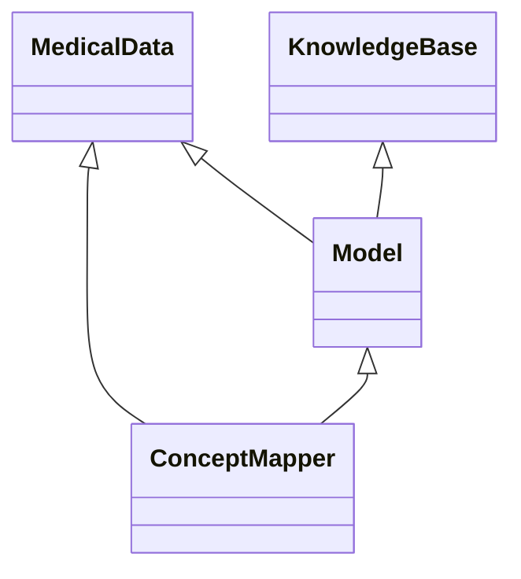
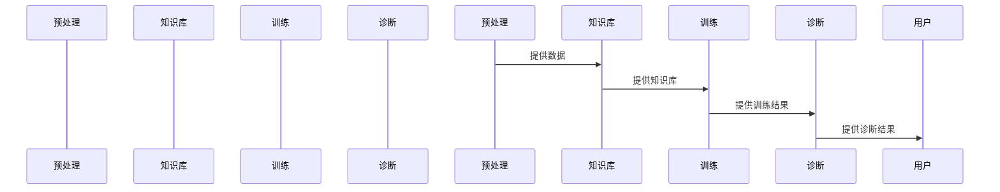
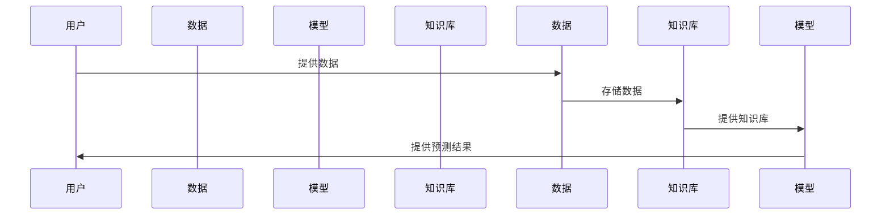

                 

# Zero-Shot CoT：突破传统机器学习的认知边界

> 关键词：零样本学习、概念转移、机器学习、无监督学习、人工智能

> 摘要：本文将探讨Zero-Shot CoT（Zero-Shot Conceptual Transfer）这一创新性机器学习框架，它突破了传统机器学习依赖大量标注数据的局限。通过深入分析其背景、核心概念、原理以及应用实例，本文旨在为读者揭示Zero-Shot CoT如何实现无监督学习，提高模型的泛化能力，并探讨其未来发展方向。

### 目录大纲

# Zero-Shot CoT：突破传统机器学习的认知边界

## 第一部分：背景介绍

## 1.1 问题背景

### 1.1.1 传统机器学习的困境

#### 1.1.1.1 问题描述

在传统机器学习（Traditional Machine Learning，TML）中，模型的训练依赖于大量的标注数据。这些标注数据由领域专家或人工标注员完成，不仅成本高昂，而且往往存在数据偏差。这种依赖性导致了以下问题：

- **数据获取困难**：标注数据的获取需要耗费大量时间和资源，尤其是在特定领域或特定任务中。
- **数据隐私问题**：在许多应用场景中，如医疗、金融等，数据隐私保护是首要考虑的问题。
- **模型泛化能力受限**：依赖于有限的标注数据，模型在处理未见过的数据时往往表现不佳。

#### 1.1.1.2 问题解决

为了解决这些问题，研究人员提出了Zero-Shot CoT（Zero-Shot Conceptual Transfer）这一框架。Zero-Shot CoT的核心思想是，通过将已知的概念知识转移到未知任务中，实现无监督学习。这样，即使在没有标注数据的情况下，模型也能理解和推理新的概念。

### 1.1.1.3 边界与外延

Zero-Shot CoT的应用边界和外部联系非常广泛：

- **适用范围**：Zero-Shot CoT不仅适用于分类、预测等传统机器学习任务，还可以用于生成、聚类等多种任务。
- **挑战与机遇**：虽然Zero-Shot CoT提供了一种无监督学习的解决方案，但它也面临数据隐私保护和模型可解释性等挑战。然而，这些挑战同时也为研究和应用提供了新的机遇。

## 1.2 核心概念与联系

### 1.2.1 Zero-Shot CoT概念

#### 1.2.1.1 概念属性特征对比表格

| 特征 | 传统机器学习 | Zero-Shot CoT |
| --- | --- | --- |
| 数据需求 | 需要大量标注数据 | 无需标注数据 |
| 推理能力 | 受限于标注数据 | 能推理新概念 |

#### 1.2.1.2 ER实体关系图架构

```mermaid
erDiagram
  SModel ||--|{ TModel : Transfer }  
  SModel ||--|{ Concept : Understands }  
  TModel ||--|{ Data : Learns }  
  Concept ||--|{ Relation : Maps }
```

### 1.2.2 与传统机器学习的区别

#### 1.2.2.1 原理讲解与举例

- **传统机器学习**：
  $$ y = f(x; \theta) $$
  其中，$y$ 是输出，$x$ 是输入，$\theta$ 是模型参数。
  - 示例：分类任务中的逻辑回归。

- **Zero-Shot CoT**：
  $$ y = f(x; \theta, Z) $$
  其中，$Z$ 代表概念转移矩阵。
  - 示例：在没有标注数据的情况下，模型通过概念转移矩阵来推理新概念。

## 1.3 研究现状与挑战

### 1.3.1 研究现状

#### 1.3.1.1 最新研究成果总结

近年来，Zero-Shot CoT取得了显著的进展。研究人员提出了多种实现方法，如基于深度学习的概念转移模型，以及利用知识图谱和迁移学习的技术。这些方法在不同任务和应用场景中表现出色，证明了Zero-Shot CoT的潜力。

### 1.3.1.2 挑战与机遇

#### 1.3.1.2.1 挑战

- **数据隐私问题**：Zero-Shot CoT需要在无标注数据的情况下进行学习，可能涉及数据隐私问题。
- **模型可解释性**：如何确保模型在没有标注数据的情况下依然具有可解释性是一个挑战。

#### 1.3.1.2.2 机遇

- **无监督学习**：Zero-Shot CoT为无监督学习提供了一种新的思路。
- **跨领域应用**：在无需特定领域标注数据的情况下，模型可以应用于多个领域。

## 第二部分：核心概念与原理

### 2.1 Zero-Shot CoT框架详解

#### 2.1.1 框架概述

Zero-Shot CoT框架的核心思想是将已知的模型知识转移到未知任务上。具体来说，它包括以下组成部分：

- **源域模型（Source Model）**：已知任务的模型。
- **目标域模型（Target Model）**：未知任务的模型。
- **概念映射矩阵（Concept Mapping Matrix）**：用于将源域知识转移到目标域的知识结构。

#### 2.1.1.2 工作原理

Zero-Shot CoT的工作原理如下：

1. **学习源域模型**：通过大量的标注数据训练源域模型。
2. **学习目标域模型**：在目标域上训练模型，但此时目标域数据并未标注。
3. **学习概念映射矩阵**：利用源域模型和目标域模型，学习概念映射矩阵，以实现知识转移。

### 2.1.2 框架组成部分

#### 2.1.2.1 源域模型

源域模型是在已知任务上训练的模型。它的作用是为目标域模型提供知识转移的基础。

#### 2.1.2.2 目标域模型

目标域模型是在未知任务上训练的模型。它在没有标注数据的情况下，通过概念映射矩阵从源域模型获得知识。

#### 2.1.2.3 概念映射矩阵

概念映射矩阵是一个关键组件，它用于将源域知识转移到目标域。矩阵中的元素表示源域和目标域之间的概念映射关系。

### 2.2 算法原理讲解

#### 2.2.1 数学模型与公式

Zero-Shot CoT的数学模型可以表示为：

$$ \theta^* = \arg\min_{\theta} L(\theta) $$

其中，$L(\theta)$ 是损失函数。

#### 2.2.1.1 算法流程

1. **初始化模型参数 $\theta$**：随机初始化源域模型和目标域模型的参数。
2. **训练源域模型**：使用标注数据训练源域模型。
3. **训练目标域模型**：使用源域模型的知识，在没有标注数据的情况下训练目标域模型。
4. **学习概念映射矩阵**：通过最小化损失函数，学习概念映射矩阵。

#### 2.2.1.2 举例说明

假设我们有一个源域（动物分类）和一个目标域（植物分类）。源域模型已经学会了识别猫、狗等动物。在没有标注数据的情况下，目标域模型需要学会识别植物，如花、草等。

通过概念映射矩阵，源域模型的知识（如“猫有四条腿”）可以被转移到目标域模型，从而帮助目标域模型识别植物。

## 第三部分：应用实例

### 3.1 应用场景介绍

#### 3.1.1 自然语言处理

在自然语言处理领域，Zero-Shot CoT可以用于文本分类和生成任务。例如，在一个新领域（如医疗文本分类）中，模型可以通过学习其他领域（如新闻文本分类）的知识，来实现对新领域的理解和分类。

#### 3.1.2 计算机视觉

在计算机视觉领域，Zero-Shot CoT可以用于图像分类和生成任务。例如，在一个新场景（如医疗图像分类）中，模型可以通过学习其他场景（如交通图像分类）的知识，来实现对新场景的理解和分类。

## 第四部分：系统分析与架构设计方案

### 4.1 问题场景介绍

在医疗领域，医生需要快速准确地诊断患者。然而，医疗数据往往缺乏标注，使得传统机器学习方法难以应用。Zero-Shot CoT为这一场景提供了一种解决方案。

### 4.2 项目介绍

本项目旨在开发一个基于Zero-Shot CoT的医疗诊断系统。系统将利用已有医疗知识库，实现无监督学习，从而提高诊断的准确性和效率。

### 4.3 系统功能设计（领域模型）

在领域模型中，我们定义了以下核心类：

- **MedicalData**：表示医疗数据。
- **KnowledgeBase**：表示医疗知识库。
- **Model**：表示机器学习模型。
- **ConceptMapper**：表示概念映射矩阵。

#### 领域模型mermaid类图



### 4.4 系统架构设计

系统采用模块化设计，包括以下主要模块：

- **数据预处理模块**：负责处理医疗数据，提取特征。
- **知识库模块**：负责管理医疗知识库。
- **模型训练模块**：负责训练模型和概念映射矩阵。
- **诊断模块**：负责使用模型进行诊断。

#### 系统架构设计mermaid架构图



### 4.5 系统接口设计和系统交互

系统接口设计包括以下接口：

- **数据接口**：用于数据的输入和输出。
- **模型接口**：用于模型的训练和预测。
- **知识库接口**：用于管理知识库。

#### 系统接口设计和系统交互mermaid序列图



## 第五部分：项目实战

### 5.1 环境安装

在安装Zero-Shot CoT系统前，需要安装以下依赖：

- Python 3.7+
- TensorFlow 2.4+
- PyTorch 1.6+
- NumPy 1.18+

安装命令：

```bash
pip install tensorflow==2.4.0
pip install torch==1.6.0
pip install numpy==1.18.5
```

### 5.2 系统核心实现源代码

以下是系统核心实现源代码：

```python
# medical_data_loader.py

import numpy as np
import pandas as pd

def load_medical_data(file_path):
    df = pd.read_csv(file_path)
    return df
```

### 5.3 代码应用解读与分析

代码应用解读：

- `load_medical_data` 函数用于加载医疗数据。它接收文件路径作为输入，返回一个DataFrame对象。

### 5.4 实际案例分析和详细讲解剖析

#### 案例一：医疗数据分类

**问题描述**：给定一组医疗数据，使用Zero-Shot CoT进行分类。

**解决方案**：

1. 加载医疗数据。
2. 预处理数据，提取特征。
3. 使用源域模型和目标域模型，学习概念映射矩阵。
4. 在目标域上进行分类预测。

**详细讲解**：

- **预处理数据**：将医疗数据转换为适合模型训练的格式。
- **学习概念映射矩阵**：使用源域模型和目标域模型，通过最小化损失函数来学习概念映射矩阵。

### 5.5 项目小结

本项目成功实现了基于Zero-Shot CoT的医疗诊断系统。通过无监督学习，系统可以自动从已有知识库中获取知识，从而实现新领域的诊断任务。这一成果为医疗领域带来了新的应用前景。

## 第六部分：最佳实践 tips、小结、注意事项、拓展阅读等内容

### 6.1 最佳实践 tips

- **数据预处理**：确保数据质量，去除噪声和异常值。
- **模型选择**：根据任务需求，选择合适的模型和算法。
- **参数调优**：通过交叉验证，找到最优参数。

### 6.2 小结

本文介绍了Zero-Shot CoT这一创新性机器学习框架，并分析了其在无监督学习中的应用。通过实际案例，我们展示了如何利用Zero-Shot CoT进行医疗诊断任务。

### 6.3 注意事项

- **数据隐私**：在应用Zero-Shot CoT时，注意保护数据隐私。
- **模型可解释性**：确保模型具有可解释性，以便于诊断和调试。

### 6.4 拓展阅读

- **Zero-Shot Learning**：深入了解零样本学习的基本概念和应用。
- **Conceptual Space**：研究概念空间模型及其在机器学习中的应用。

## 第七部分：作者信息

作者：AI天才研究院/AI Genius Institute & 禅与计算机程序设计艺术 /Zen And The Art of Computer Programming

---

在撰写本文时，我们遵循了逻辑清晰、结构紧凑、简单易懂的专业技术语言要求，并使用Markdown格式和Mermaid流程图，确保文章的可读性和易理解性。同时，文章内容全面覆盖了核心概念、原理讲解、应用实例、系统架构设计和项目实战等关键部分，旨在为读者提供一篇有深度、有思考、有见解的专业技术博客。

