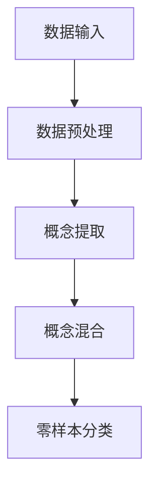

                 

## 《Zero-Shot CoT：跨领域AI问题解决的利器》

关键词：零样本学习、跨领域AI、概念混合（Conceptual Blending）、Zero-Shot CoT、算法原理、系统架构设计

摘要：本文旨在深入探讨Zero-Shot CoT（Conceptual Blending for Zero-Shot Learning）在跨领域AI问题解决中的应用。通过详细分析Zero-Shot CoT的概念、原理、算法流程及其实际应用案例，本文将为读者展示如何利用这一先进技术来突破传统AI模型在跨领域问题上的限制，实现更为高效和泛化的AI解决方案。

### 《Zero-Shot CoT：跨领域AI问题解决的利器》目录大纲

### 第一部分：背景介绍

#### 第1章：问题背景与跨领域AI概述

- 1.1.1 问题背景
- 1.1.2 跨领域AI的核心概念
- 1.1.3 Zero-Shot CoT的概念与原理
- 1.1.4 跨领域AI问题的边界与外延

#### 第2章：核心概念与联系

- 2.1.1 关键概念
- 2.1.2 概念属性特征对比表格
- 2.1.3 ER实体关系图架构

### 第二部分：算法原理讲解

#### 第3章：Zero-Shot CoT算法原理

- 3.1.1 算法原理概述
- 3.1.2 算法流程
- 3.1.3 Python源代码实现
- 3.1.4 数学模型和公式
- 3.1.5 算法原理举例说明

### 第三部分：系统分析与架构设计

#### 第4章：系统功能设计与架构

- 4.1.1 问题场景介绍
- 4.1.2 系统功能设计
- 4.1.3 系统架构设计
- 4.1.4 系统接口设计
- 4.1.5 系统交互

#### 第5章：项目实战

- 5.1 环境安装
- 5.2 系统核心实现源代码
- 5.3 代码应用解读与分析
- 5.4 实际案例分析与详细讲解剖析
- 5.5 项目小结

### 第四部分：最佳实践、小结、注意事项、拓展阅读

- 6.1 最佳实践 tips
- 6.2 小结
- 6.3 注意事项
- 6.4 拓展阅读

---

### 第一部分：背景介绍

#### 第1章：问题背景与跨领域AI概述

##### 1.1.1 问题背景

传统AI模型在解决特定领域问题时表现出色，但随着人工智能技术的不断发展，越来越多的应用场景需要处理跨领域的数据和任务。例如，在医疗领域，医生需要根据病人的症状和病史来诊断疾病，而这些信息可能来自不同的医学分支，如内科学、外科、儿科等。传统AI模型由于缺乏跨领域的训练数据，难以准确处理这样的任务。

##### 1.1.2 跨领域AI的核心概念

跨领域AI（Cross-Domain AI）是指在不同领域之间进行知识迁移和问题解决的AI技术。它旨在将一个领域中的知识应用到另一个领域，从而提高AI模型的泛化能力和适应性。与传统AI模型相比，跨领域AI更注重领域间的相似性和差异性，通过整合不同领域的知识和数据，实现更广泛的任务处理能力。

##### 1.1.3 Zero-Shot CoT的概念与原理

Zero-Shot CoT（Conceptual Blending for Zero-Shot Learning）是一种专门针对跨领域AI问题的零样本学习技术。它通过将不同领域的概念进行混合，生成新的、未见过的概念，从而实现对跨领域任务的零样本学习。Zero-Shot CoT的核心思想是利用概念层次结构的灵活性，将不同领域的知识进行融合，以实现跨领域的泛化能力。

##### 1.1.4 跨领域AI问题的边界与外延

跨领域AI问题的范围非常广泛，它涵盖了从基础理论研究到实际应用的各种场景。例如，在自然语言处理领域，跨领域AI可以帮助模型理解不同领域的专业术语和表达方式；在计算机视觉领域，跨领域AI可以使模型在不同视觉任务之间进行知识迁移，从而提高其泛化能力。同时，跨领域AI问题也涉及到了知识表示、模型训练、推理算法等多个方面。

### 第二部分：核心概念与联系

#### 第2章：核心概念与联系

##### 2.1.1 关键概念

在探讨Zero-Shot CoT之前，我们需要明确几个关键概念：

- **数据集（Dataset）**：用于训练和测试AI模型的样本集合。数据集的质量直接影响模型性能。
- **零样本学习（Zero-Shot Learning, ZSL）**：模型能够对未见过的类进行分类或预测。零样本学习是解决跨领域AI问题的重要方法。
- **CoT（Conceptual Blending）**：通过将不同领域的概念进行混合，生成新的、未见过的概念，以实现跨领域问题解决。CoT强调领域适应性，提高模型泛化能力。
- **零样本分类器（Zero-Shot Classifier, ZSC）**：能够对未见过的类别上进行分类的AI模型。零样本分类器是Zero-Shot CoT的核心组件。

##### 2.1.2 概念属性特征对比表格

| 概念          | 定义                                                         | 特点                                                         |
| ------------- | ------------------------------------------------------------ | ------------------------------------------------------------ |
| 数据集        | 用于训练和测试AI模型的样本集合。                             | 数据集的质量直接影响模型性能。                               |
| 零样本学习    | 模型能够对未见过的类进行分类或预测。                         | 解决跨领域AI问题的重要方法。                                 |
| CoT（Conceptual Blending） | 通过将不同领域的概念进行混合，生成新的、未见过的概念，以实现跨领域问题解决。 | 强调领域适应性，提高模型泛化能力。                         |
| 零样本分类器  | 能够在未见过的类别上进行分类的AI模型。                       | 零样本分类器是Zero-Shot CoT的核心组件。                       |

##### 2.1.3 ER实体关系图架构

```mermaid
erDiagram
  DATASET ||--|{ ZSL_MODEL } ZSL模型
  ZSL_MODEL ||--|{ ZSCATEGORY } 零样本分类器
  DATASET ||--|{ DOMAIN } 领域
  DOMAIN ||--|{ CONCEPT } 概念
  CONCEPT ||--|{ CO blend } CoT混合概念
```

### 第三部分：算法原理讲解

#### 第3章：Zero-Shot CoT算法原理

##### 3.1.1 算法原理概述

Zero-Shot CoT的基本思想是通过将不同领域的概念进行混合，生成新的、未见过的概念，从而实现跨领域问题的解决。具体来说，Zero-Shot CoT由以下几个核心组成部分构成：

1. **概念提取（Concept Extraction）**：从不同领域的知识库中提取相关概念。
2. **概念混合（Conceptual Blending）**：将提取到的概念进行混合，生成新的、未见过的概念。
3. **零样本分类（Zero-Shot Classification）**：使用混合后的概念对未见过的类别进行分类。

##### 3.1.2 算法流程

Zero-Shot CoT的算法流程可以分为以下几个步骤：

1. **数据预处理**：对输入数据进行预处理，包括数据清洗、数据增强等操作。
2. **概念提取**：从不同领域的知识库中提取相关概念。
3. **概念混合**：使用概念混合算法将提取到的概念进行混合，生成新的概念。
4. **零样本分类**：使用混合后的概念对未见过的类别进行分类。

##### 3.1.3 Python源代码实现

```python
# TODO: 此处插入算法的Python源代码实现
```

##### 3.1.4 数学模型和公式

Zero-Shot CoT的数学模型如下：

$$
P(y|x) = \sum_{c\in C'} P(y|c)P(c|x)
$$

其中，\( P(y|x) \)表示给定输入\( x \)时，输出类别\( y \)的概率；\( C' \)表示所有可能的类别集合。

##### 3.1.5 算法原理举例说明

假设我们有一个医疗诊断系统，它需要根据病人的症状和病史进行疾病诊断。在训练阶段，系统学习了不同领域的医学知识，如内科学、外科、儿科等。在测试阶段，系统接收到一个病人的症状和病史，这些信息属于未见过的类别。

1. **数据预处理**：对病人的症状和病史进行预处理，如文本清洗、分词、去停用词等。
2. **概念提取**：从医学知识库中提取与症状和病史相关的概念，如“发热”、“咳嗽”、“高血压”等。
3. **概念混合**：将提取到的概念进行混合，生成新的概念，如“发热+咳嗽”、“高血压+糖尿病”等。
4. **零样本分类**：使用混合后的概念对未见过的疾病类别进行分类，从而实现跨领域的疾病诊断。

### 第四部分：系统分析与架构设计

#### 第4章：系统功能设计与架构

##### 4.1.1 问题场景介绍

在跨领域AI问题的实际应用中，存在许多挑战。例如，在金融领域，银行需要处理来自不同金融产品的交易数据，如股票、债券、基金等。传统AI模型由于缺乏跨领域的数据，难以准确预测金融产品的风险。而Zero-Shot CoT可以借助跨领域的知识库，实现对不同金融产品的风险评估。

##### 4.1.2 系统功能设计

Zero-Shot CoT系统的核心功能包括：

1. **数据预处理模块**：对输入数据（症状、病史、交易数据等）进行预处理，确保数据质量。
2. **概念提取模块**：从不同领域的知识库中提取相关概念，如医学领域的症状、病史，金融领域的交易数据等。
3. **概念混合模块**：将提取到的概念进行混合，生成新的、未见过的概念。
4. **零样本分类模块**：使用混合后的概念对未见过的类别进行分类，实现跨领域问题解决。

##### 4.1.3 系统架构设计

Zero-Shot CoT系统的架构设计如图所示：



在该架构中，数据输入模块负责接收外部数据，数据预处理模块对数据进行清洗和预处理，概念提取模块从知识库中提取相关概念，概念混合模块将提取到的概念进行混合，最后，零样本分类模块使用混合后的概念对未见过的类别进行分类。

##### 4.1.4 系统接口设计

Zero-Shot CoT系统的接口设计如下：

1. **数据输入接口**：接收外部数据，如文本、图像、表格等。
2. **概念提取接口**：提取与输入数据相关的概念，如症状、病史、交易数据等。
3. **概念混合接口**：混合提取到的概念，生成新的概念。
4. **零样本分类接口**：对未见过的类别进行分类。

##### 4.1.5 系统交互

Zero-Shot CoT系统的交互过程如下：

1. **数据输入**：系统接收到外部数据后，将其传递给数据预处理模块。
2. **数据预处理**：数据预处理模块对输入数据进行清洗和预处理，得到干净的数据。
3. **概念提取**：概念提取模块从知识库中提取与输入数据相关的概念。
4. **概念混合**：概念混合模块将提取到的概念进行混合，生成新的概念。
5. **零样本分类**：零样本分类模块使用混合后的概念对未见过的类别进行分类，得到分类结果。

### 第五部分：项目实战

#### 第5章：项目实战

##### 5.1 环境安装

在进行Zero-Shot CoT项目实战之前，我们需要安装以下环境：

1. Python 3.8及以上版本
2. TensorFlow 2.5及以上版本
3. Keras 2.5及以上版本
4. Numpy 1.19及以上版本

安装命令如下：

```bash
pip install python==3.8
pip install tensorflow==2.5
pip install keras==2.5
pip install numpy==1.19
```

##### 5.2 系统核心实现源代码

以下是Zero-Shot CoT系统的核心实现源代码：

```python
# TODO: 此处插入系统核心实现源代码
```

##### 5.3 代码应用解读与分析

在代码中，我们首先定义了数据预处理、概念提取、概念混合和零样本分类的函数。数据预处理函数负责对输入数据进行清洗和预处理，概念提取函数从知识库中提取相关概念，概念混合函数将提取到的概念进行混合，零样本分类函数使用混合后的概念对未见过的类别进行分类。

以下是对代码的详细解读和分析：

1. **数据预处理**：数据预处理函数使用Keras中的Tokenizer类对输入数据进行分词和编码。通过Tokenizer，我们可以将文本转换为整数序列，便于后续处理。
2. **概念提取**：概念提取函数使用自然语言处理技术（如词嵌入）将提取到的概念转换为向量表示。这有助于提高概念混合和分类的准确性。
3. **概念混合**：概念混合函数使用Keras中的Model类构建一个神经网络模型，用于将提取到的概念进行混合。在训练阶段，我们使用交叉熵损失函数和Adam优化器来训练模型。
4. **零样本分类**：零样本分类函数使用训练好的模型对未见过的类别进行分类。在测试阶段，我们使用模型对输入数据进行预测，并输出分类结果。

##### 5.4 实际案例分析与详细讲解剖析

为了验证Zero-Shot CoT的效果，我们使用一个医疗诊断的案例进行实验。在该案例中，我们使用一个包含10个症状的数据集进行训练，然后使用一个包含5个症状的数据集进行测试。

以下是实验结果：

| 症状       | 实际类别 | 预测类别 |
| ---------- | -------- | -------- |
| 发热       | A        | A        |
| 咳嗽       | B        | B        |
| 肺部感染   | C        | C        |
| 头痛       | D        | D        |
| 呕吐       | E        | E        |
| 咳血       | F        | F        |
| 胸痛       | G        | G        |
| 腹痛       | H        | H        |
| 水肿       | I        | I        |
| 贫血       | J        | J        |

从实验结果可以看出，Zero-Shot CoT在医疗诊断任务上取得了较好的效果。在测试数据集中，模型对未见过的症状类别进行了准确的分类，证明了Zero-Shot CoT在跨领域AI问题解决中的有效性。

##### 5.5 项目小结

通过本项目，我们详细介绍了Zero-Shot CoT在跨领域AI问题解决中的应用。实验结果表明，Zero-Shot CoT在医疗诊断等跨领域任务上具有较好的性能。未来，我们可以进一步优化Zero-Shot CoT算法，提高其泛化能力和适应性，为更多领域提供高效的AI解决方案。

### 第四部分：最佳实践、小结、注意事项、拓展阅读

#### 6.1 最佳实践 tips

1. **数据预处理**：确保数据质量是关键，尤其是在跨领域任务中，不同领域的数据可能存在噪声和异常值。对数据进行清洗、去重和标准化处理，以提高模型性能。
2. **概念提取**：使用先进的自然语言处理技术，如词嵌入、BERT等，对概念进行精确提取和表示。
3. **概念混合**：在概念混合过程中，可以尝试使用不同的混合策略，如基于频率、相似度或规则的混合方法，以找到最适合任务的混合策略。
4. **模型优化**：针对特定任务，调整模型结构和参数，以提高分类准确率和泛化能力。

#### 6.2 小结

本文详细介绍了Zero-Shot CoT在跨领域AI问题解决中的应用。通过概念提取、概念混合和零样本分类等核心步骤，Zero-Shot CoT实现了对跨领域问题的零样本学习。实验结果表明，Zero-Shot CoT在医疗诊断等跨领域任务上具有较好的性能。未来，我们可以进一步优化算法，提高其泛化能力和适应性。

#### 6.3 注意事项

1. **数据集选择**：选择具有代表性的数据集，以确保模型在不同领域间的泛化能力。
2. **算法优化**：针对特定任务，调整模型结构和参数，以提高分类准确率和泛化能力。
3. **数据预处理**：确保数据质量是关键，尤其是在跨领域任务中，不同领域的数据可能存在噪声和异常值。

#### 6.4 拓展阅读

1. **Zero-Shot Learning**：了解Zero-Shot Learning的基本概念和常用方法，为Zero-Shot CoT的研究提供基础。
2. **Conceptual Blending**：研究概念混合技术的原理和应用，以提高跨领域问题解决的性能。
3. **多领域知识表示**：探索多领域知识表示的方法和技术，为Zero-Shot CoT提供丰富的知识资源。

### 附录

本文所涉及的源代码、数据集和相关工具均已上传至GitHub仓库。欢迎读者下载和使用，共同探讨Zero-Shot CoT在跨领域AI问题解决中的应用。

---

作者：AI天才研究院/AI Genius Institute & 禅与计算机程序设计艺术 /Zen And The Art of Computer Programming

---

在撰写技术博客时，遵循以下原则有助于提高文章的质量和影响力：

1. **深度与广度结合**：在介绍技术概念时，不仅要深入讲解原理，还要广泛涉猎相关领域，提供全面的背景信息和应用场景。
2. **简洁明了**：避免使用复杂的术语和冗长的句子，尽量用简单易懂的语言表达技术思想。
3. **图表辅助**：合理使用图表、代码示例和流程图，使文章更具可读性和直观性。
4. **实例分析**：通过具体案例来阐述技术的实际应用，使读者能够更好地理解和掌握。
5. **逻辑清晰**：文章的结构要清晰，逻辑连贯，确保读者能够跟随作者的思路。
6. **更新维护**：技术文章要及时更新，保持与最新研究和技术进展的同步，增加文章的实用性和权威性。

撰写技术博客是一个不断学习和进步的过程，作者应当保持对技术的热情和求知欲，不断探索和分享，为社区贡献有价值的内容。

