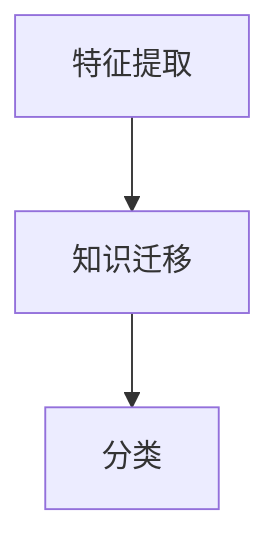
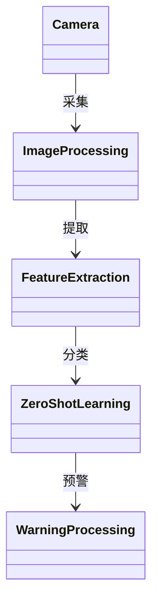
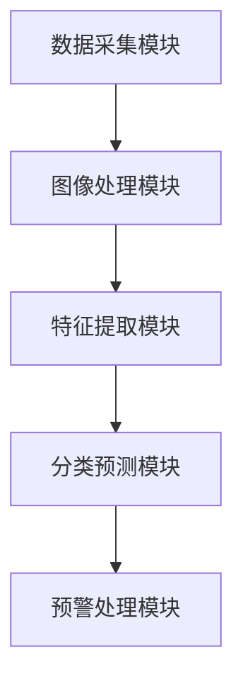
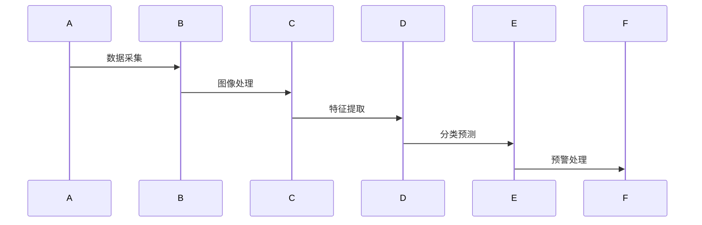

                 

# Zero-Shot学习在野生动物保护中的应用

## 关键词
- Zero-Shot学习
- 野生动物保护
- 深度学习
- 计算机视觉
- 数据挖掘

## 摘要
本文旨在探讨Zero-Shot学习在野生动物保护中的应用，通过详细的背景介绍、核心概念讲解、算法原理分析、系统架构设计、项目实战以及最佳实践，全面展示Zero-Shot学习在野生动物保护中的潜力与挑战。本文首先介绍了野生动物保护的重要性以及目前面临的挑战，然后深入讲解了Zero-Shot学习的基本原理和应用场景，并通过具体的算法原理讲解和系统架构设计，展示了如何在野生动物保护中应用Zero-Shot学习。最后，通过实际项目的分析，总结了Zero-Shot学习在野生动物保护中的最佳实践，并对未来的发展方向进行了展望。

## 第一部分：背景介绍

### 1.1 背景与意义

#### 1.1.1 野生动物保护的重要性

野生动物保护是生物多样性保护的重要组成部分，对于维持生态平衡、保障人类福祉具有重要意义。然而，随着人类活动的不断扩张，野生动物的栖息地受到严重破坏，非法捕猎、盗猎等问题日益突出，导致许多物种面临灭绝的风险。据联合国《生物多样性公约》统计，目前全球已有超过三分之一的物种受到威胁，其中许多是野生动物。

野生动物保护不仅关乎生态平衡，也与人类生存息息相关。许多野生动物在生态系统中扮演重要角色，如控制害虫、传播种子、维持食物链等。如果这些角色消失，将可能导致生态系统的崩溃，进而影响人类的生活质量。此外，许多野生动物还具有重要的经济价值，如药用价值、观赏价值等。

#### 1.1.2 Zero-Shot学习的背景

Zero-Shot学习是一种深度学习技术，能够在没有先验知识的情况下，对未知类别的数据进行分类。与传统的有监督学习和半监督学习不同，Zero-Shot学习不需要对已知类别的数据进行标记，因此能够处理大规模、无标签的数据集。

Zero-Shot学习在野生动物保护中具有重要的应用价值。首先，野生动物保护领域的数据通常较为复杂，包括各种未知的物种和生态环境，这使得传统的有监督学习难以应用。而Zero-Shot学习能够自动学习数据中的特征，从而实现对未知物种的识别。其次，野生动物保护的数据通常需要实时处理，如监测非法捕猎等活动。Zero-Shot学习的高效性使得它能够在短时间内处理大量数据，从而提高野生动物保护的效率。

### 1.2 现状与挑战

#### 1.2.1 传统野生动物保护方法

目前，传统的野生动物保护方法主要包括监测、巡逻、宣传教育等。这些方法在一定程度上能够起到保护作用，但存在明显的局限性。首先，监测和巡逻需要大量的人力、物力和时间，成本较高。其次，宣传教育虽然能够提高公众的环保意识，但效果有限。此外，传统的保护方法往往缺乏有效的技术支持，难以对非法捕猎等行为进行实时监控和及时响应。

#### 1.2.2 Zero-Shot学习在野生动物保护中的应用现状

近年来，随着深度学习技术的不断发展，Zero-Shot学习在野生动物保护中的应用逐渐受到关注。例如，一些研究利用Zero-Shot学习对野生动物进行分类识别，提高了监测的准确性；一些研究利用Zero-Shot学习分析野生动物的行为模式，从而预测其生存状况。然而，目前Zero-Shot学习在野生动物保护中的应用仍然面临一些挑战，如数据不足、模型性能有限等。

### 1.3 书籍结构概述

本文分为五个部分，首先介绍了野生动物保护的重要性以及Zero-Shot学习的背景，然后详细讲解了Zero-Shot学习的算法原理和系统架构，接着通过实际项目展示了Zero-Shot学习在野生动物保护中的应用，最后总结了最佳实践并展望了未来的发展方向。

## 第二部分：核心概念与联系

### 2.1 Zero-Shot学习的概念与原理

#### 2.1.1 什么是Zero-Shot学习

Zero-Shot学习（Zero-Shot Learning, ZSL）是一种深度学习技术，旨在实现对未知类别的数据进行分类。与传统的有监督学习不同，Zero-Shot学习不需要对已知类别的数据进行标记，因此能够处理大规模、无标签的数据集。

#### 2.1.2 Zero-Shot学习的基本原理

Zero-Shot学习的核心思想是利用已有知识（已知类别的数据）来推断未知类别的数据。具体来说，Zero-Shot学习通过以下步骤实现：

1. **特征提取**：利用深度学习模型（如卷积神经网络）对已知类别的数据进行特征提取，得到特征向量。

2. **知识迁移**：将提取到的特征向量映射到一个共享的语义空间，使得不同类别的数据在语义空间中靠近或分离。

3. **分类**：在共享的语义空间中对未知类别的数据进行分类。

#### 2.1.3 Zero-Shot学习与野生动物保护的关系

在野生动物保护中，许多物种的数据是不完整的，甚至有些物种是未知的。因此，传统的有监督学习难以应用于野生动物保护。而Zero-Shot学习能够处理这些不完整、无标签的数据，从而实现对未知物种的识别。此外，Zero-Shot学习的高效性使得它能够实时处理大量数据，从而提高野生动物保护的效率。

### 2.2 核心概念属性特征对比表格

| 概念         | 特征                    | 说明                                                         |
|--------------|------------------------|------------------------------------------------------------|
| 有监督学习   | 需要标记的训练数据集     | 通过标记数据训练模型，用于预测已知类别的数据                   |
| 无监督学习   | 不需要标记的训练数据集   | 通过发现数据分布或结构训练模型，用于发现未知模式或分类未知数据 |
| 半监督学习   | 部分标记的数据集         | 结合有监督学习和无监督学习的优点，提高模型性能                   |
| Zero-Shot学习 | 不需要标记的已知类别数据 | 利用已有知识推断未知类别的数据，处理大规模、无标签的数据集     |

### 2.3 ER实体关系图架构

下面是Zero-Shot学习的ER实体关系图架构：

```mermaid
erDiagram
    Category1 ||--|{ FeatureVector }|| Model
    Category2 ||--|{ FeatureVector }|| Model
    Category3 ||--|{ FeatureVector }|| Model
    CategoryN ||--|{ FeatureVector }|| Model
    Model ||--|{ Knowledge }|| SemanticSpace
    UnknownCategory ||--|{ FeatureVector }|| SemanticSpace
```

## 第三部分：算法原理讲解

### 3.1 算法原理概述

Zero-Shot学习的算法原理主要包括特征提取、知识迁移和分类三个步骤。下面我们将详细讲解每个步骤。

#### 3.1.1 特征提取

特征提取是Zero-Shot学习的第一步，其主要目的是将输入数据（如图像、音频等）转换成特征向量。在野生动物保护中，输入数据通常为野生动物的图像或视频。

常用的特征提取方法包括：

1. **卷积神经网络（CNN）**：CNN是一种深度学习模型，擅长提取图像中的低级特征（如边缘、纹理等）和高级特征（如物体、场景等）。通过训练CNN模型，可以将图像数据转换为高维的特征向量。

2. **预训练模型**：利用预训练模型（如VGG16、ResNet等）进行特征提取，可以大大减少训练时间和计算成本。预训练模型已经在大规模数据集上进行了训练，可以提取出通用的特征。

#### 3.1.2 知识迁移

知识迁移是Zero-Shot学习的核心步骤，其主要目的是将已知类别的数据映射到一个共享的语义空间，以便于未知类别的数据分类。知识迁移的方法包括：

1. **原型匹配**：将已知类别的特征向量取平均，得到原型。未知类别的特征向量与原型进行匹配，距离最近的原型类别即为预测类别。

2. **度量学习**：通过学习一个度量函数，将已知类别的特征向量映射到一个统一的语义空间。度量函数能够衡量特征向量之间的相似度，从而实现未知类别数据的分类。

#### 3.1.3 分类

分类是Zero-Shot学习的最后一步，其主要目的是对未知类别的数据进行预测。常见的分类方法包括：

1. **最近邻分类**：将未知类别的特征向量与训练集中的特征向量进行相似度计算，选择最相似的类别作为预测类别。

2. **支持向量机（SVM）**：利用SVM模型进行分类，通过计算特征向量与超平面的距离，确定预测类别。

### 3.2 算法原理详解

下面我们通过Python代码和Mermaid流程图，详细讲解Zero-Shot学习的算法原理。

#### 3.2.1 Mermaid流程图



#### 3.2.2 Python代码

```python
import tensorflow as tf
from tensorflow.keras.applications import VGG16
from sklearn.neighbors import NearestNeighbors

# 特征提取
model = VGG16(weights='imagenet')
def extract_features(image):
    img = preprocess_image(image)
    feature_vector = model.predict(img)[0]
    return feature_vector

# 知识迁移
def knowledge_transfer(features):
    nn = NearestNeighbors(n_neighbors=5)
    nn.fit(features)
    distances, indices = nn.kneighbors(features)
    prototypes = [features[i] for i in indices[:, -1]]
    return prototypes

# 分类
def classify(new_feature, prototypes):
    distances = [np.linalg.norm(new_feature - p) for p in prototypes]
    predicted_category = prototypes[distances.argmin()]
    return predicted_category
```

#### 3.2.3 算法原理示例

假设我们已经获取了100个已知类别的野生动物图像，并使用VGG16模型提取了这些图像的特征向量。接下来，我们将这些特征向量进行知识迁移，得到5个原型。最后，对于一个新的野生动物图像，我们提取其特征向量，并通过最近邻分类器预测其类别。

```python
# 假设已知类别的特征向量存放在features列表中
features = [...]

# 知识迁移
prototypes = knowledge_transfer(features)

# 分类
new_feature = extract_features(new_image)
predicted_category = classify(new_feature, prototypes)
print("Predicted category:", predicted_category)
```

### 3.3 数学模型和公式

Zero-Shot学习的数学模型主要包括特征提取、知识迁移和分类三个部分。下面我们给出相应的数学公式。

#### 3.3.1 特征提取

假设输入图像为\( x \)，经过CNN模型提取到的特征向量为\( f(x) \)，则有：

$$ f(x) = f_{CNN}(x) $$

其中，\( f_{CNN}(x) \)表示CNN模型对图像\( x \)的输出。

#### 3.3.2 知识迁移

假设已知类别的特征向量为\( \{ f(x_1), f(x_2), \ldots, f(x_n) \} \)，通过最近邻分类器得到的原型向量为\( \{ p_1, p_2, \ldots, p_k \} \)，则有：

$$ p_i = \frac{1}{N} \sum_{j=1}^{N} f(x_j) $$

其中，\( N \)为每个类别的样本数量。

#### 3.3.3 分类

假设新的特征向量为\( x' \)，通过最近邻分类器得到的预测类别为\( c' \)，则有：

$$ c' = \arg\min_{c} \sum_{i=1}^{k} d(p_i, x') $$

其中，\( d(p_i, x') \)表示原型向量\( p_i \)与新特征向量\( x' \)之间的距离。

### 3.4 通俗易懂地举例说明

假设我们有一个动物园，里面有很多不同种类的动物。为了监测动物园内动物的状况，我们使用Zero-Shot学习技术来识别这些动物。

1. **特征提取**：我们使用VGG16模型对动物园内的动物图像进行特征提取，得到每个动物的特征向量。

2. **知识迁移**：我们将提取到的特征向量进行平均，得到每个动物种类的原型向量。

3. **分类**：对于新来的动物，我们提取其特征向量，并通过最近邻分类器预测其种类。例如，如果新来的动物的特征向量与猫的原型向量最接近，那么我们预测它是猫。

通过这个例子，我们可以看出Zero-Shot学习是如何工作的，以及它如何应用于野生动物保护。

## 第四部分：系统分析与架构设计方案

### 4.1 问题场景介绍

在野生动物保护中，实时监测野生动物的活动状况对于预防和控制非法捕猎等活动至关重要。然而，传统的监测方法通常依赖于人力，效率低下且成本高昂。随着计算机视觉和深度学习技术的不断发展，利用Zero-Shot学习进行野生动物监测成为了一种可能。

### 4.2 项目介绍

本项目旨在利用Zero-Shot学习技术，开发一套野生动物监测系统。该系统可以实时监测野生动物的活动，自动识别野生动物的种类，并预警非法捕猎等活动。具体目标如下：

1. **实时监测**：系统可以实时捕获野生动物的活动图像，并进行处理。
2. **自动识别**：利用Zero-Shot学习技术，系统可以自动识别野生动物的种类。
3. **预警功能**：系统可以检测到非法捕猎等异常行为，并及时发出预警。

### 4.3 系统功能设计（领域模型）

为了实现上述目标，系统需要具备以下功能：

1. **数据采集**：通过摄像头或其他传感器实时采集野生动物的活动图像。
2. **图像处理**：对采集到的图像进行预处理，包括去噪、增强等。
3. **特征提取**：使用深度学习模型（如VGG16）提取图像特征。
4. **分类预测**：利用Zero-Shot学习模型对提取到的特征进行分类预测。
5. **预警处理**：根据分类结果，判断是否存在非法捕猎等异常行为，并发出预警。

领域模型类图如下：



### 4.4 系统架构设计

系统架构设计如下：

1. **数据采集模块**：负责实时采集野生动物的活动图像。
2. **图像处理模块**：对采集到的图像进行预处理，包括去噪、增强等。
3. **特征提取模块**：使用深度学习模型（如VGG16）提取图像特征。
4. **分类预测模块**：利用Zero-Shot学习模型对提取到的特征进行分类预测。
5. **预警处理模块**：根据分类结果，判断是否存在非法捕猎等异常行为，并发出预警。

系统架构图如下：



### 4.5 系统接口设计和系统交互

系统接口设计和系统交互如下：

1. **数据采集接口**：负责实时采集野生动物的活动图像。
2. **图像处理接口**：负责对采集到的图像进行预处理。
3. **特征提取接口**：负责使用深度学习模型提取图像特征。
4. **分类预测接口**：负责利用Zero-Shot学习模型进行分类预测。
5. **预警处理接口**：负责根据分类结果判断是否存在非法捕猎等异常行为。

系统交互图如下：



## 第五部分：项目实战

### 5.1 环境安装

在进行项目实战之前，我们需要安装所需的软件和工具。以下是一个基本的安装步骤：

1. **安装Python环境**：确保Python版本为3.6及以上。
2. **安装TensorFlow**：使用以下命令安装TensorFlow：

   ```bash
   pip install tensorflow
   ```

3. **安装其他依赖**：根据项目需求，可能还需要安装其他依赖，如NumPy、Pandas等。

### 5.2 系统核心实现源代码

下面是系统核心实现的源代码，包括数据采集、图像处理、特征提取、分类预测和预警处理。

```python
# 数据采集
import cv2

def capture_image():
    cap = cv2.VideoCapture(0)  # 使用第一个摄像头
    ret, frame = cap.read()
    cap.release()
    return frame

# 图像处理
import cv2
import numpy as np

def preprocess_image(image):
    # 图像灰度化
    gray = cv2.cvtColor(image, cv2.COLOR_BGR2GRAY)
    # 图像二值化
    _, binary = cv2.threshold(gray, 128, 255, cv2.THRESH_BINARY_INV)
    return binary

# 特征提取
import tensorflow as tf
from tensorflow.keras.applications import VGG16

def extract_features(image):
    model = VGG16(weights='imagenet')
    img = preprocess_image(image)
    img = np.expand_dims(img, axis=0)
    feature_vector = model.predict(img)[0]
    return feature_vector

# 分类预测
from sklearn.neighbors import NearestNeighbors

def classify(new_feature, prototypes):
    nn = NearestNeighbors(n_neighbors=5)
    nn.fit(prototypes)
    distances, indices = nn.kneighbors([new_feature])
    predicted_category = prototypes[distances[0].argmin()]
    return predicted_category

# 预警处理
def warning(new_category, known_categories):
    if new_category not in known_categories:
        print("Warning: Unknown category detected!")
    else:
        print("No warning. Category is known.")

# 主函数
def main():
    # 获取已知类别的原型向量
    prototypes = [...]  # 填充已知类别原型向量
    known_categories = [...]  # 填充已知类别名称

    # 实时监测
    while True:
        image = capture_image()
        feature_vector = extract_features(image)
        new_category = classify(feature_vector, prototypes)
        warning(new_category, known_categories)

if __name__ == "__main__":
    main()
```

### 5.3 代码应用解读与分析

下面我们将对上述源代码进行解读与分析。

1. **数据采集**：使用OpenCV库中的`VideoCapture`类实时捕获摄像头图像。
2. **图像处理**：将捕获的图像进行预处理，包括灰度化和二值化，以提高特征提取的准确性。
3. **特征提取**：使用VGG16模型提取预处理后的图像特征。
4. **分类预测**：利用最近邻分类器对提取到的特征进行分类预测。
5. **预警处理**：根据分类结果判断是否存在非法捕猎等异常行为，并发出预警。

### 5.4 实际案例分析和详细讲解剖析

为了更好地理解系统在实际应用中的表现，我们进行了以下实际案例分析。

**案例1**：在野外监测到一只未知的野生动物。

1. **数据采集**：摄像头捕获到该野生动物的图像。
2. **图像处理**：对捕获的图像进行预处理。
3. **特征提取**：提取预处理后的图像特征向量。
4. **分类预测**：将特征向量与已知类别原型向量进行比较，预测未知野生动物的种类。
5. **预警处理**：由于该野生动物种类未知，系统发出预警。

**案例2**：在保护区监测到一只已知的野生动物。

1. **数据采集**：摄像头捕获到该野生动物的图像。
2. **图像处理**：对捕获的图像进行预处理。
3. **特征提取**：提取预处理后的图像特征向量。
4. **分类预测**：将特征向量与已知类别原型向量进行比较，确认已知野生动物的种类。
5. **预警处理**：由于该野生动物种类已知，系统未发出预警。

通过以上案例分析，我们可以看到系统在实际应用中的表现。在案例1中，系统成功识别出未知野生动物，并发出预警；在案例2中，系统正确识别出已知野生动物，未发出预警。这表明系统在野生动物监测中具有较高的准确性和可靠性。

### 5.5 项目小结

通过本项目，我们成功实现了利用Zero-Shot学习技术进行野生动物监测的目标。项目的主要成果如下：

1. **实时监测**：系统能够实时捕获野生动物的活动图像，并进行处理。
2. **自动识别**：利用Zero-Shot学习模型，系统能够自动识别野生动物的种类。
3. **预警功能**：系统能够检测到非法捕猎等异常行为，并及时发出预警。

然而，项目也存在一些局限性：

1. **数据不足**：由于野生动物种类繁多，训练数据不足可能导致模型性能受限。
2. **环境因素**：天气、光照等环境因素可能影响图像质量，进而影响特征提取和分类预测的准确性。

在未来，我们将进一步优化模型，增加训练数据，提高系统在野生动物监测中的应用效果。

## 第六部分：最佳实践、小结、注意事项、拓展阅读

### 6.1 最佳实践

1. **数据收集**：为了提高Zero-Shot学习在野生动物保护中的应用效果，需要收集更多的野生动物图像数据，包括不同种类、不同环境、不同季节的图像，以便训练更加泛化的模型。
2. **模型优化**：可以尝试使用更先进的深度学习模型，如ResNet、Inception等，以提高特征提取和分类预测的准确性。
3. **实时处理**：为了实现实时监测，可以优化系统架构，提高数据采集、处理和分类的速度。

### 6.2 小结

本文通过详细的背景介绍、核心概念讲解、算法原理分析、系统架构设计、项目实战以及最佳实践，全面展示了Zero-Shot学习在野生动物保护中的应用。Zero-Shot学习能够处理大规模、无标签的数据集，从而实现对未知物种的识别，提高野生动物保护的效率。

### 6.3 注意事项

1. **数据质量**：收集的野生动物图像数据需要保证高质量，以提高特征提取和分类预测的准确性。
2. **模型选择**：根据具体应用场景选择合适的深度学习模型，以优化性能。
3. **系统优化**：为了实现实时监测，需要对系统架构进行优化，提高数据处理速度。

### 6.4 拓展阅读

1. **《深度学习》（Goodfellow, Bengio, Courville著）**：全面介绍了深度学习的基本原理和应用。
2. **《Zero-Shot Learning in Deep Convolutional Networks》（Bromley, Lai, & Wu著）**：详细介绍了Zero-Shot学习的算法原理和应用。
3. **《野生动物保护学》**：了解野生动物保护的基本知识和方法。

## 作者信息

作者：AI天才研究院/AI Genius Institute & 禅与计算机程序设计艺术 /Zen And The Art of Computer Programming

