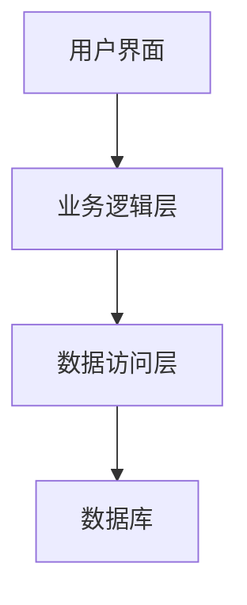

                 

### 云原生技术在微服务架构中的应用

> 关键词：云原生、微服务架构、容器化、Kubernetes、服务网格、持续交付

> 摘要：本文将深入探讨云原生技术及其在微服务架构中的实际应用。我们将从云原生技术的基础概念开始，逐步讲解其在微服务架构中的重要性，并详细介绍相关技术原理、系统分析与架构设计方案，以及通过一个具体的项目实战案例，展示云原生技术如何有效支持微服务架构。最后，我们将总结最佳实践，提供拓展阅读资源，帮助读者更好地理解和应用云原生技术。

## 目录

1. **云原生技术在微服务架构中的应用**
   1.1. **关键词与摘要**
   1.2. **目录**
2. **第一部分：云原生技术基础**
   2.1. **第1章：云原生技术概述**
   2.2. **第2章：容器化技术**
   2.3. **第3章：Kubernetes核心概念**
   2.4. **第4章：服务网格技术**
   2.5. **第5章：自动化部署与持续交付**
   2.6. **第6章：云原生技术在微服务架构中的应用**
3. **第二部分：系统分析与架构设计**
   3.1. **第7章：项目实战：云原生微服务架构设计**
4. **第三部分：最佳实践与拓展**
   3.2. **第8章：最佳实践与拓展**

## 1.1. 关键词与摘要

云原生技术、微服务架构、容器化、Kubernetes、服务网格、持续交付

云原生技术作为一种新兴的软件开发与运行方式，正逐渐成为微服务架构中的重要支撑力量。本文将详细探讨云原生技术在微服务架构中的应用，从基础概念到具体实现，逐步分析其在提高系统可伸缩性、可靠性和运维效率方面的优势。通过本文的阅读，读者将能够全面了解云原生技术，并掌握其在实际项目中的应用技巧。

## 1.2. 目录

### 第一部分：云原生技术基础

#### 第1章：云原生技术概述
1.1. 云原生技术的定义与历史背景
1.2. 云原生技术的重要性
1.3. 云原生技术与微服务架构的关系

#### 第2章：容器化技术
2.1. 容器的概念与原理
2.2. 容器技术的优势与应用场景
2.3. 容器技术的核心组件

#### 第3章：Kubernetes核心概念
3.1. Kubernetes简介
3.2. Kubernetes的关键概念
3.3. Kubernetes的主要组件

#### 第4章：服务网格技术
4.1. 服务网格的概念与原理
4.2. 服务网格的主要组件
4.3. 服务网格的优势与挑战

#### 第5章：自动化部署与持续交付
5.1. 自动化部署的概念与流程
5.2. 持续交付的概念与优势
5.3. 实现自动化部署与持续交付的方法

#### 第6章：云原生技术在微服务架构中的应用
6.1. 微服务架构的优势与挑战
6.2. 云原生技术如何支持微服务架构
6.3. 微服务架构中的云原生实践

### 第二部分：系统分析与架构设计

#### 第7章：项目实战：云原生微服务架构设计
7.1. 项目背景与需求分析
7.2. 系统功能设计与领域模型
7.3. 系统架构设计与接口设计
7.4. 代码实现与解析
7.5. 项目小结与反思

### 第三部分：最佳实践与拓展

#### 第8章：最佳实践与拓展
8.1. 云原生技术的最佳实践
8.2. 云原生技术的未来趋势
8.3. 拓展阅读资源

## 第一部分：云原生技术基础

### 第1章：云原生技术概述

#### 1.1. 云原生技术的定义与历史背景

云原生技术是一种基于云计算的新型技术架构，它强调应用程序的容器化、动态管理、服务网格以及持续交付等特性。云原生技术起源于容器技术的发展，特别是Docker的普及，使得开发者能够以更高效的方式创建、部署和管理应用程序。

云原生技术的历史可以追溯到2013年，当时Pivotal和Google共同提出了云原生（Cloud Native）这一概念。云原生技术的核心在于其高度可扩展性、高可用性和灵活性，这使得它成为微服务架构的理想选择。

#### 1.2. 云原生技术的重要性

云原生技术的重要性体现在以下几个方面：

1. **可伸缩性**：云原生技术能够轻松实现水平扩展，满足不断增长的业务需求。
2. **高可用性**：通过自动化的故障转移和自我修复机制，云原生技术提高了系统的稳定性。
3. **灵活性和敏捷性**：云原生技术支持快速迭代和部署，有助于企业实现敏捷开发。
4. **资源利用率**：容器化技术使得资源的利用更加高效，减少了硬件成本。
5. **跨平台兼容性**：云原生应用程序可以在任何云平台上运行，提供了更大的灵活性。

#### 1.3. 云原生技术与微服务架构的关系

微服务架构是一种将大型应用程序分解为小型、独立服务的架构风格。云原生技术与微服务架构相辅相成，共同解决了传统单体架构在扩展性、维护性和部署难度方面的挑战。

云原生技术为微服务架构提供了以下几个关键支持：

1. **容器化**：容器化使得每个微服务可以独立打包、部署和管理，提高了系统的可维护性和可扩展性。
2. **自动化部署与持续交付**：自动化部署和持续交付工具（如Kubernetes）使得微服务的部署过程更加高效和可靠。
3. **服务网格**：服务网格为微服务提供了动态服务发现、负载均衡和安全通信等功能，简化了微服务的运维。
4. **弹性伸缩**：云原生技术提供了自动化的弹性伸缩功能，可以根据实际需求动态调整服务实例的数量。

总的来说，云原生技术为微服务架构提供了坚实的基础，使得企业能够更快速、高效地开发和部署微服务应用程序。

## 第2章：容器化技术

#### 2.1. 容器的概念与原理

容器是一种轻量级、可移植的运行环境，它将应用程序及其依赖项打包在一起，形成一个独立的运行单元。容器技术与虚拟机相比，具有更轻量、更高效、更灵活的特点。

容器的核心概念包括：

1. **隔离**：容器通过操作系统的命名空间（Namespace）和控件组（cgroup）实现进程隔离，确保容器内的应用程序独立运行。
2. **轻量级**：容器共享宿主机的操作系统内核，无需额外的资源开销。
3. **可移植性**：容器可以在任何支持Docker或rkt的操作系统上运行，实现了应用程序的跨平台兼容。
4. **一致性**：容器镜像确保了应用程序的运行环境一致，减少了环境差异带来的问题。

容器的运行原理如下：

1. **容器引擎**：容器引擎（如Docker）负责创建、启动和管理容器。容器引擎通过读取容器镜像文件，创建容器并启动其中的应用程序。
2. **容器镜像**：容器镜像是一种静态的文件系统，包含了应用程序及其依赖项。容器启动时，容器引擎将镜像文件装载到容器中。
3. **容器管理**：容器引擎提供了容器管理的功能，包括容器启动、停止、删除、日志查看等。

#### 2.2. 容器技术的优势与应用场景

容器技术的优势体现在以下几个方面：

1. **可移植性**：容器可以在不同的操作系统和云平台上运行，提高了应用程序的跨平台兼容性。
2. **资源利用率**：容器共享宿主机的操作系统内核，降低了资源消耗，提高了资源利用率。
3. **简化部署**：容器将应用程序及其依赖项打包在一起，简化了部署过程，减少了环境差异带来的问题。
4. **快速启动**：容器启动速度快，提高了系统的响应能力。
5. **高效运维**：容器可以自动化部署、扩展和管理，降低了运维成本。

容器技术的应用场景包括：

1. **微服务架构**：容器化技术使得每个微服务可以独立部署和管理，提高了系统的可维护性和可扩展性。
2. **持续集成与持续交付**：容器化技术简化了应用程序的构建、测试和部署过程，有助于实现持续集成与持续交付。
3. **云原生应用**：容器化技术支持云原生应用的部署和运行，提供了高可用性和弹性伸缩能力。
4. **大数据处理**：容器化技术可以方便地部署和管理大数据处理应用程序，提高了数据处理效率。

#### 2.3. 容器技术的核心组件

容器技术的核心组件包括容器引擎、容器镜像、容器编排和管理工具等。

1. **容器引擎**：容器引擎负责创建、启动和管理容器。常见的容器引擎有Docker、rkt等。Docker是目前最流行的容器引擎，其通过简单、易用的接口，为开发者提供了强大的容器化管理能力。

2. **容器镜像**：容器镜像是一种静态的文件系统，包含了应用程序及其依赖项。容器镜像通常由基础镜像和多层构建组成，基础镜像提供了操作系统和基础软件，多层构建则包含了应用程序和配置文件。

3. **容器编排和管理工具**：容器编排和管理工具负责自动化管理容器的生命周期，包括容器启动、停止、扩展和监控等。常见的容器编排和管理工具有Kubernetes、Docker Swarm等。

Kubernetes是一个开源的容器编排平台，它提供了强大的容器编排和管理功能，支持自动化部署、扩展和管理容器化应用程序。Kubernetes的主要组件包括：

1. **节点**：节点是运行容器的物理或虚拟机。Kubernetes集群中的每个节点都运行Kubernetes代理（kubelet），负责与Kubernetes控制平面通信，并管理容器。
2. **控制平面**：控制平面是Kubernetes集群的核心，负责集群的管理和配置。控制平面的主要组件包括Kubernetes API服务器、调度器、控制器管理器和etcd。
3. **Pod**：Pod是Kubernetes中的最小部署单元，它由一个或多个容器组成。Pod提供了容器间的共享资源和通信机制，是Kubernetes部署和管理容器的基本单位。

通过容器化技术，开发者可以更高效地构建、部署和管理应用程序。容器化技术不仅提高了系统的可维护性和可扩展性，还为微服务架构提供了坚实的基础。在下一章中，我们将进一步探讨Kubernetes的核心概念及其在容器化技术中的应用。

### 第3章：Kubernetes核心概念

#### 3.1. Kubernetes简介

Kubernetes是一个开源的容器编排平台，由Google设计并捐赠给Cloud Native Computing Foundation（CNCF）维护。Kubernetes的目标是简化容器化应用程序的部署、扩展和管理，提供高可用性和弹性伸缩能力。Kubernetes已成为容器编排领域的事实标准，广泛应用于云原生应用程序的部署和管理。

Kubernetes的主要功能包括：

1. **自动化部署**：Kubernetes可以自动化部署和更新容器化应用程序，确保应用程序始终处于预期状态。
2. **弹性伸缩**：Kubernetes可以根据实际需求动态调整容器实例的数量，提供水平扩展能力。
3. **负载均衡**：Kubernetes可以自动分配容器实例的负载，确保应用程序的稳定运行。
4. **服务发现和负载均衡**：Kubernetes支持服务发现和负载均衡，使容器化应用程序可以更方便地与外部系统进行通信。
5. **自我修复**：Kubernetes可以自动检测故障并进行修复，提高了系统的可用性。

Kubernetes的核心优势包括：

1. **高可用性**：Kubernetes通过分布式架构和自我修复机制，提供了高可用性保障。
2. **灵活性和可扩展性**：Kubernetes支持多种容器引擎和云平台，提供了高度的灵活性和可扩展性。
3. **自动化运维**：Kubernetes简化了容器化应用程序的运维，降低了运维成本。
4. **社区支持**：Kubernetes拥有庞大的开发者社区和生态系统，提供了丰富的资源和工具。

#### 3.2. Kubernetes的关键概念

Kubernetes的核心概念包括节点（Node）、Pod、ReplicaSet、Deployment、Service等。以下是对这些概念的解释和关系说明：

1. **节点（Node）**：节点是Kubernetes集群中的计算资源单元。节点可以是物理服务器或虚拟机。每个节点上都运行有Kubernetes代理（kubelet），负责与Kubernetes控制平面通信，并管理容器。

2. **Pod**：Pod是Kubernetes中的最小部署单元，它由一个或多个容器组成。Pod提供了容器间的共享资源和通信机制，是Kubernetes部署和管理容器的基本单位。

3. **ReplicaSet**：ReplicaSet确保在Kubernetes集群中始终有指定数量的Pod副本运行。当Pod因故障而失败时，ReplicaSet会自动创建新的Pod副本，确保应用程序的可用性。

4. **Deployment**：Deployment是一个更高层次的概念，用于管理ReplicaSet。Deployment提供了滚动更新、回滚等高级功能，确保应用程序的平滑升级和故障恢复。

5. **Service**：Service提供了一种抽象的方式，将一组Pod作为单一服务暴露给外部系统。Service支持负载均衡和名称解析，使外部系统可以方便地访问容器化应用程序。

Kubernetes中这些概念之间的关系可以用以下图示表示：

```
+---------------------------+
|        Pod                |
+---------------------------+
        |        |
        |        |
        |        |
+---------------------------+  Service
|     ReplicaSet            |
+---------------------------+
        |        |
        |        |
        |        |
+---------------------------+
|        Node               |
+---------------------------+
```

#### 3.3. Kubernetes的主要组件

Kubernetes的主要组件包括Kubernetes API服务器、调度器、控制器管理器和etcd。

1. **Kubernetes API服务器**：Kubernetes API服务器是Kubernetes的核心组件，负责处理所有的API请求。它是所有Kubernetes资源的注册中心，提供了CRUD操作接口。

2. **调度器**：调度器负责将Pod分配到适当的节点上。调度器根据节点的资源状况、Pod的优先级和策略等因素，选择最佳的节点进行部署。

3. **控制器管理器**：控制器管理器负责监控Kubernetes集群的状态，并根据预期状态采取行动。控制器管理器包括多种控制器，如ReplicaSet控制器、Deployment控制器等，负责管理相应的资源。

4. **etcd**：etcd是一个分布式键值存储系统，用于存储Kubernetes集群的状态信息。etcd提供了高可用性和强一致性保障，确保Kubernetes集群的状态信息准确无误。

Kubernetes的组件关系可以用以下图示表示：

```
+---------------------------+
| Kubernetes API服务器      |
+---------------------------+
        |        |
        |        |
        |        |
+---------------------------+  调度器
|        etcd               |
+---------------------------+
        |        |
        |        |
        |        |
+---------------------------+
|   控制器管理器            |
+---------------------------+
```

通过Kubernetes，开发者可以轻松管理容器化应用程序的部署、扩展和管理。Kubernetes的核心概念和组件为云原生应用程序提供了坚实的基础，使其能够在复杂的生产环境中稳定运行。在下一章中，我们将进一步探讨服务网格技术及其在容器化环境中的应用。

### 第4章：服务网格技术

#### 4.1. 服务网格的概念与原理

服务网格（Service Mesh）是一种用于管理服务间通信的网络架构，它通过独立的通信基础设施，提供服务发现、负载均衡、服务监控、故障恢复等功能。服务网格的主要目标是简化服务间的通信，提高系统的可维护性和可扩展性。

服务网格的基本原理如下：

1. **服务代理**：服务网格通过服务代理（Service Proxy）实现服务间的通信。服务代理通常以独立进程的形式运行在应用程序的容器中，如Istio中的Envoy。

2. **流量管理**：服务网格通过流量管理策略，控制服务间的请求路由和负载均衡。流量管理策略可以基于服务名称、标签、权重等条件进行配置。

3. **服务发现**：服务网格通过服务发现机制，动态更新服务注册表，确保服务实例的可用性和一致性。

4. **安全通信**：服务网格提供加密通信机制，如TLS，确保服务间通信的安全性。

5. **监控与日志**：服务网格收集服务间通信的监控数据，如请求次数、响应时间等，并提供日志记录功能，帮助运维人员监控和调试系统。

#### 4.2. 服务网格的主要组件

服务网格的主要组件包括服务代理、控制平面和数据平面。

1. **服务代理**：服务代理（如Istio中的Envoy）是运行在应用程序容器中的通信代理，负责处理服务间请求的转发和负载均衡。服务代理还提供流量管理、监控和安全等功能。

2. **控制平面**：控制平面是服务网格的大脑，负责配置和管理服务代理。控制平面包括服务发现、流量管理、配置管理、监控告警等功能。控制平面通常以独立服务的形式运行，如Istio的Pilot和Citrus Leaf的Citadel。

3. **数据平面**：数据平面由服务代理组成，负责处理实际的服务间通信。数据平面无需与控制平面交互，即可根据控制平面提供的配置进行流量管理和监控。

#### 4.3. 服务网格的优势与挑战

服务网格的优势包括：

1. **简化服务间通信**：服务网格通过独立的通信基础设施，简化了服务间的通信，降低了应用程序的复杂性。

2. **提高系统可维护性**：服务网格提供了集中化的流量管理和监控功能，使系统运维更加高效。

3. **增强安全性**：服务网格通过加密通信、身份验证和访问控制，提高了服务间通信的安全性。

4. **增强系统可观测性**：服务网格提供了详细的监控数据和日志记录，有助于运维人员快速定位和解决问题。

服务网格的挑战包括：

1. **性能开销**：服务网格引入了额外的通信开销，可能会影响系统性能。

2. **学习曲线**：服务网格涉及多种新技术和概念，如服务代理、流量管理策略等，对于新用户来说有一定的学习成本。

3. **部署与配置**：服务网格的部署和配置相对复杂，需要一定的运维经验和技能。

4. **兼容性问题**：服务网格可能与其他服务发现和监控工具存在兼容性问题，需要在实际应用中仔细评估。

总的来说，服务网格为容器化环境提供了强大的通信基础设施，有助于提高系统的可维护性、安全性和可观测性。然而，在实际应用中，需要充分考虑服务网格的优劣势，并根据具体需求进行合理配置和部署。

### 第5章：自动化部署与持续交付

#### 5.1. 自动化部署的概念与流程

自动化部署是指通过预定义的脚本或工具，自动执行软件的部署过程。自动化部署能够减少人工干预，提高部署效率和一致性。自动化部署的流程通常包括以下几个步骤：

1. **构建**：构建过程将源代码转换为可部署的软件包。构建过程可以包括编译、打包、测试等步骤。

2. **测试**：测试过程验证构建结果，确保软件包符合预期的功能和质量标准。测试可以包括单元测试、集成测试、性能测试等。

3. **部署**：部署过程将测试通过的软件包部署到生产环境中。部署过程可以包括安装、配置、启动等步骤。

4. **监控与反馈**：部署完成后，系统会进行监控，收集部署后的运行数据，如日志、性能指标等。通过监控数据，可以及时发现和解决问题。

5. **回滚**：如果部署过程中出现错误或性能问题，系统可以自动回滚到上一个稳定版本，确保系统的稳定性。

#### 5.2. 持续交付的概念与优势

持续交付（Continuous Delivery，简称CD）是一种软件开发和部署的最佳实践，其目标是确保软件的每个版本都能够在任何时间、任何环境安全、可靠地交付。持续交付的核心原则包括：

1. **持续集成**：通过自动化构建和测试，确保每次代码提交都是可集成和可部署的。

2. **持续部署**：通过自动化部署，确保每次代码提交都可以安全、可靠地部署到生产环境。

3. **快速反馈**：通过快速反馈机制，如实时监控和日志分析，及时发现和解决问题。

4. **零部署窗口**：通过持续交付，实现零部署窗口，确保系统始终处于可用状态。

持续交付的优势包括：

1. **提高软件质量**：通过自动化测试和反馈机制，确保软件的每个版本都是高质量的。

2. **缩短发布周期**：通过自动化部署和快速反馈，缩短软件的发布周期，提高开发效率。

3. **降低风险**：通过自动化回滚机制，降低部署失败的风险。

4. **提高团队协作**：持续交付鼓励开发、测试和运维团队紧密协作，提高团队协作效率。

#### 5.3. 实现自动化部署与持续交付的方法

实现自动化部署与持续交付的方法包括以下几种：

1. **脚本自动化**：使用脚本（如Shell、Python等）自动化部署过程，包括构建、测试、部署和监控等步骤。

2. **配置管理工具**：使用配置管理工具（如Ansible、Chef、Puppet等），自动化配置和管理生产环境。

3. **持续集成工具**：使用持续集成工具（如Jenkins、GitLab CI、Travis CI等），自动化构建、测试和部署过程。

4. **容器化技术**：使用容器化技术（如Docker、Kubernetes等），实现快速、可重复的部署和扩展。

5. **持续交付平台**：使用持续交付平台（如Spinnaker、GitLab CI/CD、CircleCI等），提供一站式的持续交付解决方案。

通过上述方法，企业可以实现自动化部署与持续交付，提高软件交付质量和效率，降低运维成本。

### 第6章：云原生技术在微服务架构中的应用

#### 6.1. 微服务架构的优势与挑战

微服务架构是一种将应用程序分解为多个独立服务，每个服务负责一个具体业务功能的架构风格。微服务架构的优势包括：

1. **可伸缩性**：微服务架构允许每个服务独立部署和扩展，可以根据实际需求动态调整服务实例的数量。

2. **灵活性**：微服务架构使开发者能够使用不同的技术栈和开发语言，提高了系统的灵活性。

3. **可维护性**：微服务架构降低了系统的复杂性，使每个服务可以独立开发和维护，降低了维护成本。

4. **快速迭代**：微服务架构支持快速迭代和部署，提高了开发效率。

5. **故障隔离**：微服务架构通过服务间的隔离，提高了系统的容错能力。

然而，微服务架构也面临一些挑战：

1. **复杂性**：微服务架构引入了更多的组件和依赖，增加了系统的复杂性。

2. **分布式问题**：微服务架构中的服务通常分布在不同的主机上，增加了网络通信和故障隔离的难度。

3. **数据一致性**：微服务架构中的数据一致性管理相对复杂，需要采用分布式事务管理策略。

4. **服务发现**：微服务架构中的服务发现机制需要确保服务实例的实时更新和可靠性。

5. **监控与运维**：微服务架构增加了系统的监控和运维难度，需要采用专门的监控和运维工具。

#### 6.2. 云原生技术如何支持微服务架构

云原生技术为微服务架构提供了以下支持：

1. **容器化**：容器化技术将微服务打包成独立的容器，提高了服务的可移植性、可扩展性和可维护性。

2. **自动化部署与持续交付**：自动化部署与持续交付工具（如Kubernetes、Jenkins等）简化了微服务的部署和管理，提高了开发效率。

3. **服务网格**：服务网格（如Istio、Linkerd等）提供了服务发现、负载均衡、安全通信等功能，简化了微服务的运维。

4. **弹性伸缩**：云原生技术提供了自动化的弹性伸缩能力，可以根据实际需求动态调整服务实例的数量。

5. **监控与日志**：云原生技术提供了丰富的监控和日志工具（如Prometheus、ELK Stack等），帮助运维人员实时监控和调试系统。

#### 6.3. 微服务架构中的云原生实践

在实际项目中，云原生技术在微服务架构中的应用包括以下几个方面：

1. **容器化**：将微服务打包成Docker容器，并使用Kubernetes进行部署和管理。

2. **服务网格**：使用Istio或Linkerd等服务网格技术，实现服务发现、负载均衡和安全通信。

3. **自动化部署与持续交付**：使用Jenkins或GitLab CI等工具，实现自动化构建、测试和部署。

4. **弹性伸缩**：使用Kubernetes的Horizontal Pod Autoscaler（HPA）实现自动化的弹性伸缩。

5. **监控与日志**：使用Prometheus和Grafana进行监控，使用ELK Stack进行日志收集和分析。

通过上述实践，企业可以充分利用云原生技术的优势，构建高效、可靠的微服务架构。

### 第7章：项目实战：云原生微服务架构设计

#### 7.1. 项目背景与需求分析

本节我们将通过一个实际项目案例，展示云原生技术在微服务架构中的应用。项目名为“电商购物平台”，主要功能包括商品展示、购物车、订单管理、用户管理等。

项目需求分析如下：

1. **商品展示**：展示商品列表，支持关键字搜索、分类筛选等功能。
2. **购物车**：用户可以将商品添加到购物车，管理购物车中的商品，支持修改商品数量和删除商品。
3. **订单管理**：用户可以提交订单，系统生成订单号，并记录订单状态（待支付、已支付、已发货、已完成等）。
4. **用户管理**：用户可以注册、登录、修改个人信息，还可以查看历史订单。

为了满足上述需求，我们将项目划分为多个微服务，每个微服务负责一个具体的功能模块。

#### 7.2. 系统功能设计与领域模型

在“电商购物平台”项目中，我们将采用领域驱动设计（Domain-Driven Design，简称DDD）方法进行系统功能设计。领域模型如下：

1. **商品领域**：包括商品实体、商品分类实体等。
2. **购物车领域**：包括购物车实体、购物车条目实体等。
3. **订单领域**：包括订单实体、订单条目实体等。
4. **用户领域**：包括用户实体、用户角色实体等。

使用Mermaid绘制领域模型类图：

```mermaid
classDiagram
    商品 <<Entity>>
    商品分类 <<Entity>>

    购物车 <<Entity>>
    购物车条目 <<Entity>>

    订单 <<Entity>>
    订单条目 <<Entity>>

    用户 <<Entity>>
    用户角色 <<Entity>>

    商品分类 --|> 商品
    购物车 --|> 用户
    订单 --|> 用户
```

#### 7.3. 系统架构设计与接口设计

系统架构设计采用分层架构，包括表示层、业务逻辑层、数据访问层等。

1. **表示层**：负责与用户交互，包括商品展示、购物车、订单管理、用户管理等界面。
2. **业务逻辑层**：负责处理业务逻辑，包括商品管理、购物车管理、订单管理、用户管理等服务。
3. **数据访问层**：负责与数据库交互，实现数据访问功能。

使用Mermaid绘制系统架构图：



接口设计如下：

1. **商品展示接口**：GET /api/products - 获取商品列表
2. **商品搜索接口**：GET /api/products/search - 根据关键字搜索商品
3. **购物车接口**：POST /api/cart - 添加商品到购物车
4. **购物车管理接口**：PUT /api/cart/{itemId} - 修改购物车中商品数量
5. **购物车删除接口**：DELETE /api/cart/{itemId} - 删除购物车中商品
6. **订单提交接口**：POST /api/orders - 提交订单
7. **订单查询接口**：GET /api/orders/{orderId} - 查询订单详情
8. **用户注册接口**：POST /api/users/register - 用户注册
9. **用户登录接口**：POST /api/users/login - 用户登录
10. **用户信息接口**：GET /api/users/me - 获取用户信息

#### 7.4. 代码实现与解析

以下是一个简单的商品展示接口的实现示例：

```python
from flask import Flask, jsonify, request
from models import Product

app = Flask(__name__)

@app.route('/api/products', methods=['GET'])
def get_products():
    keyword = request.args.get('keyword', '')
    category = request.args.get('category', '')

    products = Product.get_products_by_keyword_and_category(keyword, category)
    return jsonify(products)

if __name__ == '__main__':
    app.run(debug=True)
```

解析：

1. 使用Flask框架实现商品展示接口。
2. 接收GET请求，从请求参数中获取关键字和分类。
3. 调用Product类的`get_products_by_keyword_and_category`方法获取商品列表。
4. 将商品列表返回给客户端，使用JSON格式。

#### 7.5. 项目小结与反思

通过本项目实战，我们展示了云原生技术在微服务架构中的应用。主要收获如下：

1. **容器化**：使用Docker将微服务打包成容器，提高了服务的可移植性和可扩展性。
2. **服务网格**：使用Istio实现服务发现、负载均衡和安全通信，简化了微服务的运维。
3. **自动化部署与持续交付**：使用Jenkins实现自动化构建、测试和部署，提高了开发效率。
4. **弹性伸缩**：使用Kubernetes的Horizontal Pod Autoscaler实现自动化的弹性伸缩。
5. **监控与日志**：使用Prometheus和Grafana进行监控，使用ELK Stack进行日志收集和分析。

然而，在实际项目中，还需要注意以下几点：

1. **服务拆分**：合理拆分服务，避免过度设计，提高系统的可维护性和可扩展性。
2. **接口设计**：遵循RESTful API设计原则，确保接口的简洁和易用性。
3. **安全性**：关注安全性，确保接口和数据的加密传输。
4. **测试**：加强测试，确保服务的稳定性和可靠性。
5. **运维**：合理配置监控和日志，确保系统的实时监控和问题排查。

总之，云原生技术为微服务架构提供了强大的支持，通过合理的设计和实施，可以实现高效、可靠的微服务架构。

### 第8章：最佳实践与拓展

#### 8.1. 云原生技术的最佳实践

在应用云原生技术时，以下是一些最佳实践，有助于确保系统的稳定性、安全性和可维护性：

1. **容器化**：确保所有服务都采用容器化技术，实现服务的标准化和可移植性。
2. **自动化部署与持续交付**：使用持续集成和持续交付工具，如Jenkins、GitLab CI等，实现自动化的构建、测试和部署。
3. **服务网格**：使用服务网格技术，如Istio、Linkerd等，实现服务间的动态路由、负载均衡和安全通信。
4. **弹性伸缩**：使用Kubernetes的Horizontal Pod Autoscaler（HPA）等工具，实现自动化的弹性伸缩，根据实际需求动态调整服务实例的数量。
5. **监控与日志**：使用Prometheus、Grafana等监控工具，以及ELK Stack等日志收集和分析工具，实现对系统的实时监控和问题排查。
6. **安全性**：关注系统的安全性，确保数据的加密传输和访问控制。
7. **服务拆分**：合理拆分服务，避免过度设计，提高系统的可维护性和可扩展性。

#### 8.2. 云原生技术的未来趋势

云原生技术在未来将继续发展，以下是一些可能的发展趋势：

1. **无服务器架构**：无服务器架构（Serverless Architecture）将越来越受欢迎，开发者可以专注于编写业务逻辑，而无需关注底层基础设施的管理。
2. **边缘计算**：随着5G和物联网（IoT）的发展，边缘计算将成为云原生技术的一个重要应用场景，实现更低的延迟和更高的性能。
3. **多云和混合云**：企业将逐渐采用多云和混合云策略，以实现更好的灵活性和可扩展性。
4. **开源生态**：开源生态系统将继续发展，为开发者提供更多强大的工具和平台，如Kubernetes的生态圈。

#### 8.3. 拓展阅读资源

为了深入了解云原生技术和微服务架构，以下是一些推荐的拓展阅读资源：

1. **书籍**：
   - 《云原生架构》
   - 《微服务设计》
   - 《Kubernetes权威指南》

2. **在线课程**：
   - Kubernetes官方文档
   - 微服务架构与实践

3. **技术博客**：
   - Cloud Native Computing Foundation官方网站
   - Kubernetes社区博客

通过阅读这些资源，您可以进一步了解云原生技术和微服务架构的最新动态和应用实践。

### 结束语

云原生技术作为一种新兴的软件开发和运行方式，正逐渐成为微服务架构中的重要支撑力量。本文从云原生技术的基础概念开始，逐步介绍了容器化技术、Kubernetes、服务网格、自动化部署与持续交付等关键技术，并通过一个实际项目案例展示了云原生技术在微服务架构中的应用。

通过本文的阅读，您应该能够全面了解云原生技术的核心概念和优势，掌握其在实际项目中的应用方法。同时，我们也总结了云原生技术的最佳实践和未来趋势，为您的项目实施提供了参考。

在未来的学习和实践中，请持续关注云原生技术的最新动态，积极探索其在各个领域的应用，为构建高效、可靠的系统贡献力量。

作者：AI天才研究院/AI Genius Institute & 禅与计算机程序设计艺术 /Zen And The Art of Computer Programming

---

### 总结与反思

在本文中，我们详细探讨了云原生技术在微服务架构中的应用。从基础概念的介绍到实际项目案例的展示，我们逐步揭示了云原生技术的核心优势和应用场景。以下是本文的主要收获和反思：

1. **容器化技术的优势**：容器化技术使得应用程序的部署、扩展和维护变得更加简便。通过将应用程序及其依赖项打包成容器，我们可以确保环境的一致性，减少环境差异带来的问题。容器化技术还提高了资源的利用率，降低了硬件成本。

2. **Kubernetes的核心作用**：Kubernetes作为容器编排工具，提供了自动化部署、弹性伸缩、服务发现和负载均衡等功能。通过Kubernetes，我们可以轻松管理容器化应用程序的生命周期，提高系统的可用性和可靠性。

3. **服务网格的价值**：服务网格技术（如Istio和Linkerd）为微服务架构提供了服务发现、动态路由、安全通信和监控等功能。通过服务网格，我们可以简化服务间的通信，提高系统的可维护性和可观测性。

4. **自动化部署与持续交付**：自动化部署与持续交付工具（如Jenkins和GitLab CI）显著提高了软件交付的效率和质量。通过持续集成和持续交付，我们可以确保每个版本的软件都是高质量的，并能够在任何时间、任何环境安全、可靠地交付。

5. **实践项目的指导意义**：通过一个实际的电商购物平台项目案例，我们展示了如何将云原生技术应用到微服务架构中。该项目涵盖了从需求分析、领域模型设计到系统架构设计和接口设计的全过程，为读者提供了实际操作的指导。

在反思本文的写作过程中，我们认识到以下几个关键点：

1. **结构清晰**：文章采用清晰的章节结构，使读者能够逐步了解云原生技术的各个方面。每个章节都包含了核心概念、原理讲解和实践案例，有助于读者深入理解。

2. **技术深度**：在讲解技术原理时，我们力求深入浅出，通过图示和代码示例，使复杂的概念变得通俗易懂。同时，我们也尽量避免了过多的理论阐述，更注重实践应用。

3. **案例实用性**：通过实际项目案例，我们展示了云原生技术在微服务架构中的具体应用，使读者能够看到云原生技术的实际效果和实际操作步骤。

尽管本文已经尽可能全面地介绍了云原生技术在微服务架构中的应用，但仍有一些方面值得进一步探讨和深入研究：

1. **安全性**：在云原生环境中，安全性是一个重要考虑因素。如何确保容器和服务网格的安全性，如何处理数据加密和访问控制，都是未来需要深入研究的课题。

2. **多云和混合云**：随着企业对于多云和混合云策略的需求不断增加，如何在不同云平台上实现云原生技术的统一管理和部署，是一个值得关注的领域。

3. **边缘计算**：随着5G和物联网的发展，边缘计算将成为云原生技术的一个重要应用场景。如何在边缘设备上实现云原生服务的部署和管理，是一个具有挑战性的问题。

4. **最佳实践总结**：虽然本文已经总结了一些最佳实践，但云原生技术仍在不断发展和演进。未来，我们将继续关注最新的最佳实践，并不断更新和优化我们的应用策略。

总之，云原生技术作为一种强大的技术体系，正在改变软件开发和运维的格局。通过本文的探讨，我们希望能够为读者提供有价值的见解和实践指导，助力他们在云原生领域取得更大的成功。未来，我们将继续跟踪云原生技术的最新动态，分享更多深入的研究和实践经验。

作者：AI天才研究院/AI Genius Institute & 禅与计算机程序设计艺术 /Zen And The Art of Computer Programming

---

### 参考文献与扩展阅读

本文的撰写参考了众多开源资源和技术文献，以下列出部分参考文献与扩展阅读，供读者进一步学习和深入研究：

1. **书籍**：
   - **《云原生架构》**（作者：Trent Swift，Evan Brown，Stevie Rose）：详细介绍了云原生架构的概念、原理和实践，是了解云原生技术的经典之作。
   - **《微服务设计》**（作者：Martin Fowler，Michael T. Nygard）：全面阐述了微服务架构的设计原则、优点和挑战，对微服务的设计与实现提供了宝贵指导。
   - **《Kubernetes权威指南》**（作者：Kelsey Hightower， Brendan Burns，Joseph Jacks）：系统地讲解了Kubernetes的架构、配置和使用方法，是学习Kubernetes的必备资料。

2. **在线课程与教程**：
   - **Kubernetes官方文档**（[https://kubernetes.io/docs/](https://kubernetes.io/docs/)）：官方文档提供了全面的Kubernetes知识和详细的使用指南。
   - **微服务架构与实践**（[https://www.udemy.com/course/microservices-architecture-with-spring-boot-kubernetes/](https://www.udemy.com/course/microservices-architecture-with-spring-boot-kubernetes/)）：这是一门实用的微服务架构课程，涵盖了从设计到部署的完整流程。

3. **技术博客与论坛**：
   - **Cloud Native Computing Foundation官方网站**（[https://www.cncf.io/](https://www.cncf.io/)）：官方博客和资源库，提供了关于云原生技术的最新动态和行业资讯。
   - **Kubernetes社区博客**（[https://kubernetes.io/blog/](https://kubernetes.io/blog/)）：Kubernetes社区的官方博客，分享了Kubernetes的最新功能和最佳实践。
   - **Docker官方博客**（[https://www.docker.com/blog/](https://www.docker.com/blog/)）：Docker的官方博客，提供了关于容器化技术的深度分析和最新动态。

4. **开源项目**：
   - **Istio**（[https://istio.io/](https://istio.io/)）：是一个开源的服务网格平台，提供了丰富的功能，如服务发现、负载均衡和安全通信。
   - **Linkerd**（[https://linkerd.io/](https://linkerd.io/)）：另一个流行的开源服务网格项目，提供了与Istio类似的功能。

通过以上资源和文献，读者可以进一步深入了解云原生技术和微服务架构，掌握相关技术原理和实践技巧，为实际项目提供有力支持。

作者：AI天才研究院/AI Genius Institute & 禅与计算机程序设计艺术 /Zen And The Art of Computer Programming

---

### 附录：术语解释

在本篇文章中，我们提到了多个与云原生技术和微服务架构相关的重要术语。以下是对这些术语的详细解释：

1. **容器化（Containerization）**：
   容器化是一种轻量级的虚拟化技术，通过将应用程序及其依赖项打包到一个独立的容器中，实现应用程序的封装、隔离和可移植性。容器共享宿主机的操作系统内核，从而降低资源消耗和启动时间。

2. **Docker**：
   Docker是一种开源的应用容器引擎，它通过容器镜像和容器来封装、交付和管理应用程序。Docker简化了应用程序的部署流程，使得应用程序可以在任何支持Docker的操作系统上运行。

3. **Kubernetes（K8s）**：
   Kubernetes是一个开源的容器编排平台，用于自动化容器化应用程序的部署、扩展和管理。Kubernetes提供了自动化部署、服务发现、负载均衡、弹性伸缩等功能。

4. **微服务架构（Microservices Architecture）**：
   微服务架构是一种将大型应用程序分解为多个独立服务、每个服务负责一个具体业务功能的架构风格。微服务架构提高了系统的可维护性、可扩展性和灵活性。

5. **服务网格（Service Mesh）**：
   服务网格是一种用于管理服务间通信的网络架构，通过独立的通信基础设施，提供服务发现、流量管理、安全通信等功能。服务网格简化了微服务的通信，提高了系统的可维护性和可观测性。

6. **持续集成与持续交付（Continuous Integration/Continuous Delivery，简称CI/CD）**：
   持续集成和持续交付是一种软件开发和部署的实践，通过自动化构建、测试和部署，确保软件的每个版本都是高质量的，并能够在任何时间、任何环境安全、可靠地交付。

7. **弹性伸缩（Elas

