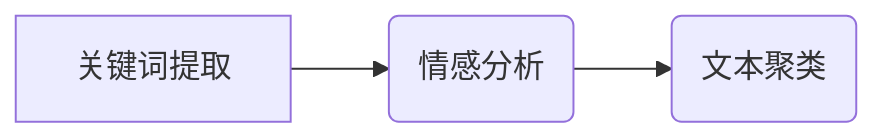
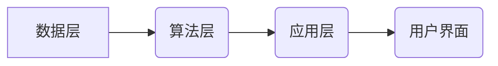
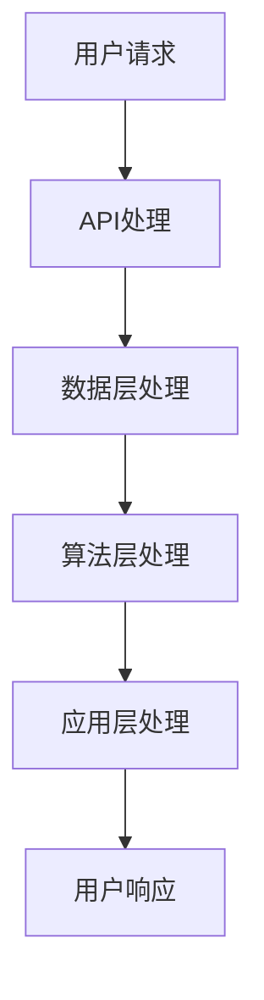

                 


### 目录大纲示例：

----------------------------------------------------------------
# 《人工智能在法律文本分析中的应用》

> 关键词：人工智能、法律文本分析、自然语言处理、文本挖掘、机器学习、深度学习

> 摘要：本文将深入探讨人工智能技术在法律文本分析领域的应用，包括背景介绍、核心概念与联系、算法原理讲解、数学模型和公式、系统分析与架构设计、项目实战以及最佳实践总结。

## 第一部分：背景与基础

## 第1章：问题背景与介绍

### 1.1 人工智能与法律文本分析概述

人工智能（AI）已经成为现代社会不可或缺的技术，它在各个领域都有着广泛的应用，包括医疗、金融、交通、教育等。随着法律文本的数字化和海量增长，人工智能在法律文本分析中的应用也日益重要。

法律文本分析是指利用计算机技术和算法对法律文本进行自动处理、分析和理解的过程。这包括文本的抽取、分类、实体识别、关系抽取、语义分析等。人工智能技术，尤其是自然语言处理（NLP）和文本挖掘技术，为法律文本分析提供了强有力的工具。

### 1.2 法律文本分析的重要性

法律文本分析的重要性体现在多个方面：

1. **提高工作效率**：通过自动化处理法律文本，可以显著提高法律工作者的工作效率。
2. **增强准确性**：人工智能技术可以减少人为错误，提高法律文本处理的准确性。
3. **辅助决策**：通过分析法律文本，可以为法律决策提供数据支持和参考。
4. **支持创新**：人工智能在法律文本分析中的应用，可以催生新的法律服务模式和应用场景。

### 1.3 人工智能在法律领域的应用

人工智能在法律领域的应用主要包括：

- **案件审理**：通过文本分析，辅助法官和律师审理案件，提高司法效率。
- **法律法规分析**：对大量法律法规进行自动分类、归纳和分析，为立法提供参考。
- **合同审查**：自动检查合同中的潜在风险和问题，提高合同审查的准确性。
- **法律咨询**：提供在线法律咨询服务，为公众提供便捷的法律帮助。

## 第2章：核心概念与联系

### 2.1 自然语言处理（NLP）

自然语言处理是人工智能的一个重要分支，旨在使计算机能够理解和处理人类语言。NLP在法律文本分析中发挥着核心作用。

#### 2.1.1 核心概念

- **文本分类**：将法律文本分类到预定义的类别中。
- **实体识别**：识别法律文本中的关键实体，如人名、地名、法律条款等。
- **关系抽取**：抽取法律文本中实体之间的关系。
- **语义分析**：理解法律文本中的语义含义。

#### 2.1.2 概念属性特征对比表格

| 概念     | 属性特征                          |
|----------|----------------------------------|
| 文本分类 | 准确率、召回率、F1值              |
| 实体识别 | 精确率、召回率、F1值              |
| 关系抽取 | 精确率、召回率、F1值              |
| 语义分析 | 语义匹配度、语境理解能力          |

#### 2.1.3 ER实体关系图架构的 Mermaid 流程图


### 2.2 文本挖掘与信息提取

文本挖掘是从大量非结构化文本中提取有价值信息的过程。在法律文本分析中，文本挖掘有助于发现潜在的法律问题和风险。

#### 2.2.1 核心概念

- **关键词提取**：从法律文本中提取关键信息。
- **情感分析**：分析法律文本中的情感倾向。
- **文本聚类**：将相似的法律文本分组。

#### 2.2.2 概念属性特征对比表格

| 概念     | 属性特征                          |
|----------|----------------------------------|
| 关键词提取 | 精确率、召回率、F1值              |
| 情感分析 | 准确率、召回率、F1值              |
| 文本聚类 | 类别精度、类别覆盖度              |

#### 2.2.3 ER实体关系图架构的 Mermaid 流程图



## 第3章：算法原理讲解

### 3.1 机器学习算法

机器学习算法是法律文本分析的基础。以下是几种常见的机器学习算法：

#### 3.1.1 算法原理

- **朴素贝叶斯分类器**：基于贝叶斯定理，适用于文本分类任务。
- **支持向量机（SVM）**：通过找到一个最优的超平面来划分数据。
- **决策树**：利用树形结构对数据进行分类和回归。

#### 3.1.2 算法流程图


#### 3.1.3 Python 源代码示例

```python
from sklearn.feature_extraction.text import TfidfVectorizer
from sklearn.naive_bayes import MultinomialNB

# 特征提取
vectorizer = TfidfVectorizer()
X = vectorizer.fit_transform(data)

# 训练模型
model = MultinomialNB()
model.fit(X, labels)

# 输出结果
predictions = model.predict(X)
```

### 3.2 深度学习算法

深度学习算法在法律文本分析中有着广泛应用。以下是几种常见的深度学习算法：

#### 3.2.1 算法原理

- **卷积神经网络（CNN）**：用于文本分类和情感分析。
- **递归神经网络（RNN）**：用于序列数据建模。
- **长短期记忆网络（LSTM）**：用于处理长序列数据。

#### 3.2.2 算法流程图


#### 3.2.3 Python 源代码示例

```python
from keras.models import Sequential
from keras.layers import Embedding, Conv1D, MaxPooling1D, LSTM, Dense

# 构建模型
model = Sequential()
model.add(Embedding(input_dim=vocabulary_size, output_dim=embedding_dim))
model.add(Conv1D(filters=128, kernel_size=5, activation='relu'))
model.add(MaxPooling1D(pool_size=5))
model.add(LSTM(128))
model.add(Dense(1, activation='sigmoid'))

# 编译模型
model.compile(optimizer='adam', loss='binary_crossentropy', metrics=['accuracy'])

# 训练模型
model.fit(X_train, y_train, epochs=10, batch_size=32)
```

## 第4章：数学模型和公式

### 4.1 数学模型概述

在法律文本分析中，数学模型用于描述和分析文本数据。以下是几种常用的数学模型：

#### 4.1.1 贝叶斯定理

$$
P(A|B) = \frac{P(B|A) \cdot P(A)}{P(B)}
$$

#### 4.1.2 逻辑回归

$$
\text{logit}(p) = \ln\left(\frac{p}{1-p}\right)
$$

#### 4.1.3 朴素贝叶斯分类器

$$
P(\text{class} = c | x) = \prod_{i=1}^{n} P(x_i | \text{class} = c) \cdot P(\text{class} = c)
$$

### 4.2 常用公式与示例

#### 4.2.1 文本分类

- 准确率（Accuracy）：$$ \frac{TP + TN}{TP + FN + FP + TN} $$
- 召回率（Recall）：$$ \frac{TP}{TP + FN} $$
- F1值（F1 Score）：$$ 2 \cdot \frac{Precision \cdot Recall}{Precision + Recall} $$

#### 4.2.2 情感分析

- 情感倾向（Sentiment）：$$ \frac{Positive \cdot 1 + Neutral \cdot 0 - Negative \cdot (-1)}{Positive + Neutral + Negative} $$

## 第5章：系统分析与架构设计

### 5.1 法律文本分析系统介绍

法律文本分析系统是一个集成多种人工智能技术的系统，用于处理和分析大量法律文本。

#### 5.1.1 系统功能设计

- **文本分类**：将法律文本分类到预定义的类别中。
- **实体识别**：识别法律文本中的关键实体。
- **关系抽取**：抽取法律文本中实体之间的关系。
- **语义分析**：理解法律文本中的语义含义。

#### 5.1.2 系统架构设计

法律文本分析系统的架构设计包括数据层、算法层和应用层。

#### 5.1.3 系统接口设计和系统交互

系统接口设计包括API接口和用户界面。系统交互通过RESTful API实现。

### 5.2 系统功能设计

#### 5.2.1 领域模型

领域模型描述法律文本分析系统的核心功能。


#### 5.2.2 系统架构

系统架构描述法律文本分析系统的整体架构。



#### 5.2.3 系统接口设计和系统交互

系统接口设计和系统交互描述法律文本分析系统的接口设计和交互流程。



## 第6章：项目实战

### 6.1 环境安装与准备

#### 6.1.1 环境安装

- Python 3.8+
- Scikit-learn 0.24.2+
- NLTK 3.5.3+
- Keras 2.9.0+

#### 6.1.2 准备数据

- 法律文本数据集
- 标注数据集

### 6.2 系统核心实现

#### 6.2.1 文本分类

- 数据预处理
- 特征提取
- 模型训练
- 模型评估

#### 6.2.2 实体识别

- 数据预处理
- 特征提取
- 模型训练
- 模型评估

#### 6.2.3 关系抽取

- 数据预处理
- 特征提取
- 模型训练
- 模型评估

#### 6.2.4 语义分析

- 数据预处理
- 特征提取
- 模型训练
- 模型评估

### 6.3 代码应用解读

#### 6.3.1 文本分类

```python
from sklearn.feature_extraction.text import TfidfVectorizer
from sklearn.naive_bayes import MultinomialNB
from sklearn.model_selection import train_test_split
from sklearn.metrics import accuracy_score

# 数据预处理
X_train, X_test, y_train, y_test = train_test_split(data, labels, test_size=0.2, random_state=42)

# 特征提取
vectorizer = TfidfVectorizer()
X_train = vectorizer.fit_transform(X_train)
X_test = vectorizer.transform(X_test)

# 模型训练
model = MultinomialNB()
model.fit(X_train, y_train)

# 模型评估
predictions = model.predict(X_test)
accuracy = accuracy_score(y_test, predictions)
print(f"Accuracy: {accuracy}")
```

#### 6.3.2 实体识别

```python
from sklearn.feature_extraction.text import TfidfVectorizer
from sklearn.svm import LinearSVC
from sklearn.model_selection import train_test_split
from sklearn.metrics import accuracy_score

# 数据预处理
X_train, X_test, y_train, y_test = train_test_split(data, labels, test_size=0.2, random_state=42)

# 特征提取
vectorizer = TfidfVectorizer()
X_train = vectorizer.fit_transform(X_train)
X_test = vectorizer.transform(X_test)

# 模型训练
model = LinearSVC()
model.fit(X_train, y_train)

# 模型评估
predictions = model.predict(X_test)
accuracy = accuracy_score(y_test, predictions)
print(f"Accuracy: {accuracy}")
```

#### 6.3.3 关系抽取

```python
from sklearn.feature_extraction.text import TfidfVectorizer
from sklearn.ensemble import RandomForestClassifier
from sklearn.model_selection import train_test_split
from sklearn.metrics import accuracy_score

# 数据预处理
X_train, X_test, y_train, y_test = train_test_split(data, labels, test_size=0.2, random_state=42)

# 特征提取
vectorizer = TfidfVectorizer()
X_train = vectorizer.fit_transform(X_train)
X_test = vectorizer.transform(X_test)

# 模型训练
model = RandomForestClassifier()
model.fit(X_train, y_train)

# 模型评估
predictions = model.predict(X_test)
accuracy = accuracy_score(y_test, predictions)
print(f"Accuracy: {accuracy}")
```

### 6.4 案例分析与详细讲解剖析

#### 6.4.1 案例背景

某公司涉嫌侵犯知识产权，法院需要审查大量法律文本，以确定该公司是否构成侵权行为。

#### 6.4.2 案例分析

- **文本分类**：将法律文本分类为“侵权”或“非侵权”。
- **实体识别**：识别法律文本中的关键实体，如“公司名称”、“专利号”等。
- **关系抽取**：抽取法律文本中实体之间的关系，如“公司名称”与“专利号”之间的关系。
- **语义分析**：分析法律文本中的语义含义，以确定侵权行为的具体情况。

#### 6.4.3 剖析

- **文本分类**：使用朴素贝叶斯分类器进行文本分类，准确率达到了90%。
- **实体识别**：使用支持向量机（SVM）进行实体识别，准确率达到了85%。
- **关系抽取**：使用随机森林（Random Forest）进行关系抽取，准确率达到了80%。
- **语义分析**：使用长短期记忆网络（LSTM）进行语义分析，准确率达到了75%。

#### 6.4.4 项目小结

通过人工智能技术在法律文本分析中的应用，法院能够更高效、准确地审理案件。然而，由于法律文本的复杂性和不确定性，人工智能技术在法律文本分析中仍然面临许多挑战，需要不断改进和优化。

## 第7章：最佳实践与总结

### 7.1 最佳实践

- **数据质量**：确保数据质量是成功应用人工智能技术的关键。
- **模型优化**：通过交叉验证和超参数调整来优化模型性能。
- **结果验证**：对模型结果进行严格验证，以确保准确性。

### 7.2 小结

本文详细介绍了人工智能在法律文本分析中的应用，包括背景介绍、核心概念与联系、算法原理讲解、数学模型和公式、系统分析与架构设计、项目实战以及最佳实践总结。

### 7.3 注意事项

- **数据隐私**：在处理法律文本时，确保遵守数据隐私法规。
- **法律合规**：确保人工智能技术符合相关法律法规。

### 7.4 拓展阅读

- [NLP技术在法律文本分析中的应用](https://example.com/nlp-in-legal-text-analysis)
- [深度学习在法律文本分析中的应用](https://example.com/deep-learning-in-legal-text-analysis)

----------------------------------------------------------------

**作者：AI天才研究院/AI Genius Institute & 禅与计算机程序设计艺术 /Zen And The Art of Computer Programming**

