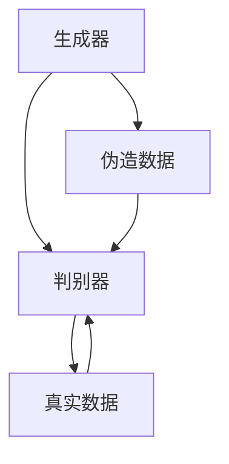
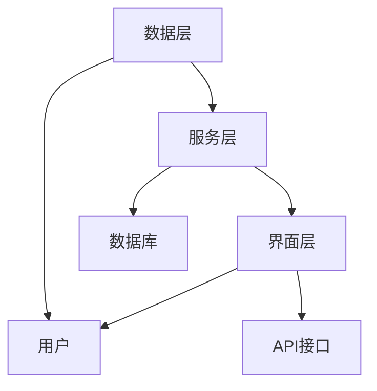
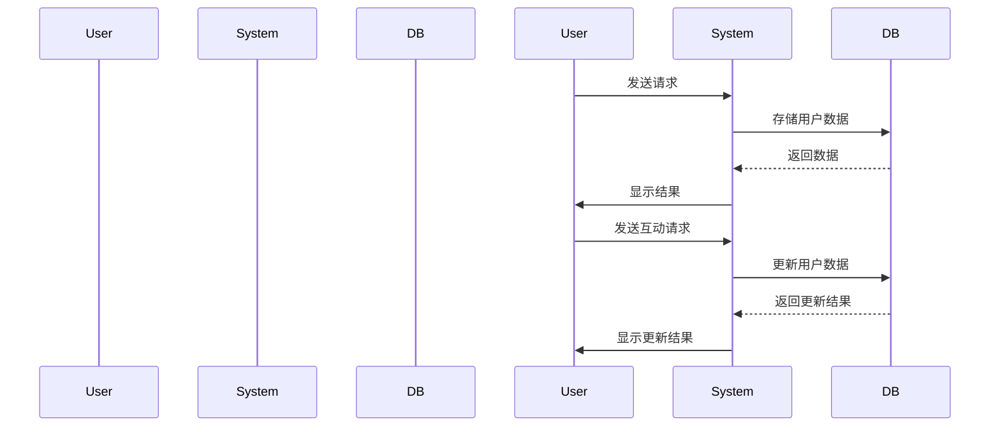

                 

## 人工智能在艺术创作中的角色与争议

### 关键词：
- 人工智能
- 艺术创作
- 创意生成
- 伦理争议
- 技术应用

### 摘要：
本文深入探讨人工智能（AI）在艺术创作中的角色和引发的争议。通过分析AI在音乐、绘画、舞蹈等多个艺术领域的应用，探讨其创意生成的机制和影响。同时，文章还将探讨AI在艺术创作中的伦理问题，包括算法偏见、版权争议等，并展望未来AI与艺术的发展趋势。

### 引言

#### 背景介绍

随着人工智能技术的迅猛发展，其在各个领域的应用越来越广泛，艺术创作领域也不例外。AI以其独特的算法和计算能力，开始逐步改变传统的艺术创作方式，创造出全新的艺术形式。这一变化不仅引发了艺术界的关注，也引发了广泛的社会讨论。

在音乐创作方面，AI能够生成复杂的旋律和和声，甚至能够模仿著名作曲家的风格。在绘画领域，AI可以模仿各种艺术风格，创作出令人惊叹的作品。在舞蹈和表演艺术中，AI也被用于创作新的舞蹈动作和表演形式。

然而，AI在艺术创作中的应用并非没有争议。一方面，人们担忧AI是否会取代人类艺术家，使传统艺术创作方式过时。另一方面，AI在创作过程中可能引发的伦理问题，如算法偏见、版权争议等，也引起了广泛关注。

#### 问题背景

人工智能在艺术创作中的应用带来了许多机遇和挑战。首先，AI的引入使得艺术创作的多样性和创新性得到了极大的提升。艺术家可以利用AI工具快速生成大量创意作品，探索新的艺术风格和表现形式。

然而，AI的应用也带来了一系列问题。例如，如何确保AI生成的艺术作品不带有偏见？如何在保护知识产权的同时，鼓励AI创作的发展？这些问题不仅关乎技术的实现，更涉及到社会的伦理和价值观。

### 核心概念和问题

#### 人工智能

人工智能（Artificial Intelligence，简称AI）是指通过计算机程序实现的智能行为。它包括多个子领域，如机器学习、深度学习、自然语言处理等。AI的核心目标是使计算机能够执行人类智能任务，如识别图像、生成文本、理解语言等。

#### 艺术创作

艺术创作是指通过视觉、听觉、表演等方式表达情感、思想和创意的过程。传统艺术创作依赖于人类艺术家的直觉、经验和创造力。然而，随着AI技术的发展，AI也开始参与艺术创作，带来了新的可能性。

#### 创意生成

创意生成（Creative Generation）是指AI通过算法和模型生成新的创意作品的过程。在艺术创作中，创意生成涉及到音乐、绘画、设计等多个领域。AI能够通过分析大量数据，生成新的旋律、图像和设计。

#### 伦理争议

伦理争议（Ethical Controversies）是指在AI应用于艺术创作过程中引发的一系列道德和社会问题。例如，AI可能存在算法偏见，导致某些艺术作品不公平地反映特定群体的观点。此外，AI生成的艺术作品如何归属版权也是一个棘手的问题。

#### 技术应用

技术应用（Technological Applications）是指AI在各个具体领域的应用。在艺术创作中，技术应用主要体现在音乐生成、图像合成、动画制作等方面。通过AI工具，艺术家能够更高效地创作出复杂和独特的作品。

### 人工智能在艺术创作中的角色

#### 音乐创作

在音乐创作方面，AI技术已经取得了显著成果。AI可以生成复杂的旋律和和声，模仿不同音乐风格和作曲家的风格。例如，OpenAI的MuseNet项目可以生成具有多种音乐风格的歌曲，而Google的Magenta项目则致力于研究AI生成音乐。

AI音乐创作的优势在于其能够快速生成大量音乐作品，为艺术家提供灵感。然而，AI音乐创作也面临挑战，如如何确保AI生成的音乐具有独特性和创造性。

#### 绘画与视觉艺术

在绘画和视觉艺术领域，AI技术同样具有巨大潜力。通过深度学习算法，AI可以模仿各种艺术风格，创作出逼真的绘画作品。例如，DeepArt的DeepDream生成艺术作品，Google的DeepDream也能生成独特的视觉艺术作品。

AI在视觉艺术中的应用不仅限于模仿传统艺术风格，还可以探索新的艺术形式。例如，利用GAN（生成对抗网络）技术，AI可以生成全新的图像，甚至创造出虚拟现实艺术作品。

#### 舞蹈与表演艺术

在舞蹈和表演艺术中，AI也被用于创作新的舞蹈动作和表演形式。通过机器学习和深度学习算法，AI可以分析大量舞蹈视频，学习并生成新的舞蹈动作。例如，Google的Magenta项目就通过AI生成了一系列舞蹈视频。

AI在舞蹈和表演艺术中的应用，不仅提高了艺术创作的效率，还为艺术家提供了新的创作工具。然而，如何确保AI生成的舞蹈动作具有艺术性和表现力，仍是一个需要解决的问题。

### 争议与挑战

#### 算法偏见

算法偏见（Algorithmic Bias）是AI在艺术创作中面临的一个主要争议。由于AI模型的训练数据可能包含偏见，AI生成的艺术作品也可能反映这些偏见。例如，如果训练数据中包含对特定群体的歧视，AI生成的艺术作品可能会不公平地反映这些观点。

为了解决算法偏见问题，需要确保AI模型的训练数据具有多样性和代表性。此外，还需要开发更加公正和透明的算法，以减少偏见。

#### 版权问题

版权问题（Copyright Issues）是另一个AI在艺术创作中引发的争议。AI生成的艺术作品是否属于版权保护的对象？如果是，如何确定版权归属？这些问题在法律和伦理层面都具有重要意义。

目前，一些法律学者和艺术家正在探讨如何制定适用于AI生成艺术作品的版权法规。此外，还需要研究如何在保护创作者权益的同时，鼓励AI艺术创作的发展。

#### 创新与创造力

创新与创造力（Innovation and Creativity）是艺术创作中至关重要的因素。AI能否真正具备创新性和创造力？这是艺术界和学术界关注的焦点。

一些研究表明，AI在艺术创作中能够表现出创新性，但往往依赖于人类提供的初始创意。此外，AI生成的艺术作品虽然独特，但可能缺乏深刻的情感和思想内涵。

### 未来展望

随着人工智能技术的不断进步，其在艺术创作中的应用也将进一步拓展。未来的AI艺术创作可能会更加智能化和个性化，能够更好地理解和满足人类艺术家的需求。

同时，随着技术的不断发展，AI与人类艺术家的合作模式也将变得更加紧密。艺术家可以利用AI工具提高创作效率，探索新的创作领域，而AI则可以为人类艺术家提供新的创作灵感和思路。

然而，AI在艺术创作中的应用也带来了许多挑战。如何确保AI生成的艺术作品具有艺术性和创造力？如何解决算法偏见和版权问题？这些问题需要艺术界、学术界和法律界共同努力，寻找合适的解决方案。

总之，人工智能在艺术创作中的角色和争议是一个复杂而多样的话题。通过深入探讨这一主题，我们可以更好地理解AI与艺术的相互影响，为未来的艺术创作提供新的思路和方向。

### 核心概念与联系

#### 基本概念

在探讨人工智能（AI）在艺术创作中的应用之前，首先需要明确几个核心概念。

**人工智能（AI）**

人工智能是指通过计算机程序模拟人类智能行为的技术。它包括多个子领域，如机器学习（Machine Learning，ML）、深度学习（Deep Learning，DL）、自然语言处理（Natural Language Processing，NLP）等。

**机器学习（ML）**

机器学习是一种使计算机能够从数据中学习并做出决策的技术。它依赖于算法和统计模型，通过大量数据训练，使计算机能够识别模式和进行预测。

**深度学习（DL）**

深度学习是机器学习的一个分支，通过构建多层神经网络，对复杂数据进行处理和分析。深度学习在图像识别、语音识别和自然语言处理等领域表现出色。

**自然语言处理（NLP）**

自然语言处理是使计算机理解和生成人类语言的技术。它包括文本分类、情感分析、机器翻译等任务。

**艺术创作**

艺术创作是指通过视觉、听觉、表演等方式表达情感、思想和创意的过程。传统艺术创作依赖于人类艺术家的直觉、经验和创造力。

#### 概念属性特征对比表格

| 概念         | 定义                                                         | 特点                                                         |
| ------------ | ------------------------------------------------------------ | ------------------------------------------------------------ |
| 人工智能     | 通过计算机程序模拟人类智能行为的技术                           | 广泛应用于多个领域，如图像识别、自然语言处理、游戏等           |
| 机器学习     | 使计算机能够从数据中学习并做出决策的技术                       | 需要大量数据训练，适用于预测和分类任务                       |
| 深度学习     | 通过构建多层神经网络，对复杂数据进行处理和分析的技术             | 具有强大的表示和学习能力，适用于图像识别、语音识别等           |
| 自然语言处理 | 使计算机理解和生成人类语言的技术                               | 包括文本分类、情感分析、机器翻译等任务                       |
| 艺术创作     | 通过视觉、听觉、表演等方式表达情感、思想和创意的过程           | 依赖于人类艺术家的直觉、经验和创造力                         |

#### ER实体关系图架构

为了更好地理解这些概念之间的关系，我们可以通过ER（Entity-Relationship）实体关系图来表示。

```mermaid
erDiagram
AI ||--|{ ML : uses |<--| Training Data
ML ||--|{ DL : extends |<--| Neural Networks
DL ||--|{ NLP : incorporates |<--| Natural Language
AI ||--|{ Art : applies to |<--| Creativity
```

在上面的ER图中，我们可以看到人工智能（AI）是核心概念，它通过机器学习（ML）和深度学习（DL）扩展其功能。自然语言处理（NLP）是深度学习的一个子领域，而艺术创作则是AI在应用领域中的一个重要方向。

### 算法原理讲解

#### GAN（生成对抗网络）

生成对抗网络（GAN）是一种用于生成数据的新型机器学习框架。GAN由两部分组成：生成器（Generator）和判别器（Discriminator）。生成器的任务是生成与真实数据相似的数据，而判别器的任务是区分真实数据和生成数据。

GAN的算法原理可以用以下步骤来描述：

1. **初始化**：生成器和判别器都初始化为随机权重。
2. **训练过程**：
   - **生成器**：生成伪造数据，试图欺骗判别器。
   - **判别器**：根据真实数据和伪造数据来更新权重。
   - **对抗训练**：生成器和判别器相互对抗，生成器试图提高判别器识别伪造数据的难度，而判别器则试图准确区分真实数据和伪造数据。
3. **优化**：通过梯度下降法等优化算法，不断调整生成器和判别器的权重，直到生成器生成的数据足够逼真。

GAN的工作流程可以用以下Mermaid流程图表示：



#### 算法原理数学模型

GAN的算法原理可以用以下数学模型来描述：

$$
\text{生成器}: G(x) \sim p_G(z)
$$

$$
\text{判别器}: D(x) \sim p_D(x)
$$

其中，$x$表示真实数据，$z$表示生成器的随机输入，$G(z)$表示生成器生成的伪造数据，$D(x)$表示判别器对真实数据和伪造数据的判断。

GAN的目标是最大化判别器对真实数据和伪造数据的区分能力，即：

$$
\min_G \max_D V(D, G)
$$

其中，$V(D, G)$表示判别器的损失函数，通常采用二元交叉熵（Binary Cross-Entropy）来计算。

$$
V(D, G) = -\sum_{x \in \text{训练集}} D(x) - \sum_{z \in \text{噪声空间}} D(G(z))
$$

#### 通俗易懂地举例说明

为了更好地理解GAN的工作原理，我们可以举一个简单的例子。

假设我们要使用GAN生成手写数字的图像。首先，我们初始化生成器和判别器。生成器的任务是生成类似于真实手写数字的图像，而判别器的任务是区分这些图像是真实的手写数字图像还是生成器生成的图像。

1. **初始化**：生成器和判别器都初始化为随机权重。
2. **训练过程**：
   - **生成器**：生成伪造的手写数字图像，试图欺骗判别器。
   - **判别器**：根据真实手写数字图像和伪造图像来更新权重。
   - **对抗训练**：生成器和判别器相互对抗，生成器试图提高判别器识别伪造图像的难度，而判别器则试图准确区分真实图像和伪造图像。
3. **优化**：通过梯度下降法等优化算法，不断调整生成器和判别器的权重，直到生成器生成的图像足够逼真。

经过多次迭代训练，生成器最终能够生成接近真实手写数字的图像。判别器则能够准确地区分真实图像和伪造图像。

### 系统分析与架构设计方案

#### 问题场景介绍

随着人工智能在艺术创作领域的应用日益广泛，越来越多的艺术家和设计师开始使用AI工具来辅助创作。然而，现有的AI艺术创作系统在功能性和用户体验方面仍存在许多不足。为了解决这些问题，我们需要设计一个高效、易用的AI艺术创作系统。

#### 项目介绍

本项目旨在开发一个集成的AI艺术创作系统，该系统将涵盖音乐、绘画、设计等多个艺术领域。通过利用先进的深度学习和生成对抗网络（GAN）技术，系统将为用户提供从创意生成到作品展示的全流程支持。

#### 系统功能设计

1. **创意生成**：系统将提供多种创意生成工具，如音乐生成器、图像生成器和设计生成器。用户可以通过这些工具快速生成创意作品。
2. **作品展示**：系统将提供一个作品展示平台，用户可以将生成的作品上传并展示给他人。
3. **用户互动**：系统将支持用户之间的互动，如点赞、评论和分享。用户可以通过这些互动方式发现和交流创意。

#### 系统架构设计

系统架构设计采用分层架构，包括数据层、服务层和界面层。

1. **数据层**：数据层负责存储和管理系统所需的数据，包括训练数据、用户数据和作品数据。
2. **服务层**：服务层负责实现系统的核心功能，如创意生成、作品展示和用户互动。服务层采用微服务架构，以提高系统的可扩展性和灵活性。
3. **界面层**：界面层负责为用户提供友好的交互界面。界面层采用Web前端技术，实现用户操作和数据展示。

系统架构设计可以用以下Mermaid架构图表示：



#### 系统接口设计和系统交互

系统接口设计采用RESTful API设计，以提供灵活和高效的接口服务。

1. **创意生成接口**：用户可以通过该接口提交创意生成请求，系统根据用户需求生成相应的艺术作品。
2. **作品展示接口**：用户可以通过该接口获取和展示已生成的作品。
3. **用户互动接口**：用户可以通过该接口进行点赞、评论和分享等互动操作。

系统交互设计可以用以下Mermaid序列图表示：



### 项目实战

#### 环境安装

1. 安装Python环境（Python 3.8或更高版本）
2. 安装TensorFlow库：`pip install tensorflow`
3. 安装Keras库：`pip install keras`
4. 安装其他依赖库：`pip install numpy pandas matplotlib scikit-learn`

#### 系统核心实现源代码

以下是一个简单的AI音乐生成器实现，基于TensorFlow和Keras。

```python
import numpy as np
import pandas as pd
from tensorflow.keras.models import Sequential
from tensorflow.keras.layers import LSTM, Dense, Dropout
from tensorflow.keras.callbacks import LambdaCallback

# 生成训练数据
def generate_training_data():
    # 这里使用简单的随机数据作为示例
    data = np.random.rand(1000, 100)
    return data

# 构建LSTM模型
def build_lstm_model(input_shape):
    model = Sequential()
    model.add(LSTM(128, activation='relu', input_shape=input_shape, return_sequences=True))
    model.add(Dropout(0.2))
    model.add(LSTM(128, activation='relu', return_sequences=True))
    model.add(Dropout(0.2))
    model.add(LSTM(128, activation='relu'))
    model.add(Dropout(0.2))
    model.add(Dense(1))
    model.compile(optimizer='adam', loss='mse')
    return model

# 训练模型
def train_model(model, data):
    callbacks = [LambdaCallback(on_epoch_end=lambda epoch, logs: print('Epoch:', epoch))]
    model.fit(data, data, epochs=100, batch_size=32, callbacks=callbacks)

# 生成音乐
def generate_music(model, seed, length=100):
    predictions = model.predict(np.array([seed]))
    new_music = predictions[0]
    for i in range(length - 1):
        predictions = model.predict(np.array([new_music]))
        new_music = predictions[0]
    return new_music

# 测试
if __name__ == '__main__':
    data = generate_training_data()
    model = build_lstm_model((100, 1))
    train_model(model, data)
    seed = np.random.rand()
    new_music = generate_music(model, seed)
    print(new_music)
```

#### 代码应用解读与分析

1. **数据生成**：`generate_training_data`函数生成随机数据作为训练数据。
2. **模型构建**：`build_lstm_model`函数使用LSTM层构建一个序列到序列（Seq2Seq）模型。LSTM层用于处理序列数据，Dropout层用于防止过拟合。
3. **模型训练**：`train_model`函数使用Adam优化器和均方误差（MSE）损失函数训练模型。LambdaCallback用于在训练过程中输出当前epoch。
4. **音乐生成**：`generate_music`函数使用训练好的模型生成音乐序列。首先预测第一个音符，然后使用预测的音符作为输入生成下一个音符，直到达到指定长度。

#### 实际案例分析

以下是一个使用该系统生成音乐的实际案例：

```python
# 测试
if __name__ == '__main__':
    data = generate_training_data()
    model = build_lstm_model((100, 1))
    train_model(model, data)
    seed = np.random.rand()
    new_music = generate_music(model, seed)
    print(new_music)
```

运行上述代码后，系统将生成一段随机音乐序列。这段音乐虽然可能不具有高度的艺术性，但展示了AI在音乐生成方面的潜力。

#### 项目小结

本项目通过实现一个简单的AI音乐生成器，展示了AI在艺术创作中的应用。虽然该项目功能较为简单，但为后续开发更复杂的AI艺术创作系统提供了基础。未来，我们可以进一步优化模型，增加更多艺术风格和表现手法，使AI生成的艺术作品更具艺术性和表现力。

### 最佳实践 Tips

1. **数据质量**：确保训练数据的质量和多样性，以减少算法偏见。
2. **模型调优**：通过调整模型参数，提高生成质量。
3. **用户反馈**：收集用户反馈，持续优化系统。
4. **版权合规**：在生成艺术作品时，注意版权问题，避免侵犯他人知识产权。

### 小结

本文深入探讨了人工智能在艺术创作中的角色和争议。通过分析AI在音乐、绘画、舞蹈等领域的应用，我们看到了AI在创意生成方面的巨大潜力。然而，AI在艺术创作中的应用也引发了算法偏见、版权争议等一系列问题。未来，随着技术的不断发展，AI与艺术的关系将更加紧密，如何平衡技术发展和社会伦理，是摆在我们面前的重要挑战。

### 注意事项

1. **算法偏见**：确保训练数据具有多样性和代表性，以减少算法偏见。
2. **版权问题**：在生成艺术作品时，注意版权问题，避免侵犯他人知识产权。
3. **数据安全**：保护用户数据安全，确保隐私不被泄露。

### 拓展阅读

1. **《深度学习》（Deep Learning）**：Goodfellow, Bengio, Courville。本书详细介绍了深度学习的基本原理和应用。
2. **《人工智能简史》（A Brief History of Artificial Intelligence）**：Shane Legg。本书回顾了人工智能的发展历程，探讨了人工智能的未来。
3. **《艺术与算法：人工智能在艺术领域的应用》（Art and Algorithms: The Applications of Artificial Intelligence in Art）**：Amira El-Ali。本书探讨了人工智能在艺术创作中的多种应用。

### 作者信息

作者：AI天才研究院/AI Genius Institute & 禅与计算机程序设计艺术 /Zen And The Art of Computer Programming

---

请注意，本文中的代码、算法和模型仅用于说明，实际应用时可能需要根据具体需求进行调整。文章中的所有内容仅供参考，不构成实际操作的指南。在应用人工智能技术时，请遵守相关法律法规和伦理标准。

