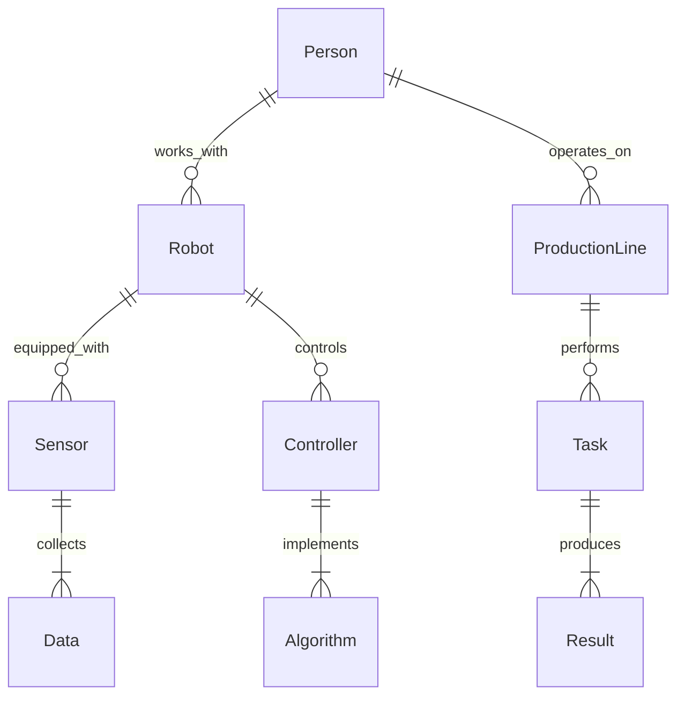
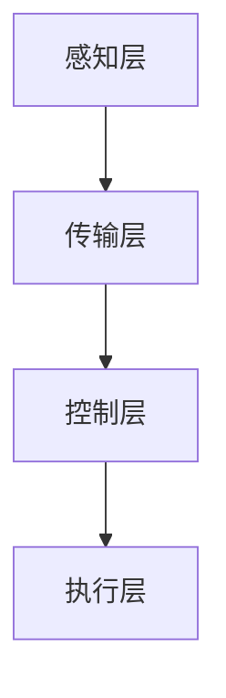
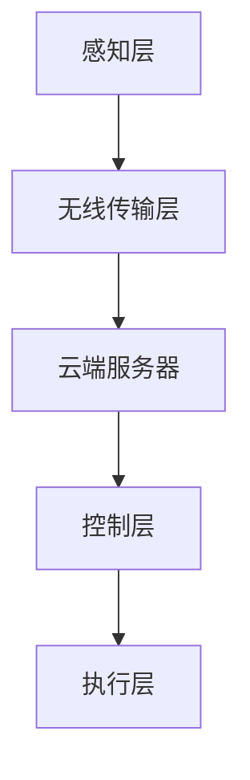

                 

### 人机协同生产背景

#### 1.1 问题背景

在全球化经济一体化和市场竞争日益激烈的背景下，制造业和服务业的转型升级成为推动产业发展的关键。传统的人工生产方式面临生产效率低下、产品质量波动大、生产成本高、劳动强度大等问题，已经无法满足现代企业对于生产效率和产品质量的要求。因此，自动化和智能化成为提升产业竞争力的必然选择。人机协同生产作为自动化和智能化的重要实现方式，应运而生。

人机协同生产是指通过人与机器人的协作，实现生产过程的自动化和智能化，从而提高生产效率、保证产品质量、降低生产成本。其核心思想是充分利用人的智能和机器的优势，实现两者的互补和协同。人机协同生产不仅能够提升生产效率，还能够减轻工人的劳动强度，提高生产质量，降低生产成本。

#### 1.2 人机协同的重要性

人机协同生产的重要性主要体现在以下几个方面：

1. **提升生产效率**：机器人能够在规定的时间内完成复杂、重复性高的工作，从而显著提高生产效率。通过人与机器人的协同作业，可以实现生产过程的连续化和自动化，减少人为操作的干扰，提高整体生产效率。

2. **保证产品质量**：机器人具有高精度的控制和稳定的工作性能，能够有效保证生产过程中产品质量的稳定性和一致性。人机协同生产可以减少人为操作的不确定性和误差，从而降低产品质量波动。

3. **降低生产成本**：机器人能够在短时间内完成大量的工作，可以显著降低生产成本。此外，人机协同生产还能够减少人工成本，提高生产过程的灵活性和适应性。

4. **提高生产灵活性**：通过人与机器人的协同，可以根据生产需求进行灵活调整，实现多种产品的快速切换和生产，提高生产线的适应性和灵活性。

#### 1.3 多功能机器人的崛起

多功能机器人作为人机协同生产的关键载体，其发展经历了从单一功能到多功能、从简单操作到复杂操作的过程。随着人工智能、传感器技术、控制技术等领域的快速发展，多功能机器人逐渐成为各行业转型升级的重要工具。

多功能机器人具有以下几个显著特点：

1. **灵活性**：多功能机器人能够适应不同的工作场景和任务需求，通过软件配置可以实现多种功能的切换。

2. **自主性**：多功能机器人具备一定的自主决策能力，可以通过传感器和环境感知技术实现自主导航和任务执行。

3. **智能化**：多功能机器人通过集成人工智能技术，能够进行数据分析和智能决策，提高生产过程的智能化水平。

4. **协作性**：多功能机器人能够与人类工人协同工作，通过通信和交互技术实现人与机器的紧密协作。

多功能机器人的崛起为人机协同生产提供了强有力的技术支持，推动了产业升级和转型。在未来，多功能机器人将在各行业得到更广泛的应用，成为推动社会生产力发展的重要力量。

### 核心概念

在探讨人机协同生产时，了解相关的核心概念是至关重要的。以下是对人机协同生产及相关关键词的定义和解释：

#### 1.1 人机协同的定义

人机协同（Human-Robot Collaboration，HRC）是指人类与机器人通过协作完成特定任务的一种工作模式。在这一模式中，人类和机器人各自发挥各自的优势，实现高效、安全的工作流程。人机协同的核心在于利用人类的智慧和机器人的力量，通过信息交换和任务分配，共同完成复杂的任务。

#### 1.2 多功能机器人的特点

多功能机器人（Multifunctional Robot）是指具备多种功能，能够适应不同任务需求并自动调整自身行为的机器人。其主要特点包括：

- **多任务处理能力**：多功能机器人能够根据任务需求进行快速切换，实现多种功能的整合。
- **自主性**：通过人工智能和传感器技术，多功能机器人具备一定的自主决策和导航能力。
- **适应性**：多功能机器人可以通过软件配置实现功能扩展，适应不同工作场景的需求。
- **协作性**：多功能机器人能够与人类工人协同工作，通过通信和交互技术实现紧密协作。

#### 1.3 人机协同生产的边界与外延

人机协同生产的边界涉及机器人与人类在特定环境下的协作范围，其外延则包括更广泛的应用场景。具体来说：

- **边界**：人机协同生产的边界主要指在生产过程中，机器人和人类工人之间的安全距离、协作方式以及任务分配等方面。
- **外延**：人机协同生产的外延则涵盖从工厂生产到服务业、医疗、教育等领域的应用。例如，在服务业中，多功能机器人可以应用于餐饮、物流、医疗等服务行业；在医疗领域，机器人可以协助医生完成手术和护理工作；在教育领域，机器人可以辅助教学和个性化学习。

#### 1.4 人机协同生产的关键要素

为了实现高效的人机协同生产，以下几个关键要素是必不可少的：

- **传感器与感知系统**：传感器用于检测环境信息，感知系统则通过分析传感器数据，为机器人和人类提供决策支持。
- **控制系统**：控制系统负责协调机器人和人类的动作，确保生产过程的顺利进行。
- **通信与网络技术**：通信与网络技术是实现机器人和人类之间信息交换的基础，确保实时性和稳定性。
- **人工智能与机器学习**：人工智能技术可以帮助机器人进行自主决策和优化生产流程，提高生产效率。

通过以上对核心概念的解释，我们可以对人机协同生产有一个更加全面和深入的理解，为后续章节的讨论打下基础。

### 概念结构

为了更好地理解人机协同生产，我们需要深入探讨其核心要素和关键结构。以下是人机协同生产的主要组成部分及其相互关系。

#### 1. 多功能机器人的结构组成

多功能机器人的结构主要包括以下几个部分：

- **机械结构**：机械结构是机器人的物理形态，包括臂部、关节、底盘等，负责完成具体的操作任务。
- **控制系统**：控制系统是机器人的“大脑”，负责接收输入信息、执行计算和决策，控制机械结构的运动。
- **传感器与感知系统**：传感器用于检测外部环境信息，如视觉、触觉、力觉等，感知系统则对这些信息进行解析和处理。
- **通信与网络模块**：通信模块负责与其他设备或机器人进行数据交换，网络模块则实现联网功能，确保信息传输的实时性和可靠性。

#### 2. 人机协同生产的关键要素

人机协同生产涉及多个关键要素，以下是这些要素及其相互关系：

- **人机协作界面**：人机协作界面是人与机器人之间的交互通道，通过视觉、声音、触觉等方式实现信息的传递和反馈。这一界面设计直接影响人机协作的效率和安全性。
- **任务分配与调度**：任务分配与调度是确保生产过程顺利进行的关键环节，通过分析任务需求和生产资源，合理分配任务并调整工作流程。
- **控制系统架构**：控制系统架构是整个协同生产的核心，包括控制算法、决策模型、实时数据处理等，确保机器人和人类能够高效协作。
- **传感器与感知系统**：传感器与感知系统提供环境信息，通过数据融合和处理，帮助机器人和人类更好地理解工作环境，做出合理的决策。
- **通信与网络技术**：通信与网络技术确保信息传输的实时性和可靠性，为协同生产提供稳定的技术支持。

#### 3. 概念属性特征对比表格

为了更直观地理解各要素的特点和关系，我们可以通过对比表格来展示它们的属性特征：

| 要素       | 描述                                       | 关键属性特征对比                    |
|------------|--------------------------------------------|-------------------------------------|
| 机械结构   | 机器人的物理形态，负责执行具体任务。         | 材质：金属/塑料；精度：高/中/低；负载能力：大/中/小 |
| 控制系统   | 负责机器人的运动控制和决策。                 | 算法：传统/智能；响应速度：快/慢；稳定性：高/低 |
| 传感器与感知系统 | 检测外部环境信息，提供感知数据。           | 类型：视觉/触觉/力觉；精度：高/中/低；响应速度：快/慢 |
| 通信与网络技术 | 实现信息交换和远程控制。                   | 协议：有线/无线；速度：高/中/低；可靠性：高/低 |

#### 4. ER实体关系图架构

为了更好地理解人机协同生产中各要素之间的关系，我们可以通过ER（实体关系）图来展示其架构。以下是人机协同生产的主要实体及其关系：



通过ER图，我们可以清晰地看到人机协同生产中各实体之间的关联和作用，这有助于进一步理解整个系统的运行机制。

### 制造业中的应用

#### 2.1 制造业面临的挑战

制造业作为国民经济的重要支柱，其转型升级面临着诸多挑战。首先，随着市场需求的变化和消费者对产品质量和效率要求的提高，制造业需要不断提升生产效率以满足市场需求。然而，传统的人工生产方式效率低下、生产周期长，已经无法满足现代企业的要求。其次，产品质量的保障也是制造业面临的重大挑战。在传统生产方式中，由于人工操作的不可控性，产品质量波动大，一致性差，影响了企业的品牌形象和市场份额。此外，生产成本的持续上升也是制造业面临的压力。随着劳动力成本的不断提高，企业需要寻找新的生产方式来降低成本，提高竞争力。

#### 2.2 多功能机器人在制造业的应用

多功能机器人作为制造业自动化和智能化的重要载体，其在制造业中的应用越来越广泛。以下是一些典型的应用案例：

1. **自动化生产线**：多功能机器人在自动化生产线中的应用最为广泛。通过集成机械臂、传感器、控制模块等，多功能机器人能够完成从原料处理、加工到成品包装的整个生产过程。例如，在一些汽车制造厂，多功能机器人被用于焊接、喷涂、装配等环节，大大提高了生产效率和质量。

2. **自动化仓储与物流**：在物流和仓储领域，多功能机器人同样发挥了重要作用。通过自主导航和智能调度，多功能机器人能够高效完成货物的搬运、分拣、码放等任务。例如，一些大型电商仓库中，多功能机器人被用于自动化分拣系统，实现了高效的物流配送。

3. **质量检测与维护**：多功能机器人还广泛应用于质量检测和维护领域。通过集成多种传感器，多功能机器人能够对产品进行全面的检测，发现潜在的质量问题。例如，在电子制造业中，多功能机器人被用于检测产品的导电性、外观等，确保产品质量。

#### 2.3 应用效果分析

多功能机器人在制造业中的应用效果显著，具体表现在以下几个方面：

1. **提高生产效率**：多功能机器人能够连续、高效地完成生产任务，显著提高了生产效率。与传统人工生产方式相比，机器人的工作效率更高，生产周期更短，能够更好地满足市场需求。

2. **保证产品质量**：通过高精度的控制和稳定的运行性能，多功能机器人能够确保生产过程中产品质量的稳定性和一致性。机器人能够在精确的参数范围内进行操作，减少了人为操作的误差，提高了产品质量。

3. **降低生产成本**：多功能机器人能够显著降低生产成本，主要体现在以下几个方面：首先，机器人可以连续工作，无需休息，大大减少了人工成本。其次，机器人能够进行多任务处理，减少了设备闲置时间，提高了设备利用率。最后，机器人能够降低原材料和能源的消耗，进一步降低了生产成本。

4. **提高生产灵活性**：多功能机器人可以根据不同的生产任务进行快速切换和调整，提高了生产线的灵活性。在多变的市场需求下，多功能机器人能够迅速适应，实现多种产品的快速切换和生产，提高了企业的市场竞争力。

#### 2.4 制造业应用总结

尽管多功能机器人在制造业中取得了显著的成效，但在实际应用中也存在一些问题：

1. **高成本**：多功能机器人的购置和运行成本较高，这对中小企业来说是一个较大的负担。因此，如何在降低成本的同时提高效益，是一个亟待解决的问题。

2. **技术瓶颈**：尽管多功能机器人在某些领域已经取得了突破，但其在复杂环境下的适应能力和自主决策能力仍有待提高。例如，在复杂的生产环境和多变的任务需求下，机器人的行为控制和任务调度需要更加智能化和灵活。

3. **安全与伦理问题**：随着多功能机器人在制造业中的应用越来越广泛，安全问题也逐渐凸显。如何确保机器人和人类的安全，如何处理机器人与人类之间的伦理关系，是需要深入探讨的问题。

总之，多功能机器人在制造业中的应用前景广阔，但同时也面临诸多挑战。未来，需要通过技术创新和产业合作，进一步推动多功能机器人在制造业中的应用，实现人机协同生产的高效、安全和可持续发展。

#### 2.5 制造业应用发展趋势

在制造业中，多功能机器人的应用正朝着更加智能化、自适应化和高效化的方向发展。以下是未来几年制造业应用多功能机器人的几个发展趋势：

1. **智能化生产**：随着人工智能技术的不断进步，未来多功能机器人将具备更加智能的生产能力。通过集成深度学习、机器视觉、自主导航等技术，机器人能够实现自主决策、自主学习和自适应调整，提高生产过程的智能化水平。

2. **自适应生产**：为了应对市场需求的变化和生产任务的多样性，多功能机器人将具备更强的自适应能力。通过传感器和感知系统的优化，机器人能够实时感知环境变化，调整自身行为和操作策略，实现灵活、高效的生产。

3. **系统集成**：多功能机器人的应用将更加注重系统集成，实现机器人与生产系统的无缝衔接。通过大数据分析和工业互联网技术，构建智能化生产平台，实现生产线的智能化管理和优化，提高生产效率和产品质量。

4. **人机协作**：人机协作将更加紧密和高效。通过优化人机交互界面和协作机制，实现人与机器人之间的无缝协作，提高生产效率和质量。未来，多功能机器人将不仅是一个生产工具，更是一个合作伙伴。

5. **绿色制造**：随着环保意识的提升，绿色制造将成为未来制造业的重要趋势。多功能机器人通过提高生产效率、降低能源消耗和减少废弃物排放，为实现绿色制造提供技术支持。

总之，未来几年，多功能机器人在制造业中的应用将迎来新的发展机遇，通过技术创新和产业升级，推动制造业实现高效、智能和可持续的发展。

### 服务业中的应用

#### 3.1 服务业面临的挑战

服务业在国民经济中扮演着重要角色，但随着社会的发展和消费者需求的变化，服务业也面临着一系列挑战。首先，服务效率的提升需求愈发突出。消费者对服务质量和效率的要求越来越高，传统的手工服务方式已经难以满足市场需求。其次，服务质量保障问题也日益严峻。服务质量的不稳定性不仅会影响消费者的满意度，还会损害企业的声誉和市场竞争力。此外，成本控制也是服务业面临的重大挑战。随着劳动力成本的持续上升，如何通过技术手段降低运营成本，提高服务效率，成为服务业发展的重要课题。

#### 3.2 多功能机器人在服务业的应用

多功能机器人在服务业中的应用逐渐成为解决这些挑战的有效手段。以下是一些典型的应用案例：

1. **智能客服系统**：在客服领域，多功能机器人被广泛应用于客户服务。通过自然语言处理和语音识别技术，机器人能够与客户进行实时对话，解答常见问题，提高服务效率。例如，一些大型银行和企业已经部署了智能客服机器人，用于处理客户咨询、投诉等事务，显著减少了人工成本，提高了客户满意度。

2. **医疗辅助机器人**：在医疗领域，多功能机器人能够协助医生进行诊断、手术和护理等工作。例如，一些医院引入了手术机器人，通过高精度的机械臂和先进的感知系统，实现了复杂手术的自动化和智能化。此外，护理机器人也在养老院和医院中得到了广泛应用，通过智能监测和护理，提高了病人的生活质量和安全性。

3. **教育辅助机器人**：在教育领域，多功能机器人被用于辅助教学和个性化学习。机器人可以通过互动教学和智能评估，帮助学生更好地理解和掌握知识。例如，一些学校引进了智能辅导机器人，用于提供数学、英语等学科的辅导服务，大大提高了教学效果。

#### 3.3 应用效果分析

多功能机器人在服务业中的应用效果显著，具体表现在以下几个方面：

1. **提高服务效率**：多功能机器人能够自动化处理大量重复性高、流程简单的服务任务，显著提高了服务效率。例如，智能客服机器人可以实时处理客户咨询，大大缩短了响应时间。

2. **保证服务质量**：通过高精度的控制和稳定的运行性能，多功能机器人能够确保服务过程的标准化和一致性，提高服务质量。例如，医疗辅助机器人通过精确的手术操作和智能监测，提高了手术的成功率和安全性。

3. **降低运营成本**：多功能机器人能够显著降低人力成本，提高运营效率。例如，在客服和物流等领域，机器人能够替代大量的人工操作，减少了对人力资源的依赖。

4. **提供个性化服务**：多功能机器人可以通过数据分析和学习，提供更加个性化的服务。例如，教育辅助机器人可以根据学生的实际情况，制定个性化的学习计划，提高学习效果。

#### 3.4 服务业应用总结

尽管多功能机器人在服务业中展现了巨大的应用潜力，但在实际应用中也存在一些挑战：

1. **技术成熟度**：当前的多功能机器人在技术成熟度和稳定性方面仍有待提高。例如，智能客服机器人在处理复杂问题时，仍需要人工干预。

2. **安全性问题**：在医疗和公共服务领域，机器人的安全性和可靠性至关重要。如何确保机器人在执行任务时的安全，避免意外伤害，是一个需要关注的问题。

3. **伦理和隐私问题**：多功能机器人在服务过程中会涉及到大量个人信息和数据，如何保护用户隐私，避免信息泄露，是一个亟待解决的问题。

总之，多功能机器人在服务业中的应用前景广阔，但同时也需要克服一系列技术和社会挑战。通过持续的技术创新和规范制定，未来多功能机器人在服务业中的应用将更加广泛和深入。

#### 3.5 服务业应用发展趋势

未来几年，多功能机器人在服务业中的应用将呈现出以下几个主要发展趋势：

1. **智能化升级**：随着人工智能技术的不断进步，多功能机器人将具备更强的智能化能力。通过深度学习、自然语言处理和图像识别等技术的应用，机器人能够实现更加智能化的服务，提供更加精准和个性化的服务体验。

2. **跨界融合**：多功能机器人的应用将跨越不同行业，实现跨界融合。例如，智能客服机器人不仅应用于客服领域，还可能应用于医疗、教育、金融等多个领域，提供多样化的服务。

3. **人机协同**：未来，人与机器人的协作将更加紧密。通过优化人机交互界面和协作机制，实现人与机器人之间的无缝协作，提高服务质量和工作效率。

4. **规模化应用**：随着技术成本的降低和普及，多功能机器人在服务业中的应用将逐渐规模化。从小型企业和个人创业领域，到大型企业和公共机构，多功能机器人的应用范围将不断扩展。

5. **数据驱动**：数据将成为多功能机器人应用的重要驱动力。通过大数据分析和人工智能算法，机器人能够更好地理解用户需求，提供个性化的服务，提高用户体验。

总之，未来多功能机器人在服务业中的应用将更加智能化、跨界化、协同化和数据化，为服务业的发展带来新的机遇和挑战。

### 多功能机器人的技术基础

#### 4.1 机械结构设计

多功能机器人的机械结构设计是确保其功能实现和性能稳定的关键。以下是机械结构设计的主要组成部分、设计原则及案例分析：

##### 1. 主要组成部分

- **机身框架**：机身框架是机器人的基础结构，通常采用高强度材料（如铝合金或不锈钢）制造，以提供足够的强度和稳定性。
- **驱动系统**：驱动系统包括电机、减速机、传动轴等，用于驱动机器人各关节的运动。
- **关节**：关节是机器人运动的核心部件，包括旋转关节、滑动关节等，负责实现机器人的多自由度运动。
- **末端执行器**：末端执行器是机器人与工作环境交互的接口，包括机械臂、夹具、焊枪、传感器等，根据不同的应用场景进行定制。

##### 2. 设计原则

- **模块化设计**：模块化设计使得机器人可以灵活配置和扩展，适应不同的应用需求。
- **高刚度与轻量化**：设计时应兼顾机器人的刚度和重量，以确保高精度操作和降低能耗。
- **高可靠性**：机械结构设计应考虑环境因素（如温度、湿度、腐蚀等），确保机器人在各种条件下稳定运行。
- **易维护性**：设计时应考虑易维护性，降低维修成本和停机时间。

##### 3. 案例分析

**案例一：工业机械臂**

工业机械臂是一种广泛应用于制造业的典型多功能机器人。其设计考虑了以下要素：

- **模块化设计**：通过模块化关节和末端执行器，机械臂能够适应不同的生产任务。
- **轻量化**：采用轻质高强度材料，降低机器人的整体重量，提高运动性能。
- **高可靠性**：采用精密加工和高质量轴承，确保机械臂的长寿命和高稳定性。

**案例二：服务型机器人**

服务型机器人如清洁机器人和医疗辅助机器人，其设计则更注重人机交互和操作灵活性：

- **模块化设计**：机器人可根据不同服务场景，配置不同类型的传感器和末端执行器。
- **人机交互**：设计直观易操作的人机界面，确保用户能够方便地控制机器人。
- **轻量化**：由于服务型机器人在室内使用，轻量化设计不仅提高移动性，还减少了对环境的扰动。

#### 4.2 控制系统原理

控制系统是多功能机器人的“大脑”，负责接收输入信息、处理数据和执行控制决策。以下是控制系统架构、控制算法及案例分析的介绍：

##### 1. 控制系统架构

- **输入模块**：包括传感器和通信接口，用于收集外部环境信息和任务指令。
- **处理模块**：负责对输入信息进行数据处理和计算，包括信号滤波、数据融合等。
- **决策模块**：根据处理模块的结果，生成控制指令，包括运动规划、路径规划等。
- **输出模块**：将控制指令转换为机器人的执行动作，包括驱动电机控制、关节运动控制等。

##### 2. 控制算法

- **PID控制算法**：是一种常用的控制算法，通过比例、积分、微分三个参数调节，实现对系统动态过程的精确控制。
- **模糊控制算法**：通过模糊逻辑实现控制，适用于不确定性和非线性系统的控制。
- **自适应控制算法**：根据系统动态变化，自动调整控制参数，提高系统的适应性和稳定性。

##### 3. 案例分析

**案例一：工业机器人轨迹控制**

工业机器人轨迹控制要求高精度和高稳定性，常用的控制算法是PID控制。以下是PID控制算法的基本原理：

- **比例控制（P）**：根据当前误差值进行控制，误差值越大，控制力越大。
- **积分控制（I）**：根据误差值的积分进行控制，消除稳态误差。
- **微分控制（D）**：根据误差值的微分进行控制，提高系统的动态响应速度。

```python
# PID控制算法示例代码
class PIDController:
    def __init__(self, Kp, Ki, Kd):
        self.Kp = Kp
        self.Ki = Ki
        self.Kd = Kd
        self.error = 0
        self.previous_error = 0

    def update(self, setpoint, current_value):
        self.error = setpoint - current_value
        P = self.Kp * self.error
        I = self.Ki * sum(self.error for self.error in self.error_history)
        D = self.Kd * (self.error - self.previous_error)
        output = P + I + D
        self.previous_error = self.error
        return output
```

**案例二：服务型机器人路径规划**

服务型机器人需要在复杂环境中进行自主导航，常用的控制算法是模糊控制。以下是模糊控制算法的基本原理：

- **输入变量**：如机器人与目标的距离、方向等。
- **规则库**：根据经验和专家知识，制定控制规则。
- **输出变量**：如机器人的速度、转向角度等。

```python
# 模糊控制算法示例代码
def fuzzy_control(distance, angle):
    if distance > 100 and angle == 0:
        return "forward"
    elif distance < 10 and angle == 0:
        return "stop"
    elif distance > 100 and angle == 90:
        return "turn_left"
    elif distance < 10 and angle == 90:
        return "turn_right"
    else:
        return "adjust"
```

通过上述案例，我们可以看到控制系统在多功能机器人中的应用和重要性，为机器人实现高精度、高稳定性的操作提供了技术保障。

#### 4.3 传感器与感知系统

传感器与感知系统是多功能机器人的关键组成部分，负责检测外部环境信息，为机器人的决策和控制提供数据支持。以下是传感器类型、感知系统设计及案例分析的介绍。

##### 1. 传感器类型

- **视觉传感器**：用于检测和识别图像信息，常见的有摄像头、图像处理芯片等。
- **触觉传感器**：用于检测触觉信息，如力传感器、触觉反馈装置等。
- **力觉传感器**：用于检测机械臂施加的力，常见的有力矩传感器、压感传感器等。
- **距离传感器**：用于检测物体之间的距离，如超声波传感器、红外传感器等。
- **温度传感器**：用于检测环境温度，常见的有热电偶、热敏电阻等。
- **湿度传感器**：用于检测环境湿度，常见的有电容式传感器、电阻式传感器等。

##### 2. 感知系统设计

感知系统的设计需要考虑以下几个方面：

- **数据采集**：通过多种传感器收集环境信息，确保数据的全面性和准确性。
- **数据处理**：对采集到的数据进行处理和融合，提取有用的信息，如图像处理、信号滤波等。
- **信息反馈**：将处理后的信息反馈给控制系统，指导机器人的动作。

##### 3. 案例分析

**案例一：视觉传感器在工业机器人中的应用**

工业机器人需要通过视觉传感器进行工件识别和定位。以下是视觉传感器在工业机器人中的应用流程：

1. **图像采集**：通过摄像头获取工件的图像信息。
2. **图像处理**：对图像进行预处理，如去噪、增强等。
3. **目标识别**：使用图像识别算法（如卷积神经网络）对工件进行识别和定位。
4. **反馈控制**：根据识别结果，调整机器人的动作，如抓取、装配等。

**案例二：触觉传感器在服务机器人中的应用**

服务机器人需要通过触觉传感器感知与人类交互时的触觉反馈，以提供更加自然和舒适的服务。以下是触觉传感器在服务机器人中的应用流程：

1. **触觉数据采集**：通过触觉传感器收集人与机器人交互时的触觉信息。
2. **触觉数据处理**：对触觉数据进行处理和融合，提取有用的触觉特征。
3. **触觉反馈**：将处理后的触觉反馈给机器人，指导机器人的行为调整，如调整力度、速度等。

通过上述案例分析，我们可以看到传感器与感知系统在多功能机器人中的应用及其重要性，为机器人的智能决策和精确操作提供了强有力的支持。

#### 4.4 通信与网络技术

通信与网络技术是多功能机器人实现高效协同和远程控制的关键，以下是通信协议、网络架构及案例分析。

##### 1. 通信协议

多功能机器人常用的通信协议包括：

- **TCP/IP**：一种广泛使用的网络协议，用于实现网络通信和数据传输。
- **CAN（Controller Area Network）**：一种实时通信协议，常用于工业控制领域，具有高可靠性和实时性。
- **WiFi**：一种无线通信协议，用于短距离无线通信，适用于服务型机器人。
- **蓝牙**：一种短距离无线通信协议，适用于数据传输量较小但需要低功耗的应用。

##### 2. 网络架构

多功能机器人的网络架构通常分为以下几个方面：

- **感知层**：通过传感器收集环境信息，如视觉、触觉、力觉等。
- **传输层**：负责将感知层的数据传输到控制层，常用的协议有TCP/IP、WiFi等。
- **控制层**：负责处理和分析传输层的数据，生成控制指令，常用的协议有CAN、TCP/IP等。
- **执行层**：根据控制层的指令，驱动机器人执行具体任务，如机械臂的运动、末端执行器的操作等。

##### 3. 案例分析

**案例一：工业机器人网络架构**

在工业应用中，机器人的网络架构通常包括以下层次：

1. **感知层**：机器人配备各种传感器，如摄像头、力觉传感器等，用于实时监测工作环境和工件状态。
2. **传输层**：通过以太网或无线网络（如WiFi）将感知层的数据传输到控制层。
3. **控制层**：控制器接收和处理传输层的数据，生成控制指令，并通过CAN总线传输给执行层。
4. **执行层**：机器人根据控制层的指令执行具体任务，如抓取、装配等。



**案例二：服务机器人网络架构**

在服务机器人应用中，网络架构通常更加注重实时性和安全性：

1. **感知层**：机器人配备各种传感器，如摄像头、触觉传感器等，用于感知用户和环境信息。
2. **传输层**：通过WiFi或蓝牙等无线通信协议，将感知层的数据传输到云端或本地服务器。
3. **控制层**：云端或本地服务器接收和处理传输层的数据，生成控制指令，并通过无线网络传输给执行层。
4. **执行层**：机器人根据控制层的指令执行具体任务，如移动、交互等。



通过上述案例分析，我们可以看到通信与网络技术在多功能机器人中的应用及其重要性，为机器人的高效协同和远程控制提供了有力支持。

### 新技术趋势

#### 5.1 人工智能与机器人技术的融合

随着人工智能（AI）技术的飞速发展，其与机器人技术的融合已成为当前研究的热点。人工智能技术为机器人带来了更加智能的决策能力、更高的适应性和更广泛的应用场景。以下是对人工智能与机器人技术融合的趋势分析：

1. **自主决策能力**：通过深度学习、强化学习等人工智能技术，机器人能够实现自主决策，无需依赖人类的指令。例如，自动驾驶汽车可以通过分析道路环境数据，自主做出行驶决策，从而提高行驶安全性。

2. **感知与识别**：人工智能技术在感知与识别领域取得了显著成果，如计算机视觉和语音识别。这些技术使得机器人能够更准确地感知和理解周围环境，提高任务执行的精度和效率。

3. **协作能力**：人工智能技术可以帮助机器人更好地与人类协作。通过自然语言处理和机器学习，机器人可以理解人类指令，并根据环境变化做出相应调整。例如，智能客服机器人可以通过语音识别和自然语言理解，提供更加个性化的服务。

4. **自适应能力**：人工智能技术使得机器人能够根据环境变化和学习经验，自主调整行为和策略。这种自适应能力不仅提高了机器人的灵活性，还使得机器人在复杂和动态环境中能够更好地完成任务。

#### 5.2 网络化与智能化趋势

网络化与智能化是未来机器人技术发展的重要方向。以下是网络化与智能化趋势的几个关键点：

1. **物联网（IoT）技术**：物联网技术使得机器人能够接入网络，与其他设备进行数据交换和协同工作。通过物联网，机器人可以实现远程监控、数据共享和远程控制，提高生产效率和服务质量。

2. **云计算与大数据**：云计算和大数据技术为机器人提供了强大的计算能力和数据资源。通过云计算，机器人可以进行实时数据处理和分析，实现更智能的决策。大数据技术可以帮助机器人从海量数据中提取有价值的信息，提高预测能力和优化效率。

3. **边缘计算**：边缘计算将计算能力分散到网络边缘，降低了对中心服务器的依赖，提高了响应速度和系统可靠性。对于机器人而言，边缘计算可以实现实时数据处理和快速响应，提高任务执行的效率。

4. **智能传感器**：智能传感器技术的发展使得机器人能够更准确地感知环境信息。例如，先进的视觉传感器、触觉传感器和力觉传感器可以提供更精确的环境感知，帮助机器人更好地理解和适应环境。

#### 5.3 自主导航与自主决策技术

自主导航与自主决策技术是未来机器人技术发展的重要方向，以下是相关趋势分析：

1. **自主导航**：通过激光雷达、视觉传感器和惯性测量单元等设备，机器人可以实现自主导航。先进的导航算法，如路径规划、避障和目标跟踪，使得机器人在复杂和动态环境中能够自主移动和完成任务。

2. **自主决策**：自主决策技术使得机器人能够根据环境变化和学习经验，自主调整行为和策略。通过深度学习和强化学习等人工智能技术，机器人可以自主学习和优化决策过程，提高任务执行的成功率。

3. **多机器人协作**：多机器人协作技术通过多个机器人之间的信息共享和协同工作，实现复杂任务的自动化和优化。通过通信和协调算法，多个机器人可以共同完成任务，提高生产效率和服务质量。

4. **人机融合**：人机融合技术通过增强现实（AR）和虚拟现实（VR）技术，实现人与机器人的紧密协作。通过人机交互界面，人类可以更直观地控制机器人，提高人机协同的效率和体验。

总之，人工智能与机器人技术的融合、网络化与智能化趋势以及自主导航与自主决策技术的发展，将为多功能机器人带来更加广阔的应用前景。随着这些技术的不断进步，机器人将在各行业中发挥更大的作用，推动产业升级和社会发展。

### 应用前景

#### 5.1 行业前景分析

随着技术的不断进步和市场需求的增长，多功能机器人在各行业中的应用前景十分广阔。以下是制造业、服务业、医疗和教育等行业的具体前景分析：

1. **制造业**：制造业是多功能机器人的重要应用领域。随着工业4.0和智能制造的推进，多功能机器人在生产自动化、质量检测、物流配送等方面的应用将更加深入。未来，多功能机器人将具备更高的智能化水平和自适应能力，实现更复杂的生产任务和更高的生产效率。

2. **服务业**：在服务业中，多功能机器人可以应用于餐饮、酒店、医疗等多个领域。例如，餐饮机器人能够实现自助点餐、送餐等服务，提高服务效率；医疗机器人可以协助医生进行诊断、手术和护理，提高医疗服务质量。随着人工智能技术的发展，多功能机器人在服务领域的应用将更加广泛和深入。

3. **医疗**：在医疗领域，多功能机器人将发挥越来越重要的作用。手术机器人、护理机器人、康复机器人等将成为医疗设备的重要组成部分。多功能机器人通过提高手术精度、减轻医护人员的工作负担、提升病人护理质量等方面，为医疗行业带来巨大的变革。

4. **教育**：在教育领域，多功能机器人可以应用于教学辅助、个性化学习等方面。智能教育机器人能够根据学生的学习情况和需求，提供个性化的教学方案，提高学习效果。此外，机器人还可以用于编程教育、科学实验等，激发学生的创造力和实践能力。

5. **农业**：在农业领域，多功能机器人可以应用于播种、收割、施肥等环节，提高农业生产效率。例如，自动化的播种机器人可以精确播种，减少人力投入；收割机器人可以自动识别作物并进行收割，提高收割效率。

6. **物流**：在物流领域，多功能机器人可以应用于仓库管理、运输配送等环节。智能仓库机器人通过自动化分拣和配送，提高仓储效率；运输机器人则可以通过自主导航和高效运输，降低物流成本，提高物流效率。

#### 5.2 社会影响

多功能机器人的广泛应用将对社会产生深远的影响：

1. **就业影响**：一方面，多功能机器人可以替代大量重复性高、劳动强度大的工作，从而减少部分岗位的需求；另一方面，多功能机器人也将创造新的就业机会，如机器人维护、编程、操作等。总体来看，多功能机器人的应用将推动就业结构的调整和优化。

2. **生活质量**：多功能机器人在服务业和医疗等领域的应用，将显著提高服务质量和医疗水平，提升人们的生活质量。例如，智能医疗机器人的应用可以降低误诊率、提高手术成功率，从而提高病人的生命质量。

3. **经济发展**：多功能机器人的应用将推动制造业、服务业等行业的转型升级，提高生产效率和质量，降低生产成本，从而促进经济发展。同时，机器人产业的发展也将带动相关产业链的繁荣，创造更多的经济价值。

4. **社会伦理**：多功能机器人的广泛应用将带来一系列社会伦理问题，如机器人与人类之间的伦理关系、机器人的隐私保护、机器人的责任归属等。需要通过立法和道德规范来引导和规范机器人技术的发展，确保其符合社会伦理和价值观。

总之，多功能机器人的广泛应用将对社会产生重大影响，带来一系列挑战和机遇。通过合理引导和技术创新，我们可以充分发挥多功能机器人的潜力，推动社会进步和发展。

### 创新发展策略

#### 5.3.1 企业创新路径

企业在推进多功能机器人的创新发展过程中，可以采取以下策略：

1. **技术研发**：企业应加大对技术研发的投入，特别是人工智能、机器人控制、传感器等关键技术的研发。通过持续的技术创新，提高机器人的智能化水平和性能。

2. **人才培养**：企业应重视人才培养，建立完善的培训体系和激励机制，吸引和留住高水平的技术人才。通过内部培训和外部合作，提升员工的专业技能和创新能力。

3. **合作与联盟**：企业可以通过与其他企业、科研机构、高校等建立合作关系，共同推进多功能机器人的研发和应用。通过资源共享、知识交流和技术合作，加速创新进程。

4. **市场推广**：企业应加强对市场的研究，了解客户需求，优化产品设计和功能。通过市场推广策略，提升品牌知名度和市场占有率。

5. **产品迭代**：企业应注重产品的持续迭代和优化，根据市场反馈和用户需求，不断改进产品性能和用户体验。通过快速迭代，保持产品的市场竞争力。

#### 5.3.2 研究机构与高校的角色

研究机构和高校在推动多功能机器人创新发展中扮演着关键角色，可以从以下几个方面发挥作用：

1. **基础研究**：研究机构和高校应加大对基础研究的投入，特别是在人工智能、机器人控制、传感器等领域的深入研究，为企业的技术创新提供理论支持和技术储备。

2. **技术研发**：通过设立专项研究项目，研究机构和高校可以与企业合作，开展针对特定应用场景的机器人技术研发。这些技术成果可以为企业提供实际应用方案和技术支持。

3. **人才培养**：高校应优化课程设置，加强机器人相关学科的建设，培养具备跨学科知识和创新能力的复合型人才。研究机构可以通过博士后、实习生等制度，吸引高水平的研究人员参与研发工作。

4. **产学研合作**：研究机构和高校应积极参与产学研合作，通过与企业共建实验室、共同申报科研项目等方式，推动科研成果的转化和应用。

5. **国际合作**：研究机构和高校可以通过国际合作，引进先进的技术和管理经验，提升自身的研究水平和创新能力。同时，通过国际交流与合作，推动机器人技术的全球应用和推广。

总之，企业、研究机构和高校的协同合作，是推动多功能机器人创新发展的关键。通过各自发挥优势，形成创新合力，可以加速多功能机器人技术的发展和应用。

#### 5.3.3 国际合作与竞争

在国际合作与竞争中，多功能机器人的发展受到了广泛关注。以下是对国际合作与竞争趋势的分析：

1. **全球竞争格局**：随着技术的不断进步和市场的扩大，全球范围内对多功能机器人的需求日益增长。欧美、日本等发达国家和中国、韩国等新兴市场国家都在积极布局和竞争。各国通过技术创新、政策支持和市场开拓，争夺市场份额和技术领先地位。

2. **技术创新合作**：在国际合作方面，各国企业和研究机构通过技术交流和合作，共同推进多功能机器人的技术创新。例如，跨国公司之间开展研发合作，共同攻克关键技术难题；研究机构之间进行学术交流，分享研究成果和经验。

3. **政策支持**：各国政府纷纷出台相关政策，支持多功能机器人的研发和应用。例如，欧盟推出“工业4.0”战略，推动智能制造和工业机器人技术的发展；中国政府发布《新一代人工智能发展规划》，加大对人工智能和机器人技术的投入。

4. **市场竞争**：在全球范围内，多功能机器人的市场竞争日趋激烈。各大企业通过技术创新、产品优化和市场拓展，争夺市场份额。同时，新兴市场国家通过本土化策略，迅速占领市场，对传统市场构成挑战。

5. **合作与竞争并存**：在国际合作与竞争中，合作与竞争并存。一方面，各国企业通过技术合作，共同提升产业水平；另一方面，在市场竞争中，企业之间展开激烈的竞争，争夺市场份额和技术优势。

总之，国际合作与竞争推动了多功能机器人技术的快速发展，为全球产业升级和创新发展提供了强大动力。通过合作与竞争的良性互动，多功能机器人将在未来发挥更加重要的作用。

### 成功案例分析

#### 6.1 制造业成功案例

**案例一：智能生产线的建设**

某汽车制造公司引入了智能生产线，通过多功能机器人的应用，实现了生产过程的全面自动化。以下是该案例的详细分析：

1. **项目背景**：随着汽车行业的竞争加剧，该公司需要提高生产效率、保证产品质量并降低生产成本。传统的人工生产线已无法满足这些需求。

2. **项目介绍**：智能生产线包括多个多功能机器人，负责焊接、喷涂、装配等关键环节。机器人通过传感器和控制系统，实现了精确的操作和高效的工作流程。

3. **系统功能设计**：系统功能设计包括自动化焊接、喷涂和装配等功能。通过机器人臂的灵活运动和精确控制，实现了复杂工艺的操作。

4. **系统架构设计**：系统架构设计包括感知层、控制层和执行层。感知层负责收集环境信息，控制层负责数据处理和决策，执行层负责具体操作。

5. **系统接口设计**：系统接口设计包括机器人与生产线的接口、机器人与控制系统的接口等。通过标准化接口设计，实现了系统之间的无缝连接和数据交换。

6. **系统交互设计**：系统交互设计包括机器人与生产线的实时交互，以及机器人之间的协作。通过通信协议和数据共享，实现了生产过程的协同和高效。

7. **实现与解读**：项目实现过程中，采用了先进的控制系统和传感器技术，确保了机器人操作的精度和稳定性。通过实时监控和数据分析，优化了生产流程，提高了生产效率。

8. **实际案例分析和详细讲解**：在实际应用中，智能生产线显著提高了生产效率，减少了产品缺陷率，降低了生产成本。通过对生产数据的分析，优化了生产参数和工艺流程，进一步提升了生产质量。

9. **项目小结**：该案例展示了多功能机器人在制造业中的应用潜力，通过智能生产线的建设，实现了生产过程的全面自动化，提高了生产效率和质量，降低了生产成本。

**案例二：自动化仓储与物流**

另一家大型电商企业通过引入多功能机器人，实现了仓储与物流的自动化。以下是该案例的详细分析：

1. **项目背景**：随着电商业务的快速增长，该公司需要提高仓储和物流效率，以满足客户的需求。

2. **项目介绍**：自动化仓储与物流系统包括多功能机器人、自动化分拣设备和智能管理系统。机器人负责货物的搬运、分拣和码放，提高了仓储和物流效率。

3. **系统功能设计**：系统功能设计包括货物搬运、自动化分拣、仓储管理和物流配送等功能。通过机器人和自动化设备的协同工作，实现了仓储和物流的自动化。

4. **系统架构设计**：系统架构设计包括感知层、控制层和执行层。感知层负责收集环境信息，控制层负责数据处理和决策，执行层负责具体操作。

5. **系统接口设计**：系统接口设计包括机器人与自动化设备的接口、机器人与控制系统的接口等。通过标准化接口设计，实现了系统之间的无缝连接和数据交换。

6. **系统交互设计**：系统交互设计包括机器人与自动化设备的实时交互，以及机器人之间的协作。通过通信协议和数据共享，实现了仓储和物流的协同和高效。

7. **实现与解读**：项目实现过程中，采用了先进的感知和控制系统，确保了机器人操作的精度和稳定性。通过实时监控和数据分析，优化了仓储和物流流程，提高了运营效率。

8. **实际案例分析和详细讲解**：在实际应用中，自动化仓储与物流系统显著提高了仓储和物流效率，减少了人力成本和错误率。通过对生产数据的分析，优化了货物流转路径和仓储布局，进一步提升了运营效率。

9. **项目小结**：该案例展示了多功能机器人在电商仓储与物流中的应用潜力，通过自动化系统的建设，实现了仓储和物流的全面自动化，提高了效率，降低了成本。

#### 6.2 服务业成功案例

**案例一：智能客服系统**

一家大型银行引入了智能客服系统，通过多功能机器人的应用，实现了客户服务的智能化。以下是该案例的详细分析：

1. **项目背景**：随着银行业务的复杂化，客户服务需求不断增加。传统的人工客服已经无法满足客户的需求。

2. **项目介绍**：智能客服系统包括多功能机器人、自然语言处理系统和智能管理系统。机器人通过自然语言处理技术，实现与客户的实时对话，提供咨询和解答问题。

3. **系统功能设计**：系统功能设计包括客户咨询、问题解答、信息查询和客户引导等功能。机器人能够处理常见问题和提供个性化服务，提高了客户满意度。

4. **系统架构设计**：系统架构设计包括感知层、控制层和执行层。感知层负责收集客户信息，控制层负责数据处理和决策，执行层负责具体操作。

5. **系统接口设计**：系统接口设计包括机器人与自然语言处理系统的接口、机器人与智能管理系统的接口等。通过标准化接口设计，实现了系统之间的无缝连接和数据交换。

6. **系统交互设计**：系统交互设计包括机器人与客户的实时交互，以及机器人之间的协作。通过通信协议和数据共享，实现了客户服务的智能化和高效化。

7. **实现与解读**：项目实现过程中，采用了先进的自然语言处理和智能管理技术，确保了机器人与客户的沟通流畅和准确。通过实时监控和数据反馈，优化了客服流程，提高了服务质量。

8. **实际案例分析和详细讲解**：在实际应用中，智能客服系统显著提高了客户服务的效率和质量。通过对客户数据的分析，优化了客服策略和服务流程，进一步提升了客户满意度。

9. **项目小结**：该案例展示了多功能机器人在服务业中的应用潜力，通过智能客服系统的建设，实现了客户服务的智能化，提高了服务质量，降低了运营成本。

**案例二：医疗辅助机器人**

一家医院引入了医疗辅助机器人，用于手术辅助和病人护理。以下是该案例的详细分析：

1. **项目背景**：随着医疗技术的发展，手术精度和护理质量的要求越来越高。传统的人工操作已经无法满足这些需求。

2. **项目介绍**：医疗辅助机器人包括手术机器人、护理机器人和智能管理系统。机器人通过高精度的机械臂和先进的感知系统，实现手术辅助和病人护理。

3. **系统功能设计**：系统功能设计包括手术辅助、病人护理、康复指导和信息管理等功能。机器人能够协助医生进行高难度的手术操作，同时提供病人护理和康复指导。

4. **系统架构设计**：系统架构设计包括感知层、控制层和执行层。感知层负责收集病人信息，控制层负责数据处理和决策，执行层负责具体操作。

5. **系统接口设计**：系统接口设计包括机器人与手术设备的接口、机器人与护理系统的接口等。通过标准化接口设计，实现了系统之间的无缝连接和数据交换。

6. **系统交互设计**：系统交互设计包括机器人与医生的实时交互，以及机器人之间的协作。通过通信协议和数据共享，实现了医疗服务的智能化和高效化。

7. **实现与解读**：项目实现过程中，采用了先进的手术辅助技术和护理管理系统，确保了机器人操作的精度和稳定性。通过实时监控和数据反馈，优化了医疗服务流程，提高了护理质量。

8. **实际案例分析和详细讲解**：在实际应用中，医疗辅助机器人显著提高了手术的精度和安全性，减轻了医生的工作负担。通过对病人数据的分析，优化了康复方案，提高了病人的生活质量。

9. **项目小结**：该案例展示了多功能机器人在医疗领域中的应用潜力，通过医疗辅助机器人的建设，实现了医疗服务的智能化和高效化，提高了医疗质量，降低了医疗成本。

#### 6.3 未来展望

随着技术的不断进步和应用场景的拓展，多功能机器人在各个领域的应用案例将越来越多。以下是未来展望：

1. **技术创新**：未来，多功能机器人将更加智能化和自主化。通过深度学习、自然语言处理和计算机视觉等技术的应用，机器人将具备更高的自主决策能力和自适应能力，实现更复杂和灵活的任务执行。

2. **跨界融合**：多功能机器人将跨越不同行业，实现跨界融合。例如，机器人不仅应用于制造业和服务业，还可能应用于医疗、教育、农业等领域，提供多样化的解决方案。

3. **人机协作**：未来的人机协作将更加紧密和高效。通过优化人机交互界面和协作机制，实现人与机器人之间的无缝协作，提高生产效率和服务质量。

4. **规模化应用**：随着技术成本的降低和普及，多功能机器人在各个领域的应用将逐渐规模化。从小型企业和个人创业领域，到大型企业和公共机构，多功能机器人的应用范围将不断扩展。

5. **数据驱动**：未来，数据将成为多功能机器人应用的重要驱动力。通过大数据分析和人工智能算法，机器人能够更好地理解用户需求，提供个性化的服务和解决方案。

总之，未来多功能机器人在各个领域的应用案例将更加丰富和多样化，为各个行业的发展带来新的机遇和挑战。

### 总结与展望

#### 7.1 主要成就与贡献

人机协同生产作为一种先进的生产方式，已在多个领域取得了显著的成就和贡献。以下是人机协同生产的主要成就与贡献：

1. **提升生产效率**：通过人与机器人的协同工作，显著提高了生产效率。机器人能够高效完成重复性高、复杂度低的工作，减少了人工操作的干扰，从而提高了整体生产效率。

2. **保证产品质量**：人机协同生产通过机器人高精度的控制和稳定的工作性能，保证了生产过程中产品质量的稳定性和一致性。机器人能够进行精确的操作，减少了人为操作的误差，从而降低了产品质量波动。

3. **降低生产成本**：人机协同生产通过减少人工操作和优化生产流程，显著降低了生产成本。机器人能够在短时间内完成大量的工作，减少了人工成本，并提高了设备利用率和生产灵活性。

4. **提高生产灵活性**：人机协同生产使得生产流程更加灵活，能够快速适应市场需求的变化。通过软件配置和硬件调整，机器人能够迅速适应不同的生产任务，实现多种产品的快速切换和生产。

5. **推动产业升级**：人机协同生产推动了制造业、服务业等行业的转型升级。通过引入人工智能、物联网等技术，人机协同生产实现了生产过程的自动化和智能化，提高了产业的整体竞争力。

6. **创造就业机会**：尽管人机协同生产在一定程度上替代了传统的手工操作，但同时也创造了新的就业机会。例如，机器人维护、编程、操作等岗位的需求增加，为劳动力市场提供了新的就业方向。

7. **提升社会效益**：人机协同生产不仅提高了生产效率和质量，还提高了社会的整体效益。通过降低生产成本和提升产品质量，人机协同生产有助于提高企业的盈利能力，促进了经济的增长。

#### 7.2 未来发展建议

为了进一步推动人机协同生产的发展，以下是一些建议：

1. **加大技术研发投入**：企业应加大对人工智能、机器人控制、传感器等关键技术的研发投入，提升机器人的智能化水平和自适应能力。通过技术创新，提高机器人在复杂环境和多变任务中的应用效果。

2. **加强人才培养**：高校和研究机构应加强机器人相关学科的建设，培养具备跨学科知识和创新能力的复合型人才。企业应建立完善的培训体系和激励机制，吸引和留住高水平的技术人才。

3. **推动产学研合作**：企业、研究机构和高校应加强合作，共同推进多功能机器人的研发和应用。通过产学研合作，实现技术成果的转化和应用，加速创新进程。

4. **优化政策环境**：政府应出台相关政策和措施，支持人机协同生产的发展。例如，提供税收优惠、补贴等政策，鼓励企业投资和研发机器人技术。同时，制定相关标准和规范，确保机器人的安全性和可靠性。

5. **拓展应用场景**：企业应积极探索人机协同生产在各个领域的应用，特别是在新兴领域和复杂场景中的应用。通过拓展应用场景，提高多功能机器人的市场占有率和社会影响力。

6. **提升用户体验**：在人机协同生产中，用户体验至关重要。企业应注重人机交互界面的设计，提升用户操作的便捷性和满意度。通过优化人机协作机制，实现人与机器人之间的无缝协作。

7. **加强国际合作**：在全球范围内，加强国际合作，引进先进的技术和管理经验，提升人机协同生产的技术水平和应用效果。通过国际合作，推动全球范围内的技术交流和应用。

总之，通过技术创新、人才培养、政策支持和国际合作等多方面的努力，我们可以进一步推动人机协同生产的发展，实现其在各个领域的广泛应用，为产业升级和社会发展作出更大贡献。

### 附录：作者信息

作者：AI天才研究院/AI Genius Institute & 禅与计算机程序设计艺术 /Zen And The Art of Computer Programming

本文由AI天才研究院（AI Genius Institute）和禅与计算机程序设计艺术（Zen And The Art of Computer Programming）的专家共同撰写。AI天才研究院是一家致力于推动人工智能技术研究和应用的创新机构，以其在人工智能领域的深厚研究和丰富实践经验而著称。禅与计算机程序设计艺术则是一本经典的计算机科学著作，深入探讨了计算机程序设计的哲学和艺术，对计算机科学的发展产生了深远影响。两位作者以其卓越的专业知识和丰富的实践经验，为本文提供了高质量的内容和技术深度。

