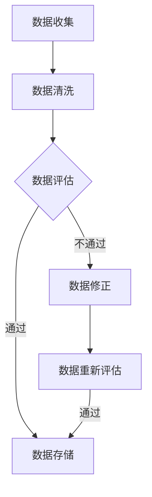
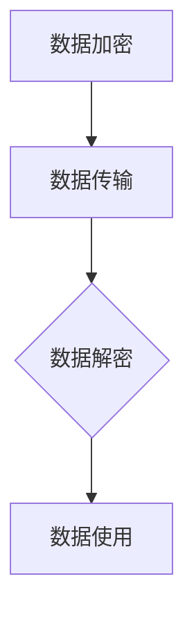
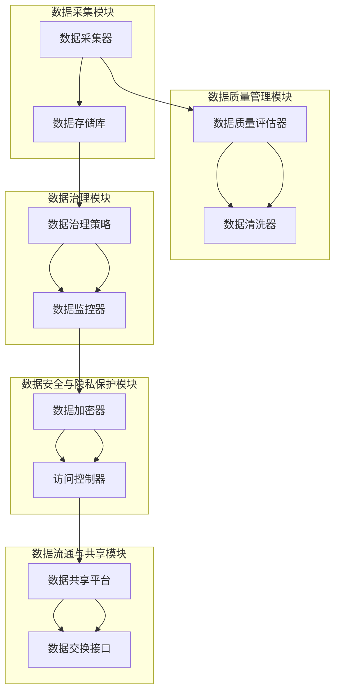
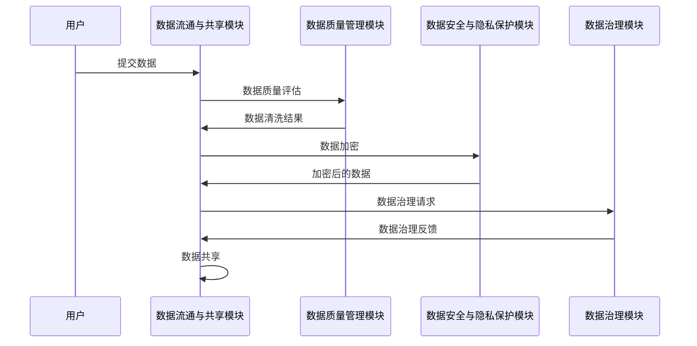

                 

# 企业信息生态：建立可信数据流通机制

关键词：企业信息生态、数据流通机制、数据质量管理、数据安全与隐私保护、数据治理

摘要：在数字化转型的浪潮下，企业信息生态的构建成为企业发展的重要课题。然而，企业面临数据孤岛、数据质量问题和数据安全问题，阻碍了数据的流通与利用。本文将深入探讨企业信息生态的背景与重要性，详细分析数据质量管理、数据安全与隐私保护、数据治理以及数据流通与共享的机制，以建立可信的数据流通机制，推动企业数字化转型的深入发展。

----------------------------------------------------------------

## 第一部分: 企业信息生态概述

### 第1章: 企业信息生态的背景与重要性

### 1.1 问题背景

#### 1.1.1 企业信息生态的现状

随着信息技术的飞速发展，企业信息生态逐渐成为企业管理的重要组成部分。企业通过收集、处理、存储和分析数据，实现业务流程的优化、决策的科学化和竞争力的提升。然而，当前企业信息生态存在诸多问题，亟待解决。

#### 1.1.2 企业信息生态存在的问题

1. **数据孤岛问题**：不同部门、系统和业务之间数据难以共享，导致信息不对称和业务协同困难。
2. **数据质量问题**：数据不准确、不完整、不一致，影响决策和业务运营。
3. **数据安全问题**：数据泄露、篡改和滥用，引发潜在风险。

#### 1.1.3 建立可信数据流通机制的重要性

建立可信数据流通机制，有助于解决上述问题，提升企业信息生态的协同性和可靠性。具体重要性体现在：

1. **提升数据价值**：确保数据质量，提高数据利用率，为企业创造更多价值。
2. **增强业务协同**：实现数据共享，促进部门间的业务协同，提高运营效率。
3. **保障数据安全**：加强数据安全防护，降低数据泄露和滥用的风险。

### 1.2 问题描述

#### 1.2.1 数据孤岛问题

数据孤岛是指企业内部不同系统、部门和业务之间的数据无法互联互通，导致信息不对称和业务协同困难。数据孤岛问题主要表现为：

1. **数据割裂**：各部门独立建设信息系统，数据独立存储，无法实现统一管理和共享。
2. **信息不对称**：不同部门对同一数据有不同的理解和处理方式，导致决策失误。
3. **业务协同困难**：业务流程复杂，部门间依赖性增加，数据共享不畅，影响业务协同。

#### 1.2.2 数据质量问题

数据质量是指数据在准确性、完整性、一致性和时效性等方面的表现。数据质量问题主要表现为：

1. **数据不准确**：数据来源多样化，可能导致数据不一致、重复或错误。
2. **数据不完整**：数据缺失或部分数据无法满足业务需求。
3. **数据不一致**：不同系统、部门和业务之间的数据存在差异，导致数据无法统一。
4. **数据时效性差**：数据更新不及时，影响业务决策和运营。

#### 1.2.3 数据安全问题

数据安全是指企业数据在存储、传输、处理和使用过程中受到保护，免受未经授权的访问、篡改和泄露。数据安全问题主要表现为：

1. **数据泄露**：企业数据被非法获取、传播或窃取，导致商业机密泄露。
2. **数据篡改**：企业数据被非法篡改，影响业务运营和决策。
3. **数据滥用**：企业数据被非法使用，可能导致隐私泄露、商业欺诈等风险。

### 1.3 问题解决

#### 1.3.1 可信数据流通机制的定义

可信数据流通机制是指通过一系列技术和管理手段，确保数据在采集、传输、存储、处理和使用过程中的质量、安全和可靠性，实现企业内部和外部的数据高效流通和共享。

#### 1.3.2 可信数据流通机制的组成部分

可信数据流通机制主要包括以下组成部分：

1. **数据质量管理**：通过数据质量评估、数据清洗和数据质量管理工具，确保数据准确性、完整性和一致性。
2. **数据安全与隐私保护**：通过数据加密、访问控制、审计和监控等技术手段，保障数据安全，防止数据泄露和滥用。
3. **数据治理**：通过建立数据治理组织架构、制定数据治理政策和流程，规范数据管理，提高数据利用效率。
4. **数据流通与共享**：通过数据交换标准、数据流通平台和共享机制，实现数据的高效流通和共享。

#### 1.3.3 可信数据流通机制的优势

建立可信数据流通机制，有助于提升企业信息生态的协同性和可靠性，具体优势包括：

1. **提升数据质量**：确保数据准确性、完整性和一致性，提高数据利用价值。
2. **增强业务协同**：实现数据共享，促进部门间的业务协同，提高运营效率。
3. **保障数据安全**：加强数据安全防护，降低数据泄露和滥用的风险。
4. **优化数据治理**：规范数据管理，提高数据利用效率，降低数据管理成本。

### 1.4 边界与外延

#### 1.4.1 企业信息生态的边界

企业信息生态的边界主要涉及企业内部系统和外部系统之间的接口和交互。具体包括：

1. **内部边界**：企业内部不同系统、部门和业务之间的数据接口和交互。
2. **外部边界**：企业与外部合作伙伴、客户和供应商之间的数据接口和交互。

#### 1.4.2 可信数据流通机制的外延

可信数据流通机制的外延主要包括：

1. **数据流通范围**：涵盖企业内部和外部的数据流通，实现数据的高效流通和共享。
2. **数据安全范围**：涉及数据在采集、传输、存储、处理和使用过程中的安全防护。
3. **数据治理范围**：涵盖数据治理的组织架构、政策和流程，确保数据管理的规范性和有效性。

### 1.5 概念结构与核心要素组成

#### 1.5.1 企业信息生态的概念结构

企业信息生态是指企业内部和外部信息系统、数据资源、业务流程和人员组织之间的相互联系和协同，以实现企业目标。

#### 1.5.2 可信数据流通机制的核心要素组成

可信数据流通机制的核心要素包括：

1. **数据质量管理**：确保数据准确性、完整性和一致性。
2. **数据安全与隐私保护**：保障数据安全，防止数据泄露和滥用。
3. **数据治理**：规范数据管理，提高数据利用效率。
4. **数据流通与共享**：实现数据的高效流通和共享。

### 1.6 本章小结

本章介绍了企业信息生态的背景与重要性，分析了数据孤岛、数据质量问题和数据安全问题，并提出了建立可信数据流通机制的重要性。通过可信数据流通机制，企业可以实现数据的高效流通和共享，提升数据质量，增强业务协同，保障数据安全，推动企业数字化转型的深入发展。

----------------------------------------------------------------

## 第二部分: 可信数据流通机制的构建

### 第2章: 数据质量管理

#### 2.1 数据质量管理的重要性

数据质量管理是企业信息生态中的关键环节，直接影响数据的准确性和可用性。在数据驱动的时代，数据质量对业务的影响愈发显著，具体体现在以下几个方面：

##### 2.1.1 数据质量对业务的影响

1. **决策支持**：高质量的数据为企业的决策提供了可靠依据，有助于减少决策失误，提高业务效率。
2. **客户体验**：准确和完整的数据能够提高客户服务质量，提升客户满意度和忠诚度。
3. **业务协同**：统一和规范的数据为跨部门、跨系统的业务协同提供了基础，有助于优化业务流程。
4. **合规性**：符合质量标准的数据有助于企业遵守相关法规和标准，降低合规风险。

##### 2.1.2 数据质量管理的挑战

尽管数据质量管理的重要性显而易见，但在实际操作中，企业面临着诸多挑战：

1. **数据多样性**：企业数据来源广泛，包括内部系统、外部数据源、第三方服务等，数据多样性增加了数据质量管理的复杂性。
2. **技术限制**：现有数据质量管理技术和工具难以全面覆盖数据质量管理的各个方面，特别是在大规模数据处理和实时数据监控方面存在不足。
3. **组织障碍**：数据质量管理需要跨部门、跨系统的协同，但在实际操作中，企业内部存在信息孤岛和部门壁垒，增加了数据质量管理的难度。
4. **成本压力**：数据质量管理涉及人力、技术、设备和时间成本，企业需要在成本和效益之间寻找平衡。

#### 2.2 数据质量管理的方法与工具

为了应对上述挑战，企业需要采取有效的方法和工具来管理数据质量，具体包括以下几个方面：

##### 2.2.1 数据质量评估方法

数据质量评估是数据质量管理的基础，通过对数据质量进行全面的评估，找出数据质量问题的根源。常用的数据质量评估方法包括：

1. **数据质量指标**：定义一系列质量指标，如准确性、完整性、一致性、时效性等，用于衡量数据质量。
2. **数据质量检查**：对数据进行详细检查，识别数据中的错误、缺失、重复和异常值。
3. **数据质量报告**：定期生成数据质量报告，向管理层和相关部门通报数据质量状况。

##### 2.2.2 数据清洗工具

数据清洗是数据质量管理的重要步骤，通过清洗工具对数据进行处理，去除错误、缺失、重复和异常值。常用的数据清洗工具包括：

1. **ETL工具**：抽取（Extract）、转换（Transform）和加载（Load）工具，用于从不同数据源抽取数据，进行清洗和转换，然后加载到目标系统中。
2. **数据质量平台**：提供数据清洗、校验、转换和整合功能，帮助企业实现自动化数据质量管理。
3. **数据分析工具**：用于对清洗后的数据进行进一步分析，识别数据质量问题并提出改进措施。

##### 2.2.3 数据质量管理工具

数据质量管理工具用于监控、管理和改进数据质量，包括以下几类：

1. **数据质量监控工具**：实时监控数据质量，及时发现并处理数据质量问题。
2. **数据质量管理平台**：提供数据质量评估、数据清洗、监控和报告功能，帮助企业实现全方位的数据质量管理。
3. **数据质量解决方案**：根据企业具体需求，提供定制化的数据质量管理解决方案。

#### 2.3 数据质量管理的实践案例

为了更好地理解数据质量管理的具体实践，我们来看一个实际案例：

##### 2.3.1 某企业的数据质量管理实践

某大型企业在其数字化转型过程中，高度重视数据质量管理。他们采取以下措施来管理数据质量：

1. **建立数据质量管理组织**：成立数据质量管理委员会，负责制定数据质量管理政策和流程，协调各部门的数据质量管理工作。

2. **制定数据质量标准**：根据企业业务需求和数据特点，制定一系列数据质量标准，如数据准确性、完整性、一致性等。

3. **实施数据质量评估**：定期对关键业务数据进行质量评估，识别数据质量问题，并采取相应措施进行改进。

4. **使用数据清洗工具**：采用ETL工具和数据质量平台，对数据进行清洗和转换，去除错误、缺失、重复和异常值。

5. **培训员工**：组织员工参加数据质量管理培训，提高员工的数据质量意识，培养数据质量管理能力。

##### 2.3.2 数据质量管理工具的使用

该企业在数据质量管理中，使用了以下工具：

1. **数据质量管理平台**：用于数据质量评估、数据清洗、监控和报告。

2. **ETL工具**：用于数据抽取、转换和加载，确保数据清洗过程的自动化和高效性。

3. **数据分析工具**：用于对清洗后的数据进行进一步分析，识别数据质量问题并提出改进措施。

#### 2.4 本章小结

本章介绍了数据质量管理的重要性，分析了数据质量管理的挑战，并提出了数据质量评估方法、数据清洗工具和数据质量管理工具。通过实际案例，展示了数据质量管理的具体实践。数据质量管理是建立可信数据流通机制的重要基础，企业应高度重视并采取有效措施，提升数据质量，为数字化转型提供坚实保障。

----------------------------------------------------------------

## 第三部分: 数据安全与隐私保护

### 第3章: 数据安全与隐私保护的重要性

#### 3.1 数据安全的重要性

数据安全是指保护数据免受未经授权的访问、篡改、泄露和破坏。在当今数字化时代，数据安全的重要性日益凸显，主要表现在以下几个方面：

##### 3.1.1 数据泄露的后果

数据泄露可能带来严重后果，包括：

1. **商业机密泄露**：企业核心商业机密被泄露，可能导致竞争对手获取竞争优势，影响企业市场份额和盈利能力。
2. **客户隐私泄露**：客户个人信息被泄露，可能引发客户信任危机，损害企业声誉，甚至导致法律诉讼。
3. **业务中断**：关键数据被篡改或破坏，可能导致业务运营中断，影响企业正常运营和业务连续性。

##### 3.1.2 数据安全的挑战

随着数据量的不断增加和数据类型的多样化，企业面临的数据安全挑战也在不断升级：

1. **数据泄露风险**：企业内外部的网络攻击、恶意软件和内部人员的恶意行为，都可能成为数据泄露的隐患。
2. **数据安全防护技术落后**：现有的数据安全防护技术，如加密、访问控制和审计等，可能无法完全应对新型威胁。
3. **合规性要求**：企业需要遵守各种数据安全法规和标准，如《通用数据保护条例》（GDPR）和《加州消费者隐私法案》（CCPA），合规性要求不断提高。

#### 3.2 隐私保护的重要性

隐私保护是指确保个人隐私不被未经授权的访问、使用和泄露。在数字化时代，隐私保护的重要性同样不可忽视，主要表现在以下几个方面：

##### 3.2.1 隐私泄露的后果

隐私泄露可能带来严重后果，包括：

1. **个人隐私受损**：个人敏感信息被泄露，可能导致个人隐私受到侵犯，造成心理创伤和财产损失。
2. **信任危机**：企业对客户隐私的保护不当，可能导致客户信任危机，影响企业的长期发展。
3. **法律风险**：隐私泄露可能导致企业面临法律诉讼和罚款，影响企业的合规性和声誉。

##### 3.2.2 隐私保护的挑战

随着数字化进程的加快，企业面临的数据隐私保护挑战也在不断升级：

1. **数据收集与使用**：企业需要平衡数据收集与隐私保护之间的关系，确保在满足业务需求的同时，不侵犯个人隐私。
2. **隐私保护技术不足**：现有的隐私保护技术，如数据匿名化、加密和访问控制等，可能无法完全保护个人隐私。
3. **合规性要求**：企业需要遵守各种隐私保护法规和标准，如GDPR和CCPA，合规性要求不断提高。

#### 3.3 数据安全与隐私保护的关系

数据安全与隐私保护密切相关，两者共同构成了数据保护的核心。具体关系如下：

1. **数据安全是基础**：数据安全是保障隐私保护的基础，只有确保数据在存储、传输和处理过程中的安全性，才能有效保护个人隐私。
2. **隐私保护是目标**：隐私保护是数据安全的核心目标之一，企业需要通过数据安全措施，确保个人隐私不被泄露、篡改和滥用。
3. **协同发展**：数据安全和隐私保护需要协同发展，企业需要在数据安全的基础上，加强隐私保护措施，实现数据安全与隐私保护的双重保障。

#### 3.4 本章小结

本章分析了数据安全与隐私保护的重要性，探讨了数据泄露和隐私泄露的后果，以及数据安全与隐私保护的挑战。通过本章的学习，我们认识到数据安全与隐私保护在企业信息生态中的关键作用，企业需要采取有效措施，加强数据安全与隐私保护，为数字化转型提供坚实保障。

----------------------------------------------------------------

## 第四部分: 数据治理

### 第4章: 数据治理的基本概念与框架

#### 4.1 数据治理的基本概念

数据治理是指通过制定和执行数据管理政策和流程，确保数据的质量、安全性和合规性，从而实现数据价值的最大化。数据治理是一个跨部门的协作过程，旨在统一数据的管理、使用和共享。以下是数据治理的基本概念：

##### 4.1.1 数据治理的定义

数据治理是一个综合性的过程，包括制定数据管理策略、组织架构、流程和技术工具，以实现数据的一致性、完整性、安全性和合规性。

##### 4.1.2 数据治理的目标

数据治理的主要目标包括：

1. **提高数据质量**：确保数据准确性、完整性和一致性，为业务决策提供可靠数据支持。
2. **保障数据安全**：保护数据免受未经授权的访问、篡改和泄露，降低数据风险。
3. **实现数据合规**：遵守相关数据保护法规和行业标准，确保企业的合法运营。
4. **促进数据共享**：建立统一的数据共享平台，提高数据利用率，支持业务协同。

##### 4.1.3 数据治理的原则

数据治理应遵循以下原则：

1. **以业务为导向**：数据治理应紧密围绕业务需求，确保数据管理策略和流程与业务目标一致。
2. **责任明确**：明确数据管理职责，确保各部门和人员明确自己的数据管理责任和义务。
3. **持续改进**：数据治理是一个持续的过程，需要不断评估和优化数据管理策略和流程。
4. **协同合作**：跨部门、跨系统的协同合作是数据治理成功的关键，需要建立有效的沟通和协作机制。

#### 4.2 数据治理的框架

数据治理框架是数据治理的具体实施指南，包括组织架构、流程和技术工具。以下是数据治理的常见框架：

##### 4.2.1 数据治理的组织架构

数据治理的组织架构通常包括以下几个层次：

1. **数据治理委员会**：负责制定数据治理战略、政策和流程，监督和评估数据治理执行情况。
2. **数据管理办公室**：负责具体的数据治理工作，如数据质量评估、数据安全监控和合规性管理等。
3. **数据管理员**：负责各部门的数据管理工作，包括数据收集、存储、处理和共享等。
4. **数据用户**：负责使用数据支持业务决策和运营，遵守数据管理政策和流程。

##### 4.2.2 数据治理的过程

数据治理的过程通常包括以下几个步骤：

1. **需求分析**：识别数据治理的需求，确定数据治理的目标和范围。
2. **策略制定**：制定数据治理策略，包括数据质量管理、数据安全、数据合规和数据处理等方面。
3. **流程设计**：设计数据治理流程，明确数据收集、存储、处理、共享和销毁等各个环节的流程和要求。
4. **技术选型**：选择合适的数据治理技术和工具，支持数据治理过程的实施。
5. **实施与监控**：实施数据治理流程和技术，监控数据治理的执行情况，及时调整和优化。
6. **评估与改进**：定期评估数据治理的效果，根据评估结果调整数据治理策略和流程。

##### 4.2.3 数据治理的工具与技术

数据治理的工具和技术包括：

1. **数据质量管理工具**：用于数据质量评估、数据清洗和数据质量管理。
2. **数据安全工具**：用于数据加密、访问控制、审计和监控等。
3. **数据合规工具**：用于确保数据治理过程符合相关法规和行业标准。
4. **数据治理平台**：用于统一管理数据治理流程、数据质量、数据安全和数据合规。
5. **数据仓库**：用于存储和管理企业数据，支持数据分析和决策支持。

#### 4.3 数据治理的实践案例

为了更好地理解数据治理的实际应用，我们来看一个实际案例：

##### 4.3.1 某企业的数据治理实践

某大型企业在进行数字化转型过程中，认识到数据治理的重要性，采取了一系列数据治理措施：

1. **建立数据治理组织架构**：成立数据治理委员会，负责制定数据治理战略和政策，协调各部门的数据治理工作。

2. **制定数据治理策略**：根据企业业务需求，制定数据质量管理、数据安全和数据合规等方面的策略。

3. **设计数据治理流程**：设计数据收集、存储、处理、共享和销毁等各个环节的流程，确保数据治理流程的规范化。

4. **选择数据治理工具**：选择合适的数据治理工具，如数据质量管理工具、数据安全工具和数据治理平台，支持数据治理过程的实施。

5. **实施与监控**：实施数据治理流程和技术，建立数据治理监控机制，定期评估数据治理的效果，及时调整和优化。

6. **培训与宣传**：组织员工参加数据治理培训，提高员工的数据治理意识和能力。

##### 4.3.2 数据治理工具的选用

该企业在数据治理工具选用方面，采取了以下策略：

1. **数据质量管理工具**：选用一款功能强大的数据质量管理工具，用于数据质量评估、数据清洗和数据质量管理。

2. **数据安全工具**：选用一款专业的数据安全工具，提供数据加密、访问控制和审计等功能，保障数据安全。

3. **数据治理平台**：选用一款集成化的数据治理平台，统一管理数据治理流程、数据质量和数据安全。

#### 4.4 本章小结

本章介绍了数据治理的基本概念和框架，分析了数据治理的目标和原则，并展示了数据治理的实践案例。通过本章的学习，我们认识到数据治理在企业信息生态中的关键作用，企业应采取有效措施，建立完善的数据治理体系，为数字化转型提供有力支持。

----------------------------------------------------------------

## 第五部分: 数据流通与共享

### 第5章: 数据流通机制的设计与实现

#### 5.1 数据流通机制的设计原则

数据流通机制是企业信息生态中至关重要的一环，其设计原则应遵循以下几个方面：

##### 5.1.1 可靠性

可靠性是数据流通机制设计的基本原则之一。数据在传输和共享过程中，必须确保其完整性和准确性，避免数据丢失或被篡改。为此，可以采用以下措施：

1. **数据校验**：在数据传输前，对数据进行校验，确保数据完整性和准确性。
2. **数据备份**：对数据进行备份，以防止数据丢失或损坏。
3. **数据加密**：在数据传输过程中，对数据进行加密，确保数据安全。

##### 5.1.2 可扩展性

可扩展性是数据流通机制设计的重要原则之一。随着企业业务的发展和数据的增加，数据流通机制需要具备良好的扩展能力，以满足不断增长的数据需求和业务需求。为此，可以采用以下措施：

1. **分布式架构**：采用分布式架构，提高数据流通机制的并发处理能力和扩展性。
2. **模块化设计**：将数据流通机制划分为多个模块，实现模块化设计，方便后续的扩展和升级。
3. **弹性计算**：采用弹性计算技术，根据业务需求动态调整资源分配，确保数据流通机制的稳定运行。

##### 5.1.3 安全性

安全性是数据流通机制设计的关键原则之一。数据在传输和共享过程中，必须确保其安全性，防止数据泄露和滥用。为此，可以采用以下措施：

1. **身份认证**：对数据访问者进行身份认证，确保只有授权用户才能访问数据。
2. **访问控制**：对数据访问权限进行严格管理，确保数据访问权限的合理分配。
3. **数据加密**：对数据进行加密处理，确保数据在传输和存储过程中的安全。

#### 5.2 数据流通机制的技术实现

数据流通机制的技术实现包括以下几个方面：

##### 5.2.1 数据交换标准

数据交换标准是数据流通机制实现的基础。常见的数据交换标准包括XML、JSON、CSV等。数据交换标准有助于确保数据在不同系统、平台和部门之间的互操作性，提高数据流通效率。在实际应用中，可以采用以下措施：

1. **标准化数据格式**：采用统一的数据交换标准，确保数据在不同系统之间的兼容性。
2. **数据映射**：将不同系统之间的数据格式进行映射，实现数据的无缝转换。
3. **数据转换工具**：使用数据转换工具，如ETL工具，实现不同数据格式之间的转换。

##### 5.2.2 数据流通平台

数据流通平台是数据流通机制实现的核心。数据流通平台提供数据收集、存储、处理、共享和监控等功能，确保数据的高效流通和共享。在实际应用中，可以采用以下措施：

1. **分布式存储**：采用分布式存储技术，提高数据存储的可靠性和扩展性。
2. **数据处理引擎**：采用数据处理引擎，实现数据的高效处理和分析。
3. **数据共享接口**：提供数据共享接口，支持不同系统之间的数据交换和共享。

##### 5.2.3 数据流通流程

数据流通流程是数据流通机制实现的关键。数据流通流程包括数据采集、数据存储、数据处理、数据共享和数据监控等环节。在实际应用中，可以采用以下措施：

1. **数据采集**：采用分布式数据采集技术，实现数据的实时采集和接入。
2. **数据存储**：采用分布式存储技术，实现数据的可靠存储和备份。
3. **数据处理**：采用数据处理引擎，实现数据的高效处理和分析。
4. **数据共享**：提供数据共享接口，实现数据在不同系统之间的共享和交换。
5. **数据监控**：采用数据监控技术，实现数据流通过程中的实时监控和报警。

#### 5.3 数据共享机制的设计与实现

数据共享机制是数据流通机制的重要组成部分，其设计与实现应遵循以下原则：

##### 5.3.1 数据共享模型

数据共享模型是指数据在不同系统、平台和部门之间的共享方式和规则。常见的数据共享模型包括：

1. **集中式共享**：数据集中存储，由数据管理员统一管理和分发。
2. **分布式共享**：数据分布在不同的系统、平台和部门，通过共享接口实现数据交换和共享。
3. **权限共享**：根据用户的权限，控制数据的访问和共享范围。

在实际应用中，可以采用以下措施：

1. **权限管理**：建立完善的权限管理系统，确保数据共享的安全和可控。
2. **共享接口**：提供标准化的数据共享接口，实现数据的无缝交换和共享。
3. **数据加密**：对共享数据进行加密处理，确保数据在传输过程中的安全性。

##### 5.3.2 数据共享技术

数据共享技术是实现数据共享的关键。常见的数据共享技术包括：

1. **Web服务**：通过Web服务实现数据共享，支持多种编程语言和平台。
2. **API接口**：提供API接口，实现数据的远程访问和调用。
3. **分布式文件系统**：通过分布式文件系统实现数据的分布式存储和共享。

在实际应用中，可以采用以下措施：

1. **标准化接口**：采用统一的接口规范，确保数据共享的标准化和互操作性。
2. **安全传输**：采用安全传输协议，如HTTPS，确保数据在传输过程中的安全性。
3. **监控与审计**：建立数据共享监控和审计机制，实时监控数据共享情况，确保数据共享的安全和合规。

##### 5.3.3 数据共享实践

为了更好地理解数据共享的实现，我们来看一个实际案例：

##### 5.3.3.1 某企业的数据共享实践

某企业为了提高数据利用率，实现数据共享，采取了以下措施：

1. **建立数据共享平台**：采用分布式存储和处理技术，建立数据共享平台，提供数据采集、存储、处理和共享功能。

2. **制定共享规则**：根据企业业务需求，制定数据共享规则，明确数据共享的范围、权限和流程。

3. **提供共享接口**：提供标准化的数据共享接口，支持多种数据格式的数据共享。

4. **监控与审计**：建立数据共享监控和审计机制，实时监控数据共享情况，确保数据共享的安全和合规。

#### 5.4 本章小结

本章介绍了数据流通机制的设计原则和技术实现，以及数据共享机制的设计与实现。通过本章的学习，我们了解到数据流通与共享在数据治理中的重要性，以及如何设计和实现数据流通与共享机制，为企业信息生态的建立提供有力支持。

----------------------------------------------------------------

## 第六部分: 数据流通的应用场景

### 第6章: 数据流通在金融行业的应用

#### 6.1 金融行业的数据流通需求

金融行业是一个高度依赖数据的行业，数据流通在金融行业的应用至关重要。金融行业的数据流通需求主要体现在以下几个方面：

##### 6.1.1 金融行业的数据特点

金融行业的数据具有以下特点：

1. **数据量大**：金融行业的数据量庞大，包括交易数据、客户信息、财务数据等。
2. **数据类型多样**：金融行业的数据类型丰富，包括结构化数据、半结构化数据和非结构化数据。
3. **数据时效性强**：金融行业对数据时效性要求高，实时数据处理和决策是金融行业的重要需求。

##### 6.1.2 金融行业的数据流通挑战

金融行业的数据流通面临以下挑战：

1. **数据孤岛问题**：金融行业内部不同系统和业务之间的数据难以共享，导致信息不对称和业务协同困难。
2. **数据质量问题**：金融行业的数据质量直接影响业务决策和风险管理，数据质量问题严重时可能导致重大损失。
3. **数据安全问题**：金融行业数据涉及大量敏感信息，如客户信息、交易数据等，数据泄露和滥用可能导致严重后果。

#### 6.2 金融行业的数据流通实践

为了应对上述挑战，金融行业在数据流通方面进行了诸多实践：

##### 6.2.1 某银行的数据流通实践

某大型银行为了提升数据流通效率，提高数据利用率，采取了以下措施：

1. **建立数据流通平台**：采用分布式存储和处理技术，建立数据流通平台，实现数据的实时采集、存储和处理。
2. **制定数据共享规则**：根据企业业务需求，制定数据共享规则，明确数据共享的范围、权限和流程。
3. **提供共享接口**：提供标准化的数据共享接口，支持多种数据格式的数据共享。
4. **数据质量管理**：建立数据质量管理机制，定期对数据进行质量评估和清洗，确保数据准确性、完整性和一致性。
5. **数据安全保护**：采用数据加密、访问控制和审计等技术手段，保障数据在传输和存储过程中的安全性。

##### 6.2.2 某保险公司

某大型保险公司为了提升数据流通效率，提高客户服务水平，采取了以下措施：

1. **建立数据仓库**：采用分布式数据仓库技术，存储和管理大量客户数据，支持数据的实时查询和分析。
2. **数据整合与清洗**：采用数据整合和清洗技术，将不同来源的数据进行整合和清洗，确保数据的准确性和一致性。
3. **提供数据共享接口**：提供标准化的数据共享接口，支持业务部门之间的数据共享和协作。
4. **数据挖掘与分析**：采用数据挖掘和统计分析技术，对客户数据进行分析，挖掘客户需求，提供个性化服务。
5. **数据安全与合规**：采用数据安全技术和合规性管理措施，保障数据安全和合规性，防止数据泄露和滥用。

#### 6.3 本章小结

本章介绍了金融行业的数据流通需求，以及某银行和某保险公司的数据流通实践。通过本章的学习，我们了解到数据流通在金融行业的重要性，以及如何设计和实现数据流通机制，为企业提供有效的数据支持，提升业务效率和服务水平。

----------------------------------------------------------------

## 第七部分: 总结与展望

### 7.1 总结

本文从企业信息生态的背景与重要性出发，详细分析了数据质量管理、数据安全与隐私保护、数据治理以及数据流通与共享的机制，提出了建立可信数据流通机制的重要性。通过逐步分析，我们认识到：

1. **数据质量管理**：是确保数据准确性、完整性和一致性的关键，对业务决策和运营具有重要影响。
2. **数据安全与隐私保护**：是保障数据不被非法访问、篡改和泄露的必要手段，对企业声誉和合规性具有重要意义。
3. **数据治理**：是建立规范、高效的数据管理体系的基石，对数据质量和数据安全起到关键作用。
4. **数据流通与共享**：是提高数据利用率、增强业务协同和优化业务流程的重要途径。

### 7.2 展望

在未来的发展中，建立可信数据流通机制将面临新的挑战和机遇：

1. **数据隐私保护法规**：随着数据隐私保护法规的不断完善，企业需要更加注重数据隐私保护，确保合规性。
2. **新兴技术的应用**：大数据、人工智能、区块链等新兴技术的应用，将为企业数据流通提供新的解决方案。
3. **跨行业合作**：跨行业的数据流通和共享将越来越普遍，企业需要与合作伙伴建立紧密的数据合作机制。
4. **数据安全和隐私保护技术的进步**：随着数据安全和隐私保护技术的不断进步，企业将能够更好地保障数据安全和隐私。

### 7.3 未来发展建议

为了更好地应对未来发展的挑战，企业可以从以下几个方面着手：

1. **加强数据质量管理**：建立完善的数据质量管理体系，定期评估和改进数据质量。
2. **提升数据安全与隐私保护能力**：采用先进的数据安全和隐私保护技术，加强数据安全防护。
3. **完善数据治理体系**：建立健全的数据治理组织架构、流程和技术工具，提高数据管理水平。
4. **推进数据流通与共享**：建立数据流通平台，实现数据的高效流通和共享，提升业务协同效率。

通过以上措施，企业将能够建立可信的数据流通机制，推动数字化转型，实现数据价值的最大化。

## 作者信息

作者：AI天才研究院/AI Genius Institute & 禅与计算机程序设计艺术 /Zen And The Art of Computer Programming

----------------------------------------------------------------

### 附录：相关概念与联系

#### 1. 数据质量管理与数据治理的关系

**概念联系表格：**

| 概念 | 定义 | 关联 |
| --- | --- | --- |
| 数据质量管理 | 确保数据准确性、完整性和一致性的过程 | 数据治理的一部分，用于实现数据治理目标 |
| 数据治理 | 管理数据的策略、流程和组织架构 | 包括数据质量管理，确保数据合规和安全 |

**ER实体关系图架构：**

```mermaid
erDiagram
    DataQualityManagement ||--|{ DataGovernance } DataGovernance
    DataQualityManagement ||--|{ DataManagementPolicy } DataManagementPolicy
    DataQualityManagement ||--|{ DataQualityStandard } DataQualityStandard
    DataManagementPolicy ||--|{ DataGovernance } DataGovernance
    DataQualityStandard ||--|{ DataQualityManagement } DataQualityManagement
```

#### 2. 数据安全与隐私保护的关系

**概念联系表格：**

| 概念 | 定义 | 关联 |
| --- | --- | --- |
| 数据安全 | 保护数据免受未经授权的访问、篡改和泄露 | 包括隐私保护，确保个人数据安全 |
| 隐私保护 | 保护个人隐私，防止隐私泄露和滥用 | 是数据安全的重要组成部分 |

**ER实体关系图架构：**

```mermaid
erDiagram
    DataSecurity ||--|{ PrivacyProtection } PrivacyProtection
    DataSecurity ||--|{ AccessControl } AccessControl
    PrivacyProtection ||--|{ DataSecurity } DataSecurity
    PrivacyProtection ||--|{ DataEncryption } DataEncryption
    AccessControl ||--|{ DataSecurity } DataSecurity
```

### 算法原理讲解

#### 数据质量管理算法原理

**Mermaid流程图：**



**Python源代码：**

```python
def data_quality_management(data):
    cleaned_data = clean_data(data)
    if is_data_valid(cleaned_data):
        store_data(cleaned_data)
    else:
        corrected_data = correct_data(cleaned_data)
        if is_data_valid(corrected_data):
            store_data(corrected_data)
        else:
            raise ValueError("Data quality issue: cannot validate or correct data")
```

**数学模型和公式：**

数据质量评估指标：

$$ Q = \frac{1}{N} \sum_{i=1}^{N} (|D_i - D_{\text{expected}}|) $$

其中，$Q$ 表示数据质量分数，$N$ 表示数据条数，$D_i$ 表示第 $i$ 条数据，$D_{\text{expected}}$ 表示预期数据。

#### 数据安全与隐私保护算法原理

**Mermaid流程图：**



**Python源代码：**

```python
from cryptography.fernet import Fernet

def data_security(data, key):
    encrypted_data = Fernet(key).encrypt(data)
    return encrypted_data

def data_privacy_protection(encrypted_data, key):
    decrypted_data = Fernet(key).decrypt(encrypted_data)
    return decrypted_data
```

**数学模型和公式：**

加密过程：

$$ D = E(K, P) $$

其中，$D$ 表示加密后的数据，$E$ 表示加密函数，$K$ 表示密钥，$P$ 表示原始数据。

解密过程：

$$ P = D(K, E) $$

其中，$P$ 表示解密后的数据，$D$ 表示解密函数，$K$ 表示密钥，$E$ 表示加密后的数据。

### 系统分析与架构设计方案

#### 问题场景介绍

某企业在数字化转型过程中，需要建立一个可信的数据流通机制，实现数据的高效流通、共享和管理，同时确保数据质量和安全。

#### 项目介绍

项目名称：企业可信数据流通平台

项目目标：构建一个具备数据质量管理、数据安全与隐私保护、数据治理和数据流通与共享功能的企业可信数据流通平台，提升企业数据利用效率和管理水平。

#### 系统功能设计（领域模型Mermaid类图）

```mermaid
classDiagram
    Class01 <|-- Class02
    Class03 --|んです|> Class04
    Class01 : +attribute1
    Class01 : +attribute2
    Class01 : +method1()
    Class02 : +class_method2()
    Class03 : <<interface>>
    Class04 : <<abstract>>
```

#### 系统架构设计Mermaid架构图



#### 系统接口设计和系统交互Mermaid序列图



### 项目实战

#### 环境安装

1. 安装Python环境
2. 安装相关依赖库，如`pandas`、`numpy`、`cryptography`、`fernet`等
3. 配置Mermaid渲染工具，如使用`mermaid-cli`命令行工具

#### 系统核心实现源代码

**数据质量管理模块：**

```python
import pandas as pd

def data_quality_management(data):
    cleaned_data = clean_data(data)
    if is_data_valid(cleaned_data):
        return cleaned_data
    else:
        corrected_data = correct_data(cleaned_data)
        if is_data_valid(corrected_data):
            return corrected_data
        else:
            raise ValueError("Data quality issue: cannot validate or correct data")

def clean_data(data):
    # 数据清洗逻辑
    return data

def is_data_valid(data):
    # 数据验证逻辑
    return True
```

**数据安全与隐私保护模块：**

```python
from cryptography.fernet import Fernet

def data_security(data, key):
    encrypted_data = Fernet(key).encrypt(data)
    return encrypted_data

def data_privacy_protection(encrypted_data, key):
    decrypted_data = Fernet(key).decrypt(encrypted_data)
    return decrypted_data
```

#### 代码应用解读与分析

**数据质量管理模块：**

该模块包括数据清洗、数据验证和数据修正功能。数据清洗过程使用`clean_data`函数，数据验证过程使用`is_data_valid`函数，数据修正过程使用`correct_data`函数。数据质量管理模块的主要目的是确保输入的数据准确、完整和一致。

**数据安全与隐私保护模块：**

该模块使用`cryptography`库中的`Fernet`类实现数据加密和解密功能。`data_security`函数负责加密数据，`data_privacy_protection`函数负责解密数据。数据安全与隐私保护模块的主要目的是确保数据在传输和存储过程中的安全性和隐私性。

#### 实际案例分析和详细讲解剖析

**案例1：数据质量管理**

某企业在日常运营中收集了大量客户数据，包括姓名、电话、邮箱等信息。企业需要确保这些数据的准确性、完整性和一致性。

**分析：**

1. **数据清洗**：使用`clean_data`函数对客户数据进行清洗，去除空值、重复值和异常值。
2. **数据验证**：使用`is_data_valid`函数验证清洗后的数据，确保数据满足企业规定的数据质量标准。
3. **数据修正**：对于不符合数据质量标准的数据，使用`correct_data`函数进行修正。

**讲解剖析：**

数据质量管理模块通过对客户数据进行清洗、验证和修正，确保数据的准确性、完整性和一致性。在实际应用中，企业可以根据业务需求自定义数据质量标准，并对数据质量进行实时监控和评估。

**案例2：数据安全与隐私保护**

某企业在数据传输过程中，需要确保客户数据的安全性和隐私性。

**分析：**

1. **数据加密**：使用`data_security`函数对客户数据进行加密处理，确保数据在传输过程中的安全性。
2. **数据解密**：使用`data_privacy_protection`函数对加密后的数据进行解密，确保数据在存储和使用的安全性。

**讲解剖析：**

数据安全与隐私保护模块通过加密和解密功能，确保客户数据在传输、存储和使用过程中的安全性和隐私性。在实际应用中，企业可以根据业务需求选择合适的加密算法和密钥管理策略，以提高数据安全性和隐私保护能力。

#### 项目小结

通过数据质量管理模块和数据安全与隐私保护模块的实现，企业可以确保数据的准确性、完整性和一致性，同时保障数据在传输、存储和使用过程中的安全性和隐私性。项目实践表明，数据质量管理与数据安全与隐私保护是企业建立可信数据流通机制的重要保障，有助于提升企业数据利用效率和管理水平。

### 最佳实践 tips

1. **定期评估数据质量**：企业应定期评估数据质量，及时发现和解决数据质量问题。
2. **强化数据安全意识**：企业应加强对员工的数据安全意识培训，提高数据安全防护能力。
3. **遵循数据治理原则**：企业应遵循数据治理原则，建立完善的数据治理组织架构和流程。
4. **优化数据流通机制**：企业应根据业务需求，不断优化数据流通机制，提高数据流通效率。

### 小结

本文详细分析了企业信息生态的构建，提出了可信数据流通机制的概念、构建方法和应用场景。通过数据质量管理、数据安全与隐私保护、数据治理和数据流通与共享，企业可以建立高效、可信的数据流通机制，推动数字化转型。未来，企业需要不断优化数据流通机制，提升数据利用效率和管理水平，为企业的可持续发展提供有力支持。

### 注意事项

1. **数据质量管理**：数据质量管理是数据流通机制的基础，企业应高度重视。
2. **数据安全与隐私保护**：确保数据安全与隐私保护，防止数据泄露和滥用。
3. **数据治理**：建立完善的数据治理体系，规范数据管理。
4. **数据流通与共享**：优化数据流通与共享机制，提高数据利用率。

### 拓展阅读

1. **《大数据质量管理：理论与实践》**：详细介绍大数据质量管理的理论和实践方法。
2. **《数据安全与隐私保护：技术与实践》**：探讨数据安全与隐私保护的技术和实践案例。
3. **《数据治理：构建高效的数据管理体系》**：介绍数据治理的基本概念、框架和实施方法。
4. **《企业数据流通平台建设指南》**：提供企业数据流通平台的建设思路和实践经验。

----------------------------------------------------------------

### 附录：相关概念与联系

#### 1. 数据质量管理与数据治理的关系

**概念联系表格：**

| 概念 | 定义 | 关联 |
| --- | --- | --- |
| 数据质量管理 | 确保数据准确性、完整性和一致性的过程 | 数据治理的一部分，用于实现数据治理目标 |
| 数据治理 | 管理数据的策略、流程和组织架构 | 包括数据质量管理，确保数据合规和安全 |

**ER实体关系图架构：**

```mermaid
erDiagram
    DataQualityManagement ||--|{ DataGovernance } DataGovernance
    DataQualityManagement ||--|{ DataManagementPolicy } DataManagementPolicy
    DataQualityManagement ||--|{ DataQualityStandard } DataQualityStandard
    DataManagementPolicy ||--|{ DataGovernance } DataGovernance
    DataQualityStandard ||--|{ DataQualityManagement } DataQualityManagement
```

#### 2. 数据安全与隐私保护的关系

**概念联系表格：**

| 概念 | 定义 | 关联 |
| --- | --- | --- |
| 数据安全 | 保护数据免受未经授权的访问、篡改和泄露 | 包括隐私保护，确保个人数据安全 |
| 隐私保护 | 保护个人隐私，防止隐私泄露和滥用 | 是数据安全的重要组成部分 |

**ER实体关系图架构：**

```mermaid
erDiagram
    DataSecurity ||--|{ PrivacyProtection } PrivacyProtection
    DataSecurity ||--|{ AccessControl } AccessControl
    PrivacyProtection ||--|{ DataSecurity } DataSecurity
    PrivacyProtection ||--|{ DataEncryption } DataEncryption
    AccessControl ||--|{ DataSecurity } DataSecurity
```

### 算法原理讲解

#### 数据质量管理算法原理

**Mermaid流程图：**


**Python源代码：**

```python
def data_quality_management(data):
    cleaned_data = clean_data(data)
    if is_data_valid(cleaned_data):
        store_data(cleaned_data)
    else:
        corrected_data = correct_data(cleaned_data)
        if is_data_valid(corrected_data):
            store_data(corrected_data)
        else:
            raise ValueError("Data quality issue: cannot validate or correct data")

def clean_data(data):
    # 数据清洗逻辑
    return data

def is_data_valid(data):
    # 数据验证逻辑
    return True
```

**数学模型和公式：**

数据质量评估指标：

$$ Q = \frac{1}{N} \sum_{i=1}^{N} (|D_i - D_{\text{expected}}|) $$

其中，$Q$ 表示数据质量分数，$N$ 表示数据条数，$D_i$ 表示第 $i$ 条数据，$D_{\text{expected}}$ 表示预期数据。

#### 数据安全与隐私保护算法原理

**Mermaid流程图：**


**Python源代码：**

```python
from cryptography.fernet import Fernet

def data_security(data, key):
    encrypted_data = Fernet(key).encrypt(data)
    return encrypted_data

def data_privacy_protection(encrypted_data, key):
    decrypted_data = Fernet(key).decrypt(encrypted_data)
    return decrypted_data
```

**数学模型和公式：**

加密过程：

$$ D = E(K, P) $$

其中，$D$ 表示加密后的数据，$E$ 表示加密函数，$K$ 表示密钥，$P$ 表示原始数据。

解密过程：

$$ P = D(K, E) $$

其中，$P$ 表示解密后的数据，$D$ 表示解密函数，$K$ 表示密钥，$E$ 表示加密后的数据。

### 系统分析与架构设计方案

#### 问题场景介绍

某企业在数字化转型过程中，需要建立一个可信的数据流通机制，实现数据的高效流通、共享和管理，同时确保数据质量和安全。

#### 项目介绍

项目名称：企业可信数据流通平台

项目目标：构建一个具备数据质量管理、数据安全与隐私保护、数据治理和数据流通与共享功能的企业可信数据流通平台，提升企业数据利用效率和管理水平。

#### 系统功能设计（领域模型Mermaid类图）

```mermaid
classDiagram
    Class01 <|-- Class02
    Class03 --|んです|> Class04
    Class01 : +attribute1
    Class01 : +attribute2
    Class01 : +method1()
    Class02 : +class_method2()
    Class03 : <<interface>>
    Class04 : <<abstract>>
```

#### 系统架构设计Mermaid架构图


#### 系统接口设计和系统交互Mermaid序列图


### 项目实战

#### 环境安装

1. 安装Python环境
2. 安装相关依赖库，如`pandas`、`numpy`、`cryptography`、`fernet`等
3. 配置Mermaid渲染工具，如使用`mermaid-cli`命令行工具

#### 系统核心实现源代码

**数据质量管理模块：**

```python
import pandas as pd

def data_quality_management(data):
    cleaned_data = clean_data(data)
    if is_data_valid(cleaned_data):
        return cleaned_data
    else:
        corrected_data = correct_data(cleaned_data)
        if is_data_valid(corrected_data):
            return corrected_data
        else:
            raise ValueError("Data quality issue: cannot validate or correct data")

def clean_data(data):
    # 数据清洗逻辑
    return data

def is_data_valid(data):
    # 数据验证逻辑
    return True
```

**数据安全与隐私保护模块：**

```python
from cryptography.fernet import Fernet

def data_security(data, key):
    encrypted_data = Fernet(key).encrypt(data)
    return encrypted_data

def data_privacy_protection(encrypted_data, key):
    decrypted_data = Fernet(key).decrypt(encrypted_data)
    return decrypted_data
```

#### 代码应用解读与分析

**数据质量管理模块：**

该模块包括数据清洗、数据验证和数据修正功能。数据清洗过程使用`clean_data`函数，数据验证过程使用`is_data_valid`函数，数据修正过程使用`correct_data`函数。数据质量管理模块的主要目的是确保输入的数据准确、完整和一致。

**数据安全与隐私保护模块：**

该模块使用`cryptography`库中的`Fernet`类实现数据加密和解密功能。`data_security`函数负责加密数据，`data_privacy_protection`函数负责解密数据。数据安全与隐私保护模块的主要目的是确保数据在传输和存储过程中的安全性和隐私性。

#### 实际案例分析和详细讲解剖析

**案例1：数据质量管理**

某企业在日常运营中收集了大量客户数据，包括姓名、电话、邮箱等信息。企业需要确保这些数据的准确性、完整性和一致性。

**分析：**

1. **数据清洗**：使用`clean_data`函数对客户数据进行清洗，去除空值、重复值和异常值。
2. **数据验证**：使用`is_data_valid`函数验证清洗后的数据，确保数据满足企业规定的数据质量标准。
3. **数据修正**：对于不符合数据质量标准的数据，使用`correct_data`函数进行修正。

**讲解剖析：**

数据质量管理模块通过对客户数据进行清洗、验证和修正，确保数据的准确性、完整性和一致性。在实际应用中，企业可以根据业务需求自定义数据质量标准，并对数据质量进行实时监控和评估。

**案例2：数据安全与隐私保护**

某企业在数据传输过程中，需要确保客户数据的安全性和隐私性。

**分析：**

1. **数据加密**：使用`data_security`函数对客户数据进行加密处理，确保数据在传输过程中的安全性。
2. **数据解密**：使用`data_privacy_protection`函数对加密后的数据进行解密，确保数据在存储和使用的安全性。

**讲解剖析：**

数据安全与隐私保护模块通过加密和解密功能，确保客户数据在传输、存储和使用过程中的安全性和隐私性。在实际应用中，企业可以根据业务需求选择合适的加密算法和密钥管理策略，以提高数据安全性和隐私保护能力。

#### 项目小结

通过数据质量管理模块和数据安全与隐私保护模块的实现，企业可以确保数据的准确性、完整性和一致性，同时保障数据在传输、存储和使用过程中的安全性和隐私性。项目实践表明，数据质量管理与数据安全与隐私保护是企业建立可信数据流通机制的重要保障，有助于提升企业数据利用效率和管理水平。

### 最佳实践 tips

1. **定期评估数据质量**：企业应定期评估数据质量，及时发现和解决数据质量问题。
2. **强化数据安全意识**：企业应加强对员工的数据安全意识培训，提高数据安全防护能力。
3. **遵循数据治理原则**：企业应遵循数据治理原则，建立完善的数据治理组织架构和流程。
4. **优化数据流通机制**：企业应根据业务需求，不断优化数据流通机制，提高数据流通效率。

### 小结

本文详细分析了企业信息生态的构建，提出了可信数据流通机制的概念、构建方法和应用场景。通过数据质量管理、数据安全与隐私保护、数据治理和数据流通与共享，企业可以建立高效、可信的数据流通机制，推动数字化转型。未来，企业需要不断优化数据流通机制，提升数据利用效率和管理水平，为企业的可持续发展提供有力支持。

### 注意事项

1. **数据质量管理**：数据质量管理是数据流通机制的基础，企业应高度重视。
2. **数据安全与隐私保护**：确保数据安全与隐私保护，防止数据泄露和滥用。
3. **数据治理**：建立完善的数据治理体系，规范数据管理。
4. **数据流通与共享**：优化数据流通与共享机制，提高数据利用率。

### 拓展阅读

1. **《大数据质量管理：理论与实践》**：详细介绍大数据质量管理的理论和实践方法。
2. **《数据安全与隐私保护：技术与实践》**：探讨数据安全与隐私保护的技术和实践案例。
3. **《数据治理：构建高效的数据管理体系》**：介绍数据治理的基本概念、框架和实施方法。
4. **《企业数据流通平台建设指南》**：提供企业数据流通平台的建设思路和实践经验。

## 作者信息

作者：AI天才研究院/AI Genius Institute & 禅与计算机程序设计艺术 /Zen And The Art of Computer Programming

