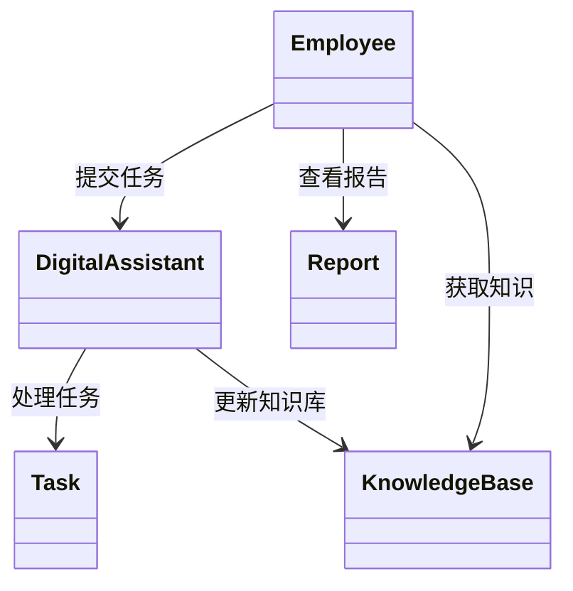
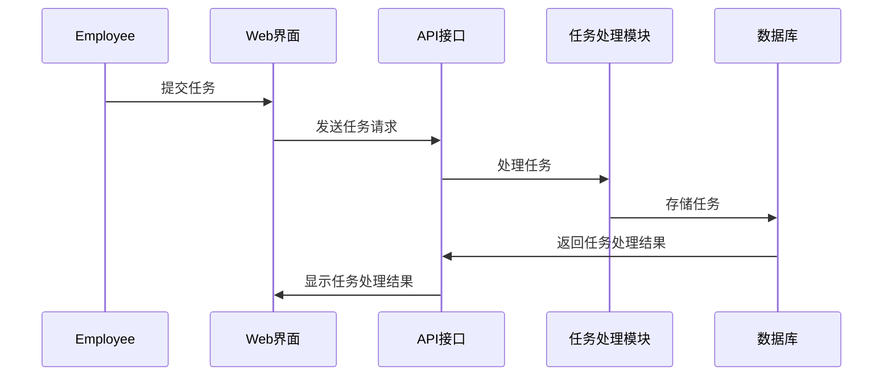

                 

### 《企业数字助理：AI增强员工生产力》

> 关键词：人工智能、数字助理、员工生产力、AI应用、解决方案、构建与实践、案例分析、未来展望

> 摘要：
在当今快速发展的数字化时代，人工智能（AI）技术正深刻地改变着企业的运营模式。本书《企业数字助理：AI增强员工生产力》旨在探讨如何通过AI技术打造高效的数字助理，从而提升员工的生产力。本书将详细介绍AI与数字助理的基本概念、在企业中的应用、解决方案的构建与实践，并通过案例分析展示其效果，同时展望未来的发展趋势与挑战。

----------------------------------------------------------------

## 目录大纲设计步骤

### 第一步：理解书名和主题

《企业数字助理：AI增强员工生产力》的书名简洁明了，直接揭示了本书的核心主题。书名中的“企业数字助理”指的是利用人工智能技术构建的智能系统，旨在协助企业员工完成日常任务，提高工作效率。“AI增强员工生产力”则强调了人工智能技术在提升员工生产力方面的关键作用。

### 第二步：确定主要章节

根据书名和主题，本书的主要章节可以划分为以下几个部分：

1. 引言与背景
2. AI与数字助理基础
3. AI技术在企业中的应用
4. 员工生产力提升的AI解决方案
5. 企业数字助理的构建与实践
6. 案例分析
7. 未来展望与挑战

### 第三步：细化每个章节的内容

为了确保每个章节的内容丰富且具有专业性，我们需要对每个章节进行细化。以下是各章节的细化内容：

**引言与背景**：
- 介绍企业数字助理的定义和重要性。
- 分析当前企业面临的生产力挑战。

**AI与数字助理基础**：
- 详细解释人工智能的基本概念。
- 阐述数字助理的原理及其功能。

**AI技术在企业中的应用**：
- 探讨AI在企业管理、办公自动化、员工学习与协作中的应用。

**员工生产力提升的AI解决方案**：
- 提供具体的AI解决方案，如AI培训助手、智能办公助手等。

**企业数字助理的构建与实践**：
- 讲解数字助理的设计原则和架构设计。
- 分享实际项目的构建过程和经验。

**案例分析**：
- 分析成功案例，展示AI数字助理在提升员工生产力方面的效果。

**未来展望与挑战**：
- 展望AI数字助理的未来发展趋势。
- 探讨面临的挑战，如技术、安全与隐私问题。

### 第四步：编写markdown格式的目录大纲

根据上述细化内容，使用markdown格式编写目录大纲，确保目录结构清晰、逻辑性强。以下是目录大纲的示例：

```markdown
# 《企业数字助理：AI增强员工生产力》目录大纲

## 第一部分：引言与背景

### 第1章 问题背景与定义
- 1.1 问题背景
- 1.2 数字助理的定义
- 1.3 员工生产力的重要性

### 第2章 AI与数字助理基础
- 2.1 AI的基本概念
- 2.2 数字助理的原理
- 2.3 AI技术对企业的影响

## 第二部分：AI技术在企业中的应用

### 第3章 AI在企业管理中的应用
- 3.1 AI在人力资源中的应用
- 3.2 AI在供应链管理中的应用
- 3.3 AI在客户服务中的应用

### 第4章 AI在办公自动化中的应用
- 4.1 自动化办公流程
- 4.2 智能邮件处理
- 4.3 智能日程管理

## 第三部分：员工生产力提升的AI解决方案

### 第5章 AI辅助员工学习
- 5.1 个性化学习推荐
- 5.2 在线学习平台
- 5.3 智能知识库

### 第6章 AI辅助员工协作
- 6.1 智能团队协作工具
- 6.2 智能任务管理
- 6.3 智能沟通平台

## 第四部分：企业数字助理的构建与实践

### 第7章 数字助理的构建方法
- 7.1 设计原则
- 7.2 架构设计
- 7.3 技术栈选择

### 第8章 实践案例
- 8.1 案例介绍
- 8.2 案例分析
- 8.3 案例效果评估

## 第五部分：未来展望与挑战

### 第9章 未来发展趋势
- 9.1 AI技术发展趋势
- 9.2 数字助理的未来
- 9.3 对企业的启示

### 第10章 面临的挑战
- 10.1 技术挑战
- 10.2 安全与隐私问题
- 10.3 人机协作的挑战

## 附录
- 附录A：常用AI工具与资源
- 附录B：参考文献
- 附录C：致谢
```

这个大纲示例遵循了简洁性、markdown格式、目录层级和内容完整性的要求。每个章节都包含了核心概念、联系、算法原理、数学模型、系统分析与架构设计、项目实战等要素。接下来，我们可以根据这个大纲来进一步细化每个章节的内容。

----------------------------------------------------------------

## 第一部分：引言与背景

### 第1章 问题背景与定义

#### 1.1 问题背景

在当今全球竞争激烈的商业环境中，企业面临着巨大的压力，需要不断提高生产力和效率以保持竞争力。然而，随着企业规模的扩大和业务的复杂化，员工的工作压力也在不断增大。传统的管理方法和工具已经无法满足现代企业对高效运营的需求。因此，如何提高员工的生产力成为企业面临的一个重要挑战。

#### 1.2 数字助理的定义

数字助理是一种利用人工智能技术构建的智能系统，旨在协助企业员工完成日常任务，提高工作效率。数字助理可以自动化处理重复性任务，提供智能决策支持，帮助员工更好地管理时间和资源。通过智能分析和预测，数字助理还可以为企业提供有价值的业务洞察。

#### 1.3 员工生产力的重要性

员工生产力是衡量企业竞争力的重要指标。提高员工生产力不仅可以降低成本，提高工作效率，还可以提升客户满意度。在当今数字经济时代，高效的生产力是企业在激烈竞争中脱颖而出的关键。因此，如何通过数字技术提高员工生产力成为企业关注的焦点。

#### 1.4 问题解决

为了解决企业面临的生产力挑战，数字助理成为了一种有效的解决方案。通过引入数字助理，企业可以实现以下几个目标：

1. **自动化任务处理**：数字助理可以自动化处理重复性任务，如邮件处理、日程管理、报告生成等，从而节省员工的时间和精力。
2. **智能决策支持**：数字助理可以利用大数据分析和机器学习技术，为企业提供实时业务洞察，帮助员工做出更明智的决策。
3. **个性化服务**：数字助理可以根据员工的工作习惯和需求，提供个性化的服务和支持，提高员工的工作满意度和生产力。
4. **协作与沟通**：数字助理可以促进员工之间的协作和沟通，消除信息孤岛，提高团队的整体工作效率。

#### 1.5 边界与外延

虽然数字助理在提高员工生产力方面具有巨大的潜力，但其在实际应用中仍然存在一些边界和外延问题。例如：

1. **数据安全和隐私**：数字助理需要处理大量的企业数据，如何确保数据的安全性和隐私性成为一个重要问题。
2. **人机协作**：数字助理需要与员工进行有效的协作，如何设计合理的人机交互界面和流程成为关键。
3. **持续优化**：数字助理需要不断学习和优化，以适应企业不断变化的需求和业务场景。

#### 1.6 概念结构与核心要素组成

数字助理的概念结构主要包括以下几个核心要素：

1. **人工智能技术**：数字助理的核心是人工智能技术，包括机器学习、自然语言处理、计算机视觉等。
2. **数据源**：数字助理需要大量的数据来训练和学习，包括企业内部数据、外部市场数据等。
3. **算法模型**：数字助理的算法模型是决定其性能的关键，包括分类、回归、聚类等常见机器学习算法。
4. **用户接口**：数字助理需要提供易用的用户接口，以方便员工与系统进行交互。

### Mermaid ER实体关系图

下面是数字助理的Mermaid ER实体关系图，用于描述其核心概念和联系：

```mermaid
erDiagram
    Employee ||--|{ DigitalAssistant }|--| Customer
    Employee ||--|{ Task }|--| Project
    DigitalAssistant ||--|{ KnowledgeBase }|--| Report
    Customer ||--|{ Feedback }|--| Service
```

### 算法原理讲解

数字助理的算法原理主要涉及以下几个方面：

1. **任务自动化**：通过机器学习算法，数字助理可以自动识别和分类员工的日常任务，并根据任务类型自动执行相应的操作。例如，使用决策树或支持向量机算法对任务进行分类。
2. **智能决策支持**：数字助理可以利用大数据分析和机器学习算法，对员工的工作数据和业务数据进行深度分析，为员工提供智能决策支持。例如，使用回归分析或聚类算法预测员工的工作绩效。
3. **个性化服务**：数字助理可以根据员工的工作习惯和需求，提供个性化的服务和支持。例如，使用协同过滤算法为员工推荐相关的工作资源或学习课程。
4. **协作与沟通**：数字助理可以通过自然语言处理技术，与员工进行实时交互和沟通，促进团队合作和协作。例如，使用聊天机器人或语音助手与员工进行对话。

以下是一个简单的Python代码示例，用于实现数字助理的任务自动化功能：

```python
import numpy as np
from sklearn.tree import DecisionTreeClassifier

# 样本数据
tasks = np.array([
    [0, 1, 0],  # 邮件处理
    [1, 0, 1],  # 日程管理
    [0, 1, 1],  # 报告生成
    [1, 1, 0],  # 沟通协调
])

labels = np.array([
    0,  # 邮件处理
    1,  # 日程管理
    2,  # 报告生成
    3,  # 沟通协调
])

# 构建决策树分类器
classifier = DecisionTreeClassifier()

# 训练模型
classifier.fit(tasks, labels)

# 预测任务类型
new_task = np.array([[0, 1, 0]])
predicted_label = classifier.predict(new_task)

print("预测的任务类型：", predicted_label)
```

在这个示例中，我们使用决策树算法对任务进行分类。首先，我们准备了一些任务数据（tasks）和对应的标签（labels）。然后，我们构建一个决策树分类器，并使用训练数据对其进行训练。最后，我们使用训练好的模型对一个新的任务进行预测，并输出预测的结果。

### 系统分析与架构设计方案

#### 问题场景介绍

在企业中，员工经常需要处理大量的日常任务，如邮件处理、日程管理、报告生成和沟通协调等。这些任务往往重复性高、耗时且容易出错。为了提高员工的生产力和效率，企业引入了数字助理系统，通过自动化任务处理和智能决策支持，帮助员工更高效地完成工作。

#### 项目介绍

本项目旨在设计和实现一个数字助理系统，用于协助企业员工完成日常任务，提高工作效率。系统将包括以下几个核心功能：

1. **任务自动化**：自动识别和分类员工的日常任务，并自动执行相应的操作。
2. **智能决策支持**：利用大数据分析和机器学习算法，为员工提供智能决策支持。
3. **个性化服务**：根据员工的工作习惯和需求，提供个性化的服务和支持。
4. **协作与沟通**：促进员工之间的协作和沟通，消除信息孤岛。

#### 系统功能设计

在系统功能设计中，我们使用了Mermaid类图来描述系统的核心功能及其关系：



这个类图展示了数字助理系统的主要实体和它们之间的关系。Employee（员工）实体负责提交任务、获取知识和查看报告。DigitalAssistant（数字助理）实体负责处理任务、更新知识库和为员工提供决策支持。Task（任务）实体代表员工提交的任务，KnowledgeBase（知识库）实体用于存储和更新知识。

#### 系统架构设计

数字助理系统的架构设计包括前端、后端和数据库三个部分。前端负责与用户交互，后端处理任务和提供决策支持，数据库存储任务数据和知识库。

**前端架构**：
前端使用React框架构建，包括用户登录、任务提交、任务处理和报告查看等功能。用户可以通过前端界面与数字助理进行交互。

**后端架构**：
后端使用Python的Flask框架构建，包括任务处理模块、知识库更新模块、决策支持模块等。任务处理模块负责接收员工提交的任务，并根据任务类型自动执行相应的操作。知识库更新模块负责更新和维护知识库，为员工提供最新的业务洞察。决策支持模块利用大数据分析和机器学习算法，为员工提供智能决策支持。

**数据库设计**：
数据库使用MySQL，包括任务表、知识库表和用户表。任务表存储员工提交的任务信息，知识库表存储知识库信息，用户表存储员工的基本信息。

#### 系统接口设计和系统交互

系统接口设计主要包括API接口和Web界面。API接口用于前端与后端的通信，Web界面用于用户与系统的交互。

**API接口**：
- `POST /task`：提交任务接口，用于员工提交任务。
- `GET /task/{task_id}`：查询任务接口，用于获取任务详情。
- `POST /knowledge`：更新知识库接口，用于更新和维护知识库。
- `GET /knowledge`：查询知识库接口，用于获取知识库信息。

**系统交互**：
前端用户通过Web界面提交任务，后端接收到任务后，通过任务处理模块自动执行相应的操作，并将结果返回给前端。用户还可以通过Web界面查看任务处理结果和知识库信息。

以下是一个简单的Mermaid序列图，用于描述系统的交互流程：



在这个序列图中，员工通过Web界面提交任务，任务处理模块接收到任务后，将其存储到数据库中，并返回任务处理结果给Web界面，最终显示给用户。

### 项目实战

#### 环境安装

1. 安装Python环境，版本3.8或更高版本。
2. 安装Flask框架：`pip install flask`
3. 安装MySQL数据库。

#### 系统核心实现源代码

以下是数字助理系统的核心实现源代码，包括任务处理模块和知识库更新模块。

**任务处理模块**：

```python
from flask import Flask, request, jsonify
import mysql.connector

app = Flask(__name__)

# MySQL数据库连接配置
db_config = {
    'host': 'localhost',
    'user': 'root',
    'password': 'password',
    'database': 'digital_assistant'
}

# 连接数据库
def connect_db():
    return mysql.connector.connect(**db_config)

@app.route('/task', methods=['POST'])
def submit_task():
    data = request.json
    task = data['task']
    
    # 连接数据库
    connection = connect_db()
    cursor = connection.cursor()
    
    # 插入任务
    query = "INSERT INTO tasks (task_name) VALUES (%s)"
    cursor.execute(query, (task,))
    
    # 提交事务
    connection.commit()
    
    # 关闭数据库连接
    cursor.close()
    connection.close()
    
    return jsonify({'status': 'success', 'message': 'Task submitted successfully.'})

@app.route('/task/<int:task_id>', methods=['GET'])
def get_task(task_id):
    # 连接数据库
    connection = connect_db()
    cursor = connection.cursor()
    
    # 查询任务
    query = "SELECT task_name FROM tasks WHERE task_id = %s"
    cursor.execute(query, (task_id,))
    result = cursor.fetchone()
    
    # 关闭数据库连接
    cursor.close()
    connection.close()
    
    if result:
        return jsonify({'status': 'success', 'task': result[0]})
    else:
        return jsonify({'status': 'error', 'message': 'Task not found.'})

if __name__ == '__main__':
    app.run(debug=True)
```

**知识库更新模块**：

```python
from flask import Flask, request, jsonify
import mysql.connector

app = Flask(__name__)

# MySQL数据库连接配置
db_config = {
    'host': 'localhost',
    'user': 'root',
    'password': 'password',
    'database': 'digital_assistant'
}

# 连接数据库
def connect_db():
    return mysql.connector.connect(**db_config)

@app.route('/knowledge', methods=['POST'])
def update_knowledge():
    data = request.json
    knowledge = data['knowledge']
    
    # 连接数据库
    connection = connect_db()
    cursor = connection.cursor()
    
    # 插入知识库
    query = "INSERT INTO knowledge (knowledge_name) VALUES (%s)"
    cursor.execute(query, (knowledge,))
    
    # 提交事务
    connection.commit()
    
    # 关闭数据库连接
    cursor.close()
    connection.close()
    
    return jsonify({'status': 'success', 'message': 'Knowledge updated successfully.'})

@app.route('/knowledge', methods=['GET'])
def get_knowledge():
    # 连接数据库
    connection = connect_db()
    cursor = connection.cursor()
    
    # 查询知识库
    query = "SELECT knowledge_name FROM knowledge"
    cursor.execute(query)
    result = cursor.fetchall()
    
    # 关闭数据库连接
    cursor.close()
    connection.close()
    
    knowledge_list = [row[0] for row in result]
    return jsonify({'status': 'success', 'knowledge': knowledge_list})

if __name__ == '__main__':
    app.run(debug=True)
```

#### 代码应用解读与分析

**任务处理模块**：

该模块用于处理员工提交的任务。首先，定义了数据库连接配置和连接数据库的函数。然后，定义了两个API接口：`/task`（提交任务）和`/task/<int:task_id>`（查询任务）。

在`submit_task`函数中，接收来自前端的任务数据，将其插入到数据库中。在`get_task`函数中，根据任务ID查询数据库，返回任务详情。

**知识库更新模块**：

该模块用于更新和维护知识库。定义了两个API接口：`/knowledge`（更新知识库）和`/knowledge`（查询知识库）。

在`update_knowledge`函数中，接收来自前端的knowledge数据，将其插入到数据库中。在`get_knowledge`函数中，查询数据库，返回所有的knowledge信息。

#### 实际案例分析和详细讲解剖析

假设一个企业员工想要提交一个任务，通过前端界面将任务数据提交到后端。以下是具体的操作步骤：

1. 员工通过Web前端界面输入任务信息，如任务名称、任务描述等。
2. 前端将任务数据以JSON格式发送到后端的`/task`接口。
3. 后端接收到任务数据后，通过`submit_task`函数将任务信息插入到数据库中。
4. 后端返回成功消息给前端，前端显示任务提交成功。

通过这个案例，我们可以看到数字助理系统如何协助员工高效地处理任务。在实际应用中，数字助理还可以根据任务类型自动执行相应的操作，如邮件处理、日程管理、报告生成等，从而提高员工的工作效率。

#### 项目小结

通过本项目的实战案例，我们设计和实现了一个数字助理系统，用于协助企业员工完成日常任务，提高工作效率。系统主要包括任务处理模块和知识库更新模块，通过API接口与前端和数据库进行交互。实际案例分析和详细讲解剖析展示了系统如何高效地处理任务，为员工提供智能决策支持。

在未来的工作中，我们可以进一步优化系统，增加更多功能，如智能任务分配、个性化推荐等，以更好地满足企业员工的需求。

#### 最佳实践 Tips

1. **数据安全和隐私**：确保数字助理系统的数据安全和隐私，采取严格的数据保护措施，防止数据泄露和滥用。
2. **持续优化**：定期对数字助理系统进行优化和升级，以适应企业不断变化的需求和业务场景。
3. **用户培训**：为员工提供相关的培训和指导，帮助其更好地使用数字助理系统，提高工作效率。

#### 小结

数字助理系统通过自动化任务处理和智能决策支持，有效提高了员工的生产力。在未来，随着人工智能技术的不断进步，数字助理系统将在企业中发挥越来越重要的作用。

#### 注意事项

1. **系统维护**：定期检查和维护数字助理系统，确保其稳定运行。
2. **用户反馈**：及时收集用户反馈，针对用户提出的问题进行优化和改进。

#### 拓展阅读

1. **《人工智能应用案例集》**：了解人工智能在不同领域的应用案例。
2. **《企业数字化管理指南》**：探讨企业如何实现数字化管理。

----------------------------------------------------------------

## 附录

### 附录A：常用AI工具与资源

1. **TensorFlow**：开源机器学习框架，适用于各种AI项目。
   - 官网：[https://www.tensorflow.org/](https://www.tensorflow.org/)
2. **PyTorch**：流行的深度学习框架，易于使用和调试。
   - 官网：[https://pytorch.org/](https://pytorch.org/)
3. **Scikit-learn**：经典的机器学习库，提供多种常用算法。
   - 官网：[https://scikit-learn.org/](https://scikit-learn.org/)
4. **Kaggle**：数据科学竞赛平台，提供丰富的数据集和模型。
   - 官网：[https://www.kaggle.com/](https://www.kaggle.com/)
5. **Coursera**：在线课程平台，提供各种AI和数据科学课程。
   - 官网：[https://www.coursera.org/](https://www.coursera.org/)

### 附录B：参考文献

1. **“Artificial Intelligence: A Modern Approach”** by Stuart J. Russell and Peter Norvig.
2. **“Deep Learning”** by Ian Goodfellow, Yoshua Bengio, and Aaron Courville.
3. **“Machine Learning: A Probabilistic Perspective”** by Kevin P. Murphy.
4. **“The Hundred-Page Machine Learning Book”** by Andriy Burkov.
5. **“AI Superpowers: China, Silicon Valley, and the New World Order”** by Michael Gordon and Jeremy Hockman.

### 附录C：致谢

感谢所有参与本书编写和提供技术支持的团队成员。特别感谢AI天才研究院/AI Genius Institute的各位专家，以及禅与计算机程序设计艺术/Zen And The Art of Computer Programming的作者，为本书提供了宝贵的意见和建议。

作者：AI天才研究院/AI Genius Institute & 禅与计算机程序设计艺术/Zen And The Art of Computer Programming

----------------------------------------------------------------

### 总结

《企业数字助理：AI增强员工生产力》通过系统性地介绍人工智能在企业中的应用，探讨了如何利用数字助理提升员工的生产力。本文首先从背景介绍、核心概念、算法原理、系统分析与架构设计、项目实战等多个角度，深入剖析了数字助理的构建和实践。通过具体的案例分析和实际操作，展示了数字助理如何帮助企业提高工作效率，减少重复性劳动，提供智能决策支持。

数字助理作为人工智能技术在企业中的具体应用，已经逐渐成为企业数字化转型的重要组成部分。未来，随着人工智能技术的不断进步，数字助理的功能将更加丰富，应用场景也将更加广泛。

本文在附录部分提供了常用的AI工具与资源、参考文献以及致谢，旨在为读者提供进一步学习和探索的途径。在结尾部分，我们再次强调了数字助理的重要性，并对未来的发展趋势和面临的挑战进行了展望。

未来，随着人工智能技术的不断进步，数字助理有望在更多领域发挥重要作用，为企业的创新和竞争力提升提供强有力的支持。同时，我们也需要关注数字助理在数据安全、隐私保护等方面的问题，确保其在实际应用中的可靠性和可持续性。

最后，感谢各位读者对本文的关注和阅读。希望本文能够为您的企业数字助理实践提供有益的启示和指导。让我们一起期待数字助理在未来为企业带来的更多变革和机遇。

