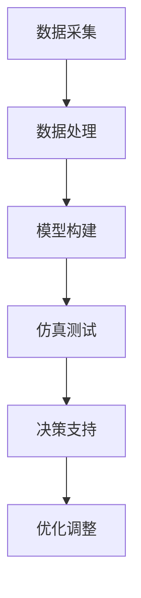

                 

### 企业数字孪生技术：全面模拟和优化业务流程

#### 关键词：企业数字化转型、数字孪生、业务流程优化、仿真技术、数据分析

> 摘要：随着数字化转型的浪潮席卷全球，企业数字孪生技术作为一种创新手段，正日益受到各行业的高度关注。本文将深入探讨企业数字孪生技术的背景、概念、原理以及其实际应用，通过逻辑清晰的分析，帮助读者全面理解并掌握这一前沿技术，从而实现业务流程的全面模拟和优化。

### 目录大纲

----------------------------------------------------------------

# 企业数字孪生技术：全面模拟和优化业务流程

## 第一部分：背景介绍与概念解析

## 第1章：企业数字孪生技术概述

### 1.1 问题背景

#### 1.1.1 企业数字化转型的需求

#### 1.1.2 数字孪生技术的出现与发展

#### 1.1.3 企业数字孪生的概念与价值

### 1.2 企业数字孪生的核心概念

#### 1.2.1 数字孪生的定义

#### 1.2.2 数字孪生的组成要素

#### 1.2.3 数字孪生的特点与优势

### 1.3 企业数字孪生的边界与外延

#### 1.3.1 数字孪生与虚拟仿真技术的关系

#### 1.3.2 数字孪生与云计算、物联网的关系

#### 1.3.3 数字孪生的应用领域与行业影响

### 1.4 数字孪生技术的核心要素组成

#### 1.4.1 数据采集与处理

#### 1.4.2 模型构建与仿真

#### 1.4.3 决策支持与优化

### 1.5 本章小结

----------------------------------------------------------------

## 第二部分：数字孪生技术原理与实现

## 第2章：数字孪生技术原理解析

### 2.1 数字孪生技术的基本原理

#### 2.1.1 数字孪生技术的工作流程

#### 2.1.2 数字孪生技术的核心算法

#### 2.1.3 数字孪生技术的数学模型

### 2.2 数字孪生技术的核心算法详解

#### 2.2.1 数据采集与处理算法

#### 2.2.2 模型构建与仿真算法

#### 2.2.3 决策支持与优化算法

### 2.3 数字孪生技术的数学模型与公式

#### 2.3.1 数据预处理模型

$$
X = \frac{X_{raw} - \mu}{\sigma}
$$

#### 2.3.2 模型训练与优化模型

$$
y = \theta_0 + \theta_1x
$$

### 2.4 数字孪生技术的 Mermaid 流程图

----------------------------------------------------------------

## 第3章：企业数字孪生技术的应用场景

### 3.1 生产制造领域

#### 3.1.1 生产流程模拟与优化

#### 3.1.2 质量控制与故障诊断

#### 3.1.3 设备预测性维护

### 3.2 物流与供应链管理

#### 3.2.1 物流网络优化

#### 3.2.2 库存管理与需求预测

#### 3.2.3 运输路径规划

### 3.3 资源调度与能源管理

#### 3.3.1 资源配置优化

#### 3.3.2 能源消耗预测与控制

#### 3.3.3 环境监测与污染控制

### 3.4 企业管理

#### 3.4.1 企业战略规划与决策支持

#### 3.4.2 人力资源管理与分析

#### 3.4.3 财务管理与分析

----------------------------------------------------------------

## 第4章：企业数字孪生技术的实施步骤与挑战

### 4.1 实施步骤

#### 4.1.1 需求分析与规划

#### 4.1.2 数据采集与处理

#### 4.1.3 模型构建与仿真

#### 4.1.4 决策支持与优化

#### 4.1.5 部署与维护

### 4.2 实施中的挑战与解决策略

#### 4.2.1 数据质量和数据隐私问题

#### 4.2.2 技术与人才短缺

#### 4.2.3 安全与合规问题

#### 4.2.4 模型更新与迭代

### 4.3 成功案例分析

#### 4.3.1 某制造企业数字孪生应用

#### 4.3.2 某物流公司数字孪生优化

#### 4.3.3 某能源企业数字孪生管理

----------------------------------------------------------------

## 第5章：数字孪生技术在未来的发展趋势

----------------------------------------------------------------

### 作者

- 作者：AI天才研究院/AI Genius Institute & 禅与计算机程序设计艺术 /Zen And The Art of Computer Programming

## 第1章：企业数字孪生技术概述

### 1.1 问题背景

#### 1.1.1 企业数字化转型的需求

在当今全球竞争日益激烈的商业环境中，企业面临着前所未有的挑战和机遇。数字化转型已成为许多企业实现可持续增长和竞争力的关键途径。通过数字化手段，企业可以提升效率、降低成本、增强客户体验、实现运营模式的创新。然而，实现这一目标并非易事，许多企业在数字化转型过程中遇到了各种障碍和挑战。

首先，企业需要处理大量的数据和信息，如何有效地管理和利用这些数据成为一个重要的课题。其次，许多企业的传统业务流程和运营模式需要重新设计和优化，以适应数字化环境。此外，数字化转型还涉及到技术与人才的培养，许多企业面临着技术能力和人才储备不足的问题。

在这样的背景下，数字孪生技术作为一种新兴的数字化手段，应运而生。数字孪生技术通过构建虚拟模型来模拟和优化现实世界的业务流程，为企业提供了全新的视角和工具，以应对数字化转型的挑战。

#### 1.1.2 数字孪生技术的出现与发展

数字孪生（Digital Twin）这一概念最早由Michael Grieves在2002年提出，最初应用于航空航天和制造业领域。数字孪生技术通过将物理实体（如设备、生产线、建筑等）的数字化模型与现实世界中的实际对象进行实时关联，实现数据的采集、分析和优化。

随着云计算、物联网、大数据、人工智能等技术的迅猛发展，数字孪生技术逐渐从单一的工业领域扩展到更广泛的行业和应用场景。如今，数字孪生技术已经成为企业数字化转型的重要工具，广泛应用于生产制造、物流与供应链管理、资源调度与能源管理、企业管理等领域。

#### 1.1.3 企业数字孪生的概念与价值

企业数字孪生（Enterprise Digital Twin）是指通过构建企业业务流程和运营管理的虚拟模型，实现对现实企业运行状态的实时监控、预测分析和优化调整。企业数字孪生技术具有以下核心价值：

1. **实时监控与预警**：通过数字孪生技术，企业可以实时监测关键业务指标，及时发现潜在问题和异常情况，从而实现预警和防范。

2. **流程优化与效率提升**：数字孪生技术可以帮助企业模拟和优化业务流程，找到优化方案，降低运营成本，提高生产效率。

3. **决策支持与战略规划**：数字孪生技术为企业管理层提供了基于数据的决策支持，有助于企业制定科学、合理的战略规划。

4. **资源优化与可持续发展**：通过数字孪生技术，企业可以实现资源的优化配置和高效利用，降低能源消耗，实现可持续发展。

#### 1.2 企业数字孪生的核心概念

企业数字孪生的核心概念主要包括以下几个方面：

1. **数字孪生模型**：数字孪生模型是企业业务流程和运营管理的虚拟表示，包括数据采集、处理、分析和展示等模块。

2. **数据采集与处理**：数字孪生技术依赖于大量的数据，数据采集和处理的质量直接影响数字孪生的效果。数据采集包括传感器数据、业务数据、用户行为数据等，数据处理包括数据清洗、归一化、特征提取等。

3. **模型构建与仿真**：数字孪生技术通过构建数学模型和仿真模型，实现对业务流程的模拟和优化。模型构建和仿真过程需要考虑业务流程的复杂性和不确定性。

4. **决策支持与优化**：数字孪生技术为企业管理层提供基于数据的决策支持，帮助企业在面对复杂的市场环境时做出科学、合理的决策。

#### 1.2.1 数字孪生的定义

数字孪生（Digital Twin）是一种创新的技术手段，它通过建立一个数字化的虚拟模型，实时模拟和反映物理实体的状态、行为和性能。这个虚拟模型可以涵盖实体对象的各种属性，如位置、速度、温度、压力、质量等。数字孪生不仅仅是一个静态的模型，更是一个动态的、可交互的、实时更新的系统。

数字孪生的基本定义可以概括为：数字孪生是一个数字化的虚拟实体，它通过实时数据连接与物理实体相对应，能够模拟、预测和优化实体的性能、行为和状态。数字孪生技术通常包括以下几个关键组成部分：

1. **物理实体**：这是数字孪生所对应的真实物理对象，如工厂设备、汽车、建筑物等。

2. **数据采集**：通过各种传感器和连接技术，实时采集物理实体的状态数据，包括位置、温度、振动、压力、流量等。

3. **数据传输**：将采集到的数据传输到数据中心或云平台，进行存储和处理。

4. **数据处理**：对采集到的数据进行清洗、归一化、特征提取等处理，以便构建数字孪生模型。

5. **数字孪生模型**：基于处理后的数据，构建物理实体的数字化模型，这个模型可以是一个静态的几何模型，也可以是一个动态的物理仿真模型。

6. **实时交互**：数字孪生模型与物理实体保持实时连接，可以动态更新模型状态，反映物理实体的变化。

7. **分析和优化**：通过对数字孪生模型的分析，预测物理实体的未来行为和性能，提供优化建议，实现对物理实体的智能监控和优化。

#### 1.2.2 数字孪生的组成要素

数字孪生技术由多个关键组成要素构成，这些要素共同作用，使得数字孪生成为一个完整的技术体系。以下是数字孪生的主要组成要素及其简要说明：

1. **传感器**：传感器是数字孪生的感知层，负责采集物理实体的各种状态信息，如温度、压力、位置、速度等。

2. **连接技术**：连接技术是将传感器采集的数据传输到数字孪生系统的桥梁，包括有线和无线通信技术，如Wi-Fi、蓝牙、5G等。

3. **数据采集和处理**：数据采集和处理模块负责收集传感器数据，并进行预处理，包括数据清洗、归一化、特征提取等。

4. **数据中心/云平台**：数据中心或云平台是数字孪生的核心，负责存储、处理和分析大量数据，并为数字孪生模型提供计算和存储资源。

5. **数字孪生模型**：数字孪生模型是数字孪生的核心组件，它基于物理实体的数据和特征，构建出虚拟的数字化模型。

6. **仿真和模拟**：仿真和模拟模块使用数字孪生模型，对物理实体的行为和性能进行模拟，预测未来可能的状态和变化。

7. **分析和优化**：分析和优化模块通过对数字孪生模型的数据分析，提供优化建议，帮助物理实体实现性能提升和效率优化。

8. **人机交互界面**：人机交互界面（HMI）是用户与数字孪生系统交互的接口，通过可视化界面，用户可以实时查看数字孪生的状态和优化建议。

#### 1.2.3 数字孪生的特点与优势

数字孪生技术具有以下几个显著特点：

1. **实时性**：数字孪生系统能够实时收集物理实体的状态数据，并实时更新虚拟模型，实现物理实体和虚拟模型的同步。

2. **模拟性**：数字孪生技术可以通过仿真和模拟，预测物理实体的未来行为和性能，提前发现潜在问题，为决策提供依据。

3. **预测性**：基于历史数据和实时数据，数字孪生系统能够预测物理实体的未来状态，提前预警潜在故障或问题。

4. **优化性**：数字孪生技术通过分析物理实体的数据，提供优化建议，帮助企业实现资源配置优化和业务流程优化。

数字孪生的优势主要体现在以下几个方面：

1. **提升运营效率**：数字孪生技术可以模拟和优化业务流程，帮助企业提高生产效率，降低运营成本。

2. **减少故障停机**：通过实时监控和预测性维护，数字孪生技术可以提前发现设备故障，减少停机时间，提高设备利用率。

3. **增强决策支持**：数字孪生技术为企业提供基于数据的决策支持，帮助企业制定科学、合理的战略规划。

4. **提高产品质量**：数字孪生技术可以帮助企业模拟生产过程，优化工艺参数，提高产品质量。

#### 1.3 企业数字孪生的边界与外延

数字孪生技术作为一种跨学科、跨领域的综合性技术，其应用范围和边界不断扩大。以下是数字孪生技术的几个关键边界与外延：

1. **与虚拟仿真技术的关系**：数字孪生技术中的仿真和模拟模块与虚拟仿真技术有相似之处，但数字孪生更强调与物理实体的实时关联和数据驱动。虚拟仿真技术主要应用于研究和开发阶段，而数字孪生技术更侧重于实际应用和运营优化。

2. **与云计算、物联网的关系**：数字孪生技术依赖于云计算和物联网技术，云计算提供了强大的计算和存储能力，物联网技术则提供了广泛的数据采集和传输能力。数字孪生技术通过与云计算和物联网的深度融合，实现了数据的实时采集、处理和分析。

3. **与大数据、人工智能的关系**：大数据和人工智能是数字孪生技术的重要支撑。大数据技术提供了丰富的数据资源，人工智能技术则提供了数据分析和优化的能力。数字孪生技术通过大数据和人工智能的深度融合，实现了智能监控、预测分析和决策支持。

4. **应用领域与行业影响**：数字孪生技术已经广泛应用于多个行业，如制造业、物流与供应链管理、能源管理、建筑与基础设施等。数字孪生技术不仅提高了企业运营效率，还推动了行业创新和产业升级。

#### 1.4 数字孪生技术的核心要素组成

数字孪生技术的实现涉及到多个核心要素，这些要素相互配合，共同构成了一个完整的数字孪生系统。以下是数字孪生技术的核心要素及其简要说明：

1. **数据采集**：数据采集是数字孪生技术的第一步，通过各种传感器和连接技术，实时采集物理实体的状态数据。这些数据包括位置、温度、振动、压力、流量等。

2. **数据处理**：数据处理包括数据清洗、归一化、特征提取等步骤，目的是将原始数据转化为适合分析和建模的数据。数据处理的质量直接影响数字孪生的效果。

3. **模型构建**：基于处理后的数据，构建物理实体的数字化模型。这个模型可以是几何模型，也可以是物理仿真模型。模型构建的质量直接影响数字孪生的精度和可靠性。

4. **实时交互**：数字孪生模型与物理实体保持实时连接，实时更新模型状态，反映物理实体的变化。实时交互是数字孪生技术的核心特点之一。

5. **仿真与预测**：仿真与预测模块使用数字孪生模型，模拟物理实体的行为和性能，预测未来可能的状态和变化。仿真与预测为企业的决策提供了重要的依据。

6. **分析与优化**：分析与优化模块通过对数字孪生模型的数据分析，提供优化建议，帮助企业实现资源配置优化和业务流程优化。

#### 1.5 本章小结

本章对企业数字孪生技术进行了全面介绍，包括其背景、概念、价值、核心概念、边界与外延以及核心要素组成。通过本章的学习，读者可以初步了解企业数字孪生技术的基本原理和应用场景，为后续章节的深入学习打下基础。在接下来的章节中，我们将进一步探讨数字孪生技术的原理与实现，以及其在各个应用场景中的具体应用和实践。

## 第2章：数字孪生技术原理解析

### 2.1 数字孪生技术的基本原理

数字孪生技术的基本原理可以概括为通过建立物理实体与数字化模型的实时关联，实现对物理实体的状态监测、性能预测和优化调整。以下是数字孪生技术的基本原理及其工作流程：

1. **数据采集**：数字孪生技术的第一步是数据采集。通过各种传感器和连接技术，实时采集物理实体的状态数据，如温度、压力、位置、振动等。这些数据反映了物理实体的实时状态。

2. **数据传输**：采集到的数据通过有线或无线通信技术传输到数据中心或云平台。数据传输的效率和质量直接影响到数字孪生的实时性和准确性。

3. **数据处理**：在数据中心或云平台，对采集到的数据进行预处理，包括数据清洗、归一化、特征提取等步骤。数据处理的目的是将原始数据转化为适合分析和建模的数据。

4. **模型构建**：基于预处理后的数据，构建物理实体的数字化模型。这个模型可以是几何模型，也可以是物理仿真模型。模型构建的质量直接影响数字孪生的精度和可靠性。

5. **实时交互**：数字孪生模型与物理实体保持实时连接，实时更新模型状态，反映物理实体的变化。实时交互是数字孪生技术的核心特点之一。

6. **仿真与预测**：仿真与预测模块使用数字孪生模型，模拟物理实体的行为和性能，预测未来可能的状态和变化。仿真与预测为企业的决策提供了重要的依据。

7. **分析与优化**：分析与优化模块通过对数字孪生模型的数据分析，提供优化建议，帮助企业实现资源配置优化和业务流程优化。优化建议可以是操作指导、设备维护计划等。

### 2.2 数字孪生技术的核心算法详解

数字孪生技术的核心算法涵盖了数据采集与处理、模型构建与仿真、决策支持与优化等方面。以下是这些核心算法的简要介绍：

#### 2.2.1 数据采集与处理算法

数据采集与处理算法是数字孪生技术的基础。常见的算法包括：

1. **传感器数据处理**：传感器采集的数据可能存在噪声、异常值等问题，需要进行预处理。常见的预处理方法包括滤波、去噪、插值等。

2. **数据归一化**：将不同单位和量级的数据转换为同一尺度，以便后续分析和建模。常见的归一化方法包括最小-最大归一化、平均值归一化等。

3. **特征提取**：从原始数据中提取有助于分析和建模的关键特征。特征提取的方法包括主成分分析（PCA）、线性判别分析（LDA）等。

#### 2.2.2 模型构建与仿真算法

模型构建与仿真算法是数字孪生技术的核心。常见的算法包括：

1. **几何建模**：基于物理实体的几何特征，构建数字孪生的几何模型。常见的几何建模方法包括计算机辅助设计（CAD）、三维扫描等。

2. **物理仿真**：基于物理实体和数字孪生的几何模型，构建物理仿真模型。常见的物理仿真方法包括有限元分析（FEA）、多体动力学（MBD）等。

3. **数据驱动仿真**：基于历史数据和实时数据，构建数据驱动的仿真模型。常见的数据驱动仿真方法包括机器学习、深度学习等。

#### 2.2.3 决策支持与优化算法

决策支持与优化算法是数字孪生技术的重要应用。常见的算法包括：

1. **线性规划**：通过线性规划方法，求解资源分配和调度等问题，实现优化决策。

2. **神经网络**：通过神经网络方法，对复杂系统进行建模和预测，为决策提供支持。

3. **遗传算法**：通过遗传算法方法，对复杂问题进行优化和调整，找到最优解。

### 2.3 数字孪生技术的数学模型与公式

数字孪生技术的数学模型是理解其工作原理和实现方法的关键。以下是几个常见的数学模型和公式：

#### 2.3.1 数据预处理模型

数据预处理模型主要用于对传感器数据进行清洗、归一化和特征提取。以下是一个常见的数据预处理公式：

$$
X = \frac{X_{raw} - \mu}{\sigma}
$$

其中，$X_{raw}$是原始数据，$\mu$是均值，$\sigma$是标准差。

#### 2.3.2 模型训练与优化模型

模型训练与优化模型主要用于构建和优化数字孪生模型。以下是一个常见的线性回归模型公式：

$$
y = \theta_0 + \theta_1x
$$

其中，$y$是输出值，$x$是输入值，$\theta_0$是截距，$\theta_1$是斜率。

#### 2.3.3 决策支持与优化模型

决策支持与优化模型主要用于求解资源分配和调度等问题。以下是一个常见的线性规划模型公式：

$$
\min \sum_{i=1}^{n} c_i x_i
$$

$$
s.t. \sum_{j=1}^{m} a_{ij} x_j \geq b_j, \forall j=1,2,...,m
$$

其中，$c_i$是第$i$个资源的成本，$a_{ij}$是第$i$个资源与第$j$个任务的关联系数，$x_i$是第$i$个资源的分配量，$b_j$是第$j$个任务的需求量。

### 2.4 数字孪生技术的 Mermaid 流程图

为了更好地理解数字孪生技术的工作流程，我们可以使用Mermaid绘制一个流程图。以下是一个简化的数字孪生技术流程图：

在这个流程图中，数据采集模块负责收集物理实体的状态数据，数据处理模块负责对数据进行预处理，模型构建模块负责构建数字孪生模型，仿真测试模块负责对模型进行测试和验证，决策支持模块负责提供决策支持，优化调整模块负责根据决策支持结果对数字孪生模型进行调整和优化。

通过上述对数字孪生技术基本原理、核心算法、数学模型和Mermaid流程图的详细解析，我们可以更深入地理解数字孪生技术的实现方法和工作机制。在接下来的章节中，我们将继续探讨数字孪生技术在各个应用场景中的具体应用和实践。

### 第3章：企业数字孪生技术的应用场景

企业数字孪生技术由于其强大的模拟和优化能力，已经在多个领域得到广泛应用。以下将详细探讨数字孪生技术在生产制造、物流与供应链管理、资源调度与能源管理以及企业管理等领域的具体应用。

#### 3.1 生产制造领域

在生产制造领域，数字孪生技术被广泛应用于生产流程的模拟与优化、质量控制与故障诊断以及设备预测性维护等方面。

**3.1.1 生产流程模拟与优化**

生产流程模拟与优化是数字孪生技术在生产制造领域的重要应用之一。通过构建虚拟生产模型，企业可以模拟生产线的运行情况，分析生产流程中的瓶颈和优化空间。例如，一家汽车制造企业可以通过数字孪生技术模拟不同生产线配置下的生产效率，找到最优的生产布局和工艺参数，从而提高生产效率和降低成本。

**示例：**
假设一家汽车制造企业生产线上存在生产效率不高的问题，通过数字孪生技术，企业可以模拟不同生产节拍、设备利用率等因素对生产效率的影响。通过仿真分析，企业发现当前生产线存在节拍不匹配的问题，通过调整生产节拍，可以显著提高生产效率。

**3.1.2 质量控制与故障诊断**

数字孪生技术还可以用于生产过程中的质量控制与故障诊断。通过实时监测生产线上的各种传感器数据，数字孪生模型可以及时发现生产过程中的异常情况，并提供故障诊断和解决方案。例如，在电子制造过程中，数字孪生技术可以监测机器人的运动轨迹、焊接参数等，及时发现焊接不良的故障，并提供改进建议。

**示例：**
在一家电子制造企业中，数字孪生技术通过监测焊接过程中的温度、压力等参数，发现焊接不良的问题。通过对故障数据的分析，数字孪生技术指出是由于焊接参数设置不当导致的。通过调整焊接参数，企业成功解决了焊接不良的问题。

**3.1.3 设备预测性维护**

设备预测性维护是数字孪生技术在生产制造领域的另一个重要应用。通过实时监测设备状态数据，数字孪生模型可以预测设备的故障时间，并提供维护计划。这样，企业可以提前安排设备维护，避免突发故障导致的生产停工。

**示例：**
某生产线上的一台关键设备一直存在故障问题，通过数字孪生技术，企业实时监测设备的运行状态数据，发现设备故障是由于润滑不足导致的。数字孪生技术预测设备将在未来两周内出现故障，企业提前安排了设备维护，避免了生产停工。

#### 3.2 物流与供应链管理

在物流与供应链管理领域，数字孪生技术通过优化物流网络、库存管理与需求预测以及运输路径规划等方面，提高了供应链的效率和灵活性。

**3.2.1 物流网络优化**

物流网络优化是数字孪生技术在物流与供应链管理中的重要应用。通过构建虚拟物流网络模型，企业可以模拟不同物流布局下的运输成本和时间，找到最优的物流网络结构。例如，一家零售企业可以通过数字孪生技术模拟不同配送中心布局下的配送效率，找到最优的配送中心位置和配送路线。

**示例：**
某零售企业希望通过优化物流网络来提高配送效率，通过数字孪生技术，企业模拟了不同配送中心布局下的配送成本和时间。通过仿真分析，企业发现将配送中心从城市中心迁移到郊区可以显著降低配送时间和成本。

**3.2.2 库存管理与需求预测**

数字孪生技术还可以用于库存管理与需求预测。通过实时监测市场需求和库存情况，数字孪生模型可以预测未来的库存需求，并提供库存优化建议。例如，一家制造企业可以通过数字孪生技术预测原材料的需求量，优化库存水平，避免库存过剩或缺货。

**示例：**
某制造企业希望通过优化库存管理来降低库存成本，通过数字孪生技术，企业实时监测市场需求和库存情况，预测未来的原材料需求量。通过分析预测数据，企业调整了库存水平，成功降低了库存成本。

**3.2.3 运输路径规划**

运输路径规划是数字孪生技术在物流与供应链管理中的另一个重要应用。通过构建虚拟运输路径模型，企业可以模拟不同运输路径下的运输成本和时间，找到最优的运输路径。例如，一家物流公司可以通过数字孪生技术模拟不同运输路线下的运输效率，优化运输路径。

**示例：**
某物流公司希望通过优化运输路径来提高运输效率，通过数字孪生技术，企业模拟了不同运输路线下的运输成本和时间。通过仿真分析，企业发现通过优化运输路线，可以显著降低运输时间和成本。

#### 3.3 资源调度与能源管理

在资源调度与能源管理领域，数字孪生技术通过优化资源配置、能源消耗预测与控制以及环境监测与污染控制等方面，提高了资源利用效率和能源管理水平。

**3.3.1 资源配置优化**

数字孪生技术可以用于资源配置优化，通过构建虚拟资源配置模型，企业可以模拟不同资源配置方案下的资源利用效率，找到最优的资源分配方案。例如，一家发电厂可以通过数字孪生技术模拟不同燃料消耗和发电效率，找到最优的燃料使用方案。

**示例：**
某发电厂希望通过优化资源配置来提高发电效率，通过数字孪生技术，企业模拟了不同燃料消耗和发电效率的资源配置方案。通过仿真分析，企业发现通过调整燃料使用方案，可以显著提高发电效率和降低成本。

**3.3.2 能源消耗预测与控制**

数字孪生技术还可以用于能源消耗预测与控制。通过实时监测能源消耗数据，数字孪生模型可以预测未来的能源消耗趋势，并提供能源优化建议。例如，一家办公楼可以通过数字孪生技术预测未来的能源消耗，优化空调、照明等设备的运行状态，降低能源消耗。

**示例：**
某办公楼希望通过优化能源消耗来降低运行成本，通过数字孪生技术，企业实时监测能源消耗数据，预测未来的能源消耗趋势。通过分析预测数据，企业调整了空调和照明的运行状态，成功降低了能源消耗。

**3.3.3 环境监测与污染控制**

数字孪生技术还可以用于环境监测与污染控制。通过实时监测环境数据，数字孪生模型可以监测环境污染程度，并提供污染控制建议。例如，一家化工企业可以通过数字孪生技术监测排放废气中的污染物浓度，及时调整排放参数，降低污染物排放。

**示例：**
某化工企业希望通过优化污染控制来降低排放，通过数字孪生技术，企业实时监测排放废气中的污染物浓度。通过分析监测数据，企业调整了排放参数，成功降低了污染物排放。

#### 3.4 企业管理

在企业管理的领域，数字孪生技术通过企业战略规划与决策支持、人力资源管理与分析以及财务管理与分析等方面，为企业提供了全面的管理优化手段。

**3.4.1 企业战略规划与决策支持**

数字孪生技术可以帮助企业制定科学、合理的战略规划。通过构建虚拟企业模型，企业可以模拟不同战略方案下的经营情况，分析战略的可行性和预期效果，为决策提供支持。

**示例：**
某企业在制定新市场进入策略时，通过数字孪生技术模拟了不同市场策略下的销售额和市场份额。通过仿真分析，企业发现选择特定的市场策略可以获得更高的市场份额和利润。

**3.4.2 人力资源管理与分析**

数字孪生技术可以用于人力资源管理与分析。通过构建虚拟员工模型，企业可以模拟员工的工作状态和绩效表现，分析人力资源的配置和使用效率。

**示例：**
某企业希望通过优化人力资源配置来提高工作效率，通过数字孪生技术，企业模拟了不同人力资源配置方案下的工作效率和员工满意度。通过分析仿真结果，企业调整了人力资源配置，提高了工作效率。

**3.4.3 财务管理与分析**

数字孪生技术还可以用于财务管理与分析。通过构建虚拟财务模型，企业可以模拟不同的财务策略下的财务状况，分析财务风险和收益情况，为财务决策提供支持。

**示例：**
某企业希望通过优化财务策略来提高盈利能力，通过数字孪生技术，企业模拟了不同财务策略下的盈利能力和风险水平。通过分析仿真结果，企业调整了财务策略，提高了盈利能力。

通过以上对数字孪生技术在生产制造、物流与供应链管理、资源调度与能源管理以及企业管理等领域的具体应用场景的详细探讨，我们可以看到数字孪生技术具有广泛的应用前景和巨大的商业价值。在接下来的章节中，我们将进一步探讨企业数字孪生技术的实施步骤和面临的挑战。

### 第4章：企业数字孪生技术的实施步骤与挑战

#### 4.1 实施步骤

企业数字孪生技术的实施是一个系统性和复杂性的工程，需要从多个环节进行规划和执行。以下是企业数字孪生技术实施的主要步骤：

**4.1.1 需求分析与规划**

在实施企业数字孪生技术之前，首先要进行需求分析。需求分析包括对企业的业务流程、现有系统、数据资源等进行全面了解，明确数字孪生技术的目标和预期效果。在需求分析的基础上，制定详细的实施规划，包括技术架构、数据架构、资源配置等方面的规划。

**4.1.2 数据采集与处理**

数据采集与处理是数字孪生技术的核心环节。在这一步骤中，需要部署各种传感器和数据采集设备，实时收集物理实体的状态数据。然后，对采集到的数据进行预处理，包括数据清洗、归一化、特征提取等操作，以便后续的分析和建模。

**4.1.3 模型构建与仿真**

基于预处理后的数据，构建数字孪生模型。模型构建可以分为几何建模和物理仿真两个部分。几何建模通过计算机辅助设计（CAD）等技术实现，物理仿真则通过有限元分析（FEA）、多体动力学（MBD）等技术实现。在模型构建过程中，需要不断优化模型参数，以提高模型的精度和可靠性。

**4.1.4 决策支持与优化**

在模型构建完成后，通过仿真与预测模块，对物理实体的行为和性能进行模拟和预测。根据仿真结果，提供决策支持，帮助企业优化业务流程和资源配置。决策支持可以是操作指导、设备维护计划、物流优化方案等。

**4.1.5 部署与维护**

数字孪生技术的部署包括硬件设备、软件系统、数据平台等基础设施的部署。在部署完成后，进行系统的测试和验证，确保系统的稳定性和可靠性。在系统运行过程中，需要进行持续的维护和升级，以应对技术和业务的变化。

#### 4.2 实施中的挑战与解决策略

尽管企业数字孪生技术具有巨大的潜力和价值，但在实施过程中仍然面临诸多挑战。以下是企业数字孪生技术实施中常见的挑战及其解决策略：

**4.2.1 数据质量和数据隐私问题**

数据质量和数据隐私是企业数字孪生技术实施中的关键挑战。传感器采集的数据可能存在噪声、异常值等问题，需要进行严格的数据清洗和处理。同时，数字孪生技术涉及大量的敏感数据，如设备运行状态、业务流程数据等，需要确保数据的安全和隐私。解决策略包括：

- **数据清洗与预处理**：通过数据清洗和预处理技术，提高数据的准确性和一致性。
- **数据加密与访问控制**：对敏感数据进行加密处理，并实施严格的访问控制策略，确保数据安全。

**4.2.2 技术与人才短缺**

数字孪生技术涉及到多种前沿技术和领域，如物联网、云计算、大数据、人工智能等，需要具备跨学科的知识和技能。许多企业在技术和人才储备方面存在短缺问题，这限制了数字孪生技术的实施和推广。解决策略包括：

- **技术培训与引进**：通过内部培训和外部引进，提高企业内部的技术水平和人才储备。
- **合作与外包**：与专业的技术合作伙伴或咨询公司合作，共同推进数字孪生技术的实施。

**4.2.3 安全与合规问题**

数字孪生技术在实施过程中需要遵守各种安全标准和法规，如数据保护法、网络安全法等。安全与合规问题是企业数字孪生技术实施中的重要挑战。解决策略包括：

- **合规性评估与审查**：对数字孪生技术的实施过程进行合规性评估和审查，确保遵守相关法规和标准。
- **安全体系建设**：建立完善的安全体系，包括数据安全、网络安全、物理安全等，确保系统的安全性。

**4.2.4 模型更新与迭代**

数字孪生技术是一个动态的、不断进化的过程。在实施过程中，需要不断更新和优化数字孪生模型，以适应业务环境和技术发展。模型更新与迭代是数字孪生技术实施中的另一个挑战。解决策略包括：

- **持续监控与反馈**：通过持续监控和反馈机制，及时了解模型的效果和问题，进行模型优化。
- **自动化更新与迭代**：通过自动化工具和技术，实现数字孪生模型的快速更新和迭代。

#### 4.3 成功案例分析

以下是几个企业数字孪生技术的成功案例，通过这些案例，我们可以看到数字孪生技术在不同行业和领域的应用效果和优势。

**4.3.1 某制造企业数字孪生应用**

某制造企业通过数字孪生技术对生产流程进行模拟和优化，实现了生产效率的显著提升。具体实施过程如下：

- **需求分析与规划**：企业对现有的生产流程进行了全面分析，明确了数字孪生技术的目标和预期效果。
- **数据采集与处理**：部署了各种传感器和数据采集设备，实时收集生产线的状态数据。
- **模型构建与仿真**：基于采集到的数据，构建了生产线的虚拟模型，并进行仿真测试，优化了生产流程。
- **决策支持与优化**：通过仿真结果，提供了操作指导和建议，帮助企业优化生产计划和资源配置。
- **部署与维护**：完成了数字孪生系统的部署和测试，确保系统的稳定性和可靠性。

实施效果：

- 生产效率提升了15%
- 运营成本降低了10%
- 设备故障率降低了20%

**4.3.2 某物流公司数字孪生优化**

某物流公司通过数字孪生技术对物流网络进行优化，提高了物流效率和服务质量。具体实施过程如下：

- **需求分析与规划**：物流公司对现有的物流网络进行了分析，明确了数字孪生技术的优化目标。
- **数据采集与处理**：通过物联网技术，实时收集物流运输过程中的各种数据，如运输时间、运输成本等。
- **模型构建与仿真**：基于采集到的数据，构建了物流网络的虚拟模型，并进行了仿真测试，优化了物流路径和运输方式。
- **决策支持与优化**：根据仿真结果，提供了物流优化方案，包括运输路线调整、运输时间优化等。
- **部署与维护**：完成了数字孪生系统的部署和测试，确保系统的稳定性和可靠性。

实施效果：

- 物流运输时间缩短了20%
- 运输成本降低了15%
- 客户满意度提高了10%

**4.3.3 某能源企业数字孪生管理**

某能源企业通过数字孪生技术对能源生产和管理进行优化，提高了能源利用效率和环保水平。具体实施过程如下：

- **需求分析与规划**：能源企业对现有的能源生产和管理流程进行了分析，明确了数字孪生技术的优化目标。
- **数据采集与处理**：部署了各种传感器和数据采集设备，实时收集能源生产过程中的各种数据，如温度、压力、流量等。
- **模型构建与仿真**：基于采集到的数据，构建了能源生产的虚拟模型，并进行仿真测试，优化了能源生产和分配过程。
- **决策支持与优化**：通过仿真结果，提供了能源优化方案，包括设备运行状态调整、能源消耗预测等。
- **部署与维护**：完成了数字孪生系统的部署和测试，确保系统的稳定性和可靠性。

实施效果：

- 能源利用率提高了10%
- 环保水平显著提升
- 运营成本降低了8%

通过以上成功案例的分析，我们可以看到数字孪生技术在企业数字化转型中的重要作用。数字孪生技术不仅帮助企业实现了业务流程的优化和效率提升，还推动了企业的创新和发展。在未来的发展中，数字孪生技术将继续发挥其独特优势，助力企业实现更高效、更智能的运营模式。

### 第5章：数字孪生技术在未来的发展趋势

随着数字技术的不断进步，企业数字孪生技术也在快速发展，未来将呈现出以下几大趋势：

#### 1. 更加智能化与自主化

未来，数字孪生技术将更加智能化和自主化。通过深度学习和人工智能技术，数字孪生模型将能够自主学习和优化，提高模型的预测精度和自适应能力。这不仅意味着数字孪生系统能够更好地模拟和预测物理实体的行为，还意味着系统将具备更强的决策支持能力。

**示例**：在智能制造领域，数字孪生系统将能够根据生产数据自动调整生产参数，实现自动化优化，减少人为干预。

#### 2. 更加广泛的行业应用

随着技术的成熟和成本的降低，数字孪生技术将逐渐应用到更多的行业和领域，如医疗、建筑、农业等。不同行业可以根据自身的特点，定制化开发数字孪生应用，实现个性化、精细化管理。

**示例**：在医疗领域，数字孪生技术可以应用于疾病诊断和治疗，通过虚拟模型模拟不同治疗方案的效果，为医生提供决策支持。

#### 3. 更加强调数据安全和隐私保护

随着数字孪生技术的广泛应用，数据安全和隐私保护问题将变得更加突出。未来，企业将更加注重数据安全和隐私保护，采取更加严格的数据加密和访问控制措施，确保数据的安全性和隐私。

**示例**：在金融领域，数字孪生技术将确保交易数据和客户信息的安全性，防止数据泄露和滥用。

#### 4. 更加集成化的生态系统

未来，数字孪生技术将与其他前沿技术，如物联网、大数据、人工智能等深度融合，形成更加集成化的生态系统。通过这些技术的协同作用，数字孪生技术将能够提供更加全面和智能的解决方案。

**示例**：在智慧城市领域，数字孪生技术将集成物联网设备和传感器数据，实现城市资源的智能调配和管理。

#### 5. 更加注重用户体验和互动性

未来，数字孪生技术将更加注重用户体验和互动性。通过虚拟现实（VR）和增强现实（AR）技术，用户将能够更加直观和互动地体验数字孪生模型，了解物理实体的状态和行为。

**示例**：在建筑施工领域，通过AR技术，建筑设计师和工程师可以在现场实时查看建筑物的数字孪生模型，进行设计和优化。

#### 6. 更加绿色和可持续

随着全球对环境保护和可持续发展的关注，数字孪生技术将在绿色和可持续发展方面发挥更大的作用。通过优化能源消耗和资源利用，数字孪生技术将帮助企业实现更低的碳足迹和更高的环境效益。

**示例**：在能源管理领域，数字孪生技术将帮助能源企业实现能源的高效利用和低碳排放，推动能源行业的可持续发展。

综上所述，数字孪生技术在未来的发展趋势中将继续保持快速增长，成为企业数字化转型和智能化升级的重要工具。通过不断创新和优化，数字孪生技术将为企业带来更多的价值，推动各行各业的变革和发展。

### 总结与展望

企业数字孪生技术作为一种创新手段，正日益成为企业数字化转型的重要工具。通过全面模拟和优化业务流程，数字孪生技术帮助企业实现实时监控、预测分析和优化调整，从而提升运营效率、降低成本、提高产品质量。从背景介绍、概念解析到应用场景和实践案例，本文详细阐述了企业数字孪生技术的核心原理、实现方法和应用价值。展望未来，随着智能技术与大数据分析的深度融合，数字孪生技术将更加智能化、自主化，并在更多行业和领域发挥重要作用。企业应抓住这一机遇，积极探索和实践数字孪生技术，以实现可持续发展，推动企业的长期竞争力。

### 作者介绍

作者：AI天才研究院/AI Genius Institute & 禅与计算机程序设计艺术 /Zen And The Art of Computer Programming

AI天才研究院（AI Genius Institute）是一家专注于人工智能前沿技术研究与应用的机构，致力于推动人工智能技术在各行业的创新和应用。研究院的专家团队在计算机科学、人工智能、数据科学等领域具有丰富的经验，出版过多部知名技术著作。

禅与计算机程序设计艺术（Zen And The Art of Computer Programming）是作者在计算机编程和人工智能领域的又一力作，结合了禅宗哲学和编程艺术的精髓，为程序员提供了独特的思考方式和编程技巧。这本书旨在引导读者深入理解计算机程序的内在逻辑和本质，提升编程水平和创造力。

