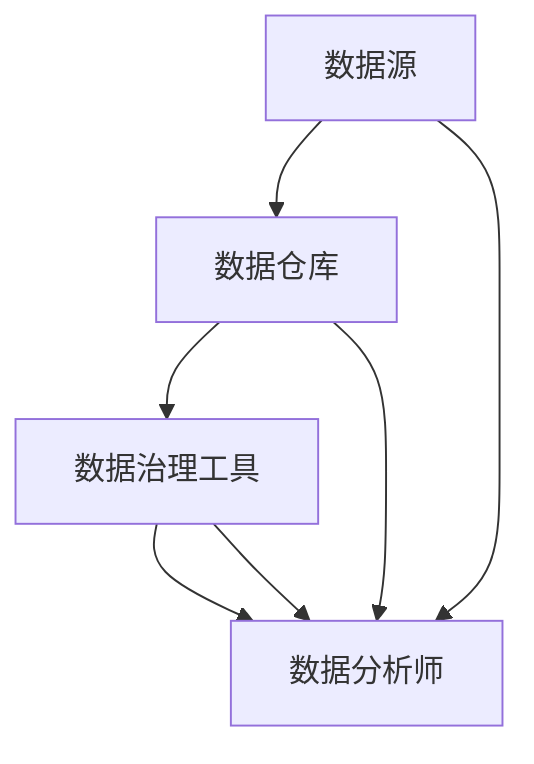
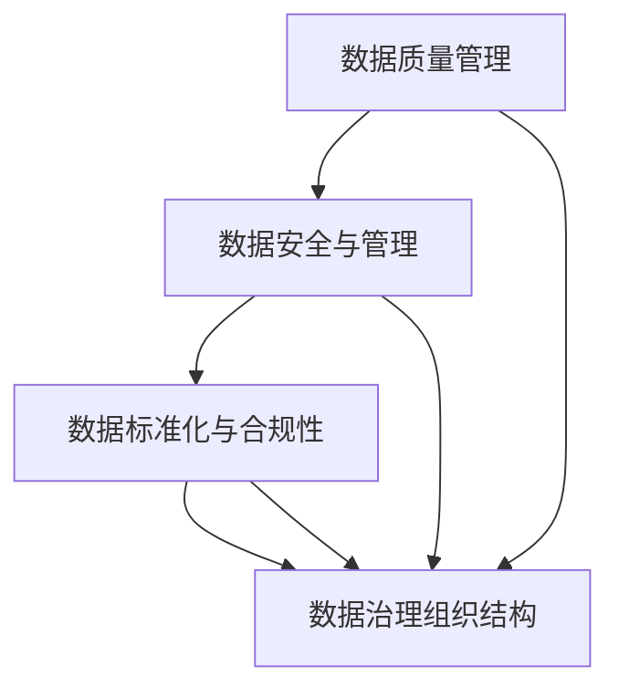
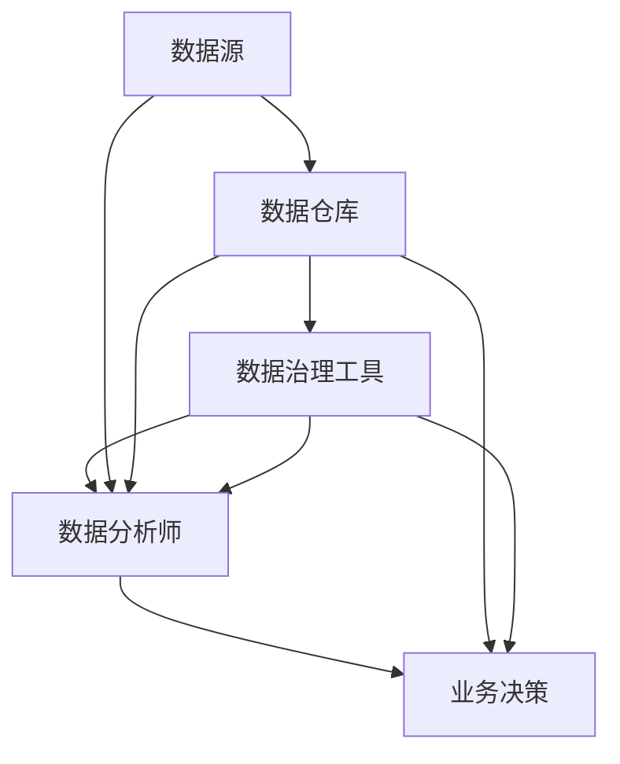
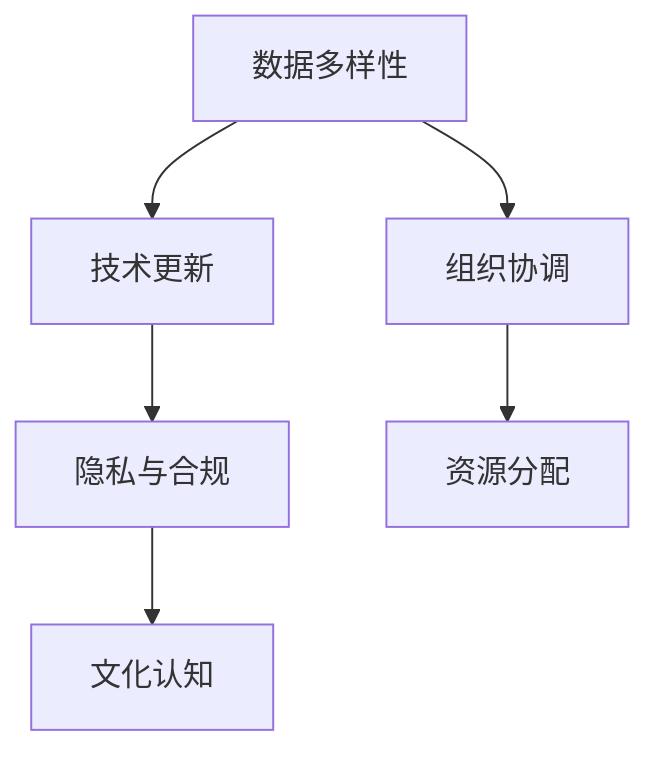

                 

### 背景介绍

随着互联网和大数据技术的飞速发展，企业数据量呈现出爆炸式增长。如何对这些海量数据进行高效治理，保障数据质量，进而挖掘数据价值，成为现代企业面临的重大挑战。数据治理不仅仅是技术问题，更是企业战略层面的重要议题。

#### 1.1 问题背景

在当今数字化时代，数据已经成为企业的重要资产。然而，随着数据量的不断增长，数据质量问题也随之而来。数据质量问题包括数据准确性、完整性、一致性、及时性和安全性等方面，这些问题直接影响企业的业务运营和决策制定。

#### 1.2 问题描述

数据治理涉及到数据质量控制、数据标准化、数据安全管理等多个方面，其复杂性和重要性不言而喻。然而，传统的数据治理方法往往依赖于人工和半自动化手段，效率低下，且难以应对数据爆炸式增长带来的挑战。这就需要引入智能化技术，通过算法和工具实现数据治理的自动化和智能化。

#### 1.3 问题解决

为了解决上述问题，企业需要构建一个高质量的数据生态，其中包括智能化数据治理平台、数据治理流程的优化、数据治理工具的应用等。智能化数据治理平台能够通过自动化算法和工具，对数据质量进行实时监控和优化，从而提高数据治理效率。

#### 1.4 边界与外延

数据治理的范围不仅限于企业内部数据，还包括跨部门、跨系统的数据整合和管理。此外，数据治理还需要考虑数据合规性和隐私保护等问题。

#### 1.5 概念结构与核心要素组成

- **数据治理**：指通过制定和执行政策、程序和标准，确保数据的准确性、一致性、可用性和安全性。
- **数据质量**：指数据满足特定业务需求的程度，包括准确性、完整性、一致性、及时性、可靠性和安全性等。
- **数据生态**：指围绕数据的生产、存储、处理、分析和使用所形成的复杂系统，包括数据源、数据仓库、数据治理工具、数据分析师等。

### 第1章: 数据治理的核心概念与重要性

## 1.1 数据治理的定义与作用

### 1.1.1 数据治理的定义

数据治理是指通过制定和执行策略、标准、流程和组织结构，确保数据质量和数据价值的系统化过程。它不仅关注数据的存储和管理，更注重数据的质量、安全性和合规性。

### 1.1.2 数据治理的作用

- **提升数据质量**：通过数据治理，可以确保数据的准确性、一致性、完整性和及时性，从而提高数据的使用价值。
- **保障数据安全**：数据治理有助于识别和防范数据泄露、篡改等安全风险，保护企业数据资产。
- **支持业务决策**：高质量的数据为企业的业务分析和决策提供了可靠的依据，有助于提升企业的竞争力。
- **符合法规要求**：数据治理有助于企业遵守相关法律法规，如《通用数据保护条例》（GDPR）等。

## 1.2 数据治理的关键要素

### 1.2.1 数据质量管理

数据质量管理是数据治理的核心，包括数据清洗、数据集成、数据验证等步骤，旨在提高数据的准确性、一致性和完整性。

### 1.2.2 数据安全与管理

数据安全与管理包括数据加密、访问控制、备份和恢复等，旨在保护数据免受未经授权的访问和破坏。

### 1.2.3 数据标准化与合规性

数据标准化确保数据在不同系统间的一致性和互操作性，而合规性管理则确保数据治理活动符合法律法规和行业规范。

### 1.2.4 数据治理组织结构

数据治理组织结构包括数据治理委员会、数据管理团队、数据分析师等，负责制定数据治理策略和执行数据治理活动。

## 1.3 数据治理与数据生态的关系

### 1.3.1 数据生态的定义

数据生态是指围绕数据的生产、存储、处理、分析和使用所形成的复杂系统，包括数据源、数据仓库、数据治理工具、数据分析师等。

### 1.3.2 数据治理与数据生态的关系

数据治理是数据生态的核心要素之一，它不仅直接影响数据的质量和安全，还与其他数据生态要素相互作用，共同构建一个高效、稳定的数据环境。

## 1.4 数据治理面临的挑战

### 1.4.1 数据多样性和复杂性

随着企业数据来源的多样性和数据类型的增加，数据治理面临着如何整合和管理不同类型数据的新挑战。

### 1.4.2 技术更新速度

数据治理领域的技术不断更新，企业需要不断学习和适应新技术，以保持数据治理的有效性。

### 1.4.3 数据隐私与合规性

数据隐私和合规性问题越来越受到重视，企业需要在数据治理过程中确保数据的合法性和合规性。

## 1.5 数据治理的发展趋势

### 1.5.1 智能化

随着人工智能技术的发展，智能化数据治理将成为未来数据治理的重要趋势，通过自动化算法和智能工具提高数据治理效率。

### 1.5.2 云化

云化技术为数据治理提供了灵活的部署方式和强大的计算能力，有助于降低成本和提高数据治理的效率。

### 1.5.3 数据治理平台的整合

企业需要构建一个统一的、集成的数据治理平台，实现数据从采集、存储、处理到分析的全流程管理。

----------------------------------------------------------------

# 企业数据治理智能化：构建高质量数据生态

> 关键词：数据治理、数据质量、智能化、数据生态、云计算

> 摘要：随着企业数据量的爆炸式增长，数据治理成为现代企业的重要挑战。本文探讨了数据治理的核心概念、重要性以及面临的挑战，并介绍了数据治理的发展趋势，强调了智能化和数据生态在构建高质量数据生态中的关键作用。

### 第一部分: 背景介绍

#### 1.1 问题背景

在当今数字化时代，数据已经成为企业的重要资产。然而，随着数据量的不断增长，数据质量问题也随之而来。数据质量问题包括数据准确性、完整性、一致性、及时性和安全性等方面，这些问题直接影响企业的业务运营和决策制定。

#### 1.2 问题描述

数据治理涉及到数据质量控制、数据标准化、数据安全管理等多个方面，其复杂性和重要性不言而喻。然而，传统的数据治理方法往往依赖于人工和半自动化手段，效率低下，且难以应对数据爆炸式增长带来的挑战。这就需要引入智能化技术，通过算法和工具实现数据治理的自动化和智能化。

#### 1.3 问题解决

为了解决上述问题，企业需要构建一个高质量的数据生态，其中包括智能化数据治理平台、数据治理流程的优化、数据治理工具的应用等。智能化数据治理平台能够通过自动化算法和工具，对数据质量进行实时监控和优化，从而提高数据治理效率。

#### 1.4 边界与外延

数据治理的范围不仅限于企业内部数据，还包括跨部门、跨系统的数据整合和管理。此外，数据治理还需要考虑数据合规性和隐私保护等问题。

#### 1.5 概念结构与核心要素组成

- **数据治理**：指通过制定和执行政策、程序和标准，确保数据的准确性、一致性、可用性和安全性。
- **数据质量**：指数据满足特定业务需求的程度，包括准确性、完整性、一致性、及时性、可靠性和安全性等。
- **数据生态**：指围绕数据的生产、存储、处理、分析和使用所形成的复杂系统，包括数据源、数据仓库、数据治理工具、数据分析师等。

### 第1章: 数据治理的核心概念与重要性

#### 1.1 数据治理的定义与作用

#### 1.1.1 数据治理的定义

数据治理是指通过制定和执行策略、标准、流程和组织结构，确保数据质量和数据价值的系统化过程。它不仅关注数据的存储和管理，更注重数据的质量、安全性和合规性。

#### 1.1.2 数据治理的作用

- **提升数据质量**：通过数据治理，可以确保数据的准确性、一致性、完整性和及时性，从而提高数据的使用价值。
- **保障数据安全**：数据治理有助于识别和防范数据泄露、篡改等安全风险，保护企业数据资产。
- **支持业务决策**：高质量的数据为企业的业务分析和决策提供了可靠的依据，有助于提升企业的竞争力。
- **符合法规要求**：数据治理有助于企业遵守相关法律法规，如《通用数据保护条例》（GDPR）等。

#### 1.2 数据治理的关键要素

#### 1.2.1 数据质量管理

数据质量管理是数据治理的核心，包括数据清洗、数据集成、数据验证等步骤，旨在提高数据的准确性、一致性和完整性。

#### 1.2.2 数据安全与管理

数据安全与管理包括数据加密、访问控制、备份和恢复等，旨在保护数据免受未经授权的访问和破坏。

#### 1.2.3 数据标准化与合规性

数据标准化确保数据在不同系统间的一致性和互操作性，而合规性管理则确保数据治理活动符合法律法规和行业规范。

#### 1.2.4 数据治理组织结构

数据治理组织结构包括数据治理委员会、数据管理团队、数据分析师等，负责制定数据治理策略和执行数据治理活动。

#### 1.3 数据治理与数据生态的关系

#### 1.3.1 数据生态的定义

数据生态是指围绕数据的生产、存储、处理、分析和使用所形成的复杂系统，包括数据源、数据仓库、数据治理工具、数据分析师等。

#### 1.3.2 数据治理与数据生态的关系

数据治理是数据生态的核心要素之一，它不仅直接影响数据的质量和安全，还与其他数据生态要素相互作用，共同构建一个高效、稳定的数据环境。

#### 1.4 数据治理面临的挑战

#### 1.4.1 数据多样性和复杂性

随着企业数据来源的多样性和数据类型的增加，数据治理面临着如何整合和管理不同类型数据的新挑战。

#### 1.4.2 技术更新速度

数据治理领域的技术不断更新，企业需要不断学习和适应新技术，以保持数据治理的有效性。

#### 1.4.3 数据隐私与合规性

数据隐私和合规性问题越来越受到重视，企业需要在数据治理过程中确保数据的合法性和合规性。

#### 1.5 数据治理的发展趋势

#### 1.5.1 智能化

随着人工智能技术的发展，智能化数据治理将成为未来数据治理的重要趋势，通过自动化算法和智能工具提高数据治理效率。

#### 1.5.2 云化

云化技术为数据治理提供了灵活的部署方式和强大的计算能力，有助于降低成本和提高数据治理的效率。

#### 1.5.3 数据治理平台的整合

企业需要构建一个统一的、集成的数据治理平台，实现数据从采集、存储、处理到分析的全流程管理。

## 第1章：数据治理的核心概念与重要性

### 1.1 数据治理的定义与作用

#### 1.1.1 数据治理的定义

数据治理是一种系统化的方法，旨在确保组织中的数据质量、安全性和合规性。它不仅仅是技术层面的工作，还涉及组织结构、流程、策略和标准的制定与执行。数据治理的目标是使组织能够有效地使用数据来支持业务决策和战略目标。

数据治理的定义可以拆解为以下几个关键点：

1. **系统化方法**：数据治理不是一项单一的任务，而是一个涉及多个层面和环节的综合性过程。
2. **数据质量**：确保数据的准确性、完整性、一致性、及时性和可靠性。
3. **安全性**：保护数据免受未经授权的访问、泄露或破坏。
4. **合规性**：确保数据治理活动符合法律法规、行业标准和组织政策。

#### 1.1.2 数据治理的作用

数据治理在组织中的重要性体现在以下几个方面：

1. **提升数据质量**：通过数据治理，可以消除数据中的错误、冗余和不一致，从而提高数据的可信度和使用价值。
2. **保障数据安全**：数据治理有助于制定和实施数据安全策略，防止数据泄露、篡改和滥用。
3. **支持业务决策**：高质量的数据为管理层提供了可靠的信息基础，有助于做出更明智的业务决策。
4. **符合法规要求**：数据治理有助于组织遵守相关法律法规，如《通用数据保护条例》（GDPR）和《加州消费者隐私法案》（CCPA）等。

### 1.2 数据治理的关键要素

数据治理的成功依赖于以下几个关键要素：

#### 1.2.1 数据质量管理

数据质量管理是数据治理的核心。它包括以下步骤：

1. **数据清洗**：识别和修正数据中的错误、缺失和重复。
2. **数据集成**：将来自不同来源的数据整合在一起，确保数据的一致性和完整性。
3. **数据验证**：检查数据的准确性和可靠性，确保数据满足特定的业务需求。

#### 1.2.2 数据安全与管理

数据安全与管理包括以下措施：

1. **数据加密**：使用加密技术保护敏感数据，防止未经授权的访问。
2. **访问控制**：通过身份验证和权限管理，控制谁可以访问数据。
3. **备份与恢复**：定期备份数据，确保在发生数据丢失或损坏时可以快速恢复。

#### 1.2.3 数据标准化与合规性

数据标准化确保数据在不同系统间的一致性和互操作性。合规性管理确保数据治理活动符合法律法规和行业规范。

#### 1.2.4 数据治理组织结构

数据治理组织结构包括以下角色和职责：

1. **数据治理委员会**：负责制定数据治理策略和决策。
2. **数据管理团队**：执行数据治理计划和项目。
3. **数据分析师**：分析数据，提供数据洞察和报告。

### 1.3 数据治理与数据生态的关系

数据治理是数据生态的核心要素之一，它与其他数据生态要素相互作用，共同构建一个高效、稳定的数据环境。数据生态包括以下几个关键组成部分：

1. **数据源**：数据的产生者和提供者，如数据库、应用程序和传感器。
2. **数据仓库**：用于存储和管理大量数据的集中式系统。
3. **数据治理工具**：用于自动化数据治理流程和监控的工具。
4. **数据分析师**：负责分析数据，提取有价值的信息。

数据治理与数据生态的关系可以用以下图示表示：

### 1.4 数据治理面临的挑战

尽管数据治理的重要性不言而喻，但在实际操作中，企业仍然面临诸多挑战：

#### 1.4.1 数据多样性和复杂性

随着企业数据来源的多样性和数据类型的增加，数据治理面临着如何整合和管理不同类型数据的新挑战。

#### 1.4.2 技术更新速度

数据治理领域的技术不断更新，企业需要不断学习和适应新技术，以保持数据治理的有效性。

#### 1.4.3 数据隐私与合规性

数据隐私和合规性问题越来越受到重视，企业需要在数据治理过程中确保数据的合法性和合规性。

### 1.5 数据治理的发展趋势

未来，数据治理将朝着以下几个方向发展：

#### 1.5.1 智能化

随着人工智能技术的发展，智能化数据治理将成为未来数据治理的重要趋势。自动化算法和智能工具将提高数据治理的效率和质量。

#### 1.5.2 云化

云化技术为数据治理提供了灵活的部署方式和强大的计算能力，有助于降低成本和提高数据治理的效率。

#### 1.5.3 数据治理平台的整合

企业需要构建一个统一的、集成的数据治理平台，实现数据从采集、存储、处理到分析的全流程管理。

通过上述分析，我们可以看出，数据治理在现代企业中扮演着至关重要的角色。只有通过有效的数据治理，企业才能充分发挥数据的价值，实现业务增长和竞争力提升。

## 1.6 总结

数据治理是确保数据质量、安全性和合规性的系统化方法，它涉及到多个关键要素，包括数据质量管理、数据安全与管理、数据标准化与合规性以及数据治理组织结构。数据治理不仅是技术问题，还涉及到组织结构、流程和策略的制定与执行。随着数据多样性和复杂性增加，企业需要不断适应和更新数据治理方法，以确保数据的有效利用和业务决策的支持。

未来，数据治理将朝着智能化、云化和平台整合的方向发展。智能化技术将提高数据治理的自动化和效率，云化技术将提供更灵活的部署方式和计算能力，而平台整合将实现数据治理的全流程管理。企业应积极拥抱这些发展趋势，构建一个高效、稳定的数据生态，以支持其业务增长和竞争力提升。通过有效的数据治理，企业不仅可以提高数据质量，保障数据安全，还可以更好地支持业务决策，实现可持续的发展。

## 1.7 下一步阅读建议

在接下来的章节中，我们将深入探讨数据治理的具体实践，包括数据质量管理的方法、数据安全的策略以及如何构建高效的数据治理组织结构。同时，我们将分析智能化和数据生态在数据治理中的应用，提供一系列实用的最佳实践和案例分析。读者可以期待在后续章节中获得更多的实践指导和策略建议，以帮助企业在数据治理方面取得更大的成功。

---

## 1.8 拓展阅读

为了更好地理解数据治理的核心概念和实践方法，读者可以参考以下拓展阅读材料：

1. **《数据治理：实用指南》**：该书详细介绍了数据治理的理论和实践方法，包括数据质量管理、数据安全和合规性等方面的内容。
2. **《数据生态系统的构建与管理》**：该书探讨了数据生态系统的概念、构建原则和管理方法，对数据治理的跨部门、跨系统整合提供了深入分析。
3. **《人工智能与数据治理》**：该书介绍了人工智能技术在数据治理中的应用，包括自动化数据质量管理、智能数据安全和合规性监控等。

通过阅读这些书籍，读者可以更全面地了解数据治理的理论基础和实践应用，为自己的数据治理工作提供有力的支持。

---

## 1.9 结论

数据治理是企业现代化管理的重要组成部分，它关乎数据质量、安全性和合规性。通过构建高质量的数据生态，企业可以实现数据的有效利用和业务决策的支持。在未来的数据治理实践中，智能化、云化和平台整合将成为重要趋势，企业应积极适应这些变化，不断提升数据治理的能力和效率。

本文从数据治理的定义、作用、关键要素、数据生态的关系、面临的挑战以及发展趋势等方面进行了全面探讨，旨在为读者提供深入理解数据治理的理论和实践指导。通过持续学习和实践，企业可以构建一个高效、稳定的数据治理体系，为其业务增长和竞争力提升提供有力支持。

### 1.1.1 数据治理的定义

数据治理是一个系统化的过程，其核心目标是通过制定、执行和维护一系列策略、标准和流程，确保数据的准确性、一致性、及时性和合规性。它不仅仅涉及技术层面的操作，还涵盖了组织管理、法律合规、文化认知等多个维度。

#### 数据治理的核心概念

1. **策略**：数据治理策略是企业对数据管理的基本方针和指导原则。它明确了数据治理的目标、范围和责任分配，确保所有相关人员在数据管理上达成一致。
2. **标准**：数据标准是确保数据质量和一致性的规则。这包括数据格式、命名规范、编码规则等，旨在减少数据冗余和不一致性。
3. **流程**：数据流程是数据从创建、收集、存储、处理到分析、使用的整个生命周期中的操作步骤。有效的数据流程可以确保数据的准确性和完整性。
4. **组织结构**：数据治理组织结构明确了数据治理的职责和权限分配，通常包括数据治理委员会、数据管理团队、数据分析师等角色。

#### 数据治理的组成部分

数据治理可以细分为以下几个主要组成部分：

1. **数据质量管理**：通过数据清洗、验证、集成等手段，确保数据的准确性、完整性、一致性和及时性。
2. **数据安全与隐私保护**：采用加密、访问控制、备份与恢复等措施，保护数据免受未经授权的访问、泄露和破坏。
3. **数据标准化与合规性**：制定和实施数据标准，确保数据符合法律法规和行业规范。
4. **数据治理工具与平台**：使用专门的数据治理工具和平台，自动化和智能化地管理数据治理流程。

### 数据治理的作用

数据治理在组织中的重要性体现在以下几个方面：

1. **提升数据质量**：通过数据治理，可以消除数据中的错误、冗余和不一致，确保数据的准确性和一致性，从而提高数据的使用价值。
2. **保障数据安全**：数据治理有助于制定和实施数据安全策略，保护数据免受各种威胁，如数据泄露、篡改和未授权访问。
3. **支持业务决策**：高质量的数据为管理层提供了可靠的信息基础，有助于做出更明智的业务决策和战略规划。
4. **符合法规要求**：数据治理确保企业遵守相关法律法规，如《通用数据保护条例》（GDPR）、《加州消费者隐私法案》（CCPA）等，减少法律风险。

### 数据治理与数据生态的关系

数据治理是数据生态的核心要素之一，它与其他数据生态要素相互作用，共同构建一个高效、稳定的数据环境。数据生态包括以下几个方面：

1. **数据源**：数据的产生者和提供者，如数据库、应用程序、传感器等。
2. **数据仓库**：用于存储和管理大量数据的集中式系统。
3. **数据治理工具**：用于自动化数据治理流程和监控的工具。
4. **数据分析师**：负责分析数据，提取有价值的信息。

数据治理与数据生态的关系可以用以下图示表示：

### 数据治理面临的挑战

虽然数据治理的重要性日益凸显，但在实际操作中，企业仍面临诸多挑战：

1. **数据多样性和复杂性**：企业面临的数据类型和来源越来越多，如何有效地整合和管理这些数据成为挑战。
2. **技术更新速度**：数据治理技术不断更新，企业需要不断学习和适应新技术，以保持数据治理的有效性。
3. **数据隐私与合规性**：随着数据隐私和合规性要求的不断提高，企业需要在数据治理过程中确保数据的合法性和合规性。

### 数据治理的发展趋势

未来，数据治理将朝着以下几个方向发展：

1. **智能化**：随着人工智能技术的发展，智能化数据治理将成为未来数据治理的重要趋势，通过自动化算法和智能工具提高数据治理效率和质量。
2. **云化**：云化技术为数据治理提供了灵活的部署方式和强大的计算能力，有助于降低成本和提高数据治理的效率。
3. **平台整合**：企业需要构建一个统一的、集成的数据治理平台，实现数据从采集、存储、处理到分析的全流程管理。

通过上述分析，我们可以看出，数据治理在现代企业中扮演着至关重要的角色。只有通过有效的数据治理，企业才能充分发挥数据的价值，实现业务增长和竞争力提升。

---

### 1.2 数据治理的关键要素

在数据治理过程中，确保数据的准确性、一致性、完整性和及时性是关键。这需要通过一系列关键要素来实现，以下将详细描述这些要素：

#### 1.2.1 数据质量管理

数据质量管理是数据治理的核心，其目标是通过一系列的方法和技术，确保数据的质量。以下是一些常用的数据质量管理方法：

1. **数据清洗**：数据清洗是数据质量管理的第一步，旨在识别和修正数据中的错误、冗余和不一致。常见的数据清洗技术包括缺失值处理、异常值检测和去重等。
2. **数据集成**：数据集成是将来自不同来源的数据整合在一起的过程。这要求确保数据在整合过程中的一致性和完整性，通常涉及数据转换、映射和匹配等技术。
3. **数据验证**：数据验证是检查数据的准确性、完整性和一致性的过程。常见的验证技术包括逻辑检查、范围检查和格式检查等。

#### 1.2.2 数据安全与管理

数据安全与管理是确保数据在整个生命周期中不受未经授权的访问、泄露和破坏。以下是一些关键的数据安全管理措施：

1. **数据加密**：数据加密是将数据转换为密文，以防止未经授权的访问。常见的加密算法包括对称加密和非对称加密。
2. **访问控制**：访问控制是通过身份验证和权限管理，控制用户对数据的访问权限。常见的访问控制技术包括基于角色的访问控制（RBAC）和基于属性的访问控制（ABAC）。
3. **备份与恢复**：备份与恢复是确保数据在发生意外事件时可以恢复。常见的备份策略包括完全备份、增量备份和差异备份。

#### 1.2.3 数据标准化与合规性

数据标准化与合规性是确保数据在不同系统间的一致性和互操作性，并符合相关法律法规和行业规范。以下是一些关键的数据标准化和合规性措施：

1. **数据标准化**：数据标准化是制定数据格式、命名规范、编码规则等标准，以确保数据的一致性和互操作性。常见的标准包括ISO标准和行业标准。
2. **合规性管理**：合规性管理是确保数据治理活动符合相关法律法规和行业规范。这通常涉及数据隐私保护、数据安全审计等。

#### 1.2.4 数据治理组织结构

数据治理组织结构是确保数据治理活动有效执行的基础。以下是一些常见的数据治理组织结构：

1. **数据治理委员会**：数据治理委员会是数据治理的最高决策机构，负责制定数据治理策略和重大决策。委员会通常由高级管理人员、数据管理员和合规专家组成。
2. **数据管理团队**：数据管理团队是数据治理的具体执行机构，负责实施数据治理计划、监控数据质量和执行数据安全策略。团队通常包括数据管理员、数据分析师和IT专业人员。
3. **数据分析师**：数据分析师是负责分析数据，提取有价值信息的专业人员。他们的工作包括数据清洗、数据分析和报告生成。

### 数据治理的关键要素总结

通过上述分析，我们可以看到数据治理的关键要素包括数据质量管理、数据安全与管理、数据标准化与合规性以及数据治理组织结构。这些要素相互关联、相互支持，共同构建了一个高效、稳定的数据治理体系。以下是一个简化的数据治理要素关系图：

通过合理的数据治理组织结构和有效的数据治理工具，企业可以确保数据的质量、安全性和合规性，从而充分发挥数据的价值，支持业务决策和战略目标。

---

### 1.3 数据治理与数据生态的关系

数据治理不仅仅是技术层面的操作，它还与整个数据生态系统的构建和运行密切相关。数据生态是指围绕数据的生产、存储、处理、分析和使用所形成的复杂系统，包括数据源、数据仓库、数据治理工具、数据分析师等多个组成部分。在这个生态系统中，数据治理起着核心和协调作用，确保数据的准确性、一致性和安全性，进而支持业务决策和战略目标。

#### 数据生态的定义

数据生态可以理解为数据在企业内外部的运行环境，它涵盖了数据的整个生命周期，从数据产生、存储、处理到分析和应用。一个健康、高效的数据生态能够促进数据的流动和共享，使数据的价值最大化。

1. **数据源**：数据源是数据的产生者，包括内部业务系统、外部数据接口、传感器、用户生成内容等。数据源的质量直接影响数据生态的运作效率。
2. **数据仓库**：数据仓库是数据的存储中心，负责存储、管理和处理大量结构化和非结构化数据。数据仓库的设计和优化对于数据治理至关重要。
3. **数据治理工具**：数据治理工具是用于管理、监控和维护数据质量的软件和平台，包括数据质量管理工具、数据安全工具、数据标准化工具等。这些工具是数据治理的核心支撑。
4. **数据分析师**：数据分析师是负责分析数据、提取价值信息的专业人员，他们的工作直接关系到数据生态的效能和应用。

#### 数据治理与数据生态的关系

数据治理在数据生态中扮演着至关重要的角色，它不仅直接影响数据的质量和安全性，还与其他生态要素相互作用，共同构建一个高效、稳定的数据环境。以下是数据治理与数据生态中其他要素之间的互动关系：

1. **数据源与数据治理**：数据治理需要确保数据源的数据质量，包括数据的准确性、完整性和一致性。通过制定数据标准、规范数据格式和流程，可以确保数据源提供的数据满足业务需求。
2. **数据仓库与数据治理**：数据治理需要确保数据仓库中的数据质量，包括数据的准确性、一致性和完整性。数据治理工具可以帮助监控和优化数据仓库的性能，确保数据仓库能够支持业务分析和决策。
3. **数据治理工具与数据治理**：数据治理工具本身也需要进行有效的治理，以确保其功能性和稳定性。数据治理策略和流程的制定需要考虑数据治理工具的适用性和兼容性。
4. **数据分析师与数据治理**：数据分析师需要依赖于高质量的数据进行分析和决策，数据治理的质量直接影响数据分析师的工作效率和结果。因此，数据治理与数据分析师的工作密切相关，互为支撑。

#### 数据治理与数据生态的关系图

为了更直观地展示数据治理与数据生态的关系，我们可以使用以下Mermaid流程图：

在这个关系图中，数据源、数据仓库、数据治理工具和数据分析师共同构建了一个数据生态，数据治理贯穿于整个生态系统中，确保数据的质量和安全性，支持业务决策和战略目标的实现。

通过构建一个高效的数据生态和实施有效的数据治理，企业可以更好地利用数据，提高业务效率，降低运营成本，增强竞争力。未来，随着大数据、云计算和人工智能技术的不断发展，数据治理将变得更加智能化和自动化，进一步推动数据生态的优化和发展。

---

### 1.4 数据治理面临的挑战

尽管数据治理的重要性日益凸显，但企业在实际操作中仍面临诸多挑战。以下是数据治理领域的一些主要挑战及其分析。

#### 1.4.1 数据多样性和复杂性

随着数据来源的多样化和数据类型的增加，数据治理的复杂性也在不断上升。企业数据源包括内部业务系统、外部合作伙伴、社交媒体、物联网设备等，每种数据源都有其独特的格式、结构和质量标准。如何有效地整合和管理这些异构数据成为数据治理的首要挑战。具体挑战包括：

1. **数据格式的多样性**：不同数据源的数据格式各异，如XML、JSON、CSV等，这增加了数据集成和处理的复杂性。
2. **数据类型的多样性**：企业数据不仅包括结构化数据，还包括半结构化数据和非结构化数据，如文本、图像、音频和视频等。这要求数据治理工具和方法具备更高的灵活性和适应性。
3. **数据质量的差异性**：不同数据源的数据质量参差不齐，如何确保数据的一致性和准确性是数据治理面临的重大挑战。

#### 1.4.2 技术更新速度

数据治理领域的技术更新速度非常快，新工具、新方法和新技术层出不穷。企业需要不断跟进和学习新技术，以保持数据治理的有效性。以下是一些具体挑战：

1. **技术过时风险**：随着技术的快速发展，一些现有工具和方法可能会迅速过时，导致数据治理效果下降。
2. **技术选择困难**：市场上存在大量的数据治理工具和技术，企业需要从众多选项中挑选最合适的解决方案，这增加了技术选型的难度。
3. **技术融合问题**：不同技术之间的兼容性和整合性可能会影响数据治理的效率和效果，企业需要解决技术融合问题。

#### 1.4.3 数据隐私与合规性

随着数据隐私和合规性要求的不断提高，企业需要在数据治理过程中确保数据的合法性和合规性。以下是一些具体挑战：

1. **数据隐私保护**：企业需要确保收集、存储和处理的数据符合隐私保护的要求，防止数据泄露和滥用。
2. **法规遵守**：企业需要遵守各种法律法规，如《通用数据保护条例》（GDPR）、《加州消费者隐私法案》（CCPA）等，这要求企业制定和实施严格的数据治理策略和流程。
3. **合规性审计**：企业需要定期进行合规性审计，确保数据治理活动符合相关法律法规的要求，这增加了企业的运营成本。

#### 1.4.4 组织协调和资源分配

数据治理是一个跨部门、跨系统的过程，涉及到多个部门的协作和资源投入。以下是一些具体挑战：

1. **组织协调**：数据治理需要跨部门协作，如IT部门、业务部门、法务部门和合规部门等。如何协调不同部门之间的利益和职责，确保数据治理的顺利进行是一个重要挑战。
2. **资源分配**：数据治理需要投入大量的人力、物力和财力，如何合理分配资源，确保数据治理项目的顺利进行是一个关键挑战。

#### 1.4.5 文化认知和培训

数据治理不仅是一个技术问题，还涉及到组织文化和员工认知。以下是一些具体挑战：

1. **文化认知**：数据治理需要全员参与，但许多员工可能对数据治理的重要性缺乏认识，如何提升员工的数据治理意识和责任感是一个挑战。
2. **培训和教育**：企业需要定期进行数据治理培训和教育活动，提高员工的数据治理技能和知识水平，这需要投入大量的时间和资源。

### 挑战总结

数据治理面临的挑战复杂多样，涉及技术、组织、法律和文化等多个方面。企业需要综合考虑这些挑战，制定和实施全面的数据治理策略，不断提升数据治理的能力和水平。以下是一个简化的数据治理挑战关系图：

通过图示可以看出，数据治理的挑战是相互关联的，需要从多个维度进行综合考虑和应对。只有克服这些挑战，企业才能实现数据治理的目标，充分发挥数据的价值，支持业务决策和战略目标。

---

### 1.5 数据治理的发展趋势

随着科技的不断进步和业务需求的日益复杂，数据治理领域也在不断发展和演变。以下是一些主要的数据治理发展趋势，企业应密切关注并积极应对。

#### 1.5.1 智能化

智能化是未来数据治理的重要趋势，通过引入人工智能（AI）和机器学习（ML）技术，可以实现数据治理的自动化和智能化。以下是智能化在数据治理中的应用：

1. **自动数据质量监控**：利用AI和ML技术，可以自动检测数据中的异常和错误，实时监控数据质量，提高数据治理的效率。
2. **智能数据分类**：通过AI技术，可以自动对数据进行分类和标注，提高数据的可用性和一致性。
3. **智能合规性监控**：利用AI和ML模型，可以自动检测数据合规性风险，确保数据治理活动符合相关法律法规。

#### 1.5.2 云化

云化技术为数据治理提供了新的机遇和挑战。随着云计算的普及，越来越多的企业将数据治理活动迁移到云端。以下是云化在数据治理中的应用：

1. **数据仓库和治理平台**：使用云基础设施，企业可以构建高性能、可扩展的数据仓库和治理平台，降低成本，提高数据治理效率。
2. **云原生数据治理**：利用云原生技术，可以构建灵活、弹性的数据治理解决方案，实现数据从采集、存储、处理到分析的全面云化。
3. **混合云和多云策略**：企业可以根据业务需求和成本效益，采用混合云和多云策略，实现数据治理的高效管理和优化。

#### 1.5.3 数据治理平台的整合

随着数据治理需求的增加，越来越多的企业意识到需要一个统一的、集成的数据治理平台。以下是数据治理平台整合的趋势：

1. **数据治理工具的集成**：通过整合不同数据治理工具，如数据质量管理工具、数据安全工具、数据标准化工具等，可以简化数据治理流程，提高治理效率。
2. **数据治理流程的自动化**：利用自动化技术，可以构建端到端的数据治理流程，实现数据从采集、存储、处理到分析的自动化管理。
3. **数据治理与业务流程的整合**：将数据治理与业务流程紧密结合，确保数据治理活动与业务需求相一致，提高数据治理的价值和影响力。

#### 1.5.4 数据治理文化的建设

数据治理不仅是一个技术问题，还需要组织文化和员工意识的支撑。以下是数据治理文化建设的发展趋势：

1. **全员参与的数据治理**：通过培训和宣传，提高员工对数据治理的认识和参与度，构建全员参与的数据治理文化。
2. **数据治理领导力**：企业高层领导应重视数据治理，发挥领导力，推动数据治理战略的制定和执行。
3. **数据治理的持续改进**：通过定期的数据治理评估和反馈，持续改进数据治理流程和策略，确保数据治理能力的不断提升。

### 总结

未来，数据治理将朝着智能化、云化和平台整合的方向发展，同时需要重视数据治理文化的建设。企业应紧跟这些发展趋势，制定和实施有效的数据治理策略，构建高质量的数据生态，以支持业务决策和战略目标的实现。通过不断优化数据治理流程和技术手段，企业可以更好地利用数据，提高业务效率和竞争力。

---

### 1.6 总结

通过本文的讨论，我们深入理解了数据治理的核心概念、关键要素以及其与数据生态的关系。数据治理不仅仅是技术层面的操作，更是一个涉及组织管理、法律合规和文化认知的系统化过程。在数据治理的关键要素中，数据质量管理、数据安全与管理、数据标准化与合规性以及数据治理组织结构共同作用，确保数据的准确性、一致性和安全性。

数据治理的重要性不言而喻，它不仅提升了数据质量，保障了数据安全，还为企业的业务决策提供了可靠的数据基础。随着数据多样性和复杂性增加，数据治理面临的挑战也越来越大，但智能化、云化和数据治理平台的整合为解决这些挑战提供了新的途径。

未来，数据治理将继续朝着智能化、自动化和集成化的方向发展。企业应积极适应这些趋势，构建高效、稳定的数据治理体系，以支持其业务增长和竞争力提升。通过有效的数据治理，企业可以更好地利用数据，实现数据驱动的决策和战略目标。

### 1.7 下一步阅读建议

在接下来的章节中，我们将深入探讨数据治理的具体实践，包括数据质量管理的方法、数据安全的策略以及如何构建高效的数据治理组织结构。同时，我们将分析智能化和数据生态在数据治理中的应用，提供一系列实用的最佳实践和案例分析。读者可以期待在后续章节中获得更多的实践指导和策略建议，以帮助企业在数据治理方面取得更大的成功。

### 1.8 拓展阅读

为了更全面地了解数据治理的理论和实践，读者可以参考以下拓展阅读材料：

1. **《数据治理：实用指南》**：详细介绍了数据治理的理论和方法，包括数据质量管理、数据安全和合规性等方面的内容。
2. **《数据生态系统的构建与管理》**：探讨了数据生态系统的概念、构建原则和管理方法，对数据治理的跨部门、跨系统整合提供了深入分析。
3. **《人工智能与数据治理》**：介绍了人工智能技术在数据治理中的应用，包括自动化数据质量管理、智能数据安全和合规性监控等。

通过阅读这些书籍，读者可以更全面地了解数据治理的核心概念和实践应用，为自己的数据治理工作提供有力的支持。

### 1.9 结论

数据治理是现代企业不可或缺的一部分，它关乎数据的准确性、一致性、安全性和合规性。通过有效的数据治理，企业可以充分发挥数据的价值，支持业务决策和战略目标。本文从数据治理的核心概念、关键要素、与数据生态的关系、面临的挑战以及发展趋势等方面进行了全面探讨，旨在为读者提供深入理解数据治理的理论和实践指导。

未来，随着智能化、云化和平台整合的不断发展，数据治理将变得更加自动化和高效。企业应积极适应这些变化，不断优化数据治理流程和技术手段，构建高质量的数据生态，以支持其业务增长和竞争力提升。通过持续的努力和改进，企业可以实现数据驱动的决策，实现可持续的业务发展。

### 1.10 作者信息

**作者：AI天才研究院/AI Genius Institute & 禅与计算机程序设计艺术 /Zen And The Art of Computer Programming** 

AI天才研究院致力于推动人工智能技术的发展和应用，为企业和个人提供高质量的技术研究和咨询服务。禅与计算机程序设计艺术则专注于探索计算机编程的哲学和艺术，提倡通过简化和优雅的编程方法提高开发效率和质量。两位作者在数据治理和人工智能领域拥有丰富的经验和深厚的理论功底，希望通过本文为读者提供有价值的见解和实践指导。

---

## 第2章：数据质量管理

### 2.1 数据质量管理的重要性

数据质量管理是数据治理的核心之一，它直接关系到数据的价值和可靠性。高质量的数据是有效业务分析和决策的基础，因此，确保数据质量至关重要。数据质量管理涉及多个方面，包括数据准确性、完整性、一致性、及时性和可靠性等。

#### 2.1.1 数据准确性的重要性

数据的准确性是指数据在反映现实世界中的正确程度。准确性是数据质量的基础，如果数据存在错误或不准确，那么基于这些数据的分析和决策将会产生误导。例如，如果一个销售报告中的销售额数据有误，那么管理层可能会做出错误的库存管理和销售策略决策。

#### 2.1.2 数据完整性的重要性

数据的完整性指的是数据集是否包含所需的所有数据。完整性问题可能源于数据丢失或数据未被正确记录。例如，如果客户关系管理系统中缺失了某些客户的联系方式，那么企业可能会错失与这些客户建立联系的机会。

#### 2.1.3 数据一致性的重要性

数据一致性是指不同来源或不同系统中的数据是否保持一致。不一致的数据会导致业务决策的混淆和错误。例如，如果一个企业的销售数据在财务系统和客户关系管理系统中不一致，那么可能会导致库存管理和账务处理出现问题。

#### 2.1.4 数据及时性的重要性

数据的及时性是指数据是否能够在需要的时候快速获取。过时的数据无法提供有效的业务洞察，可能会导致决策滞后。例如，一个销售团队需要及时了解最新的销售数据来调整销售策略，如果数据延迟获取，可能会导致机会的错失。

#### 2.1.5 数据可靠性的重要性

数据的可靠性是指数据是否可靠、可信，不会误导用户。可靠性问题可能源于数据源的不稳定、数据存储和传输过程中的错误等。可靠的数据是建立信任和正确决策的关键。

### 2.2 数据质量管理的方法

为了确保数据质量，企业可以采取以下几种数据质量管理方法：

#### 2.2.1 数据清洗

数据清洗是数据质量管理的基础步骤，它包括以下内容：

1. **缺失值处理**：识别和填补数据中的缺失值，可以使用平均值、中位数或直接删除缺失值等方法。
2. **异常值检测和修正**：检测并处理异常值，这些值可能是由于数据录入错误、设备故障等原因产生的。
3. **去重**：识别和删除重复的数据记录，确保数据的一致性。

#### 2.2.2 数据集成

数据集成是将来自多个数据源的数据合并成单一数据视图的过程。这要求确保数据在集成过程中的一致性和完整性。常见的数据集成技术包括：

1. **ETL（提取、转换、加载）**：从多个数据源提取数据，进行必要的转换，然后加载到目标数据仓库中。
2. **数据融合**：将来自不同数据源的数据合并，处理数据之间的不一致性和冗余。

#### 2.2.3 数据验证

数据验证是确保数据的准确性、完整性和可靠性的过程。数据验证包括以下内容：

1. **逻辑检查**：检查数据是否符合预期的逻辑关系，例如，年龄不能小于0岁。
2. **范围检查**：检查数据是否在预定的范围内，例如，销售数据不能为负值。
3. **格式检查**：检查数据是否符合预定的格式要求，例如，电话号码是否为11位数字。

#### 2.2.4 数据监控

数据监控是持续跟踪数据质量的过程，通过自动化的工具和流程，及时发现数据质量问题并采取措施。数据监控包括：

1. **实时监控**：实时检测数据质量指标，如准确性、完整性、一致性和及时性。
2. **定期审计**：定期对数据质量进行审计，确保数据符合业务需求和法规要求。
3. **异常检测**：利用机器学习算法，自动识别异常数据并进行分析。

### 2.3 数据质量管理的工具和技术

为了高效地管理数据质量，企业可以使用多种工具和技术，包括：

1. **数据质量管理平台**：这些平台提供了一整套工具，用于数据清洗、集成、验证和监控，例如Informatica、Talend等。
2. **自动化脚本**：使用Python、R等编程语言编写自动化脚本，用于数据清洗、转换和验证。
3. **机器学习算法**：利用机器学习算法，自动识别和修复数据中的异常值和错误。

### 2.4 案例分析

以下是一个实际的数据质量管理案例：

#### 案例背景

某电商公司在进行年度销售分析时，发现其销售数据的准确性存在问题。销售数据的不准确导致管理层无法准确了解销售状况，进而影响了库存管理和营销策略。

#### 解决方案

1. **数据清洗**：使用自动化脚本识别并修正缺失值和异常值，例如填补销售数据中的缺失值，修正异常销售记录。
2. **数据集成**：通过ETL过程，将不同数据源（如订单系统、库存管理系统）中的销售数据进行集成，确保数据的一致性和完整性。
3. **数据验证**：实施数据验证流程，包括逻辑检查、范围检查和格式检查，确保销售数据的准确性。
4. **数据监控**：建立数据监控体系，实时监控销售数据的准确性、完整性和一致性，及时发现并解决问题。

通过上述措施，该电商公司的销售数据质量得到了显著提升，管理层能够基于准确的数据进行决策，有效提高了库存管理和营销策略的效果。

### 2.5 结论

数据质量管理是确保数据准确性、完整性、一致性、及时性和可靠性的关键步骤。通过数据清洗、数据集成、数据验证和数据监控等多种方法和技术，企业可以有效地管理数据质量，确保数据的价值和可靠性。未来，随着智能化和数据治理技术的发展，数据质量管理将变得更加自动化和高效，企业应积极适应这些变化，不断提升数据质量管理的水平。

### 2.6 下一步阅读建议

在接下来的章节中，我们将探讨数据安全与管理的重要性，分析数据隐私和合规性挑战，并介绍如何构建高效的数据治理组织结构。通过这些内容，读者可以深入了解数据治理的各个方面，获得更多实践指导和策略建议，以支持企业在数据治理方面的成功。

### 2.7 拓展阅读

为了进一步了解数据质量管理的方法和技术，读者可以参考以下拓展阅读材料：

1. **《数据质量：实现最佳实践》**：详细介绍了数据质量管理的最佳实践和方法，包括数据清洗、数据集成、数据验证和数据监控等。
2. **《大数据质量：技术、工具与案例分析》**：探讨了大数据环境下的数据质量管理，介绍了多种数据质量管理工具和技术。
3. **《数据质量管理手册》**：提供了详细的数据质量管理流程和步骤，帮助企业建立有效的数据质量管理体系。

通过阅读这些书籍，读者可以更全面地了解数据质量管理的理论和实践，为自己的数据治理工作提供有力支持。

---

## 第3章：数据安全与管理

### 3.1 数据安全与管理的重要性

数据安全与管理是数据治理中的关键组成部分，它关系到企业数据资产的保护和数据治理的有效性。随着数据量的大幅增长和网络安全威胁的日益复杂，确保数据安全已经成为企业面临的重要挑战。

#### 3.1.1 数据安全的重要性

数据安全是指保护数据免受未经授权的访问、泄露、篡改和破坏。以下是一些关键原因，解释了为什么数据安全至关重要：

1. **保护隐私**：许多企业收集和处理涉及个人信息的敏感数据，如身份信息、财务信息和健康信息。如果这些数据遭到泄露，可能会导致个人隐私受到侵害。
2. **防止经济损失**：数据泄露或破坏可能会导致企业遭受严重的经济损失，包括数据恢复成本、法律赔偿和声誉损失等。
3. **保障业务连续性**：确保关键业务数据的安全和完整性，有助于在发生网络安全事件时保持业务的连续性。

#### 3.1.2 数据管理的重要性

数据管理是指对数据全生命周期的管理和维护，包括数据的创建、存储、使用、共享和归档等。以下是一些关键原因，解释了为什么数据管理至关重要：

1. **数据可用性**：有效的数据管理可以确保数据在需要时能够被快速、准确地访问，支持业务决策和运营效率。
2. **数据一致性**：通过统一的数据管理策略和标准，可以确保数据在不同系统之间的一致性，减少数据冗余和冲突。
3. **数据合规性**：遵守数据管理和合规性要求，可以降低企业在法律和法规方面的风险，如《通用数据保护条例》（GDPR）和《加州消费者隐私法案》（CCPA）。

### 3.2 数据安全管理的策略

为了确保数据的安全性和合规性，企业可以采取一系列数据安全管理的策略，包括以下内容：

#### 3.2.1 数据加密

数据加密是将数据转换为密文的过程，以防止未经授权的访问。以下是一些常用的数据加密策略：

1. **传输加密**：在数据传输过程中使用加密协议，如HTTPS、SSL/TLS等，确保数据在网络传输过程中不被窃听或篡改。
2. **存储加密**：对存储在数据库、文件系统或云存储中的敏感数据进行加密，确保数据在静态存储时也受到保护。

#### 3.2.2 访问控制

访问控制是指限制和监控对数据的访问权限，确保只有授权用户才能访问敏感数据。以下是一些常用的访问控制策略：

1. **身份验证**：通过用户名和密码、双因素认证（2FA）等机制，验证用户的身份。
2. **权限管理**：根据用户的角色和职责，授予适当的访问权限，确保用户只能访问与其工作职责相关的数据。

#### 3.2.3 数据备份与恢复

数据备份与恢复是确保数据在发生意外事件（如硬件故障、数据泄露或恶意攻击）时能够恢复的重要措施。以下是一些常用的备份与恢复策略：

1. **定期备份**：定期备份关键数据，确保在数据丢失或损坏时能够快速恢复。
2. **异地备份**：将备份数据存储在地理位置不同的地方，以防止因自然灾害或物理安全事件导致的数据丢失。

#### 3.2.4 安全审计与监控

安全审计与监控是持续监控数据安全状态和识别潜在威胁的重要手段。以下是一些常用的安全审计与监控策略：

1. **日志管理**：记录系统活动日志，包括登录尝试、数据访问和系统变更等，以便在发生安全事件时进行调查和分析。
2. **入侵检测系统（IDS）**：部署入侵检测系统，实时监控网络流量和系统活动，及时发现和响应潜在的攻击行为。

### 3.3 数据安全管理的技术

为了有效地执行数据安全策略，企业可以采用多种数据安全管理技术，包括：

1. **防火墙与防病毒软件**：防火墙用于监控和过滤网络流量，防止未经授权的访问。防病毒软件用于检测和清除恶意软件，保护系统免受病毒和木马攻击。
2. **数据丢失预防（DLP）**：数据丢失预防技术用于监控和防止敏感数据未经授权的泄露和传输。
3. **加密硬件**：使用硬件加密模块（如加密硬盘、加密USB驱动器等）对敏感数据进行加密存储和传输。

### 3.4 数据安全管理的挑战

虽然数据安全管理的重要性显而易见，但企业仍面临一系列挑战，包括：

1. **日益复杂的攻击手段**：随着网络攻击手段的不断演变，企业需要不断更新安全防护策略和工具，以应对新的威胁。
2. **用户行为管理**：员工的安全意识不足或不规范的操作可能成为安全漏洞的来源，企业需要加强用户行为管理和培训。
3. **合规性要求**：随着数据隐私和合规性要求的日益严格，企业需要确保其数据安全管理策略符合相关法律法规的要求。

### 3.5 案例分析

以下是一个实际的数据安全管理案例：

#### 案例背景

某金融公司在一次网络安全审计中发现，其客户数据库存在未经授权的访问记录。调查表明，这些访问记录是由内部员工未经授权访问客户信息所导致的。

#### 解决方案

1. **强化访问控制**：通过实施多因素身份验证和严格的权限管理，确保只有授权员工才能访问敏感数据。
2. **安全审计与监控**：部署安全审计与监控工具，实时监控系统活动和数据访问，及时发现和响应潜在的安全威胁。
3. **安全培训与教育**：加强员工的安全意识和培训，确保员工了解数据安全的重要性和相关法律法规的要求。

通过上述措施，该金融公司显著提升了其数据安全管理的水平，减少了数据泄露和违规访问的风险。

### 3.6 结论

数据安全与管理是确保企业数据资产保护和数据治理有效性的关键步骤。通过数据加密、访问控制、数据备份与恢复、安全审计与监控等多种策略和技术，企业可以建立一套全面、有效的数据安全管理体系。未来，随着网络安全威胁的不断演变，企业需要持续更新和优化数据安全策略，以应对新的挑战，确保数据的安全和合规。

### 3.7 下一步阅读建议

在接下来的章节中，我们将深入探讨数据标准化与合规性的重要性，分析其在数据治理中的应用，并提供一系列实用的最佳实践。读者可以期待在后续章节中获得更多关于如何确保数据标准化和合规性的实践指导和策略建议。

### 3.8 拓展阅读

为了更全面地了解数据安全与管理的策略和技术，读者可以参考以下拓展阅读材料：

1. **《数据安全：策略与实践》**：详细介绍了数据安全管理的策略、技术和最佳实践，包括加密、访问控制、备份与恢复等。
2. **《网络安全：从入门到实战》**：探讨了网络安全的基本概念、攻击手段和防御策略，对数据安全管理具有参考价值。
3. **《合规性管理：企业指南》**：提供了关于如何确保数据治理活动符合法律法规和行业标准的详细指南。

通过阅读这些书籍，读者可以更深入地了解数据安全与管理的重要性和实际操作方法，为自己的数据治理工作提供有力的支持。

---

## 第4章：数据标准化与合规性

### 4.1 数据标准化的重要性

数据标准化是确保数据在不同系统间一致性和互操作性的关键步骤。在数据治理中，标准化不仅有助于提高数据质量，还确保数据在不同应用和系统之间能够顺畅地流动和共享。

#### 4.1.1 数据标准化的定义

数据标准化是指制定和实施一系列规则、标准和流程，以统一数据的格式、命名规范、编码规则等。这些标准通常由行业组织、标准化机构或企业内部制定。

#### 4.1.2 数据标准化的目标

1. **提高数据一致性**：通过统一的数据格式和编码规则，减少数据在不同系统间的差异，提高数据的一致性和准确性。
2. **增强数据互操作性**：确保不同系统之间的数据能够无缝交换和共享，提高系统的集成度。
3. **降低数据冗余**：通过消除重复的数据记录和冗余数据，降低数据存储和处理成本。

#### 4.1.3 数据标准化的关键要素

1. **数据格式标准**：定义数据的基本结构，如字段长度、数据类型、分隔符等。
2. **数据命名标准**：规定数据的命名规则，如使用一致的命名前缀、避免使用缩写等。
3. **数据编码标准**：定义数据的编码规则，如字符集、编码格式等。
4. **数据分类标准**：根据业务需求，对数据进行分类和编码，便于数据管理和查询。

### 4.2 数据标准化在数据治理中的应用

在数据治理过程中，数据标准化发挥着重要作用，以下是一些关键应用场景：

1. **跨系统数据集成**：通过数据标准化，可以确保不同系统间的数据格式和编码规则一致，简化数据集成过程。
2. **数据仓库建设**：在构建数据仓库时，数据标准化有助于确保数据的一致性和完整性，提高数据仓库的可用性和可靠性。
3. **数据分析与报表**：标准化的数据可以简化数据分析流程，提高报表的准确性和一致性。

### 4.3 数据合规性的定义与重要性

数据合规性是指数据治理活动符合相关法律法规、行业标准和内部政策的要求。随着数据隐私和数据保护法规的日益严格，数据合规性已成为企业数据治理的重要组成部分。

#### 4.3.1 数据合规性的定义

数据合规性涉及多个方面，包括数据隐私保护、数据安全、数据访问权限、数据存储和传输等。它要求企业在数据收集、处理、存储和使用过程中遵循一系列法律和法规要求。

#### 4.3.2 数据合规性的重要性

1. **法律和法规遵守**：确保企业遵守《通用数据保护条例》（GDPR）、《加州消费者隐私法案》（CCPA）等法律法规，降低法律风险。
2. **客户信任**：合规性管理有助于增强客户对企业的信任，提高企业的品牌声誉。
3. **业务连续性**：数据合规性有助于确保企业在发生数据泄露或其他安全事件时能够快速恢复，减少业务中断和损失。

### 4.4 数据合规性的关键要素

为了确保数据合规性，企业需要关注以下关键要素：

1. **数据隐私保护**：制定和实施数据隐私保护策略，确保收集、处理和存储的数据符合隐私保护要求。
2. **访问控制**：实施严格的访问控制策略，确保只有授权人员能够访问敏感数据。
3. **数据安全**：采用数据加密、防火墙、入侵检测系统（IDS）等安全措施，保护数据免受未经授权的访问和破坏。
4. **合规性审计**：定期进行合规性审计，确保数据治理活动符合相关法律法规和内部政策的要求。

### 4.5 数据标准化与合规性的关系

数据标准化与数据合规性密切相关，它们共同构成了数据治理的基础。以下是数据标准化与数据合规性之间的互动关系：

1. **数据标准化支持合规性**：通过统一的数据格式和编码规则，数据标准化有助于确保数据治理活动符合相关法律法规和行业标准。
2. **合规性促进标准化**：数据合规性要求往往推动企业制定和实施更严格的数据标准化规则，确保数据的准确性和一致性。

### 4.6 案例分析

以下是一个实际的数据标准化与合规性管理案例：

#### 案例背景

某电子商务公司计划实施一个新的客户关系管理系统（CRM），但面临数据标准化和合规性挑战。由于之前缺乏统一的数据标准，不同部门使用的数据格式和编码规则各不相同，导致数据集成和合规性管理困难。

#### 解决方案

1. **数据标准化**：制定统一的数据格式和编码规则，包括客户信息、订单信息和库存信息等。通过实施数据标准化，简化了数据集成过程，提高了数据一致性。
2. **合规性审计**：定期进行合规性审计，确保数据治理活动符合《通用数据保护条例》（GDPR）和《加州消费者隐私法案》（CCPA）等法律法规的要求。
3. **数据隐私保护**：实施严格的数据隐私保护策略，包括数据加密、访问控制和权限管理等，确保客户数据的安全和隐私。

通过上述措施，该电子商务公司成功提升了数据标准化和合规性管理水平，为数据治理和业务发展奠定了坚实基础。

### 4.7 结论

数据标准化与合规性是确保数据治理有效性和数据资产保护的关键步骤。通过统一的数据格式和编码规则，企业可以简化数据集成和共享过程，提高数据的一致性和准确性。同时，确保数据治理活动符合相关法律法规和行业标准，有助于降低法律风险，增强客户信任，保障业务连续性。未来，企业应继续关注数据标准化和合规性管理的发展趋势，不断提升数据治理能力。

### 4.8 下一步阅读建议

在接下来的章节中，我们将深入探讨数据治理组织结构的重要性，分析如何构建高效的数据治理组织，并讨论数据治理委员会、数据管理团队和数据分析师的角色和职责。读者可以期待在后续章节中获得更多关于数据治理组织结构和角色配置的实践指导和策略建议。

### 4.9 拓展阅读

为了更全面地了解数据标准化与合规性管理的方法和最佳实践，读者可以参考以下拓展阅读材料：

1. **《数据标准化：实现最佳实践》**：详细介绍了数据标准化的原则和方法，包括数据格式、命名规则和编码标准等。
2. **《合规性管理：企业指南》**：提供了关于如何确保数据治理活动符合法律法规和行业标准的详细指南，包括数据隐私保护、访问控制和合规性审计等。
3. **《数据治理实践手册》**：介绍了数据治理的全面方法，包括数据质量管理、数据安全、数据标准化和合规性管理等。

通过阅读这些书籍，读者可以更深入地了解数据标准化与合规性管理的重要性和实际操作方法，为自己的数据治理工作提供有力支持。

