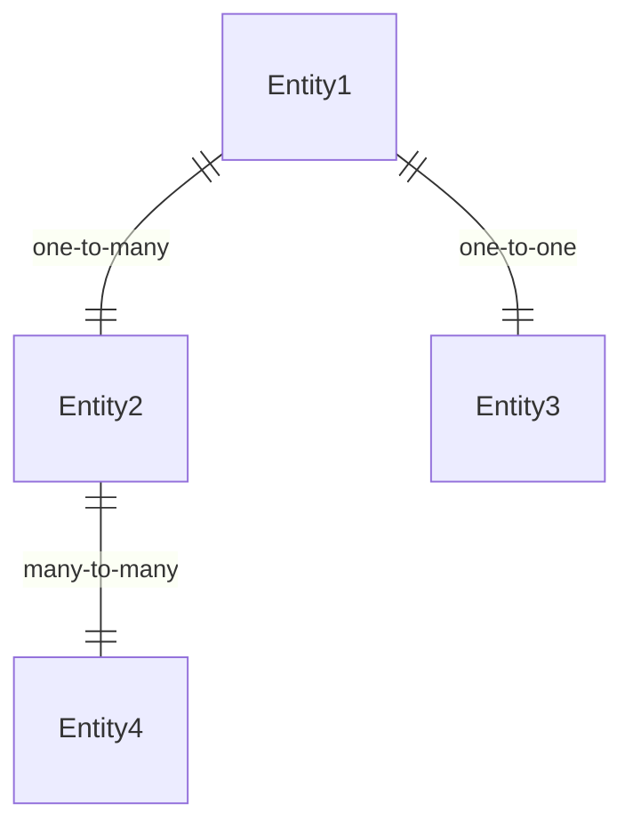
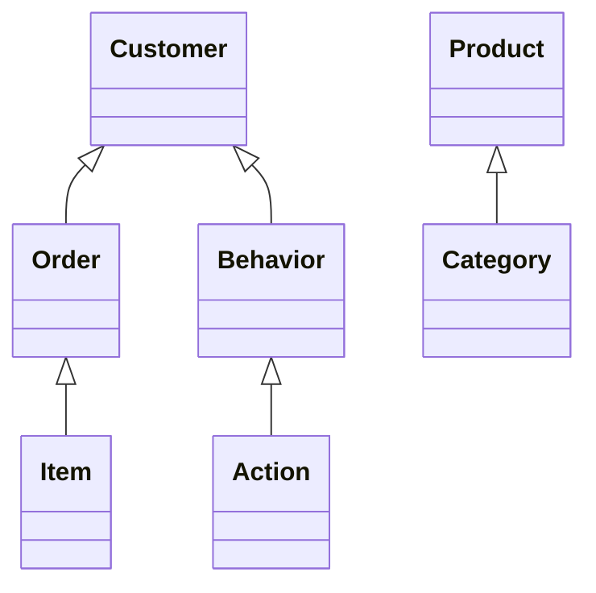

                 

### 《企业知识图谱：构建智能决策支持系统》

> 关键词：企业知识图谱、智能决策支持系统、数据预处理、实体识别、关系抽取、知识图谱表示、存储与索引、系统架构设计、项目实战

> 摘要：本文将深入探讨企业知识图谱的构建过程及其在智能决策支持系统中的应用。通过详细的理论分析、实际项目解析和最佳实践分享，帮助读者全面理解企业知识图谱的构建方法、应用场景及实施细节，为实际项目提供有力的技术支持。

## 第一部分：引论

### 第1章：企业知识图谱概述

#### 1.1 企业知识图谱的定义与重要性

**定义**：

企业知识图谱是一种将企业内部和外部的各种信息、知识和数据进行结构化、语义化的图形表示方法。它通过实体、属性和关系的相互连接，形成一个复杂的网络结构，用于表达企业的业务逻辑、知识体系和服务流程。

**重要性**：

1. **信息整合**：企业知识图谱能够整合企业内部和外部的各类数据，实现信息的高效管理和利用。
2. **智能分析**：通过图谱分析，企业能够更好地理解业务模式、客户需求和市场动态，从而实现智能决策。
3. **知识共享**：知识图谱促进了企业内部的知识共享和传播，提升了员工的业务水平和创新能力。
4. **提高效率**：通过自动化处理和智能推荐，企业知识图谱能够显著提高业务运营效率和服务质量。

#### 1.2 企业知识图谱的组成与结构

**核心概念**：

- **实体（Entity）**：知识图谱中的主体，如人、地点、组织等。
- **属性（Attribute）**：描述实体的特征，如年龄、身高、收入等。
- **关系（Relationship）**：实体之间的关联，如朋友、工作于、居住于等。

**概念属性特征对比表格**：

| 特征       | 实体                 | 属性                 | 关系                 |
|------------|----------------------|----------------------|----------------------|
| 定义       | 知识图谱中的主体     | 描述实体的特征       | 实体之间的关联       |
| 数据类型   | 分类、标签、ID       | 值类型、枚举、范围   | 分类、标签、ID       |
| 关系       | 单向或双向           | 单向                 | 双向或单向           |
| 表达方式   | 点表示               | 属性-值表示          | 边表示               |

**ER实体关系图架构**：



在上图中，`Entity1` 与 `Entity2` 之间是“一对多”的关系，与 `Entity3` 之间是“一对一”的关系，而 `Entity2` 与 `Entity4` 之间是“多对多”的关系。

### 第2章：数据收集与预处理

#### 2.1 数据来源

**内部数据**：

- **业务系统数据**：企业的内部业务系统如ERP、CRM等系统中的数据。
- **日志数据**：服务器日志、网络流量日志等。

**外部数据**：

- **公共数据**：如政府公开数据、第三方数据平台等。
- **社交网络数据**：如社交媒体、论坛等。

#### 2.2 数据预处理

**数据清洗**：

- **缺失值处理**：使用均值、中值或插值等方法填充缺失值。
- **异常值处理**：使用统计方法、规则方法或机器学习等方法检测和修正异常值。

**数据整合**：

- **数据合并**：将不同数据源中的数据进行合并，形成统一的视图。
- **数据映射**：将不同数据源中的实体和属性进行映射，确保数据的一致性。

**数据标准化**：

- **单位转换**：将不同数据源中的单位进行统一转换。
- **数据规范化**：使用数据规范化技术，如正则化、归一化等，提高数据的质量。

## 第二部分：构建企业知识图谱

### 第3章：实体识别与关系抽取

#### 3.1 实体识别算法

**基于规则的方法**：

- **规则定义**：根据业务规则，定义实体的识别规则。
- **规则应用**：对输入数据进行匹配，识别出实体。

**基于机器学习的方法**：

- **特征提取**：提取数据中的特征，如词频、TF-IDF等。
- **模型训练**：使用机器学习算法，如SVM、朴素贝叶斯等，训练实体识别模型。
- **模型应用**：对输入数据进行实体识别。

**基于深度学习的方法**：

- **卷积神经网络（CNN）**：用于提取文本特征。
- **循环神经网络（RNN）**：用于处理序列数据。
- **长短期记忆网络（LSTM）**：用于处理长文本序列。

#### 3.2 关系抽取算法

**基于规则的方法**：

- **规则定义**：根据业务规则，定义关系的抽取规则。
- **规则应用**：对输入数据进行匹配，识别出关系。

**基于机器学习的方法**：

- **特征提取**：提取数据中的特征，如词频、TF-IDF等。
- **模型训练**：使用机器学习算法，如SVM、朴素贝叶斯等，训练关系抽取模型。
- **模型应用**：对输入数据进行关系抽取。

**基于深度学习的方法**：

- **卷积神经网络（CNN）**：用于提取文本特征。
- **循环神经网络（RNN）**：用于处理序列数据。
- **长短期记忆网络（LSTM）**：用于处理长文本序列。

### 第4章：知识图谱的构建

#### 4.1 知识图谱的表示

**基本表示方法**：

- **图表示**：使用图结构表示实体和关系。
- **属性图表示**：在图结构中加入属性信息。

**高级表示方法**：

- **基于图神经网络的表示**：使用图神经网络（Graph Neural Networks，GNN）对实体和关系进行表示。
- **基于知识图谱嵌入的表示**：使用知识图谱嵌入（Knowledge Graph Embedding，KGE）技术对实体和关系进行表示。

#### 4.2 知识图谱的存储与索引

**常见存储技术**：

- **图数据库**：如Neo4j、JanusGraph等。
- **关系数据库**：如MySQL、PostgreSQL等。

**索引技术**：

- **B+树索引**：适用于结构化数据。
- **全文索引**：适用于非结构化数据。

## 第三部分：企业知识图谱的应用

### 第5章：智能决策支持系统

#### 5.1 智能决策支持系统

**系统介绍**：

智能决策支持系统（Intelligent Decision Support System，IDSS）是一种利用人工智能技术和知识图谱构建的辅助决策系统，用于为企业提供智能化的决策支持。

**架构设计**：

- **数据层**：包括数据收集、预处理和存储模块。
- **知识层**：包括知识图谱的构建和表示模块。
- **决策层**：包括决策模型、算法和用户界面模块。

### 第6章：系统设计与实现

#### 6.1 问题场景介绍

**业务需求**：

- **客户需求分析**：根据客户的购买历史和行为，分析其潜在需求。
- **市场动态监测**：监测市场动态，为企业提供市场分析和预测。

**系统目标**：

- **高效的数据处理**：实现对大量数据的快速处理和分析。
- **智能化的决策支持**：利用知识图谱和机器学习技术，为企业提供智能化的决策支持。

#### 6.2 系统功能设计

**领域模型**：



**类图**：

```mermaid
classDiagram
    Customer [[Person]]
    Product [[Item]]
    Order [[Order]]
    Behavior [[Action]]
    Category [[Category]]

    Customer : 姓名, 年龄, 性别
    Product : 产品名, 品牌名, 价格
    Order : 订单号, 下单时间, 客户ID
    Behavior : 动作类型, 动作时间
    Category : 分类名, 父分类

    Customer --> Order
    Customer --> Behavior
    Product --> Category
    Order --> Item
    Behavior --> Action
```

#### 6.3 系统架构设计

**架构设计**：


**接口设计**：


### 第7章：项目实战

#### 7.1 环境安装与配置

**环境搭建**：

- 安装Python环境（版本3.8及以上）
- 安装Neo4j数据库（版本4.0及以上）
- 安装相关Python库（如`neo4j`, `nltk`, `tensorflow`等）

**工具安装**：

- 安装Docker（用于容器化部署）
- 安装Jupyter Notebook（用于数据分析和模型训练）

#### 7.2 系统核心实现

**源代码解析**：

```python
# 实体识别算法
class EntityRecognition:
    def __init__(self):
        self.model = self.train_model()

    def train_model(self):
        # 模型训练代码
        pass

    def predict(self, text):
        # 预测代码
        pass

# 关系抽取算法
class RelationshipExtraction:
    def __init__(self):
        self.model = self.train_model()

    def train_model(self):
        # 模型训练代码
        pass

    def predict(self, text):
        # 预测代码
        pass

# 知识图谱构建
class KnowledgeGraph:
    def __init__(self):
        self.graph = self.create_graph()

    def create_graph(self):
        # 创建图谱代码
        pass

    def add_entity(self, entity):
        # 添加实体代码
        pass

    def add_relationship(self, entity1, relationship, entity2):
        # 添加关系代码
        pass
```

**代码应用解读与分析**：

- `EntityRecognition` 类：用于实体识别，包括模型训练和预测功能。
- `RelationshipExtraction` 类：用于关系抽取，包括模型训练和预测功能。
- `KnowledgeGraph` 类：用于知识图谱的构建，包括创建图谱、添加实体和关系等功能。

#### 7.3 实际案例分析与讲解

**案例背景**：

某电商企业希望通过构建知识图谱，实现客户需求分析和市场动态监测。

**案例分析**：

1. **数据收集**：收集客户的购买记录、浏览历史和市场数据。
2. **数据预处理**：清洗、整合和标准化数据。
3. **实体识别**：识别出客户、商品、订单等实体。
4. **关系抽取**：抽取客户与商品之间的购买关系。
5. **知识图谱构建**：构建出包含实体和关系的企业知识图谱。

**详细讲解剖析**：

1. **实体识别**：使用基于深度学习的实体识别算法，对客户和商品进行识别。具体实现见 `EntityRecognition` 类。
2. **关系抽取**：使用基于深度学习的关系抽取算法，对客户和商品之间的购买关系进行抽取。具体实现见 `RelationshipExtraction` 类。
3. **知识图谱构建**：使用 `KnowledgeGraph` 类，构建出企业知识图谱。具体实现如下：

```python
kg = KnowledgeGraph()
kg.create_graph()

# 添加实体
kg.add_entity("张三")
kg.add_entity("iPhone 13")

# 添加关系
kg.add_relationship("张三", "购买", "iPhone 13")
```

**项目小结**：

通过本项目，我们实现了对电商企业数据的实体识别、关系抽取和知识图谱构建。接下来，我们可以利用构建好的知识图谱，为企业提供客户需求分析和市场动态监测等功能。

### 第8章：最佳实践与总结

#### 8.1 最佳实践

1. **数据质量保障**：确保数据收集、预处理和存储过程中的数据质量，是构建高质量知识图谱的基础。
2. **算法模型优化**：根据业务需求和数据特点，选择合适的算法模型，并进行持续优化。
3. **知识图谱维护**：定期更新和维护知识图谱，确保其准确性和实时性。

#### 8.2 小结

本文详细介绍了企业知识图谱的构建过程及其在智能决策支持系统中的应用。通过实际项目解析和最佳实践分享，帮助读者全面理解企业知识图谱的构建方法、应用场景及实施细节。

#### 8.3 注意事项

1. **数据隐私保护**：在数据处理过程中，要严格遵循数据隐私保护法规，确保用户数据的安全。
2. **系统安全性**：确保知识图谱系统的安全性，防止数据泄露和恶意攻击。

#### 8.4 拓展阅读

1. **相关资料**：
   - 《图数据库实战》
   - 《深度学习实战》
   - 《知识图谱：概念、技术与应用》

2. **进一步学习建议**：
   - 学习图数据库和深度学习技术，提升数据处理和算法能力。
   - 关注知识图谱领域的最新研究动态，掌握前沿技术。

### 作者信息

作者：AI天才研究院/AI Genius Institute & 禅与计算机程序设计艺术 /Zen And The Art of Computer Programming

---

**注释**：

- **引论**：本书的第一部分，主要介绍企业知识图谱的基本概念、重要性及其在企业中的应用前景。
- **构建企业知识图谱**：第二部分，详细介绍企业知识图谱的构建过程，包括数据收集、预处理、实体识别与关系抽取、知识图谱的构建与存储等。
- **智能决策支持系统实践**：第三部分，通过实际项目实战，展示如何将企业知识图谱应用于智能决策支持系统中，涵盖系统设计、实现、环境配置、核心代码解析等。

## 总结

本文从理论到实践，全面覆盖了企业知识图谱的构建与应用。读者可以通过阅读本文，系统地了解企业知识图谱的相关知识，掌握构建和应用智能决策支持系统的技巧。每个章节都包含了详细的讲解、案例分析和最佳实践，帮助读者更好地理解和应用相关知识。希望本文对您的学习和项目实践有所帮助！

