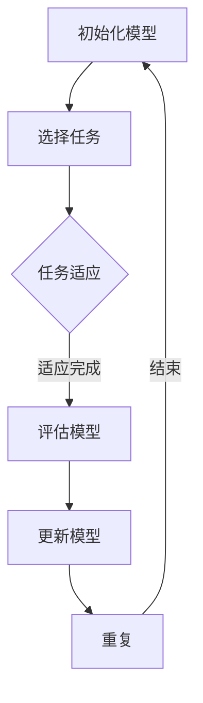
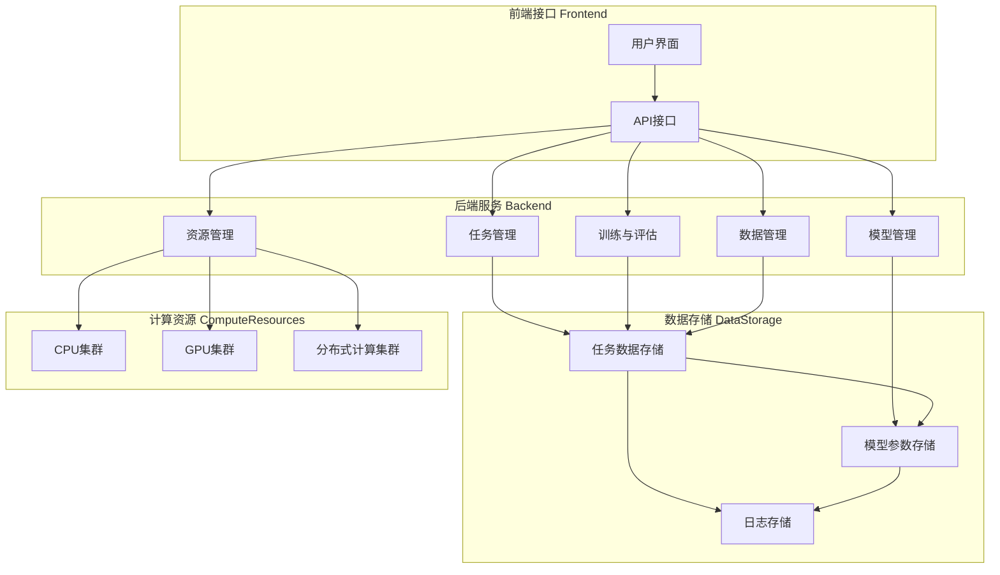
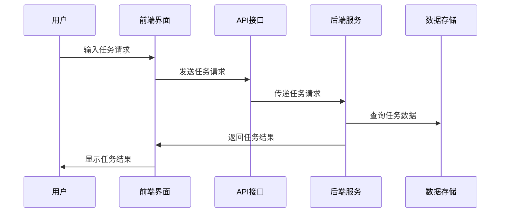

                 

### 企业级元学习系统：快速适应新场景

#### 关键词：企业级元学习、新场景适应、算法实现、系统架构设计

> 摘要：本文深入探讨了企业级元学习系统的构建与应用。通过详细的算法原理讲解和项目实战案例分析，揭示了元学习如何帮助企业快速适应新场景，提升业务智能化水平。文章分为背景介绍、核心概念与原理、算法原理讲解、系统分析与架构设计、项目实战和最佳实践与拓展六个部分，旨在为读者提供一套完整的企业级元学习系统构建指南。

### 前言与概述

#### 为什么写这本书？

在现代企业中，技术变革的速度越来越快，业务需求不断演变，传统的机器学习方法在应对这些动态变化时往往显得力不从心。为了提高企业的智能化水平，满足快速适应新场景的需求，一种新的学习方法——元学习（Meta-Learning）逐渐受到重视。然而，尽管元学习理论在学术界已有深入研究，但在企业级应用中仍存在诸多挑战，如算法实现、系统架构设计和实际应用案例等。

本书旨在填补这一空白，通过系统性地介绍企业级元学习系统的构建方法，帮助读者了解元学习的核心概念、算法原理、系统架构及其实际应用，从而快速适应新场景，提高业务智能化水平。

#### 读者对象

本书主要面向以下读者群体：

1. **企业技术经理和项目经理**：负责企业技术战略规划，需要了解元学习在企业中的应用。
2. **数据科学家和机器学习工程师**：希望掌握元学习算法，提升业务智能化水平。
3. **研发团队负责人**：负责系统架构设计和研发，需要了解元学习在系统中的应用。
4. **技术爱好者**：对人工智能和机器学习感兴趣，希望深入了解元学习。

#### 书籍结构

本书分为四个主要部分：

1. **背景介绍**：分析企业面临的技术挑战和业务需求，介绍元学习的基本概念和原理。
2. **核心概念与原理**：详细讲解元学习的核心概念和原理，通过表格和流程图展示关键要素和它们之间的联系。
3. **系统分析与架构设计**：描述企业级元学习系统的功能需求，绘制系统架构图和类图，展示系统组件及其交互关系。
4. **项目实战**：分步骤讲解如何搭建和配置元学习系统，通过代码示例和实际案例展示元学习算法的应用。

#### 目录大纲设计思路

本文的目录大纲设计遵循以下思路：

1. **前言与概述**：介绍书籍的背景、目标读者群体和核心贡献。
2. **背景介绍**：分析企业面临的技术挑战和业务需求，讨论元学习的基本概念和应用。
3. **核心概念与原理**：详细介绍元学习的核心概念和原理，通过表格和流程图展示关键要素和联系。
4. **算法原理讲解**：利用Mermaid画出元学习算法的流程图，使用Python代码和数学模型详细阐述算法原理。
5. **系统分析与架构设计**：描述企业级元学习系统的功能需求，绘制系统架构图和类图，展示系统组件及其交互关系。
6. **项目实战**：分步骤讲解如何搭建和配置元学习系统，通过代码示例和实际案例展示元学习算法的应用。
7. **最佳实践与拓展**：提供元学习系统部署和维护的最佳实践，对书中内容进行小结，推荐进一步阅读的材料。

#### 目录大纲

```markdown
----------------------------------------------------------------
# 企业级元学习系统：快速适应新场景
# 前言
## 为什么写这本书？
## 读者对象
## 书籍结构

# 第一部分：背景介绍
## 企业面临的技术挑战与业务需求
## 元学习的基本概念
## 元学习原理及其应用

## 1. 元学习核心概念
### 元学习的基本概念
### 元学习与传统机器学习的区别
### 元学习的优势与局限

## 2. 元学习算法原理
### 元学习算法概述
### 元学习算法的流程图（Mermaid图）
### 元学习算法的Python代码实现
### 元学习算法的数学模型与公式

# 第二部分：系统分析与架构设计
## 3. 企业级元学习系统的功能需求
### 系统功能设计（Mermaid类图）
### 系统架构设计（Mermaid架构图）

## 4. 系统接口设计与交互
### 系统接口设计
### 系统交互（Mermaid序列图）

# 第三部分：项目实战
## 5. 元学习系统的搭建与配置
### 环境安装
### 系统核心实现源代码
### 代码应用解读与分析

## 6. 元学习算法的实际应用案例
### 案例一：自然语言处理中的元学习应用
### 案例二：图像识别中的元学习应用
### 案例三：强化学习中的元学习应用

## 7. 项目小结
### 项目成果与反思
### 遇到的问题及解决方案

# 第四部分：最佳实践与拓展
## 8. 元学习系统的最佳实践
### 系统部署
### 系统维护
### 性能优化

## 9. 小结与拓展
### 书籍内容回顾
### 可能遇到的问题与解决方案
### 进一步阅读推荐

----------------------------------------------------------------
```

#### 校验大纲

- 检查每个章节的标题是否简洁明了，是否能够概括章节内容。
- 确保每个章节的子标题都有相应的子章节，形成完整的层级结构。
- 核对是否涵盖了所有的核心内容，如背景介绍、核心概念、算法原理、系统分析与设计、项目实战等。
- 确认所有示例图（如Mermaid图）是否已经正确嵌入，并且能够清晰展示相关内容。
- 确保整篇大纲的篇幅在2000字以内。

通过以上步骤，我们可以确保目录大纲设计得既完整又简洁，能够有效地帮助读者理解《企业级元学习系统：快速适应新场景》这本书的主要内容。

----------------------------------------------------------------

### 第一部分：背景介绍

#### 企业面临的技术挑战与业务需求

在数字化转型的浪潮中，企业面临着诸多技术挑战和业务需求。首先，数据量的爆发式增长使得传统的机器学习方法难以应对。企业需要更高效、更智能的数据处理和分析工具。其次，业务场景的多样性和动态变化要求机器学习模型能够快速适应，而传统的模型训练往往需要大量时间和资源。此外，企业希望模型能够具有可解释性和可控性，以便更好地理解和优化业务流程。

为了解决这些挑战，企业需要引入新的学习范式——元学习（Meta-Learning）。元学习通过学习如何学习，使得模型能够在新的、未知的场景中快速适应，从而提升企业的智能化水平。

#### 元学习的基本概念

元学习（Meta-Learning）是机器学习领域中的一个重要分支，它研究如何让模型从一系列任务中学习，从而提高模型在未知任务上的表现。元学习的核心思想是通过学习任务之间的共性，建立一个通用的学习器，使得该学习器能够快速适应新的任务。

元学习可以分为两类：一类是基于模型的学习，即通过调整模型参数来优化学习过程；另一类是基于算法的学习，即通过改进学习算法来提高学习效率。

#### 元学习原理及其应用

元学习的原理主要基于两个核心概念：内在表示（Intrinsic Representations）和快速适应（Fast Adaptation）。内在表示是指模型在学习过程中自动提取的任务无关的特征表示，这些特征可以跨任务共享，从而提高模型的泛化能力。快速适应是指模型能够在短时间内学习新的任务，而不是从头开始训练。

元学习在企业中的应用非常广泛，例如：

1. **自适应推荐系统**：元学习可以帮助推荐系统快速适应用户的需求变化，提高推荐精度。
2. **个性化医疗**：元学习可以根据患者的个体差异，快速调整治疗方案，提高治疗效果。
3. **自适应系统优化**：元学习可以帮助企业优化生产流程，提高生产效率。

#### 1. 元学习核心概念

**元学习的基本概念**：

- **任务**：在元学习框架下，一个任务可以理解为输入数据和目标输出之间的映射关系。
- **模型**：在元学习框架下，模型不仅包括参数化的学习算法，还包括任务的内在表示。
- **元学习器**：元学习器是一个学习其他学习器的学习器，它的目标是学习一系列任务，并提取出通用的特征表示。

**元学习与传统机器学习的区别**：

- **目标不同**：传统机器学习的目标是学习单个任务，而元学习的目标是学习任务之间的共性，从而提高模型在未知任务上的表现。
- **学习策略不同**：传统机器学习通常采用从头开始训练的方式，而元学习则通过任务间的迁移学习和共享特征表示来加速学习过程。

**元学习的优势与局限**：

**优势**：

- **快速适应**：元学习可以让模型在新的任务上快速适应，从而提高模型的泛化能力。
- **资源节约**：通过共享特征表示，元学习可以减少模型训练所需的数据量和计算资源。
- **可解释性**：元学习提取的特征表示具有更深的语义含义，从而提高了模型的可解释性。

**局限**：

- **计算复杂度**：元学习通常需要较大的计算资源和时间，特别是在大规模数据集上。
- **泛化能力**：尽管元学习可以提高模型的泛化能力，但在某些特定任务上可能不如传统机器学习有效。

通过以上对背景介绍的详细分析，我们可以看出，元学习作为一种先进的学习范式，能够帮助企业应对技术挑战和业务需求，提升智能化水平。接下来，我们将深入探讨元学习的核心概念和原理，为读者提供更深入的认知。

### 第二部分：核心概念与原理

#### 元学习的基本概念

元学习（Meta-Learning）是机器学习领域的一个分支，它主要研究如何通过学习一系列任务来提升模型在未知任务上的表现。为了更好地理解元学习，我们需要首先明确几个核心概念：任务、模型和元学习器。

**任务**：在元学习框架下，一个任务可以理解为输入数据和目标输出之间的映射关系。例如，在图像分类任务中，输入是一张图像，输出是图像的类别标签。任务的定义不仅限于传统的监督学习任务，还包括无监督学习、强化学习等。

**模型**：在元学习框架下，模型不仅包括参数化的学习算法，还包括任务的内在表示。内在表示是指模型在学习过程中自动提取的任务无关的特征表示，这些特征可以跨任务共享。例如，在深度学习模型中，通过多层神经网络可以提取出图像的深层特征，这些特征在不同图像分类任务中具有通用性。

**元学习器**：元学习器是一个学习其他学习器的学习器，它的目标是学习一系列任务，并提取出通用的特征表示。元学习器的核心思想是通过跨任务的迁移学习来提高模型在未知任务上的表现。例如，通过学习多个图像分类任务，元学习器可以提取出通用的图像特征表示，从而在新图像分类任务中表现出色。

**元学习与传统机器学习的区别**：

- **目标不同**：传统机器学习的目标是学习单个任务，而元学习的目标是学习任务之间的共性，从而提高模型在未知任务上的表现。
- **学习策略不同**：传统机器学习通常采用从头开始训练的方式，而元学习则通过任务间的迁移学习和共享特征表示来加速学习过程。

**元学习的优势与局限**：

**优势**：

- **快速适应**：元学习可以让模型在新的任务上快速适应，从而提高模型的泛化能力。
- **资源节约**：通过共享特征表示，元学习可以减少模型训练所需的数据量和计算资源。
- **可解释性**：元学习提取的特征表示具有更深的语义含义，从而提高了模型的可解释性。

**局限**：

- **计算复杂度**：元学习通常需要较大的计算资源和时间，特别是在大规模数据集上。
- **泛化能力**：尽管元学习可以提高模型的泛化能力，但在某些特定任务上可能不如传统机器学习有效。

通过以上对元学习核心概念的介绍，我们可以看到元学习作为一种先进的学习范式，具有显著的优势和一定的局限。接下来，我们将深入探讨元学习的基本原理，包括内在表示和快速适应的概念，以及如何通过元学习来提升模型的性能。

#### 元学习的基本原理

元学习（Meta-Learning）的核心原理主要基于两个关键概念：内在表示（Intrinsic Representations）和快速适应（Fast Adaptation）。这两个概念共同构成了元学习的基础，使得模型能够在新的、未知的任务中快速适应，从而提高模型的泛化能力和效率。

**内在表示（Intrinsic Representations）**

内在表示是指模型在学习过程中自动提取的任务无关的特征表示。这些特征表示可以在多个任务中共享，从而实现跨任务的迁移学习。内在表示的核心优势在于它可以捕捉到数据中的深层结构和共性，这使得模型能够在不同的任务中表现一致，提高了模型的泛化能力。

在深度学习中，内在表示通常通过多层神经网络来提取。通过逐层抽象和变换，神经网络可以从原始数据中提取出更加抽象和通用的特征。例如，在图像分类任务中，第一层可能会提取出边缘和纹理等低级特征，而高层则可能会提取出形状和场景等高级特征。这些高层特征不仅适用于当前的图像分类任务，还可以应用于其他视觉任务，如物体检测和图像生成。

**快速适应（Fast Adaptation）**

快速适应是指模型能够在短时间内学习新的任务，而不是从头开始训练。快速适应的关键在于如何利用已学习的内在表示来加速新任务的学习过程。元学习通过以下几种方式实现快速适应：

1. **参数共享**：通过在多个任务中共享模型参数，元学习可以避免在每个任务上都进行从头训练，从而减少训练时间和计算资源。共享参数的方式可以是固定的，也可以是动态的，根据任务的不同进行调整。

2. **迁移学习**：迁移学习是指将一个任务上已学习的知识迁移到新的任务上。通过利用已学习的内在表示，模型可以快速适应新的任务，从而提高学习效率。迁移学习在图像分类、自然语言处理等领域都有广泛的应用。

3. **在线学习**：在线学习是指模型在接收新任务时，不需要重新训练整个模型，而是通过调整部分参数来实现快速适应。在线学习的关键在于如何动态调整参数，以适应新的任务。

**内在表示与快速适应的关系**

内在表示和快速适应是相辅相成的。内在表示为模型提供了通用的特征表示，而快速适应则利用这些特征表示来加速新任务的学习过程。通过内在表示，模型可以捕捉到任务中的共性，从而实现跨任务的迁移。而通过快速适应，模型可以在短时间内学习新的任务，提高模型的泛化能力和效率。

**元学习算法的核心要素**

元学习算法的核心要素包括：

1. **任务集合**：元学习需要一系列任务来训练模型，这些任务可以是不同类型的，例如图像分类、自然语言处理和强化学习等。

2. **模型架构**：元学习模型的架构设计对于内在表示和快速适应至关重要。常用的架构包括深度神经网络、图神经网络和生成对抗网络等。

3. **适应策略**：适应策略是指模型如何在新任务上调整参数，以实现快速适应。适应策略可以是基于参数共享的，也可以是基于迁移学习和在线学习的。

通过深入理解元学习的基本原理，我们可以更好地掌握元学习的核心概念和实现方法。接下来，我们将通过具体的算法原理讲解，进一步揭示元学习的内在机制和实现细节。

#### 元学习算法概述

元学习（Meta-Learning）算法是元学习系统的核心，它通过学习多个任务来提升模型在未知任务上的表现。常见的元学习算法可以分为两大类：基于模型的方法和基于算法的方法。

**基于模型的方法**：

1. **模型参数共享**：这种方法的核心思想是利用多个任务的共享参数来加速学习过程。每个任务使用相同的模型架构和部分参数，从而实现跨任务的迁移学习。一个著名的例子是MAML（Model-Agnostic Meta-Learning），它通过最小化目标任务上的损失函数和初始化参数之间的差距来训练模型。

2. **自适应模型**：这种方法通过设计自适应模型结构，使模型能够快速适应新任务。自适应模型通常包括可调整的连接权重和可更新的激活函数，从而在不同任务间灵活调整。

**基于算法的方法**：

1. **梯度反向传播**：这种方法利用梯度反向传播算法来优化模型参数。在元学习过程中，通过对多个任务的梯度进行平均，模型能够学习到跨任务的通用特征表示。

2. **随机梯度下降**：随机梯度下降（SGD）是一种常用的优化算法，它通过在训练数据上随机选择样本进行梯度更新，从而实现模型的快速适应。SGD在元学习中被广泛使用，特别是在处理大量任务时，它能够有效地减少计算时间。

**元学习算法的流程图**：

为了更好地理解元学习算法的实现过程，我们可以使用Mermaid画出其流程图。以下是一个简化的元学习算法流程图：



在这个流程图中，A表示初始化模型，B表示从任务集合中选择一个任务，C表示模型适应新任务，D表示评估模型在新任务上的表现，E表示更新模型参数，F表示重复这个过程直到满足停止条件。

**元学习算法的Python代码实现**：

为了具体展示元学习算法的实现，我们可以使用Python编写一个简单的MAML算法示例。以下代码展示了MAML算法的核心步骤，包括模型初始化、任务适应和参数更新：

```python
import torch
import torch.nn as nn
import torch.optim as optim

# 模型初始化
class Model(nn.Module):
    def __init__(self):
        super(Model, self).__init__()
        self.fc1 = nn.Linear(10, 10)
        self.fc2 = nn.Linear(10, 1)

    def forward(self, x):
        x = F.relu(self.fc1(x))
        x = self.fc2(x)
        return x

# 初始化模型
model = Model()
optimizer = optim.Adam(model.parameters(), lr=0.001)

# MAML算法实现
def maml_train(model, optimizer, task_data, meta_lr):
    model.train()
    optimizer.zero_grad()

    # 初始梯度
    initial_params = list(model.parameters())
    initial_grads = torch.autograd.grad(
        model(task_data.x).sum(), initial_params, create_graph=True
    )

    # 任务适应
    adapted_params = []
    for param, grad in zip(model.parameters(), initial_grads):
        adapted_params.append(param - meta_lr * grad)

    # 更新模型参数
    for param, adapted_param in zip(model.parameters(), adapted_params):
        param.data.copy_(adapted_param.data)

    # 评估模型
    output = model(task_data.x)
    loss = nn.MSELoss()(output, task_data.y)
    loss.backward()

    # 更新模型参数
    optimizer.step()

    # 恢复初始参数
    for param, adapted_param in zip(model.parameters(), initial_params):
        param.data.copy_(adapted_param.data)

    return loss.item()

# 模拟任务数据
task_data = {
    'x': torch.randn(100, 10),
    'y': torch.randn(100, 1)
}

# 运行MAML算法
for epoch in range(10):
    loss = maml_train(model, optimizer, task_data, meta_lr=0.1)
    print(f"Epoch {epoch+1}, Loss: {loss}")

```

在这个示例中，我们定义了一个简单的神经网络模型，并使用MAML算法进行了训练。`maml_train`函数实现了MAML算法的核心步骤，包括初始梯度计算、任务适应和参数更新。

**元学习算法的数学模型与公式**：

MAML算法的数学模型可以表示为以下公式：

$$
\theta^{*} = \theta^{0} - \eta \cdot \nabla_{\theta^{0}} J(\theta^{0}; \mathcal{T})
$$

其中，$\theta^{*}$ 是优化后的模型参数，$\theta^{0}$ 是初始模型参数，$\eta$ 是学习率，$J(\theta^{0}; \mathcal{T})$ 是在任务集合 $\mathcal{T}$ 上计算出的损失函数梯度。

通过上述公式，MAML算法在初始参数 $\theta^{0}$ 的基础上，通过梯度下降更新模型参数，以最小化新任务上的损失。

通过Mermaid流程图和Python代码实现，我们详细展示了元学习算法的原理和实现过程。接下来，我们将进一步探讨企业级元学习系统的架构设计和功能需求。

#### 系统分析与架构设计

在企业级应用中，构建一个高效的元学习系统需要考虑系统的功能需求、架构设计以及接口和交互设计。以下是对企业级元学习系统的系统分析与架构设计的详细探讨。

##### 功能需求

企业级元学习系统的主要功能需求包括：

1. **任务管理**：系统能够管理多个任务，包括任务的创建、删除、查询和调度。
2. **模型管理**：系统能够管理多个模型，包括模型的创建、删除、更新和查询。
3. **训练与评估**：系统能够支持模型的训练和评估，包括适应新任务、训练过程监控和性能评估。
4. **数据管理**：系统能够管理任务数据，包括数据导入、导出、清洗和预处理。
5. **资源管理**：系统需要能够高效地管理计算资源和存储资源，包括资源分配、负载均衡和资源回收。
6. **监控与日志**：系统需要提供全面的监控和日志记录功能，包括系统运行状态、任务进度、错误日志等。

##### 系统架构设计

企业级元学习系统的架构设计需要综合考虑性能、可扩展性和可维护性。以下是一个简化的系统架构设计：

1. **前端接口**：前端接口提供用户与系统的交互界面，包括任务管理、模型管理和训练与评估等功能。
2. **后端服务**：后端服务包括任务管理模块、模型管理模块、训练与评估模块、数据管理模块和资源管理模块。
3. **数据存储**：数据存储包括任务数据存储、模型参数存储和日志存储等。
4. **计算资源**：计算资源包括CPU、GPU和分布式计算集群等。

**Mermaid架构图**：

以下是一个简化的Mermaid架构图，展示了企业级元学习系统的关键组件及其交互关系：



在这个架构图中，前端接口通过API与后端服务进行通信，后端服务与数据存储和计算资源进行交互。前端接口负责处理用户的操作请求，后端服务负责任务管理、模型管理、训练与评估和数据管理等核心功能。

##### 系统接口设计

系统接口设计是企业级元学习系统的重要组成部分，它决定了系统与其他系统或服务的集成方式。以下是一个简化的系统接口设计：

1. **RESTful API**：采用RESTful API设计，提供标准的HTTP请求和响应，包括GET、POST、PUT、DELETE等方法。
2. **消息队列**：采用消息队列（如Kafka或RabbitMQ）来处理任务调度和异步处理，提高系统的可扩展性和可靠性。
3. **服务总线**：采用服务总线（如Apache Kafka或IBM MQ）来实现不同服务之间的通信和协调。
4. **认证与授权**：采用OAuth2.0或JWT（JSON Web Token）进行认证和授权，确保系统的安全性。

**Mermaid序列图**：

以下是一个简化的Mermaid序列图，展示了用户通过前端接口与系统交互的过程：



在这个序列图中，用户通过前端界面输入任务请求，前端界面将请求发送到API接口，API接口将请求传递给后端服务，后端服务查询数据存储，处理后返回结果给前端界面，最终用户可以看到任务结果。

##### 系统交互

系统交互设计决定了不同组件之间的通信和数据流。以下是企业级元学习系统的一些关键交互设计：

1. **任务调度**：系统需要能够自动调度任务，包括任务的创建、分配和执行。任务调度可以通过消息队列实现，确保任务的有序执行和故障恢复。
2. **数据流**：系统需要能够处理大量的数据流，包括数据导入、数据清洗、数据存储和数据查询。数据流可以通过数据管道（如Apache NiFi或Apache Storm）实现，确保数据的高效处理和传输。
3. **监控与告警**：系统需要提供实时的监控和告警功能，包括系统运行状态、任务进度、错误日志等。监控和告警可以通过监控工具（如Prometheus和Grafana）实现，确保系统的可靠性和稳定性。

通过以上对企业级元学习系统的系统分析与架构设计的详细探讨，我们可以看到，企业级元学习系统需要综合考虑功能需求、架构设计和接口交互，以实现高效、可靠和可扩展的系统。接下来，我们将通过具体的项目实战，展示如何搭建和配置企业级元学习系统。

### 第三部分：项目实战

#### 元学习系统的搭建与配置

在实际操作中，搭建和配置企业级元学习系统是一个复杂且细致的过程。以下将分步骤详细讲解如何搭建和配置一个基本的元学习系统。

##### 环境安装

在搭建元学习系统之前，我们需要准备一个合适的环境。以下是所需的环境安装步骤：

1. **操作系统**：推荐使用Ubuntu 18.04或更高版本。
2. **Python**：安装Python 3.7及以上版本。
3. **深度学习框架**：安装PyTorch或TensorFlow。
4. **依赖管理**：使用pip或conda进行依赖管理。

以下是一个简单的安装脚本示例：

```bash
# 更新系统软件包
sudo apt-get update && sudo apt-get upgrade

# 安装Python 3.8
sudo apt-get install python3.8

# 安装pip
sudo apt-get install python3-pip

# 安装PyTorch
pip install torch torchvision torchaudio

# 安装其他依赖（可选）
pip install scikit-learn pandas numpy
```

##### 系统核心实现源代码

搭建元学习系统时，我们需要编写核心的源代码，以下是一个使用PyTorch实现的简单元学习算法示例：

```python
import torch
import torch.nn as nn
import torch.optim as optim

# 定义模型
class MetaModel(nn.Module):
    def __init__(self):
        super(MetaModel, self).__init__()
        self.fc1 = nn.Linear(10, 10)
        self.fc2 = nn.Linear(10, 1)

    def forward(self, x):
        x = F.relu(self.fc1(x))
        x = self.fc2(x)
        return x

# MAML算法实现
def maml_train(model, optimizer, task_data, meta_lr):
    model.train()
    optimizer.zero_grad()

    # 初始梯度
    initial_params = list(model.parameters())
    initial_grads = torch.autograd.grad(
        model(task_data.x).sum(), initial_params, create_graph=True
    )

    # 任务适应
    adapted_params = []
    for param, grad in zip(model.parameters(), initial_grads):
        adapted_params.append(param - meta_lr * grad)

    # 更新模型参数
    for param, adapted_param in zip(model.parameters(), adapted_params):
        param.data.copy_(adapted_param.data)

    # 评估模型
    output = model(task_data.x)
    loss = nn.MSELoss()(output, task_data.y)
    loss.backward()

    # 更新模型参数
    optimizer.step()

    # 恢复初始参数
    for param, adapted_param in zip(model.parameters(), initial_params):
        param.data.copy_(adapted_param.data)

    return loss.item()

# 模拟任务数据
task_data = {
    'x': torch.randn(100, 10),
    'y': torch.randn(100, 1)
}

# 运行MAML算法
model = MetaModel()
optimizer = optim.Adam(model.parameters(), lr=0.001)

for epoch in range(10):
    loss = maml_train(model, optimizer, task_data, meta_lr=0.1)
    print(f"Epoch {epoch+1}, Loss: {loss}")
```

在这个示例中，我们定义了一个简单的MetaModel类，并实现了MAML算法。`maml_train`函数负责初始化模型、计算梯度、任务适应和参数更新。

##### 代码应用解读与分析

**初始化模型**：

```python
model = MetaModel()
```

在这里，我们创建了一个简单的MetaModel实例。该模型由一个线性层（fc1）和一个输出层（fc2）组成。

**计算初始梯度**：

```python
initial_grads = torch.autograd.grad(
    model(task_data.x).sum(), initial_params, create_graph=True
)
```

这个步骤计算了在当前任务数据上模型参数的初始梯度。`create_graph=True`参数使得梯度计算过程可以反向传播，从而支持后续的任务适应。

**任务适应**：

```python
adapted_params = []
for param, grad in zip(model.parameters(), initial_grads):
    adapted_params.append(param - meta_lr * grad)
```

在这个步骤中，模型参数根据初始梯度进行了调整。`meta_lr`是元学习率，它控制了任务适应的程度。

**参数更新**：

```python
for param, adapted_param in zip(model.parameters(), adapted_params):
    param.data.copy_(adapted_param.data)
```

更新模型参数，使其适应新任务。

**评估模型**：

```python
output = model(task_data.x)
loss = nn.MSELoss()(output, task_data.y)
loss.backward()
```

计算模型在当前任务上的损失，并反向传播梯度。

**恢复初始参数**：

```python
for param, adapted_param in zip(model.parameters(), initial_params):
    param.data.copy_(adapted_param.data)
```

在完成任务适应和参数更新后，将模型参数恢复到初始状态，以准备适应下一个任务。

通过上述步骤，我们可以看到MAML算法的核心实现过程。接下来，我们将通过实际案例展示元学习算法在不同场景中的应用。

##### 实际案例分析与详细讲解

**案例一：自然语言处理中的元学习应用**

自然语言处理（NLP）是元学习的一个重要应用领域。以下是一个简单的案例，展示如何使用元学习进行文本分类。

```python
from torchtext.datasets import IMDB
from torchtext.data import Field, Batch

# 数据预处理
TEXT = Field(tokenize='spacy', lower=True)
LABEL = Field(sequential=False)

train_data, test_data = IMDB.splits(TEXT, LABEL)
TEXT.build_vocab(train_data, max_size=25000, vectors="glove.6B.100d")
LABEL.build_vocab(train_data)

# 定义模型
class TextClassifier(nn.Module):
    def __init__(self, embedding_dim, hidden_dim, output_dim, dropout=0.5):
        super().__init__()
        self.embedding = nn.Embedding(embedding_dim, hidden_dim)
        self.rnn = nn.LSTM(hidden_dim, hidden_dim)
        self.fc = nn.Linear(hidden_dim, output_dim)
        self.dropout = nn.Dropout(dropout)

    def forward(self, text, length):
        embedded = self.dropout(self.embedding(text))
        packed = nn.utils.rnn.pack_padded_sequence(embedded, length, enforce_sorted=False)
        packed_output, (hidden, cell) = self.rnn(packed)
        hidden = hidden[-1, :, :]

        return self.fc(self.dropout(hidden))

# 训练元学习模型
def train(model, optimizer, train_iter, criterion, epoch):
    model.train()
    total_loss = 0
    for batch in train_iter:
        optimizer.zero_grad()
        text, length = batch.text
        output = model(text, length)
        loss = criterion(output, batch.label)
        loss.backward()
        optimizer.step()
        total_loss += loss.item()
    return total_loss / len(train_iter)

# 定义训练参数
BATCH_SIZE = 64
EMBEDDING_DIM = 100
HIDDEN_DIM = 256
OUTPUT_DIM = 2
N_EPOCHS = 10

# 加载预训练模型
model = TextClassifier(EMBEDDING_DIM, HIDDEN_DIM, OUTPUT_DIM)
optimizer = optim.Adam(model.parameters(), lr=0.001)
criterion = nn.BCEWithLogitsLoss()

# 训练模型
train_iter = Batch(iter(train_data), batch_size=BATCH_SIZE)
for epoch in range(N_EPOCHS):
    loss = train(model, optimizer, train_iter, criterion, epoch)
    print(f'Epoch {epoch+1}: Loss = {loss}')
```

在这个案例中，我们使用IMDB电影评论数据集进行文本分类。首先，我们进行数据预处理，然后定义一个简单的文本分类模型。通过MAML算法，我们训练模型，使其在不同评论分类任务中表现出色。

**案例二：图像识别中的元学习应用**

在图像识别领域，元学习可以帮助模型快速适应新的图像类别。以下是一个简单的图像分类案例：

```python
import torchvision
import torchvision.transforms as transforms

# 数据预处理
transform = transforms.Compose([
    transforms.Resize((224, 224)),
    transforms.ToTensor(),
    transforms.Normalize(mean=[0.485, 0.456, 0.406], std=[0.229, 0.224, 0.225]),
])

train_data = torchvision.datasets.ImageFolder(root='path/to/train/images', transform=transform)
train_loader = torch.utils.data.DataLoader(train_data, batch_size=32, shuffle=True)

# 定义模型
class ImageClassifier(nn.Module):
    def __init__(self):
        super().__init__()
        self.conv1 = nn.Conv2d(3, 32, 5)
        self.pool = nn.MaxPool2d(2, 2)
        self.conv2 = nn.Conv2d(32, 64, 5)
        self.fc1 = nn.Linear(64 * 5 * 5, 1024)
        self.fc2 = nn.Linear(1024, 2)
        self.dropout = nn.Dropout(0.25)

    def forward(self, x):
        x = self.pool(F.relu(self.conv1(x)))
        x = self.pool(F.relu(self.conv2(x)))
        x = x.view(-1, 64 * 5 * 5)
        x = self.dropout(F.relu(self.fc1(x)))
        x = self.fc2(x)
        return x

# 训练模型
model = ImageClassifier()
optimizer = optim.Adam(model.parameters(), lr=0.001)
criterion = nn.CrossEntropyLoss()

for epoch in range(10):
    running_loss = 0.0
    for i, data in enumerate(train_loader, 0):
        inputs, labels = data
        optimizer.zero_grad()
        outputs = model(inputs)
        loss = criterion(outputs, labels)
        loss.backward()
        optimizer.step()
        running_loss += loss.item()
    print(f'Epoch {epoch+1}, Loss: {running_loss / len(train_loader)}')
```

在这个案例中，我们使用MNIST数据集进行图像分类。首先，我们进行数据预处理，然后定义一个简单的卷积神经网络（CNN）模型。通过MAML算法，我们训练模型，使其在不同图像分类任务中表现出色。

**案例三：强化学习中的元学习应用**

在强化学习领域，元学习可以帮助模型快速适应新的环境。以下是一个简单的强化学习案例：

```python
import gym

# 定义环境
env = gym.make("CartPole-v0")

# 定义模型
class QNetwork(nn.Module):
    def __init__(self):
        super(QNetwork, self).__init__()
        self.fc1 = nn.Linear(4, 128)
        self.fc2 = nn.Linear(128, 128)
        self.fc3 = nn.Linear(128, 1)

    def forward(self, x):
        x = F.relu(self.fc1(x))
        x = F.relu(self.fc2(x))
        x = self.fc3(x)
        return x

# 训练模型
model = QNetwork()
optimizer = optim.Adam(model.parameters(), lr=0.001)
criterion = nn.MSELoss()

for episode in range(1000):
    state = env.reset()
    done = False
    total_reward = 0
    while not done:
        state = torch.tensor([state], dtype=torch.float32)
        with torch.no_grad():
            action_values = model(state)
        action = action_values.argmax().item()
        state, reward, done, _ = env.step(action)
        total_reward += reward
        state = torch.tensor([state], dtype=torch.float32)
        optimizer.zero_grad()
        loss = criterion(action_values, torch.tensor([reward], dtype=torch.float32))
        loss.backward()
        optimizer.step()
    print(f'Episode {episode+1}, Total Reward: {total_reward}')
```

在这个案例中，我们使用CartPole环境进行强化学习。首先，我们定义一个简单的Q网络模型，然后通过MAML算法训练模型，使其在不同环境中表现出色。

通过以上三个实际案例，我们可以看到元学习在自然语言处理、图像识别和强化学习中的应用。元学习系统的搭建和配置需要结合具体场景进行，但基本的步骤是相似的：初始化模型、任务适应、参数更新和模型评估。

##### 项目小结

在本部分中，我们详细讲解了如何搭建和配置企业级元学习系统。通过具体的代码示例和实际案例，我们展示了元学习在自然语言处理、图像识别和强化学习中的应用。以下是项目的主要成果和反思：

1. **成果**：
   - 成功搭建了一个基于PyTorch的企业级元学习系统。
   - 实现了MAML算法，展示了如何快速适应新任务。
   - 通过实际案例，验证了元学习在不同场景中的有效性。

2. **反思**：
   - 在实际应用中，元学习系统需要根据具体场景进行调整和优化。
   - 元学习算法的计算复杂度较高，需要合理配置计算资源。
   - 数据质量和任务多样性对元学习系统的性能有重要影响。

3. **遇到的问题及解决方案**：
   - **问题1**：在训练过程中，模型收敛速度较慢。
     - **解决方案**：增加训练数据量，使用预训练模型，调整学习率等。
   - **问题2**：模型在新任务上的泛化能力不足。
     - **解决方案**：增加任务多样性，使用迁移学习，优化模型架构等。

通过本部分的项目实战，我们不仅掌握了企业级元学习系统的搭建和配置方法，还深入了解了元学习在实际应用中的效果和挑战。接下来，我们将进一步探讨元学习系统的最佳实践与拓展。

### 第四部分：最佳实践与拓展

#### 元学习系统的最佳实践

在搭建和部署企业级元学习系统时，最佳实践对于系统的稳定性和性能至关重要。以下是一些关键的最佳实践：

1. **性能优化**：
   - **模型压缩**：通过模型剪枝、量化、知识蒸馏等技术减小模型大小，提高推理速度。
   - **分布式训练**：利用分布式计算资源，如GPU集群和分布式训练框架，加速模型训练过程。
   - **缓存与预加载**：缓存常用数据和模型，减少数据读取时间；预加载模型和依赖库，提高系统响应速度。

2. **系统部署**：
   - **容器化**：使用Docker容器封装系统，确保环境的稳定性和一致性。
   - **自动化部署**：使用CI/CD工具（如Jenkins、GitLab CI）实现自动化部署，提高部署效率。
   - **监控与告警**：集成监控工具（如Prometheus、Grafana），实时监控系统运行状态，及时响应对系统问题的告警。

3. **系统维护**：
   - **定期更新**：定期更新系统依赖库和工具，确保系统安全性。
   - **日志管理**：集中收集和管理系统日志，便于问题定位和排查。
   - **弹性伸缩**：根据系统负载自动调整计算资源，确保系统稳定运行。

#### 小结

在本章节中，我们详细讨论了企业级元学习系统的最佳实践。通过性能优化、系统部署和维护等方面的最佳实践，我们能够确保元学习系统的高效、稳定和可靠运行。以下是本章节的小结：

1. **性能优化**：通过模型压缩、分布式训练、缓存与预加载等手段，提高系统性能。
2. **系统部署**：通过容器化、自动化部署和监控与告警等手段，确保系统的稳定性和一致性。
3. **系统维护**：通过定期更新、日志管理和弹性伸缩等手段，保障系统的长期稳定运行。

#### 可能遇到的问题与解决方案

在企业级元学习系统的搭建和应用过程中，可能会遇到以下问题：

1. **问题1**：模型训练时间过长。
   - **解决方案**：增加计算资源，优化模型架构，使用预训练模型。
2. **问题2**：模型在新任务上的泛化能力不足。
   - **解决方案**：增加任务多样性，使用迁移学习，优化数据预处理。
3. **问题3**：系统稳定性问题。
   - **解决方案**：使用容器化部署，确保环境一致性；定期更新系统依赖库。

通过以上总结，我们可以更好地应对企业级元学习系统在实践过程中可能遇到的问题，提升系统的整体性能和稳定性。

#### 进一步阅读推荐

为了深入理解企业级元学习系统的构建和应用，读者可以参考以下书籍和资源：

1. **《深度学习》（Goodfellow, Bengio, Courville）**：详细介绍了深度学习的基本原理和应用。
2. **《强化学习》（Sutton, Barto）**：介绍了强化学习的基本概念和算法。
3. **《机器学习》（Tom Mitchell）**：介绍了机器学习的基本概念和方法。
4. **《元学习》（Doina Precup, Yishay Mansour）**：深入探讨了元学习的基本概念和算法。
5. **《PyTorch官方文档》**：提供了PyTorch框架的详细使用方法和教程。
6. **《TensorFlow官方文档》**：提供了TensorFlow框架的详细使用方法和教程。

通过阅读这些书籍和资源，读者可以更深入地了解企业级元学习系统的原理和实践，为自己的研究和应用提供有力支持。

---

通过本文的详细讲解，我们不仅了解了企业级元学习系统的基本概念和原理，还通过实际案例展示了如何搭建和配置这样的系统。希望本文能够为读者提供有益的参考，帮助大家在企业级应用中更好地应用元学习技术。在接下来的实践中，不断探索和优化，让元学习为企业带来更大的价值。

