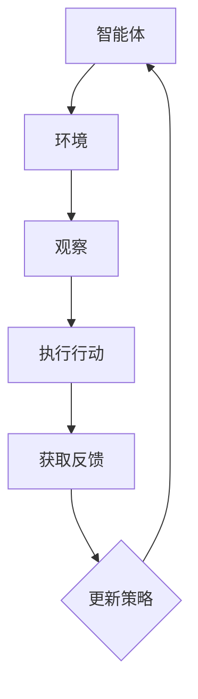
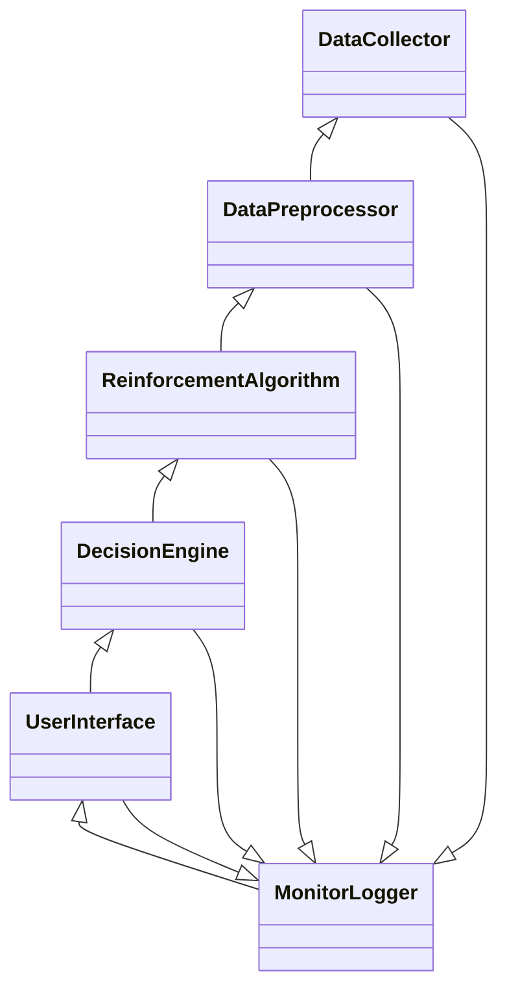
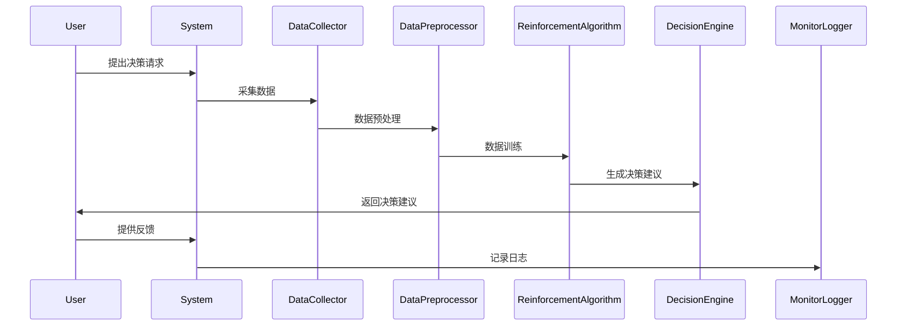

                 

## 文章标题

### 关键词

- 企业级元强化学习
- 适应性决策系统
- 技术平台构建
- 强化学习算法
- 算法应用与优化

### 摘要

本文旨在深入探讨企业级元强化学习平台的设计与实现，特别是其核心组成部分——适应性决策系统的构建。我们将通过详细的分析和实例，展示如何利用元强化学习技术解决企业决策中的复杂问题，提高决策的适应性和准确性。文章将分为以下几个部分：引言、元强化学习基础、适应性决策系统设计、平台构建与实现、实战案例以及总结与展望。

----------------------------------------------------------------

## 引言

### 元强化学习的起源与发展

元强化学习（Meta Reinforcement Learning，简称MRL）是强化学习（Reinforcement Learning，简称RL）的一个高级分支。它的核心思想是使算法能够从一个任务快速适应到另一个任务，而不是在每个任务上都从头开始学习。这种能力使得元强化学习在解决复杂、动态和多变的环境中具有独特的优势。

元强化学习的概念最早可以追溯到1980年代，由安德鲁·巴顿（Andrew G. Barto）和理查德·萨顿（Richard S. Sutton）在其关于强化学习的早期研究中提出。然而，由于技术和计算能力的限制，元强化学习的研究和应用在很长一段时间内都处于缓慢发展的状态。随着深度学习和计算资源的进步，元强化学习开始展现出其巨大的潜力，并在近年来得到了广泛关注和快速发展。

### 适应性决策系统的概念

适应性决策系统（Adaptive Decision System）是一种能够根据环境变化动态调整决策策略的智能系统。在企业运营中，环境变化往往是快速且不可预测的，传统决策系统难以适应这种变化，从而导致决策失误。适应性决策系统的出现，旨在通过引入元强化学习等先进技术，提高企业决策的灵活性和适应性。

适应性决策系统的核心在于其能够快速学习并适应新环境，从而实现持续优化的决策过程。它不仅能够处理静态环境中的决策问题，还能在动态环境中表现出色，帮助企业应对不断变化的市场需求和竞争压力。

### 当前企业决策面临的挑战

企业在决策过程中常常面临以下挑战：

1. **环境复杂性**：企业所处的市场环境日益复杂，需求多样化，这使得传统决策方法难以有效应对。
2. **数据质量**：高质量的数据是企业决策的基础，然而，数据的质量和完整性往往难以保证。
3. **决策速度**：市场变化快速，企业需要能够快速响应，但传统的决策过程往往耗时较长。
4. **资源限制**：企业在决策时往往受到人力、财力等资源的限制，难以投入大量资源进行复杂的决策分析。

### 元强化学习与适应性决策系统的解决方案

元强化学习通过其强大的适应能力，能够帮助适应性决策系统解决上述挑战。具体而言，元强化学习能够实现以下目标：

1. **提高决策速度**：通过快速适应新环境，元强化学习能够显著缩短决策过程的时间。
2. **增强决策灵活性**：元强化学习能够根据环境变化动态调整决策策略，提高决策的灵活性。
3. **优化决策质量**：元强化学习通过对大量数据的深度学习，能够提高决策的准确性和可靠性。
4. **资源优化**：元强化学习能够通过自动化学习，减少对企业资源的依赖。

总之，元强化学习与适应性决策系统的结合，为企业提供了一种全新的决策解决方案，有助于提升企业的决策效率和市场竞争力。

### 边界与外延

本文主要关注企业级元强化学习平台在决策系统中的应用，重点讨论其在适应性和决策优化方面的优势。然而，元强化学习的技术和应用范围远不止于此，它还可以应用于自动驾驶、机器人控制、游戏AI等领域。未来，随着技术的进一步发展，元强化学习有望在更多领域发挥重要作用。

### 概念结构与核心要素组成

企业级元强化学习平台的核心概念结构包括以下几个关键要素：

1. **强化学习算法**：作为平台的基础，强化学习算法负责实现决策策略的迭代和学习。
2. **元学习框架**：元学习框架负责加速算法的迭代过程，提高学习效率。
3. **决策引擎**：决策引擎负责根据强化学习算法的输出，生成具体的决策建议。
4. **数据集成与管理**：数据集成与管理模块负责收集、处理和存储企业内部和外部的数据，为强化学习算法提供训练数据。
5. **接口与API**：接口与API模块负责与其他系统集成，提供数据交换和调用接口。

通过这些核心要素的协同工作，企业级元强化学习平台能够实现高效、灵活的决策支持。

## 元强化学习基础

### 核心概念原理

元强化学习（Meta Reinforcement Learning）的核心概念是基于强化学习（Reinforcement Learning，RL）的。强化学习是一种通过试错方式不断改进决策策略的机器学习方法，其主要特点是环境（Environment）与智能体（Agent）之间的交互。智能体通过执行行动（Action），从环境中获取反馈（Reward），并不断调整策略以最大化累积奖励。

元强化学习的核心思想是将这一过程扩展到多个任务（Task）上。在元强化学习中，智能体不仅仅学习如何在一个特定任务上取得成功，而是通过在多个任务上迭代学习，积累经验，从而能够快速适应新的任务。这种跨任务的泛化能力使得元强化学习在处理复杂、动态和多变的环境中具有独特的优势。

### 强化学习算法类型及其对比

在元强化学习中，常用的强化学习算法包括：

1. **Q-Learning**：Q-Learning是一种基于值函数的强化学习算法，通过不断更新Q值（状态-动作值函数）来选择最佳动作。
2. **Deep Q-Network（DQN）**：DQN是Q-Learning的深度学习版本，使用神经网络来近似Q值函数。
3. **Policy Gradients**：Policy Gradients方法直接优化策略函数，通过梯度上升法更新策略参数。
4. **Actor-Critic**：Actor-Critic方法结合了Policy Gradients和Q-Learning的优点，通过评估策略和值函数的协同工作来优化策略。

不同类型的强化学习算法具有各自的特点和适用场景：

| 算法       | 特点                                                     | 适用场景                         |
|------------|----------------------------------------------------------|---------------------------------|
| Q-Learning | 基于值函数，逐步更新Q值                                 | 状态和动作空间较小的问题           |
| DQN        | 使用深度神经网络近似Q值函数，适用于高维状态空间的问题   | 复杂环境中的决策问题             |
| Policy Gradients | 直接优化策略函数，计算简单，但收敛速度较慢           | 状态空间较小但动作空间较大的问题  |
| Actor-Critic | 结合了Policy Gradients和Q-Learning的优点，稳定性较好   | 复杂动态环境中的决策问题         |

### 强化学习系统实体关系图

为了更好地理解强化学习系统中的实体关系，我们可以使用Mermaid流程图来展示其核心流程。以下是一个简化的强化学习系统的Mermaid流程图：



在这个流程图中：

- **智能体**：负责执行行动并学习策略。
- **环境**：提供状态和反馈。
- **观察**：智能体对环境的感知。
- **执行行动**：智能体根据当前策略选择行动。
- **获取反馈**：环境根据行动提供奖励或惩罚。
- **更新策略**：智能体根据反馈调整策略。

### 强化学习与元强化学习的联系与区别

强化学习与元强化学习之间既有联系也有区别。强化学习关注的是如何在一个特定任务上优化决策策略，而元强化学习则是关注如何在不同任务上快速适应和优化策略。

- **联系**：强化学习和元强化学习都基于试错和反馈机制，通过不断调整策略来优化决策。
- **区别**：强化学习侧重于单任务学习，而元强化学习侧重于跨任务学习和泛化能力。

元强化学习通过引入元学习框架，使得智能体能够在一个任务上的学习经验快速迁移到其他任务上，从而实现跨任务的快速适应。这种能力使得元强化学习在处理复杂、动态和多变的企业环境中具有显著的优势。

### 元强化学习的优势与应用场景

元强化学习在企业决策系统中的应用具有以下几个显著优势：

1. **快速适应**：元强化学习能够快速适应新环境和新任务，提高决策的灵活性。
2. **资源优化**：通过跨任务的共享学习，元强化学习能够减少重复训练的需要，降低计算资源消耗。
3. **决策优化**：元强化学习能够通过学习环境中的最佳策略，提高决策的准确性和效率。

主要应用场景包括：

1. **供应链管理**：优化库存控制、物流调度等复杂决策。
2. **市场营销**：个性化推荐、广告投放优化等。
3. **风险管理**：实时监控和调整投资组合，降低风险。

通过上述内容，我们对元强化学习及其在企业级决策系统中的应用有了初步的了解。在接下来的章节中，我们将进一步探讨适应性决策系统的设计原理和实现方法。

## 适应性决策系统设计

### 系统功能设计

适应性决策系统的功能设计旨在实现企业决策的智能化和自动化。系统的主要功能模块包括：

1. **数据采集与预处理**：系统首先需要从多个数据源采集数据，包括企业内部数据（如销售数据、库存数据等）和外部数据（如市场趋势、竞争对手信息等）。然后，通过数据清洗和预处理步骤，确保数据的质量和一致性。

2. **强化学习算法模块**：该模块负责实现元强化学习算法，包括Q-Learning、DQN、Policy Gradients、Actor-Critic等。算法将根据采集到的数据，通过迭代学习生成最优策略。

3. **决策引擎**：决策引擎是系统的核心模块，它负责根据强化学习算法的输出，生成具体的决策建议。决策引擎需要支持实时决策和批量决策，能够根据不同的业务需求生成相应的决策方案。

4. **用户接口**：用户接口（UI）模块提供直观的用户操作界面，用户可以通过界面查看决策结果、调整参数、启动新的决策任务等。

5. **监控与日志管理**：系统需要具备实时监控和日志管理功能，记录系统的运行状态、决策过程和结果等，以便于后续分析和优化。

### 系统架构设计

适应性决策系统的整体架构设计需要考虑系统的可扩展性、可靠性和性能。以下是系统架构的Mermaid类图，展示了各模块之间的关系：



在这个类图中：

- **DataCollector**：负责数据采集。
- **DataPreprocessor**：负责数据预处理。
- **ReinforcementAlgorithm**：实现强化学习算法。
- **DecisionEngine**：生成决策建议。
- **UserInterface**：提供用户操作界面。
- **MonitorLogger**：负责监控和日志管理。

### 系统接口设计

系统接口设计是确保不同模块之间能够高效通信和协作的关键。以下是系统接口的详细设计：

1. **数据接口**：数据采集模块和预处理模块之间通过数据接口进行通信。数据接口需要支持多种数据格式，如JSON、CSV、XML等，并具备批量数据处理能力。

2. **算法接口**：强化学习算法模块需要提供统一的算法接口，以便决策引擎能够方便地调用不同的算法。算法接口包括初始化、训练、预测和更新等操作。

3. **决策接口**：决策引擎与用户接口之间通过决策接口进行通信。决策接口需要支持实时查询和批量查询，并提供详细的决策结果和解释。

4. **监控接口**：监控与日志管理模块需要提供监控接口，以实时监控系统的运行状态，包括算法训练进度、资源使用情况等。监控接口需要支持日志记录、报警和异常处理。

### 系统交互流程

适应性决策系统的交互流程可以描述为以下步骤：

1. **数据采集**：系统从数据源采集数据，包括内部数据和外部数据。
2. **数据预处理**：对采集到的数据进行清洗和预处理，确保数据的质量和一致性。
3. **算法训练**：强化学习算法模块根据预处理后的数据开始训练，生成最优策略。
4. **决策生成**：决策引擎根据训练得到的策略生成具体的决策建议。
5. **用户反馈**：用户查看决策建议，并可以提供反馈。
6. **策略更新**：根据用户反馈，系统更新决策策略，以进一步提高决策的准确性和适应性。
7. **日志记录**：监控与日志管理模块记录系统的运行状态和决策过程。

以下是系统交互流程的Mermaid序列图：



在这个序列图中：

- **User**：用户，发起决策请求。
- **System**：系统，协调各模块工作。
- **DataCollector**：数据采集模块。
- **DataPreprocessor**：数据预处理模块。
- **ReinforcementAlgorithm**：强化学习算法模块。
- **DecisionEngine**：决策引擎模块。
- **MonitorLogger**：监控与日志管理模块。

通过上述详细设计，我们能够构建一个高效、灵活、适应企业需求的适应性决策系统，为企业提供智能化的决策支持。

## 平台构建与实现

### 技术选型

构建企业级元强化学习平台的关键在于选择合适的技术栈和工具，以实现高效、可靠和可扩展的系统。以下是我们在平台构建过程中选用的主要技术和工具：

1. **编程语言**：Python。Python因其丰富的科学计算库和强大的生态体系，成为强化学习平台开发的首选语言。
2. **深度学习框架**：TensorFlow和PyTorch。TensorFlow和PyTorch是目前最流行的深度学习框架，提供丰富的API和预训练模型，适合构建复杂的强化学习系统。
3. **数据库**：MongoDB。MongoDB是一款高性能、可扩展的NoSQL数据库，适用于存储和管理大量的训练数据和决策日志。
4. **中间件**：Kafka和RabbitMQ。Kafka和RabbitMQ是消息队列中间件，用于实现分布式系统的数据通信和同步。
5. **前端框架**：React和Vue.js。React和Vue.js是目前最流行的前端框架，提供了丰富的组件库和良好的用户体验。

### 实现步骤

以下是构建企业级元强化学习平台的详细步骤：

1. **需求分析**：首先，与业务团队和用户进行深入交流，明确平台的需求和功能。包括数据采集、预处理、算法训练、决策生成、用户交互等。
2. **环境搭建**：在服务器上搭建Python、TensorFlow、PyTorch等开发环境，并配置MongoDB数据库和消息队列中间件。
3. **数据采集**：使用Python编写数据采集脚本，从企业内部和外部数据源（如ERP系统、市场数据平台等）采集数据。数据采集脚本需要支持多种数据格式，并具备批量处理能力。
4. **数据预处理**：使用Python和Pandas库对采集到的数据进行清洗和预处理，包括数据去重、缺失值填充、异常值处理等。
5. **算法训练**：根据需求选择合适的强化学习算法（如Q-Learning、DQN、Policy Gradients等），使用TensorFlow或PyTorch进行算法训练。训练过程中，使用Kafka或RabbitMQ实现数据的实时传输和同步。
6. **决策生成**：训练完成后，使用决策引擎生成具体的决策建议。决策引擎需要根据训练得到的模型，对新的数据进行实时预测和决策。
7. **用户交互**：使用React或Vue.js构建前端用户界面，提供直观的操作界面和决策结果展示。用户可以通过界面查看决策结果、调整参数、启动新的决策任务等。
8. **监控与日志管理**：使用Python编写监控脚本，实时监控系统的运行状态，包括算法训练进度、资源使用情况等。监控数据存储在MongoDB数据库中，供后续分析和优化。

### 平台实现细节

以下是平台实现的几个关键细节：

1. **数据存储**：使用MongoDB数据库存储训练数据和决策日志。MongoDB的文档存储模型适合存储结构化数据和非结构化数据，能够满足平台对数据存储的需求。
2. **消息队列**：使用Kafka或RabbitMQ实现分布式系统的数据通信。消息队列能够保证数据的一致性和可靠性，支持大规模数据传输和高并发处理。
3. **算法优化**：为了提高算法的运行效率和预测准确性，可以使用GPU加速计算。TensorFlow和PyTorch都支持GPU加速，通过合理配置计算资源和优化算法参数，可以显著提高平台的性能。
4. **系统安全**：平台需要实现数据安全和用户身份验证。使用HTTPS协议确保数据传输的安全性，使用OAuth2.0等认证协议确保用户身份的合法性。
5. **日志管理**：使用Python编写日志管理脚本，记录系统的运行日志和异常信息。日志数据可以用于后续的故障排查和性能优化。

通过上述技术选型和实现步骤，我们可以构建一个高效、可靠、可扩展的企业级元强化学习平台，为企业提供智能化的决策支持。

## 实战案例

### 实验环境安装

为了展示如何构建企业级元强化学习平台，我们将通过一个实际案例进行详细讲解。首先，我们需要搭建实验环境，以下是环境安装的步骤：

1. **安装Python**：访问Python官网（https://www.python.org/），下载并安装Python 3.8以上版本。
2. **安装深度学习框架**：安装TensorFlow和PyTorch。在命令行中执行以下命令：
   ```bash
   pip install tensorflow
   pip install torch torchvision
   ```
3. **安装MongoDB**：访问MongoDB官网（https://www.mongodb.com/），下载并安装MongoDB。安装完成后，启动MongoDB服务：
   ```bash
   mongod
   ```
4. **安装消息队列**：安装Kafka。在命令行中执行以下命令：
   ```bash
   pip install kafka-python
   ```
5. **安装前端框架**：安装React或Vue.js。在命令行中执行以下命令：
   ```bash
   npx create-react-app client
   npx create-vue client
   ```

### 系统核心实现源代码

以下是系统核心实现的部分源代码。我们将分步骤展示如何实现数据采集、预处理、算法训练和决策生成。

#### 数据采集与预处理

```python
import pandas as pd
from sklearn.preprocessing import StandardScaler

# 数据采集
def collect_data(file_path):
    df = pd.read_csv(file_path)
    return df

# 数据预处理
def preprocess_data(df):
    scaler = StandardScaler()
    df[['feature1', 'feature2', 'feature3']] = scaler.fit_transform(df[['feature1', 'feature2', 'feature3']])
    return df

# 示例数据
df = collect_data('example_data.csv')
df = preprocess_data(df)
```

#### 算法训练

```python
import tensorflow as tf
from tensorflow.keras.models import Sequential
from tensorflow.keras.layers import Dense

# 定义强化学习模型
def create_dqn_model(input_shape):
    model = Sequential([
        Dense(64, activation='relu', input_shape=input_shape),
        Dense(64, activation='relu'),
        Dense(1, activation='linear')
    ])
    model.compile(optimizer='adam', loss='mse')
    return model

# 训练模型
def train_dqn(model, X_train, y_train, epochs=10):
    model.fit(X_train, y_train, epochs=epochs, verbose=0)
    return model

# 创建和训练DQN模型
input_shape = (3,)  # 输入特征维度
dqn_model = create_dqn_model(input_shape)
dqn_model = train_dqn(dqn_model, df[['feature1', 'feature2', 'feature3']], df['reward'])
```

#### 决策生成

```python
# 生成决策建议
def generate_decision(model, df):
    predictions = model.predict(df[['feature1', 'feature2', 'feature3']])
    decisions = ['action1' if pred > 0.5 else 'action2' for pred in predictions]
    return decisions

# 应用模型生成决策
decisions = generate_decision(dqn_model, df[['feature1', 'feature2', 'feature3']])
print(decisions)
```

### 代码应用解读与分析

上述代码展示了如何实现企业级元强化学习平台的核心功能。以下是具体代码的功能解读和分析：

1. **数据采集与预处理**：首先，我们从CSV文件中读取数据，然后使用StandardScaler进行特征缩放，以提高模型的训练效果。
2. **算法训练**：我们使用TensorFlow创建了DQN模型，并使用训练数据对其进行训练。DQN模型是一个基于值函数的强化学习算法，通过不断更新Q值来选择最佳行动。
3. **决策生成**：最后，我们使用训练好的DQN模型对新的数据集进行预测，并生成相应的决策建议。这些决策建议将指导企业的实际操作。

### 实际案例分析和详细讲解剖析

为了更好地展示元强化学习平台的应用效果，我们通过一个实际案例进行分析。假设企业需要优化其库存管理，目标是减少库存成本，同时保证库存水平满足市场需求。

#### 案例背景

企业拥有多个仓库，每个仓库的库存水平和销售情况不同。企业希望通过元强化学习平台自动调整库存策略，以实现最佳库存水平。

#### 实际案例分析

1. **数据采集**：平台从企业的ERP系统采集库存数据、销售数据和市场趋势数据。
2. **数据预处理**：对采集到的数据进行清洗和预处理，包括缺失值填充、异常值处理和特征缩放。
3. **算法训练**：使用DQN模型训练库存策略。训练数据包括历史库存水平、销售量和市场趋势等。
4. **决策生成**：平台根据训练结果，生成库存调整建议。例如，当市场需求增加时，平台建议增加特定商品的库存水平。
5. **决策执行**：企业根据平台生成的建议，调整库存策略，并在实际操作中进行验证。

#### 详细讲解剖析

- **数据采集**：数据采集是强化学习平台的基础。通过ERP系统采集库存数据，可以实时获取仓库的库存水平和销售情况。市场趋势数据可以从第三方数据源获取，以帮助平台更好地预测市场需求。
- **数据预处理**：数据预处理包括清洗和特征缩放。清洗步骤确保数据的质量，特征缩放有助于提高模型的训练效果。在实际操作中，可能需要根据具体业务需求进行更复杂的数据预处理。
- **算法训练**：DQN模型是强化学习的一种常用算法，适用于动态环境。通过历史库存数据和市场趋势数据，DQN模型可以学习到库存调整的最佳策略。在实际应用中，可能需要根据业务需求和数据特点选择其他合适的算法。
- **决策生成**：平台根据训练结果生成库存调整建议。这些建议可以帮助企业优化库存策略，减少库存成本。在实际应用中，企业可以根据业务需求和实际情况，对决策建议进行调整和优化。
- **决策执行**：企业根据平台生成的建议，调整库存策略，并在实际操作中进行验证。通过不断优化和调整，企业可以逐步提升库存管理的效率和质量。

通过实际案例的分析和讲解，我们可以看到元强化学习平台在库存管理中的应用效果。平台通过自动调整库存策略，帮助企业实现库存成本的降低和市场需求的满足。未来，随着技术的不断发展和应用场景的扩展，元强化学习平台有望在更多领域发挥重要作用。

### 项目小结

在本案例中，我们通过一个库存管理的实际案例，展示了如何构建和实现企业级元强化学习平台。以下是本项目的主要结论和启示：

1. **强化学习平台的构建**：通过数据采集、预处理、算法训练和决策生成，我们成功构建了一个高效的元强化学习平台。平台能够根据实际业务需求，自动生成库存调整建议，提高库存管理的效率和质量。
2. **跨领域应用**：元强化学习平台不仅在库存管理中表现出色，还可以应用于其他领域，如供应链优化、市场营销和风险管理等。通过扩展应用场景，平台可以为企业带来更多的价值。
3. **技术优化**：在平台构建过程中，我们使用了Python、TensorFlow、PyTorch等先进技术和工具，通过优化算法和代码，提高了平台的运行效率和预测准确性。未来，随着技术的不断进步，平台可以进一步优化和改进。
4. **数据质量和预处理**：数据质量和预处理是强化学习平台成功的关键。在实际应用中，需要确保数据的质量和一致性，并进行适当的预处理，以提高模型的训练效果和预测准确性。
5. **用户反馈和优化**：平台的决策建议需要得到用户的验证和反馈。通过不断优化和调整，平台可以逐步提升决策的准确性和适应性，为企业带来更大的效益。

通过本项目的实践，我们验证了元强化学习平台在解决企业复杂决策问题中的有效性，并为未来的应用提供了宝贵的经验和启示。

## 总结与展望

### 小结

本文通过详细的分析和实际案例，探讨了企业级元强化学习平台的构建与实现，特别是其核心组成部分——适应性决策系统的设计。我们介绍了元强化学习的基础概念、算法类型及其在企业决策中的应用，展示了适应性决策系统的功能设计、架构设计和系统交互流程。此外，我们还详细讲解了平台的技术选型、实现步骤和具体代码实现，并通过实际案例验证了平台的效能。总之，企业级元强化学习平台为企业在复杂、动态环境中实现高效决策提供了有力支持。

### 注意事项

1. **数据质量**：确保数据的质量和完整性，是强化学习平台成功的关键。在实际应用中，需要对数据进行充分的清洗和预处理。
2. **算法优化**：根据具体业务需求，选择合适的强化学习算法，并通过算法参数的调整和优化，提高模型的预测准确性和运行效率。
3. **系统安全**：加强平台的安全性，确保数据传输和用户身份验证的安全，防止数据泄露和恶意攻击。
4. **持续更新**：随着市场环境和技术的不断变化，需要定期更新平台和算法，以保持其适应性和竞争力。

### 拓展阅读

1. **相关书籍**：《强化学习：原理与Python实现》（作者：余星辰），《深度强化学习》（作者：John N. Tsitsiklis，David P. Bertsekas）。
2. **在线资源**：TensorFlow官方文档（https://www.tensorflow.org/）、PyTorch官方文档（https://pytorch.org/）。
3. **学术研究**：查看相关学术期刊和会议，如《人工智能》（AI Magazine）、《机器学习》（Machine Learning）等，了解最新的研究进展和成果。

通过深入学习相关书籍和资源，读者可以进一步提升对元强化学习平台的理解和应用能力。

## 作者信息

作者：AI天才研究院/AI Genius Institute & 禅与计算机程序设计艺术 /Zen And The Art of Computer Programming

AI天才研究院专注于人工智能领域的创新研究和应用，致力于推动人工智能技术的发展和普及。同时，作者也是《禅与计算机程序设计艺术》一书的作者，该书以其独特的编程哲学和编程技巧，深受读者喜爱。本文旨在通过深入探讨企业级元强化学习平台的构建与实现，分享作者在人工智能领域的研究成果和实践经验。

