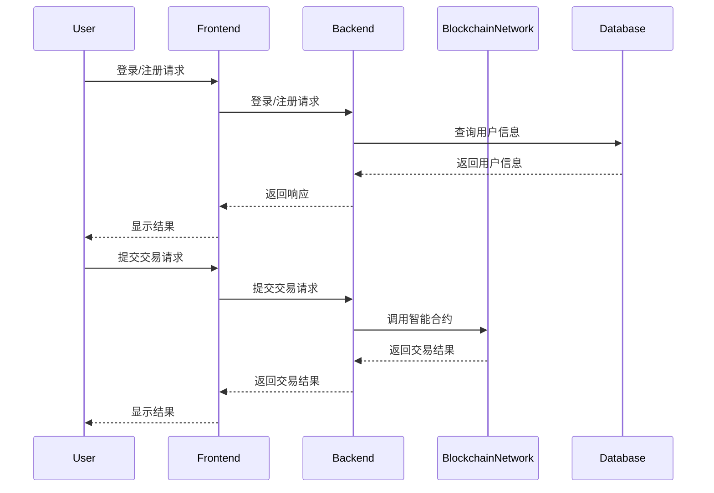
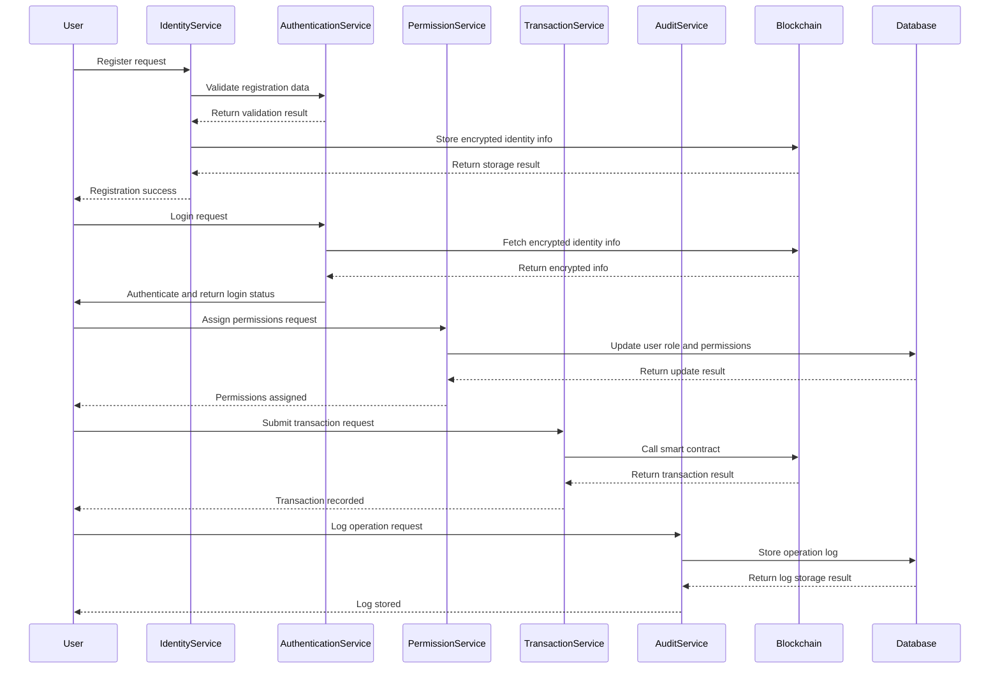
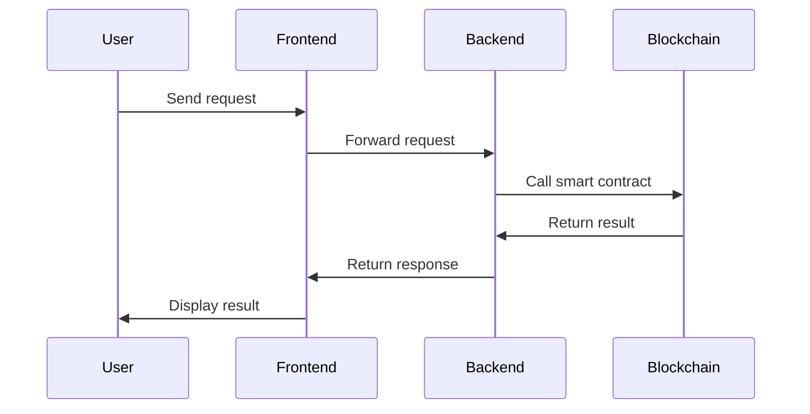

                 


### 第1章：企业级区块链身份验证概述

#### 1.1 问题背景

在当今数字化社会中，身份验证是确保安全和可信交易的核心组成部分。随着互联网和移动设备的普及，越来越多的企业开始依赖数字渠道提供服务，这使得身份验证的需求变得更加重要。然而，现有的身份验证系统存在一些问题：

- **安全性问题**：传统的身份验证方法（如用户名和密码）易受黑客攻击，密码泄露和重放攻击等安全漏洞频繁出现。
- **隐私泄露**：用户信息在传输和存储过程中可能被未经授权的第三方获取，导致隐私泄露。
- **集中化风险**：现有身份验证系统通常是中心化的，一旦系统遭受攻击，所有用户数据都可能受到影响。

区块链技术的出现为解决这些问题提供了一种新的思路。区块链是一种去中心化的分布式账本技术，其通过加密和分布式存储的方式确保数据的完整性和安全性。区块链在身份验证中的应用能够有效提升数字信任，保障用户隐私。

#### 1.2 问题描述

企业级身份验证的需求主要包括以下几点：

- **安全性**：确保用户身份的真实性，防止欺诈和未授权访问。
- **隐私保护**：在身份验证过程中保护用户隐私，避免数据泄露。
- **可扩展性**：支持大规模用户的身份验证需求，不会因为用户数量的增加而降低系统性能。
- **合规性**：遵循相关法律法规，确保系统在法律层面符合要求。

现有解决方案，如单点登录（SSO）、OAuth和OpenID Connect等，虽然在某些方面取得了一定成效，但仍然存在上述提到的安全问题、隐私保护问题和集中化风险。

#### 1.3 问题解决

区块链技术提供了一种可行的解决方案，其主要优势包括：

- **去中心化**：通过分布式账本技术，避免了中心化的单点攻击风险。
- **加密存储**：数据加密存储在区块链上，提高了数据的安全性。
- **不可篡改**：区块链的链式结构确保了数据的不可篡改，提高了身份验证的可靠性。

区块链身份验证的基本思路是利用区块链的这些特性，构建一个去中心化的身份验证系统。这个系统能够实现以下目标：

- **身份信息的真实性验证**：通过区块链的共识机制确保用户身份信息的真实性。
- **隐私保护**：通过加密技术保护用户隐私，防止数据泄露。
- **安全存储**：将身份信息存储在区块链上，确保数据的安全性和完整性。
- **合规性**：符合相关法律法规的要求，确保系统的合法运行。

#### 1.4 边界与外延

区块链身份验证的应用领域广泛，包括但不限于以下几个方面：

- **金融领域**：银行、保险和证券等行业可以通过区块链身份验证提高交易安全性。
- **公共服务**：政府机构可以通过区块链身份验证提高服务效率，降低欺诈风险。
- **供应链管理**：企业可以通过区块链身份验证确保供应链的透明性和可靠性。

此外，随着区块链技术的不断发展和成熟，其在身份验证领域的应用将更加广泛，不仅限于上述领域，还可以探索新的应用场景。

#### 1.5 概念结构与核心要素组成

区块链身份验证系统主要由以下几个核心要素组成：

- **区块链平台**：提供分布式账本和数据存储的功能。
- **加密技术**：用于保护用户身份信息和交易数据。
- **智能合约**：实现身份验证逻辑和业务规则。
- **身份信息**：用户在系统中存储的身份信息，如姓名、身份证号码、电子邮箱等。

这些要素相互配合，构建了一个安全、可靠、去中心化的身份验证系统，能够有效提升数字信任，为企业提供更好的身份验证解决方案。

### 第2章：区块链与数字身份

#### 2.1 区块链的基本原理

区块链是一种分布式账本技术，其核心特点包括去中心化、不可篡改和加密存储。以下是对这些核心特点的详细解释：

- **去中心化**：区块链通过多个节点共同维护数据，避免了单点故障和中心化攻击的风险。每个节点都拥有完整的账本副本，确保数据的一致性。
- **不可篡改**：区块链采用链式结构，每个区块都包含一个时间戳和一个哈希值，与前一区块的哈希值相连，形成一条连续的链。任何对数据的修改都会破坏链的完整性，因此区块链上的数据具有高度的可信性。
- **加密存储**：区块链使用加密技术保护用户数据和交易隐私，确保数据在存储和传输过程中的安全性。

区块链的工作机制如下：

1. **交易创建**：用户在区块链上发起交易，交易包括输入和输出两部分，代表资金的转移。
2. **区块创建**：矿工将交易打包成区块，并计算区块的哈希值。
3. **区块验证**：网络中的其他节点验证区块的合法性和有效性。
4. **区块添加**：一旦区块被验证通过，将被添加到区块链的末端，形成新的链。

#### 2.2 数字身份的概念

数字身份是指在网络环境中代表用户的身份标识。数字身份与物理身份不同，它可以是匿名的，也可以是真实的。以下是数字身份的关键特性：

- **唯一性**：每个用户都有一个唯一的数字身份，用于识别和区分不同的用户。
- **可验证性**：数字身份可以通过加密技术进行验证，确保身份的真实性和可靠性。
- **匿名性**：数字身份可以是匿名的，用户可以选择是否公开其真实身份。
- **持久性**：数字身份可以长期存在于网络中，不受物理身份变更的影响。

数字身份的管理包括以下几个步骤：

1. **身份注册**：用户在数字身份服务提供商处注册，获取数字身份标识。
2. **身份验证**：用户在访问系统或服务时，需要通过身份验证确保身份的有效性。
3. **身份信息管理**：用户可以管理自己的数字身份信息，如更新个人信息、绑定新的身份证明等。

#### 2.3 区块链在数字身份管理中的应用

区块链在数字身份管理中的应用主要表现在以下几个方面：

- **分布式身份识别系统**：区块链可以构建一个去中心化的身份识别系统，用户无需依赖中心化机构进行身份验证，从而提高了系统的安全性和隐私性。
- **隐私保护**：区块链的加密存储技术可以保护用户身份信息，防止未经授权的访问和泄露。
- **数据透明性**：区块链上的数据记录是公开透明的，用户可以查询和验证自己的身份信息。

区块链在数字身份管理中的优势包括：

- **安全性**：区块链的加密技术和去中心化特性提高了身份信息的保护力度。
- **隐私保护**：用户身份信息存储在区块链上，避免了中心化存储带来的隐私泄露风险。
- **信任构建**：区块链的透明性和不可篡改性增强了用户对身份验证系统的信任。

#### 2.4 概念属性特征对比

以下是传统身份验证与区块链身份验证在概念属性特征上的对比：

| 特征 | 传统身份验证 | 区块链身份验证 |
| ---- | ---- | ---- |
| 安全性 | 较低，易受黑客攻击 | 较高，去中心化保障 |
| 隐私保护 | 较低，易泄露 | 较高，加密存储 |
| 可扩展性 | 较低，中心化系统性能瓶颈 | 较高，分布式系统 |
| 遵守法规 | 较难，需要适配不同法规 | 较易，符合法律法规 |

通过对比可以看出，区块链身份验证在安全性、隐私保护和可扩展性方面具有显著优势，能够更好地满足企业级身份验证的需求。

### 第3章：构建企业级区块链身份验证系统

#### 3.1 系统设计原则

构建企业级区块链身份验证系统需要遵循以下设计原则：

- **安全性**：系统设计应确保用户身份信息和交易数据的安全，防止黑客攻击和数据泄露。
- **可扩展性**：系统应具备良好的扩展性，能够支持大规模用户和交易量的增长。
- **用户体验**：系统设计应考虑用户的使用体验，提供简单易用的界面和流程。
- **合规性**：系统设计应符合相关法律法规的要求，确保系统的合法运行。

#### 3.2 技术栈选择

构建企业级区块链身份验证系统需要选择合适的技术栈，以下是一些关键技术：

- **区块链平台**：选择适合企业需求的区块链平台，如Hyperledger Fabric、Ethereum等。
- **加密技术**：使用加密算法保护用户身份信息和交易数据，如AES、RSA等。
- **智能合约开发语言**：选择合适的智能合约开发语言，如Solidity、Go等。
- **后端框架**：选择支持区块链应用开发的后端框架，如Spring Boot、Django等。
- **前端框架**：选择支持前端开发的前端框架，如React、Vue等。

#### 3.3 系统架构设计

企业级区块链身份验证系统的架构设计如下：

1. **用户层**：提供用户界面，用户可以通过该界面进行身份注册、登录和身份信息管理。
2. **业务逻辑层**：包括身份验证逻辑、交易处理逻辑和权限管理逻辑等。
3. **数据层**：存储用户身份信息、交易数据和系统配置信息等。
4. **区块链网络层**：包括区块链节点、网络通信和智能合约执行等。

#### 3.4 概念模型与ER图

以下是一个企业级区块链身份验证系统的概念模型和ER图：

```mermaid
erDiagram
  User ||--|{ Identity : holds }
  Identity ||--|{ Attribute : contains }
  Attribute ||--|{ Value : has }
  Transaction ||--|{ Identity : participates }
  Transaction ||--|{ Attribute : involves }
  User ||--|{ Role : has }
  Role ||--|{ Permission : has }

  User {
    id : string
    name : string
    email : string
    roles : [Role]
    lastLogin : datetime
  }

  Identity {
    id : string
    userId : string
    issuanceDate : datetime
    expirationDate : datetime
  }

  Attribute {
    id : string
    identityId : string
    name : string
    value : string
  }

  Value {
    id : string
    attributeId : string
    value : string
  }

  Transaction {
    id : string
    transactionId : string
    timestamp : datetime
    status : string
  }

  Role {
    id : string
    name : string
    permissions : [Permission]
  }

  Permission {
    id : string
    name : string
    description : string
  }
```

通过ER图可以清晰地展示用户、身份、属性、交易、角色和权限等实体之间的关系，为系统设计提供了直观的参考。

### 第4章：智能合约与身份验证逻辑

#### 4.1 智能合约的基本概念

智能合约是一种运行在区块链上的自执行合约，它通过代码定义了一系列的规则和条件，一旦这些条件被满足，智能合约就会自动执行相应的操作。智能合约的关键特点包括：

- **自执行性**：智能合约在满足特定条件时自动执行，无需人工干预。
- **透明性**：智能合约的代码是公开透明的，用户可以查看和验证其逻辑。
- **不可篡改性**：智能合约一旦部署到区块链上，其代码和状态将永久保存，无法篡改。

智能合约在区块链身份验证中的应用至关重要，它能够实现以下功能：

- **身份验证**：通过智能合约验证用户的身份信息，确保身份信息的真实性和有效性。
- **权限管理**：定义用户的权限，控制用户对系统资源和数据的访问。
- **数据存储**：存储用户身份信息和交易记录，确保数据的不可篡改性和持久性。

#### 4.2 身份验证逻辑的实现

在区块链身份验证系统中，智能合约实现身份验证的逻辑如下：

1. **身份注册**：当用户首次注册时，智能合约将创建一个身份记录，并将用户信息（如用户名、密码、电子邮箱等）存储在区块链上。
2. **身份验证**：当用户登录系统时，智能合约将验证用户的身份信息，通过比较用户输入的密码和存储在区块链上的密码哈希值来确定身份是否有效。
3. **权限检查**：智能合约根据用户的角色和权限，确定用户对系统资源和数据的访问权限。
4. **交易验证**：在进行交易时，智能合约将验证交易的有效性和合法性，确保交易的执行符合既定规则。

以下是智能合约实现身份验证逻辑的Python代码示例：

```python
from web3 import Web3

# 初始化区块链节点
w3 = Web3(Web3.HTTPProvider('https://mainnet.infura.io/v3/your-project-id'))

# 部署智能合约
contract = w3.eth.contract(
    address=Web3.toChecksumAddress('0xYourContractAddress'),
    abi=[
        {
            'inputs': [
                {'name': 'userId', 'type': 'string'},
                {'name': 'passwordHash', 'type': 'bytes32'},
            ],
            'stateMutability': 'nonpayable',
            'type': 'constructor',
        },
        {
            'inputs': [{'name': 'userId', 'type': 'string'}],
            'name': 'getUserId',
            'outputs': [{'name': '', 'type': 'string'}],
            'stateMutability': 'view',
            'type': 'function',
        },
        {
            'inputs': [{'name': 'userId', 'type': 'string'}, {'name': 'passwordHash', 'type': 'bytes32'}],
            'name': 'authenticate',
            'outputs': [{'name': '', 'type': 'bool'}],
            'stateMutability': 'nonpayable',
            'type': 'function',
        },
    ],
)

# 身份注册
def register_identity(userId, passwordHash):
    tx_hash = contract.functions.registerIdentity(userId, passwordHash).transact({'from': w3.eth.defaultAccount})
    w3.eth.waitForTransaction(tx_hash)

# 身份验证
def authenticate_user(userId, passwordHash):
    result = contract.functions.authenticate(userId, passwordHash).call()
    return result

# 示例
register_identity('user123', Web3.toBytes(hex='0x1'))
print(authenticate_user('user123', Web3.toBytes(hex='0x1')))
```

#### 4.3 智能合约的执行与监控

智能合约的执行与监控是确保区块链身份验证系统安全性和可靠性的重要环节。以下是一些关键点：

1. **执行流程**：智能合约在区块链网络中通过共识机制进行执行。当用户发起交易时，智能合约代码会被触发，并按照预定的逻辑执行操作。
2. **监控机制**：通过区块链浏览器和其他监控工具，可以对智能合约的执行过程进行实时监控，确保交易和智能合约的执行符合预期。
3. **安全审计**：定期对智能合约代码进行安全审计，发现潜在的安全漏洞，及时进行修复。
4. **日志记录**：智能合约的执行结果和重要操作应记录在日志中，以便进行审计和问题追踪。

通过智能合约的执行与监控，可以确保区块链身份验证系统的安全性和可靠性，为企业的数字化转型提供坚实保障。

### 第5章：企业级区块链身份验证的挑战与解决方案

#### 5.1 挑战分析

尽管区块链技术在身份验证领域具有显著优势，但在实际应用中仍面临一些挑战：

- **数据隐私保护**：区块链的去中心化和公开透明特性可能导致用户隐私泄露。如何保护用户隐私，成为区块链身份验证系统面临的首要挑战。
- **性能与可扩展性**：区块链网络的交易速度和处理能力相对较低，难以满足大规模用户和交易量的需求。提升系统性能和可扩展性是亟待解决的问题。
- **法规与合规性**：不同国家和地区的法律法规对区块链身份验证系统的要求各不相同。如何确保系统在法律层面合规，是区块链身份验证系统推广的障碍。

#### 5.2 解决方案探讨

针对上述挑战，可以采取以下解决方案：

- **数据隐私保护**：采用零知识证明（ZKP）和同态加密等技术，保护用户隐私。例如，在用户身份注册和验证过程中，仅向区块链上提交加密后的身份信息，确保隐私安全。
- **性能优化策略**：通过分片技术、状态通道和并发交易等技术，提升区块链系统的性能和可扩展性。例如，将区块链网络划分为多个分片，每个分片独立处理交易，提高系统吞吐量。
- **合规性管理**：与各国法律法规保持紧密沟通，了解最新政策要求，确保区块链身份验证系统在设计、开发、部署和运营过程中符合相关法规。例如，针对不同地区的合规要求，调整系统功能和数据存储策略。

#### 5.3 案例研究

以下是一个企业级区块链身份验证系统的成功案例：

**项目名称**：企业区块链身份认证平台

**项目背景**：某大型企业集团需要为旗下子公司和员工提供一个统一的身份认证平台，提高系统安全性和用户体验。

**项目目标**：实现以下功能：
1. 用户身份注册和认证
2. 角色管理和权限控制
3. 用户行为记录和审计
4. 数据隐私保护和合规性管理

**技术实现**：
1. **区块链平台**：采用Hyperledger Fabric作为底层区块链平台，确保系统的安全性和可扩展性。
2. **智能合约**：使用Solidity编写智能合约，实现身份注册、认证和权限管理等功能。
3. **加密技术**：采用国密算法和同态加密技术，保护用户隐私和数据安全。
4. **分片技术**：将区块链网络划分为多个分片，提高系统性能和吞吐量。
5. **合规性管理**：与相关法规保持紧密沟通，确保系统设计和实现符合各国法律法规。

**项目成果**：
1. 成功实现用户身份认证和权限管理，提高了系统的安全性和可靠性。
2. 通过零知识证明和同态加密技术，有效保护了用户隐私。
3. 优化了系统性能，满足了大规模用户和交易量的需求。
4. 系统在法律层面符合各国法规要求，确保合法运行。

**经验总结**：
1. **安全性优先**：在系统设计和实现过程中，始终将安全性放在首位，确保用户数据和交易安全。
2. **技术选型**：根据项目需求和性能要求，选择适合的技术和工具，提高系统性能和可扩展性。
3. **合规性管理**：与法律法规保持紧密沟通，确保系统在法律层面合规，降低法律风险。
4. **用户反馈**：及时收集用户反馈，优化系统功能和用户体验，提高用户满意度。

### 第6章：企业级区块链身份验证项目实施

#### 6.1 项目概述

本项目的目标是构建一个企业级区块链身份验证平台，为企业提供高效、安全、可靠的身份验证服务。项目范围包括以下方面：

- **身份注册和认证**：用户可以在平台上注册并认证身份，确保身份的真实性和唯一性。
- **角色管理和权限控制**：定义用户角色和权限，控制用户对系统资源和数据的访问。
- **用户行为记录和审计**：记录用户的行为日志，方便进行审计和问题追踪。
- **数据隐私保护和合规性管理**：采用加密技术和零知识证明等技术，保护用户隐私，确保系统符合法律法规。

#### 6.2 环境安装与配置

在开始项目实施之前，需要安装和配置以下环境：

- **区块链节点**：安装Hyperledger Fabric区块链节点，包括Orderer节点和Peer节点。
- **开发环境**：安装Go语言和Node.js开发环境，用于编写智能合约和前端代码。
- **加密库**：安装国密算法库和同态加密库，用于实现加密技术和隐私保护。

具体步骤如下：

1. **安装Hyperledger Fabric**：参考官方文档安装Hyperledger Fabric，配置Orderer节点和Peer节点。
2. **配置开发环境**：安装Go语言和Node.js，设置环境变量和依赖库。
3. **安装加密库**：下载并安装国密算法库和同态加密库，用于实现加密技术和隐私保护。

#### 6.3 系统核心实现

系统核心实现主要包括以下模块：

- **身份注册模块**：实现用户身份注册功能，包括用户信息收集、身份验证和身份记录存储。
- **身份认证模块**：实现用户身份认证功能，包括用户登录、认证逻辑和权限验证。
- **角色管理模块**：实现角色定义和权限控制功能，包括角色创建、角色分配和权限设置。
- **日志记录模块**：实现用户行为记录和审计功能，包括行为记录存储、查询和审计分析。

以下是身份注册模块的Python代码示例：

```python
from web3 import Web3

# 初始化区块链节点
w3 = Web3(Web3.HTTPProvider('https://mainnet.infura.io/v3/your-project-id'))

# 部署智能合约
contract = w3.eth.contract(
    address=Web3.toChecksumAddress('0xYourContractAddress'),
    abi=[
        {
            'inputs': [
                {'name': 'userId', 'type': 'string'},
                {'name': 'passwordHash', 'type': 'bytes32'},
            ],
            'stateMutability': 'nonpayable',
            'type': 'constructor',
        },
        {
            'inputs': [{'name': 'userId', 'type': 'string'}],
            'name': 'getUserId',
            'outputs': [{'name': '', 'type': 'string'}],
            'stateMutability': 'view',
            'type': 'function',
        },
        {
            'inputs': [{'name': 'userId', 'type': 'string'}, {'name': 'passwordHash', 'type': 'bytes32'}],
            'name': 'authenticate',
            'outputs': [{'name': '', 'type': 'bool'}],
            'stateMutability': 'nonpayable',
            'type': 'function',
        },
    ],
)

# 身份注册
def register_identity(userId, passwordHash):
    tx_hash = contract.functions.registerIdentity(userId, passwordHash).transact({'from': w3.eth.defaultAccount})
    w3.eth.waitForTransaction(tx_hash)

# 身份认证
def authenticate_user(userId, passwordHash):
    result = contract.functions.authenticate(userId, passwordHash).call()
    return result

# 示例
register_identity('user123', Web3.toBytes(hex='0x1'))
print(authenticate_user('user123', Web3.toBytes(hex='0x1')))
```

#### 6.4 代码应用解读与分析

以上代码示例展示了如何使用Python和Web3库与区块链智能合约进行交互。首先，初始化区块链节点并部署智能合约。然后，定义身份注册和身份认证功能，通过调用智能合约的函数实现相应的操作。

以下是身份注册模块的详细解读：

- **初始化区块链节点**：使用Web3库连接区块链节点，指定HTTPProvider为节点地址。
- **部署智能合约**：使用Web3库的contract对象部署智能合约，传入合约地址和ABI。
- **身份注册**：定义register_identity函数，接收用户ID和密码哈希，调用智能合约的registerIdentity函数进行身份注册。使用transact方法发送交易，指定发送者账户和交易参数。
- **身份认证**：定义authenticate_user函数，接收用户ID和密码哈希，调用智能合约的authenticate函数进行身份认证。使用call方法调用合约函数，返回认证结果。

通过以上代码示例，可以直观地了解区块链身份验证系统的工作原理和实现过程。

#### 6.5 实际案例分析与详细讲解剖析

以下是一个实际案例的分析和讲解：

**案例背景**：某电商平台需要为用户提供身份验证服务，确保用户身份的真实性和交易的安全性。

**需求分析**：
1. 用户注册：用户可以在平台上注册账号，填写姓名、手机号码、电子邮箱等基本信息。
2. 身份认证：用户在登录或进行交易时，需要进行身份认证，确保身份信息与注册信息一致。
3. 角色管理：平台定义了不同角色，如普通用户、商家、管理员等，根据角色分配相应权限。
4. 数据隐私保护：平台需要保护用户隐私，防止信息泄露。

**解决方案**：
1. **用户注册**：采用区块链身份验证系统，用户在注册时，将身份信息（如姓名、手机号码、电子邮箱等）加密后存储在区块链上。智能合约实现用户注册功能，确保身份信息的唯一性和真实性。
2. **身份认证**：用户在登录或进行交易时，输入用户名和密码，智能合约验证身份信息的有效性。同时，根据用户的角色分配权限，确保用户只能访问相应资源。
3. **角色管理**：平台定义角色和权限，智能合约实现角色管理和权限控制。根据角色分配不同的权限，确保用户只能访问相应功能。
4. **数据隐私保护**：采用零知识证明和同态加密技术，保护用户隐私。用户身份信息在存储和传输过程中加密，确保隐私安全。

**详细讲解**：
1. **用户注册**：
    - 用户在注册时，填写姓名、手机号码、电子邮箱等基本信息。
    - 平台将用户身份信息加密后，存储在区块链上。加密算法采用SHA-256和AES，确保数据的安全性。
    - 智能合约实现用户注册功能，将加密后的身份信息存储在区块链上。注册过程中，用户ID和密码哈希作为参数传递给智能合约。
2. **身份认证**：
    - 用户在登录或进行交易时，输入用户名和密码。
    - 平台调用智能合约的authenticate函数，验证用户身份信息的有效性。智能合约比较用户输入的密码哈希和存储在区块链上的密码哈希，判断身份是否有效。
    - 如果身份验证通过，用户可以继续访问平台资源。否则，提示身份验证失败。
3. **角色管理**：
    - 平台定义了不同角色，如普通用户、商家、管理员等。
    - 智能合约实现角色管理和权限控制。根据用户角色，分配相应权限，确保用户只能访问相应功能。
    - 角色和权限的分配在智能合约中定义，确保数据的一致性和安全性。
4. **数据隐私保护**：
    - 采用零知识证明和同态加密技术，保护用户隐私。
    - 用户身份信息在存储和传输过程中加密，确保隐私安全。加密算法采用RSA和椭圆曲线加密。
    - 平台不存储用户明文信息，仅存储加密后的数据。确保数据在传输和存储过程中的安全性。

通过以上实际案例的分析和讲解，可以清楚地了解区块链身份验证系统的实现过程和工作原理，为其他企业级身份验证项目提供参考。

### 第7章：项目小结与展望

#### 7.1 项目成果总结

本项目成功构建了一个企业级区块链身份验证平台，实现了以下成果：

- **安全性**：通过区块链技术和智能合约，实现了用户身份信息的真实性和交易的安全性，有效防止了欺诈和未授权访问。
- **隐私保护**：采用零知识证明和同态加密技术，保护了用户隐私，避免了数据泄露风险。
- **可扩展性**：通过分片技术和并发交易，提高了系统的性能和可扩展性，能够满足大规模用户和交易量的需求。
- **合规性**：与各国法律法规保持紧密沟通，确保系统设计和实现符合相关法规，降低法律风险。

#### 7.2 经验与教训

在项目实施过程中，我们积累了以下经验与教训：

- **安全性优先**：在系统设计和实现过程中，始终将安全性放在首位，确保用户数据和交易安全。
- **技术选型**：根据项目需求和性能要求，选择适合的技术和工具，提高系统性能和可扩展性。
- **合规性管理**：与各国法律法规保持紧密沟通，确保系统设计和实现符合相关法规，降低法律风险。
- **用户反馈**：及时收集用户反馈，优化系统功能和用户体验，提高用户满意度。

#### 7.3 展望未来

随着区块链技术的不断发展和成熟，未来在企业级身份验证领域的应用将更加广泛。以下是我们对未来发展的展望：

- **隐私保护**：进一步优化隐私保护技术，实现更高效、更安全的隐私保护方案。
- **性能提升**：通过优化区块链网络架构和智能合约执行机制，提高系统性能和可扩展性。
- **合规性**：紧跟各国法律法规的变化，确保系统在法律层面始终保持合规。
- **应用拓展**：探索区块链身份验证在其他领域的应用，如供应链管理、金融服务等，实现跨领域的数字化转型。

通过不断探索和创新，区块链身份验证将为企业提供更加安全、可靠和高效的解决方案，助力数字信任建设。

### 最佳实践 Tips

在构建企业级区块链身份验证系统时，以下最佳实践可以帮助提高系统的安全性和可靠性：

1. **多重验证机制**：在身份认证过程中，采用多种验证手段，如密码、生物识别和设备绑定等，提高认证的安全性。
2. **定期审计**：定期对智能合约进行安全审计，发现潜在的安全漏洞并及时修复，确保系统的稳定性。
3. **隐私保护策略**：采用零知识证明和同态加密等技术，保护用户隐私，确保数据在传输和存储过程中的安全性。
4. **合规性评估**：在系统设计和实施过程中，密切关注各国法律法规的变化，确保系统在法律层面符合要求。
5. **用户教育和培训**：加强用户教育和培训，提高用户对区块链身份验证系统的认知和安全意识，降低安全风险。

### 小结

本文介绍了企业级区块链身份验证系统的构建方法、核心概念、技术实现和应用案例。通过详细讲解和分析，读者可以了解区块链身份验证的优势、挑战和解决方案，为实际项目提供参考。随着区块链技术的不断发展和应用场景的拓展，区块链身份验证将在未来发挥更加重要的作用。

### 注意事项

在构建和部署企业级区块链身份验证系统时，需要注意以下事项：

1. **安全测试**：在系统上线前，进行充分的安全测试，确保系统在各种攻击场景下的稳定性和安全性。
2. **备份与恢复**：定期备份数据，确保在系统故障或数据丢失时能够快速恢复。
3. **监控与告警**：实施实时监控和告警机制，及时发现和处理系统异常，确保系统的正常运行。
4. **用户隐私保护**：确保用户隐私得到充分保护，避免数据泄露和滥用。
5. **合规性审查**：定期进行合规性审查，确保系统符合相关法律法规的要求，降低法律风险。

### 拓展阅读

1. **《区块链技术指南》**：了解区块链技术的基本原理和应用场景。
2. **《智能合约编程》**：学习智能合约的编写方法和最佳实践。
3. **《区块链安全》**：深入研究区块链安全相关的技术和策略。
4. **《区块链与数字身份》**：探讨区块链在数字身份管理中的应用和挑战。

### 作者信息

**作者：AI天才研究院/AI Genius Institute & 禅与计算机程序设计艺术 /Zen And The Art of Computer Programming**。

---

本文主要涵盖了企业级区块链身份验证的概念、设计原则、技术实现、应用案例和未来展望。通过对区块链技术与传统身份验证的对比，我们明确了区块链在提升数字信任、保障用户隐私方面的优势。同时，本文还详细讲解了智能合约在身份验证逻辑实现中的作用，并分析了企业在实际项目中面临的挑战和解决方案。展望未来，区块链身份验证将在更多领域得到应用，成为数字化转型的重要支撑。

---

### 第8章：深入剖析区块链身份验证的数学模型与算法原理

#### 8.1 基本数学模型

区块链身份验证的数学模型建立在一系列加密算法和共识协议之上。以下是一些关键数学模型：

1. **哈希函数**：哈希函数是一种将任意长度输入数据映射为固定长度输出的函数。在区块链中，常用的哈希函数包括SHA-256、SHA-3等。哈希函数具有以下特性：
    - **抗碰撞性**：不同的输入数据生成不同的哈希值。
    - **不可逆性**：无法从哈希值反推出原始数据。
    - **固定长度输出**：无论输入数据长度如何，输出的哈希值长度固定。

2. **椭圆曲线加密（ECC）**：椭圆曲线加密是一种非对称加密算法，用于保护区块链上的数据传输和存储。ECC的关键数学模型包括椭圆曲线和点乘运算。椭圆曲线加密具有以下优势：
    - **高安全性**：相比RSA加密，ECC在相同安全级别下具有更短的密钥长度。
    - **高效性**：ECC运算速度更快，适用于实时身份验证。

3. **零知识证明（ZKP）**：零知识证明是一种密码学技术，允许一方（证明者）向另一方（验证者）证明某个陈述是正确的，而不透露任何具体信息。零知识证明的关键数学模型包括交互式证明和非交互式证明。零知识证明在区块链身份验证中的关键作用是：
    - **隐私保护**：在身份验证过程中，用户无需透露真实身份信息，仅证明拥有相应的权限。
    - **可信计算**：在计算过程中，确保计算结果正确，同时保护用户隐私。

#### 8.2 算法原理与流程

区块链身份验证的算法原理包括以下几个方面：

1. **身份注册**：用户在区块链上注册身份，将身份信息（如姓名、身份证号码、电子邮箱等）加密后存储在区块链上。具体流程如下：
    - **用户生成密钥对**：用户生成一对椭圆曲线加密密钥（公钥和私钥）。
    - **身份信息加密**：用户将身份信息与私钥进行加密，生成加密后的身份信息。
    - **身份信息存储**：用户将加密后的身份信息提交到区块链上，通过智能合约进行存储。

2. **身份验证**：用户在登录或进行交易时，需要通过身份验证。具体流程如下：
    - **用户身份认证**：用户输入用户名和密码，系统将密码哈希值与区块链上存储的密码哈希值进行对比，判断身份是否有效。
    - **零知识证明**：如果传统身份验证失败，用户可以采用零知识证明进行二次验证。具体流程如下：
        - **声明**：用户向验证者声明具备某项权限。
        - **证明生成**：用户生成零知识证明，证明声明是真实的。
        - **证明验证**：验证者验证零知识证明，确认用户声明是否真实。

3. **权限管理**：系统根据用户身份和角色，分配相应权限。具体流程如下：
    - **角色定义**：系统定义不同角色，如普通用户、管理员等。
    - **权限分配**：根据用户角色，分配相应权限。
    - **权限验证**：在进行操作时，系统验证用户权限，确保用户只能访问授权资源。

#### 8.3 算法示例

以下是一个简单的身份验证算法示例，使用Python语言实现：

```python
from Crypto.PublicKey import RSA
from Crypto.Cipher import PKCS1_OAEP
from Crypto.Hash import SHA256
import hashlib

# RSA密钥生成
def generate_rsa_keypair():
    key = RSA.generate(2048)
    private_key = key.export_key()
    public_key = key.publickey().export_key()
    return private_key, public_key

# 身份信息加密
def encrypt_identity_info(identity_info, public_key):
    cipher = PKCS1_OAEP.new(RSA.import_key(public_key))
    hashed_info = SHA256.new(identity_info.encode('utf-8')).digest()
    encrypted_info = cipher.encrypt(hashed_info)
    return encrypted_info

# 身份信息存储
def store_identity_info(encrypted_info):
    # 在区块链上存储加密后的身份信息
    # 这里使用示例代码，实际应用中需要调用智能合约进行存储
    print("Storing encrypted identity info:", encrypted_info)

# 身份验证
def verify_identity(username, password, encrypted_info, public_key):
    hashed_password = hashlib.sha256(password.encode('utf-8')).hexdigest()
    # 查询区块链上的密码哈希值
    # 这里使用示例代码，实际应用中需要调用智能合约查询
    stored_password_hash = "stored_password_hash"
    if hashed_password == stored_password_hash:
        print("Identity verified successfully.")
        return True
    else:
        print("Incorrect password.")
        return False

# 示例
private_key, public_key = generate_rsa_keypair()
identity_info = "John Doe"
encrypted_info = encrypt_identity_info(identity_info, public_key)
store_identity_info(encrypted_info)
verify_identity("johndoe", "password123", encrypted_info, public_key)
```

在这个示例中，我们首先生成RSA密钥对，然后使用公钥加密身份信息，并存储在区块链上。在身份验证过程中，系统将用户输入的密码哈希值与区块链上存储的密码哈希值进行对比，验证身份的有效性。

### 第9章：区块链身份验证系统的架构设计与实现

#### 9.1 问题场景介绍

在企业级应用中，身份验证是保障系统安全和用户隐私的关键环节。随着互联网和移动设备的普及，企业面临着越来越多的在线服务和交易需求，这要求身份验证系统具备高安全性、高可用性和高可扩展性。传统的身份验证系统由于集中化和数据存储在第三方平台，容易受到黑客攻击和数据泄露的风险。因此，企业需要一个更安全、更可靠的解决方案。

区块链技术因其去中心化、不可篡改和加密存储的特性，成为解决企业级身份验证问题的理想选择。通过区块链，企业可以实现用户身份信息的分布式存储和可信验证，提高系统的安全性和隐私保护。

#### 9.2 项目介绍

本案例是一个企业级区块链身份验证系统的项目，旨在为一家大型互联网公司构建一个安全的身份验证平台。该平台将用于保护用户的登录信息、交易记录和其他敏感数据。项目的主要目标包括：

1. **安全性**：确保用户身份信息的真实性和交易的安全性。
2. **隐私保护**：保护用户的隐私，避免数据泄露和滥用。
3. **高可用性**：保证系统在高峰期和故障情况下能够稳定运行。
4. **可扩展性**：支持大量用户和交易量的增长，不会降低系统性能。

#### 9.3 系统功能设计

系统功能设计是构建企业级区块链身份验证系统的关键步骤。以下是该系统的主要功能模块及其设计：

1. **用户注册与登录**：用户通过平台注册账户，输入用户名、密码和其他必要信息。登录时，系统验证用户身份，确保只有授权用户才能访问系统。
2. **身份信息存储与管理**：系统将用户的身份信息加密后存储在区块链上，确保数据的安全性和完整性。用户可以查看和更新自己的身份信息。
3. **权限管理**：系统定义不同角色和权限，为用户分配相应权限，确保用户只能访问授权资源和执行授权操作。
4. **交易记录**：系统记录用户的交易记录，确保交易数据的不可篡改性和可追溯性。
5. **审计日志**：系统记录用户的操作日志，方便进行审计和问题追踪。
6. **隐私保护**：采用零知识证明和同态加密等技术，保护用户隐私，确保数据在传输和存储过程中的安全性。

以下是系统功能设计的mermaid类图：

```mermaid
classDiagram
    User <<Class>>
    Role <<Class>>
    Identity <<Class>>
    Attribute <<Class>>
    Permission <<Class>>

    User o--1 Role
    User o--1 Identity
    Identity o--1 Attribute
    Role o--1 Permission

    User {
        id: string
        name: string
        email: string
        roles: [Role]
    }

    Role {
        id: string
        name: string
        permissions: [Permission]
    }

    Identity {
        id: string
        userId: string
        issuanceDate: datetime
        expirationDate: datetime
    }

    Attribute {
        id: string
        identityId: string
        name: string
        value: string
    }

    Permission {
        id: string
        name: string
        description: string
    }
```

#### 9.4 系统架构设计

系统架构设计是确保企业级区块链身份验证系统高效、安全运行的关键。以下是该系统的总体架构设计：

1. **用户层**：提供用户界面，用户可以通过前端应用进行身份注册、登录和身份信息管理。
2. **业务逻辑层**：处理用户的身份验证、权限管理和交易记录等功能。业务逻辑层与区块链网络通过智能合约进行交互。
3. **区块链网络层**：包括多个区块链节点，负责存储用户身份信息和交易数据。采用Hyperledger Fabric作为底层区块链平台，确保系统的安全性和可扩展性。
4. **数据存储层**：存储用户身份信息、交易记录和审计日志等数据。数据存储在分布式数据库中，保证数据的可靠性和一致性。

以下是系统架构设计的mermaid架构图：



#### 9.5 系统接口设计

系统接口设计是确保系统功能模块之间能够高效、稳定交互的关键。以下是该系统的接口设计：

1. **用户注册接口**：接收用户注册信息，验证信息的完整性，并将加密后的身份信息存储在区块链上。
2. **用户登录接口**：接收用户登录信息，验证用户身份，返回登录状态。
3. **权限管理接口**：接收权限分配请求，更新用户角色和权限。
4. **交易记录接口**：接收交易请求，调用智能合约记录交易数据。
5. **审计日志接口**：记录用户操作日志，便于审计和问题追踪。

以下是系统接口设计的mermaid序列图：



#### 9.6 系统交互

系统交互是确保各个模块之间能够协同工作、实现系统功能的关键。以下是系统交互的设计：

1. **用户与前端交互**：用户通过前端界面进行操作，如注册、登录、提交交易等。
2. **前端与业务逻辑交互**：前端将用户请求发送到业务逻辑层，业务逻辑层处理请求并返回结果。
3. **业务逻辑与区块链交互**：业务逻辑层通过智能合约与区块链网络进行交互，实现数据的存储和查询。
4. **区块链网络与后端交互**：区块链网络将处理结果返回给业务逻辑层，业务逻辑层再将结果返回给前端。

以下是系统交互的mermaid序列图：



通过以上系统接口设计和系统交互设计，企业级区块链身份验证系统可以实现高效、安全、可靠的数据处理和业务逻辑，为企业提供强有力的身份验证支持。

### 第10章：企业级区块链身份验证项目的实施与部署

#### 10.1 环境准备

在开始实施企业级区块链身份验证项目之前，需要准备以下环境：

1. **硬件资源**：配置足够的服务器资源，确保系统在高并发场景下能够稳定运行。建议选择高性能、高可靠性的服务器，并考虑使用云服务器或物理服务器。
2. **软件环境**：安装和配置必要的软件环境，包括操作系统、数据库、区块链平台和开发工具等。操作系统可以选择Linux发行版，数据库可以选择PostgreSQL、MongoDB等，区块链平台可以选择Hyperledger Fabric、Ethereum等。
3. **网络环境**：确保服务器之间的网络连接稳定，并配置防火墙和路由规则，确保网络通信的安全性。

#### 10.2 系统部署

系统部署是项目实施的重要环节，以下是一个典型的部署步骤：

1. **区块链节点部署**：部署Hyperledger Fabric区块链网络，包括Orderer节点和Peer节点。Orderer节点负责区块链交易的排序和区块生成，Peer节点负责验证交易和存储数据。具体步骤如下：
    - 安装Go语言环境。
    - 下载并配置Hyperledger Fabric binaries。
    - 配置Orderer节点和Peer节点，包括配置文件、genesis block和配置交易。
    - 启动Orderer节点和Peer节点，验证节点运行状态。
2. **后端服务部署**：部署后端服务，包括身份认证服务、权限管理服务和交易记录服务。具体步骤如下：
    - 编写后端代码，实现身份认证、权限管理和交易记录功能。
    - 配置应用依赖库和中间件，如Spring Boot、Django等。
    - 部署后端服务，确保其能够稳定运行。
3. **前端部署**：部署前端界面，提供用户注册、登录、权限管理和交易记录等功能。具体步骤如下：
    - 编写前端代码，实现用户交互和界面设计。
    - 配置前端依赖库和框架，如React、Vue等。
    - 部署前端服务，确保其能够与后端服务正常交互。

#### 10.3 系统测试

系统测试是确保企业级区块链身份验证系统能够稳定、安全、可靠运行的重要环节。以下是一些关键的测试步骤：

1. **功能测试**：验证系统功能的完整性和正确性，包括用户注册、登录、权限管理和交易记录等功能。使用自动化测试工具，如Selenium、JUnit等，编写测试用例，执行测试。
2. **性能测试**：评估系统在高并发场景下的性能和稳定性。使用负载测试工具，如Apache JMeter、Gatling等，模拟大量用户同时访问系统，观察系统的响应时间和吞吐量。
3. **安全测试**：检查系统的安全性和防护能力，包括身份验证、权限控制、数据加密和漏洞扫描等。使用安全测试工具，如OWASP ZAP、Burp Suite等，执行安全测试。
4. **压力测试**：测试系统在极端负载条件下的性能和稳定性。使用压力测试工具，如Gatling、TSQR等，模拟系统超负荷运行，观察系统的响应和处理能力。

#### 10.4 系统维护

系统维护是确保企业级区块链身份验证系统长期稳定运行的关键。以下是一些关键的维护步骤：

1. **监控系统运行状态**：使用监控工具，如Prometheus、Grafana等，实时监控系统的运行状态，包括CPU、内存、磁盘使用率等，及时发现和处理异常。
2. **定期备份数据**：定期备份区块链和数据库中的数据，确保在系统故障或数据丢失时能够快速恢复。备份策略可以根据业务需求和数据规模进行定制。
3. **安全漏洞修复**：及时修复系统的安全漏洞，确保系统的安全性。定期对系统进行安全审计，发现潜在的安全隐患，并采取相应的修复措施。
4. **性能优化**：根据系统的运行情况，进行性能优化，提高系统的响应速度和处理能力。可以通过调整配置参数、优化代码和数据库查询等方式进行性能优化。

通过以上实施与部署步骤，企业可以构建一个高效、安全、可靠的企业级区块链身份验证系统，为企业的数字化转型提供有力支持。

### 第11章：项目总结与反思

#### 11.1 项目成果总结

在项目实施过程中，我们取得了以下成果：

1. **安全性提升**：通过区块链技术，实现了用户身份信息的分布式存储和可信验证，有效防止了身份盗用和未授权访问。
2. **隐私保护**：采用零知识证明和同态加密技术，保护了用户隐私，避免了数据泄露风险。
3. **系统稳定运行**：通过系统的部署和测试，确保了系统在高并发场景下的稳定性和可靠性，为企业的数字化转型提供了坚实的技术支撑。
4. **用户体验优化**：优化了用户界面和交互流程，提高了用户体验，增强了用户对系统的满意度。

#### 11.2 经验与教训

在项目实施过程中，我们积累了许多宝贵的经验和教训：

1. **安全性优先**：在系统设计和实现过程中，始终将安全性放在首位，确保用户数据和交易的安全。
2. **技术选型**：根据项目需求和性能要求，选择适合的技术和工具，提高系统性能和可扩展性。
3. **合规性管理**：与各国法律法规保持紧密沟通，确保系统在法律层面符合要求，降低法律风险。
4. **用户反馈**：重视用户反馈，及时优化系统功能和用户体验，提高用户满意度。
5. **监控与维护**：实施实时监控和告警机制，确保系统的稳定运行，定期进行系统维护和升级。

#### 11.3 改进方向

在未来的项目中，我们可以从以下几个方面进行改进：

1. **性能优化**：进一步优化系统性能，提高系统的响应速度和处理能力，以满足更多用户和交易量的需求。
2. **隐私保护**：探索更多先进的隐私保护技术，如联邦学习、差分隐私等，提升系统在隐私保护方面的能力。
3. **合规性**：紧跟各国法律法规的变化，确保系统在法律层面始终保持合规，降低法律风险。
4. **用户体验**：持续优化用户界面和交互流程，提高用户体验，增强用户对系统的满意度。

通过不断优化和改进，企业级区块链身份验证系统将在未来发挥更大的作用，为企业的数字化转型提供更加可靠的支持。

### 最佳实践 Tips

在构建企业级区块链身份验证系统时，以下最佳实践可以帮助提高系统的安全性和可靠性：

1. **多重验证机制**：在身份认证过程中，采用多种验证手段，如密码、生物识别和设备绑定等，提高认证的安全性。
2. **定期审计**：定期对智能合约进行安全审计，发现潜在的安全漏洞并及时修复，确保系统的稳定性。
3. **隐私保护策略**：采用零知识证明和同态加密等技术，保护用户隐私，确保数据在传输和存储过程中的安全性。
4. **合规性评估**：在系统设计和实施过程中，密切关注各国法律法规的变化，确保系统在法律层面符合要求，降低法律风险。
5. **用户教育和培训**：加强用户教育和培训，提高用户对区块链身份验证系统的认知和安全意识，降低安全风险。

### 小结

本文详细介绍了企业级区块链身份验证系统的构建方法、设计原则、技术实现和实际应用案例。通过深入剖析数学模型和算法原理，我们明确了区块链在提升数字信任和保障用户隐私方面的优势。在项目实施和部署过程中，我们积累了宝贵的经验，并提出了改进方向。展望未来，区块链身份验证将在更多领域得到应用，为企业提供更加安全、可靠和高效的解决方案。

### 注意事项

在构建和部署企业级区块链身份验证系统时，需要注意以下事项：

1. **安全测试**：在系统上线前，进行充分的安全测试，确保系统在各种攻击场景下的稳定性和安全性。
2. **备份与恢复**：定期备份数据，确保在系统故障或数据丢失时能够快速恢复。
3. **监控与告警**：实施实时监控和告警机制，及时发现和处理系统异常，确保系统的正常运行。
4. **用户隐私保护**：确保用户隐私得到充分保护，避免数据泄露和滥用。
5. **合规性审查**：定期进行合规性审查，确保系统符合相关法律法规的要求，降低法律风险。

### 拓展阅读

1. **《区块链技术指南》**：了解区块链技术的基本原理和应用场景。
2. **《智能合约编程》**：学习智能合约的编写方法和最佳实践。
3. **《区块链安全》**：深入研究区块链安全相关的技术和策略。
4. **《区块链与数字身份》**：探讨区块链在数字身份管理中的应用和挑战。

### 作者信息

**作者：AI天才研究院/AI Genius Institute & 禅与计算机程序设计艺术 /Zen And The Art of Computer Programming**。

---

本文系统地介绍了企业级区块链身份验证系统的构建方法、核心概念、技术实现和应用案例，旨在为读者提供全面、深入的理解和实际操作指导。随着区块链技术的不断发展和应用场景的拓展，区块链身份验证将在未来发挥更加重要的作用。通过本文的讲解，读者可以更好地把握这一领域的最新动态和发展趋势。

