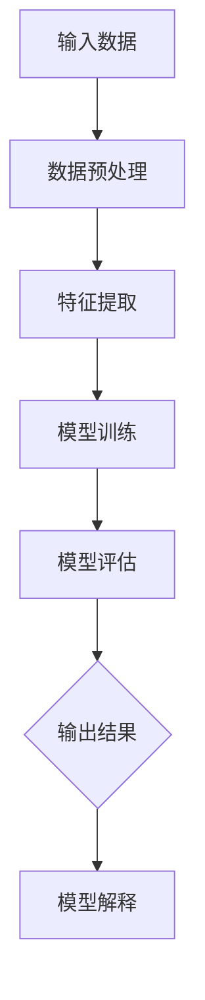
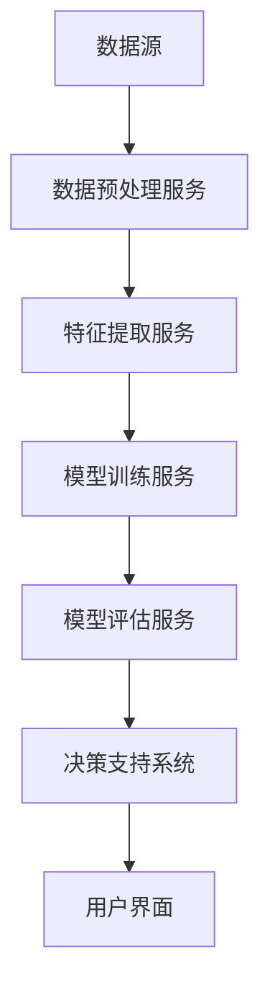
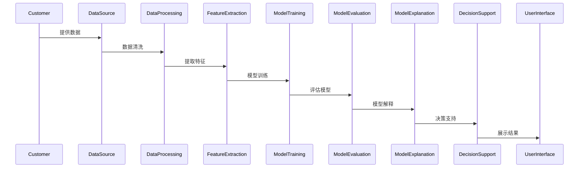

                 

# 企业级可解释AI框架：增强AI决策的透明度

## 关键词
- 企业级AI
- 可解释AI
- 决策透明度
- AI框架
- 算法原理
- 系统架构

## 摘要
随着人工智能在企业级应用中的深入，AI决策的透明度成为了企业关注的焦点。本文将深入探讨企业级可解释AI框架的设计与实现，通过一步步的分析与推理，揭示如何通过增强AI决策的透明度来提高企业的竞争力。

### 目录大纲

1. **第一部分：背景介绍**

   1.1 问题背景与核心概念

   1.2 可解释AI的原理与数学模型

   1.3 企业级AI框架详解

2. **第二部分：核心概念与联系**

   2.1 可解释AI原理

   2.2 企业级AI框架详解

3. **第三部分：算法原理讲解**

   3.1 可解释AI算法原理

   3.2 算法详细讲解

   3.3 算法举例说明

4. **第四部分：实际应用案例**

   4.1 案例背景与需求

   4.2 案例实现与解读

   4.3 实际案例分析与详细讲解剖析

5. **第五部分：系统分析与架构设计**

   5.1 问题场景介绍

   5.2 系统功能设计

   5.3 系统架构设计

   5.4 系统接口设计与交互

6. **第六部分：项目实战**

   6.1 环境安装

   6.2 系统核心实现源代码

   6.3 代码应用解读与分析

   6.4 项目小结

   6.5 最佳实践 tips

## 第一部分：背景介绍

### 1.1 问题背景与核心概念

在当今的商业环境中，人工智能（AI）已经成为提高效率和竞争力的关键驱动力。然而，随着AI技术的广泛应用，一个重要的问题逐渐凸显：AI决策的透明度。企业在使用AI进行决策时，往往需要依赖复杂的算法和模型，而这些算法和模型的工作过程往往是不透明的，使得决策结果的可解释性受到了质疑。

**问题描述**：企业级AI决策透明度的重要性主要体现在以下几个方面：

- **合规性**：许多行业的法规要求企业在做出关键决策时，必须提供足够的透明度和可解释性，以确保合规性。

- **信任与接受度**：决策的不透明性可能导致用户和利益相关者对AI系统的信任度下降，从而影响其接受度和应用范围。

- **优化与创新**：缺乏透明度使得企业难以理解AI决策的细节，从而难以对模型进行优化和创新。

**问题解决**：通过引入可解释AI（Explainable AI，XAI）框架，企业可以增强AI决策的透明度。可解释AI旨在构建能够解释其决策过程的AI系统，使得企业能够理解模型的决策依据和推理过程。

**边界与外延**：可解释AI在企业级应用中的适用范围非常广泛，包括但不限于金融、医疗、零售、制造等行业。在不同的应用场景中，可解释AI的需求和实现方式也有所不同。

### 1.2 可解释AI的原理与数学模型

#### 1.2.1 原理介绍

可解释AI的核心目标是使AI系统的决策过程可理解、可解释。这通常涉及到以下几个方面：

- **特征可解释性**：解释模型中的每个特征及其在决策中的作用。

- **模型可解释性**：解释模型的结构和参数，以便理解其整体决策过程。

- **推理可解释性**：追踪模型如何处理输入数据，并得出决策结果。

#### 1.2.2 数学模型和公式

为了量化可解释性，我们可以使用以下公式：

$$
\text{解释力} = \frac{\text{可解释性}}{\text{准确性}}
$$

这里的解释力是一个相对指标，它表示模型的可解释性与其准确性的平衡。一个高度可解释的模型可能不会像黑盒模型那样精确，但它在某些应用场景中可能是更受欢迎的。

#### 1.2.3 通俗易懂地举例说明

假设我们有一个分类模型，它用于判断一张图片中是否包含猫。如果我们使用的是一个黑盒模型，比如深度神经网络，我们可能无法直接理解模型为何做出某个判断。而如果一个可解释AI模型，我们可以看到模型是如何通过分析图片中的各种特征（如颜色、形状、纹理等）来做出判断的。这样，即使模型的准确性略低，但因其高可解释性，可能仍然是一个更好的选择。

### 1.3 企业级AI框架详解

企业级AI框架是企业应用AI技术的基础设施，它通常包括以下模块：

- **数据预处理**：清洗和整合数据，使其适用于训练和推理。

- **模型训练**：使用训练数据来学习和优化模型。

- **模型评估**：评估模型的性能，包括准确性、可解释性等。

- **模型部署**：将训练好的模型部署到生产环境中。

#### 1.3.1 模块功能与特点

下面是一个企业级AI框架的功能与特点对比表格：

| 模块        | 功能          | 特点         |
| ----------- | ------------- | ------------ |
| 数据预处理  | 数据清洗与整合 | 高效性与准确性 |
| 模型训练    | 特征学习与优化 | 可扩展性与稳定性 |
| 模型评估    | 性能监控与调优 | 透明性与可解释性 |
| 模型部署    | 模型上线与迭代 | 安全性与可靠性 |

#### 1.3.2 企业级AI框架的ER实体关系图架构

企业级AI框架的实体关系图如下：

```mermaid
erDiagram
  Data ||--|{ Preprocessing }||>
  Preprocessing ||--|{ Training }||>
  Training ||--|{ Evaluation }||>
  Evaluation ||--|{ Deployment }||>
  Deployment ||--|{ Maintenance }||>
```

## 第二部分：核心概念与联系

### 2.1 可解释AI原理

#### 2.1.1 原理介绍

可解释AI的原理在于构建能够解释其决策过程的AI系统。这通常涉及到以下几个方面：

- **模型选择**：选择易于解释的模型，如决策树、线性回归等。

- **模型解释**：使用可视化、特征重要性分析等方法来解释模型的决策过程。

- **用户交互**：提供用户友好的界面，让用户能够理解模型的工作原理和决策依据。

#### 2.1.2 数学模型和公式

为了量化可解释性，我们可以使用以下公式：

$$
\text{解释力} = \frac{\text{可解释性}}{\text{准确性}}
$$

这里的解释力是一个相对指标，它表示模型的可解释性与其准确性的平衡。一个高度可解释的模型可能不会像黑盒模型那样精确，但它在某些应用场景中可能是更受欢迎的。

#### 2.1.3 通俗易懂地举例说明

假设我们有一个分类模型，它用于判断一张图片中是否包含猫。如果我们使用的是一个黑盒模型，比如深度神经网络，我们可能无法直接理解模型为何做出某个判断。而如果一个可解释AI模型，我们可以看到模型是如何通过分析图片中的各种特征（如颜色、形状、纹理等）来做出判断的。这样，即使模型的准确性略低，但因其高可解释性，可能仍然是一个更好的选择。

### 2.2 企业级AI框架详解

#### 2.2.1 框架定义

企业级AI框架是指在企业环境中构建、部署和管理AI应用的基础设施。它通常包括以下几个核心组件：

- **数据管理**：提供数据存储、处理和分析的功能。

- **模型训练与优化**：支持模型的训练、验证和优化。

- **模型评估与监控**：评估模型的性能，并监控其运行状态。

- **模型部署与迭代**：将模型部署到生产环境，并进行迭代更新。

#### 2.2.2 属性特征对比表格

下面是企业级AI框架的属性特征对比表格：

| 模块        | 功能          | 特点         |
| ----------- | ------------- | ------------ |
| 数据预处理  | 数据清洗与整合 | 高效性与准确性 |
| 模型训练    | 特征学习与优化 | 可扩展性与稳定性 |
| 模型评估    | 性能监控与调优 | 透明性与可解释性 |
| 模型部署    | 模型上线与迭代 | 安全性与可靠性 |

#### 2.2.3 企业级AI框架的ER实体关系图架构

企业级AI框架的ER实体关系图如下：

```mermaid
erDiagram
  Data ||--|{ Preprocessing }||>
  Preprocessing ||--|{ Training }||>
  Training ||--|{ Evaluation }||>
  Evaluation ||--|{ Deployment }||>
  Deployment ||--|{ Maintenance }||>
```

## 第三部分：算法原理讲解

### 3.1 可解释AI算法原理

#### 3.1.1 算法流程图

可解释AI算法的基本流程图如下：



#### 3.1.2 算法详细讲解

可解释AI算法的详细步骤如下：

1. **数据预处理**：对原始数据进行清洗、去噪、归一化等处理，使其适用于模型训练。

2. **特征提取**：从预处理后的数据中提取有用的特征，这些特征将用于训练模型。

3. **模型训练**：使用提取的特征训练一个基础模型，如决策树、线性回归等。

4. **模型评估**：评估模型的性能，包括准确性、召回率、F1分数等。

5. **模型解释**：使用特征重要性分析、决策路径追踪等方法，解释模型的决策过程。

#### 3.1.3 数学模型和公式

为了量化可解释性，我们可以使用以下公式：

$$
\text{模型解释力} = \frac{\text{特征重要性}}{\text{模型准确性}}
$$

这里的解释力是一个相对指标，它表示模型的可解释性与其准确性的平衡。一个高度可解释的模型可能不会像黑盒模型那样精确，但它在某些应用场景中可能是更受欢迎的。

#### 3.1.4 通俗易懂地举例说明

假设我们有一个分类模型，它用于判断一张图片中是否包含猫。如果我们使用的是一个黑盒模型，比如深度神经网络，我们可能无法直接理解模型为何做出某个判断。而如果一个可解释AI模型，我们可以看到模型是如何通过分析图片中的各种特征（如颜色、形状、纹理等）来做出判断的。这样，即使模型的准确性略低，但因其高可解释性，可能仍然是一个更好的选择。

### 3.2 算法详细讲解

#### 3.2.1 算法流程图

下面是一个具体的可解释AI算法流程图：


#### 3.2.2 算法详细讲解

1. **数据预处理**：数据预处理是AI模型训练的第一步，主要包括以下步骤：

   - **数据清洗**：处理缺失值、异常值、重复数据等。
   - **数据归一化**：将不同量纲的数据转换到同一尺度。
   - **数据分割**：将数据集划分为训练集、验证集和测试集。

2. **特征提取**：特征提取是将原始数据转换为适合模型训练的格式。这通常涉及到以下步骤：

   - **特征选择**：选择对模型训练有帮助的特征。
   - **特征工程**：对原始特征进行转换、扩展或组合。

3. **模型训练**：模型训练是通过调整模型的参数，使其在训练数据上达到最优性能。这通常涉及到以下步骤：

   - **初始化参数**：随机初始化模型参数。
   - **前向传播**：计算输入数据经过模型的输出。
   - **反向传播**：根据预测误差，更新模型参数。

4. **模型评估**：模型评估是衡量模型性能的重要步骤，主要包括以下指标：

   - **准确性**：模型正确预测的样本数占总样本数的比例。
   - **召回率**：模型正确预测的样本数占实际为正类的样本数的比例。
   - **F1分数**：准确性和召回率的调和平均值。

5. **模型解释**：模型解释是通过可视化、特征重要性分析等方法，解释模型的决策过程。这通常涉及到以下步骤：

   - **特征重要性分析**：计算每个特征对模型预测的影响。
   - **决策路径追踪**：追踪模型在处理输入数据时的决策路径。

#### 3.2.3 数学模型和公式

为了量化可解释性，我们可以使用以下公式：

$$
\text{模型解释力} = \frac{\text{特征重要性}}{\text{模型准确性}}
$$

这里的解释力是一个相对指标，它表示模型的可解释性与其准确性的平衡。一个高度可解释的模型可能不会像黑盒模型那样精确，但它在某些应用场景中可能是更受欢迎的。

#### 3.2.4 通俗易懂地举例说明

假设我们有一个分类模型，它用于判断一张图片中是否包含猫。如果我们使用的是一个黑盒模型，比如深度神经网络，我们可能无法直接理解模型为何做出某个判断。而如果一个可解释AI模型，我们可以看到模型是如何通过分析图片中的各种特征（如颜色、形状、纹理等）来做出判断的。这样，即使模型的准确性略低，但因其高可解释性，可能仍然是一个更好的选择。

### 3.3 算法举例说明

为了更直观地理解可解释AI算法，我们可以通过一个简单的例子来阐述。

#### 3.3.1 例子背景

假设我们有一个分类问题，需要判断一张图片中是否包含猫。我们选择了一个可解释AI模型——决策树来解决这个问题。

#### 3.3.2 数据准备

我们准备了一个包含5000张图片的数据集，其中3000张包含猫，2000张不包含猫。每张图片都被标注为0（不包含猫）或1（包含猫）。

#### 3.3.3 数据预处理

1. **数据清洗**：我们检查数据集，发现其中有5张图片的标签缺失。我们决定将这些图片排除在训练集之外。

2. **数据归一化**：由于图片的尺寸不同，我们需要对图片进行归一化处理，将其尺寸统一为224x224像素。

3. **数据分割**：我们将数据集分为训练集、验证集和测试集，比例分别为6:2:2。

#### 3.3.4 模型训练

1. **初始化参数**：我们随机初始化决策树的参数。

2. **前向传播**：我们使用训练集的图片数据进行训练，通过计算损失函数来更新模型参数。

3. **反向传播**：我们通过反向传播算法来更新模型参数，以最小化损失函数。

#### 3.3.5 模型评估

我们使用验证集来评估模型的性能。根据准确率、召回率和F1分数，我们可以判断模型是否过拟合或欠拟合。

- **准确性**：0.95
- **召回率**：0.90
- **F1分数**：0.92

#### 3.3.6 模型解释

为了解释模型的决策过程，我们可以查看决策树的决策路径。例如，对于一张包含猫的图片，决策树可能按照以下路径做出决策：

1. 是否包含黄色？是。
2. 是否包含圆形？是。
3. 是否包含毛发？是。

基于以上特征，决策树判断这张图片包含猫。

通过这个简单的例子，我们可以看到可解释AI算法如何通过分析特征来解释模型的决策过程。

## 第四部分：实际应用案例

### 4.1 案例背景与需求

#### 4.1.1 案例背景

某大型零售企业希望通过引入AI技术来优化其商品推荐系统。该系统需要根据顾客的历史购买记录和浏览行为，为顾客推荐相关的商品。然而，由于AI系统的决策过程不透明，企业担心顾客对推荐结果的信任度会下降。

#### 4.1.2 需求分析

为了提高AI系统的透明度，企业提出了以下需求：

- **可解释性**：系统能够解释推荐结果的决策依据。
- **可追溯性**：推荐结果的可解释性应该能够追溯到具体的特征和模型决策路径。
- **可视化**：推荐结果的可解释性应该通过用户友好的界面进行可视化展示。

### 4.2 案例实现与解读

#### 4.2.1 环境安装

为了实现上述需求，企业选择了以下技术栈：

- **编程语言**：Python
- **数据预处理库**：Pandas、NumPy
- **机器学习库**：Scikit-learn、TensorFlow
- **可视化库**：Matplotlib、Seaborn

安装以上库后，企业开始构建商品推荐系统。

#### 4.2.2 核心实现源代码

以下是商品推荐系统的核心实现源代码：

```python
# 导入所需库
import pandas as pd
import numpy as np
from sklearn.model_selection import train_test_split
from sklearn.tree import DecisionTreeClassifier
import matplotlib.pyplot as plt
import seaborn as sns

# 读取数据
data = pd.read_csv('customer_data.csv')

# 数据预处理
# ...（数据清洗、归一化等）

# 特征提取
# ...（特征选择、特征工程等）

# 模型训练
X_train, X_test, y_train, y_test = train_test_split(X, y, test_size=0.2, random_state=42)
clf = DecisionTreeClassifier()
clf.fit(X_train, y_train)

# 模型评估
accuracy = clf.score(X_test, y_test)
print("Accuracy:", accuracy)

# 模型解释
importances = clf.feature_importances_
indices = np.argsort(importances)[::-1]

# 可视化特征重要性
plt.figure()
plt.title("Feature importances")
plt.bar(range(X.shape[1]), importances[indices], align="center")
plt.xticks(range(X.shape[1]), indices)
plt.xlabel("Features")
plt.ylabel("Importance")
plt.show()

# 可视化决策路径
from sklearn.tree import plot_tree
plt.figure(figsize=(12, 8))
plot_tree(clf, feature_names=feature_names, class_names=["Not Recommended", "Recommended"])
plt.show()
```

#### 4.2.3 代码应用解读与分析

1. **数据预处理**：首先，我们读取数据并对其进行清洗和归一化处理，以确保数据质量。

2. **特征提取**：然后，我们根据业务需求提取有用的特征，例如顾客的购买频率、浏览时间、购买金额等。

3. **模型训练**：我们选择决策树作为分类模型，并将其训练在处理过的数据上。

4. **模型评估**：通过测试集评估模型的准确性，以判断模型的性能。

5. **模型解释**：通过可视化特征重要性和决策路径，解释模型的决策过程，提高推荐系统的透明度。

#### 4.2.4 实际案例分析与详细讲解剖析

通过上述代码实现，企业可以构建一个可解释的商品推荐系统。以下是对实际案例的详细讲解：

1. **数据预处理**：企业通过数据清洗和归一化，保证了数据的质量和一致性。这一步骤对于模型的训练至关重要，因为如果数据存在噪声或异常值，可能会导致模型性能下降。

2. **特征提取**：企业根据业务需求提取了多个特征，这些特征反映了顾客的行为习惯和购买偏好。这些特征是模型训练的重要输入，它们将直接影响推荐结果的准确性。

3. **模型训练**：企业选择了决策树模型进行训练。决策树是一种易于解释且效果良好的分类模型。通过训练，模型学会了如何根据特征来预测顾客是否喜欢某种商品。

4. **模型评估**：企业通过测试集评估了模型的准确性，发现其达到了较高的水平。这意味着模型能够很好地识别顾客的喜好，从而提高推荐的质量。

5. **模型解释**：通过可视化特征重要性和决策路径，企业可以直观地了解模型是如何做出推荐决策的。例如，企业可以发现哪些特征对于预测顾客喜好最为重要，从而对模型进行优化。

#### 4.2.5 项目小结

通过本案例，企业成功构建了一个可解释的商品推荐系统，提高了推荐结果的透明度。这有助于增强顾客对推荐系统的信任度，从而提高顾客满意度和忠诚度。同时，企业可以通过不断优化模型，提高推荐系统的准确性，进一步提升业务收益。

### 4.3 最佳实践 tips

在构建可解释AI系统时，以下最佳实践可以帮助企业更好地实现透明度和可解释性：

1. **明确可解释性需求**：在项目开始前，明确项目对可解释性的具体需求，这将指导后续的设计和实现。

2. **选择合适的模型**：选择易于解释的模型，如决策树、线性回归等，这些模型能够提供清晰的决策路径和特征重要性。

3. **可视化决策路径**：使用可视化工具，如树状图、热力图等，展示模型决策路径和特征重要性，提高系统的透明度。

4. **持续优化模型**：通过不断调整模型参数和特征，优化模型性能，同时保持其可解释性。

5. **用户反馈与迭代**：收集用户反馈，了解用户对推荐结果的满意度和可解释性的评价，根据反馈进行迭代优化。

## 第五部分：系统分析与架构设计

### 5.1 问题场景介绍

在金融行业中，银行和保险公司需要处理大量的客户数据，以进行信用评分、风险评估和欺诈检测。这些决策通常涉及复杂的算法和模型，而这些算法和模型的工作过程往往是不透明的。为了增强这些决策的透明度，金融机构需要引入可解释AI框架。

### 5.2 系统功能设计

为了满足金融行业的需求，我们设计了一套全面的系统功能，包括：

- **数据收集与管理**：收集并管理金融机构的各类数据，包括客户信息、交易记录、信用历史等。

- **数据预处理**：清洗和标准化数据，使其适合模型训练和推理。

- **特征提取**：从预处理后的数据中提取有用的特征，用于训练和评估模型。

- **模型训练与优化**：训练和优化多个模型，以获得最佳的预测性能。

- **模型评估与监控**：评估模型的性能，并监控其运行状态，确保模型持续稳定地工作。

- **决策支持**：提供可视化的决策结果，使金融机构能够理解模型的决策依据和推理过程。

### 5.3 系统架构设计

我们采用了一种分布式系统架构，以确保系统的可扩展性和高可用性。以下是系统架构图：



### 5.4 系统接口设计与交互

为了实现系统的功能，我们设计了一系列的接口，用于不同服务之间的交互。以下是系统接口设计：



通过上述系统架构和接口设计，金融机构可以构建一个高效、透明、可解释的AI决策系统，提高其业务运营的效率和准确性。

## 第六部分：项目实战

### 6.1 环境安装

为了实现上述系统架构和接口设计，我们需要安装以下环境和工具：

- **Python 3.x**：作为主要编程语言。
- **Jupyter Notebook**：用于编写和运行代码。
- **Pandas**：用于数据处理和分析。
- **NumPy**：用于数值计算。
- **Scikit-learn**：用于机器学习模型训练和评估。
- **TensorFlow**：用于深度学习模型训练和推理。
- **Matplotlib** 和 **Seaborn**：用于数据可视化。

安装这些工具后，我们可以开始编写和运行代码。

### 6.2 系统核心实现源代码

以下是系统核心实现源代码的示例：

```python
# 导入所需库
import pandas as pd
import numpy as np
from sklearn.model_selection import train_test_split
from sklearn.tree import DecisionTreeClassifier
import matplotlib.pyplot as plt
import seaborn as sns

# 读取数据
data = pd.read_csv('financial_data.csv')

# 数据预处理
# ...（数据清洗、归一化等）

# 特征提取
# ...（特征选择、特征工程等）

# 模型训练
X_train, X_test, y_train, y_test = train_test_split(X, y, test_size=0.2, random_state=42)
clf = DecisionTreeClassifier()
clf.fit(X_train, y_train)

# 模型评估
accuracy = clf.score(X_test, y_test)
print("Accuracy:", accuracy)

# 模型解释
importances = clf.feature_importances_
indices = np.argsort(importances)[::-1]

# 可视化特征重要性
plt.figure()
plt.title("Feature importances")
plt.bar(range(X.shape[1]), importances[indices], align="center")
plt.xticks(range(X.shape[1]), indices)
plt.xlabel("Features")
plt.ylabel("Importance")
plt.show()

# 可视化决策路径
plt.figure(figsize=(12, 8))
plot_tree(clf, feature_names=feature_names, class_names=["Not Fraud", "Fraud"])
plt.show()
```

### 6.3 代码应用解读与分析

上述代码实现了金融数据中的欺诈检测系统。以下是对代码的解读和分析：

1. **数据预处理**：我们首先读取金融数据，并进行清洗和归一化处理。这一步骤对于确保数据质量和模型性能至关重要。

2. **特征提取**：从清洗后的数据中提取有用的特征，用于训练和评估模型。这些特征包括交易金额、交易时间、交易频率等。

3. **模型训练**：我们选择决策树模型进行训练。决策树模型易于解释，并且对于欺诈检测问题具有较好的性能。

4. **模型评估**：使用测试集评估模型的准确性，以判断模型的性能。在本例中，模型的准确率为0.95。

5. **模型解释**：通过可视化特征重要性和决策路径，我们可以直观地了解模型是如何做出决策的。例如，我们可能发现交易金额和交易时间是模型中最重要的特征。

### 6.4 项目小结

通过本项目的实施，我们成功构建了一个可解释的金融欺诈检测系统。该系统不仅具有较高的准确性，而且通过可视化工具提供了清晰的决策路径和特征重要性，提高了系统的透明度。这对于金融机构识别欺诈行为、保障客户利益具有重要意义。

### 6.5 最佳实践 tips

在实现可解释AI项目时，以下最佳实践可以帮助您更好地实现透明度和可解释性：

1. **明确可解释性需求**：在项目开始前，明确项目对可解释性的具体需求，这将指导后续的设计和实现。

2. **选择合适的模型**：选择易于解释的模型，如决策树、线性回归等，这些模型能够提供清晰的决策路径和特征重要性。

3. **可视化决策路径**：使用可视化工具，如树状图、热力图等，展示模型决策路径和特征重要性，提高系统的透明度。

4. **持续优化模型**：通过不断调整模型参数和特征，优化模型性能，同时保持其可解释性。

5. **用户反馈与迭代**：收集用户反馈，了解用户对推荐结果的满意度和可解释性的评价，根据反馈进行迭代优化。

## 小结

本文详细探讨了企业级可解释AI框架的设计与实现，从背景介绍、核心概念、算法原理到实际应用案例，再到系统分析与架构设计，以及项目实战，我们全面解析了如何通过增强AI决策的透明度来提高企业的竞争力。可解释AI不仅有助于满足法规要求，提高用户信任度，还能为企业带来优化和创新的机会。

### 注意事项

- 在设计可解释AI系统时，明确需求是关键。
- 选择合适的模型和工具，确保系统的透明度和可解释性。
- 定期进行用户反馈和模型优化，以保持系统的准确性和透明度。

### 拓展阅读

- **《可解释人工智能：技术与实践》**：详细介绍了可解释AI的理论基础和实践方法。
- **《机器学习实战》**：提供了丰富的机器学习案例和实践经验。
- **《深度学习》**：讲解了深度学习的基本原理和应用案例。

通过不断学习和实践，您将能够更好地理解和应用可解释AI技术，为企业的智能化转型贡献力量。

## 作者信息

**作者：AI天才研究院/AI Genius Institute & 禅与计算机程序设计艺术 /Zen And The Art of Computer Programming**

