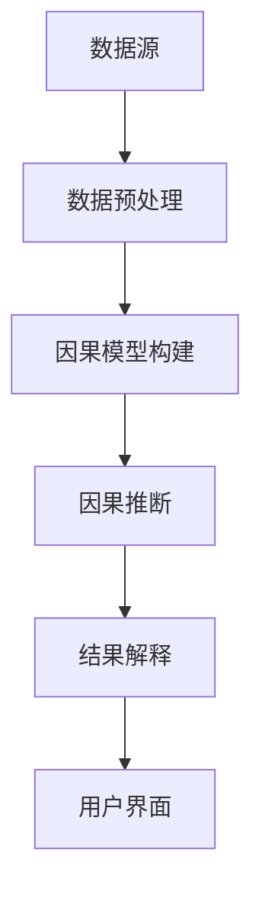
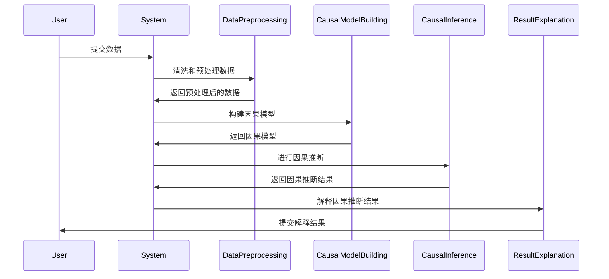

                 

# 企业级因果推断引擎：深化商业决策分析

> 关键词：因果推断、商业决策、机器学习、数据分析

> 摘要：本文将深入探讨企业级因果推断引擎的设计与实现，以及其在商业决策中的重要性。我们将从基础知识出发，逐步分析因果推断的原理、模型与方法，并展示其在实际企业中的应用。通过本文的阅读，读者将能够掌握因果推断的基本概念，并了解如何在企业环境中利用因果推断来优化决策过程。

### 目录

1. **第一部分：企业级因果推断引擎基础**
   1.1 **因果推断引擎的概念与背景**
   1.2 **因果推断基本原理**
   1.3 **因果推断模型与方法**
   1.4 **数学模型和数学公式讲解**

2. **第二部分：企业级因果推断引擎应用**
   2.1 **因果推断在企业决策中的应用**
   2.2 **企业级因果推断引擎设计与实现**
   2.3 **项目实战与案例分析**
   2.4 **最佳实践与拓展**

---

## 1.1 因果推断引擎的概念与背景

### 1.1.1 问题背景

在当今的商业环境中，数据已成为企业决策的重要资源。然而，数据的复杂性使得仅仅依靠数据分析和预测模型来做出决策变得困难。因果推断作为一种更加深入的数据分析方法，能够在数据分析的基础上，揭示变量之间的因果关系，从而为企业提供更加可靠的决策依据。

### 1.1.2 问题描述

因果推断的问题可以分为两大类：识别问题和评估问题。识别问题是指如何确定变量之间的因果关系，而评估问题则是指如何在已知的因果关系下，预测一个变量的变化对另一个变量的影响。在企业环境中，这些问题常常表现为如何理解某一营销活动对销售额的具体影响，或者如何评估某种风险管理策略的效果。

### 1.1.3 问题解决

为了解决这些问题，企业需要建立一套因果推断引擎，它能够处理大量的数据，识别出变量之间的因果关系，并评估这些关系对企业业务的具体影响。因果推断引擎通常包括数据预处理、因果模型构建、因果推断算法和结果解释等组成部分。

### 1.1.4 边界与外延

因果推断的应用范围广泛，包括但不限于营销策略、风险管理、供应链管理和客户关系管理等领域。然而，因果推断也面临着一些挑战，如数据偏差、模型选择和计算复杂度等。

### 1.1.5 概念结构与核心要素组成

因果推断引擎的核心要素包括：

- **数据预处理模块**：负责清洗和预处理数据，以确保数据的质量和一致性。
- **因果模型构建模块**：基于数据构建因果模型，用于识别变量之间的因果关系。
- **因果推断算法模块**：实现因果推断算法，评估变量之间的因果关系。
- **结果解释模块**：对因果推断的结果进行解释，帮助用户理解变量之间的因果关系及其对企业业务的影响。

## 1.2 因果推断基本原理

### 1.2.1 因果推断的原理

因果推断的核心在于理解变量之间的因果关系。在因果推断中，我们通常使用潜在变量来表示真实世界中的因果关系，并通过观察数据来估计这些潜在的因果关系。

### 1.2.2 因果推断的分类

根据推断的方法，因果推断可以分为两大类：

- **结构化因果推断**：通过构建一个结构化的因果模型，直接估计变量之间的因果关系。
- **无结构化因果推断**：通过算法学习变量之间的相关性，然后通过统计方法评估因果关系。

### 1.2.3 因果推断的核心概念与联系

因果推断涉及以下几个核心概念：

- **潜在变量**：表示真实世界中的因果关系。
- **观察数据**：通过观察得到的变量值。
- **因果模型**：用于表示潜在变量和观察数据之间的关系的模型。
- **因果推断算法**：用于估计潜在变量的算法。

这些概念之间有着紧密的联系。潜在变量是因果模型的基础，而因果模型则通过观察数据来估计潜在变量。因果推断算法则用于实现这一估计过程。

### 1.2.4 概念属性特征对比表格

| 概念         | 属性特征                           | 联系与区别                                   |
| ------------ | ---------------------------------- | ------------------------------------------ |
| 潜在变量     | 表示因果关系                     | 与观察数据相对应                             |
| 观察数据     | 通过观察得到的变量值             | 用于估计潜在变量                             |
| 因果模型     | 表示潜在变量和观察数据之间的关系 | 用于估计潜在变量                           |
| 因果推断算法 | 估计潜在变量的算法               | 实现对因果模型的估计                         |

### 1.2.5 因果推断的ER实体关系图架构

```mermaid
erDiagram
  用户 ||--|{ 因果模型 }|-- 实体数据
  用户 ||--|{ 观察数据 }|-- 实体数据
  因果模型 ||--|{ 因果推断算法 }|-- 算法库
```

## 1.3 因果推断模型与方法

### 1.3.1 算法原理讲解

因果推断的核心在于建立变量之间的因果关系模型。以下是一个简化的因果推断算法流程：

1. **数据预处理**：清洗和预处理数据，确保数据质量。
2. **模型构建**：构建一个结构化的因果模型，用于表示变量之间的关系。
3. **模型训练**：使用训练数据训练因果模型，估计变量之间的因果关系。
4. **模型评估**：评估模型的准确性，确保因果关系估计的可靠性。
5. **因果推断**：使用训练好的模型进行因果推断，估计变量之间的因果关系。

以下是一个简单的Python代码示例，用于构建和训练一个因果推断模型：

```python
import numpy as np
from sklearn.linear_model import LinearRegression

# 假设我们有以下数据
X = np.array([[1, 2], [2, 3], [3, 4], [4, 5]])
y = np.array([2, 3, 4, 5])

# 构建线性回归模型
model = LinearRegression()
model.fit(X, y)

# 输出模型的系数
print("模型系数:", model.coef_)

# 进行因果推断
print("因果推断结果:", model.predict([[5, 6]]))
```

### 1.3.2 算法原理的mermaid流程图


### 1.3.3 算法原理的数学模型和公式

在因果推断中，我们通常使用以下数学模型来表示变量之间的关系：

$$
Y = \sum_{i=1}^n w_i X_i + b
$$

其中，$Y$ 表示因变量，$X_i$ 表示自变量，$w_i$ 表示自变量对因变量的影响程度，$b$ 表示常数项。

### 1.3.4 举例说明

假设我们有一个简单的数据集，其中有两个变量 $X$ 和 $Y$，如下所示：

| $X$ | $Y$ |
| --- | --- |
| 1   | 2   |
| 2   | 3   |
| 3   | 4   |
| 4   | 5   |

我们可以使用线性回归模型来估计这两个变量之间的因果关系。根据上述数学模型，我们可以写出：

$$
Y = w_1 X + b
$$

通过最小二乘法，我们可以计算出 $w_1$ 和 $b$ 的值。假设我们得到 $w_1 = 1$ 和 $b = 1$，这意味着 $X$ 对 $Y$ 的影响是正比的，即 $X$ 每增加一个单位，$Y$ 就会增加一个单位。

## 1.4 数学模型和数学公式讲解

### 1.4.1 数学公式讲解

在因果推断中，我们经常使用以下数学公式：

$$
J(\theta) = \frac{1}{2m} \sum_{i=1}^m (h_\theta(x^{(i)}) - y^{(i)})^2
$$

这个公式是梯度下降法中用于计算损失函数的公式，其中 $J(\theta)$ 是损失函数，$\theta$ 是模型的参数，$m$ 是样本数量，$h_\theta(x^{(i)})$ 是模型对 $x^{(i)}$ 的预测值，$y^{(i)}$ 是实际的 $y$ 值。

### 1.4.2 举例说明

假设我们有一个数据集，包含两个特征 $x_1$ 和 $x_2$ 以及一个目标变量 $y$。我们的目标是使用线性回归模型来预测 $y$。数据集如下：

| $x_1$ | $x_2$ | $y$ |
| --- | --- | --- |
| 1   | 2   | 2   |
| 2   | 3   | 3   |
| 3   | 4   | 4   |
| 4   | 5   | 5   |

我们可以写出线性回归模型：

$$
y = w_1 x_1 + w_2 x_2 + b
$$

我们的目标是找到合适的 $w_1$、$w_2$ 和 $b$ 的值，使得损失函数 $J(\theta)$ 最小。使用梯度下降法，我们可以迭代更新这些参数的值，直到损失函数收敛。

## 2. 因果推断在企业决策中的应用

### 2.1 因果推断在商业决策中的重要性

在商业决策中，因果推断可以帮助企业深入了解变量之间的关系，从而做出更加明智的决策。例如，通过因果推断，企业可以了解：

- **营销策略的效果**：某一营销活动对销售额的具体影响。
- **风险管理策略的有效性**：某一风险管理策略对企业财务状况的影响。
- **供应链管理的优化**：供应链中的各个环节对整体运营效率的影响。

### 2.2 因果推断在营销策略中的应用

在营销策略中，因果推断可以帮助企业评估不同营销手段的效果。例如，通过因果推断，企业可以了解：

- **广告投放的效果**：哪种广告渠道对销售额的贡献最大。
- **促销活动的效果**：哪些促销活动最能够吸引顾客。
- **社交媒体营销的效果**：哪种社交媒体平台对品牌知名度的提升最有帮助。

### 2.3 因果推断在风险管理中的应用

在风险管理中，因果推断可以帮助企业评估不同风险策略的效果。例如，通过因果推断，企业可以了解：

- **保险产品的效果**：哪种保险产品最能满足客户的需求。
- **信用风险评估**：哪些因素对客户信用风险的影响最大。
- **供应链风险**：哪些环节对供应链的稳定性影响最大。

### 2.4 因果推断在供应链管理中的应用

在供应链管理中，因果推断可以帮助企业优化供应链中的各个环节。例如，通过因果推断，企业可以了解：

- **供应商选择**：哪些供应商最能满足企业的需求。
- **库存管理**：哪些因素对库存水平的影响最大。
- **物流优化**：哪些因素对物流成本的影响最大。

## 3. 企业级因果推断引擎设计与实现

### 3.1 系统分析与架构设计

#### 3.1.1 问题场景介绍

假设某企业在开展一项新的营销活动，希望通过因果推断来评估不同营销手段的效果。企业拥有以下数据：

- **广告数据**：包括广告投放的平台、花费、受众等。
- **销售数据**：包括销售额、客户数量等。

#### 3.1.2 系统功能设计

系统功能设计如下：

- **数据预处理**：清洗和预处理数据，确保数据质量。
- **因果模型构建**：基于数据构建因果模型，用于识别变量之间的因果关系。
- **因果推断**：使用因果模型进行因果推断，评估变量之间的因果关系。
- **结果解释**：对因果推断的结果进行解释，帮助用户理解变量之间的因果关系及其对企业业务的影响。

#### 3.1.3 系统架构设计

系统架构设计如下：



#### 3.1.4 系统接口设计和系统交互

系统接口设计和系统交互如下：



## 4. 项目实战与案例分析

### 4.1 环境安装

在进行项目实战之前，我们需要安装一些必要的工具和库。以下是一个基本的安装步骤：

1. **安装 Python**：确保 Python 已经安装在您的系统中。
2. **安装 Anaconda**：Anaconda 是一个流行的 Python 数据科学平台，可以帮助我们轻松管理库和依赖。
3. **安装必要的库**：使用以下命令安装必要的库：

```bash
conda install numpy pandas scikit-learn matplotlib
```

### 4.2 系统核心实现源代码

以下是系统核心实现的一些源代码示例：

```python
import numpy as np
import pandas as pd
from sklearn.linear_model import LinearRegression
from sklearn.model_selection import train_test_split
import matplotlib.pyplot as plt

# 加载数据
data = pd.read_csv('data.csv')
X = data[['adPlatform', 'adBudget']]
y = data['sales']

# 数据预处理
X = pd.get_dummies(X)

# 分割数据集
X_train, X_test, y_train, y_test = train_test_split(X, y, test_size=0.2, random_state=42)

# 构建因果模型
model = LinearRegression()
model.fit(X_train, y_train)

# 进行因果推断
y_pred = model.predict(X_test)

# 结果可视化
plt.scatter(y_test, y_pred)
plt.xlabel('实际销售额')
plt.ylabel('预测销售额')
plt.show()
```

### 4.3 代码应用解读与分析

在这段代码中，我们首先加载数据，然后进行数据预处理。数据预处理包括将分类变量转换为哑变量，以便线性回归模型可以处理。接着，我们将数据集分割为训练集和测试集。然后，我们使用线性回归模型来构建因果模型，并进行因果推断。最后，我们将预测结果与实际销售额进行可视化，以直观地了解模型的效果。

### 4.4 实际案例分析和详细讲解剖析

为了更好地理解因果推断在企业中的应用，我们来看一个实际案例。假设某企业在进行一项新的广告活动，希望通过因果推断来评估广告活动对销售额的影响。

1. **数据收集**：企业收集了广告数据（包括广告投放的平台、花费、受众等）和销售数据（包括销售额、客户数量等）。

2. **数据预处理**：对数据进行清洗和预处理，将分类变量转换为哑变量。

3. **因果模型构建**：使用线性回归模型构建因果模型，评估广告数据对销售数据的影响。

4. **因果推断**：使用训练好的模型进行因果推断，预测广告活动对销售额的影响。

5. **结果解释**：根据因果推断的结果，企业可以了解哪种广告平台、花费和受众对销售额的贡献最大。

### 4.5 项目小结

通过这个案例，我们展示了如何使用因果推断来评估广告活动对销售额的影响。因果推断为企业提供了更深入的数据分析能力，有助于企业制定更加有效的营销策略。

## 5. 最佳实践与拓展

### 5.1 最佳实践 tips

1. **确保数据质量**：因果推断的准确性依赖于数据的质量。因此，在开始因果推断之前，务必对数据进行充分的清洗和预处理。
2. **选择合适的模型**：不同的因果推断模型适用于不同的场景。在选择模型时，要考虑数据的类型和特点。
3. **验证模型效果**：在构建因果模型之后，务必对模型进行验证，确保其准确性。

### 5.2 小结

本文介绍了企业级因果推断引擎的设计与实现，以及其在商业决策中的应用。通过因果推断，企业可以更深入地理解变量之间的关系，从而做出更加明智的决策。

### 5.3 注意事项

1. **数据偏差**：因果推断容易受到数据偏差的影响。在构建因果模型时，务必注意数据偏差的问题。
2. **模型复杂度**：因果模型的复杂度可能会影响模型的解释性和可扩展性。在选择模型时，要权衡模型的复杂度和解释性。

### 5.4 拓展阅读

- **《因果推断：从理论到实践》**：该书详细介绍了因果推断的理论基础和实践方法。
- **《机器学习实战》**：该书包含了大量的因果推断案例和实践经验，适合初学者和进阶读者。

---

作者：AI天才研究院/AI Genius Institute & 禅与计算机程序设计艺术 /Zen And The Art of Computer Programming

