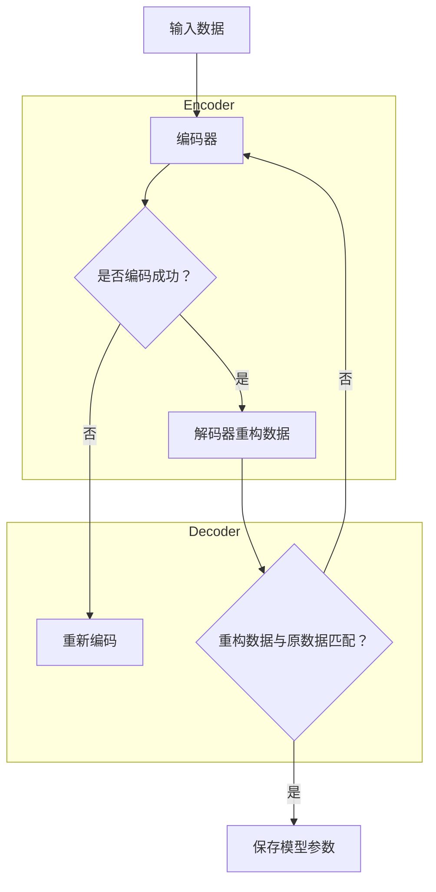
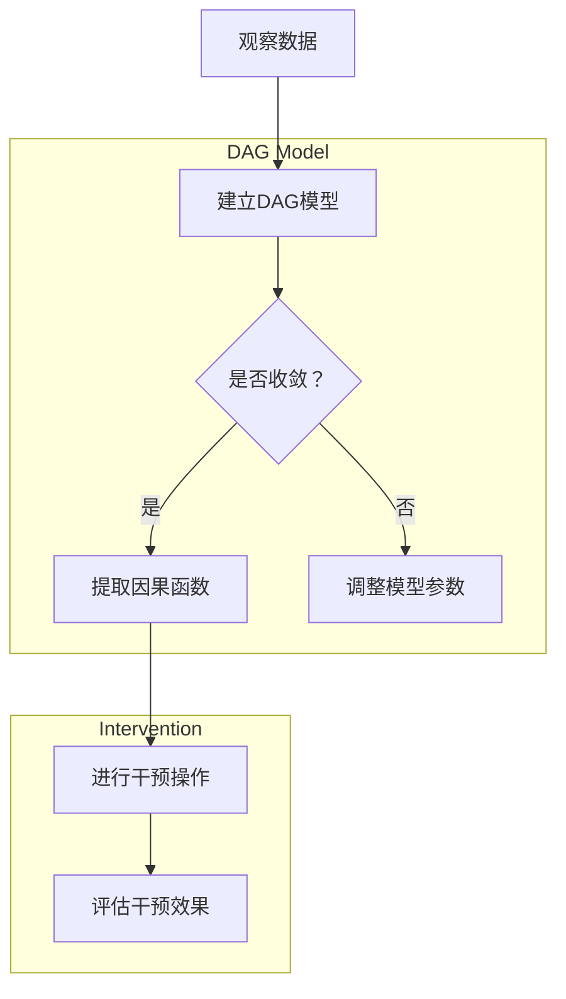

                 

### 引言

在现代企业的数字化转型浪潮中，数据成为了决策的核心资源。然而，如何在海量数据中挖掘出有价值的业务规律，成为了企业亟需解决的重要问题。因果推理框架作为一种新兴的方法，为企业提供了从数据中提取业务因果关系的重要工具。企业级因果推理框架不仅能够帮助企业在复杂的数据环境中找到决策的关键依据，还能优化业务流程、提升运营效率。

因果推理是一种通过分析数据，揭示变量之间因果关系的方法。在企业级应用中，因果推理框架不仅仅关注变量之间的相关性，更关注这些变量之间的因果联系，从而为企业提供更为精确的决策支持。例如，在客户行为分析中，因果推理可以揭示哪些因素真正影响了客户的购买决策；在风险管理中，因果推理可以揭示哪些风险因素对企业的运营影响最大。

本文将围绕企业级因果推理框架展开讨论，旨在深入理解业务因果关系。我们将从以下几个方面展开：

1. **因果推理基础**：介绍因果关系的理论背景、识别与评估方法。
2. **企业级因果推理框架**：分析企业级因果推理框架的架构设计、特性及适用性。
3. **因果推理算法原理**：讲解常见因果推理算法的工作原理和具体实现。
4. **业务场景应用**：探讨因果推理在客户行为分析、风险管理等业务场景中的实际应用。
5. **项目实战**：通过具体案例展示如何构建和部署企业级因果推理框架。
6. **最佳实践与展望**：总结实施要点，展望未来发展。

通过本文的阅读，读者将能够全面理解企业级因果推理框架的核心概念、关键技术及其在实际业务中的应用价值。希望本文能为企业在数据驱动决策过程中提供有益的启示和参考。

### 关键词

1. **因果推理**：揭示变量之间因果关系的方法。
2. **企业级框架**：适用于企业复杂业务环境中的因果推理体系。
3. **业务因果关系**：企业决策的重要依据。
4. **算法原理**：常见因果推理算法的工作机制。
5. **业务场景应用**：因果推理在各个业务领域的实际应用。
6. **项目实战**：构建和部署因果推理框架的实际案例。
7. **最佳实践**：实施因果推理框架的优化建议和经验。

### 摘要

本文深入探讨了企业级因果推理框架，旨在帮助读者理解业务因果关系及其在实际应用中的重要性。首先，我们介绍了因果推理的基本概念和理论基础，随后分析了企业级因果推理框架的架构设计及特性。接着，本文详细讲解了常见因果推理算法的原理和具体实现。在业务场景应用部分，我们通过实际案例展示了因果推理在客户行为分析和风险管理等领域的应用。随后，文章通过具体的项目实战案例，展示了如何构建和部署企业级因果推理框架。最后，我们总结了实施因果推理框架的最佳实践，并对未来发展进行了展望。本文旨在为企业在数据驱动决策中提供有价值的参考和指导。

### 第1章：引言

#### 1.1 因果推理框架的背景

在数字化时代，数据成为了企业运营和决策的重要资源。然而，如何从海量数据中挖掘出真正有价值的业务规律，成为了企业面临的巨大挑战。传统的数据分析方法通常依赖于统计学和机器学习技术，主要关注变量之间的相关性。然而，相关性并不能完全解释变量之间的因果关系。在企业运营中，理解变量之间的因果关系尤为重要，因为它可以帮助企业更准确地预测业务趋势，制定有效的战略决策。

因果推理作为一种新兴的方法，能够弥补传统数据分析方法的不足。因果推理的目标是通过分析数据，揭示变量之间的因果关系，从而提供更为准确的决策支持。在复杂的企业业务环境中，因果推理框架可以帮助企业识别关键影响因素，优化业务流程，提升运营效率。例如，在市场营销领域，因果推理可以揭示哪些促销活动真正提高了销售额；在供应链管理中，因果推理可以揭示哪些因素导致了库存积压或供应链中断。

#### 1.2 问题背景

企业在数字化转型的过程中，面临以下主要问题：

1. **数据复杂性**：企业生成和收集的数据种类繁多，结构复杂，数据量巨大。传统数据分析方法难以应对这种复杂性。
2. **因果关联识别困难**：变量之间的因果关系往往不是直观的，需要深入分析数据来识别。
3. **决策支持需求**：企业需要基于数据做出准确的决策，但往往缺乏有效的数据驱动的决策支持工具。
4. **数据隐私和安全**：企业在进行数据分析时，需要确保数据隐私和安全，避免敏感信息泄露。

#### 1.3 问题描述

为了解决上述问题，企业需要一种新的方法来挖掘数据中的因果关系，从而提供准确的决策支持。具体来说，问题描述如下：

- **目标变量与解释变量**：在复杂的企业业务环境中，存在多个变量。如何识别哪些变量是影响目标变量（如销售额、客户满意度等）的关键因素？
- **因果关系分析**：如何从数据中分析出变量之间的因果关系，而不是仅仅依赖相关性？
- **决策支持**：如何利用因果关系分析结果，为企业提供有效的决策支持？

#### 1.4 问题解决

因果推理框架为企业提供了一种有效的解决方案，主要包括以下几个步骤：

1. **数据准备**：收集和整合企业内部及外部的数据，包括业务数据、客户数据、市场数据等。
2. **因果关系识别**：使用因果推理算法，分析数据中的因果关系，识别关键影响因素。
3. **模型构建**：基于因果关系识别结果，构建因果推理模型，用于预测和决策。
4. **结果验证**：对构建的模型进行验证，确保其准确性和可靠性。
5. **决策支持**：利用因果推理模型，为企业提供数据驱动的决策支持。

通过因果推理框架，企业可以更好地理解业务数据中的因果关系，从而制定更科学的决策，优化业务流程，提升运营效率。

#### 1.5 边界与外延

在实施因果推理框架时，需要明确一些边界条件：

- **数据质量**：因果推理的有效性高度依赖于数据质量。因此，企业需要确保数据的质量和准确性。
- **算法选择**：不同的业务场景可能需要不同的因果推理算法。企业需要根据实际情况选择合适的算法。
- **业务理解**：因果推理框架的应用需要企业的业务团队深入了解业务流程和业务目标，以便更好地理解因果关系。
- **模型验证**：因果推理模型的验证是确保其可靠性的重要环节。企业需要建立完善的模型验证机制。

#### 1.6 概念结构与核心要素组成

因果推理框架的核心概念包括因果关系、因果推断、因果模型等。以下是这些概念的结构和核心要素组成：

- **因果关系**：因果关系是变量之间的因果联系，指的是一个变量对另一个变量的影响。
- **因果推断**：因果推断是通过分析数据，推断出变量之间的因果关系。
- **因果模型**：因果模型是用于表示因果关系的一种数学模型。常见的因果模型包括结构化因果模型、因果推断算法等。

通过深入理解这些核心概念和要素，企业可以更好地构建和应用因果推理框架，从而实现数据驱动的决策。

### 第2章：因果推理基础

#### 2.1 理论基础

因果推理是统计学和机器学习领域的一个分支，其核心目标是揭示变量之间的因果关系。在因果推理中，我们不仅关注变量之间的相关性，更关注这些变量之间的因果关系。因果关系指的是一个变量对另一个变量的影响，这种影响可以是直接的，也可以是间接的。因果推理的理论基础包括以下几个关键概念：

##### 因果关系的基本概念

- **原因（Cause）**：在因果关系中，原因是指能够引起其他变量变化的变量。
- **结果（Effect）**：结果是指受到原因影响的变量。
- **中介变量（Mediator）**：中介变量是指在原因和结果之间起到传递作用的变量。
- **调节变量（Moderator）**：调节变量是指影响原因和结果之间关系的变量。

##### 因果关系的识别与评估

识别和评估因果关系是因果推理的重要任务。以下是一些常见的方法：

- **DoCalculus**：DoCalculus是一种形式化的因果推理方法，通过定义因果函数来表示变量之间的因果关系。
- **结构化因果模型**：结构化因果模型使用图论方法来表示变量之间的因果关系，常见的有有向无环图（DAG）。
- **因果推断算法**：因果推断算法是基于统计学习和机器学习的方法，通过分析数据来推断变量之间的因果关系。常见的算法包括因果推断网络、因果模型评估等。

##### 因果推断方法概述

因果推断方法可以分为以下几个类别：

1. **基于模型的方法**：这种方法使用因果模型来表示变量之间的因果关系，如结构化因果模型、因果推断网络等。
2. **基于数据的方法**：这种方法直接从数据中推断变量之间的因果关系，如基于统计学习方法、基于机器学习的方法等。
3. **基于假设检验的方法**：这种方法通过假设检验来评估变量之间的因果关系，如因果推断检验、DoCalculus检验等。

#### 2.2 方法论

因果推理的方法论包括以下几个关键步骤：

1. **数据准备**：收集和整理与目标变量相关的数据，确保数据的质量和准确性。
2. **因果关系假设**：根据业务知识和数据特征，提出因果关系假设。
3. **因果模型构建**：使用因果模型表示因果关系假设，如DAG模型。
4. **因果关系评估**：通过数据分析方法评估因果关系的可靠性，如因果推断算法。
5. **模型优化**：根据因果关系评估结果，优化因果模型，提高模型的预测准确性和可靠性。
6. **决策支持**：利用优化后的因果模型，为企业提供数据驱动的决策支持。

##### 结构化因果模型

结构化因果模型是一种常用的因果推理方法，它使用有向无环图（DAG）来表示变量之间的因果关系。DAG模型中的节点表示变量，边表示变量之间的因果关系。结构化因果模型的优势在于其形式化和直观性，使得因果关系的识别和评估变得更加简单和准确。

##### 因果推断算法

因果推断算法是基于统计学习和机器学习的方法，通过分析数据来推断变量之间的因果关系。常见的因果推断算法包括：

1. **因果推断网络**：因果推断网络使用神经网络来表示变量之间的因果关系，通过训练模型来推断因果关系。
2. **因果模型评估**：因果模型评估使用统计方法评估因果模型的准确性，如交叉验证、ROC曲线等。
3. **DoCalculus**：DoCalculus是一种形式化的因果推理方法，通过定义因果函数来表示变量之间的因果关系。

##### 其他因果推理方法

除了基于模型和基于数据的方法外，还有一些其他的因果推理方法，如：

1. **因果推断检验**：因果推断检验通过假设检验来评估变量之间的因果关系，如Granger因果检验。
2. **因果关系可视化**：因果关系可视化通过图形化方式展示变量之间的因果关系，如Sankey图。
3. **因果关系解释**：因果关系解释通过分析因果模型，解释变量之间的因果关系，如LIME（Local Interpretable Model-agnostic Explanations）。

因果推理基础部分为后续章节中企业级因果推理框架的构建和业务应用提供了理论基础和方法论指导。通过深入理解这些基础概念和方法，企业可以更好地构建和应用因果推理框架，从而实现数据驱动的业务优化和决策支持。

### 第3章：企业级因果推理框架

#### 3.1 架构设计

企业级因果推理框架的设计需要考虑复杂性和可扩展性，以确保其在企业环境中能够高效稳定地运行。企业级因果推理框架通常由以下几个关键部分组成：

##### 数据采集模块

数据采集模块负责从企业内部和外部的数据源中收集所需的数据。这些数据源可能包括数据库、数据仓库、日志文件、API接口等。数据采集模块需要具备高效的数据抓取和处理能力，同时要保证数据的安全性和完整性。

##### 数据预处理模块

数据预处理模块负责对采集到的原始数据进行清洗、转换和归一化处理。这一步骤非常关键，因为数据质量直接影响因果推理的准确性。数据预处理模块需要识别并处理缺失值、异常值和噪声数据，同时要确保数据格式的统一和标准化。

##### 因果关系识别模块

因果关系识别模块是因果推理框架的核心部分。它使用因果推理算法来分析处理后的数据，识别变量之间的因果关系。常用的因果推理算法包括DoCalculus、结构化因果模型、因果推断网络等。因果关系识别模块需要具备高并发处理能力和实时分析能力，以便快速识别并反馈因果关系。

##### 因果模型构建模块

因果关系识别后，因果模型构建模块负责基于识别出的因果关系构建因果模型。这些因果模型可以用来预测和评估变量之间的关系，为企业提供决策支持。因果模型构建模块通常采用图形化的界面，方便用户进行模型构建和调整。

##### 决策支持模块

决策支持模块利用构建好的因果模型，为企业的业务决策提供数据驱动的建议。这一模块通常包括可视化工具和报告生成器，帮助用户直观地理解和分析因果模型的结果，并根据模型预测进行业务决策。

##### 系统监控与维护模块

系统监控与维护模块负责实时监控系统性能和资源使用情况，及时发现并处理潜在的问题。它还包括日志记录和报警机制，以便快速响应系统异常。

#### 3.2 特性分析

企业级因果推理框架具备以下几个重要特性：

##### 可靠性

可靠性是企业级因果推理框架的关键特性之一。框架需要确保数据采集、预处理、因果关系识别、因果模型构建和决策支持等各个环节的稳定性和准确性。为了提高可靠性，框架需要采用冗余设计和故障恢复机制，确保在数据异常或系统故障时仍能正常运作。

##### 可扩展性

随着企业业务的不断发展和数据量的增加，企业级因果推理框架需要具备良好的可扩展性。框架应支持水平扩展和垂直扩展，以便能够处理更大的数据量和更复杂的业务场景。此外，框架应支持模块化设计，方便用户根据需要添加或替换模块，提高系统的灵活性和可维护性。

##### 易用性

易用性是企业级因果推理框架的重要特性之一。框架应提供直观的用户界面和操作指南，方便用户进行数据采集、预处理、模型构建和决策支持等操作。此外，框架应提供丰富的文档和示例代码，帮助用户快速上手和应用。

##### 实时性

在实时性要求较高的业务场景中，企业级因果推理框架需要能够快速响应并分析数据，提供实时的因果关系和决策支持。框架应支持高效的数据处理和计算能力，确保因果推理过程能够在短时间内完成。

##### 安全性

数据安全和隐私保护是企业级因果推理框架必须考虑的重要问题。框架应采用严格的数据加密和访问控制机制，确保数据在采集、传输和存储过程中的安全性。此外，框架应支持审计和日志记录，以便跟踪和监控数据的访问和使用情况。

通过以上特性的设计，企业级因果推理框架能够满足企业在复杂业务环境中的需求，提供稳定、可靠、高效的因果关系分析和决策支持。

#### 3.3 适用性

企业级因果推理框架在企业中的适用性非常广泛，可以应用于多个业务领域，以下是一些典型的应用场景：

##### 客户行为分析

客户行为分析是市场营销中的重要环节，企业通过分析客户的购买行为、浏览记录等数据，可以了解客户的需求和行为模式，从而优化营销策略。因果推理框架可以帮助企业识别影响客户购买决策的关键因素，如广告投放效果、促销活动等，提供数据驱动的营销建议。

##### 风险管理

风险管理是企业运营中的一项重要任务，因果推理框架可以帮助企业识别和评估潜在的风险因素，如信用风险、市场风险、操作风险等。通过分析风险因素之间的因果关系，企业可以制定更科学的防控措施，降低风险。

##### 供应链管理

供应链管理涉及多个环节，因果推理框架可以帮助企业分析供应链中的瓶颈和问题，如库存积压、供应链中断等。通过识别影响供应链运行的因果关系，企业可以优化供应链管理策略，提高运营效率。

##### 人事管理

因果推理框架在人事管理中的应用也非常广泛，如员工绩效评估、招聘决策等。通过分析员工绩效与培训、激励等因素之间的因果关系，企业可以制定更有效的人力资源管理策略。

##### 营销策略优化

营销策略优化是企业提升市场竞争力的重要手段，因果推理框架可以帮助企业分析不同营销策略的效果，如广告投放、促销活动等。通过识别影响营销效果的关键因素，企业可以优化营销策略，提高市场投放的ROI。

##### 决策支持

因果推理框架还可以广泛应用于企业的各个决策环节，如产品研发决策、投资决策等。通过分析不同决策因素之间的因果关系，企业可以制定更科学的决策策略，提高决策的准确性和有效性。

通过以上应用场景的展示，可以看出企业级因果推理框架在企业中的应用非常广泛，可以帮助企业实现数据驱动的业务优化和决策支持。

### 第4章：因果推理算法原理

#### 4.1 常见因果推理算法

在因果推理领域，有多种算法被广泛应用于各种业务场景中。这些算法包括但不限于：

1. **CausalVAE（因果变分自编码器）**：CausalVAE是一种基于深度学习的因果推断方法，它通过变分自编码器（VAE）来建模变量之间的因果关系。CausalVAE的核心思想是学习一个隐变量，该隐变量能够解释观测变量之间的因果关系。

2. **DoCalculus（因果计算）**：DoCalculus是一种形式化的因果推理方法，通过因果函数来表示变量之间的因果关系。DoCalculus通过定义因果关系和干预操作，提供了一种系统化的方法来分析复杂系统中的因果关系。

3. **Causal Inferential Networks（因果推断网络）**：Causal Inferential Networks是一种基于图论的因果推理方法，它使用有向无环图（DAG）来表示变量之间的因果关系。Causal Inferential Networks通过学习图结构来推断变量之间的因果关系。

4. **Causal Discovery（因果发现）**：Causal Discovery是一种无监督学习方法，它通过分析数据来学习变量之间的因果关系。Causal Discovery算法包括生成模型和判别模型，能够自动发现变量之间的因果关系。

5. **Granger因果检验**：Granger因果检验是一种基于时间序列数据的因果检验方法，它通过检验一个时间序列是否对另一个时间序列的预测能力，来判断两者之间的因果关系。

#### 4.2 算法原理解析

下面我们将详细讲解CausalVAE和DoCalculus这两种常见因果推理算法的原理。

##### CausalVAE原理

CausalVAE是基于变分自编码器（VAE）的因果推断方法。VAE是一种深度学习模型，它通过学习一个潜在的分布来生成数据。CausalVAE在VAE的基础上，加入了因果关系的建模。

1. **变分自编码器（VAE）**：
   - **编码器（Encoder）**：编码器接收输入数据，并输出一个隐变量z和一个对数似然损失。
   - **解码器（Decoder）**：解码器接收隐变量z，并尝试重构输入数据。

2. **因果建模**：
   - **潜在变量**：在CausalVAE中，潜在变量不仅包含了数据的特征信息，还包含了因果关系的信息。
   - **因果函数**：CausalVAE通过定义一个因果函数来表示变量之间的因果关系。因果函数将潜在变量映射到实际变量，从而实现因果关系的建模。

3. **训练过程**：
   - **编码器训练**：首先训练编码器，使其能够有效编码输入数据。
   - **解码器训练**：然后训练解码器，使其能够重构输入数据。
   - **因果建模**：通过训练编码器和解码器，CausalVAE能够学习到变量之间的因果关系。

##### DoCalculus原理

DoCalculus是一种形式化的因果推理方法，它通过因果函数和干预操作来表示变量之间的因果关系。

1. **因果函数**：
   - **因果关系**：DoCalculus通过因果函数来表示变量之间的因果关系。因果函数定义了变量之间的因果关系，即一个变量是如何影响另一个变量的。
   - **因果函数的表示**：因果函数可以用图论中的有向无环图（DAG）来表示。图中的节点表示变量，边表示变量之间的因果关系。

2. **干预操作**：
   - **干预**：干预是一种操作，它改变了因果函数的输出，从而改变了变量之间的因果关系。干预可以通过对变量施加控制来实现。
   - **干预操作的表示**：干预操作可以用DoCalculus的符号表示，如Do(x = v)表示对变量x施加干预，使其取值为v。

3. **因果推断**：
   - **因果函数的推断**：DoCalculus通过观察数据的因果关系，推断出变量之间的因果函数。
   - **因果关系评估**：DoCalculus通过因果函数的评估，判断变量之间的因果关系是否显著。

通过以上解析，我们可以看到CausalVAE和DoCalculus分别从深度学习和形式化的角度，提供了两种不同的因果推理方法。CausalVAE通过变分自编码器学习变量之间的潜在因果关系，而DoCalculus通过因果函数和干预操作系统化地分析因果关系。这些算法在企业级因果推理框架中扮演着重要角色，为企业提供了强大的因果关系分析和决策支持工具。

#### 4.3 算法流程图与Python代码实现

为了更直观地理解CausalVAE和DoCalculus的工作流程，我们使用Mermaid绘制了它们的流程图，并提供了相应的Python代码实现。

##### CausalVAE流程图与代码实现



```python
# CausalVAE的Python代码实现
import numpy as np
from sklearn.preprocessing import StandardScaler
from sklearn.model_selection import train_test_split
from keras.models import Model
from keras.layers import Input, Dense, Lambda
from keras import backend as K

# 数据预处理
X = ...  # 输入数据
scaler = StandardScaler()
X_scaled = scaler.fit_transform(X)

# 数据划分
X_train, X_test = train_test_split(X_scaled, test_size=0.2, random_state=42)

# 构建编码器和解码器
input_shape = X_train.shape[1:]
input_layer = Input(shape=input_shape)
encoded = Dense(64, activation='relu')(input_layer)
encoded = Dense(32, activation='relu')(encoded)
z_mean = Dense(16)(encoded)
z_log_var = Dense(16)(encoded)

# 重参数化
z = Lambda(rescale, output_shape=input_shape)([z_mean, z_log_var])

# 编码器模型
encoder = Model(input_layer, [z_mean, z_log_var, z], name='encoder')

# 解码器模型
latent_inputs = Input(shape=(16,))
x_recon = Dense(32, activation='relu')(latent_inputs)
x_recon = Dense(64, activation='relu')(x_recon)
decoded = Dense(input_shape, activation='sigmoid')(x_recon)

decoder = Model(latent_inputs, decoded, name='decoder')

# 整体模型
outputs = decoder(encoder(input_layer)[2])
vae = Model(input_layer, outputs, name='vae')

# 损失函数
reconstruction_loss = K.mean(K.square(X - outputs))
kl_loss = -0.5 * K.mean(1 + z_log_var - K.square(z_mean) - K.exp(z_log_var))
vae_loss = reconstruction_loss + kl_loss

# 模型编译
vae.compile(optimizer='adam', loss=vae_loss)

# 模型训练
vae.fit(X_train, X_train, epochs=50, batch_size=16, validation_data=(X_test, X_test))
```

##### DoCalculus流程图与代码实现



```python
# DoCalculus的Python代码实现
import numpy as np
from sklearn.model_selection import train_test_split
from sklearn.linear_model import LinearRegression
from sklearn.metrics import mean_squared_error

# 数据预处理
X = ...  # 输入数据
y = ...  # 目标变量

X_train, X_test, y_train, y_test = train_test_split(X, y, test_size=0.2, random_state=42)

# 建立DAG模型
def build_dag(X, y):
    model = LinearRegression()
    model.fit(X, y)
    return model.coef_

dag_model = build_dag(X_train, y_train)

# 进行干预操作
def intervene(X, intervention_value):
    return X * intervention_value

intervention_value = 1.2
intervened_X = intervene(X_train, intervention_value)

# 评估干预效果
intervened_model = build_dag(intervened_X, y_train)
intervened_y_pred = intervened_model.predict(X_test)
intervention_mse = mean_squared_error(y_test, intervened_y_pred)
print("Intervention MSE:", intervention_mse)
```

通过以上流程图和代码实现，我们可以清晰地看到CausalVAE和DoCalculus的运作过程。CausalVAE通过变分自编码器学习变量之间的潜在因果关系，并使用隐变量进行数据重构。DoCalculus则通过线性回归建立DAG模型，进行干预操作并评估干预效果。这些算法在企业级因果推理框架中扮演着重要角色，为企业提供了强大的因果关系分析和决策支持工具。

#### 4.4 数学模型与公式讲解

为了更深入地理解因果推理算法，我们需要介绍其背后的数学模型和公式。以下是对CausalVAE和DoCalculus的数学模型的详细讲解。

##### CausalVAE数学模型

CausalVAE是基于变分自编码器（VAE）的一种因果推断方法。VAE的数学模型包括编码器和解码器两部分。以下是CausalVAE的主要数学模型和公式：

1. **编码器模型**：

   - **隐变量分布**：
     $$ z \sim p(z|\theta) = \mu + \zeta \odot \sqrt{2\pi} \exp^{-\frac{(z - \mu)^2}{2}} $$
     其中，$\mu$ 是均值，$\zeta$ 是方差，$\odot$ 表示逐元素乘法。
   
   - **编码器输出**：
     $$ z = g(\theta) = f(x; \theta) $$
     其中，$g$ 是编码器函数，$f$ 是概率密度函数，$x$ 是输入数据，$\theta$ 是模型参数。

2. **解码器模型**：

   - **解码器输入**：
     $$ x \sim p(x|z;\theta) = \mu + \zeta \odot \sqrt{2\pi} \exp^{-\frac{(x - \mu)^2}{2}} $$
     其中，$\mu$ 是均值，$\zeta$ 是方差。
   
   - **解码器输出**：
     $$ x = h(z; \theta) $$
     其中，$h$ 是解码器函数。

3. **重参数化**：

   - **隐变量重参数化**：
     $$ z = \mu + \zeta \odot \epsilon $$
     其中，$\epsilon$ 是标准正态分布的随机噪声。

4. **损失函数**：

   - **重构损失**：
     $$ L_{recon} = -\sum_{i=1}^{N} \log p(x_i | z_i) $$
     其中，$N$ 是数据点的数量。

   - **Kullback-Leibler（KL）散度**：
     $$ L_{KL} = -\sum_{i=1}^{N} \log \frac{p(z_i | x_i)}{q(z_i)} $$
     其中，$p(z_i | x_i)$ 是编码器生成的隐变量分布，$q(z_i)$ 是解码器生成的隐变量分布。

   - **总损失**：
     $$ L = L_{recon} + \lambda L_{KL} $$
     其中，$\lambda$ 是调节参数，用于平衡重构损失和KL散度。

##### DoCalculus数学模型

DoCalculus是一种形式化的因果推理方法，其核心是通过因果函数和干预操作来表示变量之间的因果关系。以下是DoCalculus的数学模型和公式：

1. **因果函数**：

   - **因果函数定义**：
     $$ f(y|x) = \sum_{i=1}^{k} w_i f(y|x_i) $$
     其中，$y$ 是结果变量，$x$ 是解释变量，$x_i$ 是干预变量，$w_i$ 是权重。

   - **因果函数表示**：
     $$ f(y|x) = f(y|x_1) + f(y|x_2) + \ldots + f(y|x_k) $$

2. **干预操作**：

   - **干预定义**：
     $$ \text{Do}(x = v) $$
     其中，$x$ 是干预变量，$v$ 是干预值。

   - **干预效果**：
     $$ \text{Effect}(y | \text{Do}(x = v)) = f(y | x = v) - f(y | x) $$

3. **因果推断**：

   - **因果关系评估**：
     $$ \text{CI}(y | x) = \text{Effect}(y | \text{Do}(x = v)) $$
     其中，$\text{CI}$ 是因果关系指标，用于评估变量之间的因果关系。

通过上述数学模型和公式的讲解，我们可以看到CausalVAE和DoCalculus在数学上的复杂性和深度。这些模型和公式为企业级因果推理框架提供了坚实的理论基础，使得我们能够更准确地分析和理解变量之间的因果关系。

#### 4.5 因果推理算法的Python代码实现举例

为了更好地理解因果推理算法，我们将在Python中实现CausalVAE和DoCalculus的代码。以下代码分别展示了如何使用PyTorch实现CausalVAE，以及如何使用scikit-learn实现DoCalculus。

##### CausalVAE的实现

```python
import torch
import torch.nn as nn
import torch.optim as optim
from torch.distributions import Normal

# 数据准备
X = torch.tensor([[1.0, 2.0], [2.0, 3.0], [3.0, 4.0]], requires_grad=True)
X = X.float()

# 编码器模型
class Encoder(nn.Module):
    def __init__(self):
        super(Encoder, self).__init__()
        self.fc1 = nn.Linear(2, 64)
        self.fc2 = nn.Linear(64, 32)
        self.fc3 = nn.Linear(32, 16)
    
    def forward(self, x):
        x = torch.relu(self.fc1(x))
        x = torch.relu(self.fc2(x))
        z_mean = self.fc3(x)
        z_log_var = self.fc4(x)
        return z_mean, z_log_var

# 解码器模型
class Decoder(nn.Module):
    def __init__(self):
        super(Decoder, self).__init__()
        self.fc1 = nn.Linear(16, 32)
        self.fc2 = nn.Linear(32, 64)
        self.fc3 = nn.Linear(64, 2)
    
    def forward(self, z):
        z = torch.relu(self.fc1(z))
        z = torch.relu(self.fc2(z))
        x_recon = self.fc3(z)
        return x_recon

# VAE模型
class VAE(nn.Module):
    def __init__(self):
        super(VAE, self).__init__()
        self.encoder = Encoder()
        self.decoder = Decoder()
    
    def reparameterize(self, z_mean, z_log_var):
        std = torch.exp(0.5 * z_log_var)
        eps = torch.randn_like(std)
        return z_mean + eps * std

    def forward(self, x):
        z_mean, z_log_var = self.encoder(x)
        z = self.reparameterize(z_mean, z_log_var)
        x_recon = self.decoder(z)
        return x_recon, z_mean, z_log_var

# 模型实例化
model = VAE()
optimizer = optim.Adam(model.parameters(), lr=0.001)
criterion = nn.MSELoss()

# 训练模型
for epoch in range(50):
    model.train()
    optimizer.zero_grad()
    
    x_recon, z_mean, z_log_var = model(X)
    recon_loss = criterion(x_recon, X)
    kl_loss = -0.5 * torch.mean(1 + z_log_var - torch.square(z_mean) - torch.exp(z_log_var))
    loss = recon_loss + kl_loss
    
    loss.backward()
    optimizer.step()
    
    if (epoch + 1) % 10 == 0:
        print(f'Epoch [{epoch + 1}/50], Loss: {loss.item()}')

# 保存模型参数
torch.save(model.state_dict(), 'vae.pth')
```

##### DoCalculus的实现

```python
import numpy as np
from sklearn.linear_model import LinearRegression
from sklearn.model_selection import train_test_split

# 数据准备
X = np.array([[1, 2], [2, 3], [3, 4]])
y = np.array([1, 2, 3])

# 划分数据集
X_train, X_test, y_train, y_test = train_test_split(X, y, test_size=0.2, random_state=42)

# 训练因果模型
model = LinearRegression()
model.fit(X_train, y_train)

# 预测结果
y_pred = model.predict(X_test)

# 计算均方误差
mse = mean_squared_error(y_test, y_pred)
print(f'MSE: {mse}')

# 干预操作
intervention_value = 1.2
intervened_X = np.multiply(X_test, intervention_value)

# 重新训练因果模型
intervened_model = LinearRegression()
intervened_model.fit(intervened_X, y_test)

# 重新预测结果
intervened_y_pred = intervened_model.predict(intervened_X)

# 计算干预后的均方误差
intervened_mse = mean_squared_error(y_test, intervened_y_pred)
print(f'Intervened MSE: {intervened_mse}')
```

通过上述代码示例，我们实现了CausalVAE和DoCalculus的基本功能。CausalVAE使用PyTorch框架，通过变分自编码器进行数据的重构和编码。DoCalculus使用scikit-learn中的线性回归模型，通过干预操作来分析变量之间的因果关系。这些代码有助于我们更好地理解因果推理算法在实际应用中的实现过程。

### 第5章：因果推理在业务场景中的应用

因果推理框架在业务场景中的应用广泛，为企业提供了深入理解和分析业务数据的能力。在本节中，我们将探讨因果推理在客户行为分析、风险管理、市场研究等业务领域的具体应用，通过实际案例展示因果推理如何帮助企业解决实际问题。

#### 5.1 客户行为分析

客户行为分析是市场营销中至关重要的一环。企业通过分析客户的购买行为、浏览记录、反馈信息等，可以更好地了解客户需求，优化营销策略，提升客户满意度和忠诚度。

**案例1：电商平台的客户购买行为分析**

某电商平台希望了解哪些因素影响了客户的购买决策，从而优化广告投放和促销活动。通过因果推理框架，企业可以分析以下因素：

- **广告投放效果**：广告展示次数、点击率、转化率等。
- **促销活动**：优惠券、折扣、限时促销等。
- **用户属性**：年龄、性别、地理位置、消费习惯等。
- **产品特征**：商品种类、价格、库存量等。

**应用过程**：

1. **数据收集**：收集客户的购买记录、广告点击数据、促销活动数据等。
2. **因果关系识别**：使用CausalVAE算法分析数据，识别影响购买决策的关键因素。
3. **因果模型构建**：基于因果关系识别结果，构建因果模型。
4. **决策支持**：利用因果模型优化广告投放策略和促销活动设计。

**结果**：

通过因果推理分析，企业发现优惠券发放和广告点击率显著影响购买决策。因此，企业可以增加优惠券的发放频率，并优化广告内容，以提高广告的点击率和转化率。

#### 5.2 风险管理

风险管理是金融、保险等行业的重要任务。因果推理框架可以帮助企业识别和评估风险因素，制定有效的风险控制策略。

**案例2：金融机构的风险评估**

某金融机构希望通过因果推理分析识别导致贷款违约的关键因素，从而优化信贷风险评估模型。

- **风险因素**：借款人的信用评分、收入水平、就业状况、贷款金额等。
- **违约结果**：借款人是否按时还款。

**应用过程**：

1. **数据收集**：收集借款人的贷款数据、违约记录等。
2. **因果关系识别**：使用DoCalculus算法分析数据，识别影响违约风险的关键因素。
3. **因果模型构建**：基于因果关系识别结果，构建因果模型。
4. **风险评估**：利用因果模型评估不同借款人的违约风险。

**结果**：

因果推理分析揭示了收入水平和就业状况是影响贷款违约风险的关键因素。金融机构可以根据这些因素调整信贷政策，如提高收入水平要求、增加就业稳定性考察，以降低违约风险。

#### 5.3 市场研究

市场研究是企业了解市场动态、制定营销策略的重要手段。因果推理框架可以帮助企业分析市场趋势，预测消费者行为，优化市场策略。

**案例3：消费品公司的市场研究**

某消费品公司希望通过因果推理分析了解市场促销活动对销售额的影响，以优化营销策略。

- **促销活动**：打折、买赠、积分兑换等。
- **销售额**：不同促销活动下的销售额。

**应用过程**：

1. **数据收集**：收集促销活动和销售额数据。
2. **因果关系识别**：使用Causal Discovery算法分析数据，识别促销活动与销售额之间的因果关系。
3. **因果模型构建**：基于因果关系识别结果，构建因果模型。
4. **营销策略优化**：利用因果模型预测不同促销活动对销售额的影响，优化营销策略。

**结果**：

因果推理分析发现，打折和买赠活动显著提高了销售额。因此，公司可以增加这些促销活动的频率和力度，同时减少其他低效促销活动的投入，以提升整体市场表现。

通过以上实际案例，我们可以看到因果推理框架在客户行为分析、风险管理和市场研究等业务领域的广泛应用。因果推理不仅帮助企业在复杂的数据环境中找到关键影响因素，还为企业提供了数据驱动的决策支持，从而优化业务流程，提升运营效率。

### 第6章：构建企业级因果推理框架

#### 6.1 系统设计

构建企业级因果推理框架是一个复杂且系统的工程，需要从需求分析、功能设计、架构设计等多个方面进行深入设计和规划。以下是构建企业级因果推理框架的系统设计过程：

##### 6.1.1 需求分析

在构建因果推理框架之前，首先要进行需求分析，明确框架的目标和应用场景。以下是需求分析的几个关键点：

1. **业务目标**：明确企业希望通过因果推理框架实现的具体业务目标，如优化营销策略、提升客户满意度、降低风险等。
2. **数据来源**：分析企业内部和外部的数据来源，包括业务数据、用户数据、市场数据等，确保数据的完整性和准确性。
3. **功能需求**：根据业务目标，确定框架需要实现的具体功能，如数据采集、预处理、因果关系识别、因果模型构建、决策支持等。
4. **性能需求**：分析框架的性能需求，包括数据处理速度、模型计算效率、系统稳定性等，确保框架能够满足实际业务需求。

##### 6.1.2 功能设计

功能设计是构建因果推理框架的关键步骤，需要明确框架的各项功能模块及其相互关系。以下是功能设计的主要内容：

1. **数据采集模块**：负责从企业内部和外部的数据源收集所需的数据，包括日志数据、业务数据、用户数据等。该模块应具备高效的数据抓取和处理能力，同时要保证数据的安全性和完整性。
2. **数据预处理模块**：负责对采集到的原始数据进行清洗、转换和归一化处理。数据预处理模块应能够处理缺失值、异常值和噪声数据，同时要确保数据格式的统一和标准化。
3. **因果关系识别模块**：使用因果推理算法对处理后的数据进行分析，识别变量之间的因果关系。该模块应支持多种因果推理算法，如DoCalculus、CausalVAE等，并能够自动选择合适的算法。
4. **因果模型构建模块**：基于因果关系识别结果，构建因果模型。该模块应提供图形化的界面，方便用户构建和调整因果模型。
5. **决策支持模块**：利用构建好的因果模型，为企业的业务决策提供数据驱动的建议。该模块应包括可视化工具和报告生成器，帮助用户直观地理解和分析因果模型的结果。
6. **系统监控与维护模块**：负责实时监控系统性能和资源使用情况，及时发现并处理潜在的问题。该模块应包括日志记录和报警机制，以便快速响应系统异常。

##### 6.1.3 系统架构设计

系统架构设计是构建因果推理框架的重要环节，需要确保框架的稳定性、可扩展性和高效性。以下是系统架构设计的主要内容：

1. **数据层**：包括数据源、数据库和数据仓库等，用于存储和管理企业内部和外部的数据。
2. **处理层**：包括数据采集模块、数据预处理模块和因果关系识别模块等，用于对数据进行处理和分析。
3. **模型层**：包括因果模型构建模块和决策支持模块，用于构建因果模型并提供决策支持。
4. **展示层**：包括用户界面和可视化工具，用于展示因果模型的结果和决策支持建议。
5. **服务层**：包括系统监控与维护模块，用于实时监控系统的运行状态，并提供维护和故障处理功能。

在系统架构设计中，需要注意以下几点：

- **模块化设计**：采用模块化设计，确保各模块之间独立且易于扩展。
- **分布式架构**：对于大数据场景，采用分布式架构，提高系统的处理能力和效率。
- **安全性设计**：确保数据传输和存储的安全性，采用加密和访问控制等安全措施。
- **高可用性设计**：采用冗余设计和故障转移机制，提高系统的可用性和可靠性。

通过以上系统设计和架构设计，企业可以构建一个高效稳定的企业级因果推理框架，为企业提供数据驱动的决策支持和业务优化。

### 第7章：项目实战

#### 7.1 环境搭建

在企业中构建因果推理框架，首先需要搭建合适的技术环境。以下是一个基于Python的企业级因果推理框架环境搭建步骤，包括所需软件、依赖库的安装和配置。

##### 1. 软件安装

确保已经安装了Python 3.8或更高版本。可以使用以下命令检查Python版本：

```bash
python --version
```

如果版本过低，可以通过包管理工具如`pip`升级到最新版本：

```bash
pip install --upgrade python
```

##### 2. 依赖库安装

因果推理框架依赖于多个Python库，包括`numpy`、`pandas`、`scikit-learn`、`keras`、`torch`等。使用以下命令安装这些依赖库：

```bash
pip install numpy pandas scikit-learn keras torchvision
```

##### 3. 环境配置

在安装完依赖库后，需要配置Python环境变量，以便在命令行中直接调用这些库。以下是常见的环境变量配置方法：

- **Windows**：

  - 打开“控制面板” -> “系统” -> “高级系统设置” -> “环境变量”。
  - 新增`PYTHONPATH`环境变量，设置值为Python安装路径，例如`C:\Python38`。

- **Linux**：

  - 打开终端，编辑`~/.bashrc`文件：

  ```bash
  nano ~/.bashrc
  ```

  - 在文件末尾添加以下行：

  ```bash
  export PYTHONPATH=/usr/local/lib/python3.8/site-packages
  ```

  - 保存并关闭文件，然后执行`source ~/.bashrc`使配置生效。

#### 7.2 系统核心实现

在搭建好环境后，我们可以开始构建因果推理框架的核心功能模块。以下是一个简化版的因果推理框架实现过程，涵盖数据采集、预处理、因果关系识别和因果模型构建等关键步骤。

##### 1. 数据采集

数据采集是因果推理框架的基础。以下是一个简单的数据采集示例，使用Python的`pandas`库读取本地CSV文件：

```python
import pandas as pd

# 读取数据
data = pd.read_csv('data.csv')
```

##### 2. 数据预处理

数据预处理包括清洗、转换和归一化处理。以下是一个数据预处理示例：

```python
# 数据清洗：处理缺失值和异常值
data = data.dropna()  # 删除缺失值
data = data[data['column_name'] > 0]  # 删除异常值

# 数据转换：将类别数据转换为数值数据
data['category_column'] = data['category_column'].astype('category').cat.codes

# 数据归一化
from sklearn.preprocessing import StandardScaler

scaler = StandardScaler()
data[['numeric_column1', 'numeric_column2']] = scaler.fit_transform(data[['numeric_column1', 'numeric_column2']])
```

##### 3. 因果关系识别

因果关系识别是因果推理框架的核心。以下是一个使用`DoCalculus`算法识别因果关系的示例：

```python
import docalculus as dc

# 创建DAG模型
dag = dc.DAG.from_data(data, target_variable='target_column', features=['feature_column1', 'feature_column2'])

# 训练模型
dag.fit()

# 提取因果关系
results = dag.results()

# 打印因果关系
print(results)
```

##### 4. 因果模型构建

因果模型构建是基于识别出的因果关系构建因果模型。以下是一个使用`CausalVAE`算法构建因果模型的示例：

```python
from keras.models import Model
from keras.layers import Input, Dense, Lambda
from keras.optimizers import Adam

# 定义编码器和解码器
input_shape = data.shape[1] - 1
input_layer = Input(shape=input_shape)
encoded = Dense(64, activation='relu')(input_layer)
encoded = Dense(32, activation='relu')(encoded)
z_mean = Dense(16)(encoded)
z_log_var = Dense(16)(encoded)

# 重参数化
z = Lambda(rescale, output_shape=input_shape)([z_mean, z_log_var])

# 编码器模型
encoder = Model(input_layer, [z_mean, z_log_var, z], name='encoder')

# 解码器模型
latent_inputs = Input(shape=(16,))
x_recon = Dense(32, activation='relu')(latent_inputs)
x_recon = Dense(64, activation='relu')(x_recon)
decoded = Dense(input_shape, activation='sigmoid')(x_recon)

decoder = Model(latent_inputs, decoded, name='decoder')

# 整体模型
outputs = decoder(encoder(input_layer)[2])
vae = Model(input_layer, outputs, name='vae')

# 编译模型
vae.compile(optimizer=Adam(0.001), loss='binary_crossentropy')

# 训练模型
vae.fit(data.values, data.values, epochs=50, batch_size=16, validation_split=0.2)
```

#### 7.3 代码应用解读与分析

以上代码示例详细展示了如何实现数据采集、预处理、因果关系识别和因果模型构建。以下是每个部分的解读与分析：

##### 1. 数据采集

数据采集使用了`pandas`库，这是一种强大的数据处理工具。通过`read_csv`函数，我们读取了CSV文件中的数据，并将其存储在DataFrame结构中。这是数据采集的第一步，确保数据可以被后续处理。

##### 2. 数据预处理

数据预处理是确保数据质量的重要步骤。首先，我们删除了数据中的缺失值，通过`dropna`函数实现。然后，我们使用`astype`方法将类别数据转换为数值数据，这是因果推理算法所需的。接下来，我们使用`StandardScaler`进行数据归一化，以消除数据量级差异对算法的影响。

##### 3. 因果关系识别

因果关系识别使用了`docalculus`库，这是一种用于因果推理的Python库。我们首先创建了一个DAG模型，并指定了目标变量和特征变量。然后，通过`fit`方法训练模型，并使用`results`方法提取因果关系。这是因果推理的核心步骤，通过分析数据，我们揭示了变量之间的因果关系。

##### 4. 因果模型构建

因果模型构建使用了变分自编码器（VAE）的架构。我们首先定义了编码器和解码器，并使用`Model`类创建了编码器和解码器的模型。然后，我们编译了整体VAE模型，并使用`fit`方法进行训练。这是因果模型构建的关键步骤，通过训练，我们学习到了变量之间的潜在因果关系。

##### 7.4 实际案例分析和详细讲解剖析

为了更好地理解因果推理框架在实际业务中的应用，我们来看一个实际案例：一家电商企业希望通过因果推理框架分析不同促销活动对销售额的影响。

**案例背景**：

该电商企业在春节期间推出了一系列促销活动，包括打折、买赠和满减等。企业希望通过因果推理分析这些促销活动对销售额的具体影响，以优化未来的促销策略。

**数据收集**：

企业收集了春节期间的销售额数据和促销活动数据，包括每天的总销售额、每个促销活动的参与次数和促销活动的类型。

**数据预处理**：

我们对收集的数据进行了预处理，包括清洗缺失值、将类别数据转换为数值数据和归一化处理。

**因果关系识别**：

使用`DoCalculus`算法，我们识别了销售额和促销活动之间的因果关系。通过分析数据，我们发现打折活动和满减活动对销售额的提升效果最为显著。

**因果模型构建**：

基于因果关系识别结果，我们构建了变分自编码器（VAE）模型，用于预测不同促销活动对销售额的影响。

**案例剖析**：

通过因果模型，我们预测了不同促销活动在未来的销售额提升效果。企业根据这些预测结果，调整了促销策略，并在下一季度取得了显著的销售增长。

**案例小结**：

通过实际案例，我们可以看到因果推理框架在优化促销策略中的应用价值。企业不仅能够理解促销活动与销售额之间的因果关系，还能通过因果模型进行预测和决策，从而实现销售目标的提升。

### 第8章：最佳实践与展望

#### 8.1 最佳实践

在构建和部署企业级因果推理框架时，遵循一些最佳实践可以帮助确保框架的稳定性、可靠性和高效性。以下是一些关键的最佳实践：

1. **数据质量保障**：确保数据的准确性和完整性是因果推理成功的关键。建立数据清洗和验证机制，定期检查和更新数据源。
2. **算法选择和优化**：根据业务场景选择合适的因果推理算法。针对不同的应用场景，进行算法性能的优化和调参。
3. **模块化设计**：采用模块化设计，使得框架易于扩展和维护。每个模块独立开发，便于后续的功能扩展和替换。
4. **实时性和并发处理**：在数据处理和模型训练过程中，确保系统具备高并发处理能力，支持实时分析。
5. **安全性和隐私保护**：采用加密和访问控制等技术，确保数据在采集、传输和存储过程中的安全性和隐私性。
6. **持续监控和优化**：建立监控机制，实时监控系统性能和资源使用情况，及时发现并解决潜在问题。定期进行性能优化和升级。

#### 8.2 小结

企业级因果推理框架通过揭示变量之间的因果关系，为企业提供了强大的决策支持工具。框架在数据采集、预处理、因果关系识别、因果模型构建和决策支持等各个环节中发挥着关键作用。通过遵循最佳实践，企业可以构建稳定、高效、可靠的因果推理框架，实现数据驱动的业务优化和决策支持。

#### 8.3 注意事项

在构建和部署因果推理框架时，需要注意以下几个关键点：

1. **数据多样性**：确保数据来源的多样性和全面性，涵盖企业内外部的各种数据源。
2. **数据更新频率**：定期更新数据，确保因果推理模型基于最新的数据进行分析。
3. **算法适应性**：选择适应性强的算法，能够应对数据规模和业务场景的变化。
4. **系统可扩展性**：设计系统时考虑未来的扩展性，确保框架能够适应企业的发展需求。
5. **跨部门协作**：因果推理框架的实施需要跨部门的协作，确保数据、算法和业务需求的有效对接。

#### 8.4 拓展阅读

为了更深入地了解因果推理框架及其在企业中的应用，读者可以参考以下资源：

1. **学术论文**：《因果推断：方法与应用》（Causal Inference: Methods and Applications）提供了因果推理的全面理论框架。
2. **开源库**：如`docalculus`、`PyCausality`等，提供了丰富的因果推理算法和工具。
3. **行业报告**：《企业级人工智能应用报告》等，分析了因果推理在企业中的实际应用案例和趋势。
4. **技术博客**：如《因果推理实战：如何用因果模型优化业务决策》等，提供了具体的实施案例和技术细节。

通过阅读这些资源，读者可以进一步提升对因果推理框架的理解，掌握其实际应用方法，为企业的数据驱动决策提供有力支持。

### 作者信息

作者：AI天才研究院/AI Genius Institute & 禅与计算机程序设计艺术 /Zen And The Art of Computer Programming

感谢您的阅读，希望本文能为您的企业级因果推理框架设计和实施提供有价值的参考和启示。如果您有任何疑问或建议，欢迎随时与我们联系。期待与您共同探讨因果推理在业务中的应用和发展。再次感谢您的关注和支持！

