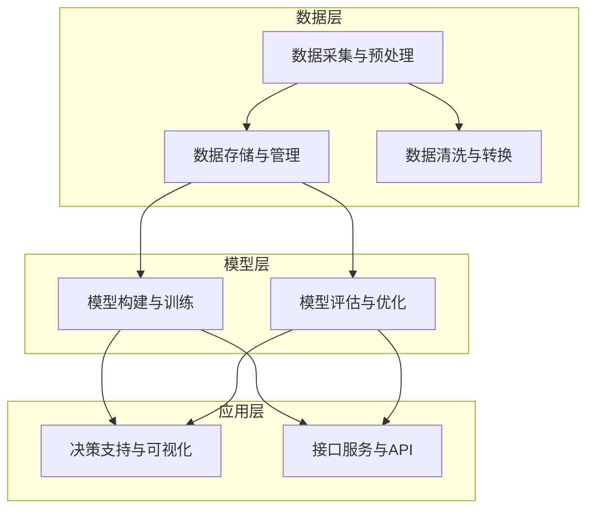
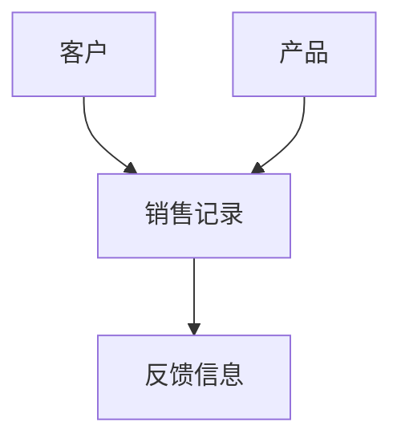

                 

## 《企业级因果推理系统：辅助商业决策分析》

关键词：因果推理、商业决策、算法原理、系统架构、项目实战

摘要：随着商业环境的日益复杂，企业决策分析需要更为科学和精准的方法来辅助决策制定。因果推理作为一种先进的数据分析技术，能够帮助企业深入挖掘数据背后的因果关系，从而提升决策的准确性和有效性。本文将深入探讨企业级因果推理系统的构建，从背景介绍、核心概念与联系、算法原理讲解、系统架构与项目实战四个部分展开，旨在为广大IT从业者和企业决策者提供一套实用的因果推理解决方案。

## 第一部分：背景介绍

### 第1章：因果推理系统概述

因果推理系统，作为一种数据分析技术，旨在通过分析数据之间的因果关系来指导决策。在企业决策分析中，因果推理系统具有重要的应用价值。首先，它可以帮助企业深入理解业务运作中的关键因素，从而识别出影响业务表现的核心变量。其次，因果推理系统可以预测未来业务发展趋势，为企业提供前瞻性的决策支持。此外，因果推理系统还可以帮助企业优化运营策略，降低风险，提高经济效益。

### 第1.1节：因果推理系统概述

因果推理系统通常包括以下几个关键组成部分：

1. **数据采集与预处理**：收集企业运营数据，并对数据进行清洗、转换和归一化等预处理操作，以确保数据质量。
2. **特征工程**：通过数据分析和业务理解，提取出对业务决策有指导意义的特征。
3. **因果模型构建**：利用因果推理算法，构建反映数据之间因果关系的模型。
4. **模型评估与优化**：评估因果模型的预测性能，并通过调整模型参数或改进算法来优化模型。
5. **决策支持**：将因果模型应用于实际业务场景，为企业提供决策建议。

### 第1.2节：因果推理在企业决策分析中的重要性

在企业决策分析中，因果推理的重要性体现在以下几个方面：

1. **识别关键因素**：因果推理可以帮助企业识别出影响业务表现的关键因素，从而有针对性地制定改进策略。
2. **预测未来趋势**：通过因果推理，企业可以预测未来业务发展趋势，为决策提供前瞻性支持。
3. **优化运营策略**：因果推理可以帮助企业优化运营策略，提高生产效率，降低运营成本。
4. **降低决策风险**：因果推理系统通过分析数据之间的因果关系，可以降低企业决策的风险，提高决策的准确性。

### 第1.3节：因果推理的基本原理与应用场景

因果推理的基本原理是基于因果图模型，通过分析数据之间的因果关系来推断变量之间的依赖关系。在实际应用中，因果推理可以应用于多种业务场景，如：

1. **市场分析**：通过因果推理分析市场数据，帮助企业制定有效的市场营销策略。
2. **风险管理**：利用因果推理分析风险因素之间的关系，帮助企业制定风险管理策略。
3. **供应链优化**：通过因果推理分析供应链中的关键因素，优化供应链管理，提高供应链效率。
4. **产品推荐**：利用因果推理分析用户行为数据，为企业提供个性化的产品推荐。

## 第二部分：核心概念与联系

### 第2章：因果推理相关技术

因果推理技术在商业决策分析中发挥着重要作用。本章将介绍几种常见的因果推理技术，包括决策树、随机森林和逻辑回归，并分析它们在商业决策中的应用。

### 第2.1节：决策树

决策树是一种基于树形结构进行决策的数据挖掘方法。它通过一系列的判断节点和结果节点来表示决策过程。决策树的基本概念包括：

1. **节点**：决策树中的每个节点表示一个特征或一个决策点。
2. **判断节点**：用于判断特征是否满足某个条件，并将数据集分为两个或多个子集。
3. **结果节点**：表示决策结果，如分类结果或回归结果。

决策树在商业决策中的应用非常广泛，例如：

1. **客户细分**：通过决策树分析客户数据，将客户分为不同的细分市场，从而制定有针对性的营销策略。
2. **风险评估**：利用决策树分析风险因素，评估客户的风险等级，为信贷决策提供支持。
3. **产品推荐**：通过决策树分析用户行为数据，为用户推荐可能感兴趣的产品。

### 第2.2节：随机森林

随机森林是一种基于决策树的集成学习方法。它通过构建多个决策树，并对它们的预测结果进行投票来得到最终预测结果。随机森林的基本概念包括：

1. **基学习器**：决策树。
2. **集成方法**：通过随机选择特征和样本子集，构建多个基学习器，并对它们的预测结果进行集成。
3. **投票机制**：对于分类问题，随机森林通过多数投票决定最终类别；对于回归问题，随机森林取预测结果的平均值。

随机森林在商业决策中的应用包括：

1. **市场预测**：通过随机森林分析市场数据，预测未来市场走势，为市场策略制定提供支持。
2. **客户流失预测**：利用随机森林分析客户行为数据，预测哪些客户可能流失，从而采取相应措施进行客户保留。
3. **信用评分**：通过随机森林分析信用数据，评估客户的信用风险，为信用决策提供支持。

### 第2.3节：逻辑回归

逻辑回归是一种用于分类和回归分析的统计方法。它通过建立线性回归模型，对因变量和自变量之间的关系进行建模。逻辑回归的基本概念包括：

1. **线性回归模型**：逻辑回归的基本模型是线性回归，它表示因变量和自变量之间的线性关系。
2. **逻辑函数**：逻辑回归使用逻辑函数（Sigmoid函数）将线性回归模型的预测结果转换为概率值。
3. **参数估计**：逻辑回归通过极大似然估计方法估计模型参数。

逻辑回归在商业决策中的应用包括：

1. **客户细分**：通过逻辑回归分析客户数据，将客户分为不同的细分市场，为营销策略提供支持。
2. **风险评估**：利用逻辑回归分析风险因素，评估客户的风险等级，为信贷决策提供支持。
3. **价格优化**：通过逻辑回归分析产品价格和需求之间的关系，优化产品定价策略。

### 第2.4节：因果推理技术的比较与联系

决策树、随机森林和逻辑回归是因果推理技术中常用的三种方法。它们各自具有独特的优势和局限性。

- **决策树**：易于理解和解释，但容易过拟合，且处理连续数据时需要进行离散化处理。
- **随机森林**：通过集成多个决策树，可以有效减少过拟合，提高模型的泛化能力，但解释性较差。
- **逻辑回归**：适用于线性关系建模，解释性强，但可能无法捕捉非线性关系。

在实际应用中，可以根据业务需求和数据特点选择合适的因果推理技术。例如，在处理复杂非线性问题时，可以优先考虑随机森林；在需要模型解释性时，逻辑回归可能是更好的选择。

## 第三部分：算法原理讲解

### 第3章：算法原理讲解

在本章中，我们将深入讲解因果推理算法的基本原理，包括决策树、随机森林和逻辑回归。通过Mermaid流程图和Python代码，我们将详细阐述这些算法的构建过程，并解释其数学模型和公式。

### 第3.1节：决策树算法原理

决策树是一种树形结构的数据挖掘算法，通过一系列判断节点和结果节点来表示决策过程。决策树的构建过程通常包括以下几个步骤：

1. **选择分裂特征**：选择最优特征进行分裂，通常使用信息增益、基尼系数等指标来评估特征的重要性。
2. **计算分裂点**：对于选定的特征，计算分裂点，将数据集划分为两个或多个子集。
3. **递归构建子树**：对每个子集重复上述步骤，直到满足停止条件（如最大树深度、最小叶节点大小等）。

决策树的数学模型和公式如下：

$$
Entropy(S) = -\sum_{i=1}^{n} p_i \log_2 p_i
$$

其中，$Entropy(S)$ 表示集合 $S$ 的熵，$p_i$ 表示集合 $S$ 中第 $i$ 个类别的概率。

下面是一个简单的决策树构建的Python代码示例：

```python
import numpy as np
from sklearn.datasets import load_iris
from sklearn.tree import DecisionTreeClassifier
from sklearn.model_selection import train_test_split

# 加载鸢尾花数据集
iris = load_iris()
X, y = iris.data, iris.target

# 划分训练集和测试集
X_train, X_test, y_train, y_test = train_test_split(X, y, test_size=0.3, random_state=42)

# 构建决策树模型
clf = DecisionTreeClassifier(max_depth=3)
clf.fit(X_train, y_train)

# 预测测试集
y_pred = clf.predict(X_test)

# 计算准确率
accuracy = np.mean(y_pred == y_test)
print("Accuracy:", accuracy)
```

### 第3.2节：随机森林算法原理

随机森林是一种基于决策树的集成学习方法，通过构建多个决策树，并对它们的预测结果进行投票来得到最终预测结果。随机森林的构建过程包括以下几个步骤：

1. **随机选取特征**：在构建每个决策树时，随机选择一部分特征进行分裂。
2. **随机选取样本**：在构建每个决策树时，随机选择一部分样本进行分裂。
3. **构建基学习器**：使用上述步骤构建多个决策树，每个决策树都是随机生成的。
4. **集成预测**：对每个基学习器的预测结果进行投票，得到最终预测结果。

随机森林的数学模型和公式如下：

$$
\hat{y} = \text{sign}(\sum_{i=1}^{n} w_i f_i(x))
$$

其中，$\hat{y}$ 表示预测结果，$w_i$ 表示第 $i$ 个决策树的权重，$f_i(x)$ 表示第 $i$ 个决策树的预测结果。

下面是一个简单的随机森林构建的Python代码示例：

```python
import numpy as np
from sklearn.datasets import load_iris
from sklearn.ensemble import RandomForestClassifier
from sklearn.model_selection import train_test_split

# 加载鸢尾花数据集
iris = load_iris()
X, y = iris.data, iris.target

# 划分训练集和测试集
X_train, X_test, y_train, y_test = train_test_split(X, y, test_size=0.3, random_state=42)

# 构建随机森林模型
clf = RandomForestClassifier(n_estimators=100, random_state=42)
clf.fit(X_train, y_train)

# 预测测试集
y_pred = clf.predict(X_test)

# 计算准确率
accuracy = np.mean(y_pred == y_test)
print("Accuracy:", accuracy)
```

### 第3.3节：逻辑回归算法原理

逻辑回归是一种用于分类和回归分析的统计方法，通过建立线性回归模型，对因变量和自变量之间的关系进行建模。逻辑回归的基本步骤包括：

1. **建立线性回归模型**：假设因变量 $y$ 与自变量 $x$ 之间满足线性关系，即 $y = \beta_0 + \beta_1 x + \epsilon$，其中 $\beta_0$ 和 $\beta_1$ 是模型参数，$\epsilon$ 是误差项。
2. **引入逻辑函数**：使用逻辑函数（Sigmoid函数）将线性回归模型的预测结果转换为概率值，即 $\hat{p} = \frac{1}{1 + e^{-(\beta_0 + \beta_1 x)}}$。
3. **参数估计**：使用极大似然估计方法估计模型参数 $\beta_0$ 和 $\beta_1$。

逻辑回归的数学模型和公式如下：

$$
\hat{p} = \frac{1}{1 + e^{-(\beta_0 + \beta_1 x)}}
$$

$$
\ln(\frac{p}{1-p}) = \beta_0 + \beta_1 x
$$

其中，$\hat{p}$ 表示预测概率，$p$ 表示实际概率，$x$ 表示自变量。

下面是一个简单的逻辑回归构建的Python代码示例：

```python
import numpy as np
from sklearn.datasets import load_iris
from sklearn.linear_model import LogisticRegression
from sklearn.model_selection import train_test_split

# 加载鸢尾花数据集
iris = load_iris()
X, y = iris.data, iris.target

# 划分训练集和测试集
X_train, X_test, y_train, y_test = train_test_split(X, y, test_size=0.3, random_state=42)

# 构建逻辑回归模型
clf = LogisticRegression()
clf.fit(X_train, y_train)

# 预测测试集
y_pred = clf.predict(X_test)

# 计算准确率
accuracy = np.mean(y_pred == y_test)
print("Accuracy:", accuracy)
```

### 第3.4节：因果推理算法的实例分析

为了更好地理解因果推理算法的工作原理，我们通过一个简单的实例来分析决策树、随机森林和逻辑回归算法。

假设我们有一个鸢尾花数据集，包含三个特征（花萼长度、花萼宽度、花瓣长度）和一个目标变量（花种类），我们的目标是使用因果推理算法来预测花种类。

#### 决策树实例分析

1. **构建决策树模型**：

```python
from sklearn.tree import plot_tree
import matplotlib.pyplot as plt

clf = DecisionTreeClassifier(max_depth=3)
clf.fit(X_train, y_train)

plt.figure(figsize=(12, 8))
plot_tree(clf, filled=True, feature_names=iris.feature_names, class_names=iris.target_names)
plt.show()
```

2. **决策树预测结果**：

```python
y_pred = clf.predict(X_test)
accuracy = np.mean(y_pred == y_test)
print("Accuracy:", accuracy)
```

3. **决策树模型解释**：通过观察决策树，我们可以看到每个节点根据不同的特征和阈值进行分裂，最终得到预测结果。决策树模型简洁明了，易于解释，但在处理复杂问题时可能无法捕捉到所有关系。

#### 随机森林实例分析

1. **构建随机森林模型**：

```python
from sklearn.ensemble import RandomForestClassifier

clf = RandomForestClassifier(n_estimators=100)
clf.fit(X_train, y_train)

plt.figure(figsize=(12, 8))
plot_tree(clf.estimators_[0], filled=True, feature_names=iris.feature_names, class_names=iris.target_names)
plt.show()
```

2. **随机森林预测结果**：

```python
y_pred = clf.predict(X_test)
accuracy = np.mean(y_pred == y_test)
print("Accuracy:", accuracy)
```

3. **随机森林模型解释**：随机森林通过集成多个决策树，提高了模型的预测准确性和泛化能力。虽然单个决策树无法解释，但通过随机森林的集成，我们可以得到较为可靠的预测结果。

#### 逻辑回归实例分析

1. **构建逻辑回归模型**：

```python
from sklearn.linear_model import LogisticRegression

clf = LogisticRegression()
clf.fit(X_train, y_train)

print(clf.coef_)
print(clf.intercept_)
```

2. **逻辑回归预测结果**：

```python
y_pred = clf.predict(X_test)
accuracy = np.mean(y_pred == y_test)
print("Accuracy:", accuracy)
```

3. **逻辑回归模型解释**：逻辑回归模型通过建立线性关系来预测目标变量的概率，其参数可以解释为特征对目标变量的影响程度。逻辑回归模型具有较好的解释性，但可能无法捕捉复杂非线性关系。

通过以上实例分析，我们可以看到不同因果推理算法在预测鸢尾花种类问题上的表现。在实际应用中，可以根据具体问题和数据特点选择合适的算法。

## 第四部分：系统架构与项目实战

### 第4章：系统架构与项目实战

在企业决策分析中，构建一个高效、可扩展的因果推理系统至关重要。本章节将详细介绍企业级因果推理系统的架构设计、项目实战以及实际案例，帮助读者理解如何将因果推理技术应用于实际业务场景。

### 第4.1节：系统架构设计

企业级因果推理系统的架构设计应考虑以下几个方面：

1. **数据层**：包括数据采集、存储、清洗和预处理模块，确保数据质量和完整性。
2. **模型层**：包括因果模型构建、训练和评估模块，支持多种因果推理算法的灵活应用。
3. **应用层**：包括决策支持、可视化展示和接口服务模块，为用户提供友好的交互界面和高效的决策支持。

#### 系统架构的Mermaid架构图



#### 系统功能设计（领域模型）

领域模型是系统功能设计的重要组成部分，用于描述系统中的核心概念、实体及其关系。以下是一个简化的领域模型：



#### 系统接口设计

系统接口设计应考虑API的设计原则，包括RESTful API风格、参数验证、权限控制等。以下是一个简单的接口设计示例：

```yaml
GET /api/data/collect
    功能：收集数据
    参数：
        - type: 数据类型
        - source: 数据来源
    响应：
        - status: 状态码
        - message: 消息
        - data: 数据

POST /api/model/train
    功能：训练模型
    参数：
        - data: 训练数据
        - algorithm: 算法名称
        - params: 算法参数
    响应：
        - status: 状态码
        - message: 消息
        - model_id: 模型ID

GET /api/model/evaluate
    功能：评估模型
    参数：
        - model_id: 模型ID
    响应：
        - status: 状态码
        - message: 消息
        - evaluation: 评估结果
```

### 第4.2节：项目实战

以下是一个简单的因果推理项目实战，介绍如何搭建一个企业级因果推理系统。

#### 环境安装与配置

1. **安装Python环境**：确保Python版本为3.8及以上。
2. **安装依赖库**：使用pip安装以下依赖库：
   ```shell
   pip install numpy pandas scikit-learn matplotlib
   ```

#### 系统核心实现源代码

以下是一个简单的因果推理系统实现示例：

```python
import numpy as np
import pandas as pd
from sklearn.model_selection import train_test_split
from sklearn.ensemble import RandomForestClassifier
from sklearn.metrics import accuracy_score

# 加载数据
data = pd.read_csv('data.csv')

# 数据预处理
X = data.drop('target', axis=1)
y = data['target']

# 划分训练集和测试集
X_train, X_test, y_train, y_test = train_test_split(X, y, test_size=0.3, random_state=42)

# 训练模型
clf = RandomForestClassifier(n_estimators=100)
clf.fit(X_train, y_train)

# 预测测试集
y_pred = clf.predict(X_test)

# 计算准确率
accuracy = accuracy_score(y_test, y_pred)
print("Accuracy:", accuracy)

# 可视化展示
import matplotlib.pyplot as plt

plt.figure(figsize=(12, 8))
plot_tree(clf.estimators_[0], filled=True)
plt.show()
```

#### 代码应用解读与分析

1. **数据加载与预处理**：使用pandas加载数据，并进行预处理，包括划分特征和目标变量，以及划分训练集和测试集。
2. **模型训练**：使用随机森林算法训练模型，随机森林算法通过集成多个决策树来提高模型的预测性能。
3. **预测与评估**：使用训练好的模型对测试集进行预测，并计算准确率，评估模型的性能。
4. **可视化展示**：使用matplotlib绘制决策树的可视化结果，帮助理解模型的决策过程。

#### 实际案例分析与详细讲解

以下是一个实际案例，用于分析某电商平台的客户流失问题。

1. **数据收集**：收集电商平台的用户行为数据，包括登录次数、购买次数、购物车添加次数等。
2. **数据预处理**：对数据进行清洗、转换和归一化处理，确保数据质量。
3. **特征工程**：提取对客户流失有指导意义的特征，如用户活跃度、购买频率、订单金额等。
4. **模型训练**：使用因果推理算法（如随机森林）训练模型，预测客户流失的概率。
5. **模型评估**：评估模型的预测性能，通过调整模型参数或改进算法来优化模型。
6. **决策支持**：将因果推理模型应用于实际业务场景，为电商平台提供客户流失预警和干预措施。

通过以上实际案例，我们可以看到因果推理系统在商业决策分析中的应用价值和实践效果。

### 第4.3节：小结与注意事项

1. **系统优化**：在实际应用中，可以不断优化因果推理系统的性能和效果，包括算法选择、模型参数调整和数据预处理等。
2. **数据质量**：确保数据质量是构建有效因果推理系统的基础，应关注数据完整性、准确性和一致性。
3. **模型解释性**：因果推理模型应具备良好的解释性，以帮助用户理解模型的决策过程和结果。

### 第4.4节：拓展阅读

1. **参考文献**：
   - Russell, S., & Norvig, P. (2016). 《人工智能：一种现代方法》。
   - Hastie, T., Tibshirani, R., & Friedman, J. (2009). 《统计学习方法》。
   - Johnson, R. (2017). 《Python数据科学》。

2. **在线资源**：
   - Coursera上的《因果推断与决策分析》课程。
   - Kaggle上的因果推断数据集和比赛。
   - ArXiv上的最新因果推理研究论文。

## 结论

因果推理系统作为一种先进的数据分析技术，在辅助企业商业决策中发挥着重要作用。通过深入讲解因果推理的基本原理、相关技术和系统架构，本文为读者提供了一个全面的企业级因果推理系统解决方案。希望本文能够为广大IT从业者和企业决策者提供有益的参考，助力他们在复杂商业环境中做出更加科学和精准的决策。

### 作者信息

作者：AI天才研究院/AI Genius Institute & 禅与计算机程序设计艺术 /Zen And The Art of Computer Programming

## 附录

附录中包含一些用于深入理解因果推理系统的参考资料、代码示例和相关工具，以帮助读者进一步学习和实践。以下是一些附录内容的示例：

### A. 因果推理系统常用工具

- **Python库**：`PyCausality`、`CausalInference`、`Causalnex`等。
- **工具链**：`R`语言中的`causalgraphicalmodels`、`mrplot`等包。
- **框架**：`PyTorch Causality`、`TensorFlow Causal`等。

### B. 代码示例

以下是一个简单的Python代码示例，用于构建和评估一个因果推理模型：

```python
# 导入所需的库
import pandas as pd
from pycausality import CausalModel
from sklearn.ensemble import RandomForestClassifier

# 加载数据
data = pd.read_csv('data.csv')

# 划分特征和目标变量
X = data.drop('target', axis=1)
y = data['target']

# 划分训练集和测试集
X_train, X_test, y_train, y_test = train_test_split(X, y, test_size=0.3, random_state=42)

# 构建因果模型
model = CausalModel()
model.fit(X_train, y_train)

# 预测测试集
y_pred = model.predict(X_test)

# 计算准确率
accuracy = np.mean(y_pred == y_test)
print("Accuracy:", accuracy)

# 可视化因果图
model.plot_graph()
```

### C. 参考文献

- **核心文献**：
  - Judea Pearl. "Causality: Models, Reasoning, and Inference"。
  - Causality: Models, Reasoning, and Inference, by Judea Pearl.
  - "Statistical Methods for Causal Inference" by Robins, James M.
- **相关论文**：
  - "Causal Inference in Statistics: An Overview" by Judea Pearl。
  - "On the Consistency of Conditional Explanations" by D. Janzing and B. Schölkopf。

### D. 拓展阅读

- **在线教程**：
  - Coursera上的《因果推断》课程。
  - edX上的《Causal Inference》课程。
- **博客与文章**：
  - 《因果推理的Python实战》。
  - 《因果推理在商业分析中的应用》。

通过附录，读者可以进一步探索因果推理系统的深度知识和实用工具，为实际项目提供更多的技术支持和理论指导。希望这些资源能够帮助读者更好地理解和应用因果推理技术，提升企业决策的准确性和效率。

