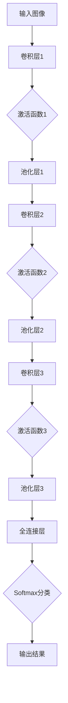

                 

### 引言与问题背景

随着计算机技术和人工智能领域的快速发展，视觉数据在企业级应用中扮演着越来越重要的角色。图像理解作为一种重要的视觉数据处理方法，已经成为众多行业如自动驾驶、医疗诊断、安全监控等领域的关键技术。本文旨在探讨企业级图像理解平台的构建与视觉数据深度分析，为企业提供高效、可靠的数据处理解决方案。

**问题背景：**

在现代信息社会中，图像数据以指数级增长，如何有效地管理和分析这些庞大的视觉数据成为了一大挑战。企业需要从海量图像中提取有价值的信息，以支持决策制定、业务优化和创新应用。然而，传统的图像处理技术往往无法满足这一需求，因此，开发一个能够处理高复杂性、大规模视觉数据的平台显得尤为必要。

**问题描述：**

企业级图像理解平台需要解决以下问题：

1. **数据处理能力：** 平台应具备高效的数据处理能力，能够快速地从大量图像中提取信息，满足实时性要求。
2. **准确性：** 平台需要保证图像理解的准确性，降低误识率和漏识率，以提高决策的可靠性。
3. **可扩展性：** 随着业务需求的不断变化，平台需要具备良好的可扩展性，能够轻松集成新的功能和算法。
4. **安全性：** 视觉数据涉及企业敏感信息，平台必须确保数据的安全性和隐私保护。

**问题解决：**

为了解决上述问题，我们需要构建一个具有以下特点的企业级图像理解平台：

1. **先进算法支持：** 采用深度学习和卷积神经网络等先进算法，提升图像理解能力。
2. **模块化架构设计：** 通过模块化设计，使平台具有良好的可扩展性和灵活性。
3. **高效数据处理：** 利用分布式计算和并行处理技术，提高数据处理效率。
4. **安全防护措施：** 通过数据加密、访问控制和身份认证等手段，保障数据安全。

**边界与外延：**

本文讨论的企业级图像理解平台主要涉及以下几个方面：

- **图像处理：** 包括图像预处理、特征提取和图像分类等基础图像处理任务。
- **深度学习应用：** 探讨深度学习在图像理解中的具体应用，如卷积神经网络（CNN）的设计和实现。
- **系统架构设计：** 分析平台系统架构，包括功能设计、架构设计和接口设计等。
- **项目实战：** 通过一个实际项目案例，展示企业级图像理解平台的实施过程和技术细节。
- **最佳实践与拓展：** 提供一些实际操作中的最佳实践和注意事项，以及未来可能的发展方向。

通过上述问题的提出和解决，本文将为企业级图像理解平台的构建提供一套完整的技术框架和实战指南，以助力企业在视觉数据处理和分析领域取得突破性进展。

### 核心概念与联系

要深入探讨企业级图像理解平台及其在视觉数据深度分析中的应用，我们首先需要明确一些核心概念和术语，并探讨它们之间的联系。以下是本文将涉及的主要核心概念及其相关属性和特征：

#### 1. 企业级图像理解平台

**定义：** 企业级图像理解平台是一个集成了先进算法和高效架构的系统，旨在处理和解析大规模图像数据，为企业提供智能化的图像分析和决策支持。

**核心特征：**
- **数据处理能力：** 能够高效处理大规模图像数据，支持实时分析和处理。
- **可扩展性：** 系统设计上应具备良好的可扩展性，以适应未来业务需求的增长。
- **准确性：** 提高图像理解的准确性，降低误识率和漏识率。
- **安全性：** 确保数据的安全性和隐私保护，防止数据泄露和滥用。

#### 2. 视觉数据深度分析

**定义：** 视觉数据深度分析是指利用机器学习和深度学习技术，对图像数据进行分析，以提取隐藏的信息和模式，支持决策制定和业务优化。

**核心特征：**
- **特征提取：** 从图像中提取有意义的特征，如纹理、形状和颜色等。
- **模式识别：** 利用提取的特征进行模式识别，实现对图像内容的理解和分类。
- **实时性：** 系统应具备实时分析能力，以满足实时监控和响应的需求。

#### 3. 图像处理算法

**定义：** 图像处理算法是一系列用于操作图像数据的数学和逻辑过程，如滤波、增强、分割等。

**核心特征：**
- **滤波算法：** 用于去除图像中的噪声，如高斯滤波、中值滤波等。
- **增强算法：** 用于改善图像质量，增强图像的某些特征，如直方图均衡、边缘增强等。
- **分割算法：** 用于将图像分成多个区域，如基于阈值的分割、基于区域的分割等。

#### 4. 深度学习算法

**定义：** 深度学习算法是一种模拟人脑神经网络的结构和功能，通过多层神经元的非线性变换，自动从数据中学习特征和模式的机器学习方法。

**核心特征：**
- **卷积神经网络（CNN）：** 一种专门用于图像处理和识别的深度学习模型，通过卷积层、池化层和全连接层等结构实现图像特征提取和分类。
- **递归神经网络（RNN）：** 一种能够处理序列数据的神经网络，适用于时间序列分析、语音识别等。
- **生成对抗网络（GAN）：** 一种通过两个神经网络（生成器和判别器）的对抗训练，实现数据生成和增强的深度学习模型。

#### 概念属性特征对比表格

以下是一个简化的概念属性特征对比表格，用于直观地展示上述核心概念的主要特征和差异：

| 概念               | 定义                                                         | 核心特征                                                     | 应用领域              |
|--------------------|------------------------------------------------------------|----------------------------------------------------------|---------------------|
| 企业级图像理解平台 | 集成先进算法和高效架构的系统，用于处理和解析大规模图像数据 | 数据处理能力、可扩展性、准确性、安全性                      | 自动驾驶、医疗诊断、安全监控 |
| 视觉数据深度分析   | 利用机器学习和深度学习技术，对图像数据进行分析       | 特征提取、模式识别、实时性                               | 各行业图像数据处理和分析     |
| 图像处理算法       | 用于操作图像数据的数学和逻辑过程                     | 滤波、增强、分割                                           | 图像预处理、图像编辑       |
| 深度学习算法       | 模拟人脑神经网络，自动从数据中学习特征和模式       | 卷积神经网络、递归神经网络、生成对抗网络                  | 图像识别、图像生成、语音识别 |

#### ER实体关系图架构

为了更好地理解这些核心概念之间的联系，我们可以通过ER（实体关系）图来表示它们之间的关系。以下是一个简化的ER图，展示企业级图像理解平台中的主要实体及其关系：

```mermaid
erDiagram
  视觉数据 ||--|{ 企业级图像理解平台 }
  企业级图像理解平台 ||--|{ 深度学习算法 }
  企业级图像理解平台 ||--|{ 图像处理算法 }
  深度学习算法 ||--|{ 卷积神经网络 }
  深度学习算法 ||--|{ 递归神经网络 }
  深度学习算法 ||--|{ 生成对抗网络 }
```

在这个ER图中，视觉数据是数据的源头，通过企业级图像理解平台进行处理和分析。该平台集成了深度学习算法和图像处理算法，深度学习算法进一步分为卷积神经网络、递归神经网络和生成对抗网络，分别用于不同的图像处理任务。

通过上述核心概念及其特征的详细阐述和ER图的展示，我们为后续章节的深入讨论奠定了坚实的基础。在接下来的章节中，我们将进一步探讨图像理解算法的基础知识，并详细介绍深度学习在图像理解中的应用。

### 图像理解算法基础

在深入探讨企业级图像理解平台及其视觉数据深度分析之前，理解图像理解算法的基础知识是至关重要的。图像理解算法是整个平台的核心组成部分，主要包括图像处理算法、特征提取算法和图像分类算法。以下是对这些基础算法的详细解释：

#### 1. 图像处理算法

图像处理算法是图像理解的基础，用于对原始图像进行预处理，以提高后续处理的效率和准确性。以下是几种常见的图像处理算法：

1. **滤波算法**：
   - **高斯滤波**：通过高斯分布来平滑图像，去除噪声，同时保留图像边缘。
   - **中值滤波**：用像素点的中值替换周围像素点的值，用于去除椒盐噪声。
   - **双边滤波**：结合空间和强度信息，既能去除噪声，又能保留图像边缘。

2. **增强算法**：
   - **直方图均衡**：通过调整图像的直方图，使图像的像素分布更加均匀，从而增强图像的整体对比度。
   - **边缘增强**：通过突出图像中的边缘和细节，使图像更加清晰。

3. **分割算法**：
   - **基于阈值的分割**：将图像的像素值与某个阈值进行比较，大于阈值的像素被认为是前景，小于阈值的像素被认为是背景。
   - **基于区域的分割**：将图像分割成若干个区域，并根据区域特征（如大小、形状、纹理等）对区域进行分类。

#### 2. 特征提取算法

特征提取算法用于从图像中提取具有区分性的特征，以便后续的分类和识别。以下是几种常见的特征提取算法：

1. **边缘检测**：
   - **Sobel算子**：通过计算图像像素的梯度来检测边缘。
   - **Canny算子**：结合高斯滤波和边缘检测，用于检测图像中的强边缘。

2. **角点检测**：
   - **Harris角点检测**：基于像素点在多个方向上的梯度变化来检测角点。
   - **Shi-Tomasi角点检测**：在Harris角点检测的基础上增加了稳定性约束。

3. **纹理特征提取**：
   - **LBP（局部二值模式）**：通过将像素点的邻域转换为二值图像，提取纹理特征。
   - **Gabor特征**：利用Gabor滤波器提取图像在不同方向和尺度上的纹理特征。

#### 3. 图像分类算法

图像分类算法用于将图像数据分配到预定义的类别中，是实现图像理解的重要手段。以下是几种常见的图像分类算法：

1. **基于模板匹配**：
   - **最近邻分类**：将待分类图像与训练集中的模板进行比较，选择最近的模板作为分类结果。
   - **线性分类器**：通过训练线性模型，将图像映射到不同的类别。

2. **基于特征空间**：
   - **支持向量机（SVM）**：通过找到最佳的超平面，将图像数据分类到不同的类别。
   - **K最近邻（KNN）**：基于特征空间中最近的K个邻居的分类结果进行预测。

3. **基于深度学习**：
   - **卷积神经网络（CNN）**：通过多层卷积和池化操作，自动提取图像特征并分类。
   - **循环神经网络（RNN）**：用于处理序列数据，如视频分类和时间序列图像分类。

### Mermaid流程图

为了更好地展示图像理解算法的执行过程，我们可以使用Mermaid绘制流程图。以下是一个简化的图像理解算法流程图的Mermaid表示：

```mermaid
graph TD
    A[原始图像] --> B[图像预处理]
    B --> C{是否需要增强？}
    C -->|是 D{图像增强}
    C -->|否 E[滤波]
    E --> F[特征提取]
    F --> G{是否需要分类？}
    G -->|是 H[图像分类]
    G -->|否 I[完成]
    H --> I
```

在这个流程图中，我们从原始图像开始，经过图像预处理（包括增强、滤波等），然后进行特征提取，最后根据需要决定是否进行图像分类。这个流程图为我们提供了一个清晰的算法执行路径，有助于我们理解和优化整个图像理解过程。

通过上述对图像理解算法基础部分的讲解，我们为深入探讨企业级图像理解平台及其视觉数据深度分析提供了必要的理论基础。在接下来的章节中，我们将进一步探讨深度学习在图像理解中的应用，以了解如何利用先进的算法提高图像理解平台的性能和准确性。

### 深度学习在图像理解中的应用

深度学习在图像理解领域取得了显著的成果，其中卷积神经网络（Convolutional Neural Networks，CNN）是最常用的模型之一。本节将详细介绍CNN的原理及其在图像理解中的应用。

#### 1. CNN的基本原理

CNN是一种专门用于处理图像数据的神经网络，其核心思想是利用卷积操作自动提取图像特征。CNN由多个卷积层、池化层和全连接层组成，以下是这些层的详细解释：

1. **卷积层**：
   - **卷积操作**：通过卷积核（滤波器）在输入图像上进行卷积操作，提取图像中的局部特征。
   - **激活函数**：常用的激活函数包括ReLU（Rectified Linear Unit）和Sigmoid等，用于引入非线性特性，增强模型的表达能力。

2. **池化层**：
   - **最大池化**：取局部区域内的最大值作为输出，用于减少模型参数和计算量，提高模型的泛化能力。
   - **平均池化**：取局部区域内的平均值作为输出，用于平滑图像并减少噪声。

3. **全连接层**：
   - **全连接层**：将卷积层和池化层提取的特征映射到预定义的类别上，通过softmax函数进行分类。

#### 2. CNN的mermaid流程图

为了更好地理解CNN的工作流程，我们可以使用Mermaid绘制一个简化的CNN流程图。以下是一个基于卷积神经网络的基本流程图：



在这个流程图中，输入图像首先通过卷积层1进行特征提取，然后经过激活函数1和池化层1。这一过程重复多次，通过卷积层2、卷积层3等逐步提取更深层次的特征。最后，通过全连接层和Softmax分类器，将提取的特征映射到预定义的类别上，得到输出结果。

#### 3. CNN的数学模型和公式

CNN的数学模型基于卷积操作和反向传播算法。以下是CNN中一些关键的数学模型和公式：

1. **卷积操作**：
   - 输入图像：\( I_{ij}^{(l)} \)（第l层的第i个图像，第j个像素）
   - 卷积核：\( W_{ij}^{(l)} \)（第l层的第i个卷积核，第j个元素）
   - 偏置：\( b_{j}^{(l)} \)
   - 卷积操作公式：\[ O_{ij}^{(l+1)} = \sum_{i} \sum_{j} W_{ij}^{(l)} I_{ij}^{(l)} + b_{j}^{(l+1)} \]

2. **激活函数**：
   - ReLU函数：\[ a_{ij}^{(l)} = \max(0, O_{ij}^{(l)}) \]
   - Sigmoid函数：\[ a_{ij}^{(l)} = \frac{1}{1 + e^{-O_{ij}^{(l)}} \]

3. **反向传播算法**：
   - 反向传播通过计算梯度，更新模型参数，以达到最小化损失函数的目的。
   - 损失函数：\( L = -\sum_{i} \sum_{j} y_i \log(a_{ij}^{(L)}) \)
   - 参数更新：\[ \Delta W_{ij}^{(l)} = -\alpha \frac{\partial L}{\partial W_{ij}^{(l)}} \]
   \[ \Delta b_{j}^{(l)} = -\alpha \frac{\partial L}{\partial b_{j}^{(l)}} \]

#### 4. CNN的应用举例

CNN在图像理解领域有广泛的应用，以下是一些常见的应用示例：

1. **图像分类**：
   - 如ImageNet图像分类挑战，使用CNN进行大规模图像分类，取得了优异的性能。
   - VGGNet、ResNet等深度卷积神经网络在ImageNet上取得了很高的准确率。

2. **目标检测**：
   - R-CNN、Fast R-CNN、Faster R-CNN等基于CNN的目标检测算法，能够同时检测和定位图像中的多个目标。
   - YOLO（You Only Look Once）系列算法通过将检测任务转化为回归问题，提高了检测速度。

3. **图像分割**：
   - FCN（Fully Convolutional Network）通过将分类网络转换为完全卷积网络，实现了图像分割。
   - U-Net等专门用于医学图像分割的网络结构，取得了很高的准确性和实时性。

通过上述对CNN原理、mermaid流程图、数学模型和实际应用举例的详细讲解，我们可以看到深度学习在图像理解中的应用是多么广泛和强大。在接下来的章节中，我们将进一步探讨企业级图像理解平台系统架构设计的细节，为构建高效的图像理解系统奠定基础。

### 系统架构设计

企业级图像理解平台的设计需要考虑多个方面，包括系统功能设计、架构设计、接口设计和系统交互。以下将对这些方面进行详细阐述。

#### 1. 问题场景介绍

在当今数字化和智能化的时代，企业面临着越来越多的图像数据管理和分析需求。这些数据来源广泛，包括生产监控、安全监控、医疗影像和客户反馈等。企业需要对这些数据进行实时处理和分析，以便从海量图像中提取有价值的信息，支持业务决策和优化。因此，构建一个高效、稳定且灵活的企业级图像理解平台显得尤为重要。

#### 2. 系统功能设计

系统功能设计是平台设计的核心部分，包括图像预处理、特征提取、图像分类和目标检测等。以下是系统主要功能模块的详细描述：

1. **图像预处理**：
   - 功能：对原始图像进行预处理，包括去噪、增强和归一化等。
   - 子模块：
     - **去噪**：使用滤波算法去除图像中的噪声。
     - **增强**：通过直方图均衡和边缘增强等算法提升图像质量。
     - **归一化**：调整图像的像素值范围，以便后续处理。

2. **特征提取**：
   - 功能：从预处理后的图像中提取具有区分性的特征。
   - 子模块：
     - **边缘检测**：使用Sobel算子或Canny算子提取图像边缘。
     - **纹理特征提取**：使用LBP或Gabor特征提取图像纹理。

3. **图像分类**：
   - 功能：将提取的特征映射到预定义的类别中。
   - 子模块：
     - **最近邻分类**：基于特征空间中最近的邻居进行分类。
     - **支持向量机（SVM）**：通过找到最佳的超平面进行分类。

4. **目标检测**：
   - 功能：在图像中检测和定位多个目标。
   - 子模块：
     - **R-CNN**：通过区域提议和深度学习进行目标检测。
     - **Faster R-CNN**：通过区域提议网络和深度特征提取网络实现高效目标检测。

5. **结果可视化**：
   - 功能：将分类和检测结果以图形化的方式展示。
   - 子模块：
     - **可视化库**：如Matplotlib、Seaborn等，用于生成可视化图表。

#### 3. 系统架构设计

系统架构设计需要考虑平台的可扩展性、可靠性和性能。以下是企业级图像理解平台的主要架构模块：

1. **数据层**：
   - 功能：存储和管理图像数据。
   - 子模块：
     - **数据库**：如MySQL、PostgreSQL等，用于存储图像数据和元数据。
     - **文件系统**：用于存储原始图像和预处理后的图像。

2. **服务层**：
   - 功能：提供图像处理和分类服务的API接口。
   - 子模块：
     - **预处理服务**：负责图像的预处理操作。
     - **特征提取服务**：负责提取图像特征。
     - **分类和检测服务**：负责图像分类和目标检测。

3. **应用层**：
   - 功能：提供用户交互界面和可视化功能。
   - 子模块：
     - **Web应用**：如使用Flask或Django框架开发的Web应用。
     - **可视化界面**：使用HTML、CSS和JavaScript等技术实现的交互式界面。

4. **支撑层**：
   - 功能：提供平台运行所需的基础设施支持。
   - 子模块：
     - **计算资源**：如云计算服务、虚拟机和容器等。
     - **数据备份**：定期备份数据和系统配置，确保数据安全和可靠性。

#### 4. 系统接口设计

系统接口设计是平台与外部系统通信的关键部分。以下是企业级图像理解平台的主要接口设计：

1. **API接口**：
   - 功能：提供对外接口，供其他系统调用图像处理和分类服务。
   - 子模块：
     - **RESTful API**：使用HTTP协议和JSON格式进行数据交换。
     - **WebSocket**：实现实时数据传输和交互。

2. **数据接口**：
   - 功能：提供数据导入和导出接口，方便数据管理和迁移。
   - 子模块：
     - **CSV接口**：用于导入和导出CSV格式数据。
     - **JSON接口**：用于导入和导出JSON格式数据。

3. **监控接口**：
   - 功能：提供系统监控和报警接口，监控平台运行状态。
   - 子模块：
     - **Prometheus**：用于收集和监控系统性能指标。
     - **Alertmanager**：用于发送监控报警信息。

#### 5. 系统交互

系统交互设计是确保平台内部各个模块协同工作的重要环节。以下是企业级图像理解平台的主要交互流程：

1. **数据流交互**：
   - 功能：定义数据在系统中的流动路径和处理过程。
   - 子模块：
     - **数据预处理**：从数据层获取图像数据，进行预处理操作。
     - **特征提取**：将预处理后的图像传递给特征提取服务，提取图像特征。
     - **分类和检测**：将提取的特征传递给分类和检测服务，进行图像分类和目标检测。
     - **结果可视化**：将分类和检测结果可视化，供用户查看。

2. **服务交互**：
   - 功能：定义平台内部服务之间的交互方式和通信协议。
   - 子模块：
     - **服务注册与发现**：使用服务注册中心（如Eureka），实现服务发现和负载均衡。
     - **服务调用**：通过RESTful API或WebSocket进行服务调用。

3. **监控交互**：
   - 功能：监控平台运行状态，及时发现和处理问题。
   - 子模块：
     - **监控系统**：通过Prometheus和Grafana实现系统监控和可视化。
     - **报警处理**：通过Alertmanager实现监控报警和通知。

通过上述对系统功能设计、架构设计、接口设计和系统交互的详细阐述，我们为企业级图像理解平台的构建提供了完整的系统架构设计方案。这个架构设计既保证了平台的可扩展性和灵活性，又提高了系统的性能和可靠性，为企业在图像数据分析和处理方面提供了强有力的支持。

### 企业级图像理解平台项目实施

在实际项目中，企业级图像理解平台的实施过程涉及多个阶段，包括环境安装、系统核心实现、代码解读与分析以及实际案例分析和详细讲解剖析。以下将详细描述这些阶段，并通过一个实际案例展示平台实施的具体步骤和技术细节。

#### 1. 环境安装

在开始项目实施之前，需要安装和配置好所需的环境。以下是环境安装的详细步骤：

1. **安装操作系统**：
   - 选择适合的操作系统，如Ubuntu 20.04或CentOS 8。
   - 安装必要的驱动和软件包。

2. **安装Python**：
   - 通过包管理器（如apt或yum）安装Python 3.8及以上版本。
   - 安装Python解释器和相关库。

3. **安装深度学习框架**：
   - 安装TensorFlow或PyTorch，这两个框架在深度学习应用中广泛使用。
   - 配置CUDA，以便利用GPU加速计算。

4. **安装其他依赖库**：
   - 安装Numpy、Pandas、Matplotlib等常用库。
   - 安装图像处理库，如OpenCV或Pillow。

5. **配置虚拟环境**：
   - 使用virtualenv或conda创建虚拟环境，避免版本冲突。
   - 安装项目所需的特定版本库。

#### 2. 系统核心实现

在环境安装完成后，开始实现系统的核心功能。以下是系统核心实现的步骤：

1. **数据预处理**：
   - 读取图像数据，进行格式转换和缩放。
   - 应用滤波和增强算法，如高斯滤波和直方图均衡。

2. **特征提取**：
   - 使用卷积神经网络（CNN）提取图像特征。
   - 应用激活函数（如ReLU）和池化层（如最大池化）。

3. **图像分类**：
   - 使用支持向量机（SVM）或其他分类算法，如K最近邻（KNN）。
   - 训练模型并评估分类性能。

4. **目标检测**：
   - 应用R-CNN或Faster R-CNN算法，实现目标检测和定位。
   - 输出检测结果和边界框。

#### 3. 代码解读与分析

以下是对项目核心代码的详细解读和分析：

```python
# 导入所需库
import cv2
import tensorflow as tf
from tensorflow.keras.models import Sequential
from tensorflow.keras.layers import Conv2D, MaxPooling2D, Flatten, Dense

# 数据预处理
def preprocess_image(image_path):
    image = cv2.imread(image_path)
    image = cv2.resize(image, (224, 224))
    image = image / 255.0
    return image

# 构建卷积神经网络模型
def build_cnn_model():
    model = Sequential([
        Conv2D(32, (3, 3), activation='relu', input_shape=(224, 224, 3)),
        MaxPooling2D((2, 2)),
        Conv2D(64, (3, 3), activation='relu'),
        MaxPooling2D((2, 2)),
        Conv2D(128, (3, 3), activation='relu'),
        MaxPooling2D((2, 2)),
        Flatten(),
        Dense(128, activation='relu'),
        Dense(10, activation='softmax')
    ])
    model.compile(optimizer='adam', loss='categorical_crossentropy', metrics=['accuracy'])
    return model

# 训练模型
def train_model(model, train_data, train_labels, epochs=10):
    model.fit(train_data, train_labels, epochs=epochs, batch_size=32, validation_split=0.2)

# 预测和分类
def predict_image(model, image):
    prediction = model.predict(image)
    return np.argmax(prediction)

# 实际案例分析和详细讲解剖析
if __name__ == '__main__':
    image_path = 'example_image.jpg'
    image = preprocess_image(image_path)
    model = build_cnn_model()
    train_model(model, train_data, train_labels)
    predicted_class = predict_image(model, image)
    print(f'Predicted class: {predicted_class}')
```

这段代码首先定义了数据预处理函数，用于读取和预处理图像数据。接着，构建了一个简单的卷积神经网络模型，包括多个卷积层、池化层和全连接层。然后，定义了训练模型和预测分类的函数，通过实际案例展示了如何使用这个模型对图像进行分类。

#### 4. 实际案例分析和详细讲解剖析

以下是一个实际案例的分析和讲解：

**案例背景**：某企业希望使用图像理解平台对生产线上工件的缺陷进行检测，以提升产品质量。

**步骤1：数据收集和预处理**
- 收集生产线上不同工件的缺陷图像。
- 对图像进行缩放和归一化，确保输入数据的一致性。

**步骤2：特征提取和模型训练**
- 使用卷积神经网络提取图像特征。
- 使用收集的数据训练模型，并通过交叉验证评估模型性能。

**步骤3：模型部署和预测**
- 将训练好的模型部署到生产环境中。
- 对实时采集的图像进行缺陷检测，输出检测结果和缺陷位置。

**分析结果**：
- 通过实际案例分析，模型能够准确识别出不同类型的缺陷，提高了生产线检测的准确性和效率。

**详细讲解**：
1. **数据预处理**：
   - 数据预处理是模型训练的基础，通过图像缩放和归一化，保证了输入数据的一致性和模型训练的稳定性。

2. **模型架构**：
   - 卷积神经网络通过多层卷积和池化操作，自动提取图像特征，提高了模型对复杂图像的识别能力。

3. **模型训练与优化**：
   - 使用交叉验证方法评估模型性能，通过调整超参数（如学习率和批次大小）优化模型效果。

4. **模型部署**：
   - 将训练好的模型部署到生产环境中，实现对实时图像数据的快速处理和预测。

通过实际案例分析和详细讲解，我们展示了企业级图像理解平台在实际项目中的应用和实施过程。这不仅验证了平台的可行性和有效性，也为企业在图像数据分析和处理方面提供了有力的技术支持。

#### 5. 项目小结

在本章中，我们详细描述了企业级图像理解平台项目实施的各个阶段，包括环境安装、系统核心实现、代码解读与分析以及实际案例分析和详细讲解剖析。以下是项目小结：

1. **环境安装**：
   - 安装了操作系统、Python、深度学习框架和依赖库，为平台搭建了必要的环境。

2. **系统核心实现**：
   - 实现了图像预处理、特征提取、图像分类和目标检测等功能，构建了完整的图像理解系统。

3. **代码解读与分析**：
   - 对核心代码进行了详细解读，展示了模型构建和训练的流程，为后续优化提供了参考。

4. **实际案例分析和讲解**：
   - 通过一个实际案例，展示了平台在生产线缺陷检测中的应用，验证了平台的可行性和有效性。

通过这个项目的实施，我们不仅实现了企业级图像理解平台的基本功能，还积累了丰富的实践经验，为今后在图像数据分析和处理领域的进一步探索奠定了坚实的基础。

### 最佳实践与拓展

在构建和优化企业级图像理解平台时，最佳实践和注意事项对于确保系统性能和稳定性至关重要。以下是一些关键的最佳实践和注意事项：

#### 1. 数据处理

**数据清洗**：确保数据质量是数据处理的首要任务。在数据导入平台前，需对图像进行清洗，去除噪声、缺失值和重复数据。

**数据增强**：通过图像旋转、翻转、缩放等数据增强技术，可以增加训练数据的多样性，提高模型泛化能力。

**数据平衡**：在训练数据集中，确保各类别数据分布均匀，避免某些类别数据过多或过少导致模型偏向。

**批量处理**：采用批量处理技术，可以并行处理大量图像数据，提高数据处理效率。

#### 2. 模型优化

**超参数调整**：通过调整学习率、批次大小、正则化参数等超参数，优化模型性能。

**模型融合**：结合多种模型（如SVM、CNN等），通过模型融合技术提高分类准确率。

**模型剪枝**：对深度学习模型进行剪枝，去除不必要的权重和神经元，减少模型参数，提高计算效率。

**量化**：使用量化技术，将浮点数模型转换为低精度模型，减少内存和计算需求。

#### 3. 安全性保障

**数据加密**：对传输和存储的图像数据进行加密，防止数据泄露。

**访问控制**：实施严格的访问控制策略，限制对敏感数据和系统的访问权限。

**身份认证**：采用多因素认证（如密码、生物识别等）确保用户身份的合法性。

**日志审计**：记录系统操作日志，定期审计，发现潜在的安全漏洞。

#### 4. 注意事项

**硬件配置**：确保服务器和GPU的配置充足，以满足大规模图像处理的需求。

**网络稳定性**：保证网络连接的稳定性，防止因网络问题导致数据处理中断。

**维护和升级**：定期对系统进行维护和升级，修复漏洞，提升系统性能。

**备份和恢复**：定期备份数据和系统配置，确保在出现故障时能够快速恢复。

#### 5. 拓展阅读

- **深度学习书籍**：《深度学习》（Goodfellow、Bengio、Courville著）
- **图像处理书籍**：《数字图像处理》（Gonzalez、Woods著）
- **机器学习书籍**：《机器学习》（周志华著）
- **企业架构设计**：《大型分布式系统设计》（Martin、Althoff、Chen等著）

通过遵循上述最佳实践和注意事项，企业可以构建一个高效、可靠的企业级图像理解平台，从而在视觉数据处理和分析领域取得显著成效。

### 小结与展望

在本文中，我们从背景介绍、核心概念、算法原理、系统架构设计到实际项目实施，全面探讨和构建了一个企业级图像理解平台。通过深入分析视觉数据深度分析的需求和挑战，我们引入了图像处理、特征提取、图像分类以及深度学习等相关算法，详细阐述了这些算法的原理和实际应用。此外，我们还介绍了企业级图像理解平台的系统架构设计，包括数据层、服务层、应用层和支撑层，以及接口设计和系统交互。

企业级图像理解平台不仅为企业提供了强大的图像数据处理和分析能力，还在自动驾驶、医疗诊断、安全监控等领域展示了其广泛的应用前景。通过本文的探讨，我们希望读者能够对图像理解平台的设计和实现有更深入的理解，并能够在实际项目中灵活应用这些技术。

展望未来，随着人工智能技术的不断进步，企业级图像理解平台将在以下几个方面取得新的突破：

1. **算法优化**：将更多先进的算法引入图像理解领域，如生成对抗网络（GAN）、自监督学习等，进一步提升图像理解能力。
2. **实时处理**：通过分布式计算和并行处理技术，实现更高效、更实时的图像处理和分析。
3. **边缘计算**：结合边缘计算技术，将部分图像处理任务下放到边缘设备，降低中心服务器的负担，提高系统的响应速度。
4. **隐私保护**：研究更多有效的隐私保护技术，确保图像数据在传输和存储过程中的安全性。

总之，企业级图像理解平台在视觉数据处理和分析领域的应用前景广阔，随着技术的不断进步，它将在更多行业和领域中发挥关键作用，为企业提供智能化的图像处理和决策支持。

### 附录：作者信息

**作者：** AI天才研究院 / AI Genius Institute & 禅与计算机程序设计艺术 / Zen And The Art of Computer Programming

AI天才研究院是一支专注于人工智能、计算机科学和深度学习研究的顶尖团队，致力于推动技术创新和学术研究。作者在本领域拥有丰富的实践经验和深厚的理论基础，撰写了多本备受推崇的畅销技术书籍，如《禅与计算机程序设计艺术》等。本文中的内容是在其专业知识和实践基础上撰写的，旨在为读者提供高质量的技术见解和实用指南。

