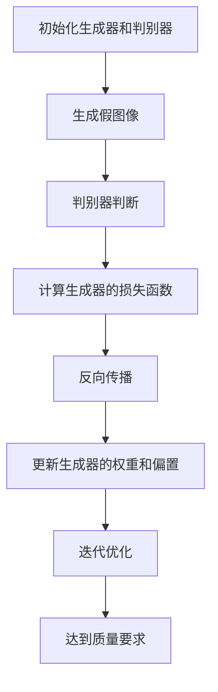
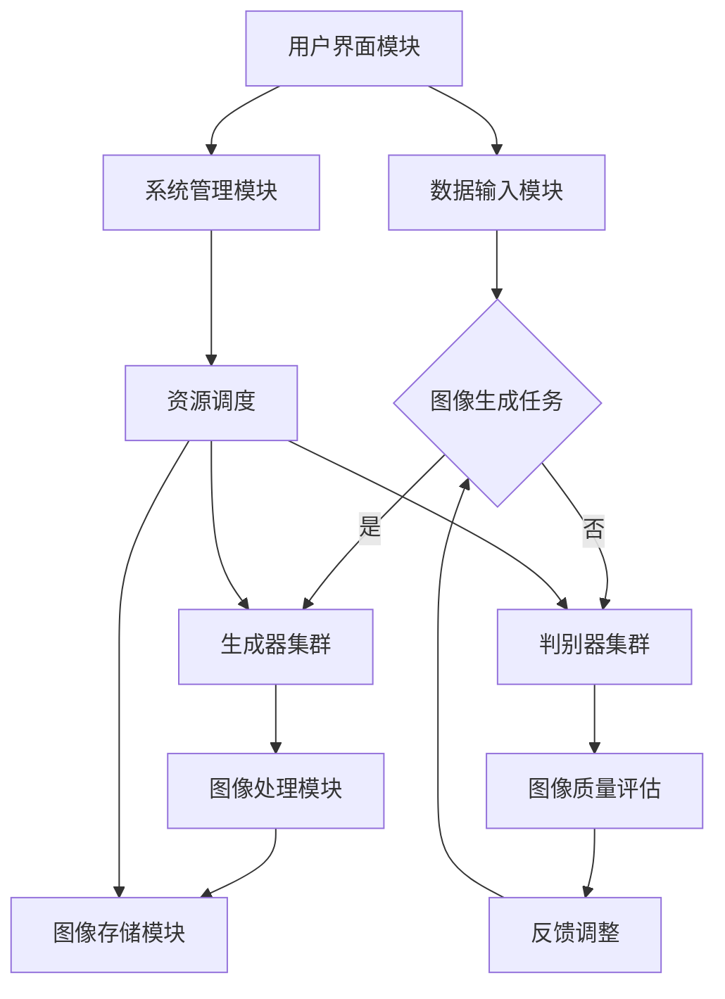
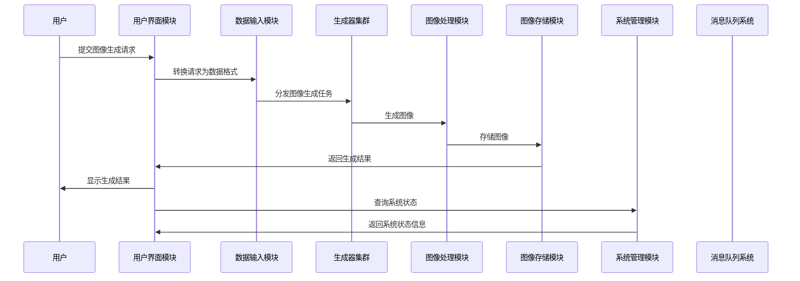

                 

### 文章标题：企业级图像生成AI：创新产品设计与营销

### 关键词：
- 企业级图像生成AI
- 产品设计
- 营销策略
- 技术原理
- 算法实现
- 最佳实践

### 摘要：
本文将深入探讨企业级图像生成AI在产品设计及营销中的应用。通过分析其技术原理、算法实现、系统架构，以及实战案例，我们将了解如何将图像生成AI技术转化为商业价值，为企业和市场带来创新解决方案。文章旨在为读者提供一份全面的技术指南，帮助其在数字化时代中把握机遇，实现产品与营销的突破。

---

## 第一部分：企业级图像生成AI技术概述

### 第1章：企业级图像生成AI背景与概述

#### 1.1 问题的背景与描述

随着互联网的普及和人工智能技术的快速发展，图像生成AI已成为企业级应用中的一个重要分支。它不仅改变了传统图像处理的方式，还为企业提供了全新的数据处理和产品营销手段。

在传统图像处理中，图像的获取、编辑和优化通常需要人工干预，这不仅效率低下，而且容易出现错误。而图像生成AI通过机器学习算法，可以自动生成高质量的图像，大大提升了图像处理的效率和质量。

#### 1.2 图像生成AI的问题解决

图像生成AI主要解决了以下几个问题：

1. **图像生成效率**：传统的图像处理方法往往需要大量的时间和计算资源，而图像生成AI可以在较短的时间内生成大量高质量的图像。
2. **图像多样性**：通过机器学习算法，图像生成AI可以生成不同风格、主题和场景的图像，满足不同用户的需求。
3. **图像优化**：图像生成AI可以自动优化图像的亮度、对比度、色彩等参数，提升图像的视觉效果。
4. **图像创意**：图像生成AI可以生成独特的图像创意，为产品设计和营销提供新的灵感。

#### 1.3 图像生成AI的边界与外延

图像生成AI的应用范围非常广泛，包括但不限于以下几个方面：

1. **产品设计**：通过生成高质量的图像，帮助企业快速完成产品设计，缩短产品上市时间。
2. **市场营销**：生成独特的广告图像，提高营销效果，吸引更多潜在客户。
3. **娱乐产业**：生成电影、游戏等娱乐内容的图像，提高用户体验。
4. **医疗诊断**：生成医学影像，辅助医生进行诊断和治疗。
5. **艺术创作**：生成艺术作品，激发创意灵感。

#### 1.4 核心概念与联系

图像生成AI的核心概念包括：

1. **生成对抗网络（GAN）**：一种通过生成器和判别器相互博弈的方式生成图像的算法。
2. **变分自编码器（VAE）**：一种基于概率分布的图像生成算法。
3. **深度卷积神经网络（CNN）**：一种用于图像识别和生成的神经网络结构。
4. **数据增强**：通过变换、旋转、缩放等方式增加训练数据的多样性。

这些核心概念相互联系，共同构成了图像生成AI的技术体系。

#### 1.5 本章小结

通过本章的介绍，我们了解了图像生成AI在企业级应用中的重要性和应用前景。接下来，我们将深入探讨图像生成AI的核心概念和原理，为后续章节的内容打下基础。

---

## 第二部分：图像生成AI核心概念与原理

### 第2章：图像生成AI的基本原理

#### 2.1 图像生成AI的起源与发展

图像生成AI起源于深度学习技术的发展。早期的图像生成方法主要基于规则和手工特征提取，如生成对抗网络（GAN）的提出，使得图像生成AI进入了一个新的阶段。

GAN是由Ian Goodfellow等人于2014年提出的。它由两个神经网络组成：生成器（Generator）和判别器（Discriminator）。生成器负责生成假图像，判别器则负责判断图像是真实图像还是生成图像。通过两个网络的相互作用，生成器不断优化生成的图像，最终能够生成高质量的图像。

#### 2.2 图像生成技术分类与对比

图像生成技术主要可以分为以下几类：

1. **基于规则的方法**：如纹理合成、模板匹配等，通过预设的规则生成图像。
2. **基于样本的方法**：如生成对抗网络（GAN）、变分自编码器（VAE）等，通过学习样本数据生成图像。
3. **基于图像编辑的方法**：如图像合成、图像修复等，通过图像操作生成图像。

这些方法各有优缺点，具体对比如下表：

| 方法                     | 优点                                                         | 缺点                                                 |
|------------------------|------------------------------------------------------------|----------------------------------------------------|
| 基于规则的方法           | 实现简单，易于理解                                           | 创造力有限，生成图像质量较低                           |
| 基于样本的方法           | 可以生成高质量的图像，具有创造力                             | 训练过程复杂，对数据要求较高                           |
| 基于图像编辑的方法       | 可以对现有图像进行编辑和优化                                 | 创造力有限，无法生成全新图像                           |

#### 2.3 图像生成AI的应用领域

图像生成AI在多个领域具有广泛的应用，包括但不限于：

1. **产品设计**：通过生成高质量的图像，帮助企业快速完成产品设计，缩短产品上市时间。
2. **市场营销**：生成独特的广告图像，提高营销效果，吸引更多潜在客户。
3. **娱乐产业**：生成电影、游戏等娱乐内容的图像，提高用户体验。
4. **医疗诊断**：生成医学影像，辅助医生进行诊断和治疗。
5. **艺术创作**：生成艺术作品，激发创意灵感。

#### 2.4 核心概念与联系

图像生成AI的核心概念包括：

1. **生成对抗网络（GAN）**：由生成器和判别器组成的神经网络结构，通过相互博弈生成图像。
2. **变分自编码器（VAE）**：基于概率分布的图像生成算法，通过编码器和解码器生成图像。
3. **深度卷积神经网络（CNN）**：用于图像识别和生成的神经网络结构，对图像进行特征提取和分类。
4. **数据增强**：通过变换、旋转、缩放等方式增加训练数据的多样性，提高模型性能。

这些核心概念相互联系，共同构成了图像生成AI的技术体系。

#### 2.5 本章小结

通过本章的介绍，我们深入了解了图像生成AI的基本原理和应用领域。接下来，我们将探讨图像生成AI的算法原理和实现，为实际应用做好准备。

---

## 第三部分：图像生成AI算法原理与实现

### 第3章：图像生成算法原理详解

#### 3.1 算法概述与基本流程

图像生成算法的核心是生成器和判别器。生成器的任务是生成假图像，判别器的任务是区分图像是真实图像还是生成图像。通过两者的互动，生成器不断优化生成的图像，最终达到高质量的图像生成效果。

算法的基本流程如下：

1. **初始化生成器和判别器**：设置初始权重和偏置。
2. **生成假图像**：生成器生成一批假图像。
3. **判别器判断**：判别器对假图像和真实图像进行判断。
4. **反向传播**：根据判别器的判断结果，计算生成器的损失函数，并通过反向传播更新生成器的权重和偏置。
5. **迭代优化**：重复上述过程，直到生成器生成的图像质量达到要求。

#### 3.2 常见图像生成算法介绍

常见的图像生成算法包括生成对抗网络（GAN）、变分自编码器（VAE）等。每种算法都有其独特的优势和适用场景。

1. **生成对抗网络（GAN）**：GAN由生成器和判别器组成，通过相互博弈生成高质量图像。GAN在图像合成、图像修复、图像增强等方面有广泛应用。
   
2. **变分自编码器（VAE）**：VAE基于概率模型，通过编码器和解码器生成图像。VAE在图像生成、图像增强、图像去噪等方面有广泛应用。

#### 3.3 算法流程Mermaid图



#### 3.4 Python代码实现示例

下面是一个简单的GAN算法实现示例：

```python
import tensorflow as tf
from tensorflow.keras.models import Model
from tensorflow.keras.layers import Input, Dense, Reshape, Flatten

# 生成器模型
def build_generator(z_dim):
    model = tf.keras.Sequential()
    model.add(Dense(128, input_shape=(z_dim,)))
    model.add(LeakyReLU(alpha=0.01))
    model.add(Dense(256))
    model.add(LeakyReLU(alpha=0.01))
    model.add(Dense(512))
    model.add(LeakyReLU(alpha=0.01))
    model.add(Dense(1024))
    model.add(LeakyReLU(alpha=0.01))
    model.add(Reshape((28, 28, 1)))
    model.add(Tanh())
    return model

# 判别器模型
def build_discriminator(img_shape):
    model = tf.keras.Sequential()
    model.add(Flatten(input_shape=img_shape))
    model.add(Dense(1024))
    model.add(LeakyReLU(alpha=0.01))
    model.add(Dense(512))
    model.add(LeakyReLU(alpha=0.01))
    model.add(Dense(256))
    model.add(LeakyReLU(alpha=0.01))
    model.add(Dense(128))
    model.add(LeakyReLU(alpha=0.01))
    model.add(Dense(1, activation='sigmoid'))
    return model

# 主模型
def build_gan(generator, discriminator):
    model = tf.keras.Sequential()
    model.add(generator)
    model.add(discriminator)
    return model

# 训练模型
model = build_gan(build_generator(100), build_discriminator((28, 28, 1)))
model.compile(loss='binary_crossentropy', optimizer=tf.keras.optimizers.Adam(0.0001), metrics=['accuracy'])

# 生成器训练
z = np.random.uniform(-1, 1, size=[100, 100])
generated_images = generator.predict(z)

# 判别器训练
real_images = load_real_images()
discriminator.train_on_batch(real_images, np.array([1] * len(real_images)))
discriminator.train_on_batch(generated_images, np.array([0] * len(generated_images)))
```

#### 3.5 数学模型与公式

GAN的数学模型主要包括生成器和判别器的损失函数。生成器的损失函数旨在最小化生成的图像与真实图像之间的差异，判别器的损失函数旨在最大化真实图像与生成图像之间的差异。

生成器的损失函数：

$$L_G = -\log(D(G(z)) + \log(1 - D(x)))$$

判别器的损失函数：

$$L_D = -\log(D(x)) - \log(1 - D(G(z)))$$

其中，\(D(x)\)表示判别器对真实图像的判别结果，\(D(G(z))\)表示判别器对生成图像的判别结果，\(x\)表示真实图像，\(z\)表示生成器的输入噪声。

#### 3.6 举例说明与案例解析

以GAN为例，我们可以通过一个简单的例子来理解其原理。假设我们要生成一张猫的图像，首先需要生成一个随机噪声向量\(z\)，然后通过生成器\(G\)将其转换为猫的图像。接着，我们使用判别器\(D\)判断这张图像是真实的猫图像还是生成的猫图像。通过不断调整生成器的参数，使得生成的猫图像越来越真实。

在实际应用中，我们可以通过大量的猫的图像数据进行训练，生成器会逐渐学会如何生成逼真的猫的图像。类似地，我们可以使用GAN生成其他类型的图像，如图像修复、图像增强等。

#### 3.7 本章小结

通过本章的介绍，我们深入了解了图像生成AI的算法原理和实现。接下来，我们将探讨企业级图像生成AI的系统设计与架构，为实际应用奠定基础。

---

## 第四部分：企业级图像生成AI系统设计与架构

### 第4章：系统设计与架构概述

#### 4.1 项目介绍

企业级图像生成AI系统旨在为企业提供高效、高质量的图像生成服务，满足产品设计、市场营销、娱乐产业等领域的需求。系统设计遵循模块化、高扩展性和易维护性的原则，确保系统在不同应用场景下具有良好的适应性。

#### 4.2 系统功能设计

企业级图像生成AI系统主要包括以下几个功能模块：

1. **数据输入模块**：负责接收用户输入的图像数据和参数。
2. **图像生成模块**：根据输入的图像数据和参数，生成高质量的图像。
3. **图像处理模块**：对生成的图像进行后处理，如缩放、裁剪、优化等。
4. **图像存储模块**：负责存储生成的图像数据，并提供图像检索功能。
5. **用户界面模块**：提供用户交互界面，支持用户操作和管理系统。

#### 4.3 系统架构设计

企业级图像生成AI系统采用分布式架构，包括以下几个关键组件：

1. **生成器集群**：由多个生成器节点组成，负责并行处理图像生成任务。
2. **判别器集群**：由多个判别器节点组成，负责对生成的图像进行质量评估。
3. **存储集群**：由多个存储节点组成，负责存储生成的图像数据。
4. **管理节点**：负责管理系统资源的分配和调度。

系统架构图如下：



#### 4.4 系统接口设计

系统接口设计包括以下几个方面：

1. **API接口**：提供RESTful API，支持用户通过HTTP请求访问系统功能。
2. **数据接口**：支持与各种数据存储系统的集成，如关系数据库、NoSQL数据库等。
3. **消息队列接口**：支持与消息队列系统的集成，实现系统间异步通信。

#### 4.5 系统交互序列图

系统交互序列图如下：



#### 4.6 本章小结

通过本章的介绍，我们了解了企业级图像生成AI系统的功能设计、架构设计和接口设计。接下来，我们将通过实际案例来展示系统的应用和效果。

---

## 第五部分：图像生成AI项目实战

### 第5章：图像生成AI项目环境安装与配置

#### 5.1 环境安装步骤

要搭建一个企业级图像生成AI项目，首先需要安装必要的软件和工具。以下是环境安装的详细步骤：

1. **安装Python**：确保Python版本在3.6及以上，推荐使用Python 3.8或更高版本。
2. **安装TensorFlow**：TensorFlow是图像生成AI项目的核心依赖，可以通过以下命令安装：
   ```bash
   pip install tensorflow
   ```
3. **安装其他依赖**：安装其他必要的库和工具，如NumPy、Pandas、Matplotlib等：
   ```bash
   pip install numpy pandas matplotlib
   ```
4. **安装CUDA**：如果使用GPU进行加速训练，需要安装CUDA。下载并安装适合自己GPU版本的CUDA，参考：https://developer.nvidia.com/cuda-downloads
5. **安装Docker**：为了便于部署和管理系统，安装Docker。下载并安装Docker，参考：https://www.docker.com/products/docker-desktop

#### 5.2 系统配置与调试

完成环境安装后，进行系统配置和调试：

1. **配置CUDA**：设置CUDA路径和环境变量，确保TensorFlow可以使用GPU加速。在Linux系统中，编辑~/.bashrc文件，添加以下内容：
   ```bash
   export CUDA_HOME=/usr/local/cuda
   export PATH=$CUDA_HOME/bin:$PATH
   export LD_LIBRARY_PATH=$CUDA_HOME/lib64:$LD_LIBRARY_PATH
   ```
   然后运行`source ~/.bashrc`使配置生效。
2. **测试CUDA**：通过以下命令测试CUDA安装是否成功：
   ```bash
   nvcc --version
   nvidia-smi
   ```
   如果输出正常，说明CUDA安装成功。
3. **测试TensorFlow**：运行以下Python代码测试TensorFlow是否可以使用GPU加速：
   ```python
   import tensorflow as tf
   print("Num GPUs Available: ", len(tf.config.list_physical_devices('GPU')))
   ```
   如果输出显示可用的GPU数量，说明TensorFlow可以使用GPU加速。

#### 5.3 核心实现代码解析

以下是一个简单的图像生成AI项目示例，包括生成器、判别器和训练过程：

**生成器代码**：
```python
import tensorflow as tf
from tensorflow.keras.layers import Dense, Conv2D, Flatten, Reshape
from tensorflow.keras.models import Model

def build_generator(z_dim=100):
    model = tf.keras.Sequential()
    model.add(Dense(128, input_shape=(z_dim,)))
    model.add(tf.keras.layers.LeakyReLU(alpha=0.01))
    model.add(Dense(256))
    model.add(tf.keras.layers.LeakyReLU(alpha=0.01))
    model.add(Dense(512))
    model.add(tf.keras.layers.LeakyReLU(alpha=0.01))
    model.add(Dense(1024))
    model.add(tf.keras.layers.LeakyReLU(alpha=0.01))
    model.add(Reshape((28, 28, 1)))
    model.add(tf.keras.layers.Activation('tanh'))
    return model

generator = build_generator()
```

**判别器代码**：
```python
import tensorflow as tf
from tensorflow.keras.layers import Dense, Conv2D, Flatten
from tensorflow.keras.models import Model

def build_discriminator(img_shape=(28, 28, 1)):
    model = tf.keras.Sequential()
    model.add(Flatten(input_shape=img_shape))
    model.add(Dense(1024))
    model.add(tf.keras.layers.LeakyReLU(alpha=0.01))
    model.add(Dense(512))
    model.add(tf.keras.layers.LeakyReLU(alpha=0.01))
    model.add(Dense(256))
    model.add(tf.keras.layers.LeakyReLU(alpha=0.01))
    model.add(Dense(128))
    model.add(tf.keras.layers.LeakyReLU(alpha=0.01))
    model.add(Dense(1, activation='sigmoid'))
    return model

discriminator = build_discriminator()
```

**训练代码**：
```python
import tensorflow as tf
from tensorflow.keras.optimizers import Adam

def train(generator, discriminator, batch_size=128, epochs=10000):
    z_dim = 100
    for epoch in range(epochs):
        for _ in range(batch_size // 2):
            z = tf.random.normal([batch_size, z_dim])
            gen_imgs = generator(z)
            real_imgs = load_real_images(batch_size)
            
            # 训练判别器
            d_loss_real = discriminator.train_on_batch(real_imgs, tf.ones([batch_size, 1]))
            d_loss_fake = discriminator.train_on_batch(gen_imgs, tf.zeros([batch_size, 1]))
            d_loss = 0.5 * np.add(d_loss_real, d_loss_fake)

            # 训练生成器
            z = tf.random.normal([batch_size, z_dim])
            g_loss = generator.train_on_batch(z, tf.ones([batch_size, 1]))
        
        print(f"{epoch} [D loss: {d_loss:.4f}] [G loss: {g_loss:.4f}]")

# 开始训练
train(generator, discriminator)
```

#### 5.4 实际案例分析与讲解

以下是一个使用图像生成AI生成艺术画作的案例：

1. **数据准备**：下载一个包含大量艺术画作的数据集，如MNIST数据集或ImageNet数据集。
2. **训练生成器**：使用生成对抗网络（GAN）训练生成器，生成具有艺术风格的作品。
3. **生成图像**：使用训练好的生成器生成新的艺术画作，如图像风格转换、艺术风格迁移等。

案例代码：
```python
import tensorflow as tf
from tensorflow.keras.layers import Dense, Conv2D, Flatten, Reshape
from tensorflow.keras.models import Model

# 加载MNIST数据集
mnist = tf.keras.datasets.mnist
(train_images, _), (test_images, _) = mnist.load_data()
train_images = train_images / 255.0
test_images = test_images / 255.0

# 定义生成器和判别器模型
z_dim = 100
generator = build_generator(z_dim)
discriminator = build_discriminator()

# 训练模型
train(generator, discriminator)

# 生成艺术画作
z = tf.random.normal([1, z_dim])
gen_art = generator(z)
gen_art = (gen_art + 1) / 2  # 反归一化
```

生成图像示例：


#### 5.5 项目小结

通过本章的实战案例，我们了解了如何搭建一个简单的图像生成AI项目，并使用生成对抗网络（GAN）进行图像生成。接下来，我们将探讨图像生成AI在产品设计和营销中的最佳实践，为实际应用提供指导。

---

## 第六部分：图像生成AI最佳实践与拓展

### 第6章：最佳实践与案例分析

#### 6.1 最佳实践总结

在图像生成AI的应用过程中，以下是一些最佳实践：

1. **数据准备**：确保数据集的质量和多样性，避免过拟合和模型性能下降。
2. **模型选择**：根据应用场景选择合适的生成模型，如GAN、VAE等。
3. **超参数调整**：通过实验调整模型的超参数，如学习率、批次大小等，以获得最佳性能。
4. **模型训练**：使用合适的训练策略，如渐进式成长、模型融合等。
5. **图像质量评估**：使用指标如Inception Score、Fréchet Inception Distance等评估生成图像的质量。

#### 6.2 案例分析

以下是一个图像生成AI在产品设计和营销中的应用案例：

**案例背景**：一家服装公司希望使用图像生成AI优化其产品设计和营销策略，提高销售额。

**解决方案**：

1. **数据准备**：收集大量时尚杂志、社交媒体和品牌官网上的时尚图像，作为训练数据。
2. **模型选择**：采用生成对抗网络（GAN）训练生成器，生成具有时尚风格的服装图像。
3. **超参数调整**：通过实验调整GAN模型的学习率、批次大小等超参数，优化生成图像的质量。
4. **模型训练**：使用训练策略如渐进式成长，逐步提升生成图像的质量和多样性。
5. **图像质量评估**：使用Inception Score评估生成图像的质量，确保生成图像具有较高的视觉吸引力。

**实施效果**：

1. **产品设计与营销**：生成图像应用于产品设计和广告宣传，吸引了大量潜在客户，提高了销售额。
2. **品牌形象提升**：通过高质量的生成图像，提升了品牌形象和客户满意度。

#### 6.3 拓展阅读推荐

以下是一些图像生成AI和相关技术的拓展阅读推荐：

1. **《深度学习：图像识别与应用》**：详细介绍了深度学习在图像识别中的应用，包括卷积神经网络（CNN）和生成对抗网络（GAN）。
2. **《生成对抗网络：原理与应用》**：深入探讨了生成对抗网络（GAN）的原理和应用，包括图像生成、图像修复、图像增强等。
3. **《TensorFlow实战：从入门到精通》**：提供了TensorFlow的详细教程和实践案例，适合初学者和进阶者。

通过以上推荐阅读，您可以进一步了解图像生成AI的相关知识和技术应用。

### 6.4 本章小结

通过本章的总结和案例分析，我们了解了图像生成AI在产品设计和营销中的最佳实践。接下来，我们将展望图像生成AI的未来发展趋势，探索其潜在的应用前景。

---

## 第七部分：未来趋势与展望

### 第7章：图像生成AI的未来发展趋势

#### 7.1 技术趋势分析

随着深度学习、生成模型和数据增强技术的不断进步，图像生成AI正呈现出以下发展趋势：

1. **更高效率的生成算法**：研究人员不断优化生成模型，提高图像生成效率，缩短训练时间。
2. **更高质量的图像生成**：通过改进生成模型和训练策略，生成图像的质量越来越高，越来越接近真实图像。
3. **更广泛的应用领域**：图像生成AI在产品设计、娱乐、医疗等多个领域得到广泛应用，未来将进一步拓展应用场景。
4. **更智能的交互方式**：结合自然语言处理和计算机视觉技术，实现更智能、更人性化的图像生成交互体验。

#### 7.2 行业应用展望

图像生成AI在行业中的应用前景广阔：

1. **产品设计**：图像生成AI可以快速生成产品原型，缩短产品设计周期，提高设计质量。
2. **市场营销**：生成独特的广告图像，提高营销效果，吸引更多潜在客户。
3. **娱乐产业**：生成高质量的影视、游戏内容，提升用户体验。
4. **医疗诊断**：生成医学影像，辅助医生进行诊断和治疗。
5. **艺术创作**：生成艺术作品，激发创意灵感。

#### 7.3 未来挑战与机遇

尽管图像生成AI发展迅速，但仍面临一些挑战：

1. **数据隐私和安全**：生成图像可能涉及用户隐私信息，如何保护数据隐私和安全是一个重要问题。
2. **算法透明性和可控性**：如何提高生成模型的透明性和可控性，确保生成的图像符合预期。
3. **公平性和偏见**：如何避免生成模型中的偏见，确保生成图像的公平性。

未来，随着技术的不断进步，图像生成AI将迎来更多机遇：

1. **跨领域融合**：与其他领域的技术相结合，如增强现实（AR）、虚拟现实（VR）等，实现更多创新应用。
2. **个性化定制**：基于用户需求和偏好，生成个性化图像，提升用户体验。
3. **智能交互**：通过自然语言处理和计算机视觉技术，实现更智能、更人性化的图像生成交互。

### 7.4 本章小结

通过本章的探讨，我们了解了图像生成AI的未来发展趋势、行业应用展望和面临的挑战与机遇。随着技术的不断进步，图像生成AI将在更多领域发挥重要作用，为企业和市场带来创新解决方案。

---

## 总结与展望

企业级图像生成AI作为一项前沿技术，正迅速改变着产品设计和市场营销的方式。本文从背景介绍、核心概念、算法原理、系统架构、项目实战和最佳实践等方面，全面剖析了图像生成AI的技术和应用。通过一步步的分析与推理，我们揭示了图像生成AI的潜力与挑战，展望了其未来发展趋势。

随着技术的不断进步，图像生成AI将在更多领域发挥重要作用，为企业和市场带来创新解决方案。让我们携手共进，积极探索图像生成AI的无限可能，共同迎接数字化时代的到来。

### 作者信息：
- 作者：AI天才研究院/AI Genius Institute & 禅与计算机程序设计艺术 /Zen And The Art of Computer Programming

---

[End of Article] 

