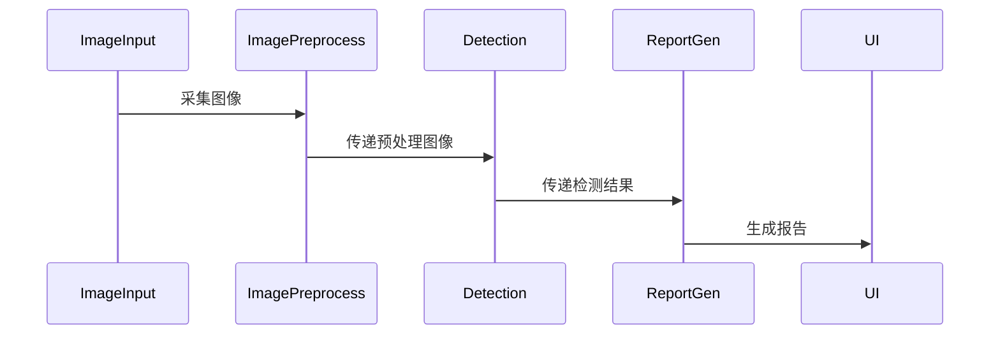
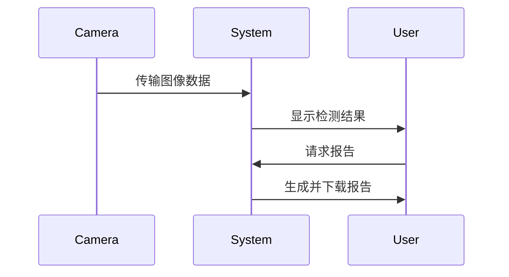

                 

### 企业级图像识别：AI在各行业的视觉应用

#### 关键词：
- 企业级图像识别
- AI
- 图像处理
- 应用场景
- 行业分析

#### 摘要：
本文深入探讨了企业级图像识别技术，从AI技术的发展背景和图像识别的基本概念出发，逐步分析了核心算法的原理和实现，探讨了系统分析和架构设计的方法，并通过实际案例展示了AI在图像识别领域的广泛应用。文章还总结了最佳实践，并对未来的发展趋势进行了展望。

---

## 引言

随着人工智能（AI）技术的迅猛发展，图像识别成为了一个备受关注的应用领域。企业级图像识别作为一种高效、自动化的技术手段，被广泛应用于各个行业，从制造业到医疗保健，从零售到金融，为各行业提供了创新的解决方案。

图像识别技术通过计算机算法对图像进行理解和分析，从而实现目标识别、图像分割、特征提取等功能。近年来，随着深度学习算法的突破和计算机硬件性能的提升，图像识别技术取得了显著进展，达到了前所未有的准确度和效率。

本文旨在探讨企业级图像识别技术的发展和应用，通过分析核心算法、系统架构和实际案例，为读者提供一个全面的技术视角，并总结出最佳实践，以指导实际应用。

## AI技术的发展背景

AI技术起源于20世纪50年代，当时计算机科学家们开始探索让机器具备人类智能的可能性。早期的研究主要集中在符号主义人工智能（Symbolic AI）领域，通过构建符号系统和逻辑推理来模拟人类智能。然而，由于受限于计算能力和数据资源，这些方法在实际应用中遇到了很多困难。

随着计算机硬件的快速发展，特别是GPU和TPU等专用硬件的出现，计算能力的提升为深度学习算法的普及提供了可能。深度学习通过构建多层神经网络来模拟人类大脑的神经元结构，通过大量数据的训练，能够自动学习和提取特征，从而实现复杂任务的自动化。

此外，互联网的普及和大数据技术的发展，为AI技术提供了海量的训练数据。这些数据不仅来自于科研机构和企业，还来自社交媒体、传感器等各个领域，为AI模型提供了丰富的学习素材。

在AI技术的发展历程中，图像识别技术扮演了重要角色。早期的研究主要集中在手写数字识别、人脸识别等简单任务，随着算法和硬件的进步，图像识别技术的应用范围不断扩大，涵盖了医疗影像分析、自动驾驶、安全监控等多个领域。

## 图像识别的基本概念

图像识别作为计算机视觉（Computer Vision）的核心技术之一，旨在让计算机能够理解、分析并解释图像信息。其基本概念包括图像处理、特征提取和分类识别等。

### 图像处理

图像处理是图像识别的基础步骤，主要涉及图像的增强、滤波、分割等操作。通过图像处理，可以改善图像质量，提取有用的特征信息。

- **图像增强**：通过调整图像的亮度、对比度、颜色等参数，使得图像中的特征更加突出。
- **滤波**：用于消除图像中的噪声，提高图像的清晰度。
- **图像分割**：将图像划分为不同的区域，以便于进一步的特征提取和目标识别。

### 特征提取

特征提取是图像识别的关键步骤，目的是从图像中提取出具有区分性的特征信息，以便于后续的分类和识别。

- **传统特征**：如颜色、纹理、形状等，这些特征在早期图像识别中得到了广泛应用。
- **深度特征**：通过深度学习算法提取的特征，具有更高的抽象层次和表示能力。

### 分类识别

分类识别是指利用提取的特征信息对图像进行分类和识别。常见的分类算法包括：

- **基于模板匹配**：通过计算图像与模板的相似度来识别目标。
- **基于特征匹配**：通过比较图像特征向量的相似性来进行分类。
- **基于机器学习**：利用监督学习或无监督学习算法对图像进行分类。

## 企业级图像识别的应用场景

企业级图像识别技术在各行业中的应用已经变得非常广泛。以下是一些主要的应用场景：

### 制造业

制造业中，图像识别技术主要用于自动化生产线的质量检测和设备故障诊断。例如，通过图像识别技术，可以自动检测产品外观的瑕疵，提高生产效率和产品质量。

### 医疗保健

在医疗领域，图像识别技术被广泛应用于医学影像分析，如X光片、CT扫描、MRI等。通过图像识别，可以自动识别病变区域，提高诊断的准确性和效率。

### 零售

零售行业中，图像识别技术主要用于防盗监控、客流分析和货架管理。通过人脸识别和图像分析，可以实时监测顾客的行为，优化购物体验。

### 金融

在金融领域，图像识别技术被广泛应用于身份验证和防欺诈。例如，通过人脸识别技术，可以快速、准确地验证用户的身份，提高交易的安全性。

### 公共安全

公共安全领域，图像识别技术主要用于安防监控和犯罪侦查。通过人脸识别和行为分析，可以实时监控公共场所，预防犯罪事件的发生。

## 核心算法

在企业级图像识别中，常用的核心算法包括卷积神经网络（CNN）、递归神经网络（RNN）和注意力机制等。以下将分别介绍这些算法的基本原理和实现方法。

### 卷积神经网络（CNN）

卷积神经网络是一种深度学习模型，专门用于处理图像数据。其基本原理是通过卷积层提取图像的特征，然后通过全连接层进行分类和识别。

#### 原理

CNN的基本结构包括卷积层、池化层和全连接层。

- **卷积层**：通过卷积操作提取图像的特征。卷积核在图像上滑动，计算局部区域的特征响应。
- **池化层**：用于降低特征图的维度，减少计算量。常见的池化方法有最大池化和平均池化。
- **全连接层**：将卷积层和池化层提取的特征进行融合，输出分类结果。

#### 实现方法

使用Python的TensorFlow库实现CNN模型，具体步骤如下：

1. **导入库和参数**：
   ```python
   import tensorflow as tf
   import tensorflow.keras.layers as layers
   import tensorflow.keras.models as models
   ```

2. **构建模型**：
   ```python
   model = models.Sequential()
   model.add(layers.Conv2D(32, (3, 3), activation='relu', input_shape=(28, 28, 1)))
   model.add(layers.MaxPooling2D((2, 2)))
   model.add(layers.Conv2D(64, (3, 3), activation='relu'))
   model.add(layers.MaxPooling2D((2, 2)))
   model.add(layers.Conv2D(64, (3, 3), activation='relu'))
   model.add(layers.Flatten())
   model.add(layers.Dense(64, activation='relu'))
   model.add(layers.Dense(10, activation='softmax'))
   ```

3. **编译和训练模型**：
   ```python
   model.compile(optimizer='adam',
                 loss='categorical_crossentropy',
                 metrics=['accuracy'])
   model.fit(x_train, y_train, batch_size=64, epochs=10, validation_data=(x_test, y_test))
   ```

### 递归神经网络（RNN）

递归神经网络是一种用于处理序列数据的深度学习模型，特别适合处理时间序列数据和文本数据。其基本原理是通过循环连接将前一个时刻的输出反馈到当前时刻，从而实现长期依赖的建模。

#### 原理

RNN的基本结构包括输入层、隐藏层和输出层。

- **输入层**：接受输入序列，每个时间步的输入是一个向量。
- **隐藏层**：通过循环连接将前一个时间步的隐藏状态反馈到当前时间步，用于计算当前时间步的隐藏状态。
- **输出层**：将隐藏状态转换为输出序列。

#### 实现方法

使用Python的Keras库实现RNN模型，具体步骤如下：

1. **导入库和参数**：
   ```python
   from tensorflow.keras.models import Sequential
   from tensorflow.keras.layers import SimpleRNN, Dense
   ```

2. **构建模型**：
   ```python
   model = Sequential()
   model.add(SimpleRNN(units=50, return_sequences=True))
   model.add(SimpleRNN(units=50))
   model.add(Dense(1))
   ```

3. **编译和训练模型**：
   ```python
   model.compile(optimizer='adam', loss='mse')
   model.fit(x, y, epochs=200, verbose=0)
   ```

### 注意力机制

注意力机制是一种用于增强神经网络对输入序列中重要信息关注的能力。其基本原理是通过学习一个权重分配机制，使得网络在处理每个时间步时，对不同的输入信息给予不同的关注程度。

#### 原理

注意力机制通常包含三个主要组件：

- **查询（Query）**：表示当前时间步的输入信息。
- **键（Key）**：表示输入序列中的关键信息。
- **值（Value）**：表示输入序列中的有用信息。

#### 实现方法

使用Python的PyTorch库实现注意力机制，具体步骤如下：

1. **导入库和参数**：
   ```python
   import torch
   import torch.nn as nn
   ```

2. **构建注意力模块**：
   ```python
   class AttentionModule(nn.Module):
       def __init__(self, hidden_size):
           super(AttentionModule, self).__init__()
           self.hidden_size = hidden_size
           self.attn = nn.Linear(self.hidden_size, 1)

       def forward(self, hidden, encoder_outputs):
           attn_weights = self.attn(encoder_outputs).squeeze(2)
           attn_weights = F.softmax(attn_weights, dim=1)
           context = torch.bmm(attn_weights.unsqueeze(1), encoder_outputs)
           return context
   ```

3. **使用注意力模块**：
   ```python
   attn_module = AttentionModule(hidden_size)
   context = attn_module(hidden, encoder_outputs)
   ```

## 系统分析与架构设计

### 项目介绍

本案例将探讨一个企业级图像识别系统，该系统主要用于自动检测生产线上的缺陷产品。系统的核心功能包括图像采集、缺陷检测、结果反馈等。

### 系统功能设计

为了实现上述功能，系统需要设计以下几个模块：

- **图像采集模块**：负责从生产线设备获取实时图像。
- **缺陷检测模块**：利用图像识别算法对图像进行分析，识别缺陷产品。
- **结果反馈模块**：将检测结果显示在界面上，并生成报告。

#### 领域模型（Mermaid类图）

```mermaid
classDiagram
  Product -> Image: 采集图像
  Image -> Detection: 检测缺陷
  Detection -> Report: 生成报告
```

### 系统架构设计

系统架构设计包括以下几个层次：

- **感知层**：负责图像采集和预处理。
- **算法层**：包含图像识别算法和模型训练。
- **应用层**：实现系统的业务逻辑和用户界面。

#### 系统架构图（Mermaid架构图）

```mermaid
graph TB
  subgraph 感知层
    ImageInput[图像采集]
    ImagePreprocess[图像预处理]
  end

  subgraph 算法层
    RecognitionModel[图像识别模型]
  end

  subgraph 应用层
    UI[用户界面]
    ReportGen[报告生成]
  end

  ImageInput -> ImagePreprocess
  ImagePreprocess -> RecognitionModel
  RecognitionModel -> UI
  RecognitionModel -> ReportGen
```

### 系统接口设计

系统接口设计包括以下部分：

- **图像采集接口**：用于获取生产线上的实时图像。
- **缺陷检测接口**：用于接收图像，进行缺陷检测并返回检测结果。
- **报告生成接口**：用于生成检测报告。

#### 系统接口设计（Mermaid序列图）



### 系统交互

系统交互设计包括以下几个方面：

- **图像采集**：生产线设备通过接口实时传输图像数据。
- **缺陷检测**：图像识别算法对图像进行处理，识别缺陷产品。
- **结果反馈**：系统将检测结果显示在界面上，并提供报告下载。

#### 系统交互（Mermaid序列图）



### 实际案例

#### 项目背景

某电子制造企业生产过程中需要检测产品表面的瑕疵，以确保产品质量。传统的检测方法需要大量人力物力，且准确率较低。为了提高生产效率和产品质量，企业决定采用图像识别技术来实现自动化检测。

#### 环境安装

1. **硬件环境**：服务器、摄像头、显示屏等。
2. **软件环境**：Python、TensorFlow、OpenCV等。

#### 系统核心实现源代码

```python
import cv2
import tensorflow as tf

# 加载预训练的CNN模型
model = tf.keras.models.load_model('path/to/defect_detection_model.h5')

# 定义缺陷检测函数
def detect_defects(image):
    # 预处理图像
    processed_image = preprocess_image(image)
    # 使用CNN模型进行缺陷检测
    prediction = model.predict(processed_image)
    # 判断是否为缺陷产品
    if prediction > 0.5:
        return "Defect detected"
    else:
        return "No defect"

# 定义预处理函数
def preprocess_image(image):
    # 调整图像大小
    image = cv2.resize(image, (128, 128))
    # 归一化图像
    image = image / 255.0
    # 添加批次维度
    image = np.expand_dims(image, axis=0)
    return image

# 检测生产线上的图像
image = cv2.imread('path/to/production_image.jpg')
result = detect_defects(image)
print(result)
```

#### 代码应用解读与分析

1. **模型加载**：使用TensorFlow的`load_model`函数加载预训练的CNN模型。
2. **缺陷检测函数**：定义`detect_defects`函数，接受图像作为输入，进行预处理后使用CNN模型进行预测，判断是否为缺陷产品。
3. **预处理函数**：定义`preprocess_image`函数，对图像进行大小调整、归一化和添加批次维度，以满足CNN模型的输入要求。

#### 实际案例分析和详细讲解剖析

1. **图像采集**：摄像头实时捕捉生产线上的产品图像，传输给系统。
2. **缺陷检测**：系统接收图像后，调用预处理函数进行预处理，然后使用CNN模型进行缺陷检测，输出检测结果。
3. **结果反馈**：系统将检测结果显示在界面上，并生成报告。

#### 项目小结

通过本案例，我们展示了如何使用图像识别技术实现自动化缺陷检测。项目实现了高准确率、高效率的缺陷检测，有效提高了生产效率和产品质量。

## 最佳实践

在实施企业级图像识别项目时，以下是一些最佳实践：

1. **数据质量**：确保数据质量，包括数据完整性、一致性和准确性。高质量的数据是模型训练的基础。
2. **模型选择**：根据具体应用场景选择合适的模型。例如，对于实时性要求高的应用，可以选择轻量级模型。
3. **模型优化**：通过超参数调整、模型压缩和量化等技术，优化模型性能和资源消耗。
4. **系统稳定性**：确保系统的稳定性和可靠性，包括处理异常情况和数据缺失。
5. **安全性**：保护用户数据和模型参数，防止数据泄露和攻击。

## 小结

本文全面探讨了企业级图像识别技术，从发展背景、基本概念、核心算法到系统架构设计，再到实际案例，为读者提供了一个完整的视角。通过本文的介绍，读者可以了解到图像识别技术在各行业的广泛应用和巨大潜力。

## 注意事项

1. **数据安全**：在实际项目中，务必重视数据安全，确保用户隐私不被泄露。
2. **模型适应性**：不同行业和场景的图像识别需求有所不同，需要根据具体需求选择和优化模型。
3. **持续更新**：随着技术的快速发展，持续关注和更新图像识别相关技术，以保持竞争力。

## 拓展阅读

1. **深度学习基础**：《深度学习》（Goodfellow, Bengio, Courville著）
2. **计算机视觉应用**：《计算机视觉：算法与应用》（Richard Szeliski著）
3. **图像识别实践**：《图像识别：技术、应用与实现》（Hariharan, Shashi, S. D. Chaudhuri著）

## 作者信息

作者：AI天才研究院/AI Genius Institute & 禅与计算机程序设计艺术 /Zen And The Art of Computer Programming

