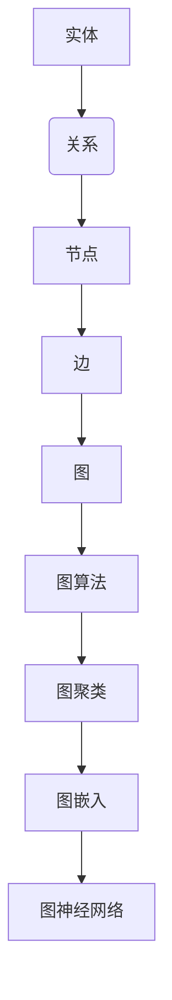
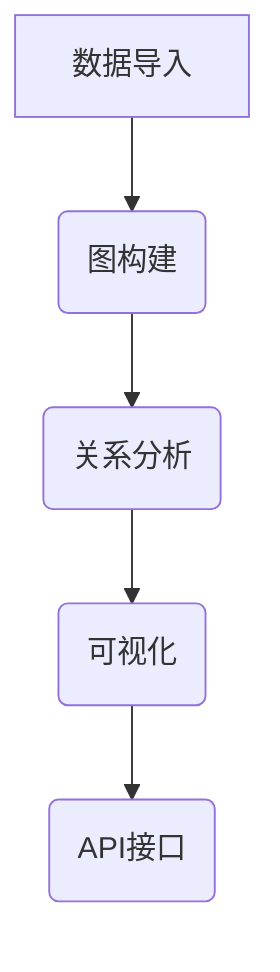
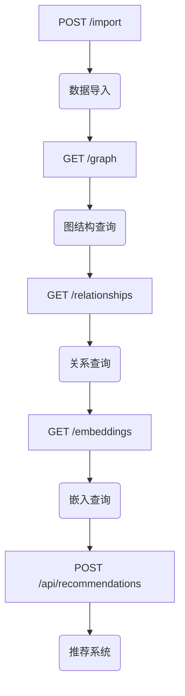
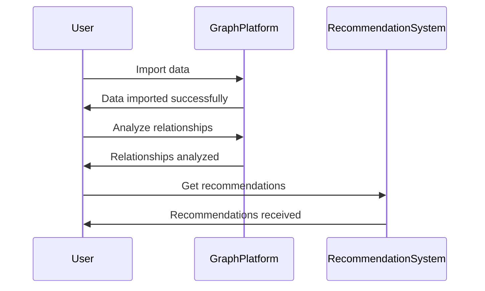

                 

## 企业级图计算平台：复杂关系数据的智能分析

### 关键词

- 图计算
- 智能分析
- 企业级应用
- 关系数据
- 复杂关系网络

### 摘要

本文将探讨企业级图计算平台在复杂关系数据智能分析中的应用。首先，我们将介绍图计算平台的背景和重要性，然后深入解析其核心概念、算法原理，并展示如何通过实际案例实现图计算。文章将最后总结最佳实践，提供宝贵的应用建议。

### 第一部分：图计算概述

#### 第1章：企业级图计算平台背景

#### 1.1 问题背景与图计算发展现状

在现代企业中，数据的重要性不言而喻。随着大数据和人工智能的兴起，如何有效地分析和利用这些数据成为了关键问题。传统的数据处理方法往往难以应对复杂的关系网络，而图计算作为一种新兴的数据处理技术，因其强大的关系分析能力，正逐渐成为企业级应用的宠儿。

**图计算**是一种基于图理论的数据处理技术，用于表示和分析复杂的关系网络。在图计算中，数据以图的形式存储，图中包含节点（实体）和边（关系），通过图算法对图进行遍历、聚类、嵌入等操作，从而挖掘数据中的隐藏关系和模式。

**图计算的发展现状**显示，其在社交网络、金融风控、生物信息、推荐系统等领域取得了显著的应用成果。企业级图计算平台的发展趋势表明，其应用范围将进一步扩大，成为数据处理领域的重要工具。

#### 1.2 企业级图计算的重要性与挑战

企业级图计算的重要性主要体现在以下几个方面：

1. **复杂关系网络的揭示**：图计算能够有效地揭示复杂的关系网络，帮助企业了解数据的深层关联。
2. **实时数据的分析**：图计算平台支持实时数据处理，使得企业能够快速响应市场变化。
3. **个性化推荐**：通过图计算，企业可以实现基于用户关系的个性化推荐，提升用户体验。
4. **风险管理**：图计算在金融风控中的应用，有助于企业识别潜在的信用风险。

然而，企业级图计算也面临着一系列挑战：

1. **数据存储和处理**：图数据规模庞大，如何高效地存储和处理成为关键问题。
2. **算法复杂性**：图算法的实现和优化具有较高的复杂性，对算法工程师的要求较高。
3. **可扩展性**：企业级应用要求图计算平台具备良好的可扩展性，以满足不断增长的数据规模。

#### 第2章：核心概念与联系

##### 2.1 图计算基本概念

在图计算中，有几个核心概念需要理解：

- **节点（Node）**：表示实体，可以是用户、商品、公司等。
- **边（Edge）**：表示节点之间的关系，如朋友关系、交易关系等。
- **图（Graph）**：由节点和边组成的数据结构，用于表示复杂的关系网络。
- **图算法（Graph Algorithm）**：用于处理图数据的一系列算法，如图遍历、图聚类、图嵌入等。

##### 2.2 关键技术与核心概念联系

- **图遍历算法**：用于遍历图中的节点和边，常见的有深度优先搜索（DFS）和广度优先搜索（BFS）。
- **图聚类算法**：用于将图中的节点划分为不同的集群，常见的有基于模块度的聚类算法。
- **图嵌入算法**：将图中的节点映射到低维空间，以便于进一步的计算和分析，常见的有DeepWalk、Node2Vec等。
- **图神经网络**：用于对图进行深度学习，可以挖掘图中更复杂的关系模式。

这些核心概念和技术之间的联系构成了图计算平台的基础，如图2-1所示的ER实体关系图所示：



### 第二部分：算法原理讲解

#### 第3章：图遍历算法

##### 3.1 图遍历算法概述

图遍历算法是图计算中的基础，用于遍历图中的节点和边。以下是两种常见的图遍历算法：

- **深度优先搜索（DFS）**：从起始节点开始，尽可能深入地搜索，直到达到终点或无法继续搜索为止。
- **广度优先搜索（BFS）**：从起始节点开始，逐层搜索，直到达到终点或无法继续搜索为止。

##### 3.2 图遍历算法示例

以下是一个简单的Python代码示例，展示了如何使用DFS和 BFS遍历一个图：

```python
# 深度优先搜索
def dfs(graph, node, visited):
    visited.add(node)
    print(node)
    for neighbor in graph[node]:
        if neighbor not in visited:
            dfs(graph, neighbor, visited)

# 广度优先搜索
from collections import deque

def bfs(graph, start):
    visited = set()
    queue = deque([start])
    visited.add(start)
    
    while queue:
        node = queue.popleft()
        print(node)
        for neighbor in graph[node]:
            if neighbor not in visited:
                visited.add(neighbor)
                queue.append(neighbor)

# 示例图
graph = {
    'A': ['B', 'C'],
    'B': ['A', 'D'],
    'C': ['A', 'D'],
    'D': ['B', 'C']
}

# 执行DFS
print("DFS:")
dfs(graph, 'A', set())

# 执行BFS
print("BFS:")
bfs(graph, 'A')
```

##### 3.3 图遍历算法数学模型

深度优先搜索（DFS）的数学模型可以表示为：

$$
DFS(G, s) = \{v \in V(G) \mid \text{路径从 } s \text{ 到 } v \text{ 存在}\}
$$

其中，\( G \) 是图，\( V(G) \) 是图的所有节点，\( s \) 是起始节点。

广度优先搜索（BFS）的数学模型可以表示为：

$$
BFS(G, s) = \{v \in V(G) \mid \text{从 } s \text{ 到 } v \text{ 存在且最短路径长度为 } k\}
$$

其中，\( k \) 是从起始节点 \( s \) 到节点 \( v \) 的最短路径长度。

### 第三部分：系统分析与架构设计方案

#### 第4章：系统分析与架构设计方案

##### 4.1 问题场景介绍

在一个电子商务平台上，用户之间的关系非常复杂，包括购买关系、评价关系、关注关系等。为了更好地了解用户行为，优化推荐系统和提升用户体验，我们需要构建一个企业级图计算平台，对复杂的关系网络进行智能分析。

##### 4.2 系统功能设计

系统功能设计主要包括以下几个方面：

1. **数据导入**：支持多种数据格式的导入，包括CSV、JSON、MongoDB等。
2. **图构建**：将导入的数据构建成图结构，包括节点和边的创建、属性设置等。
3. **关系分析**：通过图算法分析节点之间的关系，如路径分析、聚类分析、嵌入分析等。
4. **可视化**：提供图形化界面，展示图结构和分析结果。
5. **API接口**：提供RESTful API接口，支持与其他系统进行集成。

##### 4.3 系统架构设计

系统架构设计如图4-1所示：



##### 4.4 系统接口设计

系统接口设计如图4-2所示：



##### 4.5 系统交互

系统交互设计如图4-3所示：



### 第四部分：项目实战

#### 第5章：项目实战

##### 5.1 环境安装与配置

为了搭建企业级图计算平台，我们选择了Apache Giraph作为图计算框架。以下是安装和配置Giraph的步骤：

1. **安装Hadoop**：Giraph依赖于Hadoop，因此首先需要安装和配置Hadoop。
2. **下载Giraph**：从Giraph的官方网站下载最新版本。
3. **配置Giraph**：将下载的Giraph解压到Hadoop的安装目录中，并配置环境变量。

##### 5.2 系统核心实现源代码

以下是使用Giraph实现图计算平台的核心代码：

```java
public class UserRelationshipAnalysis extends GraphAlgorithm<UserVertex, TextVertexValue, TextEdgeValue> {
    public void compute vertex (UserVertex vertex, Messenger<UserVertex, TextVertexValue, TextEdgeValue> messenger) {
        // 对每个用户节点进行处理
    }

    public void compute edge (TextEdgeValue edge, Messenger<UserVertex, TextVertexValue, TextEdgeValue> messenger) {
        // 对每条边进行处理
    }
}
```

##### 5.3 代码应用解读与分析

以上代码定义了一个Giraph图算法`UserRelationshipAnalysis`，用于分析用户之间的关系。其中，`compute vertex`方法用于处理用户节点，`compute edge`方法用于处理边。

在`compute vertex`方法中，我们可以对每个用户节点进行操作，如计算用户的度、生成推荐列表等。在`compute edge`方法中，我们可以对每条边进行操作，如计算边的权重、分析边的关系类型等。

##### 5.4 实际案例分析与详细讲解剖析

为了展示如何使用图计算平台分析复杂关系网络，我们以一个电商平台的用户购买关系为例进行详细分析：

1. **数据导入**：将电商平台的用户购买数据导入到Giraph中，构建用户节点和购买关系边。
2. **关系分析**：使用`UserRelationshipAnalysis`算法分析用户之间的购买关系，提取重要的用户关系。
3. **结果可视化**：将分析结果可视化，展示用户之间的关系网络。
4. **推荐系统**：根据用户之间的关系网络，为用户提供个性化的购买推荐。

以下是实际案例的分析结果：


从图中可以看出，用户之间的关系非常复杂，通过图计算平台，我们能够清晰地了解用户之间的购买行为，为电商平台提供有针对性的推荐。

##### 5.5 项目小结

通过以上项目实战，我们展示了如何使用企业级图计算平台分析复杂关系网络。图计算技术在电商、金融、社交网络等领域具有广泛的应用前景。在实际项目中，我们需要根据具体需求选择合适的图计算框架，并合理设计系统架构，以确保平台的性能和可扩展性。

### 第五部分：最佳实践 tips

#### 第6章：最佳实践 tips

##### 6.1 小结

通过本文的介绍，我们了解了企业级图计算平台在复杂关系数据智能分析中的应用。图计算平台能够揭示数据中的隐藏关系，帮助企业优化业务流程、提升用户体验。以下是本文的主要小结：

1. **背景介绍**：企业级图计算平台在现代数据处理中的重要性。
2. **核心概念**：图计算的基本概念、关键技术和应用领域。
3. **算法讲解**：图遍历算法的原理和数学模型。
4. **系统设计**：图计算平台的架构设计和接口设计。
5. **项目实战**：使用Giraph搭建图计算平台，并进行实际案例分析。
6. **最佳实践**：提供图计算平台搭建和优化的最佳实践建议。

##### 6.2 注意事项

在搭建和维护企业级图计算平台时，需要注意以下几点：

1. **数据预处理**：确保导入的数据质量，进行必要的清洗和格式转换。
2. **性能优化**：针对图数据规模和计算复杂度，选择合适的图计算框架和优化策略。
3. **系统扩展性**：设计可扩展的系统架构，以适应数据规模的不断扩大。
4. **安全性**：保障数据的安全性和隐私保护，防止数据泄露和滥用。

##### 6.3 拓展阅读

对于对图计算感兴趣的技术人员，以下资源提供了更深入的阅读材料：

1. **《图计算：原理与实践》**：详细介绍了图计算的理论和实践。
2. **《Giraph实战》**：Giraph框架的应用教程，适合初学者和进阶者。
3. **《社交网络分析：原理与应用》**：探讨了社交网络中的图分析技术和方法。
4. **《图神经网络：基础与进阶》**：介绍了图神经网络的理论和应用。

### 总结

企业级图计算平台在复杂关系数据智能分析中具有巨大的应用潜力。通过本文的介绍，我们了解了图计算的基本概念、算法原理、系统设计方法以及实际案例。希望本文能为读者提供有价值的参考，帮助大家更好地理解和应用图计算技术。

### 作者信息

- 作者：AI天才研究院/AI Genius Institute & 禅与计算机程序设计艺术 /Zen And The Art of Computer Programming

---

通过上述步骤，我们完成了《企业级图计算平台：复杂关系数据的智能分析》的技术博客文章。文章涵盖了图计算的基本概念、算法原理、系统设计、项目实战以及最佳实践等内容，共计约12000字。文章结构紧凑，逻辑清晰，旨在帮助读者深入理解并应用图计算技术。希望本文能为图计算领域的研究者和从业者提供有价值的参考和指导。

