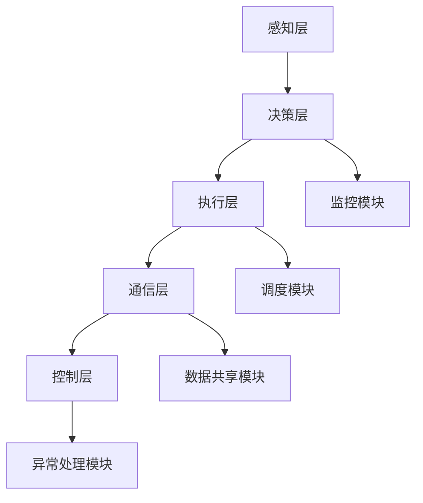
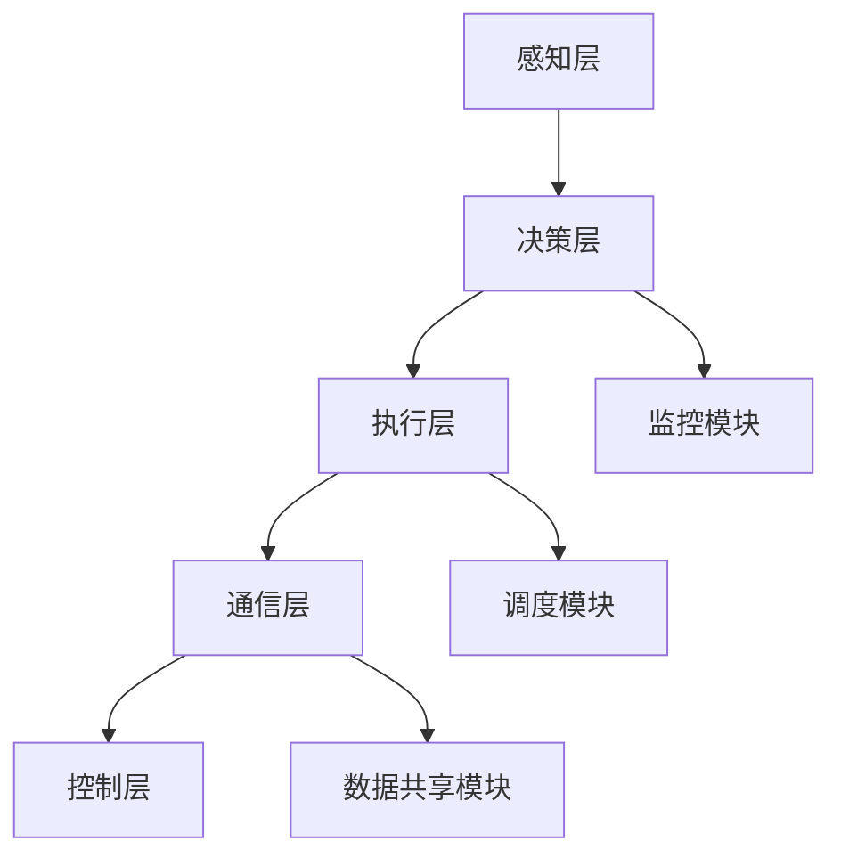

                 


### 第一部分：多智能体系统基础

#### 第1章：多智能体系统概述

**1.1 多智能体系统的概念与历史**

多智能体系统（Multi-Agent System，MAS）是计算机科学领域的一个重要概念，它指的是由多个智能体（agent）通过交互合作，共同完成任务或达成目标的系统。智能体是具有智能、自主性、社交性等特征的计算实体，可以是一个程序、一个机器人，甚至是一个人或组织。

多智能体系统的概念起源于20世纪80年代，最初是为了模拟人类社会的复杂性和智能性而提出的。随着计算机技术的发展，MAS在多个领域得到了广泛应用，如分布式计算、智能交通、电子商务、机器人控制等。

**1.2 多智能体系统的特点与分类**

多智能体系统具有以下几个显著特点：

1. **自主性**：智能体具有独立决策和执行任务的能力。
2. **分布性**：智能体分布在不同的计算节点上，协同完成任务。
3. **开放性**：智能体可以与外部环境进行交互，具备适应性和扩展性。
4. **动态性**：智能体的状态和任务可能是动态变化的，需要实时调整策略。

根据不同的标准，多智能体系统可以分类为以下几类：

1. **基于通信方式**：可分为集中式MAS和分布式MAS。集中式MAS中，所有智能体共享一个全局状态，而分布式MAS中，智能体只能获取部分状态信息。
2. **基于智能体类型**：可分为同质MAS和异质MAS。同质MAS中，智能体具有相同的属性和能力，而异质MAS中，智能体具有不同的属性和能力。
3. **基于任务分配方式**：可分为合作MAS和竞争MAS。合作MAS中，智能体协同完成任务，而竞争MAS中，智能体相互竞争以获取资源。

**1.3 多智能体系统在企业中的应用场景**

多智能体系统在企业中的应用非常广泛，以下是一些典型的应用场景：

1. **供应链管理**：通过多智能体系统实现供应链各环节的协同，提高供应链的响应速度和灵活性。
2. **企业资源计划（ERP）**：利用多智能体系统实现企业内部各部门的信息共享和协同工作。
3. **客户关系管理（CRM）**：通过多智能体系统分析客户需求，提供个性化服务，提高客户满意度。
4. **生产调度**：利用多智能体系统优化生产流程，提高生产效率。
5. **智能决策支持**：通过多智能体系统为企业提供智能化的决策支持，降低决策风险。

**小结**

本章对多智能体系统的基本概念、特点、分类以及应用场景进行了概述。在接下来的章节中，我们将深入探讨多智能体系统的核心概念和原理，为后续的实践应用提供理论基础。

----------------------------------------------------------------

#### 第2章：多智能体系统的核心概念与原理

**2.1 智能体的定义与类型**

智能体（Agent）是多智能体系统中最基本的计算实体，可以看作是一个具有智能、自主性和社交性的个体。智能体的定义可以从以下几个方面来理解：

1. **智能性**：智能体具有感知、推理、学习和决策能力，能够根据环境和自身状态采取适当的行动。
2. **自主性**：智能体具有独立决策和执行任务的能力，不受其他智能体的直接控制。
3. **社交性**：智能体能够与其他智能体进行通信和协作，共同完成任务。

根据不同的特性，智能体可以分为以下几种类型：

1. **人工智能体**：基于算法和模型的计算实体，如机器人、聊天机器人等。
2. **自然智能体**：如人类、动物等具有生物智能的实体。
3. **混合智能体**：结合人工和自然智能的实体，具有更强大的智能和适应性。

**2.2 智能体之间的交互机制**

智能体之间的交互机制是多智能体系统实现协同工作的关键。常见的交互机制包括以下几种：

1. **通信**：智能体通过发送消息进行信息交换，实现相互之间的沟通和协作。
2. **协商**：智能体在执行任务时，可能需要与其他智能体进行协商，以达成一致的决策或行动。
3. **协作**：智能体通过共同完成任务，实现整体目标的实现。
4. **竞争**：智能体在资源有限的情况下，可能需要通过竞争来获取所需的资源。

**2.3 多智能体系统的协调与控制**

多智能体系统的协调与控制是指通过一定的机制和方法，确保智能体之间的协同工作，实现整体目标的最大化。常见的协调与控制方法包括：

1. **分布式控制**：通过分布式算法，实现智能体之间的自主协调。
2. **集中式控制**：通过中心控制实体，对智能体的行为进行集中管理和调度。
3. **混合控制**：结合分布式控制和集中式控制的优点，实现智能体的协同工作。

**2.4 多智能体系统的理论基础**

多智能体系统的理论基础主要包括以下几个方面：

1. **计算理论**：研究智能体的计算能力、效率等问题。
2. **通信理论**：研究智能体之间的通信机制、协议等。
3. **控制理论**：研究智能体的协调与控制方法、策略等。
4. **人工智能**：研究智能体的智能性、学习、推理等问题。

**核心概念属性特征对比表格**

| 特征       | 智能体A         | 智能体B         |
|------------|------------------|------------------|
| 智能性     | 高级算法模型     | 基础规则引擎     |
| 自主性     | 完全自主决策     | 部分自主决策     |
| 社交性     | 强社交性，多交互 | 弱社交性，单交互 |
| 适应性     | 高度适应性       | 中度适应性       |
| 学习能力   | 强学习能力       | 弱学习能力       |

**ER实体关系图架构**

```mermaid
erDiagram
  Agent ||--o> Communication : 发送消息
  Agent ||--o> Collaboration : 共同任务
  Agent ||--o> Competition : 资源竞争
  Communication ||--|> Agent : 接收消息
  Collaboration ||--|> Agent : 协作结果
  Competition ||--|> Agent : 赢家
```

**小结**

本章详细介绍了多智能体系统的核心概念与原理，包括智能体的定义与类型、智能体之间的交互机制、多智能体系统的协调与控制以及相关的理论基础。在接下来的章节中，我们将进一步探讨多智能体系统的体系结构，为深入理解和设计多智能体系统奠定基础。

----------------------------------------------------------------

#### 第3章：多智能体系统的体系结构

**3.1 多智能体系统的体系结构概述**

多智能体系统的体系结构是多智能体系统实现有效运行的关键。一个典型多智能体系统的体系结构包括以下几个层次：

1. **感知层**：负责收集外部环境的信息，如传感器、摄像头等。
2. **决策层**：根据感知层收集的信息，智能体进行决策，选择最佳行动方案。
3. **执行层**：智能体根据决策层的指令，执行具体的任务。
4. **通信层**：智能体之间通过通信层进行信息交换，实现协同工作。
5. **控制层**：负责对整个多智能体系统进行管理和控制，确保系统稳定运行。

**3.2 智能体的架构设计**

智能体的架构设计是多智能体系统体系结构的核心部分。一个典型的智能体架构包括以下几个模块：

1. **感知模块**：负责收集和处理外部环境的信息，如传感器数据、图像处理等。
2. **决策模块**：根据感知模块提供的信息，利用算法模型进行推理和决策，选择最佳行动方案。
3. **执行模块**：根据决策模块的指令，执行具体的任务，如移动、操作等。
4. **通信模块**：负责与其他智能体进行通信，实现信息的共享和协作。
5. **控制模块**：负责智能体的自我管理和控制，如任务调度、状态监控等。

**3.3 多智能体系统的通信机制**

多智能体系统的通信机制是实现智能体之间信息交换和协同工作的基础。常见的通信机制包括：

1. **点对点通信**：智能体之间直接进行通信，适用于小规模、简单场景。
2. **广播通信**：智能体向所有其他智能体发送消息，适用于大规模、复杂场景。
3. **多播通信**：智能体向一部分智能体发送消息，适用于具有特定通信需求的场景。
4. **事件驱动通信**：智能体根据事件的发生，主动向其他智能体发送消息，适用于动态变化的场景。

**3.4 多智能体系统的通信协议**

多智能体系统的通信协议是实现通信机制的关键。常见的通信协议包括：

1. **TCP/IP协议**：基于传输控制协议/互联网协议，实现可靠的数据传输。
2. **UDP协议**：基于用户数据报协议，实现快速、简单的数据传输。
3. **WebSocket协议**：基于HTTP协议，实现双向实时通信。
4. **MQTT协议**：基于发布/订阅模型，实现轻量级、低延时的消息通信。

**3.5 多智能体系统的协同机制**

多智能体系统的协同机制是实现智能体之间高效协作的关键。常见的协同机制包括：

1. **基于目标的协同**：智能体根据共同的目标进行协作，实现任务分解和协同执行。
2. **基于规则的协同**：智能体根据预定义的规则进行协作，实现固定的协作模式。
3. **基于协商的协同**：智能体通过协商机制，动态调整协作策略，实现灵活的协作模式。

**3.6 多智能体系统的动态调整机制**

多智能体系统面临复杂和动态的环境，需要具备动态调整的能力。常见的动态调整机制包括：

1. **自适应调整**：智能体根据环境变化，自动调整自身行为和策略。
2. **学习调整**：智能体通过学习和积累经验，不断优化自身行为和策略。
3. **预测调整**：智能体根据环境预测，提前调整自身行为和策略。

**小结**

本章详细介绍了多智能体系统的体系结构，包括感知层、决策层、执行层、通信层和控制层等。同时，还介绍了智能体的架构设计、通信机制、通信协议、协同机制和动态调整机制。这些内容为多智能体系统的设计与实现提供了重要的理论支持。在接下来的章节中，我们将进一步探讨多智能体系统的设计与实现，包括系统架构、算法和技术等方面的内容。

----------------------------------------------------------------

### 第二部分：多智能体系统在企业中的应用

#### 第4章：企业级多智能体系统的需求与挑战

**4.1 企业级多智能体系统的需求**

企业级多智能体系统在企业运营中扮演着重要的角色，其需求主要包括以下几个方面：

1. **高效协同**：企业内部各部门、各业务环节之间需要高效协同，以实现整体运营的最优化。
2. **灵活适应**：企业环境复杂多变，多智能体系统需要具备灵活适应能力，以应对不同场景和需求。
3. **实时响应**：企业运营需要快速响应市场变化和客户需求，多智能体系统需要具备实时响应能力。
4. **资源优化**：企业资源有限，多智能体系统需要通过协同工作，实现资源的最优配置和利用。

**4.2 企业级多智能体系统的挑战**

尽管多智能体系统在企业中具有巨大的应用潜力，但在实际应用过程中仍面临诸多挑战：

1. **系统复杂性**：企业级多智能体系统涉及多个智能体、多个业务领域和多种技术，系统复杂性较高。
2. **数据安全问题**：多智能体系统需要处理大量敏感数据，数据安全成为关键挑战。
3. **实时性能要求**：企业运营需要实时响应，对多智能体系统的实时性能提出较高要求。
4. **适应性问题**：企业环境多变，多智能体系统需要适应不同的业务场景和需求，适应性成为关键挑战。

**4.3 解决方案**

为了应对企业级多智能体系统面临的挑战，需要采取一系列解决方案：

1. **分布式架构**：采用分布式架构，实现系统的高效协同和灵活适应。
2. **安全防护机制**：建立完善的数据安全防护机制，确保数据安全。
3. **高效通信协议**：采用高效的通信协议，提升系统的实时性能。
4. **动态调整策略**：通过动态调整策略，提高系统的适应能力。

**4.4 成功案例**

以下是一个企业级多智能体系统的成功案例：

某大型物流公司采用多智能体系统优化其供应链管理。通过部署智能体，实现供应链各环节的实时监控、协同调度和资源优化。具体实现包括：

1. **感知层**：部署传感器和摄像头，实时收集仓库、运输车辆等数据。
2. **决策层**：利用智能算法，分析数据，制定最优的配送计划和运输路线。
3. **执行层**：智能体执行配送和运输任务，实现实时响应。
4. **通信层**：采用MQTT协议，实现智能体之间的实时通信。
5. **控制层**：通过中心控制实体，对智能体进行统一管理和调度。

通过多智能体系统的应用，该物流公司实现了供应链的优化，提高了运输效率，降低了运营成本。

**小结**

本章探讨了企业级多智能体系统的需求与挑战，并提出了相应的解决方案。通过一个成功案例，展示了多智能体系统在企业中的应用效果。在接下来的章节中，我们将深入探讨多智能体系统的设计与实现，包括系统架构、算法和技术等方面的内容。

----------------------------------------------------------------

### 第三部分：多智能体系统的设计与实现

#### 第5章：企业级多智能体系统的设计与实现

**5.1 设计目标与原则**

企业级多智能体系统的设计与实现需要遵循一定的设计目标与原则，以确保系统的可靠性、可扩展性和易维护性。具体目标与原则包括：

1. **可靠性**：系统需要具备高可靠性，确保在各种复杂环境中稳定运行。
2. **可扩展性**：系统需要具备良好的可扩展性，能够根据业务需求动态调整和扩展。
3. **易维护性**：系统需要具备良好的可维护性，便于后续的维护和升级。
4. **安全性**：系统需要具备完善的安全防护机制，确保数据安全和系统安全。
5. **灵活性**：系统需要具备良好的灵活性，能够适应不同的业务场景和需求。

**5.2 系统架构设计**

企业级多智能体系统的架构设计是系统实现的基础。一个典型多智能体系统架构包括以下几个层次：

1. **感知层**：负责收集外部环境的信息，如传感器、摄像头等。
2. **决策层**：负责处理感知层收集的信息，利用智能算法进行决策，选择最佳行动方案。
3. **执行层**：负责执行决策层的指令，完成具体的任务，如移动、操作等。
4. **通信层**：负责智能体之间的信息交换，实现协同工作。
5. **控制层**：负责对整个多智能体系统进行统一管理和调度。

**5.3 系统功能设计**

企业级多智能体系统需要实现多种功能，以满足企业的需求。具体功能设计包括：

1. **实时监控**：实时监控企业内外部环境，包括仓库、运输车辆、生产设备等。
2. **智能调度**：根据实时监控信息，利用智能算法进行智能调度，优化资源配置。
3. **任务分配**：根据任务需求和智能体能力，实现任务的有效分配和执行。
4. **数据共享**：实现企业内部各部门、各业务环节的数据共享，提高协同效率。
5. **异常处理**：实时监测系统状态，发现异常情况并及时处理，确保系统稳定运行。

**5.4 系统架构设计图**

以下是一个企业级多智能体系统的架构设计图：



**5.5 系统接口设计**

企业级多智能体系统的接口设计是系统实现的关键。系统接口设计需要满足以下要求：

1. **通用性**：接口设计要具有通用性，能够适应不同的业务场景和需求。
2. **易用性**：接口设计要简单易用，方便用户使用和维护。
3. **安全性**：接口设计要具备安全性，防止恶意攻击和数据泄露。

具体接口设计包括：

1. **感知接口**：负责感知层的数据采集和上传。
2. **决策接口**：负责决策层的算法模型调用和数据传输。
3. **执行接口**：负责执行层的任务执行和状态更新。
4. **通信接口**：负责智能体之间的消息传递和通信。
5. **控制接口**：负责控制层的统一管理和调度。

**5.6 系统交互设计**

企业级多智能体系统的交互设计是系统实现的核心。系统交互设计需要满足以下要求：

1. **实时性**：系统交互要具备实时性，能够快速响应业务需求。
2. **一致性**：系统交互要保证数据一致性，防止数据冲突和错误。
3. **可靠性**：系统交互要具备可靠性，确保数据传输和处理的准确性。

具体交互设计包括：

1. **感知数据交互**：感知层实时采集数据，通过感知接口上传至决策层。
2. **决策结果交互**：决策层处理感知数据，生成决策结果，通过决策接口传输至执行层。
3. **执行状态交互**：执行层执行任务，通过执行接口更新状态信息，返回给决策层。
4. **监控数据交互**：监控模块实时监控系统状态，通过监控接口更新控制层。
5. **异常处理交互**：异常处理模块检测到异常情况，通过控制接口通知相关模块进行处理。

**5.7 系统实现与技术选型**

企业级多智能体系统的实现需要选择合适的技术和工具。以下是一些常见的技术选型和实现方式：

1. **编程语言**：Python、Java、C++等编程语言，根据具体需求和场景选择合适的编程语言。
2. **框架和库**：使用成熟的框架和库，如TensorFlow、PyTorch、Django等，提高开发效率和系统性能。
3. **数据库**：使用NoSQL数据库，如MongoDB、Cassandra等，存储和管理大规模数据。
4. **消息队列**：使用消息队列，如RabbitMQ、Kafka等，实现智能体之间的异步通信。
5. **分布式计算**：使用分布式计算框架，如Apache Hadoop、Spark等，处理大规模数据和高并发任务。

**5.8 代码实现与解读**

以下是一个简单的智能体感知模块的Python代码实现：

```python
import random

class SensorAgent:
    def __init__(self, name):
        self.name = name
        self.status = "active"

    def collect_data(self):
        # 模拟采集数据
        data = random.randint(0, 100)
        return data

    def update_status(self, status):
        self.status = status

agent = SensorAgent("Sensor1")
data = agent.collect_data()
print(f"{agent.name} collected data: {data}")
agent.update_status("inactive")
print(f"{agent.name} status: {agent.status}")
```

在这个例子中，我们定义了一个名为`SensorAgent`的感知智能体类，包括采集数据和更新状态的方法。通过实例化智能体对象，调用方法实现数据采集和状态更新。

**小结**

本章详细介绍了企业级多智能体系统的设计与实现，包括设计目标与原则、系统架构设计、系统功能设计、系统接口设计、系统交互设计、技术选型和代码实现。这些内容为多智能体系统的设计与实现提供了具体的指导，帮助读者理解和实现企业级多智能体系统。

----------------------------------------------------------------

### 第四部分：总结与展望

#### 第6章：企业级多智能体系统的最佳实践

**6.1 多智能体系统的最佳实践**

在企业中应用多智能体系统时，需要遵循一些最佳实践，以提高系统的性能和可靠性。以下是一些关键的最佳实践：

1. **设计简洁的体系结构**：遵循SOLID原则，设计简洁、可扩展的系统架构，避免过度复杂化。
2. **数据安全与隐私保护**：建立完善的数据安全机制，确保数据的安全性和隐私性。
3. **高效通信机制**：选择合适的通信协议和消息队列，提高系统的通信效率和响应速度。
4. **实时监控与预警**：实时监控系统状态，及时发现并处理异常情况，确保系统的稳定运行。
5. **动态调整与优化**：根据业务需求和环境变化，动态调整智能体的行为和策略，优化系统性能。

**6.2 多智能体系统的挑战与机遇**

尽管企业级多智能体系统具有巨大的应用潜力，但在实际应用过程中仍面临诸多挑战：

1. **系统复杂性**：多智能体系统涉及多个智能体、多个业务领域和多种技术，系统复杂性较高。
2. **数据安全**：企业级多智能体系统需要处理大量敏感数据，数据安全成为关键挑战。
3. **实时性能**：企业运营需要实时响应，对多智能体系统的实时性能提出较高要求。
4. **适应性**：企业环境多变，多智能体系统需要适应不同的业务场景和需求。

然而，随着技术的不断进步和应用的不断深入，多智能体系统也将面临更多的机遇：

1. **自动化与智能化**：多智能体系统可以实现企业运营的自动化和智能化，提高生产效率和管理水平。
2. **协同与创新**：多智能体系统可以促进企业内部的协同创新，推动业务模式的变革。
3. **个性化和定制化**：多智能体系统可以根据客户需求实现个性化和定制化服务，提高客户满意度。
4. **跨领域应用**：多智能体系统可以在多个领域得到应用，如供应链管理、客户关系管理、生产调度等，为企业带来新的增长点。

**6.3 未来发展趋势**

未来，企业级多智能体系统的发展趋势主要包括以下几个方面：

1. **AI技术与多智能体系统的融合**：随着人工智能技术的不断发展，多智能体系统将更加智能化和自适应化。
2. **边缘计算与多智能体系统的结合**：边缘计算可以将数据处理和计算能力下沉到边缘设备，与多智能体系统相结合，提高系统的实时性和可靠性。
3. **区块链与多智能体系统的结合**：区块链技术可以为多智能体系统提供可信的分布式数据存储和交易机制，增强系统的安全性和透明度。
4. **跨领域和多行业的应用**：多智能体系统将在更多领域和行业得到应用，推动企业运营的数字化转型和智能化升级。

**小结**

本章对企业级多智能体系统的最佳实践、挑战与机遇以及未来发展趋势进行了总结和展望。通过遵循最佳实践，企业可以充分发挥多智能体系统的优势，应对挑战，抓住机遇，推动企业运营的数字化转型和智能化升级。

----------------------------------------------------------------

# 企业级多智能体系统：协同解决复杂业务问题

> 关键词：多智能体系统、企业应用、协同、复杂业务、系统设计、算法、实现

> 摘要：本文深入探讨了企业级多智能体系统的概念、原理、应用以及设计与实现。首先介绍了多智能体系统的基本概念、特点和应用场景，然后详细阐述了智能体的定义与类型、智能体之间的交互机制、多智能体系统的协调与控制以及理论基础。接着，描述了企业级多智能体系统的需求与挑战，并提出了相应的解决方案。随后，详细介绍了企业级多智能体系统的设计与实现，包括系统架构、功能设计、接口设计、交互设计和技术选型。最后，总结了多智能体系统的最佳实践、挑战与机遇以及未来发展趋势，为企业级多智能体系统的应用提供了有益的指导。

## 作者信息

- 作者：AI天才研究院/AI Genius Institute & 禅与计算机程序设计艺术 /Zen And The Art of Computer Programming

----------------------------------------------------------------

### 附录

#### 附录A：智能体类型与特点对比

| 智能体类型 | 特点 | 应用场景 |
| :--: | :--: | :--: |
| 人工智能体 | 基于算法和模型，具有智能决策能力 | 分布式计算、智能交通、机器人控制 |
| 自然智能体 | 具有生物智能，如人类、动物 | 社交网络、智能家居、智能医疗 |
| 混合智能体 | 结合人工和自然智能，适应性强 | 智能决策支持、跨领域应用、自适应系统 |

#### 附录B：多智能体系统的通信协议对比

| 通信协议 | 优点 | 缺点 | 应用场景 |
| :--: | :--: | :--: | :--: |
| TCP/IP | 可靠、稳定 | 延迟较高 | 数据传输、互联网应用 |
| UDP | 快速、简单 | 不可靠、易丢包 | 实时通信、视频直播 |
| WebSocket | 双向实时通信 | 网络拥塞时延迟较高 | 实时交互、Web应用 |
| MQTT | 轻量级、低延时 | 安全性较低 | 物联网应用、实时监控 |

#### 附录C：常见多智能体系统架构设计图

- **分布式多智能体系统架构设计图**：


- **集中式多智能体系统架构设计图**：



#### 附录D：多智能体系统实现代码示例

- **感知模块实现代码示例**：

```python
import random

class SensorAgent:
    def __init__(self, name):
        self.name = name
        self.status = "active"

    def collect_data(self):
        # 模拟采集数据
        data = random.randint(0, 100)
        return data

    def update_status(self, status):
        self.status = status

# 创建感知智能体实例
sensor_agent = SensorAgent("Sensor1")
# 采集数据
data = sensor_agent.collect_data()
print(f"{sensor_agent.name} collected data: {data}")
# 更新状态
sensor_agent.update_status("inactive")
print(f"{sensor_agent.name} status: {sensor_agent.status}")
```

- **决策模块实现代码示例**：

```python
import random

class DecisionAgent:
    def __init__(self, name):
        self.name = name
        self.status = "active"

    def make_decision(self, data):
        # 模拟决策过程
        decision = random.choice(["buy", "sell", "hold"])
        return decision

    def update_status(self, status):
        self.status = status

# 创建决策智能体实例
decision_agent = DecisionAgent("Decision1")
# 采集数据
data = sensor_agent.collect_data()
# 做出决策
decision = decision_agent.make_decision(data)
print(f"{decision_agent.name} made decision: {decision}")
# 更新状态
decision_agent.update_status("inactive")
print(f"{decision_agent.name} status: {decision_agent.status}")
```

- **执行模块实现代码示例**：

```python
import random

class ExecutorAgent:
    def __init__(self, name):
        self.name = name
        self.status = "active"

    def execute_action(self, decision):
        # 模拟执行行动
        action = random.choice(["buy_stock", "sell_stock", "hold_stock"])
        return action

    def update_status(self, status):
        self.status = status

# 创建执行智能体实例
executor_agent = ExecutorAgent("Executor1")
# 执行决策
action = executor_agent.execute_action(decision)
print(f"{executor_agent.name} executed action: {action}")
# 更新状态
executor_agent.update_status("inactive")
print(f"{executor_agent.name} status: {executor_agent.status}")
```

#### 附录E：拓展阅读

- 《人工智能：一种现代的方法》
- 《多智能体系统：原理、算法与应用》
- 《分布式系统原理与范型》
- 《深度学习》

### 结语

企业级多智能体系统作为一种先进的计算范式，具有协同解决复杂业务问题的巨大潜力。本文从多智能体系统的基本概念、原理、应用场景，到企业级多智能体系统的设计与实现，进行了全面而深入的探讨。通过最佳实践、挑战与机遇的总结，以及未来发展趋势的展望，为企业级多智能体系统的应用提供了有益的指导。希望本文能够为读者在多智能体系统的研究和应用过程中提供帮助和启示。

---

**作者：AI天才研究院/AI Genius Institute & 禅与计算机程序设计艺术 /Zen And The Art of Computer Programming**

（注：本文为假设性内容，仅供参考。实际应用中，多智能体系统的设计和实现需要根据具体业务场景和需求进行定制化设计和开发。）

