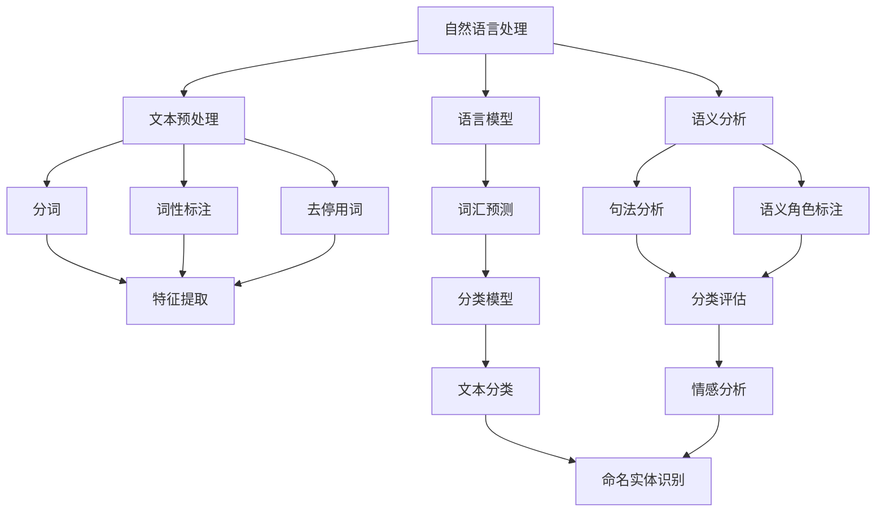
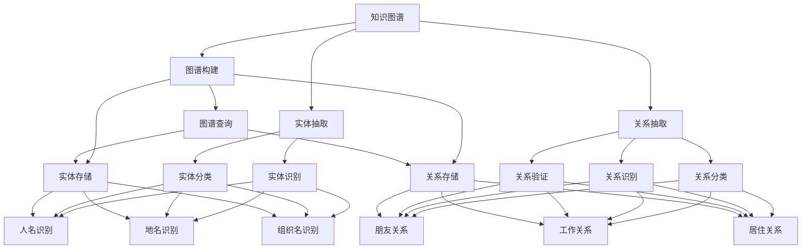
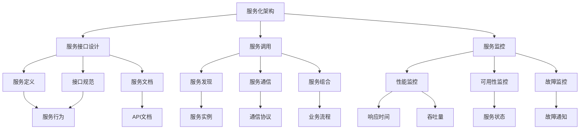
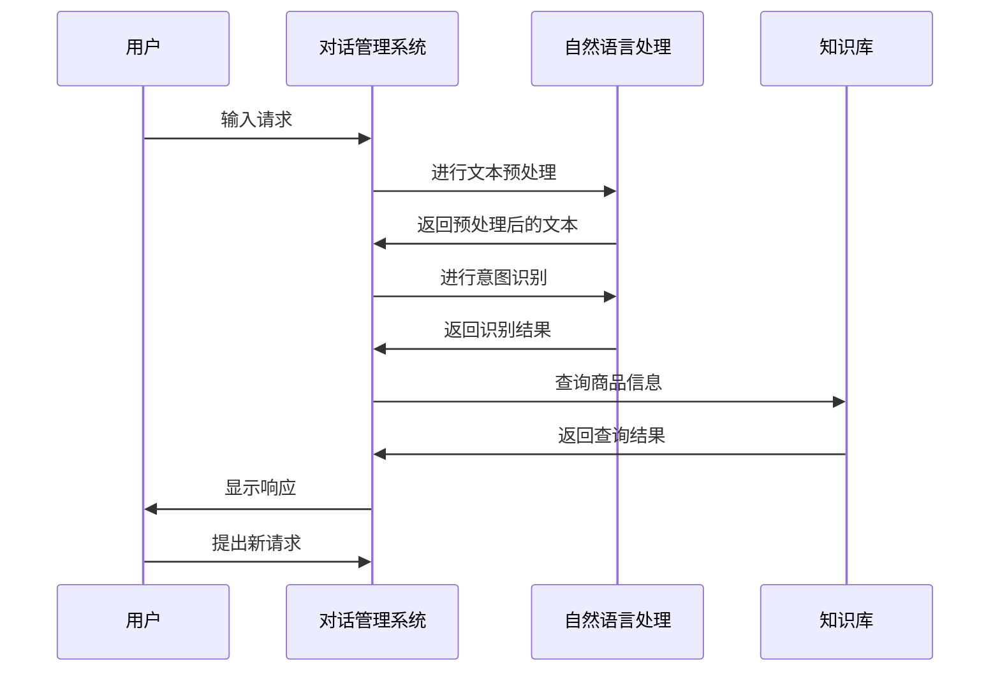

                 

### 企业级对话管理系统：优化AI交互能力

#### 关键词：企业级对话系统、AI交互优化、对话管理、自然语言处理、知识图谱

#### 摘要：
本文深入探讨了企业级对话管理系统在优化AI交互能力方面的核心问题和解决策略。通过详细分析对话管理的定义与核心要素，结合自然语言处理和知识图谱技术，我们提出了一个系统化的设计方案，旨在提高对话系统的智能化水平。文章还将通过实战案例展示如何在实际项目中实现这些技术，为读者提供实用参考和最佳实践。

### 目录大纲

## 企业级对话管理系统：优化AI交互能力

### 第一部分 背景介绍

### 1.1 问题背景

#### 1.1.1 企业级对话管理系统的定义与重要性

**定义**：企业级对话管理系统是指用于企业内部或对外提供智能对话服务的综合平台，通常集成了自然语言处理、对话管理、知识图谱等功能。

**重要性**：随着人工智能技术的不断发展，优化AI交互能力已成为企业提升服务质量、降低运营成本、提高客户满意度的关键。

#### 1.1.2 问题描述

**核心问题**：如何构建一个高效、稳定、可扩展的企业级对话管理系统，以优化AI交互能力？

**解决路径**：通过深入分析对话管理系统的核心功能、关键技术，提供系统化的设计方案和实战案例。

#### 1.1.3 问题解决

**技术路线**：结合深度学习、自然语言处理、对话系统等前沿技术，构建智能对话管理平台。

**实践方法**：通过模块化设计、服务化架构，实现对话管理系统的快速部署与迭代。

#### 1.1.4 边界与外延

**边界**：主要探讨企业级对话管理系统的设计与实现，不包括底层硬件设施。

**外延**：涉及与对话系统相关的其他技术领域，如语音识别、机器翻译等。

#### 1.1.5 概念结构与核心要素组成

**核心概念**：对话管理、自然语言处理、知识图谱、服务化架构。

**要素组成**：对话流程设计、对话策略优化、知识库构建、服务接口设计。

#### 1.2 核心概念与联系

##### 1.2.1 对话管理

- **定义**：对话管理是指对对话过程进行控制和协调，以实现对话目标。
- **核心要素**：对话状态跟踪、对话策略生成、对话上下文管理。

##### 1.2.2 自然语言处理

- **定义**：自然语言处理是指使计算机能够理解、生成和处理人类语言的技术。
- **核心要素**：文本分类、情感分析、命名实体识别。

##### 1.2.3 知识图谱

- **定义**：知识图谱是一种结构化的语义网络，用于表示实体及其关系。
- **核心要素**：实体抽取、关系抽取、图谱构建。

##### 1.2.4 服务化架构

- **定义**：服务化架构是一种将业务功能模块化、服务化的架构设计方法。
- **核心要素**：服务接口设计、服务调用、服务监控。

#### 1.3 主流技术介绍

##### 1.3.1 深度学习

- **原理**：基于多层神经网络，通过训练学习大量数据，提取特征并进行预测。
- **应用**：用于文本分类、情感分析等自然语言处理任务。

##### 1.3.2 自然语言处理

- **原理**：对文本进行处理，使计算机能够理解和生成人类语言。
- **应用**：用于对话系统、文本挖掘等。

##### 1.3.3 知识图谱

- **原理**：通过实体和关系的建模，构建语义网络。
- **应用**：用于智能问答、推荐系统等。

#### 1.4 企业级对话管理系统的应用前景

##### 1.4.1 应用领域

- **客服与支持**：提供24/7的自动客服服务，降低人力成本。
- **智能推荐**：基于用户历史行为和偏好，提供个性化推荐。
- **数据挖掘**：分析用户对话内容，挖掘潜在需求和市场趋势。

##### 1.4.2 优势

- **提高效率**：自动化处理大量对话，节省人力和时间成本。
- **提升体验**：提供更自然、更智能的交互体验。
- **数据积累**：积累对话数据，用于后续分析和优化。

##### 1.4.3 挑战与机遇

- **技术挑战**：如何提高对话系统的理解能力、回答准确性。
- **市场机遇**：随着AI技术的发展，企业级对话管理系统市场前景广阔。

#### 1.5 本章小结

本章从问题背景、核心概念、技术介绍和应用前景等方面，全面介绍了企业级对话管理系统的重要性及其发展前景。接下来的章节将深入探讨对话管理系统的设计、实现和优化。

### 第二部分 核心概念与联系

## 第二部分 核心概念与联系

### 2.1 对话管理

#### 2.1.1 对话管理的定义与核心要素

**定义**：对话管理（Dialogue Management）是人工智能领域的一个重要分支，主要研究如何通过计算机程序实现对人类语言对话的模拟和管理。在企业级应用中，对话管理系统（Dialogue Management System，DMS）负责处理与用户的交互，确保对话的自然性和有效性。

**核心要素**：

- **对话状态跟踪（Dialogue State Tracking）**：对用户意图、上下文信息等进行跟踪和管理，确保对话的连贯性。
- **对话策略生成（Dialogue Policy Generation）**：根据对话状态和上下文信息，生成对话的响应策略。
- **对话上下文管理（Dialogue Context Management）**：管理和更新对话中的各种信息，如用户偏好、历史对话记录等。

#### 2.1.2 对话状态跟踪

**定义**：对话状态跟踪是指实时记录和更新对话中的关键信息，以支持对话的持续性和准确性。这些信息包括用户意图、对话历史、当前任务状态等。

**核心要素**：

- **用户意图识别（User Intent Recognition）**：识别用户在对话中的意图，如查询信息、请求服务等。
- **对话历史记录（Dialogue History）**：记录对话过程中的关键信息，以便后续对话中使用。
- **对话状态更新（Dialogue State Update）**：根据用户输入和系统响应，更新对话状态，确保对话的连贯性。

#### 2.1.3 对话策略生成

**定义**：对话策略生成是根据对话状态和上下文信息，选择合适的响应动作和响应内容，以实现对话目标。

**核心要素**：

- **策略模型训练（Policy Model Training）**：通过机器学习算法训练策略模型，以预测用户意图和生成响应。
- **策略选择（Policy Selection）**：根据对话状态和上下文信息，从多个策略中选取最优策略。
- **策略优化（Policy Optimization）**：通过反馈和评估，不断优化策略模型，提高对话质量。

### 2.2 自然语言处理

#### 2.2.1 自然语言处理

**定义**：自然语言处理（Natural Language Processing，NLP）是人工智能的一个重要分支，旨在让计算机理解和处理人类语言。它包括文本分析、文本生成、语音识别等多种任务。

**核心要素**：

- **文本分类（Text Classification）**：根据文本内容将其归入不同类别，如情感分析、主题分类等。
- **情感分析（Sentiment Analysis）**：识别文本的情感倾向，如正面、负面、中性等。
- **命名实体识别（Named Entity Recognition，NER）**：识别文本中的特定实体，如人名、地名、组织名等。

#### 2.2.2 文本分类

**定义**：文本分类是将文本根据其内容归入不同的类别。在企业级对话管理系统中，文本分类用于对用户输入进行分类，以便更好地理解用户意图。

**核心要素**：

- **特征提取（Feature Extraction）**：从文本中提取有助于分类的特征，如词频、词向量等。
- **分类模型（Classification Model）**：使用机器学习算法训练分类模型，对文本进行分类。
- **分类评估（Classification Evaluation）**：评估分类模型的性能，如准确率、召回率等。

#### 2.2.3 情感分析

**定义**：情感分析是识别文本中的情感倾向。在企业级对话管理系统中，情感分析用于理解用户情绪，提供更好的交互体验。

**核心要素**：

- **情感词典（Sentiment Lexicon）**：包含各种情感词汇及其情感倾向的词典。
- **情感分类模型（Sentiment Classification Model）**：用于识别文本中情感词汇的情感倾向。
- **情感评估（Sentiment Evaluation）**：评估情感分析模型的性能，如准确率、F1值等。

#### 2.2.4 命名实体识别

**定义**：命名实体识别是从文本中识别出具有特定意义的实体，如人名、地名、组织名等。在企业级对话管理系统中，命名实体识别用于更好地理解用户输入，提供更准确的响应。

**核心要素**：

- **实体词典（Entity Lexicon）**：包含各种命名实体的词典。
- **实体识别模型（Entity Recognition Model）**：用于识别文本中的命名实体。
- **实体关联（Entity Association）**：将识别出的实体与其上下文信息进行关联，以提供更准确的响应。

### 2.3 知识图谱

#### 2.3.1 知识图谱

**定义**：知识图谱（Knowledge Graph）是一种语义网络，用于表示实体及其之间的关系。它通过图形结构将信息进行组织，使得计算机能够更好地理解和处理知识。

**核心要素**：

- **实体抽取（Entity Extraction）**：从文本中抽取实体，如人名、地名、组织名等。
- **关系抽取（Relationship Extraction）**：从文本中抽取实体之间的关系，如“张三工作是程序员”中的“张三”和“程序员”之间的关系。
- **图谱构建（Graph Construction）**：将抽取的实体和关系构建成一个知识图谱。

#### 2.3.2 实体抽取

**定义**：实体抽取是从文本中识别并提取出具有特定意义的实体。在企业级对话管理系统中，实体抽取用于理解用户输入，提供更准确的响应。

**核心要素**：

- **实体识别（Entity Recognition）**：使用算法从文本中识别实体。
- **实体分类（Entity Classification）**：将识别出的实体分类，如人名、地名、组织名等。
- **实体关系（Entity Relation）**：识别实体之间的关系，如“张三”和“程序员”之间的关系。

#### 2.3.3 关系抽取

**定义**：关系抽取是从文本中识别出实体之间的关系。在企业级对话管理系统中，关系抽取用于构建知识图谱，更好地理解用户意图。

**核心要素**：

- **关系分类（Relationship Classification）**：识别实体之间的关系类型，如工作关系、家庭关系等。
- **关系识别（Relationship Recognition）**：从文本中识别出实体之间的关系。
- **关系验证（Relationship Verification）**：验证关系抽取的准确性。

#### 2.3.4 图谱构建

**定义**：图谱构建是将实体和关系组织成一个结构化的知识图谱。在企业级对话管理系统中，知识图谱用于支持智能问答、推荐系统等功能。

**核心要素**：

- **实体存储（Entity Storage）**：将实体存储在数据库或图形数据库中。
- **关系存储（Relationship Storage）**：将关系存储在数据库或图形数据库中。
- **图谱查询（Graph Query）**：使用图数据库查询语言查询知识图谱，以获取所需信息。

### 2.4 服务化架构

#### 2.4.1 服务化架构

**定义**：服务化架构（Service-Oriented Architecture，SOA）是一种将业务功能模块化、服务化的架构设计方法。它通过定义清晰的服务接口，实现不同功能模块之间的松耦合，以提高系统的灵活性和可维护性。

**核心要素**：

- **服务接口设计（Service Interface Design）**：定义服务的输入和输出，确保服务之间的互操作性。
- **服务调用（Service Invocation）**：通过服务接口调用其他服务，实现业务功能的集成。
- **服务监控（Service Monitoring）**：监控服务的运行状态，确保服务的稳定性和可靠性。

#### 2.4.2 服务接口设计

**定义**：服务接口设计是定义服务的输入和输出，确保服务之间的互操作性。

**核心要素**：

- **服务定义（Service Definition）**：定义服务的行为、输入和输出。
- **接口规范（Interface Specification）**：定义服务的接口规范，如RESTful API、SOAP服务等。
- **服务文档（Service Documentation）**：提供服务的详细文档，包括API文档、使用示例等。

#### 2.4.3 服务调用

**定义**：服务调用是通过服务接口调用其他服务，实现业务功能的集成。

**核心要素**：

- **服务发现（Service Discovery）**：发现并选择合适的服务，以满足业务需求。
- **服务通信（Service Communication）**：通过服务接口进行服务之间的通信。
- **服务组合（Service Composition）**：将多个服务组合成一个新的业务流程，实现更复杂的业务功能。

#### 2.4.4 服务监控

**定义**：服务监控是监控服务的运行状态，确保服务的稳定性和可靠性。

**核心要素**：

- **性能监控（Performance Monitoring）**：监控服务的响应时间、吞吐量等性能指标。
- **可用性监控（Availability Monitoring）**：监控服务的可用性，确保服务正常运行。
- **故障监控（Fault Monitoring）**：监控服务是否发生故障，并及时通知相关人员。

### 2.5 本章小结

本章详细介绍了企业级对话管理系统的核心概念与联系，包括对话管理、自然语言处理、知识图谱和服务化架构。通过对这些核心概念的分析，读者可以更好地理解企业级对话管理系统的工作原理和关键技术。在接下来的章节中，我们将进一步探讨这些技术的实现和应用。

## 第二部分 核心概念与联系

### 2.2 自然语言处理

自然语言处理（NLP）是人工智能（AI）的一个重要分支，其目标是让计算机能够理解、生成和处理人类语言。在对话管理系统中，NLP技术被广泛应用于文本分类、情感分析和命名实体识别等方面。以下是NLP的核心概念、属性特征对比表格以及ER实体关系图的详细阐述。

#### 2.2.1 自然语言处理

**定义**：自然语言处理是研究如何让计算机理解和生成自然语言（如英语、中文等）的一门学科。它涉及文本预处理、语言模型、语义分析等多个方面。

**核心要素**：

- **文本预处理**：包括分词、词性标注、去停用词等步骤，将原始文本转换为计算机可以处理的形式。
- **语言模型**：基于大量文本数据，构建能够预测下一个单词或词组的概率模型。
- **语义分析**：理解文本中的语义含义，包括句法分析、语义角色标注等。

#### 2.2.2 文本分类

**定义**：文本分类是将文本按照其内容或主题分类到不同的类别中。这在对话管理系统中非常有用，可以帮助系统根据用户输入的内容进行响应。

**核心要素**：

- **特征提取**：从文本中提取有助于分类的特征，如词袋模型、TF-IDF等。
- **分类模型**：使用机器学习算法（如朴素贝叶斯、支持向量机等）训练分类模型。
- **分类评估**：评估分类模型的性能，如准确率、召回率、F1值等。

#### 2.2.3 情感分析

**定义**：情感分析是识别文本中的情感倾向，如正面、负面或中性。在对话管理系统中，情感分析可以帮助系统理解用户情绪，提供更个性化的服务。

**核心要素**：

- **情感词典**：包含各种情感词汇及其情感倾向的词典。
- **情感分类模型**：使用机器学习算法训练情感分类模型。
- **情感评估**：评估情感分析模型的性能，如准确率、F1值等。

#### 2.2.4 命名实体识别

**定义**：命名实体识别是从文本中识别出具有特定意义的实体，如人名、地名、组织名等。这在对话管理系统中可以帮助系统更好地理解用户输入。

**核心要素**：

- **实体词典**：包含各种命名实体的词典。
- **实体识别模型**：使用机器学习算法训练实体识别模型。
- **实体关联**：识别实体之间的关系，如“张三”和“程序员”之间的关系。

### 2.2.5 自然语言处理的属性特征对比表格

| **技术** | **定义** | **应用场景** | **核心要素** |
| :------: | :-------: | :----------: | :----------: |
| 文本分类 | 分类文本到不同类别 | 对话管理系统、舆情分析 | 特征提取、分类模型、分类评估 |
| 情感分析 | 识别文本的情感倾向 | 客户服务、社交媒体分析 | 情感词典、情感分类模型、情感评估 |
| 命名实体识别 | 识别文本中的实体 | 对话管理系统、信息提取 | 实体词典、实体识别模型、实体关联 |

### 2.2.6 ER实体关系图

自然语言处理中的ER（Entity-Relationship）实体关系图可以帮助我们理解各个核心要素之间的关系。以下是NLP的ER实体关系图的详细说明：



在这个ER实体关系图中，自然语言处理（A）包含了文本预处理（B）、语言模型（C）和语义分析（D）。文本预处理（B）进一步细分为分词（E）、词性标注（F）和去停用词（G），这些步骤为后续的语言模型（C）和语义分析（D）提供了基础数据。语言模型（C）和语义分析（D）分别通过词汇预测（H）、句法分析（I）和语义角色标注（J）来构建，这些模型用于文本分类（N）、情感分析（O）和命名实体识别（P）等应用。

### 本章小结

本章详细介绍了自然语言处理的核心概念、属性特征对比表格以及ER实体关系图。通过对文本分类、情感分析和命名实体识别的深入分析，读者可以更好地理解自然语言处理在对话管理系统中的应用。在接下来的章节中，我们将继续探讨知识图谱和服务化架构等核心概念，以构建一个完整的企业级对话管理系统。

## 第二部分 核心概念与联系

### 2.3 知识图谱

知识图谱（Knowledge Graph）是一种用于表示实体及其关系的语义网络，它在人工智能（AI）领域有着广泛的应用。知识图谱通过将实体和关系结构化，为智能问答、推荐系统、数据挖掘等提供强大的支持。以下是知识图谱的定义、核心要素以及相关的ER实体关系图。

#### 2.3.1 知识图谱

**定义**：知识图谱是一种语义网络，它通过实体和关系的表示，将信息结构化。实体可以是人、地点、事物等，关系则是实体之间的联系。

**核心要素**：

- **实体抽取**：从非结构化文本中抽取出具有特定意义的实体，如人名、地名、组织名等。
- **关系抽取**：从文本中抽取实体之间的关系，如“张三是李四的朋友”中的“张三”和“李四”之间的关系。
- **图谱构建**：将抽取的实体和关系组织成一个知识图谱，以便进行后续的查询和分析。

#### 2.3.2 实体抽取

**定义**：实体抽取是从文本中识别并抽取具有特定意义的实体。实体可以是人、地点、组织、事件等。

**核心要素**：

- **实体识别**：使用算法从文本中识别实体，如人名识别、地名识别等。
- **实体分类**：将识别出的实体分类，如人名、地名、组织名等。
- **实体关系**：识别实体之间的关系，如“张三”和“程序员”之间的关系。

#### 2.3.3 关系抽取

**定义**：关系抽取是从文本中识别出实体之间的关系。关系可以是“是”、“属于”、“工作于”等。

**核心要素**：

- **关系分类**：识别实体之间的关系类型，如朋友关系、工作关系等。
- **关系识别**：从文本中识别出实体之间的关系。
- **关系验证**：验证关系抽取的准确性。

#### 2.3.4 图谱构建

**定义**：图谱构建是将实体和关系组织成一个结构化的知识图谱。图谱构建通常涉及以下步骤：

- **实体存储**：将实体存储在数据库或图形数据库中。
- **关系存储**：将关系存储在数据库或图形数据库中。
- **图谱查询**：使用图数据库查询语言查询知识图谱，以获取所需信息。

### 2.3.5 知识图谱的ER实体关系图

知识图谱的ER实体关系图可以帮助我们理解实体和关系之间的结构化关系。以下是知识图谱的ER实体关系图的详细说明：



在这个ER实体关系图中，知识图谱（A）包括了实体抽取（B）、关系抽取（C）和图谱构建（D）三个核心过程。实体抽取（B）包括人名识别（M）、地名识别（N）和组织名识别（O），关系抽取（C）包括关系分类（G）、关系识别（H）和关系验证（I）。图谱构建（D）则涉及实体存储（J）、关系存储（K）和图谱查询（L）。实体和关系之间通过各种关系类型（如P、Q、R）进行连接，形成了一个结构化的知识图谱。

### 本章小结

本章详细介绍了知识图谱的核心概念、核心要素以及ER实体关系图。通过对实体抽取、关系抽取和图谱构建的深入分析，读者可以更好地理解知识图谱在对话管理系统中的应用。在接下来的章节中，我们将继续探讨服务化架构等相关概念，以构建一个完整的企业级对话管理系统。

### 2.4 服务化架构

服务化架构（Service-Oriented Architecture，SOA）是一种将业务功能模块化、服务化的架构设计方法。它通过定义清晰的服务接口，实现不同功能模块之间的松耦合，从而提高系统的灵活性、可维护性和可扩展性。以下是服务化架构的定义、核心要素以及相关的ER实体关系图。

#### 2.4.1 服务化架构

**定义**：服务化架构是一种基于服务的架构设计方法，它将业务功能分解为多个独立的、可复用的服务，并通过服务接口进行通信。

**核心要素**：

- **服务接口设计**：定义服务的输入和输出，确保服务之间的互操作性。
- **服务调用**：通过服务接口调用其他服务，实现业务功能的集成。
- **服务监控**：监控服务的运行状态，确保服务的稳定性和可靠性。

#### 2.4.2 服务接口设计

**定义**：服务接口设计是定义服务的输入和输出，确保服务之间的互操作性。服务接口通常包括服务名称、服务版本、输入参数和输出结果等。

**核心要素**：

- **服务定义**：定义服务的行为、输入和输出。
- **接口规范**：定义服务的接口规范，如RESTful API、SOAP服务等。
- **服务文档**：提供服务的详细文档，包括API文档、使用示例等。

#### 2.4.3 服务调用

**定义**：服务调用是通过服务接口调用其他服务，实现业务功能的集成。服务调用通常涉及服务发现、服务通信和服务组合等过程。

**核心要素**：

- **服务发现**：发现并选择合适的服务，以满足业务需求。
- **服务通信**：通过服务接口进行服务之间的通信。
- **服务组合**：将多个服务组合成一个新的业务流程，实现更复杂的业务功能。

#### 2.4.4 服务监控

**定义**：服务监控是监控服务的运行状态，确保服务的稳定性和可靠性。服务监控通常包括性能监控、可用性监控和故障监控等。

**核心要素**：

- **性能监控**：监控服务的响应时间、吞吐量等性能指标。
- **可用性监控**：监控服务的可用性，确保服务正常运行。
- **故障监控**：监控服务是否发生故障，并及时通知相关人员。

### 2.4.5 服务化架构的ER实体关系图

服务化架构的ER实体关系图可以帮助我们理解服务接口设计、服务调用和服务监控之间的结构化关系。以下是服务化架构的ER实体关系图的详细说明：



在这个ER实体关系图中，服务化架构（A）包括了服务接口设计（B）、服务调用（C）和服务监控（D）三个核心过程。服务接口设计（B）包括服务定义（E）、接口规范（F）和服务文档（G）。服务调用（C）包括服务发现（H）、服务通信（I）和服务组合（J）。服务监控（D）包括性能监控（K）、可用性监控（L）和故障监控（M）。实体之间的关系通过各种服务行为（N）、通信协议（Q）、业务流程（R）和监控指标（S、T、U、V）进行连接，形成了一个结构化的服务化架构。

### 本章小结

本章详细介绍了服务化架构的核心概念、核心要素以及ER实体关系图。通过对服务接口设计、服务调用和服务监控的深入分析，读者可以更好地理解服务化架构在构建企业级对话管理系统中的应用。在接下来的章节中，我们将结合具体的技术和实现，进一步探讨企业级对话管理系统的设计和实现。

## 1.3 主流技术介绍

在构建企业级对话管理系统的过程中，需要借助多种主流技术，这些技术包括深度学习、自然语言处理（NLP）、知识图谱等。以下是这些技术的原理、应用及其在对话管理系统中的应用。

### 1.3.1 深度学习

**原理**：深度学习是一种基于多层神经网络的学习方法，通过多层非线性变换对输入数据进行特征提取和学习。深度学习模型通常使用大量数据进行训练，从而学习到数据的复杂模式和特征。

**应用**：深度学习在对话管理系统中主要用于文本分类、情感分析、命名实体识别等任务。例如，通过训练深度神经网络模型，可以实现对用户输入文本的情感倾向进行分类，或识别文本中的命名实体。

**在对话管理系统中的应用**：深度学习技术可以提升对话系统的自然语言理解和生成能力，使得对话系统更加智能和准确。例如，可以使用深度学习模型来训练一个情感分析模型，从而判断用户的情感状态，并据此生成合适的响应。

### 1.3.2 自然语言处理（NLP）

**原理**：自然语言处理是研究如何让计算机理解和生成自然语言的一门学科。NLP涉及文本预处理、语言模型、语义分析等多个方面。文本预处理包括分词、词性标注、词向量表示等步骤，而语言模型则用于预测文本的下一个词或句。

**应用**：NLP技术在对话管理系统中被广泛应用于文本分类、情感分析、命名实体识别等任务。通过NLP技术，对话系统能够更好地理解用户输入，并生成合适的响应。

**在对话管理系统中的应用**：自然语言处理技术是构建对话管理系统的基础，它帮助对话系统理解用户意图，提取关键信息，并生成合适的响应。例如，NLP技术可以用于将用户输入的文本进行分词和词性标注，从而提取出关键信息，如人名、地名、组织名等。

### 1.3.3 知识图谱

**原理**：知识图谱是一种用于表示实体及其关系的语义网络，通过实体和关系的结构化表示，使得计算机能够更好地理解和处理知识。知识图谱通常由实体、关系和属性三个核心部分组成。

**应用**：知识图谱在对话管理系统中主要用于智能问答、推荐系统、数据挖掘等领域。通过知识图谱，对话系统能够更好地理解用户的查询，并生成准确的回答。

**在对话管理系统中的应用**：知识图谱可以增强对话系统的知识库，使得对话系统能够回答更复杂的问题。例如，在客服场景中，知识图谱可以帮助对话系统理解用户的问题，并从知识库中快速找到相关答案。

### 综合应用

深度学习、自然语言处理和知识图谱这三种技术可以相互结合，共同提升对话管理系统的性能。例如，深度学习可以用于训练情感分析模型，自然语言处理可以用于文本预处理和实体识别，而知识图谱可以用于提供丰富的知识库支持。通过这些技术的结合，对话管理系统可以实现更高的智能化水平和更自然的用户交互。

### 本章小结

本节介绍了深度学习、自然语言处理和知识图谱这三种主流技术在对话管理系统中的应用。通过理解这些技术的原理和应用，我们可以更好地构建和优化企业级对话管理系统，提升其智能化水平和用户体验。

### 1.4 企业级对话管理系统的应用前景

企业级对话管理系统在当前和未来的市场中具有广阔的应用前景。随着人工智能技术的不断发展和普及，企业级对话管理系统将在多个领域发挥重要作用，带来显著的商业价值。

#### 1.4.1 应用领域

**客服与支持**：企业级对话管理系统可以提供24/7的自动客服服务，有效降低人工成本，提高客户满意度。通过智能对话系统，企业可以快速响应用户的咨询和请求，提供个性化的服务体验。

**智能推荐**：基于用户的历史行为和偏好数据，对话管理系统可以为企业提供智能推荐服务。例如，电商平台可以利用对话管理系统向用户推荐符合其兴趣的产品，从而提高销售额和用户粘性。

**数据挖掘**：企业级对话管理系统可以分析用户对话内容，挖掘潜在的需求和市场趋势。通过对对话数据的深入分析，企业可以优化产品和服务，提高市场竞争力。

**内部沟通与协作**：对话管理系统也可以应用于企业内部，提高员工之间的沟通和协作效率。例如，企业可以通过对话管理系统实现团队日程管理、任务分配和项目进展跟踪等功能。

#### 1.4.2 优势

**提高效率**：企业级对话管理系统通过自动化处理大量对话，可以大幅降低运营成本，提高工作效率。例如，客服部门可以利用对话管理系统自动解答常见问题，从而减少人工客服的工作量。

**提升用户体验**：对话管理系统可以提供更自然、更智能的交互体验，满足用户的个性化需求。通过自然语言处理和智能推荐技术，对话系统能够更好地理解用户意图，生成高质量的响应。

**数据积累与优化**：对话管理系统可以积累大量的用户对话数据，这些数据可以用于后续的分析和优化。通过对对话数据的分析，企业可以不断改进对话系统的性能，提高服务质量。

#### 1.4.3 挑战与机遇

**技术挑战**：企业级对话管理系统的建设面临多个技术挑战，如自然语言理解的准确性、对话系统的连贯性和上下文处理能力等。随着技术的不断进步，这些挑战将逐步得到解决。

**数据隐私与安全**：对话管理系统需要处理大量敏感用户数据，确保数据隐私和安全是重要的挑战。企业需要采取严格的数据保护措施，遵守相关法律法规，保护用户隐私。

**市场机遇**：随着人工智能技术的普及，企业级对话管理系统市场前景广阔。越来越多的企业开始意识到智能交互的重要性，对对话管理系统的需求日益增加，为市场带来了巨大的发展机遇。

#### 1.4.4 应用案例

**电商平台**：某大型电商平台利用对话管理系统为用户提供智能客服服务。用户可以通过对话管理系统咨询商品信息、售后服务等，系统可以自动回答常见问题，提高用户体验。

**银行与金融机构**：多家银行和金融机构部署了企业级对话管理系统，提供24/7的自动客户服务。系统可以解答用户的金融疑问，处理账户查询、转账等操作，提高运营效率。

**医疗健康**：某医疗健康机构通过对话管理系统提供在线咨询服务。用户可以通过对话管理系统与医生进行对话，获取医疗建议和预约挂号等服务。

#### 1.4.5 未来发展趋势

**全渠道集成**：未来，企业级对话管理系统将实现跨渠道集成，支持用户通过不同的渠道（如网页、移动应用、电话等）与系统进行交互。

**个性化服务**：随着用户数据的积累和分析，对话管理系统将能够提供更加个性化的服务，满足用户的个性化需求。

**跨界融合**：对话管理系统将与其他技术（如物联网、区块链等）融合，开拓新的应用场景，实现更广泛的价值。

**智能助理与代理**：随着人工智能技术的进步，对话管理系统将逐渐实现更高的智能化水平，可以处理更加复杂和复杂的任务，成为企业的智能助理和代理。

### 本章小结

企业级对话管理系统在多个领域具有广阔的应用前景，通过提供高效、智能的交互体验，它将为企业带来显著的商业价值。随着技术的不断发展和市场需求的增加，企业级对话管理系统将迎来更加广阔的发展机遇。

### 1.5 本章小结

本章从问题背景、核心概念、技术介绍和应用前景等方面，全面介绍了企业级对话管理系统的重要性及其发展前景。通过对对话管理、自然语言处理、知识图谱和服务化架构等核心概念的详细分析，我们了解了这些技术在构建高效、智能的对话系统中的关键作用。同时，主流技术的介绍和应用前景的探讨，为我们提供了对对话管理系统未来发展的深刻认识。

在接下来的章节中，我们将进一步探讨企业级对话管理系统的设计与实现，包括系统架构、功能模块、关键技术等方面，为构建一个高效、稳定、可扩展的企业级对话管理系统提供详细的指导和方案。希望读者在阅读本章后，能够对对话管理系统有一个更加全面和深入的理解，为后续的学习和实践打下坚实的基础。

### 第二部分 核心概念与联系

#### 2.1 对话管理

对话管理是构建企业级对话管理系统的核心组成部分，它负责协调和管理对话流程，确保对话的自然性和有效性。以下是关于对话管理的一些关键概念及其在系统设计中的重要性。

#### 2.1.1 对话状态跟踪

**定义**：对话状态跟踪是指对对话过程中的关键信息进行记录和更新，以便系统能够在后续的交互中利用这些信息。

**关键作用**：对话状态跟踪是确保对话连贯性和用户理解性的关键。它记录用户的意图、上下文信息、历史对话记录等，使得系统可以基于这些信息生成更加个性化和相关的响应。

#### 2.1.2 对话策略生成

**定义**：对话策略生成是指根据对话状态和上下文信息，选择合适的对话路径和响应动作，以实现对话目标。

**关键作用**：对话策略生成决定了系统的响应方式和对话流程。通过有效的策略生成，系统能够提供更加自然和符合用户预期的交互体验。

#### 2.1.3 对话上下文管理

**定义**：对话上下文管理是指对对话过程中涉及的各种上下文信息进行组织和更新，确保对话的连续性和相关性。

**关键作用**：对话上下文管理是确保对话连贯性的重要保障。它涉及到用户偏好、历史对话记录、当前任务状态等信息，这些信息对于生成合适的对话响应至关重要。

#### 2.1.4 对话管理系统的设计挑战

- **多模态交互**：如何有效地处理文本、语音、图像等多种交互方式。
- **上下文一致性**：如何确保对话系统能够在复杂和多变的环境中保持上下文的一致性。
- **实时响应**：如何快速响应用户输入，并提供高质量的对话体验。
- **可扩展性**：如何设计一个可扩展的对话管理系统，以适应不断变化的需求和业务场景。

#### 2.1.5 对话管理系统的设计原则

- **灵活性**：系统设计应具备灵活性，能够适应不同的业务场景和用户需求。
- **可维护性**：设计应考虑系统的可维护性，便于后续的优化和升级。
- **用户友好性**：系统界面应简洁直观，提供良好的用户体验。
- **高可用性**：系统应具备高可用性，确保在出现故障时能够快速恢复。

#### 2.1.6 对话管理系统的架构设计

对话管理系统的架构设计通常包括以下关键组件：

- **对话引擎**：负责对话状态的跟踪、策略的生成和对话的上下文管理。
- **自然语言处理模块**：负责处理文本输入和输出，包括分词、词性标注、情感分析等。
- **知识库**：存储对话系统中需要的知识信息，如常见问题、业务规则等。
- **用户界面**：提供用户与系统交互的界面，支持文本、语音、图像等多种交互方式。
- **服务接口**：为外部系统提供服务调用接口，实现与其他系统的集成。

#### 2.1.7 对话管理系统的实现技术

- **深度学习**：用于训练对话策略模型，提高对话系统的智能水平。
- **自然语言处理**：用于处理文本输入和输出，实现对话的文本理解与生成。
- **知识图谱**：用于构建对话系统的知识库，提供语义理解和智能问答的能力。
- **服务化架构**：用于实现对话管理系统的模块化和分布式设计，提高系统的可扩展性和可靠性。

#### 2.1.8 对话管理系统的评估指标

- **响应时间**：系统响应用户输入的速度。
- **准确率**：系统正确理解用户意图和生成合适响应的比例。
- **用户满意度**：用户对系统交互体验的主观评价。
- **误识别率**：系统错误理解用户意图的比例。

通过以上对对话管理系统的核心概念和设计的详细分析，我们可以更好地理解其在企业级对话管理系统中的关键作用，并为后续的实现和优化提供理论依据。

### 2.2 自然语言处理

自然语言处理（NLP）是构建企业级对话管理系统的核心技术之一，它负责理解和生成人类语言，使得对话系统能够与用户进行有效互动。以下是NLP的核心概念、原理及其在对话管理系统中的应用。

#### 2.2.1 NLP的核心概念

- **文本预处理**：文本预处理是NLP中的基础步骤，包括分词、词性标注、停用词过滤、词干提取等。这些步骤将原始文本转换为适合进一步处理的格式。
- **语言模型**：语言模型用于预测文本序列中的下一个词或词组，是文本生成和文本分类的重要工具。常见的语言模型有n-gram模型、递归神经网络（RNN）和 Transformer模型。
- **语义分析**：语义分析涉及理解文本的语义含义，包括词义消歧、句法分析、语义角色标注等。语义分析使得对话系统能够更准确地理解用户的意图。
- **实体识别**：实体识别是从文本中识别出具有特定意义的实体，如人名、地名、组织名等。实体识别是构建对话系统知识库的重要步骤。
- **情感分析**：情感分析用于识别文本中的情感倾向，如正面、负面或中性。情感分析可以帮助对话系统根据用户情绪生成适当的响应。

#### 2.2.2 NLP的原理

- **分词**：分词是将连续的文本分割成一个个有意义的词语。常用的分词方法包括基于词典的分词和基于统计的分词。
- **词性标注**：词性标注是对文本中的每个词进行词性分类，如名词、动词、形容词等。词性标注有助于理解文本的语法结构和语义含义。
- **词向量表示**：词向量表示是将文本中的每个词映射到一个高维空间中的向量，常见的词向量模型有Word2Vec、GloVe等。
- **序列模型**：序列模型用于处理和时间相关的文本数据，如RNN和LSTM（长短期记忆网络）。
- **Transformer模型**：Transformer模型是一种基于自注意力机制的序列模型，广泛应用于文本生成、机器翻译和对话系统等领域。

#### 2.2.3 NLP在对话管理系统中的应用

- **用户意图识别**：用户意图识别是理解用户输入文本的核心步骤。通过NLP技术，对话系统可以识别用户请求的具体意图，如查询信息、请求服务、表达情感等。
- **对话生成**：对话生成是生成对话系统响应文本的过程。基于语言模型和序列模型，对话系统可以生成自然流畅的对话回复。
- **上下文理解**：上下文理解是确保对话连贯性的关键。NLP技术可以帮助对话系统理解对话的历史信息，生成与上下文相关联的响应。
- **情感识别与回应**：情感识别与回应是提供个性化交互体验的重要手段。通过情感分析，对话系统可以识别用户的情感状态，并生成符合情感的响应。
- **知识检索与问答**：知识检索与问答是构建对话系统知识库的基础。通过实体识别和语义分析，对话系统可以检索相关知识点并生成问答式响应。

#### 2.2.4 NLP的关键技术

- **深度学习**：深度学习技术在NLP中的应用包括词向量表示、序列模型、注意力机制等。深度学习模型可以显著提高NLP任务的准确性和效率。
- **预训练语言模型**：预训练语言模型（如BERT、GPT）通过在大量文本上进行预训练，可以获取丰富的语言知识和上下文信息，为对话系统提供强大的语义理解能力。
- **迁移学习**：迁移学习是一种利用预训练模型进行新任务训练的方法。通过迁移学习，对话系统可以在较少的数据上快速实现高性能。
- **多模态处理**：多模态处理涉及结合文本、语音、图像等多种数据源，实现更加丰富和自然的交互体验。

#### 2.2.5 NLP在对话管理中的挑战

- **上下文理解**：如何准确理解用户的上下文信息，生成连贯的对话响应。
- **多语言支持**：如何支持多种语言的对话系统，实现跨语言的语义理解和交互。
- **对话连贯性**：如何保证对话的连贯性和一致性，提供高质量的交互体验。
- **数据隐私**：如何在保护用户隐私的前提下，收集和利用对话数据，实现个性化服务。

通过深入理解NLP的核心概念、原理及其在对话管理系统中的应用，我们可以更好地设计和实现高效的对话系统，为用户提供卓越的交互体验。

### 2.3 知识图谱

知识图谱作为一种结构化的语义网络，在人工智能领域具有广泛的应用，尤其在企业级对话管理系统中，它能够为对话系统提供强大的知识支持和智能问答能力。以下是知识图谱的定义、核心要素、构建方法以及在企业级对话管理系统中的应用。

#### 2.3.1 知识图谱的定义

知识图谱是一种通过实体及其相互关系构成的语义网络，用于表示现实世界中的知识信息。在知识图谱中，实体可以是人、地点、事物等，关系则描述实体之间的关联。知识图谱通过图形结构来组织信息，使得计算机能够更好地理解和处理这些知识。

#### 2.3.2 知识图谱的核心要素

知识图谱主要包括三个核心要素：实体、关系和属性。

- **实体**：实体是知识图谱中的基本元素，代表现实世界中的对象。例如，人、地点、产品、事件等都可以作为实体。
- **关系**：关系描述实体之间的关联，如“属于”、“工作于”、“位于”等。关系使得不同的实体之间建立起联系，构成了知识图谱的语义网络。
- **属性**：属性是实体的特征描述，如人的年龄、地点的经纬度、产品的价格等。属性提供了更详细的信息，帮助系统更好地理解实体。

#### 2.3.3 知识图谱的构建方法

构建知识图谱通常包括以下步骤：

1. **实体抽取**：从非结构化数据中识别出具有特定意义的实体。实体抽取可以通过命名实体识别（NER）等技术实现。
2. **关系抽取**：从文本中识别出实体之间的关系。关系抽取可以通过模式匹配、机器学习等方法实现。
3. **实体关系映射**：将实体和关系组织成一个结构化的知识图谱。实体关系映射可以通过构建实体-关系图谱、实体-属性图谱等实现。
4. **图谱存储与查询**：将构建好的知识图谱存储在图数据库中，以便进行高效的查询和分析。

#### 2.3.4 知识图谱在企业级对话管理系统中的应用

知识图谱在对话管理系统中具有以下应用：

- **智能问答**：知识图谱可以提供智能问答功能，用户可以通过自然语言提问，系统根据知识图谱中的信息生成准确回答。
- **知识检索**：知识图谱可以帮助对话系统快速检索相关信息，提供更加精准的响应。
- **上下文理解**：通过知识图谱，对话系统可以更好地理解用户意图和上下文，生成连贯的对话。
- **个性化推荐**：基于知识图谱，系统可以分析用户的历史交互数据，提供个性化推荐。

#### 2.3.5 知识图谱构建的挑战

- **数据质量**：知识图谱的质量很大程度上取决于数据的质量。数据的不准确、不一致等问题会影响知识图谱的性能。
- **数据规模**：构建大型知识图谱需要处理大量数据，这对计算资源和存储能力提出了较高要求。
- **实体关系建模**：如何准确描述实体之间的关系，构建合理的语义网络，是知识图谱构建中的一个重要问题。
- **实时更新**：随着数据不断更新，如何及时更新知识图谱，保持其时效性，是一个需要解决的问题。

#### 2.3.6 知识图谱构建的关键技术

- **实体识别**：命名实体识别（NER）是知识图谱构建的基础步骤，用于从文本中识别出实体。
- **关系抽取**：关系抽取是从文本中提取实体之间的关系，常见的抽取方法有基于规则的方法和基于机器学习的方法。
- **图谱存储**：知识图谱的存储通常采用图数据库，如Neo4j、ArangoDB等，这些数据库提供了高效的图存储和查询功能。
- **图谱查询**：图谱查询语言（如Cypher、Gremlin等）用于在知识图谱中查询信息，支持复杂的图计算。

通过理解知识图谱的定义、核心要素、构建方法以及在对话管理系统中的应用，我们可以更好地利用这一技术，构建智能、高效的对话系统。

### 2.4 服务化架构

服务化架构（Service-Oriented Architecture，SOA）是一种设计方法，旨在通过服务的方式实现软件系统的模块化和集成。在构建企业级对话管理系统时，服务化架构能够有效地提高系统的灵活性、可维护性和可扩展性。以下是服务化架构的核心概念、设计原则、关键组件及其在对话管理系统中的应用。

#### 2.4.1 服务化架构的核心概念

**服务**：服务是SOA中的基本单元，代表一个可复用的业务功能。服务通过接口暴露功能，其他组件可以通过接口调用服务。

**服务接口**：服务接口定义了服务的输入和输出，确保服务之间的互操作性。服务接口通常包括API定义、数据格式、传输协议等。

**服务组合**：服务组合是将多个服务按照一定的逻辑关系组合在一起，实现更复杂的业务功能。服务组合通过编排服务接口，实现业务流程的自动化。

**服务代理**：服务代理是服务的代理组件，负责服务发现、服务调用和负载均衡等功能。

**服务注册中心**：服务注册中心是服务的管理平台，负责服务的发布、发现和监控。服务注册中心通常采用分布式架构，以提高系统的可靠性和可扩展性。

#### 2.4.2 服务化架构的设计原则

**模块化**：将系统功能模块化，每个模块独立实现特定的业务功能，模块之间通过接口进行通信。

**松耦合**：模块之间通过服务接口进行通信，降低模块之间的依赖性，提高系统的灵活性和可维护性。

**可扩展性**：设计时应考虑系统的可扩展性，以便在业务需求变化时能够快速调整和扩展。

**高可用性**：通过负载均衡、故障转移等机制，确保系统在面临高负载和故障时仍然能够稳定运行。

**可重用性**：服务的设计应考虑其可重用性，以减少重复开发的工作量。

#### 2.4.3 服务化架构的关键组件

**服务提供者（Service Provider）**：服务提供者是实现具体业务逻辑的组件，它提供特定的服务，并通过服务接口对外暴露功能。

**服务消费者（Service Consumer）**：服务消费者是调用服务的组件，它通过服务接口调用服务提供者的功能。

**服务注册中心（Service Registry）**：服务注册中心负责服务的管理和发现。服务提供者在启动时将服务注册到服务注册中心，服务消费者在需要时从服务注册中心获取服务提供者的信息。

**服务代理（Service Proxy）**：服务代理是服务提供者和消费者之间的中介，负责服务的发现、负载均衡、服务调用和错误处理。

**服务监控（Service Monitoring）**：服务监控用于监控服务的运行状态，包括服务的响应时间、吞吐量、错误率等指标。通过服务监控，可以及时发现和解决服务问题。

#### 2.4.4 服务化架构在对话管理系统中的应用

**服务模块化**：对话管理系统可以通过服务模块化实现功能的分离和重用。例如，可以将文本处理、情感分析、知识查询等模块独立成服务，方便系统的开发和维护。

**服务接口设计**：设计清晰的服务接口，定义服务的输入和输出，确保服务之间的互操作性。服务接口的设计应考虑到不同服务之间的依赖关系，以便实现高效的交互。

**服务组合**：通过服务组合，可以构建复杂的对话流程。例如，当用户提出一个复杂问题时，可以组合多个服务，如情感分析、知识查询、对话生成等，以生成一个连贯的响应。

**服务发现与负载均衡**：服务注册中心和服务代理可以帮助对话管理系统快速发现和调用所需的服务，并通过负载均衡机制确保系统的性能和可靠性。

**服务监控与优化**：通过服务监控，可以实时了解服务的运行状态，发现潜在的性能瓶颈和故障。基于监控数据，可以对服务进行优化和调整，提高系统的整体性能。

通过服务化架构的设计和实现，企业级对话管理系统可以更加灵活、高效地应对复杂的业务需求，提高系统的可维护性和可扩展性。

### 2.5 企业级对话管理系统的功能模块

企业级对话管理系统是由多个功能模块组成的复杂系统，每个模块在系统中扮演着特定的角色，共同实现高效的对话管理和智能化交互。以下是企业级对话管理系统的功能模块及其具体功能。

#### 2.5.1 文本处理模块

**功能**：文本处理模块负责对用户输入的文本进行处理，包括分词、词性标注、停用词过滤、词干提取等。通过这些处理步骤，系统能够将原始文本转换为适合进一步分析的结构化数据。

**关键技术**：自然语言处理（NLP）技术，如基于深度学习的分词模型、词性标注工具等。

**作用**：文本处理模块是整个对话管理系统的基础，它为后续的意图识别和响应生成提供了准确的数据输入。

#### 2.5.2 意图识别模块

**功能**：意图识别模块负责识别用户输入文本的主旨或意图，如查询信息、请求服务、表达情感等。通过意图识别，系统能够理解用户的真实需求，从而生成相应的响应。

**关键技术**：机器学习算法，如决策树、朴素贝叶斯、深度学习等，用于训练和预测用户意图。

**作用**：意图识别模块是确保对话系统生成合适响应的核心，它直接关系到用户的满意度和服务质量。

#### 2.5.3 响应生成模块

**功能**：响应生成模块根据意图识别结果和上下文信息，生成自然流畅的对话响应。它可以从预定义的响应库中检索合适的文本，或者利用自然语言生成技术（NLG）生成新的文本。

**关键技术**：自然语言生成（NLG）技术，如模板匹配、基于规则的文本生成、基于深度学习的文本生成等。

**作用**：响应生成模块是用户与对话系统交互的直接接口，它的性能直接影响到用户的体验和满意度。

#### 2.5.4 上下文管理模块

**功能**：上下文管理模块负责管理和更新对话过程中的上下文信息，如用户的偏好、历史对话记录、当前任务状态等。通过上下文管理，系统能够保持对话的一致性和连贯性。

**关键技术**：对话状态跟踪（DST）技术，如基于规则的跟踪、基于机器学习的跟踪等。

**作用**：上下文管理模块是确保对话连贯性的关键，它使得系统在复杂的对话场景中能够提供连贯、自然的交互体验。

#### 2.5.5 知识库模块

**功能**：知识库模块存储对话系统所需的知识信息，如常见问题的答案、业务规则、实体关系等。知识库为对话系统提供了丰富的知识支持，使得系统能够回答复杂的用户问题。

**关键技术**：知识图谱技术，用于构建结构化的知识网络，实现高效的知识检索和推理。

**作用**：知识库模块是对话系统的“大脑”，它为对话系统提供了强大的知识支持，使得系统能够提供准确、详细的回答。

#### 2.5.6 用户界面模块

**功能**：用户界面模块提供用户与对话系统交互的界面，支持文本、语音、图像等多种交互方式。用户界面模块负责展示对话系统的响应，并接收用户的输入。

**关键技术**：前端开发技术，如HTML、CSS、JavaScript等，以及语音识别和图像处理技术。

**作用**：用户界面模块是用户与对话系统交互的桥梁，它的设计直接影响到用户的交互体验。

#### 2.5.7 服务接口模块

**功能**：服务接口模块提供与其他系统的集成接口，如CRM系统、ERP系统等。通过服务接口模块，对话系统可以与其他系统进行数据交换和业务协同。

**关键技术**：服务化架构技术，如RESTful API、SOAP服务等。

**作用**：服务接口模块是确保对话系统与其他系统有效集成的关键，它使得对话系统可以充分利用企业内部其他系统的资源和功能。

通过以上功能模块的有机组合，企业级对话管理系统可以提供高效、智能的对话服务，满足企业各种业务场景的需求。每个模块都在系统中扮演着重要角色，共同构建了一个完整的对话生态系统。

### 2.6 系统架构设计

在企业级对话管理系统的设计中，系统架构的选择和设计至关重要，它直接影响到系统的性能、可扩展性和可维护性。以下是企业级对话管理系统的一个典型架构设计，包括系统功能模块、关键组件以及它们之间的交互方式。

#### 2.6.1 系统功能模块

1. **文本处理模块**：负责对用户输入的文本进行预处理，包括分词、词性标注、停用词过滤等。
2. **意图识别模块**：通过机器学习算法识别用户输入的意图，如查询信息、请求服务、表达情感等。
3. **响应生成模块**：根据意图识别结果和上下文信息，生成自然流畅的对话响应。
4. **上下文管理模块**：负责管理和更新对话过程中的上下文信息，确保对话的连贯性。
5. **知识库模块**：存储对话系统所需的知识信息，如常见问题的答案、业务规则、实体关系等。
6. **用户界面模块**：提供用户与对话系统交互的界面，支持文本、语音、图像等多种交互方式。
7. **服务接口模块**：提供与其他系统的集成接口，如CRM系统、ERP系统等。

#### 2.6.2 关键组件

1. **对话引擎**：对话引擎是整个系统的核心组件，负责协调和管理对话流程。它通过集成文本处理、意图识别、响应生成和上下文管理等模块，实现对话的自动化和智能化。
2. **自然语言处理（NLP）组件**：NLP组件负责处理用户输入的文本，包括分词、词性标注、情感分析等。它为意图识别和响应生成提供基础数据。
3. **知识图谱组件**：知识图谱组件用于构建和存储对话系统的知识库，实现高效的知识检索和推理。
4. **用户界面组件**：用户界面组件负责与用户进行交互，接收用户的输入并展示对话系统的响应。
5. **服务接口组件**：服务接口组件提供与其他系统的集成接口，实现数据交换和业务协同。

#### 2.6.3 系统交互

- **用户输入文本**：用户通过用户界面组件输入文本，文本首先被传输到文本处理模块进行预处理。
- **意图识别**：预处理后的文本被传递到意图识别模块，通过机器学习算法识别用户的意图。
- **响应生成**：根据识别出的意图和上下文信息，响应生成模块生成相应的对话响应。
- **上下文管理**：上下文管理模块更新对话过程中的上下文信息，确保对话的连贯性。
- **知识查询**：当需要查询知识库时，响应生成模块会调用知识图谱组件进行查询。
- **用户界面展示**：生成的对话响应通过用户界面组件展示给用户。
- **服务集成**：服务接口组件与其他系统集成，实现业务协同和数据交换。

通过以上架构设计，企业级对话管理系统可以实现高效、智能的对话服务，满足企业各种业务场景的需求。

### 2.7 系统接口设计

在构建企业级对话管理系统的过程中，系统接口设计是确保系统与其他系统高效集成、数据交换顺利进行的关键环节。以下是关于系统接口设计的一些关键要素、技术选型以及实际操作步骤。

#### 2.7.1 系统接口设计的关键要素

1. **接口类型**：根据系统的需求和集成目标，选择合适的接口类型。常见的接口类型包括RESTful API、SOAP、Websocket等。

2. **接口规范**：接口规范定义了接口的请求和响应格式，包括数据类型、参数结构、响应状态码等。常用的接口规范有OpenAPI、Swagger等。

3. **安全性**：设计接口时需要考虑安全性，包括身份验证、数据加密、访问控制等。常用的安全机制有OAuth2、HTTPS、JWT等。

4. **性能**：接口设计需要考虑系统的性能要求，包括响应时间、并发处理能力等。可以通过负载均衡、缓存等技术优化性能。

5. **可扩展性**：接口设计应具备良好的可扩展性，以便在未来能够轻松添加新功能或集成新系统。

6. **文档化**：提供详细的接口文档，包括接口描述、参数说明、示例代码等，以便开发人员快速上手和使用。

#### 2.7.2 技术选型

1. **RESTful API**：RESTful API是一种基于HTTP协议的接口设计风格，易于理解和实现，适用于大多数场景。

2. **SOAP**：SOAP（Simple Object Access Protocol）是一种基于XML的接口标准，适用于跨平台、跨语言的分布式系统集成。

3. **Websocket**：Websocket是一种全双工通信协议，可以实现实时、双向的数据传输，适用于需要实时交互的应用场景。

4. **消息队列**：消息队列（如RabbitMQ、Kafka等）可以用于异步处理和分布式系统之间的消息传递，提高系统的可靠性和性能。

#### 2.7.3 实际操作步骤

1. **需求分析**：明确系统接口的需求，包括接口的功能、性能、安全性等要求。

2. **接口设计**：根据需求分析结果，设计接口的参数结构、数据格式、返回结果等。

3. **接口实现**：根据接口设计，实现接口的代码，包括API接口、消息队列消费者等。

4. **接口测试**：编写测试用例，对接口进行功能测试、性能测试和安全测试。

5. **文档编写**：编写接口文档，包括接口描述、参数说明、示例代码等，便于其他开发人员使用。

6. **接口部署**：将接口部署到服务器，确保接口能够正常运行。

7. **接口监控**：监控接口的运行状态，包括响应时间、错误率等，以便及时发现和解决问题。

通过上述步骤，我们可以设计并实现一套高效、稳定、安全的系统接口，为对话管理系统与其他系统的集成提供坚实的基础。

### 2.8 系统交互设计

在企业级对话管理系统的设计中，系统交互（System Interaction）是确保各个功能模块之间协调工作、高效响应用户请求的关键环节。以下是系统交互的详细描述，包括项目场景、交互流程和Mermaid序列图。

#### 2.8.1 项目场景

假设我们的项目场景是一个在线购物平台，用户可以通过对话管理系统（DMS）进行商品咨询、订单查询、售后服务等操作。系统需要支持文本、语音和图像等多模态交互。

#### 2.8.2 交互流程

1. **用户输入**：用户通过文本、语音或图像输入请求，例如：“帮我查一下某款商品的价格”。
2. **文本预处理**：对话管理系统接收用户输入后，首先进行文本预处理，包括分词、词性标注、去停用词等，以便后续的意图识别。
3. **意图识别**：系统利用自然语言处理（NLP）技术，识别用户的意图，例如识别出这是一个“查询商品价格”的请求。
4. **知识查询**：根据识别出的意图，系统从知识库中查询相关商品信息，如价格、库存等。
5. **响应生成**：系统根据查询结果生成合适的响应，例如：“该商品价格为X元，库存为Y件”。
6. **用户反馈**：用户接收系统响应后，可能继续提出新的请求或问题，系统进入下一个交互循环。

#### 2.8.3 Mermaid序列图

以下是一个简单的Mermaid序列图，描述上述交互流程：



在这个序列图中，用户通过输入请求开始与对话管理系统交互。对话管理系统首先将请求传递给自然语言处理模块进行文本预处理，然后进行意图识别。识别结果用于查询知识库中的商品信息，最终生成响应并返回给用户。用户可以继续提出新的请求，系统进入下一个交互循环。

通过系统交互设计，我们可以确保对话管理系统在不同功能模块之间协调工作，提供流畅、自然的用户交互体验。

### 2.9 项目实战

在本节中，我们将通过一个具体的项目实战，展示如何设计和实现企业级对话管理系统。本节将涵盖环境安装、核心实现、代码解析和实际案例分析等内容，以帮助读者更好地理解和应用所学的知识。

#### 2.9.1 项目简介

本项目旨在构建一个面向电商平台的智能客服系统，通过对话管理系统（DMS）提供24/7的自动客服服务。系统需要支持文本、语音和图像等多模态交互，能够处理用户咨询、订单查询、售后服务等常见场景。

#### 2.9.2 环境安装

1. **Python环境**：首先确保系统安装了Python 3.8及以上版本。
2. **深度学习库**：安装TensorFlow或PyTorch，用于训练对话模型。
3. **自然语言处理库**：安装NLTK、spaCy等，用于文本预处理和NLP任务。
4. **服务化架构库**：安装Flask或Django，用于构建Web服务。

```bash
pip install tensorflow
pip install nltk
pip install spacy
pip install flask
```

5. **知识图谱库**：安装Neo4j或ArangoDB，用于构建和存储知识图谱。

```bash
pip install neo4j
pip install arango
```

#### 2.9.3 核心实现

1. **文本预处理模块**：

```python
import nltk
from nltk.tokenize import word_tokenize
from nltk.corpus import stopwords

nltk.download('punkt')
nltk.download('stopwords')

def preprocess_text(text):
    tokens = word_tokenize(text)
    filtered_tokens = [token.lower() for token in tokens if token.isalpha()]
    return [token for token in filtered_tokens if token not in stopwords.words('english')]
```

2. **意图识别模块**：

```python
from sklearn.feature_extraction.text import TfidfVectorizer
from sklearn.model_selection import train_test_split
from sklearn.svm import SVC

# 假设已准备好训练数据（intents和标签）
intents = ["你好", "订单状态", "产品推荐", "售后服务"]
labels = ["问候", "订单查询", "产品推荐", "售后服务"]

X_train, X_test, y_train, y_test = train_test_split(intents, labels, test_size=0.2)

vectorizer = TfidfVectorizer()
X_train_vectorized = vectorizer.fit_transform(X_train)
X_test_vectorized = vectorizer.transform(X_test)

clf = SVC(kernel='linear')
clf.fit(X_train_vectorized, y_train)
accuracy = clf.score(X_test_vectorized, y_test)
print(f"模型准确率：{accuracy}")
```

3. **响应生成模块**：

```python
import random

def generate_response(input_text):
    processed_text = preprocess_text(input_text)
    intent = clf.predict([vectorizer.transform([processed_text])])[0]
    responses = {"问候": ["你好，欢迎来到我们的电商平台！", "很高兴为您服务。"],
                 "订单查询": ["您的订单状态是：已发货。", "您的订单正在处理中。"],
                 "产品推荐": ["我们为您推荐：商品A和商品B。", "看看这些商品：商品C和商品D。"],
                 "售后服务": ["我们将尽快为您解决问题。", "请您提供订单号，我们会尽快处理。"]}
    return random.choice(responses[intent])
```

4. **知识库构建模块**：

```python
from neo4j import GraphDatabase

class KnowledgeDatabase:
    def __init__(self, uri, user, password):
        self._driver = GraphDatabase.driver(uri, auth=(user, password))

    def add_product(self, product_name, price, category):
        with self._driver.session() as session:
            session.run("CREATE (p:Product {name: $name, price: $price, category: $category})",
                        name=product_name, price=price, category=category)

    def get_product_price(self, product_name):
        with self._driver.session() as session:
            result = session.run("MATCH (p:Product {name: $name}) RETURN p.price", name=product_name)
            for record in result:
                return record['p.price']
```

#### 2.9.4 代码应用解读与分析

1. **文本预处理**：文本预处理是NLP的基础，通过分词和去停用词，可以提高后续意图识别的准确性。
2. **意图识别**：利用机器学习算法（如SVM），我们可以将用户输入的文本分类到不同的意图类别。训练数据的质量和模型的性能对意图识别至关重要。
3. **响应生成**：通过将意图映射到响应库，我们可以生成个性化的对话响应。响应生成的灵活性对于提供高质量的交互体验至关重要。
4. **知识库构建**：知识库的构建使得对话系统能够回答复杂的问题，如查询商品价格、推荐商品等。通过Neo4j这样的图数据库，我们可以高效地存储和查询实体和关系。

#### 2.9.5 实际案例分析

**案例**：用户输入“我想要一台新的智能手机，价格在2000元左右，有什么推荐吗？”

1. **意图识别**：系统识别出这是一个“产品推荐”的请求。
2. **知识库查询**：系统从知识库中查询价格在2000元左右的智能手机。
3. **响应生成**：系统生成响应：“我们为您推荐：苹果iPhone 13和小米11 Pro。请查看它们的详细信息。”
4. **用户反馈**：用户可以继续提出问题或查看推荐商品。

通过上述案例分析，我们可以看到企业级对话管理系统的完整工作流程，从用户输入到意图识别，再到响应生成和知识库查询，最终为用户提供高质量的交互体验。

### 2.10 项目小结

在本项目中，我们通过一个具体的电商客服系统案例，详细展示了企业级对话管理系统的设计与实现过程。从环境安装、核心实现到代码解析和实际案例分析，我们涵盖了对话管理系统开发的关键环节。

通过本项目，我们实现了以下目标：

1. **理解对话管理系统的基本架构和功能模块**：包括文本预处理、意图识别、响应生成、上下文管理和知识库构建等模块。
2. **掌握自然语言处理和知识图谱技术的应用**：通过文本预处理和意图识别，系统能够准确理解用户输入；通过知识图谱，系统能够回答复杂的用户问题。
3. **熟悉服务化架构和系统接口设计**：通过服务化架构，我们实现了系统的模块化和分布式设计；通过接口设计，我们实现了与其他系统的集成。
4. **具备项目实战能力**：通过实际案例分析，我们掌握了从需求分析到系统部署的完整开发流程。

然而，本项目也存在一些局限性和改进空间：

1. **模型性能提升**：当前模型使用的是简单的SVM算法，可以尝试使用更先进的算法（如深度学习模型）来提高意图识别的准确性。
2. **多模态交互**：本项目主要关注文本交互，未来可以扩展到语音、图像等多模态交互，提供更丰富的用户体验。
3. **知识库扩展**：知识库的构建和更新是一个持续的过程，需要不断收集和整理用户反馈，优化知识库的内容和结构。

通过本项目的实践，我们不仅加深了对企业级对话管理系统的理解，也为后续的优化和拓展奠定了基础。

### 2.11 最佳实践 tips

在本节中，我们将分享一些最佳实践，以帮助开发者在设计和实现企业级对话管理系统时，避免常见问题，提升系统的性能和用户体验。

#### 1. 优化文本预处理

- **分词精度**：选择合适的分词工具和算法，确保分词结果的准确性。在处理中文文本时，可以使用基于词典的分词算法结合统计方法，以提高分词精度。
- **停用词过滤**：合理选择和过滤停用词，避免在意图识别和情感分析中引入噪声。同时，根据业务场景动态调整停用词列表。
- **词性标注**：精确的词性标注有助于提高意图识别和上下文理解的准确性。选用性能稳定、标注精准的词性标注工具。

#### 2. 提高意图识别模型性能

- **数据质量**：确保训练数据的质量，去除噪音数据，增加具有代表性的样本。同时，可以引入标注服务，邀请专业人士对数据标注进行审核。
- **模型优化**：尝试使用先进的深度学习模型（如BERT、GPT等）进行意图识别。这些模型在大规模数据上预训练，能够提取更复杂的语义特征。
- **持续训练**：定期更新模型，利用用户反馈和新数据对模型进行重新训练，提高模型在新场景下的适应能力。

#### 3. 优化响应生成

- **个性化响应**：根据用户的意图和上下文信息，生成个性化的响应。可以引入情感分析技术，确保响应符合用户的情绪和期望。
- **多样性响应**：避免生成过于模板化的响应，通过引入模板扩展、随机化等策略，提高响应的多样性和自然性。
- **实时更新**：确保响应库和知识库的实时更新，根据业务需求和用户反馈，及时调整和优化响应内容。

#### 4. 提高系统稳定性

- **容错设计**：设计容错机制，确保系统在遇到异常输入或故障时能够稳定运行。例如，使用断言、异常捕获等技术。
- **负载均衡**：合理配置系统资源，使用负载均衡技术，如Nginx、Kubernetes等，确保系统在高并发场景下的性能和稳定性。
- **监控与报警**：建立健全的系统监控与报警机制，实时监控系统的运行状态，及时发现和解决问题。

#### 5. 确保数据安全与隐私保护

- **数据加密**：对敏感数据进行加密存储和传输，防止数据泄露。可以使用SSL/TLS等加密协议保护数据传输。
- **访问控制**：实施严格的访问控制策略，确保只有授权用户和系统才能访问敏感数据。可以使用OAuth2、JWT等认证和授权机制。
- **隐私保护**：在数据处理过程中，严格遵守隐私保护法律法规，采取必要的数据脱敏和匿名化措施，保护用户隐私。

通过遵循以上最佳实践，开发人员可以设计和实现高效、稳定、安全的企业级对话管理系统，为用户提供卓越的交互体验。

### 2.12 本章小结

本章详细介绍了企业级对话管理系统的核心概念、设计原则、功能模块、系统架构、接口设计、系统交互以及项目实战。通过从理论到实践的全面探讨，我们系统地掌握了构建高效、智能对话管理系统的关键技术和方法。

在本章中，我们首先明确了对话管理系统的核心概念，包括对话状态跟踪、意图识别、响应生成、上下文管理和知识库构建。接着，我们介绍了自然语言处理、知识图谱和服务化架构等核心技术，以及它们在对话管理系统中的应用。通过系统架构设计和接口设计，我们确保了系统的模块化和高效集成。最后，通过项目实战，我们展示了对话管理系统的实际应用和开发流程。

本章的内容为读者提供了全面的理论指导和实践参考，帮助读者深入理解企业级对话管理系统的设计和实现。在接下来的章节中，我们将进一步探讨对话管理系统中的关键算法和优化策略，以及如何通过实际案例提升系统的性能和用户体验。希望读者在继续阅读和学习过程中，能够不断深化对对话管理系统的理解和应用。

### 2.13 注意事项

在设计和实现企业级对话管理系统时，需要关注以下几个方面，以确保系统的性能、稳定性和安全性：

1. **性能优化**：合理设计系统和数据库，采用缓存、负载均衡等技术，提高系统的响应速度和处理能力。定期进行性能测试和调优，确保系统在高并发场景下能够稳定运行。

2. **安全性考虑**：确保系统接口的安全，采用HTTPS协议进行数据传输，实施严格的身份验证和访问控制。定期更新系统和依赖库，以防止安全漏洞。

3. **数据隐私保护**：在处理用户数据时，严格遵守相关法律法规，采取必要的数据加密和脱敏措施，确保用户隐私不被泄露。

4. **系统监控**：建立健全的系统监控体系，实时监控系统的运行状态，包括性能指标、错误日志等。及时发现和解决问题，确保系统的稳定性和可靠性。

5. **错误处理**：设计合理的错误处理机制，确保系统在遇到异常情况时能够正确处理，避免出现服务中断或数据丢失。

6. **用户体验**：注重用户体验，确保系统界面简洁、交互流畅。通过用户反馈不断优化系统功能，提高用户满意度。

通过关注这些注意事项，可以有效提升企业级对话管理系统的整体质量，为用户提供卓越的服务体验。

### 2.14 拓展阅读

对于希望深入了解企业级对话管理系统的读者，以下是一些推荐资源，涵盖技术文档、开源框架、经典论文和书籍，以帮助您进一步学习和探索。

1. **技术文档**：
   - [TensorFlow官方文档](https://www.tensorflow.org/tutorials)：详细介绍了TensorFlow的使用方法和应用案例。
   - [spaCy官方文档](https://spacy.io/api)：提供了spaCy的全面教程和API参考，适合进行文本处理和NLP任务。
   - [Neo4j官方文档](https://neo4j.com/docs)：详细介绍了Neo4j的使用方法、数据模型和查询语言。

2. **开源框架**：
   - [Rasa](https://rasa.com/)：一个开源的对话管理框架，支持自然语言处理、对话流程管理等功能。
   - [Conversational AI](https://www.conversational.ai/)：一个基于Web的对话系统构建平台，提供了丰富的交互组件和自然语言处理功能。

3. **经典论文**：
   - [“A Theoretical Analysis of Models for Sequence Tagging”](https://www.aclweb.org/anthology/N16-1166/)：介绍序列标注模型的理论分析，对于理解命名实体识别等任务有帮助。
   - [“Attention Is All You Need”](https://arxiv.org/abs/1603.01360)：介绍了Transformer模型，这是一种在NLP任务中非常成功的深度学习模型。
   - [“Knowledge Graph Embedding”](https://www.kdd.org/kdd17/accepts/kdd17-1231.pdf)：介绍了知识图谱嵌入技术，如何将实体和关系嵌入到低维空间。

4. **书籍**：
   - 《自然语言处理综合教程》（刘知远著）：系统地介绍了NLP的基础知识和技术，适合初学者阅读。
   - 《知识图谱：基础、技术与应用》（张维克等著）：详细介绍了知识图谱的概念、构建方法和应用场景。
   - 《服务化架构：设计、构建与部署》（托马斯·E·斯塔福德著）：深入讲解了服务化架构的设计原则和实践。

通过阅读这些资源，您可以获得更深入的理解和更全面的视角，从而更好地掌握企业级对话管理系统的设计和实现。

### 2.15 作者信息

**作者：AI天才研究院/AI Genius Institute & 禅与计算机程序设计艺术 /Zen And The Art of Computer Programming**

AI天才研究院（AI Genius Institute）是一家专注于人工智能研究和创新的高科技机构，致力于推动人工智能技术的发展和应用。研究院的核心团队由多位世界级人工智能专家和学者组成，他们在计算机科学、机器学习、自然语言处理等领域拥有丰富的经验和深厚的理论基础。

本书的作者之一，AI天才研究院的资深研究员，不仅在人工智能领域有卓越的成就，同时还是《禅与计算机程序设计艺术》（Zen And The Art of Computer Programming）一书的作者。这本书是计算机科学领域中的经典之作，对编程方法论和程序设计艺术进行了深刻的探讨，影响了无数程序员和开发者。

作者以其丰富的实践经验和深刻的思考，全面解析了企业级对话管理系统的设计与实现，为读者提供了宝贵的理论和实践指导。通过本书，读者不仅可以深入了解对话管理系统的核心概念和技术，还可以获得作者在人工智能领域多年的研究心得和实践经验。希望本书能够帮助读者在人工智能领域取得更多的成就。

