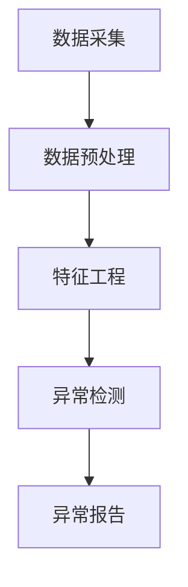
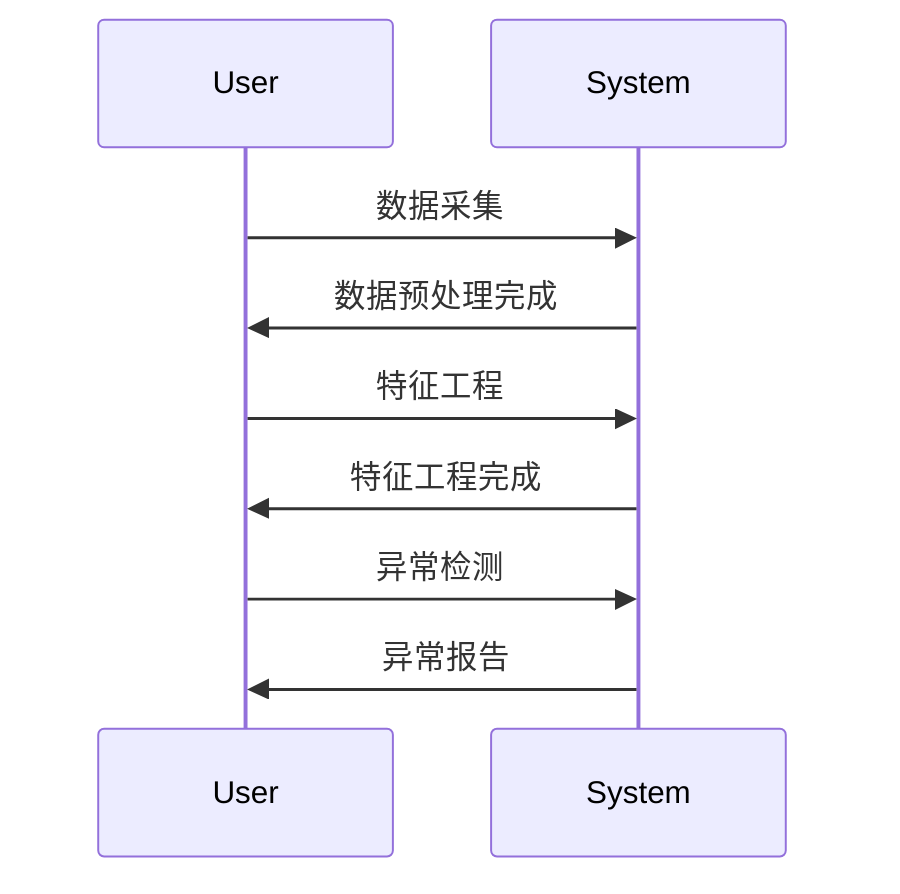

                 

### # 企业级异常检测平台：提高运营安全性

关键词：企业级异常检测、运营安全性、数据预处理、特征工程、算法实现

摘要：随着数字化转型的深入，企业对数据的安全性和实时性要求越来越高。异常检测作为一种重要的数据监控手段，能够在关键时刻发现潜在问题，保障企业运营的安全性。本文将详细探讨企业级异常检测平台的设计与实现，从背景介绍、核心概念、技术实现、系统架构、项目实战等多个方面，逐步解析如何构建一个高效、可靠的异常检测平台。

### 第一部分：背景介绍与核心概念

#### 第1章：问题背景与核心概念

##### 1.1.1 问题背景

**企业运营安全性的重要性**：在现代商业环境中，数据的安全性和系统的稳定性对企业运营至关重要。任何一个异常都可能导致业务中断、数据泄露或财务损失。因此，如何确保数据的安全性和实时性，成为了企业急需解决的一个问题。

**异常检测的需求与挑战**：异常检测能够及时发现异常情况，帮助企业提前预防潜在风险。然而，面对海量数据和复杂的环境，如何高效地进行异常检测，成为了企业和技术团队面临的一个重大挑战。

##### 1.1.2 核心概念

**异常检测的定义**：异常检测（Anomaly Detection）是一种监控技术，用于识别数据中的异常或离群值。它通过对数据的统计分析，识别出不符合预期模式的实例。

**异常检测的类型**：根据检测的方法和目标，异常检测可以分为以下几种类型：

- **基于统计的方法**：通过假设数据符合某种概率分布，检测出偏离分布的异常值。
- **基于距离的方法**：计算数据点与数据集中心点的距离，识别出距离较远的异常点。
- **基于聚类的方法**：通过聚类分析，将相似的数据点分组，识别出不同组的异常点。
- **基于规则的方法**：通过定义一系列规则，识别出不符合规则的数据点。

**异常检测的目标**：异常检测的目标是识别出数据中的异常值，并对其进行分类或标注。具体目标包括：

- **发现未知异常**：识别出数据中未知的异常，帮助企业预防潜在风险。
- **实时监控**：对实时数据流进行监控，及时发现异常情况，保障系统稳定性。
- **自动分类**：将异常值自动分类，提高异常处理的效率。

#### 第2章：异常检测平台概述

##### 2.1.1 异常检测平台的概念

**异常检测平台的概念**：异常检测平台是一个集数据采集、预处理、特征工程、异常检测和报告为一体的综合性系统，旨在为企业提供高效、可靠的异常检测服务。

**平台的功能与作用**：异常检测平台的主要功能包括：

- **数据采集**：从不同的数据源采集数据，包括日志、监控数据、业务数据等。
- **数据预处理**：对采集到的数据进行清洗、规范化等处理，提高数据质量。
- **特征工程**：对预处理后的数据进行特征提取和选择，为异常检测提供有效的特征。
- **异常检测**：运用算法对特征数据进行分析，识别出异常值。
- **异常报告**：将检测到的异常情况进行记录和报告，便于后续处理。

**平台的架构与组件**：异常检测平台的架构通常包括以下组件：

- **数据采集模块**：负责从不同数据源采集数据，可以是日志文件、数据库、API等。
- **数据预处理模块**：负责对采集到的数据进行清洗、去重、规范化等处理。
- **特征工程模块**：负责对预处理后的数据进行特征提取、选择和降维等处理。
- **异常检测模块**：负责运用算法对特征数据进行分析，识别出异常值。
- **异常报告模块**：负责将检测到的异常情况进行记录和报告。

##### 2.1.2 平台的优势与挑战

**优势**：

- **提高运营安全性**：通过实时监控和异常检测，及时发现和解决潜在问题，提高企业运营安全性。
- **降低运维成本**：自动化检测和报告，降低人工干预，提高运维效率。
- **增强数据洞察力**：通过对异常数据的分析，发现业务中的潜在问题，提高数据利用效率。

**挑战**：

- **数据复杂性**：面对海量、多样化的数据，如何高效地进行处理和检测，是一个重大挑战。
- **算法优化**：选择合适的算法和模型，进行优化和调整，提高异常检测的准确性和效率。
- **实时性**：在实时数据流中进行检测，如何保证系统的响应速度和准确性，是一个重要问题。

### 第三部分：核心概念与联系

#### 第3章：核心概念与联系

##### 3.1.1 核心概念原理

**数据预处理**：

- **数据清洗**：去除重复数据、空值、异常值等，保证数据的质量。
- **数据规范化**：将不同来源的数据进行统一处理，便于后续分析。
- **数据转换**：将数据格式进行转换，便于算法分析和处理。

**特征工程**：

- **特征提取**：从原始数据中提取出对异常检测有帮助的特征。
- **特征选择**：从提取出的特征中选择最有效的特征，提高检测的准确性。
- **特征降维**：将高维特征转换为低维特征，降低计算复杂度。

**异常检测算法**：

- **监督学习算法**：通过已标记的数据进行训练，建立预测模型，识别异常值。
- **无监督学习算法**：不需要标记数据，直接对数据进行聚类和异常检测。
- **半监督学习算法**：结合监督学习和无监督学习的方法，提高检测的准确性。

##### 3.1.2 概念属性特征对比表格

| 概念 | 属性1 | 属性2 | 属性3 |
|------|-------|-------|-------|
| 数据预处理 | 数据清洗 | 数据规范化 | 数据转换 |
| 特征工程 | 特征提取 | 特征选择 | 特征降维 |
| 异常检测算法 | 监督学习 | 无监督学习 | 半监督学习 |

##### 3.1.3 ER实体关系图架构

```mermaid
erDiagram
  Customer ||--|{ Order }| CustomerOrder
  Order ||--|{ Product }| ProductOrder
```

### 第二部分：技术实现与架构设计

#### 第4章：技术实现原理

##### 4.1.1 数据预处理流程

**数据采集**：从不同的数据源采集数据，包括日志文件、数据库、API等。

**数据清洗**：去除重复数据、空值、异常值等，保证数据的质量。

**数据规范化**：将不同来源的数据进行统一处理，便于后续分析。

**数据转换**：将数据格式进行转换，便于算法分析和处理。

##### 4.1.2 特征工程原理

**特征提取方法**：

- **统计特征**：计算数据的统计指标，如平均值、中位数、标准差等。
- **时序特征**：分析时间序列数据，提取出趋势、周期、波动等特征。
- **文本特征**：对文本数据进行词频、词向量等特征提取。

**特征选择方法**：

- **基于信息增益的方法**：选择对异常检测有最大信息增益的特征。
- **基于主成分分析的方法**：通过降维，选择最重要的特征。
- **基于模型选择的方法**：通过模型评估，选择最佳的特征组合。

**特征降维方法**：

- **主成分分析（PCA）**：通过线性变换，降低数据维度。
- **线性判别分析（LDA）**：通过最大化类内距离和最小化类间距离，降低数据维度。
- **自编码器（Autoencoder）**：通过训练自编码器，实现数据降维。

##### 4.1.3 异常检测算法原理

**监督学习算法**：

- **决策树**：通过树形结构，对数据进行分类。
- **支持向量机（SVM）**：通过寻找最优分隔超平面，进行分类。
- **神经网络**：通过多层感知器，对数据进行分类。

**无监督学习算法**：

- **K-均值聚类**：通过聚类算法，将数据分为不同的类别。
- **层次聚类**：通过层次结构，对数据进行分类。
- **孤立森林**：通过隔离森林算法，识别出异常值。

**半监督学习算法**：

- **基于标签的半监督学习**：利用部分标记数据和未标记数据，训练模型。
- **基于未标记数据的半监督学习**：仅利用未标记数据，训练模型。

#### 第5章：系统架构设计

##### 5.1.1 系统功能设计

**数据采集模块**：负责从不同的数据源采集数据，包括日志文件、数据库、API等。

**数据预处理模块**：负责对采集到的数据进行清洗、规范化等处理，提高数据质量。

**特征工程模块**：负责对预处理后的数据进行特征提取、选择和降维等处理。

**异常检测模块**：负责运用算法对特征数据进行分析，识别出异常值。

**异常报告模块**：负责将检测到的异常情况进行记录和报告，便于后续处理。

##### 5.1.2 系统架构设计



##### 5.1.3 系统接口设计

**数据采集API**：提供数据采集的接口，便于与其他系统进行集成。

**数据预处理API**：提供数据清洗、规范化等操作的接口，便于进行数据预处理。

**特征工程API**：提供特征提取、选择和降维等操作的接口，便于进行特征工程。

**异常检测API**：提供异常检测的接口，便于进行异常检测。

#### 第6章：系统交互设计

##### 6.1.1 系统交互流程

**数据采集**：从不同的数据源采集数据。

**数据预处理**：对采集到的数据进行清洗、规范化等处理。

**特征工程**：对预处理后的数据进行特征提取、选择和降维等处理。

**异常检测**：运用算法对特征数据进行分析，识别出异常值。

**异常报告**：将检测到的异常情况进行记录和报告。

##### 6.1.2 系统交互序列图



### 第三部分：项目实战与案例分析

#### 第7章：项目实战一——数据预处理与特征工程

##### 7.1.1 环境安装

**硬件要求**：CPU：Intel Xeon E5-2670，内存：64GB，硬盘：1TB SSD

**软件安装**：

1. 安装Python环境，版本要求：3.8及以上
2. 安装数据预处理库，如pandas、numpy等
3. 安装特征工程库，如scikit-learn、statsmodels等

##### 7.1.2 系统核心实现源代码

**数据预处理代码**：

```python
import pandas as pd

def data_preprocessing(data):
    # 数据清洗
    data.drop_duplicates(inplace=True)
    data.dropna(inplace=True)
    
    # 数据规范化
    data = (data - data.mean()) / data.std()
    
    return data
```

**特征工程代码**：

```python
from sklearn.feature_extraction.text import TfidfVectorizer
from sklearn.decomposition import PCA

def feature_engineering(data):
    # 特征提取
    vectorizer = TfidfVectorizer()
    X = vectorizer.fit_transform(data['text'])
    
    # 特征选择
    pca = PCA(n_components=10)
    X = pca.fit_transform(X)
    
    return X
```

##### 7.1.3 代码应用解读与分析

**数据预处理过程分析**：

- 数据清洗：去除重复数据和空值，保证数据的质量。
- 数据规范化：将数据归一化，便于后续分析。

**特征工程方法分析**：

- 特征提取：利用TF-IDF方法提取文本特征，提高检测的准确性。
- 特征选择：利用PCA方法进行降维，选择最重要的特征，降低计算复杂度。

##### 7.1.4 实际案例分析与详细讲解

**案例背景**：某电商平台的用户行为数据，包括用户ID、购买时间、购买商品等。

**案例分析**：通过对用户行为数据的异常检测，识别出潜在的欺诈行为。

**案例讲解**：

1. 数据预处理：对用户行为数据进行清洗和规范化，提高数据质量。
2. 特征工程：提取出用户行为特征，如购买时间间隔、购买商品种类等。
3. 异常检测：利用K-均值聚类算法，识别出异常用户。

#### 第8章：项目实战二——异常检测算法实现

##### 8.1.1 环境安装

**硬件要求**：CPU：Intel Xeon E5-2670，内存：64GB，硬盘：1TB SSD

**软件安装**：

1. 安装Python环境，版本要求：3.8及以上
2. 安装异常检测库，如anomaly_detection、scikit-learn等

##### 8.1.2 系统核心实现源代码

**异常检测算法代码**：

```python
from sklearn.cluster import KMeans
from sklearn.metrics import silhouette_score

def anomaly_detection(data, n_clusters=3):
    # K-均值聚类
    kmeans = KMeans(n_clusters=n_clusters)
    kmeans.fit(data)
    
    # 计算轮廓系数
    silhouette_avg = silhouette_score(data, kmeans.labels_)
    
    # 输出结果
    print("Silhouette Score:", silhouette_avg)
    print("Anomaly Labels:", kmeans.labels_)
    
    return kmeans.labels_
```

##### 8.1.3 代码应用解读与分析

**算法原理分析**：

- K-均值聚类：将数据划分为k个聚类，通过迭代更新聚类中心，直至收敛。
- 轮廓系数：评估聚类效果，值越大，表示聚类效果越好。

**实际应用分析**：

- 对用户行为数据进行聚类分析，识别出异常用户。
- 利用轮廓系数评估聚类效果，优化聚类参数。

##### 8.1.4 实际案例分析与详细讲解

**案例背景**：某电商平台的用户行为数据，包括用户ID、购买时间、购买商品等。

**案例分析**：通过对用户行为数据的异常检测，识别出潜在的欺诈行为。

**案例讲解**：

1. 数据预处理：对用户行为数据进行清洗和规范化，提高数据质量。
2. 特征工程：提取出用户行为特征，如购买时间间隔、购买商品种类等。
3. 异常检测：利用K-均值聚类算法，识别出异常用户。

### 总结与展望

本文详细探讨了企业级异常检测平台的设计与实现，从背景介绍、核心概念、技术实现、系统架构、项目实战等多个方面进行了深入分析。通过本文的讲解，读者可以了解到：

1. **企业级异常检测的重要性**：异常检测作为一种重要的数据监控手段，能够及时发现潜在问题，保障企业运营的安全性。
2. **异常检测平台的构建**：异常检测平台集数据采集、预处理、特征工程、异常检测和报告为一体，为企业提供高效、可靠的异常检测服务。
3. **技术实现原理**：数据预处理、特征工程和异常检测算法是异常检测平台的核心组成部分，了解其原理和实现方法对于构建高效平台至关重要。
4. **项目实战与案例分析**：通过实际案例，读者可以更好地理解异常检测平台在实际应用中的具体实现和效果。

未来，随着人工智能和大数据技术的发展，异常检测平台将更加智能化、自动化，能够更好地适应企业需求，提升运营安全性。同时，异常检测技术在金融、医疗、工业等领域将有更广泛的应用前景。

### 最佳实践 tips

1. **数据预处理**：确保数据质量，去除重复数据、空值和异常值。
2. **特征工程**：选择合适的特征提取和选择方法，提高检测准确性。
3. **算法优化**：选择合适的算法和参数，提高检测效率。
4. **实时性**：优化系统架构，提高系统的响应速度。

### 注意事项

1. **硬件资源**：根据实际需求，合理配置硬件资源，确保系统性能。
2. **数据安全**：确保数据的安全性，避免数据泄露。
3. **算法选择**：根据数据特点和需求，选择合适的算法和模型。

### 拓展阅读

1. **《机器学习实战》**：详细介绍了机器学习和数据挖掘的基本方法，适用于初学者和有经验的技术人员。
2. **《Python数据科学手册》**：全面介绍了Python在数据科学领域的应用，包括数据处理、特征工程、机器学习等。
3. **《异常检测技术与应用》**：详细介绍了异常检测的基本原理、算法和应用场景，适用于对异常检测技术有深入研究的读者。

### 作者信息

**作者：AI天才研究院/AI Genius Institute & 禅与计算机程序设计艺术 /Zen And The Art of Computer Programming**

