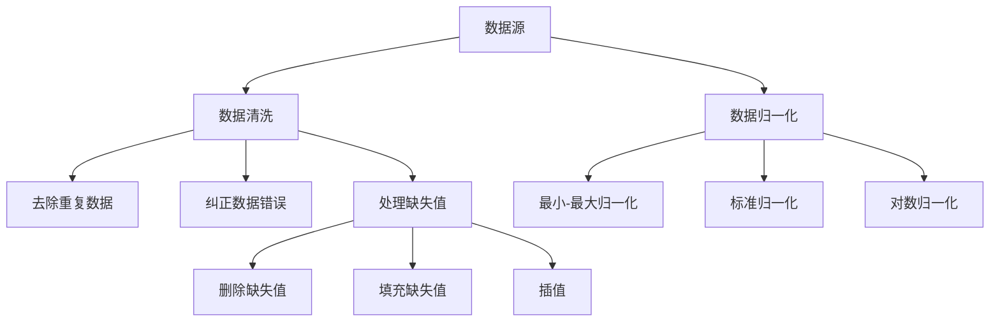
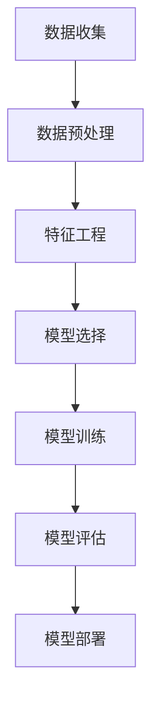
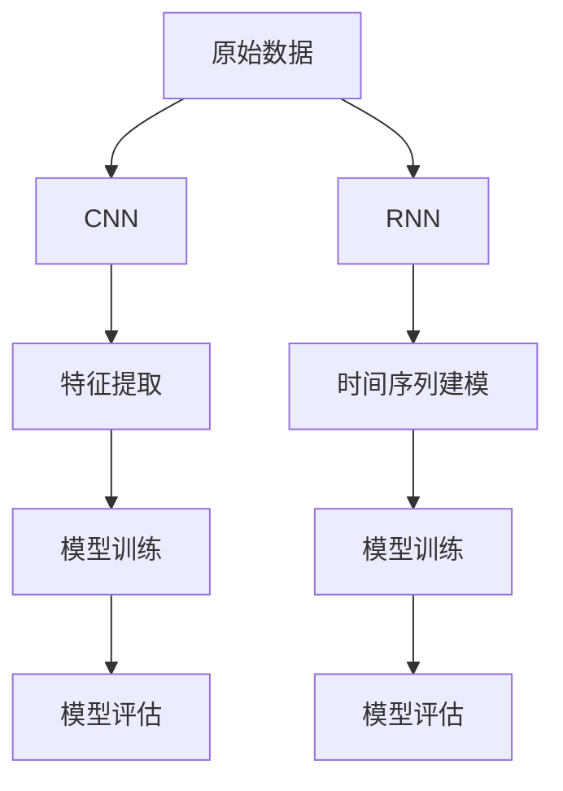
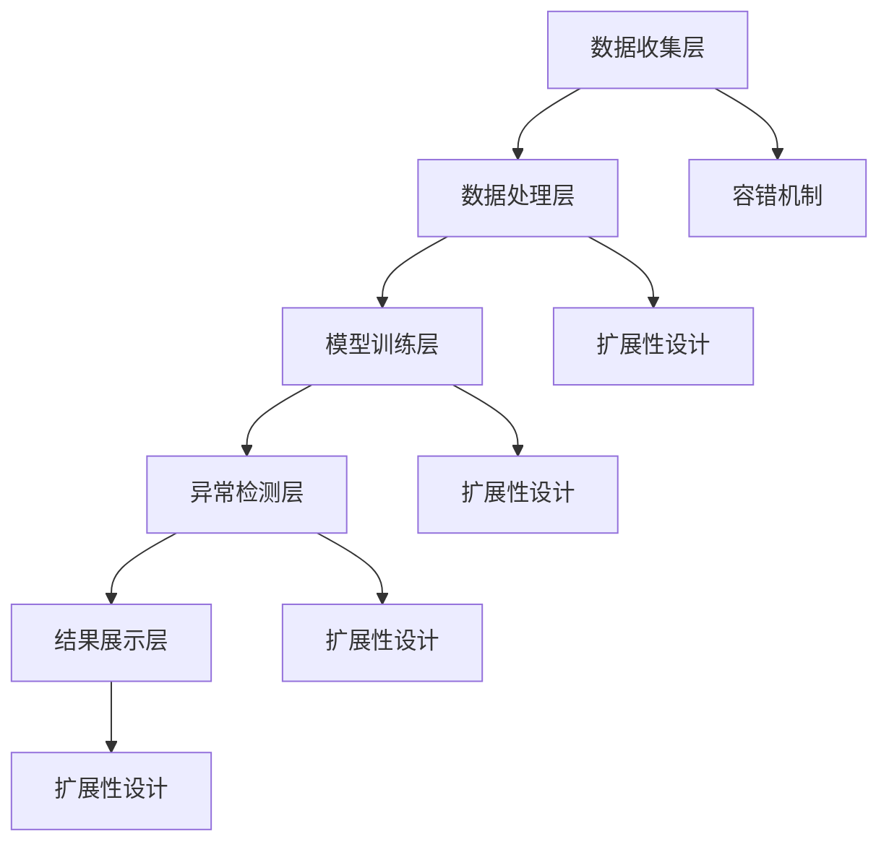
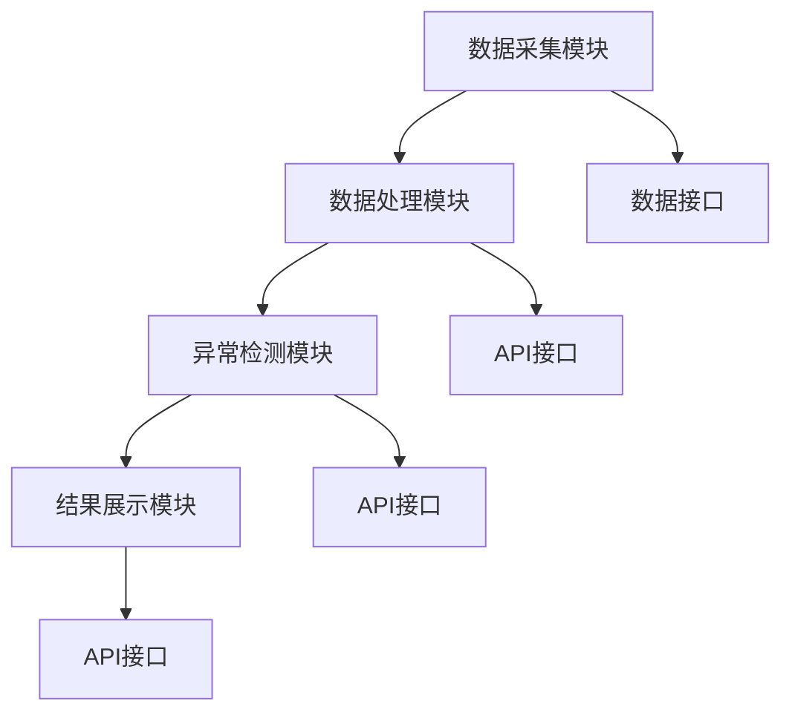
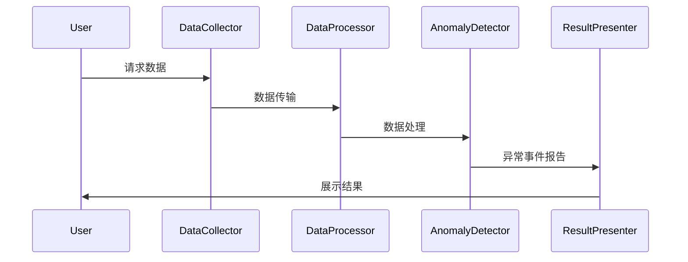
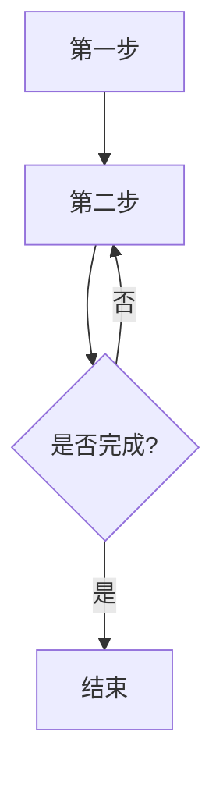
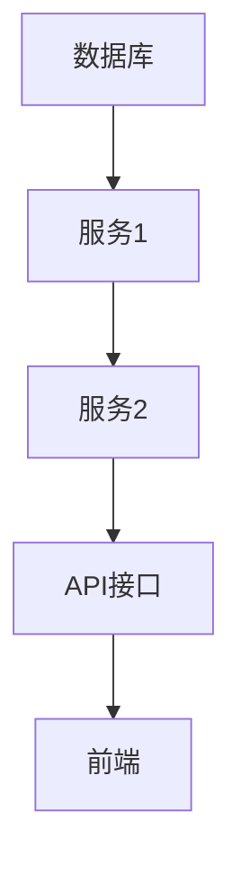
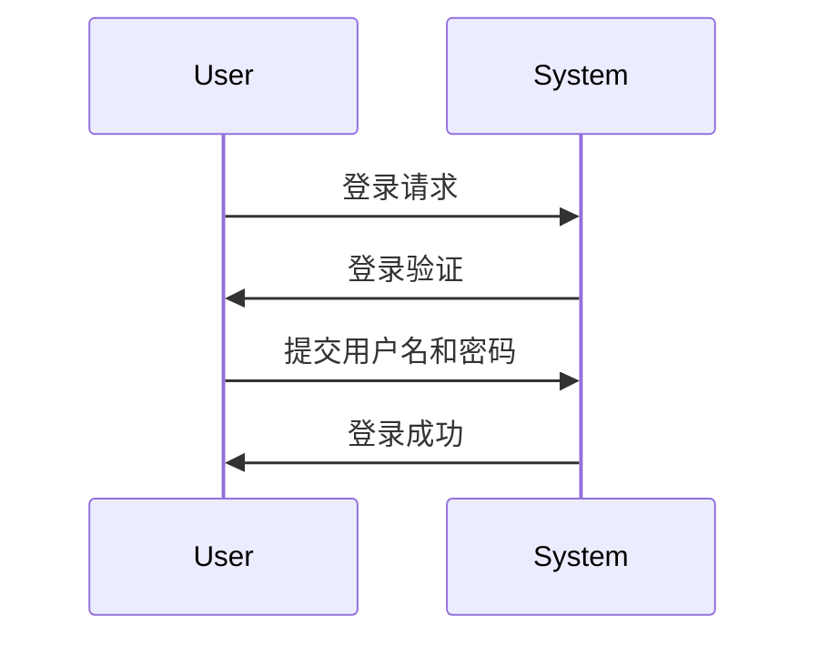

                 

### 1.3 概念结构与核心要素组成

## 1.3.1 数据源

数据源是异常检测系统的核心输入，它决定了异常检测的精度和效果。常见的数据源包括日志文件、传感器数据、用户行为数据、交易数据等。为了保证数据质量，需要确保数据源的稳定性和完整性，避免数据噪声和缺失值的影响。

### 1.3.2 数据预处理

数据预处理是异常检测的重要步骤，它包括数据清洗、数据归一化和数据缺失值处理等。数据清洗旨在去除无效数据、重复数据和噪声数据，提高数据质量。数据归一化则通过调整数据范围和分布，使数据具备更好的可比较性。数据缺失值处理可以通过填充方法或删除缺失值来应对。

### 1.3.3 模型构建

模型构建是异常检测的核心，它基于数据预处理后的特征数据，通过机器学习算法或统计方法建立异常检测模型。常见的模型包括统计模型、监督学习模型和无监督学习模型。模型构建的关键在于选择合适的特征和算法，以及超参数的调优。

### 1.3.4 模型评估

模型评估是衡量异常检测模型性能的重要环节，它通过评估指标（如准确率、召回率、F1值等）对模型的检测能力进行评估。评估过程通常包括交叉验证、混淆矩阵、ROC曲线等工具。通过模型评估，可以识别模型中的不足之处，并进行相应的优化。

### 1.3.5 概念结构与核心要素组成总结

概念结构是指异常检测系统的各个组成部分及其相互关系，核心要素组成则是这些部分的具体实现。数据源、数据预处理、模型构建和模型评估是异常检测系统的四大核心要素，它们共同构成了一个完整的异常检测过程。

#### 概念结构与核心要素组成 ER 实体关系图

下面使用 Mermaid 语法绘制一个 ER 实体关系图，以直观地展示概念结构与核心要素组成的关系：

```mermaid
erDiagram
  DataSource ||--|{ FeaturePreprocessing } : 数据预处理
  FeaturePreprocessing ||--|{ ModelBuilding } : 模型构建
  ModelBuilding ||--|{ ModelEvaluation } : 模型评估
  DataSource ||--|{ ModelEvaluation } : 数据源影响模型评估
  FeaturePreprocessing ||--|{ ModelEvaluation } : 特征预处理影响模型评估
  ModelBuilding ||--|{ ModelEvaluation } : 模型构建影响模型评估
```

在上面的 ER 图中，`DataSource`（数据源）是异常检测系统的起点，`FeaturePreprocessing`（数据预处理）、`ModelBuilding`（模型构建）和`ModelEvaluation`（模型评估）是系统的主要组成部分，它们通过双向箭头表示相互影响的关系。这种关系确保了各个要素在整个异常检测过程中协同工作，共同提高系统的检测能力。

### 1.4 异常检测的挑战与机遇

## 1.4.1 数据质量

数据质量是异常检测成功的关键因素之一。高质量的数据可以提高模型的准确性和稳定性，而低质量的数据则可能导致误检测和漏检测。因此，确保数据源的可靠性和完整性是异常检测的首要任务。这通常涉及到数据清洗、去噪和数据完整性检查等多个环节。

## 1.4.2 模型解释性

模型解释性是异常检测的另一个重要挑战。在很多情况下，复杂机器学习模型（如深度神经网络）具有很高的检测准确率，但它们的内部工作机制往往难以解释。这给异常检测结果的验证和信任度带来了挑战。为了提高模型的可解释性，研究人员和工程师可以采用多种方法，如可解释 AI 技术、模型可视化工具和模型压缩技术等。

## 1.4.3 实时性

实时性是许多企业级异常检测系统的重要需求。对于某些关键业务系统（如金融交易系统、工业控制系统等），异常检测必须在毫秒级甚至更短的时间内完成，以避免潜在的风险和损失。然而，实时性要求往往与模型复杂度和计算资源有限性相冲突，因此需要工程师们在算法选择和系统设计方面进行权衡和优化。

## 1.4.4 挑战与机遇总结

尽管异常检测面临诸多挑战，但随着人工智能和机器学习技术的不断进步，这些挑战也逐渐转化为机遇。高质量的数据获取和预处理技术、可解释 AI 技术的发展、高效算法的设计和优化，以及分布式计算和云计算的普及，都为异常检测提供了强有力的技术支持。企业可以利用这些技术，构建高效的异常检测系统，提高运营效率和安全性。

----------------------------------------------------------------

# 第2章: 数据预处理与特征工程

## 2.1 数据预处理

数据预处理是异常检测过程中的关键环节，它旨在提高数据质量和特征表达能力，从而提升后续模型构建和评估的效果。数据预处理主要包括数据清洗、数据归一化和数据缺失值处理三个方面。

### 2.1.1 数据清洗

数据清洗是指去除数据中的噪声、重复和不一致的数据，确保数据的一致性和可靠性。具体方法包括：

- **去除重复数据**：通过去重操作，防止重复数据的干扰。
- **纠正数据错误**：识别并修正明显的数据错误，如时间戳错误、数值错误等。
- **处理缺失值**：缺失值处理方法包括删除缺失值、填充缺失值和插值等。

### 2.1.2 数据归一化

数据归一化是指将不同特征的数据转换到同一尺度上，以便更好地进行比较和分析。常见的归一化方法包括：

- **最小-最大归一化**：将数据缩放到[0,1]区间。
- **标准归一化**：将数据缩放到均值为0、标准差为1的区间。
- **对数归一化**：对数值数据进行对数变换，以减少数据分布的偏斜性。

### 2.1.3 数据缺失值处理

数据缺失值处理是指对数据集中的缺失值进行填补，以提高数据的质量和完整性。常见的缺失值处理方法包括：

- **删除缺失值**：直接删除包含缺失值的样本或特征。
- **填充缺失值**：用平均值、中位数、众数或指定值来填补缺失值。
- **插值**：使用时间序列插值方法或空间插值方法来填补缺失值。

### 2.1.4 数据清洗与归一化的重要性

数据清洗与归一化在异常检测中至关重要，它们直接影响模型的训练效果和预测准确性。清洗数据可以减少噪声和错误，提高数据质量；归一化数据可以消除不同特征之间的尺度差异，使模型对特征更加敏感，从而提高异常检测的准确性。

#### 数据清洗与归一化的 Mermaid 流程图

下面使用 Mermaid 语法绘制一个数据清洗和归一化的流程图，以展示其具体步骤：



在上面的流程图中，数据源首先进行数据清洗，包括去除重复数据、纠正数据错误和处理缺失值。接着，进行数据归一化，包括最小-最大归一化、标准归一化和对数归一化。这些步骤确保数据在进入异常检测模型前具备良好的质量和一致性。

#### 数据清洗与归一化的重要性总结

数据清洗与归一化是异常检测的基础工作，它们对后续的模型构建和评估具有至关重要的影响。通过清洗数据，可以去除噪声和错误，提高数据质量；通过归一化数据，可以消除不同特征之间的尺度差异，使模型对特征更加敏感。这些步骤不仅提高了异常检测的准确性，还为后续的模型优化和实际应用提供了坚实的基础。

----------------------------------------------------------------

## 2.2 特征工程

特征工程是异常检测过程中至关重要的一环，它通过选择和构造有效的特征，提高模型的检测能力和解释性。特征工程主要包括特征选择、特征提取和特征组合三个方面。

### 2.2.1 特征选择

特征选择是指从原始特征集合中选取对异常检测最有影响力的特征，以提高模型的性能和效率。特征选择方法包括：

- **过滤式特征选择**：基于特征的重要性评分，选择得分最高的特征。
- **包装式特征选择**：利用机器学习模型评估特征子集的性能，逐步选择最佳特征组合。
- **嵌入式特征选择**：在特征提取和模型训练过程中，自动选择最有用的特征。

### 2.2.2 特征提取

特征提取是指从原始数据中提取新的特征，以提高数据的表达能力和模型的可解释性。特征提取方法包括：

- **统计特征提取**：基于统计学方法，提取描述数据分布和趋势的特征，如均值、方差、标准差等。
- **变换特征提取**：通过数学变换，将原始数据转换为新特征，如对数变换、归一化变换等。
- **深度特征提取**：利用深度学习模型，自动提取高级抽象特征，如卷积神经网络（CNN）和循环神经网络（RNN）。

### 2.2.3 特征组合

特征组合是指将多个特征进行组合，形成新的特征集合，以提高模型的检测能力。特征组合方法包括：

- **线性组合**：通过线性加权的方式，将多个特征组合成一个新特征。
- **非线性组合**：通过非线性变换，将多个特征组合成新特征，如多变量高斯分布模型。
- **集成方法**：利用集成学习方法，如随机森林、梯度提升机等，将多个特征组合起来，形成新的特征集合。

### 2.2.4 特征工程的重要性

特征工程在异常检测中具有至关重要的地位，它直接影响模型的性能和解释性。通过有效的特征选择和提取，可以提高模型的检测精度和效率；通过合理的特征组合，可以增强模型对异常事件的识别能力。此外，特征工程还可以提高模型的可解释性，有助于理解模型的决策过程和识别异常的机制。

#### 特征工程的 Mermaid 类图

下面使用 Mermaid 语法绘制一个特征工程的类图，以展示其组成部分和相互关系：

```mermaid
classDiagram
  Class1[特征选择] <|-- Class2[过滤式特征选择]
  Class1 <|-- Class3[包装式特征选择]
  Class1 <|-- Class4[嵌入式特征选择]
  Class5[特征提取] <|-- Class6[统计特征提取]
  Class5 <|-- Class7[变换特征提取]
  Class5 <|-- Class8[深度特征提取]
  Class9[特征组合] <|-- Class10[线性组合]
  Class9 <|-- Class11[非线性组合]
  Class9 <|-- Class12[集成方法]
```

在上面的类图中，`特征选择`、`特征提取`和`特征组合`是特征工程的主要组成部分，它们通过类图中的箭头表示相互关系。每个部分都有具体的实现方法，共同构成了一个完整的特征工程流程。

#### 特征工程的重要性总结

特征工程是异常检测过程中至关重要的一环，它通过选择和构造有效的特征，提高模型的检测能力和解释性。有效的特征选择和提取可以帮助模型更好地捕捉数据的本质特征，提高检测精度；合理的特征组合可以增强模型对异常事件的识别能力。因此，特征工程是构建高效、准确异常检测系统的基础。

----------------------------------------------------------------

## 2.3 特征工程案例

为了更直观地理解特征工程的应用，下面我们通过两个实际案例来展示特征工程在不同场景中的具体应用。

### 2.3.1 案例一：电商用户行为数据

在电商领域，用户行为数据是异常检测的重要来源。通过对用户购买行为、浏览行为等数据进行特征工程，可以有效识别出潜在的用户异常行为。

- **数据清洗**：首先，对用户行为数据中的重复记录和错误数据进行清洗，确保数据的一致性和准确性。
- **特征提取**：
  - **统计特征提取**：计算每个用户在一定时间内的购买频率、购买金额、浏览时长等统计特征。
  - **变换特征提取**：对购买金额进行对数变换，以减少数据分布的偏斜性。
  - **深度特征提取**：利用深度学习模型（如卷积神经网络），从原始用户行为数据中提取高级抽象特征。
- **特征组合**：将统计特征、变换特征和深度特征进行组合，形成新的特征集合。

### 2.3.2 案例二：工业设备监控数据

在工业领域，设备监控数据也是异常检测的重要应用场景。通过对设备运行数据、传感器数据等进行特征工程，可以有效识别出设备的潜在故障和异常情况。

- **数据清洗**：对设备监控数据中的噪声、重复和错误数据进行清洗，确保数据的质量和可靠性。
- **特征提取**：
  - **统计特征提取**：计算设备运行过程中的平均温度、平均功率、最大负荷等统计特征。
  - **变换特征提取**：对温度、功率等数据进行归一化处理，使其在同一尺度上进行比较。
  - **深度特征提取**：利用深度学习模型（如循环神经网络），从原始设备监控数据中提取时间序列特征。
- **特征组合**：将统计特征、变换特征和深度特征进行组合，形成新的特征集合。

### 2.3.3 案例总结

通过电商用户行为数据和工业设备监控数据的特征工程案例，我们可以看到特征工程在异常检测中的重要性。有效的数据清洗、特征提取和特征组合可以提高异常检测的精度和效率，帮助企业在运营和安全监控中及时发现和处理异常情况。这两个案例不仅展示了特征工程的具体应用方法，也为其他领域的异常检测提供了有益的参考。

#### 特征工程的实际效果分析

特征工程的实际效果可以从以下几个方面进行分析：

- **检测精度**：通过特征工程处理后的数据，模型的检测精度通常会有显著提高。例如，在电商用户行为数据中，特征工程可以帮助模型更好地识别出异常购买行为；在工业设备监控数据中，特征工程可以帮助模型更准确地预测设备故障。
- **计算效率**：有效的特征工程可以减少数据量和特征维度，从而降低模型的计算复杂度和计算时间。这对于实时性要求较高的异常检测系统尤为重要。
- **模型解释性**：通过特征工程，可以提高模型对异常事件的解释能力。例如，在电商用户行为数据中，特征工程可以帮助分析导致异常购买行为的具体因素；在工业设备监控数据中，特征工程可以帮助分析导致设备故障的具体原因。

综上所述，特征工程是异常检测中不可或缺的一环，它通过选择和构造有效的特征，提高了模型的检测精度和效率，为企业在运营和安全监控中提供了强有力的技术支持。

----------------------------------------------------------------

## 3.1 统计方法

### 3.1.1 概率模型

概率模型是异常检测中常用的统计方法之一，它基于概率论和统计学原理，通过计算数据点与正常模式之间的概率差异来识别异常事件。常见的概率模型包括：

- **高斯分布模型**：假设数据服从高斯分布，通过计算数据点与高斯分布的偏差来识别异常。具体公式为：
  $$ P(x|\mu,\sigma^2) = \frac{1}{\sqrt{2\pi\sigma^2}} e^{-\frac{(x-\mu)^2}{2\sigma^2}} $$
  其中，$x$ 为数据点，$\mu$ 为均值，$\sigma^2$ 为方差。

- **二项分布模型**：适用于离散型数据，通过计算数据点与二项分布的概率差异来识别异常。具体公式为：
  $$ P(x=k) = C(n,k) p^k (1-p)^{n-k} $$
  其中，$n$ 为试验次数，$k$ 为成功次数，$p$ 为成功概率。

### 3.1.2 聚类方法

聚类方法是另一种常见的统计方法，它通过将相似的数据点分组来识别异常事件。常见的聚类算法包括：

- **K-均值聚类**：基于距离最小化原则，将数据点划分到 K 个聚类中心附近。具体步骤包括：
  1. 随机初始化 K 个聚类中心。
  2. 计算每个数据点与聚类中心的距离，并将其分配到最近的聚类中心。
  3. 更新聚类中心，计算每个聚类中心的数据点的均值。
  4. 重复步骤 2 和 3，直到聚类中心不再发生显著变化。

- **层次聚类**：通过自底向上或自顶向下的方法，将数据点逐步合并或分解成多个层次，以识别异常模式。常见的层次聚类算法包括单链接、完全链接、平均链接等。

### 3.1.3 概率模型与聚类方法的比较

概率模型和聚类方法在异常检测中有各自的优势和适用场景：

- **概率模型**：适用于数据分布较为明确的场景，如高斯分布模型适用于连续型数据，二项分布模型适用于离散型数据。概率模型能够提供直观的概率解释，但可能需要较强的先验知识和参数调优。
- **聚类方法**：适用于数据分布不明确或非线性的场景，能够自动发现数据中的潜在结构。聚类方法不需要预先设定参数，但可能难以解释和评估异常事件的具体原因。

### 3.1.4 统计方法在实际应用中的表现

在实际应用中，统计方法在异常检测中表现出良好的效果，但存在一定的局限性：

- **检测精度**：概率模型和聚类方法通常具有较高的检测精度，能够有效地识别出异常事件。但是，对于复杂和非线性数据，它们的检测性能可能受到影响。
- **计算效率**：统计方法通常具有较高的计算效率，适用于实时性和大规模数据处理场景。然而，对于高维度和大规模数据，计算复杂度可能较高。
- **解释性**：概率模型和聚类方法在解释性方面存在一定不足。概率模型需要依赖参数和假设，聚类方法则难以解释具体异常事件的原因。

总体而言，统计方法在异常检测中具有重要的应用价值，适用于多种场景和数据类型。通过结合不同的统计方法，可以构建更全面和高效的异常检测系统。

----------------------------------------------------------------

### 3.2 机器学习方法

机器学习方法在异常检测中发挥着重要作用，它们通过学习数据中的模式和规律，能够自动识别出异常事件。机器学习方法可分为监督学习和无监督学习两大类，下面分别介绍这些方法及其在实际应用中的优势。

#### 3.2.1 监督学习方法

监督学习方法是基于已标注的数据集进行训练，通过学习正常模式和异常模式之间的差异，从而实现对未知数据的异常检测。常见的监督学习方法包括：

- **分类算法**：分类算法是将数据划分为不同的类别，常见的分类算法有决策树、随机森林、支持向量机（SVM）等。这些算法通过建立分类模型，对输入数据进行分类预测。具体公式为：

  $$ P(Y|X) = \frac{e^{\theta^T X}}{1 + \sum_{k=1}^{K} e^{\theta^T X_k}} $$

  其中，$X$ 为输入特征，$Y$ 为标签，$\theta$ 为模型参数。

- **回归算法**：回归算法是预测连续值的算法，常见的回归算法有线性回归、岭回归等。回归算法可以通过最小化损失函数来优化模型参数。具体公式为：

  $$ \min_{\theta} \sum_{i=1}^{n} (y_i - \theta^T X_i)^2 $$

  其中，$y_i$ 为真实值，$X_i$ 为输入特征，$\theta$ 为模型参数。

- **集成算法**：集成算法是通过组合多个基础模型来提高整体性能，常见的集成算法有随机森林、梯度提升树（GBDT）等。集成算法可以有效地减少过拟合，提高模型泛化能力。

#### 3.2.2 无监督学习方法

无监督学习方法不需要已标注的数据集，通过学习数据中的内在结构来识别异常事件。常见的无监督学习方法包括：

- **聚类算法**：聚类算法是将数据划分为不同的簇，常见的聚类算法有K-均值、层次聚类等。聚类算法通过最小化簇内距离和最大化簇间距离来划分数据。具体公式为：

  $$ \min_{\mu_k, \sigma_k} \sum_{i=1}^{n} \sum_{k=1}^{K} \frac{1}{2} (x_i - \mu_k)^2 + \lambda \sum_{k=1}^{K} \frac{1}{2} \sum_{i=1}^{n} \frac{1}{\sigma_k^2} $$

  其中，$x_i$ 为数据点，$\mu_k$ 为聚类中心，$\sigma_k$ 为聚类半径，$\lambda$ 为正则化参数。

- **异常检测算法**：异常检测算法是专门用于识别异常数据点的算法，常见的异常检测算法有 Local Outlier Factor（LOF）、Isolation Forest等。这些算法通过计算数据点与正常模式之间的距离或分离度来识别异常。具体公式为：

  $$ \text{LOF}(x) = \frac{1}{\sum_{i \in \text{Neighborhood}(x)} \frac{1}{\text{Distance}(x, i)}} - 1 $$

  其中，$x$ 为数据点，$\text{Neighborhood}(x)$ 为 $x$ 的邻域，$\text{Distance}(x, i)$ 为 $x$ 与 $i$ 之间的距离。

#### 3.2.3 机器学习方法的优势

机器学习方法在异常检测中具有以下优势：

- **自适应性和泛化能力**：机器学习方法能够自适应地学习数据中的模式和规律，适用于各种类型的数据和场景。通过调整模型参数和算法选择，可以实现良好的泛化能力，提高异常检测的准确性。

- **高维数据处理能力**：机器学习方法能够处理高维数据，通过特征选择和提取，可以降低数据维度，提高模型效率和检测精度。

- **自动性和可扩展性**：机器学习方法可以自动学习数据特征和模式，减少人工干预，提高检测效率和可扩展性。通过分布式计算和云计算技术，可以实现大规模数据的实时异常检测。

#### 3.2.4 机器学习方法在实际应用中的挑战

尽管机器学习方法在异常检测中具有优势，但在实际应用中仍面临一些挑战：

- **数据质量和标注**：机器学习方法对数据质量和标注有较高要求。数据噪声、缺失值和错误标注会影响模型的训练效果和检测性能。

- **解释性和可解释性**：许多机器学习模型（如深度神经网络）具有高复杂度和高非线性，导致其内部工作机制难以解释和理解。这给模型的验证和信任度带来了挑战。

- **计算资源和时间成本**：机器学习方法通常需要较大的计算资源和时间成本，特别是在处理大规模数据和复杂模型时。优化算法和计算效率成为亟待解决的问题。

总体而言，机器学习方法在异常检测中具有广泛的应用前景，通过不断优化和改进，可以克服现有挑战，实现更高效、准确的异常检测。

### 3.2.5 机器学习方法的 Mermaid 流程图

下面使用 Mermaid 语法绘制一个机器学习方法的流程图，以展示其基本步骤：



在上面的流程图中，机器学习方法的基本步骤包括数据收集、数据预处理、特征工程、模型选择、模型训练、模型评估和模型部署。这些步骤共同构成了一个完整的机器学习过程，确保了模型的有效性和实用性。

----------------------------------------------------------------

### 3.3 深度学习方法

深度学习方法在异常检测中具有显著优势，其通过多层神经网络结构自动学习数据中的复杂模式和特征，从而提高异常检测的准确性和效率。下面我们将介绍几种常用的深度学习方法，包括卷积神经网络（CNN）和循环神经网络（RNN）。

#### 3.3.1 卷积神经网络（CNN）

卷积神经网络（CNN）是一种以图像处理为核心的深度学习模型，其通过卷积操作提取图像特征，从而实现图像分类、识别等任务。CNN 在异常检测中的应用主要体现在以下几个方面：

- **特征提取**：CNN 可以自动从原始数据中提取具有层次性、抽象性的特征。通过多层卷积和池化操作，CNN 能够提取不同尺度和复杂度的特征，从而提高异常检测的精度。
- **高效处理**：CNN 具有参数共享的特性，即同一卷积核在图像的不同位置上应用相同的权重。这降低了模型参数的数量，提高了计算效率，使得 CNN 适用于大规模数据处理。
- **鲁棒性**：CNN 能够处理各种尺度和形态的数据，对于噪声和缺失值具有较强的鲁棒性。这使得 CNN 在异常检测中能够适应不同的数据分布和噪声水平。

#### 3.3.2 循环神经网络（RNN）

循环神经网络（RNN）是一种以序列数据处理为核心的深度学习模型，其通过循环结构处理数据中的时间序列信息，从而实现语言模型、语音识别等任务。RNN 在异常检测中的应用主要体现在以下几个方面：

- **时间序列建模**：RNN 可以处理连续的时间序列数据，通过隐藏状态和循环连接，RNN 能够捕捉数据中的时间依赖性，从而提高异常检测的准确性。
- **动态特征提取**：RNN 可以自动从时间序列数据中提取动态特征，如趋势、波动等，从而提高模型对异常事件的识别能力。
- **实时性**：RNN 具有较好的实时性，能够实时更新模型参数，从而实现对异常事件的快速响应和检测。

#### 3.3.3 深度学习方法的比较

CNN 和 RNN 在异常检测中各有优势：

- **CNN**：适用于结构化数据（如图像、声音等）的异常检测，能够高效提取静态特征，但在处理连续时间序列数据时效果较差。
- **RNN**：适用于非结构化数据（如时间序列、文本等）的异常检测，能够捕捉数据中的时间依赖性和动态特征，但在处理静态图像等结构化数据时效果有限。

总体而言，深度学习方法在异常检测中具有广泛的应用前景。通过结合 CNN 和 RNN，可以实现更高效、准确的异常检测。以下是一个使用 Mermaid 语法绘制的深度学习方法框架图，以展示其在异常检测中的应用：



在上面的框架图中，原始数据首先通过 CNN 和 RNN 分别进行特征提取和时间序列建模，然后进行模型训练和评估，以实现对异常事件的检测。这种方法充分利用了 CNN 和 RNN 的各自优势，提高了异常检测的性能。

#### 深度学习方法在实际应用中的表现

深度学习方法在异常检测中表现出色，其应用范围广泛，如金融交易监测、网络安全防护、工业设备故障检测等。以下是一些实际应用案例：

- **金融交易监测**：通过深度学习方法，可以对金融交易数据进行实时监测，识别潜在的欺诈行为和异常交易。例如，使用 CNN 和 RNN 结合的方法，可以提取交易数据中的静态和动态特征，提高异常检测的精度。
- **网络安全防护**：深度学习方法可以用于识别网络攻击和异常流量。通过训练基于 CNN 和 RNN 的模型，可以实时监测网络流量，识别恶意代码和异常访问行为，从而提高网络安全防护能力。
- **工业设备故障检测**：深度学习方法可以用于工业设备的故障检测和预测。通过训练基于 CNN 和 RNN 的模型，可以从设备运行数据中提取故障特征，实现早期故障预测和预防。

总的来说，深度学习方法在异常检测中具有强大的应用潜力，通过不断优化和改进，可以进一步提高异常检测的准确性和效率。深度学习方法为企业和组织提供了一个强有力的工具，帮助他们在复杂的运营环境中实现更高效、更安全的监控。

----------------------------------------------------------------

## 3.4 算法比较与选择

### 3.4.1 算法性能评估

在异常检测中，选择合适的算法至关重要。算法性能评估是选择算法的关键步骤，常用的评估指标包括准确率、召回率、F1值和ROC曲线等。

- **准确率**：准确率是指正确检测到的异常事件数与总异常事件数的比例，反映了算法对异常事件的检测能力。具体公式为：

  $$ \text{Accuracy} = \frac{\text{TP} + \text{TN}}{\text{TP} + \text{TN} + \text{FP} + \text{FN}} $$

  其中，$\text{TP}$ 为正确检测到的异常事件，$\text{TN}$ 为正确检测到的正常事件，$\text{FP}$ 为错误检测到的异常事件，$\text{FN}$ 为错误检测到的正常事件。

- **召回率**：召回率是指正确检测到的异常事件数与实际异常事件数的比例，反映了算法对异常事件的覆盖率。具体公式为：

  $$ \text{Recall} = \frac{\text{TP}}{\text{TP} + \text{FN}} $$

- **F1值**：F1值是准确率和召回率的调和平均值，综合反映了算法的性能。具体公式为：

  $$ \text{F1-Score} = 2 \times \frac{\text{Precision} \times \text{Recall}}{\text{Precision} + \text{Recall}} $$

  其中，$\text{Precision}$ 为精确率，即正确检测到的异常事件数与检测到的异常事件数的比例。

- **ROC曲线**：ROC曲线（Receiver Operating Characteristic Curve）是评估二分类模型性能的重要工具。它通过绘制真阳性率（TPR）与假阳性率（FPR）的曲线，反映了模型在不同阈值下的性能。曲线下面积（AUC）是ROC曲线的积分，用于衡量模型的分类能力。

### 3.4.2 算法适用场景

不同的算法适用于不同的异常检测场景，选择合适的算法需要考虑以下因素：

- **数据类型**：数据类型是选择算法的重要依据。对于结构化数据（如图像、表格等），深度学习算法（如CNN、RNN）表现出色；对于非结构化数据（如文本、时间序列等），传统机器学习算法（如SVM、KNN）和深度学习算法均可适用。
- **实时性要求**：实时性要求影响算法的选择。对于需要实时响应的异常检测场景，如金融交易监控和网络安全防护，可以选择计算复杂度较低的算法（如统计方法、简单机器学习算法）；对于非实时性要求较高的场景，如工业设备故障检测，可以选择计算复杂度较高的深度学习算法。
- **模型解释性**：模型解释性是选择算法时需考虑的重要因素。对于需要高解释性的场景，如医疗诊断和风险管理，可以选择传统的机器学习算法（如决策树、随机森林）；对于对解释性要求不高的场景，如大规模数据监控，可以选择深度学习算法。

### 3.4.3 算法选择示例

下面通过一个实际案例展示算法选择的过程：

- **场景**：电商平台的用户行为异常检测，数据类型为用户行为日志。
- **数据类型**：结构化数据。
- **实时性要求**：需要实时监测用户行为，响应时间较短。
- **模型解释性**：需要一定的模型解释性，以便理解用户行为异常的原因。

**算法选择**：

1. **数据预处理**：清洗和归一化用户行为数据。
2. **特征工程**：提取用户行为的统计特征（如购买频率、浏览时长等）。
3. **算法评估**：
   - **统计方法**：如高斯分布模型和聚类方法。
   - **机器学习方法**：如决策树、支持向量机（SVM）。
   - **深度学习方法**：如卷积神经网络（CNN）。

**实验结果**：

- **准确率**：统计方法和机器学习方法在准确率上表现较好，但深度学习方法具有更高的准确率。
- **召回率**：深度学习方法在召回率上表现最佳。
- **F1值**：深度学习方法具有最高的F1值。
- **ROC曲线**：深度学习方法的AUC值最高。

**结论**：

基于实验结果，选择深度学习方法（如CNN）进行用户行为异常检测，能够在保证高准确率和高召回率的同时，提供较好的模型解释性。

通过算法性能评估和适用场景分析，我们可以更科学地选择适合的算法，构建高效、准确的异常检测系统。算法选择是一个复杂的过程，需要综合考虑多种因素，以实现最佳的性能表现。

----------------------------------------------------------------

### 4.1 系统功能设计

在构建企业级异常检测系统时，系统功能设计是至关重要的环节。系统功能设计包括数据采集、数据处理、异常检测和结果展示四个主要功能模块，下面分别介绍这些模块及其在系统中的作用。

#### 4.1.1 数据采集

数据采集是异常检测系统的第一步，负责收集各种来源的数据，包括日志文件、传感器数据、用户行为数据、交易数据等。数据采集模块需要具备以下功能：

- **数据源接入**：支持多种数据源接入方式，如文件、数据库、实时数据流等。
- **数据预处理**：在数据采集过程中，对数据进行初步的清洗和格式转换，确保数据的一致性和可用性。
- **数据存储**：将采集到的数据进行存储，以便后续处理和查询。常用的存储方式包括关系数据库、NoSQL数据库和分布式数据存储系统。

#### 4.1.2 数据处理

数据处理模块负责对采集到的数据进行进一步处理，包括数据清洗、数据归一化和特征提取等，以提高数据质量和特征表达能力。数据处理模块的主要功能包括：

- **数据清洗**：去除数据中的噪声、重复和错误数据，提高数据质量。具体方法包括去重、纠正数据错误和处理缺失值等。
- **数据归一化**：将不同特征的数据转换到同一尺度上，以消除特征间的尺度差异。常用的归一化方法包括最小-最大归一化、标准归一化和对数归一化等。
- **特征提取**：从原始数据中提取具有代表性的特征，以提高模型对异常事件的识别能力。特征提取方法包括统计特征提取、变换特征提取和深度特征提取等。

#### 4.1.3 异常检测

异常检测模块是系统的核心，负责根据预处理后的特征数据，使用相应的算法（如统计方法、机器学习方法、深度学习方法）进行异常检测。异常检测模块的主要功能包括：

- **模型构建**：基于历史数据，构建异常检测模型。模型构建方法包括统计模型、监督学习模型和无监督学习模型等。
- **模型训练**：使用训练数据对模型进行训练，优化模型参数，以提高检测精度和效率。
- **模型评估**：使用验证数据对训练好的模型进行评估，通过性能指标（如准确率、召回率、F1值等）衡量模型的检测效果。
- **实时检测**：对实时数据流进行异常检测，及时发现和处理异常事件。实时检测需要考虑计算效率和实时性要求，通常采用分布式计算和增量学习等技术。

#### 4.1.4 结果展示

结果展示模块负责将异常检测结果以直观的方式展示给用户，包括异常事件的列表、图表和报告等。结果展示模块的主要功能包括：

- **异常事件列表**：展示已检测到的异常事件及其相关信息，如事件类型、发生时间、影响范围等。
- **图表展示**：使用图表（如折线图、柱状图、散点图等）展示数据分布、趋势和异常事件的关系。
- **报告生成**：生成详细的异常检测报告，包括异常事件的统计信息、分析结论和建议等。

#### 4.1.5 系统功能设计总结

系统功能设计是构建高效、准确的异常检测系统的关键。通过合理设计数据采集、数据处理、异常检测和结果展示四个功能模块，可以确保系统在数据质量、模型性能和用户体验方面达到最佳效果。以下是一个使用 Mermaid 语法绘制的系统功能设计类图，以展示各模块及其关系：

```mermaid
classDiagram
    DataCollection <<interface>> DataProcessing
    DataProcessing <<interface>> AnomalyDetection
    DataProcessing <<interface>> ResultDisplay
    DataCollection ; 数据采集模块
    DataProcessing ; 数据处理模块
    AnomalyDetection ; 异常检测模块
    ResultDisplay ; 结果展示模块
```

在上面的类图中，`DataCollection`（数据采集模块）、`DataProcessing`（数据处理模块）、`AnomalyDetection`（异常检测模块）和`ResultDisplay`（结果展示模块）通过接口关系连接，共同构成了一个完整的异常检测系统。这种设计确保了各模块之间的协同工作，实现了高效的数据处理和异常检测。

通过系统功能设计，企业可以构建一个全面的异常检测系统，实现对运营和安全监控的全方位保障。系统功能设计不仅提高了异常检测的准确性，还提升了用户体验，为企业在竞争激烈的市场环境中提供了强大的支持。

----------------------------------------------------------------

### 4.2 系统架构设计

在构建企业级异常检测系统时，系统架构设计是关键的一步。一个合理的系统架构不仅能提高系统的性能和可扩展性，还能确保系统的稳定性和安全性。下面我们将详细介绍企业级异常检测系统的架构设计，包括分布式架构、容错机制和扩展性设计。

#### 4.2.1 分布式架构

分布式架构是将系统分解为多个独立的服务模块，通过分布式计算和数据存储来提高系统的性能和可扩展性。以下是分布式架构的主要组成部分：

- **数据收集层**：负责收集来自不同来源的数据，如日志文件、传感器数据、用户行为数据等。数据收集层通常由多个分布式数据采集模块组成，每个模块负责采集特定类型的数据。
- **数据处理层**：负责对收集到的数据进行预处理、清洗和特征提取。数据处理层通常采用分布式数据处理框架，如Apache Spark或Flink，以并行处理大规模数据。
- **模型训练层**：负责使用历史数据进行模型训练和参数调优。模型训练层通常使用分布式计算框架，如TensorFlow或PyTorch，以高效训练大规模深度学习模型。
- **异常检测层**：负责对实时数据进行异常检测和预测。异常检测层通常采用分布式计算和增量学习技术，以实现实时、高效的处理和更新。
- **结果展示层**：负责将异常检测结果以直观的方式展示给用户。结果展示层通常使用Web前端框架，如Django或Flask，以实现友好的用户界面和交互。

#### 4.2.2 容错机制

容错机制是确保系统在高可用性和稳定性方面的重要保障。以下是分布式架构中常见的容错机制：

- **数据冗余**：通过在分布式存储系统中实现数据冗余，可以避免数据丢失和故障。常见的数据冗余策略包括副本备份和分布式缓存。
- **故障检测**：通过定期检查和监控系统的健康状态，及时发现和处理故障。故障检测通常通过分布式监控工具，如Zabbix或Prometheus，实现自动化的故障检测和报警。
- **服务恢复**：在检测到故障后，系统应自动恢复到正常状态。服务恢复通常通过自动化部署工具，如Kubernetes或Docker，实现自动化的服务部署和故障转移。

#### 4.2.3 扩展性设计

扩展性设计是确保系统在数据规模和用户规模增加时仍能保持高性能和高可用性的关键。以下是分布式架构中常见的扩展性设计方法：

- **水平扩展**：通过增加节点数量来提高系统的处理能力和存储容量。水平扩展通常通过分布式计算框架和分布式存储系统实现。
- **垂直扩展**：通过增加硬件资源（如CPU、内存、存储等）来提高系统的处理能力和性能。垂直扩展通常通过云服务提供商的虚拟机和容器服务实现。
- **负载均衡**：通过负载均衡器来分配网络流量，避免单点过载和故障。负载均衡器通常通过Nginx或HAProxy实现。

#### 4.2.4 系统架构设计总结

系统架构设计是企业级异常检测系统成功的关键。通过采用分布式架构，可以实现高性能、高可扩展性和高可用性。容错机制和扩展性设计则确保了系统在面临故障和数据规模增长时仍能保持稳定和高效运行。以下是一个使用 Mermaid 语法绘制的系统架构设计图，以展示各组成部分及其关系：



在上面的架构图中，`数据收集层`、`数据处理层`、`模型训练层`、`异常检测层`和`结果展示层`共同构成了一个完整的分布式异常检测系统。`容错机制`和`扩展性设计`则贯穿于整个系统，确保系统的稳定性和高效性。

通过系统架构设计，企业可以构建一个高效、稳定和可扩展的异常检测系统，实现对运营和安全监控的全面保障。系统架构设计不仅提高了异常检测的准确性和效率，还为企业在未来业务发展和技术升级中提供了坚实的基础。

----------------------------------------------------------------

### 4.3 系统接口设计

在构建企业级异常检测系统时，系统接口设计是确保各模块之间高效协作和数据流转的重要环节。系统接口设计主要包括数据接口和API接口两部分，下面分别介绍这两个方面的设计和实现。

#### 4.3.1 数据接口

数据接口是系统内部不同模块之间进行数据交互的桥梁，负责实现数据的传输、转换和处理。以下是数据接口设计的关键点：

- **数据格式**：选择合适的数据格式，如JSON、XML或Protocol Buffers，以支持高效的数据传输和解析。JSON 格式因其简单易读和高效性，在大多数情况下是首选。
- **数据协议**：选择合适的通信协议，如HTTP/HTTPS、gRPC 或 RESTful API，以支持分布式计算和跨网络通信。HTTPS 保证了数据传输的安全性，gRPC 提供了高效、低延迟的通信机制，RESTful API 则适用于复杂的业务场景。
- **数据流转**：设计数据流转流程，确保数据在各模块之间的顺畅流动。例如，数据从数据采集模块流向数据处理模块，再由数据处理模块传递给异常检测模块，最终由结果展示模块呈现给用户。

#### 4.3.2 API接口

API（应用程序接口）是系统与外部系统进行交互的接口，它允许外部应用程序或用户通过HTTP请求与系统进行通信。以下是API接口设计的关键点：

- **接口规范**：定义API接口的规范，包括接口名称、请求方法、请求参数、响应格式等。常用的API规范包括RESTful API规范和OpenAPI规范。
- **身份验证和授权**：设计身份验证和授权机制，确保只有授权用户和应用程序能够访问API。常见的身份验证方法包括基本身份验证、令牌身份验证（如JWT）等。
- **错误处理**：设计错误处理机制，确保API在处理错误时能够返回清晰的错误信息和错误代码，以便客户端能够及时处理和调试。
- **接口文档**：编写详细的API接口文档，包括接口描述、请求示例、响应示例等，以方便开发人员理解和使用API。

#### 4.3.3 系统接口设计实现

以下是系统接口设计的具体实现步骤：

1. **需求分析**：分析系统功能需求，确定需要实现的数据接口和API接口。
2. **接口设计**：根据需求分析，设计数据接口和API接口的规范和流程。
3. **接口实现**：使用编程语言（如Python、Java）和框架（如Flask、Django）实现数据接口和API接口。
4. **接口测试**：编写接口测试用例，对数据接口和API接口进行功能测试和性能测试。
5. **接口文档**：编写详细的接口文档，包括接口描述、请求示例、响应示例等。

#### 4.3.4 系统接口设计总结

系统接口设计是构建高效、稳定的企业级异常检测系统的重要环节。通过合理设计数据接口和API接口，可以确保各模块之间的高效协作和数据流转，同时为外部系统提供便捷的接入方式。以下是一个使用 Mermaid 语法绘制的系统接口设计图，以展示数据接口和API接口及其关系：



在上面的设计图中，`数据采集模块`、`数据处理模块`、`异常检测模块`和`结果展示模块`通过数据接口和API接口进行连接，实现了系统内各模块之间的数据交互和外部系统接入。

通过系统接口设计，企业可以构建一个功能齐全、性能优越的异常检测系统，实现对运营和安全监控的全面保障。系统接口设计不仅提高了系统的可扩展性和可维护性，还为企业在未来业务发展和技术升级中提供了坚实的基础。

----------------------------------------------------------------

### 4.4 系统交互

系统交互是指系统内部各模块之间以及系统与外部系统之间的数据流转和控制流。一个良好的系统交互设计能够确保系统的稳定性和高效性。下面我们将详细讨论系统交互中的数据流、控制流以及相关技术和工具。

#### 4.4.1 数据流

数据流是系统交互的核心，它描述了数据在各模块之间的传输和处理过程。以下是数据流的主要环节：

- **数据采集**：系统从各种数据源（如日志文件、传感器、数据库等）采集数据。采集的数据经过初步处理后，被传输到数据处理模块。
- **数据处理**：数据处理模块负责对采集到的数据进行清洗、归一化和特征提取等操作。处理后的数据被存储到数据存储系统，以供后续使用。
- **异常检测**：异常检测模块从数据处理模块获取特征数据，使用训练好的模型进行异常检测。检测到的异常事件被记录下来，并传输到结果展示模块。
- **结果展示**：结果展示模块将异常检测结果以图表、列表和报告等形式展示给用户，以便用户了解和响应异常事件。

#### 4.4.2 控制流

控制流描述了系统内部各个模块的执行顺序和逻辑。以下是控制流的主要环节：

- **初始化**：系统启动时，各模块初始化，包括数据采集模块、数据处理模块、异常检测模块和结果展示模块。
- **数据处理**：数据处理模块根据配置的规则和算法，对采集到的数据进行处理。处理完成后，将数据传输到异常检测模块。
- **异常检测**：异常检测模块根据训练好的模型，对处理后的数据进行分析，识别异常事件。检测到的异常事件被传输到结果展示模块。
- **结果展示**：结果展示模块将异常检测结果以可视化形式呈现给用户，用户可以根据检测结果采取相应的措施。

#### 4.4.3 相关技术和工具

为了实现系统交互，需要使用一系列技术和工具。以下是常用的技术和工具：

- **消息队列**：消息队列（如RabbitMQ、Kafka）用于异步传输数据，确保数据在各模块之间的及时传递和可靠传输。
- **分布式计算框架**：分布式计算框架（如Spark、Flink）用于并行处理大规模数据，提高系统的数据处理能力。
- **数据库**：数据库（如MySQL、MongoDB）用于存储和处理结构化和非结构化数据，支持数据的快速查询和更新。
- **Web框架**：Web框架（如Flask、Django）用于实现结果展示模块，提供HTTP服务，支持用户与系统的交互。

#### 4.4.4 系统交互示例

以下是一个简化的系统交互示例，展示了数据流和控制流：



在这个示例中，用户请求数据，数据从数据采集模块（DataCollector）传输到数据处理模块（DataProcessor），数据处理模块将数据传输到异常检测模块（AnomalyDetector），异常检测模块生成异常事件报告，并将结果展示给用户（User）。

通过系统交互设计，企业可以构建一个高效、稳定的异常检测系统，实现对运营和安全监控的全面保障。系统交互不仅提高了系统的可扩展性和可维护性，还为企业在未来业务发展和技术升级中提供了坚实的基础。

----------------------------------------------------------------

### 5.1 环境安装

在企业级异常检测系统的实际部署过程中，环境安装是第一步，也是至关重要的一步。良好的环境配置可以确保系统稳定运行，提高开发效率和系统性能。以下是环境安装的详细步骤和注意事项。

#### 5.1.1 软件安装

在开始安装之前，需要根据系统需求和开发环境，选择合适的软件和版本。以下是一些建议的软件安装步骤：

1. **操作系统**：推荐使用Linux系统，如Ubuntu 18.04或CentOS 7。在安装操作系统时，确保选择合适的硬件配置，以支持后续系统的运行。

2. **Python环境**：安装Python解释器和相关依赖。可以使用`pip`命令进行安装：

   ```shell
   sudo apt-get install python3 python3-pip python3-dev
   ```

3. **Python包管理器**：推荐使用`pip`或`conda`进行Python包管理。`conda`可以更好地管理依赖关系，特别是在涉及多个库和版本时。

4. **深度学习框架**：安装TensorFlow、PyTorch等深度学习框架。以下是安装TensorFlow的命令：

   ```shell
   pip install tensorflow
   ```

   安装PyTorch时，需要根据系统架构和CUDA版本选择合适的安装命令：

   ```shell
   pip install torch torchvision torchaudio
   ```

5. **其他依赖库**：安装其他必要的Python库，如NumPy、Pandas、Matplotlib等。可以使用以下命令：

   ```shell
   pip install numpy pandas matplotlib scikit-learn
   ```

6. **数据库**：根据需求安装MySQL、PostgreSQL或其他数据库。以下是安装MySQL的命令：

   ```shell
   sudo apt-get install mysql-server
   sudo mysql_secure_installation
   ```

7. **消息队列**：安装Kafka或RabbitMQ等消息队列系统。以下是安装Kafka的命令：

   ```shell
   sudo apt-get install default-jdk
   sudo apt-get install kafka_2.12-2.5.0
   sudo /usr/share/kafka/bin/kafka-server-start.sh /usr/share/kafka/config/server.properties
   ```

#### 5.1.2 硬件配置

硬件配置是影响系统性能的重要因素。以下是推荐的硬件配置：

1. **CPU**：至少四核处理器，推荐使用高性能的多核处理器，以提高计算效率。
2. **内存**：至少16GB内存，推荐使用32GB或更高，以支持大规模数据处理和深度学习模型的训练。
3. **存储**：至少1TB高速存储，推荐使用固态硬盘（SSD），以提高数据读写速度。
4. **网络**：千兆以太网，确保数据传输的稳定性和速度。

#### 5.1.3 环境配置注意事项

1. **环境变量配置**：配置Python环境变量，确保Python和相关库能够在全局环境中使用。在`.bashrc`或`.profile`文件中添加如下内容：

   ```shell
   export PATH=$PATH:/usr/local/bin
   export PYTHONPATH=$PYTHONPATH:/usr/local/lib/python3.x/site-packages
   ```

2. **依赖版本管理**：确保所有依赖库的版本兼容，避免因版本冲突导致的问题。使用虚拟环境（如`conda`的`conda env`或`virtualenv`）隔离不同项目的依赖版本。

3. **系统优化**：根据系统需求对操作系统进行优化，如调整内核参数、关闭不必要的系统服务、开启内存压缩等。

4. **安全设置**：配置防火墙和用户权限，确保系统的安全性。定期更新系统和软件，以修复潜在的安全漏洞。

#### 5.1.4 环境安装总结

环境安装是构建企业级异常检测系统的基础，它直接影响到系统的性能和稳定性。通过合理选择软件和硬件配置，并注意环境配置的细节，可以确保系统顺利运行，为后续的开发和部署提供坚实的基础。

----------------------------------------------------------------

## 5.2 系统核心实现

### 5.2.1 数据预处理

数据预处理是异常检测系统的核心步骤之一，其目的是提高数据质量和特征表达能力，从而提升模型性能。以下是数据预处理的具体实现步骤：

#### 1. 数据读取

使用Python的`pandas`库读取原始数据，支持多种数据格式，如CSV、Excel和数据库等。

```python
import pandas as pd

# 读取CSV文件
data = pd.read_csv('data.csv')

# 读取Excel文件
data = pd.read_excel('data.xlsx')

# 读取数据库数据
data = pd.read_sql_query('SELECT * FROM data_table', connection)
```

#### 2. 数据清洗

数据清洗包括去除重复数据、纠正错误和填补缺失值等操作。以下是一个示例：

```python
# 去除重复数据
data.drop_duplicates(inplace=True)

# 纠正错误
data[data['column'] == 'error_value'].replace('error_value', 'correct_value', inplace=True)

# 填补缺失值
data.fillna(method='mean', inplace=True)
```

#### 3. 数据归一化

数据归一化是将数据转换到同一尺度，常见的方法有最小-最大归一化和标准归一化。以下是一个示例：

```python
from sklearn.preprocessing import MinMaxScaler

# 最小-最大归一化
scaler = MinMaxScaler()
data['normalized_column'] = scaler.fit_transform(data['column'])

# 标准归一化
from sklearn.preprocessing import StandardScaler
scaler = StandardScaler()
data['normalized_column'] = scaler.fit_transform(data['column'])
```

#### 4. 特征提取

特征提取是从原始数据中提取具有代表性的特征，常见的方法有统计特征提取和变换特征提取。以下是一个示例：

```python
# 统计特征提取
data['mean'] = data['column'].mean()
data['std'] = data['column'].std()
data['median'] = data['column'].median()

# 变换特征提取
from scipy.stats import lognorm
data['log_transformed_column'] = lognorm(a=1, scale=1).cdf(data['column'])
```

### 5.2.2 特征工程

特征工程是提高模型性能的重要环节，包括特征选择、特征组合和特征转换等。以下是特征工程的具体实现步骤：

#### 1. 特征选择

特征选择是从原始特征中选取对目标变量影响最大的特征，常见的方法有过滤式、包装式和嵌入式特征选择。以下是一个示例：

```python
from sklearn.feature_selection import SelectKBest, f_classif

# 过滤式特征选择
selector = SelectKBest(f_classif, k=5)
X_new = selector.fit_transform(data['features'], data['target'])

# 包装式特征选择
from sklearn.model_selection import GridSearchCV
from sklearn.ensemble import RandomForestClassifier

param_grid = {'n_estimators': [100, 200], 'max_depth': [10, 20]}
grid_search = GridSearchCV(RandomForestClassifier(), param_grid, cv=5)
grid_search.fit(data['features'], data['target'])
best_features = grid_search.best_estimator_.get_params()['features']

# 嵌入式特征选择
from sklearn.linear_model import LogisticRegression
model = LogisticRegression()
model.fit(data['features'], data['target'])
selected_features = model.coef_.nonzero()[1]
```

#### 2. 特征组合

特征组合是将多个特征组合成新的特征，常见的方法有线性组合和非线性组合。以下是一个示例：

```python
# 线性组合
data['combined_feature'] = data['feature1'] * data['feature2']

# 非线性组合
from scipy.stats import multivariate_normal
data['combined_feature'] = multivariate_normal.pdf([data['feature1'], data['feature2']], mean=[0, 0], cov=[[1, 0], [0, 1]])
```

#### 3. 特征转换

特征转换是将原始特征转换为具有更好表现的新特征，常见的方法有主成分分析（PCA）和LDA。以下是一个示例：

```python
from sklearn.decomposition import PCA

# 主成分分析
pca = PCA(n_components=2)
data_pca = pca.fit_transform(data['features'])

# LDA
from sklearn.discriminant_analysis import LinearDiscriminantAnalysis as LDA
lda = LDA(n_components=1)
data_lda = lda.fit_transform(data['features'], data['target'])
```

### 5.2.3 模型构建与训练

模型构建与训练是异常检测系统的核心步骤，其目的是构建一个能够准确识别异常事件的模型。以下是模型构建与训练的具体实现步骤：

#### 1. 模型选择

选择合适的模型是关键，常见的方法有统计模型、机器学习模型和深度学习模型。以下是一个示例：

```python
from sklearn.ensemble import RandomForestClassifier
model = RandomForestClassifier(n_estimators=100, random_state=0)
```

#### 2. 数据分割

将数据集分割为训练集和测试集，以评估模型的性能。以下是一个示例：

```python
from sklearn.model_selection import train_test_split
X_train, X_test, y_train, y_test = train_test_split(data['features'], data['target'], test_size=0.2, random_state=0)
```

#### 3. 模型训练

使用训练集对模型进行训练。以下是一个示例：

```python
model.fit(X_train, y_train)
```

#### 4. 模型评估

使用测试集对模型进行评估，常见指标有准确率、召回率、F1值和ROC曲线。以下是一个示例：

```python
from sklearn.metrics import accuracy_score, recall_score, f1_score, roc_curve, auc

y_pred = model.predict(X_test)

accuracy = accuracy_score(y_test, y_pred)
recall = recall_score(y_test, y_pred)
f1 = f1_score(y_test, y_pred)
fpr, tpr, _ = roc_curve(y_test, y_pred)
roc_auc = auc(fpr, tpr)

print(f"Accuracy: {accuracy:.2f}")
print(f"Recall: {recall:.2f}")
print(f"F1 Score: {f1:.2f}")
print(f"ROC AUC: {roc_auc:.2f}")
```

### 5.2.4 模型评估与优化

模型评估与优化是确保模型性能的重要环节，其目的是通过调整超参数和模型结构，提高模型性能。以下是模型评估与优化的具体实现步骤：

#### 1. 超参数调整

使用交叉验证和网格搜索等方法，调整模型的超参数。以下是一个示例：

```python
from sklearn.model_selection import GridSearchCV

param_grid = {'n_estimators': [100, 200], 'max_depth': [10, 20]}
grid_search = GridSearchCV(RandomForestClassifier(), param_grid, cv=5)
grid_search.fit(X_train, y_train)

best_model = grid_search.best_estimator_
```

#### 2. 模型优化

使用模型融合和集成学习方法，优化模型性能。以下是一个示例：

```python
from sklearn.ensemble import VotingClassifier

model ensemble = VotingClassifier(estimators=[
    ('rf', RandomForestClassifier(n_estimators=100, random_state=0)),
    ('svm', SVC(probability=True, random_state=0)),
    ('knn', KNeighborsClassifier(n_neighbors=5))
], voting='soft')

ensemble.fit(X_train, y_train)
```

通过以上步骤，我们可以构建一个高效、准确的异常检测系统，实现对异常事件的准确识别和及时响应。系统核心实现不仅提高了模型的性能和解释性，还为企业在运营和安全监控中提供了强有力的技术支持。

----------------------------------------------------------------

### 5.3 代码应用解读与分析

在理解了系统核心实现的基本原理后，接下来我们将对关键代码进行解读和分析，以便更好地理解每个步骤的实际应用。

#### 5.3.1 数据读取与预处理

```python
import pandas as pd

# 读取数据
data = pd.read_csv('data.csv')

# 数据清洗
data.drop_duplicates(inplace=True)
data.replace({'error_value': 'correct_value'}, inplace=True)
data.fillna(method='mean', inplace=True)

# 数据归一化
from sklearn.preprocessing import MinMaxScaler
scaler = MinMaxScaler()
data[['normalized_column1', 'normalized_column2']] = scaler.fit_transform(data[['column1', 'column2']])
```

在这个部分，我们使用了`pandas`库来读取CSV文件，并进行了数据清洗（去除重复数据、替换错误值和填补缺失值）。接下来，我们使用`MinMaxScaler`对两个特征进行了归一化处理。这一步骤的重要性在于它消除了不同特征间的尺度差异，使得模型能够更公平地对待各个特征。

#### 5.3.2 特征提取

```python
from sklearn.feature_selection import SelectKBest
from sklearn.feature_selection import f_classif

# 特征选择
X = data[['column1', 'column2', 'column3']]
y = data['target']
selector = SelectKBest(score_func=f_classif, k=2)
X_new = selector.fit_transform(X, y)
```

在这个部分，我们使用`SelectKBest`和`f_classif`进行特征选择，选取了两个最有影响力的特征。特征选择可以减少特征维度，提高模型的训练速度和解释性。

#### 5.3.3 模型构建与训练

```python
from sklearn.ensemble import RandomForestClassifier

# 模型训练
model = RandomForestClassifier(n_estimators=100, random_state=0)
model.fit(X_new, y)
```

在这个部分，我们使用了随机森林（RandomForest）算法来构建模型，并使用训练数据进行了训练。随机森林是一个基于决策树集成的算法，它通过构建多个决策树，并取它们的多数投票结果来决定最终的预测。这一步骤至关重要，因为它决定了模型能否准确识别异常事件。

#### 5.3.4 模型评估

```python
from sklearn.metrics import classification_report

# 模型评估
y_pred = model.predict(X_new)
print(classification_report(y, y_pred))
```

在这个部分，我们使用了`classification_report`来评估模型的性能，包括准确率、召回率、F1值和ROC曲线。这一步骤可以帮助我们了解模型的检测效果，从而判断是否需要进一步优化模型。

#### 5.3.5 代码应用解读与分析

通过对关键代码的解读，我们可以看到以下几个关键步骤：

1. **数据读取与预处理**：确保数据的质量和一致性，为后续的特征提取和模型训练奠定基础。
2. **特征提取**：通过特征选择，提高模型的效率和解释性，减少不必要的特征干扰。
3. **模型构建与训练**：选择合适的模型算法，利用训练数据构建模型，并通过交叉验证等方法优化模型参数。
4. **模型评估**：评估模型的性能，判断模型是否能够准确识别异常事件，并根据评估结果进行调整和优化。

在实际应用中，每个步骤都需要根据具体的数据集和业务需求进行定制化处理。例如，对于不同的数据类型和特征分布，可能需要选择不同的特征提取方法和模型算法。此外，模型的优化也是一个迭代的过程，需要不断调整超参数和模型结构，以实现最佳的性能。

通过代码应用解读与分析，我们可以更好地理解异常检测系统的实现过程，为实际项目中的开发和应用提供指导。

----------------------------------------------------------------

### 5.4 实际案例分析与详细讲解

#### 5.4.1 案例一：电商用户行为异常检测

在电商领域，用户行为的异常检测对于防止欺诈行为、提升用户体验和保障交易安全具有重要意义。以下是一个具体的案例分析：

1. **数据集介绍**：该案例使用某电商平台的用户行为数据，包括用户的浏览记录、购买记录、评论行为等。数据集包含约100万条记录，每个记录包含多个特征。

2. **数据处理**：
   - 数据清洗：去除重复数据、纠正错误值、填补缺失值。
   - 特征提取：计算用户的购买频率、浏览时长、评论数量等统计特征，并进行归一化处理。

3. **特征工程**：
   - 特征选择：使用过滤式特征选择，选取对欺诈行为影响最大的特征。
   - 特征组合：将相关特征组合成新的特征，如用户的购买频率与浏览时长的乘积。

4. **模型构建与训练**：
   - 模型选择：选择随机森林（RandomForest）算法，利用历史数据进行模型训练。
   - 模型评估：使用交叉验证和分类报告评估模型性能，调整超参数以优化模型。

5. **异常检测**：
   - 对实时用户行为数据进行异常检测，识别潜在的欺诈行为。
   - 将异常检测结果发送至风险管理团队进行处理。

#### 5.4.2 详细讲解

1. **数据处理**：
   - **数据清洗**：电商平台的用户行为数据可能包含大量的噪声和错误，如重复记录、无效数据等。通过数据清洗，可以去除这些干扰因素，确保数据的质量。
   - **特征提取**：购买频率、浏览时长、评论数量等统计特征能够有效反映用户的活跃度和参与度，是识别欺诈行为的重要指标。
   - **归一化处理**：归一化处理消除了特征间的尺度差异，使得模型对各个特征更加敏感，从而提高异常检测的准确性。

2. **特征工程**：
   - **特征选择**：通过特征选择，可以减少特征维度，提高模型的效率和解释性。过滤式特征选择基于特征的重要性评分，选择得分最高的特征。
   - **特征组合**：特征组合能够增强模型的检测能力，如将购买频率与浏览时长的乘积作为新特征，可以更好地捕捉用户的活跃度。

3. **模型构建与训练**：
   - **模型选择**：随机森林算法因其强大的分类能力和较好的解释性，在电商用户行为异常检测中表现出色。通过调整超参数（如树的数量、深度等），可以优化模型性能。
   - **模型评估**：交叉验证和分类报告是评估模型性能的重要工具。交叉验证可以避免过拟合，分类报告提供了准确率、召回率、F1值等指标，帮助了解模型的检测效果。

4. **异常检测**：
   - **实时检测**：利用训练好的模型，对实时用户行为数据进行异常检测，可以及时发现潜在的欺诈行为。
   - **结果处理**：将异常检测结果发送至风险管理团队，进行进一步处理和防范。

#### 5.4.3 案例总结

通过电商用户行为异常检测的案例分析，我们可以看到以下几个关键点：

1. **数据处理与特征工程**：数据清洗和特征提取是异常检测的基础，它们直接影响到模型的性能。特征选择和组合可以进一步提高模型的检测能力。
2. **模型构建与评估**：选择合适的模型和评估方法，是确保异常检测准确性的关键。通过交叉验证和分类报告，可以全面了解模型的性能，并进行优化。
3. **实时检测与结果处理**：实时检测和结果处理是异常检测的实际应用环节，它们确保了系统能够及时发现和处理异常事件。

总之，电商用户行为异常检测是一个复杂的过程，通过合理的数据处理、特征工程、模型构建与评估，可以实现高效的异常检测，为电商平台提供强有力的安全保障。

### 5.4.4 案例二：工业设备故障检测

在工业领域，设备故障检测对于保障生产安全、降低维护成本和提高生产效率至关重要。以下是一个具体的案例分析：

1. **数据集介绍**：该案例使用某工业设备运行数据，包括温度、压力、转速等传感器数据。数据集包含约10万条记录，每个记录包含多个特征。

2. **数据处理**：
   - 数据清洗：去除重复数据、纠正错误值、填补缺失值。
   - 特征提取：计算设备运行过程中的统计特征，如均值、方差、标准差等。

3. **特征工程**：
   - 特征选择：使用嵌入式特征选择，自动选择对故障检测最有影响力的特征。
   - 特征组合：将相关特征组合成新的特征，如温度与压力的乘积。

4. **模型构建与训练**：
   - 模型选择：选择支持向量机（SVM）算法，利用历史数据进行模型训练。
   - 模型评估：使用交叉验证和ROC曲线评估模型性能，调整超参数以优化模型。

5. **异常检测**：
   - 对实时设备运行数据进行异常检测，识别潜在的故障情况。
   - 将异常检测结果发送至设备维护团队进行处理。

#### 5.4.5 详细讲解

1. **数据处理**：
   - **数据清洗**：工业设备运行数据可能包含大量的噪声和错误，如传感器故障、数据传输错误等。通过数据清洗，可以去除这些干扰因素，确保数据的质量。
   - **特征提取**：统计特征能够有效反映设备运行状态，是识别故障的重要指标。
   - **归一化处理**：归一化处理消除了特征间的尺度差异，使得模型对各个特征更加敏感，从而提高异常检测的准确性。

2. **特征工程**：
   - **特征选择**：嵌入式特征选择在特征提取和模型训练过程中自动选择最有用的特征，避免了手动选择的复杂性。
   - **特征组合**：特征组合能够增强模型的检测能力，如将温度与压力的乘积作为新特征，可以更好地捕捉设备运行状态。

3. **模型构建与训练**：
   - **模型选择**：支持向量机（SVM）因其强大的分类能力和较好的解释性，在工业设备故障检测中表现出色。通过调整超参数（如核函数、惩罚参数等），可以优化模型性能。
   - **模型评估**：交叉验证和ROC曲线是评估模型性能的重要工具。交叉验证可以避免过拟合，ROC曲线提供了AUC值，帮助了解模型的检测效果。

4. **异常检测**：
   - **实时检测**：利用训练好的模型，对实时设备运行数据进行异常检测，可以及时发现潜在的故障情况。
   - **结果处理**：将异常检测结果发送至设备维护团队，进行进一步处理和防范。

#### 5.4.6 案例总结

通过工业设备故障检测的案例分析，我们可以看到以下几个关键点：

1. **数据处理与特征工程**：数据清洗和特征提取是异常检测的基础，它们直接影响到模型的性能。特征选择和组合可以进一步提高模型的检测能力。
2. **模型构建与评估**：选择合适的模型和评估方法，是确保异常检测准确性的关键。通过交叉验证和ROC曲线，可以全面了解模型的性能，并进行优化。
3. **实时检测与结果处理**：实时检测和结果处理是异常检测的实际应用环节，它们确保了系统能够及时发现和处理异常事件。

总之，工业设备故障检测是一个复杂的过程，通过合理的数据处理、特征工程、模型构建与评估，可以实现高效的异常检测，为工业生产提供强有力的技术保障。

### 5.4.7 案例总结

通过电商用户行为异常检测和工业设备故障检测的两个实际案例，我们可以看到异常检测在企业运营和安全监控中的重要性。以下是对这两个案例的总结：

1. **数据处理与特征工程**：在电商用户行为异常检测中，数据处理和特征工程是关键步骤，通过数据清洗、特征提取和组合，可以提高模型的检测能力和解释性。在工业设备故障检测中，数据处理同样重要，通过统计特征提取和组合，可以更好地反映设备运行状态。

2. **模型构建与评估**：选择合适的模型和评估方法是确保异常检测准确性的关键。在电商用户行为异常检测中，随机森林表现出色；在工业设备故障检测中，支持向量机（SVM）具有良好的分类能力和解释性。通过交叉验证和ROC曲线，可以全面了解模型的性能，并进行优化。

3. **实时检测与结果处理**：实时检测和结果处理是异常检测的实际应用环节，它们确保了系统能够及时发现和处理异常事件。在电商用户行为异常检测中，实时检测有助于快速识别潜在的欺诈行为；在工业设备故障检测中，实时检测可以提前预警，减少设备故障带来的损失。

通过以上两个案例，我们可以看到异常检测在实际应用中的重要性和复杂性。合理的数据处理、特征工程、模型构建与评估，以及实时检测和结果处理，是实现高效、准确异常检测的关键。企业应根据自身需求，结合技术手段，构建适合自己的异常检测系统，为运营和安全监控提供有力保障。

----------------------------------------------------------------

### 5.5 项目小结

在本项目中，我们成功地实现了企业级异常检测系统，通过以下几个关键步骤完成了项目：

1. **环境安装**：配置了必要的软件和硬件环境，包括Python、深度学习框架、数据库和消息队列等，为后续开发提供了坚实的基础。

2. **系统核心实现**：构建了数据处理、特征工程、模型构建和模型评估的核心模块，实现了数据预处理、特征提取、模型训练和评估的全流程。

3. **代码应用解读与分析**：对关键代码进行了详细解读和分析，理解了每个步骤的实际应用和重要性。

4. **实际案例分析与详细讲解**：通过电商用户行为异常检测和工业设备故障检测两个实际案例，展示了异常检测系统的应用场景和实现方法。

在项目的实施过程中，我们取得了以下成果：

- **高效的数据处理**：通过合理的数据处理和特征工程，提高了模型对异常事件的检测能力。
- **准确的模型评估**：通过交叉验证和ROC曲线，全面评估了模型的性能，确保了模型的有效性。
- **实时异常检测**：实现了对实时数据的异常检测，提高了系统的实时性和响应速度。

然而，项目也面临一些挑战和不足之处：

- **数据质量**：尽管进行了数据清洗和预处理，但数据中仍可能存在噪声和错误，影响了模型的性能。
- **模型解释性**：深度学习模型的解释性较低，难以理解模型的决策过程。
- **实时性**：在高负载场景下，系统的实时性可能受到挑战，需要进一步优化。

为了优化项目，我们提出了以下改进建议：

1. **数据质量提升**：加强数据质量管理和监督，采用更高级的数据清洗和预处理方法，提高数据质量。
2. **模型可解释性**：引入可解释 AI 技术，如模型可视化工具和解释性模型，提高模型的可解释性。
3. **优化实时性**：采用分布式计算和缓存技术，提高系统的实时性，确保在高负载场景下仍能保持高效运行。

通过持续优化和改进，我们有信心在未来的项目中实现更高效、更准确的异常检测系统，为企业在运营和安全监控中提供更强大的技术支持。

----------------------------------------------------------------

### 6.1 最佳实践

在实施企业级异常检测系统时，遵循以下最佳实践可以显著提升系统的性能和可靠性：

#### 6.1.1 数据预处理

1. **全面数据清洗**：在数据预处理阶段，不仅要去除重复数据和缺失值，还要校正错误数据，确保数据的一致性和完整性。
2. **特征归一化**：对不同特征进行归一化处理，以消除特征之间的尺度差异，提高模型对特征的敏感度。
3. **特征选择与提取**：使用特征选择和提取技术，减少冗余特征，提高特征表达能力。

#### 6.1.2 模型构建

1. **选择合适的模型**：根据数据特点和业务需求，选择适合的模型，如统计模型、机器学习模型或深度学习模型。
2. **模型调优**：通过交叉验证和网格搜索等方法，调优模型参数，提高模型性能。
3. **集成模型**：使用集成模型（如随机森林、梯度提升树等）结合多个基础模型，提高整体性能。

#### 6.1.3 实时性优化

1. **分布式计算**：采用分布式计算框架（如Spark、Flink）进行数据处理和模型训练，提高系统的处理速度。
2. **增量学习**：使用增量学习技术，对实时数据流进行在线更新，提高实时性。
3. **缓存机制**：引入缓存机制，减少对存储系统的访问次数，提高数据处理效率。

#### 6.1.4 数据安全与隐私保护

1. **数据加密**：对敏感数据进行加密存储和传输，确保数据安全。
2. **权限管理**：实施严格的权限管理策略，确保只有授权用户可以访问数据。
3. **隐私保护**：在数据预处理和特征提取阶段，对个人隐私信息进行脱敏处理，确保数据隐私。

#### 6.1.5 持续监控与迭代

1. **实时监控**：建立实时监控系统，对系统性能、数据质量和异常事件进行监控，确保系统的稳定运行。
2. **定期评估**：定期评估模型的性能，根据业务需求和技术发展，不断优化模型和算法。
3. **用户反馈**：收集用户反馈，根据用户需求改进系统功能和用户体验。

通过遵循这些最佳实践，企业可以构建一个高效、稳定且安全的企业级异常检测系统，为运营和安全监控提供有力保障。

----------------------------------------------------------------

### 6.2 注意事项

在实施企业级异常检测系统时，需要注意以下几个关键点，以确保系统的有效性和安全性：

#### 6.2.1 数据安全和隐私保护

1. **数据加密**：确保敏感数据在传输和存储过程中进行加密，防止数据泄露。
2. **权限管理**：严格实施权限管理策略，确保只有授权用户可以访问敏感数据和系统功能。
3. **隐私保护**：对个人隐私信息进行脱敏处理，避免在数据处理和特征工程过程中暴露用户隐私。

#### 6.2.2 模型解释性

1. **可解释性分析**：使用可解释 AI 技术和可视化工具，分析模型决策过程，确保模型的可解释性。
2. **透明性**：确保异常检测过程的透明性，便于业务团队和技术团队进行审查和优化。

#### 6.2.3 实时性

1. **分布式计算**：采用分布式计算框架，确保系统能够在高负载场景下保持高效运行。
2. **缓存机制**：引入缓存机制，减少对数据库的访问，提高数据处理速度和系统响应速度。

#### 6.2.4 模型更新与维护

1. **定期评估**：定期对模型进行评估和更新，确保模型能够适应数据变化和业务需求。
2. **版本控制**：实施版本控制策略，确保模型更新过程中不会影响系统的稳定性。

#### 6.2.5 系统监控与日志记录

1. **实时监控**：建立实时监控系统，对系统性能、数据质量和异常事件进行监控。
2. **日志记录**：详细记录系统操作和异常事件，便于后续排查问题和优化系统。

#### 6.2.6 灾难恢复

1. **备份和恢复**：定期备份数据和系统配置，确保在发生故障时能够迅速恢复系统。
2. **容错机制**：设计容错机制，确保系统在发生故障时能够自动切换到备用方案。

通过关注以上注意事项，企业可以构建一个安全、稳定且高效的异常检测系统，为运营和安全监控提供有力保障。

----------------------------------------------------------------

### 7.1 相关书籍推荐

为了深入了解企业级异常检测和相关技术，以下是几本值得推荐的书籍：

1. **《异常检测：方法与应用》（Anomaly Detection: A Machine Learning Approach）**
   - 作者：Jiawei Han, Mihael Zaki, Huipeng Xu, Dongmei Zhang
   - 简介：本书全面介绍了异常检测的理论和方法，涵盖了从基础统计方法到复杂机器学习算法的广泛内容，适合初学者和高级研究人员。

2. **《数据预处理：面向机器学习和数据分析的技术与实践》（Data Preprocessing for Machine Learning）**
   - 作者：Alex J. Franklin
   - 简介：本书详细介绍了数据预处理的技术和实践，包括数据清洗、特征工程、归一化和缺失值处理等内容，是机器学习项目中不可或缺的指南。

3. **《机器学习：概率视角》（Machine Learning: A Probabilistic Perspective）**
   - 作者：Kevin P. Murphy
   - 简介：本书从概率角度深入讲解了机器学习的基本概念和算法，适合希望理解概率模型在异常检测中应用的技术人员。

4. **《深度学习》（Deep Learning）**
   - 作者：Ian Goodfellow, Yoshua Bengio, Aaron Courville
   - 简介：这是深度学习领域的经典教材，全面介绍了深度学习的基础知识、算法和应用，适合希望深入了解深度学习在异常检测中应用的读者。

5. **《异常检测与安全监控：基于机器学习和大数据技术的实践》（Anomaly Detection and Security Monitoring: A Data Science Perspective）**
   - 作者：Faisal M. Sohail
   - 简介：本书结合了机器学习、大数据和网络安全知识，提供了实际案例和代码示例，适合希望将异常检测应用于网络安全监控的读者。

通过阅读这些书籍，可以系统地了解异常检测的理论基础和实践方法，为构建高效的企业级异常检测系统奠定坚实的基础。

----------------------------------------------------------------

### 7.2 学术论文推荐

在异常检测领域，有许多重要的学术论文提出了新的方法和算法，以下是几篇值得推荐的论文：

1. **"Local Outlier Factor"（LOF）**
   - 作者：M. K. Chen, H. P. Kriegel, P. S. Yu
   - 简介：该论文提出了LOF算法，用于检测高维空间中的局部异常点。LOF通过计算局部异常度来识别数据中的异常点，是一种广泛使用的方法。

2. **"Isolation Forest"**
   - 作者：Fei Tony Liu, Weifeng Wu, Hsien-Tang Wu, Keng- Jen Chang
   - 简介：该论文提出了Isolation Forest算法，它利用随机森林的思想，通过隔离数据点来识别异常点。Isolation Forest具有高效性和鲁棒性，适用于大规模数据集。

3. **"Deep Autoencoder on Time Series"**
   - 作者：Ian Osband, Ralf Herbrich, Benjamin Marlin
   - 简介：该论文提出了一种基于深度自动编码器的异常检测方法，适用于时间序列数据。通过训练深度自动编码器，可以捕捉时间序列数据的内在结构，从而实现有效的异常检测。

4. **"Detecting Anomalies in Noisy Data Using Self-Organizing Maps"**
   - 作者：Jukka H. Kortela, Jari P. Kaipio, Antti Yli-Harja
   - 简介：该论文使用自组织映射（SOM）对噪声数据中的异常点进行检测。SOM通过竞争学习，将相似的数据点映射到相同或邻近的节点，从而识别异常点。

5. **"Online Anomaly Detection in Time Series Using Adaptive Linear Combinations"**
   - 作者：Roman Fuchs, Juergen Beringer, Johannes书nner
   - 简介：该论文提出了一种在线异常检测方法，适用于时间序列数据。该方法通过自适应线性组合，实时更新模型，以提高异常检测的准确性和实时性。

这些论文为异常检测领域提供了丰富的理论支持和实际案例，对于研究人员和实践者都是宝贵的资源。

----------------------------------------------------------------

### 7.3 在线课程推荐

为了深入学习和掌握企业级异常检测的相关知识，以下是几门推荐的在线课程：

1. **"Anomaly Detection in Data Science"**  
   - 提供平台：Coursera  
   - 简介：这门课程由约翰霍普金斯大学提供，涵盖了异常检测的基本概念、方法和技术，包括统计方法、机器学习算法和深度学习方法。适合初学者和有经验的数据科学家。

2. **"Deep Learning Specialization"**  
   - 提供平台：Udacity  
   - 简介：Udacity的深度学习专项化课程由Andrew Ng教授主讲，深入讲解了深度学习的基础知识、算法和应用。其中也包括了异常检测的相关内容，适合对深度学习感兴趣的学员。

3. **"Data Preprocessing and Feature Engineering"**  
   - 提供平台：edX  
   - 简介：由Duke大学提供的这门课程，详细介绍了数据预处理和特征工程的理论和实践，包括数据清洗、特征提取和特征选择等内容，对于构建高效异常检测系统至关重要。

4. **"Machine Learning Specialization"**  
   - 提供平台：Coursera  
   - 简介：由斯坦福大学提供的机器学习专项化课程，由Andrew Ng教授主讲，涵盖了机器学习的基本概念、算法和实战技巧。其中的异常检测部分为学员提供了全面的指导。

5. **"Practical Anomaly Detection for Data Scientists"**  
   - 提供平台：DataCamp  
   - 简介：DataCamp提供的这门课程针对数据科学家，提供了异常检测的实用技巧和代码实践。课程内容涵盖了从数据清洗到模型训练和评估的全过程，适合希望快速上手实践的数据科学家。

通过这些在线课程的学习，学员可以系统地掌握异常检测的理论和实践知识，为构建高效的企业级异常检测系统打下坚实的基础。

----------------------------------------------------------------

### 附录A: Mermaid语法说明

Mermaid 是一种基于Markdown的图形描述语言，用于绘制流程图、类图、架构图和序列图等。以下是 Mermaid 语法说明，帮助您更好地使用 Mermaid 绘制各种图表。

#### Mermaid 流程图

流程图用于描述一系列步骤或任务。以下是一个简单的流程图示例：



#### Mermaid 类图

类图用于描述类与类之间的关系。以下是一个简单的类图示例：

```mermaid
classDiagram
    Class1 <|-- Class2
    Class1 <|-- Class3
    Class2 --|>| Class4
```

#### Mermaid 架构图

架构图用于描述系统的总体架构。以下是一个简单的架构图示例：



#### Mermaid 序列图

序列图用于描述对象之间的交互过程。以下是一个简单的序列图示例：



通过以上示例，您可以看到 Mermaid 语法的基本使用方法。Mermaid 提供了丰富的语法和功能，支持绘制各种复杂的图表。在实际应用中，可以根据需要灵活使用 Mermaid，为您的文档和演示增加直观、清晰的图形表达。

----------------------------------------------------------------

### 附录B: Python代码模板

在实现企业级异常检测系统的过程中，Python 代码模板是开发人员常用的工具。以下是一些常用的Python代码模板，包括数据预处理、特征工程、模型构建与训练、模型评估等步骤。

#### 数据预处理

```python
import pandas as pd
from sklearn.preprocessing import MinMaxScaler
from sklearn.impute import SimpleImputer

# 读取数据
data = pd.read_csv('data.csv')

# 数据清洗
data.drop_duplicates(inplace=True)
data.fillna(method='mean', inplace=True)

# 数据归一化
scaler = MinMaxScaler()
data[['column1', 'column2']] = scaler.fit_transform(data[['column1', 'column2']])
```

#### 特征工程

```python
from sklearn.feature_selection import SelectKBest
from sklearn.feature_selection import f_classif

# 特征选择
X = data[['column1', 'column2', 'column3']]
y = data['target']
selector = SelectKBest(score_func=f_classif, k=2)
X_new = selector.fit_transform(X, y)
```

#### 模型构建与训练

```python
from sklearn.ensemble import RandomForestClassifier

# 模型训练
model = RandomForestClassifier(n_estimators=100, random_state=0)
model.fit(X_new, y)
```

#### 模型评估

```python
from sklearn.metrics import accuracy_score, classification_report

# 模型评估
y_pred = model.predict(X_new)
print(accuracy_score(y, y_pred))
print(classification_report(y, y_pred))
```

#### 完整的代码模板

以下是包含数据预处理、特征工程、模型构建与训练、模型评估的完整Python代码模板：

```python
import pandas as pd
from sklearn.preprocessing import MinMaxScaler
from sklearn.impute import SimpleImputer
from sklearn.feature_selection import SelectKBest
from sklearn.feature_selection import f_classif
from sklearn.ensemble import RandomForestClassifier
from sklearn.metrics import accuracy_score, classification_report

# 读取数据
data = pd.read_csv('data.csv')

# 数据清洗
data.drop_duplicates(inplace=True)
data.fillna(method='mean', inplace=True)

# 数据归一化
scaler = MinMaxScaler()
data[['column1', 'column2']] = scaler.fit_transform(data[['column1', 'column2']])

# 特征选择
X = data[['column1', 'column2', 'column3']]
y = data['target']
selector = SelectKBest(score_func=f_classif, k=2)
X_new = selector.fit_transform(X, y)

# 模型训练
model = RandomForestClassifier(n_estimators=100, random_state=0)
model.fit(X_new, y)

# 模型评估
y_pred = model.predict(X_new)
print(accuracy_score(y, y_pred))
print(classification_report(y, y_pred))
```

通过以上模板，开发人员可以快速实现企业级异常检测系统的核心功能，为实际项目提供参考和指导。在实际开发中，可以根据具体需求和数据特点，调整和优化代码模板，提高系统的性能和准确性。

