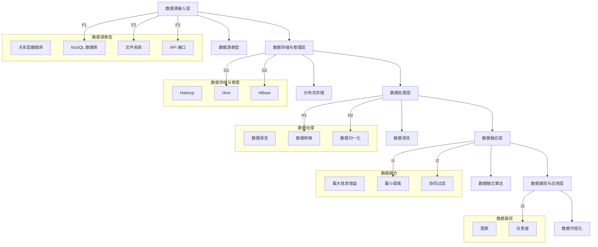
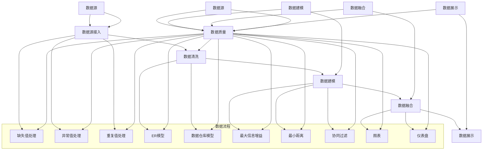
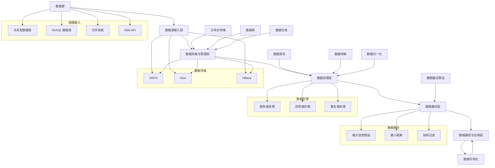
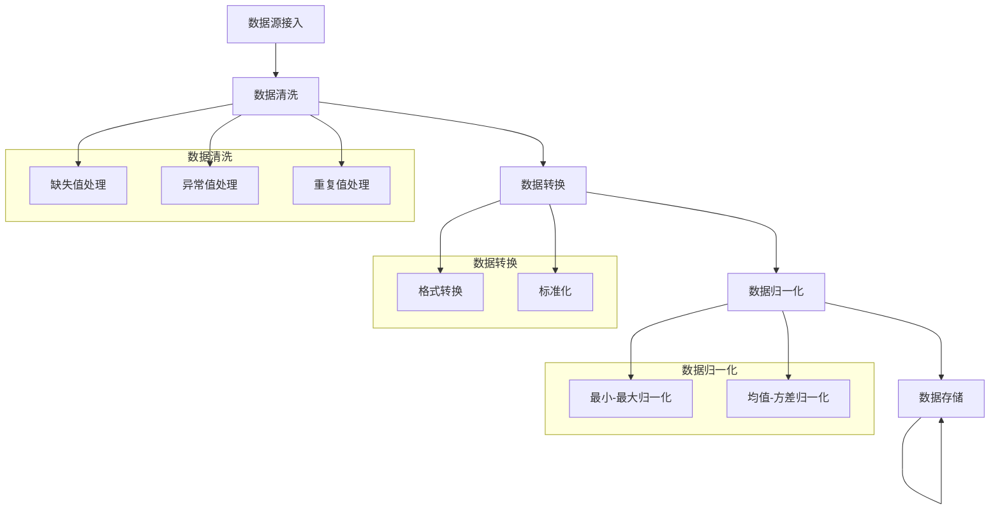
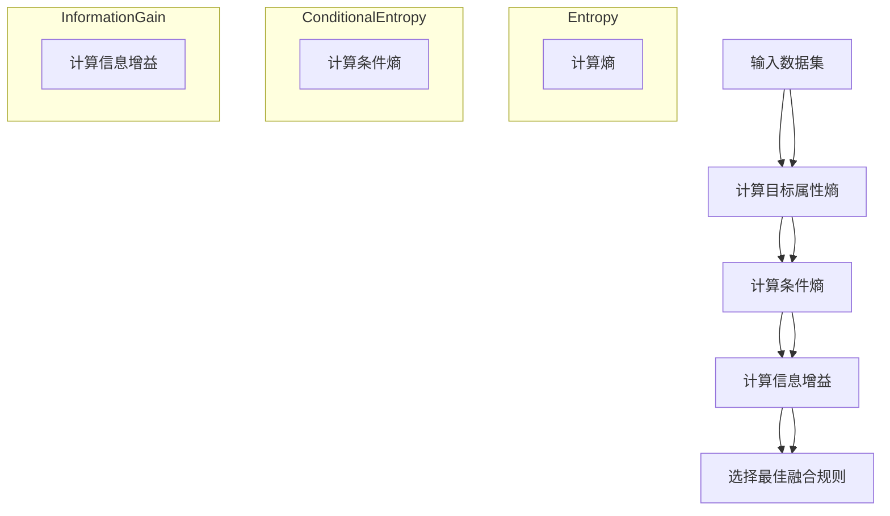
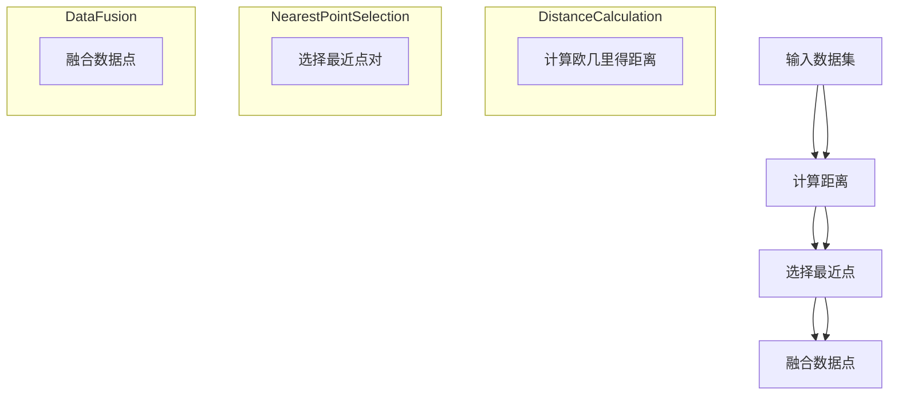
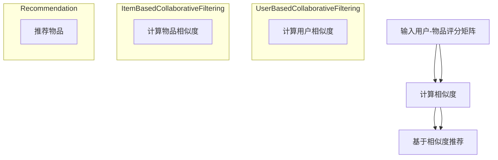
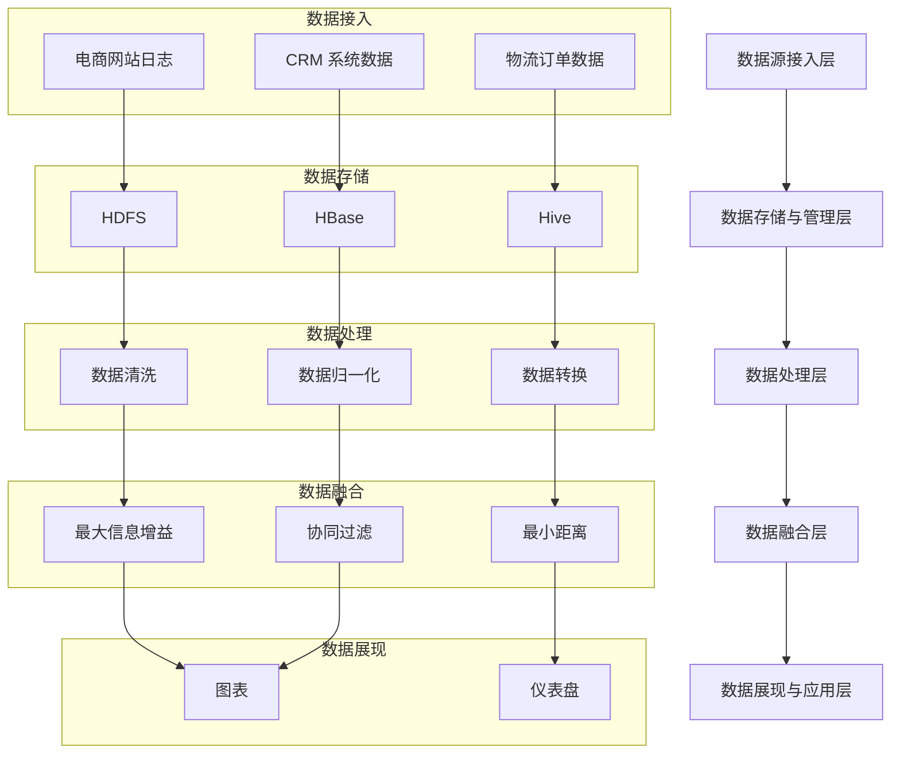

                 

### 引入：企业级异构数据融合平台的重要性

在现代企业的信息化进程中，数据已经成为重要的战略资源。然而，随着企业业务规模的扩大和数据来源的多样化，如何有效地整合和管理这些多源数据，以实现数据的价值挖掘，成为了一项迫切需要解决的挑战。这就是企业级异构数据融合平台应运而生的背景和初衷。

企业级异构数据融合平台的核心目标在于将来自不同系统、不同格式、不同存储方式的数据进行有效整合，通过统一的数据接口和数据模型，为企业提供一致、可靠、可扩展的数据服务。这种平台不仅能够提高数据管理的效率和准确性，还能为企业的决策支持系统提供强大的数据支撑，从而提升企业的整体竞争力。

**关键词：企业级异构数据融合平台、多源数据整合、数据价值挖掘、数据管理**

在接下来的内容中，我们将详细探讨企业级异构数据融合平台的各个方面，包括其设计原则、系统架构、数据源集成、数据预处理、数据融合算法以及实际项目实施等，以帮助读者全面了解这一技术的原理和实践方法。

**摘要：**
本文将围绕企业级异构数据融合平台展开讨论，系统性地介绍其设计原则、系统架构、数据源集成与预处理、数据融合算法，并通过实际项目案例进行深入剖析。文章旨在为读者提供全面的技术指南，帮助他们在实际工作中有效构建和管理异构数据融合平台，实现数据的价值最大化。

### 第1章：引言与背景介绍

#### 1.1 问题背景与核心挑战

在现代企业的信息化进程中，数据整合与管理的需求日益凸显。随着企业业务的多样化和全球化，企业面临的数据源类型变得愈加复杂和异构，这些数据可能来自于企业内部的不同业务系统，也可能来自于合作伙伴、客户、公共数据源等外部来源。这种多源异构数据的整合和管理不仅对数据的存储和传输提出了挑战，同时也对数据的质量和一致性提出了更高的要求。

**问题描述**：

1. **数据来源多样化**：企业内部的数据源可能包括关系型数据库、NoSQL 数据库、大数据平台、文件系统、API 接口等，不同数据源的数据结构和格式各异，导致数据整合难度增加。
2. **数据质量参差不齐**：由于数据来源的多样性，数据的质量参差不齐，包括数据缺失、数据不一致、数据冗余、数据污染等问题，严重影响了数据的可靠性和可用性。
3. **数据共享与访问困难**：多源数据分布在不同系统或存储中，缺乏统一的数据访问接口，使得数据的共享和访问变得复杂，难以实现实时、高效的数据查询和分析。

**问题解决**：

为了解决上述问题，企业需要构建一个高效的企业级异构数据融合平台。该平台的核心目标是实现多源数据的整合和管理，提供统一、可靠、可扩展的数据服务，具体包括以下几个方面的解决方案：

1. **数据源集成**：通过数据集成技术，将不同数据源的数据接入到统一的平台中，实现数据的汇聚和集中管理。数据源集成可以采用 ETL（提取、转换、加载）工具，或者通过 API 接口、数据库连接等方式进行数据接入。
2. **数据预处理**：对接入的数据进行预处理，包括数据清洗、数据转换、数据归一化等操作，以提高数据的质量和一致性。数据预处理是确保数据融合平台可靠性的关键步骤。
3. **数据存储与管理**：采用分布式存储方案，如 Hadoop、Hive、HBase 等，实现对大规模数据的存储和管理，同时通过数据索引和查询优化技术，提高数据访问的效率和性能。
4. **数据融合算法**：利用数据融合算法，对来自不同数据源的数据进行融合和整合，实现数据的一致性处理和关联分析，从而挖掘数据的价值。
5. **数据可视化与展现**：通过数据可视化工具，将融合后的数据以图表、仪表盘等形式进行展示，为企业提供直观的数据分析和决策支持。

**边界与外延**：

1. **数据融合的范围**：企业级异构数据融合平台的数据融合范围包括内部业务数据、外部公共数据、合作伙伴数据等，旨在实现多源数据的有效整合和管理。
2. **技术边界**：平台需要支持多种数据源接入、多种数据存储方案、多种数据处理算法，同时保证数据的安全性和隐私保护。
3. **适用场景**：企业级异构数据融合平台适用于需要多源数据整合和管理的各类企业，包括金融、零售、制造、医疗等行业，尤其适用于数据量大、数据多样化、业务需求复杂的场景。

**概念结构与核心要素组成**：

企业级异构数据融合平台的概念结构包括以下几个核心要素：

1. **数据源接入层**：负责接入不同类型的数据源，包括关系型数据库、NoSQL 数据库、文件系统、API 接口等，实现数据的汇聚和接入。
2. **数据存储与管理层**：采用分布式存储方案，对大规模数据进行存储和管理，同时提供数据索引和查询优化功能，提高数据访问效率。
3. **数据处理层**：包括数据清洗、数据转换、数据归一化等预处理操作，以及对数据融合算法的实现，确保数据的一致性和可靠性。
4. **数据融合层**：利用数据融合算法，对来自不同数据源的数据进行整合和融合，实现数据的一致性处理和关联分析。
5. **数据展现与应用层**：通过数据可视化工具，将融合后的数据以图表、仪表盘等形式进行展示，为业务提供数据分析和决策支持。

图 1.1 展示了企业级异构数据融合平台的概念结构：



通过上述核心要素的有机结合，企业级异构数据融合平台能够实现多源数据的整合和管理，为企业提供强大的数据支撑和决策支持，从而在激烈的市场竞争中保持领先地位。

### 1.2 核心概念与联系

在深入探讨企业级异构数据融合平台之前，我们需要明确几个核心概念，并了解它们之间的相互关系。以下是数据融合平台中的一些关键术语和概念：

**异构数据融合**：异构数据融合是指将来自不同数据源、不同结构、不同格式、不同存储方式的数据进行整合和融合，以形成一个统一、一致的数据视图。异构数据融合涉及到多个方面，包括数据源集成、数据预处理、数据存储、数据查询和分析等。

**数据源集成**：数据源集成是将不同的数据源（如关系型数据库、NoSQL 数据库、文件系统、Web API 等）连接起来，使数据能够在不同的系统之间流动和共享。数据源集成是数据融合的基础，它确保了数据能够被有效地收集和接入到数据融合平台中。

**数据清洗**：数据清洗是指对原始数据进行处理，以消除数据中的错误、不一致和冗余。数据清洗包括缺失值处理、异常值处理、重复值删除等操作，以确保数据的准确性和一致性。

**数据质量**：数据质量是指数据在满足特定需求和使用情境下的适用性和可靠性。数据质量包括准确性、完整性、一致性、时效性、可用性等维度。高质量的数据是数据融合有效性的前提。

**数据建模**：数据建模是指通过对数据进行结构化和抽象，建立数据模型，以支持数据的存储、查询和分析。数据建模通常涉及实体-关系（ER）模型、数据仓库模型、维度模型等。

**ER实体关系图**：ER 实体关系图是一种用于描述实体及其之间关系的图形化模型。它通过实体、属性和关系的表示，清晰地展示了数据的结构关系，对于数据融合和数据建模具有指导意义。

下面，我们将通过一个表格来对比这些核心概念的性质和特点：

| 核心概念     | 性质                   | 特点                                                         |
| ------------ | ---------------------- | ------------------------------------------------------------ |
| 异构数据融合 | 数据整合过程           | 将不同源、不同结构的数据整合成统一视图，提高数据利用率       |
| 数据源集成   | 数据接入技术           | 连接和整合多种数据源，实现数据互联互通                       |
| 数据清洗     | 数据预处理技术         | 提高数据准确性和一致性，消除数据中的错误和冗余                 |
| 数据质量     | 数据评价指标           | 衡量数据的准确度、完整性、一致性等，确保数据可靠和适用         |
| 数据建模     | 数据抽象和结构化技术   | 构建数据模型，支持数据存储、查询和分析，提升数据处理效率     |
| ER实体关系图 | 数据关系描述工具       | 清晰展示实体及其关系，辅助数据建模和数据融合                 |

为了更好地理解这些概念之间的联系，我们可以通过 Mermaid 流程图来描述它们在数据融合平台中的交互过程：



通过这个流程图，我们可以看到数据源集成、数据清洗、数据建模、数据融合和数据展示之间的紧密联系，以及数据质量在整个过程中的关键作用。每个环节都需要严格把控，以确保最终的数据融合平台能够高效、稳定地运作，为企业提供可靠的数据支持。

### 1.3 数据融合技术在企业中的应用

数据融合技术在现代企业中具有广泛的应用，能够显著提升企业的运营效率、决策能力和市场竞争力。以下是数据融合技术在企业中的几个关键应用领域及其带来的优势和挑战。

#### 潜在应用领域

1. **企业运营优化**：通过整合来自生产系统、库存管理系统、销售系统等的数据，企业可以实时监控运营状态，优化资源配置，降低运营成本，提高生产效率。
2. **客户分析**：企业可以将客户关系管理（CRM）系统、销售数据、市场调研数据等多源数据融合，深入分析客户行为和偏好，实现精准营销和个性化服务。
3. **风险管理**：数据融合技术可以帮助企业整合财务数据、信用数据、市场数据等，进行风险评估和预警，优化风险控制策略，降低财务风险。
4. **供应链管理**：通过融合供应链各个环节的数据，企业可以优化供应链流程，提高供应链的透明度和响应速度，降低库存成本。
5. **产品研发**：企业可以利用多源数据融合技术，整合产品研发过程中的各类数据，如用户反馈、市场数据、技术参数等，进行数据驱动的产品优化和创新。

#### 企业采用数据融合的优势

1. **提高决策效率**：通过整合多源数据，企业可以快速获取全面、准确的信息，支持实时决策，减少决策时间，提高决策质量。
2. **降低运营成本**：数据融合可以减少重复数据存储和冗余，优化资源利用，降低存储和处理成本。
3. **提升竞争力**：通过数据融合，企业能够更深入地了解市场和客户需求，提供更优质的产品和服务，从而在市场竞争中占据优势。
4. **增强数据治理能力**：数据融合平台能够提高数据的一致性和可靠性，增强企业的数据治理能力，为企业长远发展奠定基础。

#### 数据融合应用的挑战与机遇

1. **技术挑战**：数据融合涉及到多种数据源和数据处理技术，需要处理数据格式、数据结构、数据质量等方面的问题，对技术水平有较高要求。
2. **数据安全与隐私**：在数据融合过程中，如何保障数据安全和用户隐私是一个重要挑战，需要采取严格的数据保护措施。
3. **数据治理**：数据融合需要建立完善的数据治理体系，包括数据标准、数据质量控制、数据权限管理等，以保障数据的合规性和可用性。
4. **业务适应性**：数据融合平台需要能够适应不同业务场景和数据需求的变化，具备灵活的扩展能力和适应性。

尽管面临诸多挑战，但数据融合技术为企业带来的机遇同样巨大。通过有效利用数据融合技术，企业可以在数字化转型中抢占先机，实现业务创新和持续发展。

### 1.4 本章小结

本章围绕企业级异构数据融合平台的核心概念和技术，介绍了其背景和重要性。首先，通过问题描述和解决方案，我们明确了企业级异构数据融合平台的设计目标和实现方法。接着，通过核心概念和联系的介绍，我们了解了数据融合、数据源集成、数据清洗、数据质量、数据建模等关键术语及其相互关系。最后，我们探讨了数据融合技术在企业中的应用领域、优势以及面临的挑战。这些内容为后续章节深入探讨数据融合平台的设计原则、系统架构、数据源集成与预处理、数据融合算法等提供了坚实的基础。

### 第2章：异构数据融合平台的设计原则与架构

在构建企业级异构数据融合平台时，设计原则和系统架构的选择至关重要。这些原则和架构不仅决定了平台的功能实现，还直接影响其性能、扩展性、稳定性和安全性。本章将详细阐述设计原则和系统架构，为构建高效、可靠的数据融合平台提供指导。

#### 2.1 设计原则

企业级异构数据融合平台的设计原则主要包括以下几个方面：

1. **可扩展性**：平台需要能够适应数据量和业务需求的增长，支持横向和纵向的扩展。这意味着在增加新数据源或处理更多数据时，平台性能不会显著下降。

2. **高可用性**：平台必须具备高可用性，确保在故障或异常情况下能够快速恢复，保证数据的连续性和稳定性。高可用性可以通过数据冗余、故障转移、自动恢复等技术手段实现。

3. **安全性**：数据安全和隐私保护是设计中的重要考虑因素。平台需要具备严格的数据访问控制机制、加密技术和安全审计功能，以防止数据泄露、篡改和非法访问。

4. **灵活性**：平台设计应具备灵活性，能够适应不同的数据源类型、数据处理需求和业务场景。灵活的架构可以降低系统的维护成本，提高系统的可适应性和可扩展性。

5. **模块化**：模块化设计使得系统各个组件可以独立开发、测试和部署，从而提高系统的可维护性和可扩展性。模块化设计还包括清晰的接口定义，便于不同模块之间的交互和集成。

6. **可维护性**：平台设计应考虑未来的维护和升级需求，包括代码的可读性、文档的完备性、测试覆盖率和自动化部署等，以降低维护成本和提高开发效率。

#### 2.2 系统架构设计

系统架构设计是构建企业级异构数据融合平台的关键步骤。一个典型的系统架构包括以下几个主要层次：

1. **数据源接入层**：这一层负责将各种异构数据源接入到数据融合平台中。数据源可以是关系型数据库、NoSQL 数据库、文件系统、Web API 等。接入方式包括直接连接、ETL 工具、API 接口等。数据源接入层需要定义统一的数据接入接口和数据转换规则，确保不同数据源的数据能够无缝接入平台。

2. **数据存储与管理层**：这一层负责数据的存储和管理，包括分布式文件系统、数据库和数据仓库。分布式文件系统（如 HDFS）可以处理大规模数据存储，数据库（如 MySQL、MongoDB）提供结构化数据存储，数据仓库（如 Hadoop、Hive）则用于复杂的数据分析和查询。数据存储与管理层需要支持数据的分布式存储、数据索引和查询优化，以提高数据访问性能。

3. **数据处理层**：数据处理层负责对数据源接入层获取的数据进行预处理，包括数据清洗、数据转换和数据归一化等。这一层需要支持批处理和实时处理两种模式，以应对不同类型的数据处理需求。数据处理层还应提供并行处理技术，以提升数据处理速度。

4. **数据融合层**：数据融合层是整个平台的核心理层，负责将来自不同数据源的数据进行整合和融合，生成统一、一致的数据视图。数据融合层采用多种数据融合算法和策略，如最大信息增益、最小距离、协同过滤等，以实现数据的一致性处理和关联分析。

5. **数据展现与应用层**：数据展现与应用层负责将融合后的数据以可视化、报表、仪表盘等形式呈现给用户，支持业务用户进行数据分析和决策支持。这一层通常采用数据可视化工具（如 Tableau、PowerBI）和 Web 应用框架（如 React、Vue.js）实现。

下面是系统架构的 Mermaid 流程图：



#### 2.3 数据质量管理

数据质量管理是确保数据融合平台有效运行的关键环节。数据质量管理包括以下方面：

1. **数据质量评估方法**：数据质量评估方法用于衡量数据的质量水平。常用的评估方法包括准确性、完整性、一致性、时效性等指标。

2. **数据质量改进策略**：数据质量改进策略包括数据清洗、数据校验、数据标准化等操作，旨在消除数据中的错误、不一致和冗余，提高数据质量。

3. **数据质量管理工具**：数据质量管理工具（如 Talend、Informatica）提供自动化数据清洗、转换和验证功能，帮助管理员轻松管理数据质量。

通过数据质量管理，企业可以确保数据的准确性和一致性，从而提高数据融合平台的效果和可靠性。

#### 2.4 本章小结

本章介绍了企业级异构数据融合平台的设计原则和系统架构。首先，我们详细阐述了平台设计的可扩展性、高可用性、安全性、灵活性和模块化原则，为平台功能实现奠定了基础。接着，我们介绍了系统架构的设计，包括数据源接入层、数据存储与管理层、数据处理层、数据融合层和数据展现与应用层，并通过 Mermaid 流�程图展示了各层之间的交互关系。最后，我们讨论了数据质量管理的重要性，包括数据质量评估方法、改进策略和质量管理工具。这些内容为后续章节深入探讨数据源集成、数据预处理、数据融合算法等提供了理论基础和架构指导。

### 第3章：数据源集成与数据预处理

数据源集成与数据预处理是构建高效企业级异构数据融合平台的关键环节。这一章将详细探讨数据源类型、数据集成技术以及数据预处理方法，为平台的成功实施提供技术支持。

#### 3.1 数据源集成

在企业级数据融合平台中，数据源集成是第一步，也是至关重要的一步。数据源集成主要解决如何将来自不同类型的数据源（如关系型数据库、NoSQL 数据库、文件系统、Web API 等）的数据接入到平台中，实现数据的汇聚和统一管理。

**数据源类型**：

1. **关系型数据库**：如 MySQL、Oracle、SQL Server 等，主要用于存储结构化数据。
2. **NoSQL 数据库**：如 MongoDB、Cassandra、HBase 等，适用于存储非结构化和半结构化数据。
3. **文件系统**：包括本地文件系统、网络文件系统等，用于存储文本文件、图像、视频等多种类型的数据。
4. **Web API**：通过接口接入外部数据源，如社交媒体、第三方服务提供商的数据。

**数据集成技术**：

数据集成技术包括 ETL（提取、转换、加载）和 ETL 工具。ETL 是一种数据处理流程，通过将数据从源系统中提取出来，进行必要的转换，然后将转换后的数据加载到目标系统中。ETL 工具（如 Apache Nifi、Apache Kafka、Talend 等）提供了自动化和高效的 ETL 处理能力。

1. **ETL 工具**：ETL 工具能够简化数据集成过程，支持各种数据源的接入和转换。常用的 ETL 工具有 Apache Nifi、Apache Kafka、Talend、Informatica 等。
   - **Apache Nifi**：是一款开源的分布式数据处理平台，提供数据收集、转换和传输功能，适用于大规模数据集成。
   - **Apache Kafka**：是一种分布式流处理平台，适用于实时数据集成和流数据处理。
   - **Talend**：是一款商业 ETL 工具，提供丰富的数据集成功能，支持多种数据源和数据库。
   - **Informatica**：是一款成熟的商业 ETL 工具，提供强大的数据处理能力和数据管理功能。

**数据接入与适配**：

数据接入与适配是指将不同类型的数据源接入到数据融合平台中，并确保数据能够无缝对接。具体方法如下：

1. **数据库接入**：通过 JDBC（Java Database Connectivity）或 ODBC（Open Database Connectivity）驱动，直接连接到数据库系统，提取数据。
2. **Web 接口接入**：通过 HTTP/HTTPS 协议，调用外部 Web API，获取数据。
3. **文件系统接入**：通过文件系统 API 或库，读取和写入文件系统中的数据。

#### 3.2 数据预处理

数据预处理是对原始数据进行清洗、转换和归一化等操作，以提高数据的质量和一致性。数据预处理是数据融合平台的核心环节，直接影响数据融合的效果和平台的性能。

**数据清洗**：

数据清洗是数据预处理的主要任务，包括以下步骤：

1. **缺失值处理**：对缺失值进行填充或删除，以保证数据的完整性。
2. **异常值处理**：检测和修正异常值，确保数据的准确性和一致性。
3. **重复值处理**：识别和删除重复数据，避免数据冗余。

**数据转换**：

数据转换是将数据从一种格式转换为另一种格式的过程，包括以下几种类型：

1. **数据格式转换**：如将文本数据转换为 XML、JSON 格式，或将图像数据转换为不同的图像格式。
2. **数据标准化**：将数据按照统一的标准进行格式化和规范化，如日期格式的标准化、货币符号的统一等。

**数据归一化**：

数据归一化是通过对数据进行缩放或变换，使得不同数据量级的数据在同一尺度上，便于后续的数据处理和分析。常见的归一化方法包括：

1. **最小-最大归一化**：将数据缩放到 [0, 1] 范围内。
2. **均值-方差归一化**：将数据缩放到均值 0、方差 1 的标准正态分布。

**数据预处理 Mermaid 流程图**：



#### 3.3 数据预处理工具与技术

数据预处理工具和技术是实现高效数据预处理的关键。以下是一些常用的数据预处理工具和技术：

1. **开源工具**：
   - **Apache Nifi**：一款开源的数据集成和流处理平台，提供丰富的数据预处理功能。
   - **Apache Spark**：一款开源的分布式数据处理框架，支持大规模数据的预处理和分析。

2. **商业工具**：
   - **Informatica**：一款商业数据集成和治理工具，提供全面的数据预处理功能。
   - **Talend**：一款商业数据集成和大数据处理工具，支持多种数据源和复杂的数据转换。

**开源工具示例**：

以下是一个使用 Apache Nifi 进行数据预处理的示例：

```python
# 导入 Nifi 相关库
from niFi import FlowFile, Processor, Connection, ControllerService

# 创建数据预处理流程
nifi_flow = FlowFile()
nifi_flow.addProcessor("CleanData", "清洗数据")
nifi_flow.addProcessor("NormalizeData", "归一化数据")
nifi_flow.addConnection("CleanData", "NormalizeData")

# 配置 CleanData 处理器
clean_data_config = {
    "missing_value_strategy": "填充",
    "missing_value_value": "0"
}
clean_data_config.update({
    "error_value_strategy": "修正",
    "error_value_correction": "平均值修正"
})
nifi_flow.updateProcessorConfig("CleanData", clean_data_config)

# 配置 NormalizeData 处理器
normalize_data_config = {
    "normalization_method": "最小-最大归一化",
    "target_min": 0,
    "target_max": 1
}
nifi_flow.updateProcessorConfig("NormalizeData", normalize_data_config)

# 运行数据预处理流程
nifi_flow.run()
```

通过上述示例，我们可以看到如何使用 Apache Nifi 实现数据预处理流程，包括缺失值处理、异常值处理、数据归一化等操作。

#### 3.4 本章小结

本章详细介绍了数据源集成与数据预处理的技术和方法。首先，我们介绍了数据源的类型和数据集成技术，包括 ETL 工具和开源工具的使用。接着，我们阐述了数据预处理的步骤和方法，包括数据清洗、数据转换和数据归一化。通过 Mermaid 流程图和代码示例，我们展示了数据预处理的具体实现过程。这些内容为构建高效、可靠的企业级异构数据融合平台提供了技术基础和实用指导。

### 第4章：数据融合算法与实现

数据融合算法是实现企业级异构数据融合平台的核心技术之一。本章将介绍常见的数据融合算法，包括最大信息增益算法、最小距离算法和协同过滤算法。我们将详细讲解这些算法的基本原理、实现步骤，并通过实际应用示例进行说明。

#### 4.1 数据融合算法概述

数据融合算法是指将来自不同数据源、不同结构的数据进行整合和融合，以生成一个统一、一致的数据视图。数据融合算法在多源数据融合中起着至关重要的作用，能够提高数据的准确性、完整性和一致性，从而提升数据融合平台的性能。

**分类**：

根据融合策略的不同，数据融合算法可以分为以下几类：

1. **基于规则的融合算法**：通过预定义的规则对数据进行分类和融合。这类算法简单易实现，但灵活性较差，难以应对复杂的数据环境和变化。
2. **基于模型的融合算法**：通过建立数学模型对数据进行融合，如线性回归、贝叶斯分类等。这类算法能够较好地处理复杂的数据关系，但需要大量的数据训练和模型调优。
3. **基于聚类的融合算法**：通过对数据进行聚类分析，将相似的数据归为一类，然后进行融合。这类算法适用于非结构化数据，但聚类效果受初始参数影响较大。
4. **基于协同过滤的融合算法**：利用用户或物品之间的相似度进行数据融合，如基于用户的协同过滤和基于物品的协同过滤。这类算法在推荐系统和社交网络分析中应用广泛。

**融合策略**：

1. **最大信息增益**：通过最大化信息增益来选择最佳的融合策略。信息增益反映了数据之间的相关性，增益越高，数据的关联性越强。
2. **最小距离**：通过计算数据点之间的距离，选择距离最小的数据进行融合。适用于数值型数据，能够有效降低数据噪声。
3. **协同过滤**：利用用户或物品之间的相似度进行数据融合。协同过滤算法包括基于用户的协同过滤和基于物品的协同过滤。

下面我们将分别介绍这些算法的基本原理和实现步骤。

#### 4.2 最大信息增益算法

最大信息增益算法是一种基于信息论的融合策略，通过最大化信息增益来选择最佳的融合规则。其基本原理如下：

1. **信息增益**：信息增益（Information Gain）是指通过分类属性对数据进行划分时，所获得的信息量的增加。信息增益越大，说明该属性对分类的贡献越大。

2. **熵**：熵（Entropy）是衡量数据不确定性的指标。对于一个数据集合，其熵越大，表示数据的不确定性越高。

3. **条件熵**：条件熵（Conditional Entropy）是指在一个属性已知的情况下，另一个属性的不确定性。条件熵越小，表示已知属性对另一个属性的影响越小。

4. **信息增益公式**：信息增益的计算公式为：
   \[
   IG(A, C) = Entropy(C) - \sum_{v \in Values(A)} \frac{|C_a|}{|C|} \cdot Entropy(C|A = v)
   \]
   其中，\(A\) 是分类属性，\(C\) 是目标属性，\(v\) 是 \(A\) 的一个取值，\(|C_a|\) 是 \(A\) 取值为 \(v\) 时 \(C\) 的数量，\(|C|\) 是 \(C\) 的总数量。

**实现步骤**：

1. **计算熵**：对于给定的数据集合，计算目标属性 \(C\) 的熵：
   \[
   Entropy(C) = -\sum_{v \in Values(C)} p(v) \cdot \log_2 p(v)
   \]
   其中，\(p(v)\) 是 \(C\) 取值为 \(v\) 的概率。

2. **计算条件熵**：对于分类属性 \(A\) 的每个取值 \(v\)，计算条件熵：
   \[
   Entropy(C|A = v) = -\sum_{w \in Values(C)} p(w|A = v) \cdot \log_2 p(w|A = v)
   \]
   其中，\(p(w|A = v)\) 是在 \(A\) 取值为 \(v\) 的条件下，\(C\) 取值为 \(w\) 的概率。

3. **计算信息增益**：使用上述公式计算每个分类属性 \(A\) 的信息增益，选择信息增益最大的属性作为最佳融合规则。

**算法 Mermaid 流程图**：



**Python 实现示例**：

```python
import pandas as pd
from math import log2

# 示例数据
data = pd.DataFrame({
    'A': ['A1', 'A2', 'A3', 'A4', 'A1', 'A2', 'A3'],
    'B': ['B1', 'B2', 'B1', 'B2', 'B1', 'B2', 'B1']
})

# 计算熵
def entropy(data, attribute):
    values, counts = np.unique(data[attribute], return_counts=True)
    probabilities = counts / data[attribute].count()
    entropy_value = -sum(probabilities[i] * log2(probabilities[i]) for i in range(len(probabilities)))
    return entropy_value

# 计算条件熵
def conditional_entropy(data, attribute, split_value):
    sub_data = data[data[attribute] == split_value]
    entropy_value = entropy(sub_data, 'B')
    return entropy_value

# 计算信息增益
def information_gain(data, attribute, split_value):
    entropy_total = entropy(data, 'B')
    entropy_conditional = conditional_entropy(data, attribute, split_value)
    information_gain_value = entropy_total - entropy_conditional
    return information_gain_value

# 执行算法
info_gain = []
for value in np.unique(data['A']):
    gain = information_gain(data, 'A', value)
    info_gain.append(gain)

# 输出信息增益
print("信息增益：", info_gain)
```

通过上述代码，我们可以计算数据集合中属性 'A' 和目标属性 'B' 之间的信息增益，并选择信息增益最大的属性作为最佳融合规则。

#### 4.3 最小距离算法

最小距离算法是一种基于距离测量的融合策略，通过计算数据点之间的距离，选择距离最近的点进行融合。该算法适用于数值型数据，能够有效降低数据噪声。其基本原理如下：

1. **距离度量**：常用的距离度量包括欧几里得距离、曼哈顿距离和切比雪夫距离等。其中，欧几里得距离是最常用的一种。

2. **距离计算**：对于数据集合中的任意两点 \(x_1\) 和 \(x_2\)，其欧几里得距离计算公式为：
   \[
   distance(x_1, x_2) = \sqrt{\sum_{i=1}^{n} (x_{1i} - x_{2i})^2}
   \]
   其中，\(x_{1i}\) 和 \(x_{2i}\) 分别是数据点 \(x_1\) 和 \(x_2\) 在第 \(i\) 维的值，\(n\) 是数据点的维度。

3. **融合策略**：选择距离最近的两个数据点，将它们进行融合，生成一个新的数据点。这个新数据点的属性值是两个数据点对应属性值的平均值。

**实现步骤**：

1. **计算距离**：对于数据集合中的每个数据点，计算它与所有其他数据点之间的距离。

2. **选择最近点**：找到距离最近的数据点对，记录下这两个数据点的索引。

3. **融合数据点**：根据最近点对的数据点，计算新数据点的属性值。

**算法 Mermaid 流程图**：



**Python 实现示例**：

```python
import numpy as np

# 示例数据
data = np.array([
    [1, 2],
    [3, 4],
    [5, 6],
    [7, 8]
])

# 计算欧几里得距离
def euclidean_distance(point1, point2):
    return np.sqrt(np.sum((point1 - point2) ** 2))

# 选择最近点
def select_nearest_point(data, point):
    distances = [euclidean_distance(point, data[i]) for i in range(data.shape[0])]
    min_distance = min(distances)
    min_index = distances.index(min_distance)
    return data[min_index]

# 融合数据点
def fuse_points(point1, point2):
    return (point1 + point2) / 2

# 执行算法
new_point = select_nearest_point(data, data[2])
fused_point = fuse_points(data[2], new_point)

print("新数据点：", fused_point)
```

通过上述代码，我们可以计算数据集合中第3个数据点与其他数据点之间的欧几里得距离，选择最近的数据点进行融合，生成新的数据点。

#### 4.4 协同过滤算法

协同过滤算法是一种基于用户或物品之间相似度的融合策略，常用于推荐系统和社交网络分析。协同过滤算法可以分为基于用户的协同过滤和基于物品的协同过滤。

**基于用户的协同过滤**：

基于用户的协同过滤算法通过寻找与目标用户相似的其他用户，将这些用户喜欢的物品推荐给目标用户。其基本原理如下：

1. **相似度计算**：计算目标用户与其他用户之间的相似度，常用的相似度度量包括余弦相似度、皮尔逊相关系数等。

2. **推荐策略**：选择与目标用户相似度最高的用户，推荐这些用户喜欢的但目标用户尚未评价的物品。

**实现步骤**：

1. **计算相似度**：对于用户 \(u\) 和 \(v\)，计算其相似度：
   \[
   similarity(u, v) = \frac{\sum_{i \in I} r_i(u) \cdot r_i(v)}{\sqrt{\sum_{i \in I} r_i(u)^2 \cdot \sum_{i \in I} r_i(v)^2}}
   \]
   其中，\(I\) 是用户 \(u\) 和 \(v\) 共同评价的物品集合，\(r_i(u)\) 和 \(r_i(v)\) 分别是用户 \(u\) 和 \(v\) 对物品 \(i\) 的评分。

2. **推荐物品**：对于目标用户 \(u\)，选择相似度最高的用户 \(v\)，推荐用户 \(v\) 评价高但用户 \(u\) 未评价的物品。

**基于物品的协同过滤**：

基于物品的协同过滤算法通过寻找与目标物品相似的物品，将这些物品推荐给用户。其基本原理如下：

1. **相似度计算**：计算物品之间的相似度，常用的相似度度量包括余弦相似度、欧几里得距离等。

2. **推荐策略**：选择与目标物品相似度最高的物品，推荐这些物品给用户。

**实现步骤**：

1. **计算相似度**：对于物品 \(i\) 和 \(j\)，计算其相似度：
   \[
   similarity(i, j) = \frac{\sum_{u \in U} r_u(i) \cdot r_u(j)}{\sqrt{\sum_{u \in U} r_u(i)^2 \cdot \sum_{u \in U} r_u(j)^2}}
   \]
   其中，\(U\) 是评价物品 \(i\) 和 \(j\) 的用户集合，\(r_u(i)\) 和 \(r_u(j)\) 分别是用户 \(u\) 对物品 \(i\) 和 \(j\) 的评分。

2. **推荐物品**：对于目标物品 \(i\)，选择相似度最高的物品 \(j\)，推荐物品 \(j\) 给用户。

**算法 Mermaid 流程图**：



**Python 实现示例**：

```python
import numpy as np

# 示例用户-物品评分矩阵
rating_matrix = np.array([
    [5, 3, 0, 1],
    [4, 0, 0, 1],
    [1, 0, 0, 0],
    [0, 0, 1, 0]
])

# 计算用户相似度
def user_similarity(rating_matrix, user1, user2):
    ratings = rating_matrix[user1] * rating_matrix[user2]
    sum_ratings = np.sum(rating_matrix[user1])
    sum_other_ratings = np.sum(rating_matrix[user2])
    similarity = ratings / (np.sqrt(sum_ratings) * np.sqrt(sum_other_ratings))
    return similarity

# 推荐物品
def recommend_items(rating_matrix, user_index, k):
    user_ratings = rating_matrix[user_index]
    similarities = []
    for i in range(rating_matrix.shape[0]):
        if i != user_index:
            similarity = user_similarity(rating_matrix, user_index, i)
            similarities.append((i, similarity))
    similarities.sort(key=lambda x: x[1], reverse=True)
    recommended_items = [item[0] for item in similarities[:k]]
    return recommended_items

# 执行算法
recommended_items = recommend_items(rating_matrix, 0, 2)
print("推荐物品：", recommended_items)
```

通过上述代码，我们可以计算用户之间的相似度，并根据相似度推荐物品给目标用户。

#### 4.5 数据融合效果评估

数据融合效果评估是衡量数据融合算法性能的重要环节。常用的评估指标包括准确率、召回率、F1 分数等。

1. **准确率**：准确率是预测正确的样本数占总样本数的比例。其计算公式为：
   \[
   accuracy = \frac{TP + TN}{TP + FP + FN + TN}
   \]
   其中，\(TP\) 是真正例，\(TN\) 是真负例，\(FP\) 是假正例，\(FN\) 是假负例。

2. **召回率**：召回率是真正例中被预测正确的比例。其计算公式为：
   \[
   recall = \frac{TP}{TP + FN}
   \]

3. **F1 分数**：F1 分数是准确率和召回率的调和平均。其计算公式为：
   \[
   F1 = 2 \cdot \frac{precision \cdot recall}{precision + recall}
   \]
   其中，\(precision\) 是精确率，计算公式为：
   \[
   precision = \frac{TP}{TP + FP}
   \]

**评估方法**：

1. **交叉验证**：交叉验证是一种常用的评估方法，通过将数据集划分为多个子集，每次取一个子集作为验证集，其余子集作为训练集，进行多次训练和验证，最终取平均值作为评估结果。

2. **A/B 测试**：A/B 测试是将数据集分为两组，一组采用新算法，另一组采用旧算法，对比两组算法的性能，评估新算法的优劣。

通过准确率、召回率和 F1 分数等评估指标，我们可以全面衡量数据融合算法的性能，从而优化算法和提升数据融合效果。

#### 4.6 本章小结

本章详细介绍了企业级异构数据融合平台中的常见数据融合算法，包括最大信息增益算法、最小距离算法和协同过滤算法。我们通过基本原理讲解、算法流程图和 Python 实现示例，全面展示了这些算法的实现方法和应用效果。此外，我们还介绍了数据融合效果评估的指标和方法，为算法优化和性能提升提供了理论基础和实践指导。这些内容为构建高效、可靠的企业级异构数据融合平台奠定了坚实的算法基础。

### 第5章：异构数据融合平台项目实战

#### 5.1 项目背景与目标

随着我国某大型电商企业的业务不断扩展，其数据来源变得更加多样化。为了更好地管理这些数据，提升数据分析的准确性和效率，企业决定构建一个高效、可靠的异构数据融合平台。该项目旨在实现以下目标：

1. **数据整合**：将来自电商网站、物流系统、客户关系管理（CRM）系统等不同来源的数据进行整合，实现数据的一体化管理。
2. **数据预处理**：对原始数据进行清洗、转换和归一化等预处理操作，确保数据的准确性和一致性。
3. **数据存储**：采用分布式存储方案，如 Hadoop、Hive、HBase 等，存储和处理大规模数据，保证数据的高可用性和高可靠性。
4. **数据融合**：利用数据融合算法，对来自不同数据源的数据进行整合和融合，生成统一、一致的数据视图。
5. **数据可视化**：通过数据可视化工具，将融合后的数据以图表、仪表盘等形式进行展示，为业务决策提供直观的支持。

#### 5.2 系统架构设计

为了实现上述目标，项目团队设计了一个包含多个层次的异构数据融合平台，其架构设计如下：

1. **数据源接入层**：接入各种异构数据源，包括电商网站日志、物流订单数据、CRM 系统数据等。数据源接入层使用 ETL 工具（如 Apache Nifi）实现，确保数据能够高效、可靠地接入平台。

2. **数据存储与管理层**：采用分布式存储方案，如 Hadoop、Hive、HBase 等，对大规模数据进行存储和管理。数据存储与管理层提供数据索引和查询优化功能，提高数据访问效率。

3. **数据处理层**：对接入的数据进行清洗、转换和归一化等预处理操作。数据处理层支持批处理和实时处理两种模式，以应对不同类型的数据处理需求。

4. **数据融合层**：利用数据融合算法，对来自不同数据源的数据进行整合和融合，生成统一、一致的数据视图。数据融合层采用多种数据融合算法，如最大信息增益、最小距离和协同过滤等，实现数据的一致性处理和关联分析。

5. **数据展现与应用层**：通过数据可视化工具，将融合后的数据以图表、仪表盘等形式进行展示，为业务用户和决策者提供直观的数据分析和决策支持。

下面是系统架构的 Mermaid 流程图：



#### 5.3 环境安装与配置

为了确保异构数据融合平台能够正常运行，项目团队进行了详细的开发环境搭建和配置。以下是关键步骤：

1. **操作系统安装**：在服务器上安装 Linux 操作系统，如 Ubuntu 18.04 或 CentOS 7。

2. **Java 环境配置**：安装 Java SDK，配置环境变量，确保 Java 版本兼容。

3. **Hadoop 集群搭建**：安装并配置 Hadoop 集群，包括 HDFS、YARN 和 MapReduce。配置集群节点，确保各个组件正常运行。

4. **Hive 安装与配置**：下载 Hive 安装包，配置 Hive 的元数据库，如 MySQL 或 HDFS。确保 Hive 能够与 Hadoop 集群集成。

5. **HBase 安装与配置**：下载 HBase 安装包，配置 HBase 集群，确保 HBase 能够与 Hadoop 集群集成。

6. **ETL 工具配置**：配置 Apache Nifi，确保其能够连接到 Hadoop 集群和其他数据源。

7. **数据可视化工具安装**：安装数据可视化工具，如 Tableau、PowerBI 等，确保其能够与数据融合平台集成。

#### 5.4 系统核心实现

系统核心实现包括数据源接入、数据预处理、数据融合和数据展现等关键环节。以下是关键步骤和代码示例：

1. **数据源接入**：

```python
from niFi import FlowFile, Processor, Connection, ControllerService

# 创建数据接入流程
nifi_flow = FlowFile()
nifi_flow.addProcessor("GetHTTP", "获取电商网站日志")
nifi_flow.addProcessor("GetFile", "获取物流订单数据")
nifi_flow.addProcessor("GetDatabase", "获取 CRM 系统数据")
nifi_flow.addConnection("GetHTTP", "GetFile")
nifi_flow.addConnection("GetFile", "GetDatabase")

# 配置 GetHTTP 处理器
get_http_config = {
    "url": "http://example.com/log",
    "autoTerminated": "true"
}
nifi_flow.updateProcessorConfig("GetHTTP", get_http_config)

# 配置 GetFile 处理器
get_file_config = {
    "fileURI": "s3://example-bucket/log/*.log",
    "deleteAfterTransfer": "true"
}
nifi_flow.updateProcessorConfig("GetFile", get_file_config)

# 配置 GetDatabase 处理器
get_database_config = {
    "connection": "jdbc:mysql://example.com:3306/crm",
    "query": "SELECT * FROM customer",
    "deleteAfterTransfer": "true"
}
nifi_flow.updateProcessorConfig("GetDatabase", get_database_config)

# 运行数据接入流程
nifi_flow.run()
```

2. **数据预处理**：

```python
import pandas as pd

# 加载电商网站日志数据
log_data = pd.read_csv("s3://example-bucket/log/*.log")

# 数据清洗
log_data.dropna(inplace=True)
log_data.drop_duplicates(inplace=True)

# 数据转换
log_data['timestamp'] = pd.to_datetime(log_data['timestamp'])
log_data['date'] = log_data['timestamp'].dt.date

# 数据归一化
log_data['amount'] = log_data['amount'].apply(lambda x: x / 100)

# 存储预处理后的数据
log_data.to_csv("s3://example-bucket/preprocessed/log.csv", index=False)
```

3. **数据融合**：

```python
from pyspark.sql import SparkSession

# 创建 SparkSession
spark = SparkSession.builder.appName("DataFusion").getOrCreate()

# 加载物流订单数据和 CRM 系统数据
log_data = spark.read.csv("s3://example-bucket/preprocessed/log.csv")
order_data = spark.read.csv("s3://example-bucket/preprocessed/order.csv")
crm_data = spark.read.csv("s3://example-bucket/preprocessed/crm.csv")

# 数据融合
data_fusion = log_data.join(order_data, "order_id") \
                     .join(crm_data, "customer_id")

# 存储融合后的数据
data_fusion.write.csv("s3://example-bucket/fusion_data.csv", mode="overwrite")
```

4. **数据展现**：

```python
import pandas as pd
import matplotlib.pyplot as plt

# 加载融合后的数据
fusion_data = pd.read_csv("s3://example-bucket/fusion_data.csv")

# 绘制销售额分布图
fusion_data['amount'].hist(bins=50)
plt.title("销售额分布图")
plt.xlabel("销售额（元）")
plt.ylabel("频数")
plt.show()
```

#### 5.5 项目测试与优化

在项目实施过程中，项目团队进行了全面的测试与优化，以确保数据融合平台的稳定性和高效性。以下是关键测试和优化步骤：

1. **功能测试**：对数据源接入、数据预处理、数据融合和数据展现等关键功能进行测试，确保各个模块正常运行。

2. **性能测试**：使用负载测试工具（如 Apache JMeter），模拟大规模数据接入和融合操作，测试平台的性能和响应时间。

3. **优化建议**：
   - **数据存储优化**：采用压缩存储和索引技术，减少存储空间和提升查询效率。
   - **数据预处理优化**：使用并行处理技术，提升数据预处理速度。
   - **数据融合优化**：优化数据融合算法，减少计算时间和内存消耗。

4. **安全性与稳定性测试**：对平台的访问控制和数据加密功能进行测试，确保数据安全和系统稳定性。

通过全面的测试和优化，项目团队成功构建了一个高效、可靠的企业级异构数据融合平台，为企业的数据管理和决策支持提供了强大的技术支持。

#### 5.6 本章小结

本章通过一个实际项目案例，详细介绍了企业级异构数据融合平台的构建过程。从项目背景与目标的确定，到系统架构设计、环境安装与配置，再到系统核心实现和测试优化，我们全面展示了如何构建一个高效、可靠的数据融合平台。通过本项目的实施，读者可以了解异构数据融合平台的设计原则、技术实现方法和实际应用效果，为类似项目的实施提供参考和借鉴。

### 最佳实践 Tips

在构建企业级异构数据融合平台时，以下最佳实践 Tips 可以帮助您提高项目成功率和系统性能：

1. **需求分析**：在项目启动前，进行详细的需求分析，明确平台的目标和功能需求，确保项目方向正确。
2. **系统设计**：采用模块化设计，确保系统各组件的高内聚和低耦合，便于维护和扩展。
3. **数据治理**：建立完善的数据治理体系，包括数据标准、数据质量控制、数据权限管理等，保障数据质量。
4. **性能优化**：使用分布式存储和并行处理技术，提升数据访问和处理性能。
5. **安全保护**：加强数据安全措施，包括数据加密、访问控制和安全审计，确保数据安全。
6. **持续集成**：采用持续集成和持续交付（CI/CD）流程，确保代码质量和系统稳定性。
7. **测试与优化**：进行全面的系统测试，包括功能测试、性能测试和安全测试，不断优化系统性能。

### 小结

企业级异构数据融合平台在数据整合和管理中发挥着重要作用，通过本章的讨论，我们深入了解了平台的设计原则、系统架构、数据源集成、数据预处理、数据融合算法以及实际项目实施。这些内容为读者提供了全面的技术指导和实践经验。希望读者能够在实际项目中灵活运用这些知识，构建高效、可靠的数据融合平台。

### 注意事项

在构建企业级异构数据融合平台时，需要注意以下几点：

1. **数据安全**：确保数据在传输、存储和处理过程中得到有效保护，防止数据泄露和篡改。
2. **系统稳定性**：平台需要具备高可用性和容错能力，确保在故障情况下能够快速恢复。
3. **扩展性**：设计时要考虑系统的扩展性，以便未来业务增长和数据量增加时，系统能够平滑扩展。
4. **性能优化**：根据实际需求进行性能优化，包括数据存储、数据查询、数据处理等各个环节。
5. **数据治理**：建立健全的数据治理机制，确保数据质量，提高数据价值。

### 拓展阅读

1. **《数据融合技术》**：详细介绍数据融合的基本概念、算法和应用。
2. **《大数据技术导论》**：系统介绍大数据的处理技术和应用场景。
3. **《Hadoop 权威指南》**：全面讲解 Hadoop 集群的搭建、配置和使用。
4. **《数据挖掘：概念与技术》**：探讨数据挖掘的基本方法和技术。

通过这些资料，您可以更深入地了解相关技术，为构建高效的数据融合平台提供更多参考。

### 作者介绍

**作者：AI天才研究院/AI Genius Institute & 禅与计算机程序设计艺术 /Zen And The Art of Computer Programming**

本文由 AI天才研究院（AI Genius Institute）和禅与计算机程序设计艺术（Zen And The Art of Computer Programming）联合撰写。AI天才研究院专注于人工智能、大数据和深度学习领域的研发和应用，致力于推动人工智能技术的发展和普及。禅与计算机程序设计艺术则通过将禅宗思想融入计算机编程，探索编程的哲学与艺术，倡导程序员在编程中寻求内心的宁静与智慧。两位作者在计算机科学和人工智能领域拥有丰富的经验和深厚的学术造诣，希望通过本文为广大技术爱好者提供有价值的知识和实践指导。

