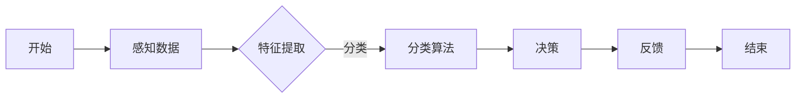
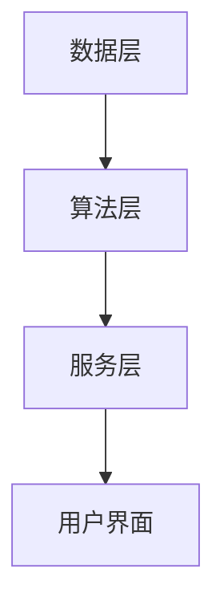

                 


## 企业级情境感知AI：优化用户体验与服务交付

### 关键词

- 情境感知AI
- 用户体验优化
- 服务交付优化
- 人工智能
- 机器学习
- 数据分析
- 实时监控
- 个性化服务

### 摘要

随着人工智能技术的不断发展，情境感知AI逐渐成为企业提升用户体验与服务交付的关键技术。本文将深入探讨企业级情境感知AI的核心概念、原理、算法实现、系统架构设计以及实战应用，并总结最佳实践与未来展望。

---

## 第1章：背景与概念

### 1.1 情境感知AI的定义与重要性

情境感知AI（Context-Aware AI）是指通过感知和解释环境、用户行为和上下文，为用户提供个性化服务和优化服务交付的智能系统。其核心在于实时地获取、处理和理解与用户相关的信息，以做出智能决策。

- **重要性**：情境感知AI能够显著提升用户体验，优化服务交付。例如，在零售业中，通过感知顾客的行为和历史偏好，可以提供个性化的推荐服务，提高顾客满意度；在金融领域，通过实时监控用户行为，可以预防欺诈行为，提升服务质量。

### 1.2 企业级情境感知AI的应用领域

企业级情境感知AI广泛应用于各个领域：

- **制造业**：实现生产线的智能化监控和自动化调整。
- **零售业**：提供个性化推荐和服务优化。
- **医疗健康**：通过患者数据的实时监测，提供精准的医疗建议。
- **金融**：进行风险分析和欺诈检测。

### 1.3 情境感知AI的核心技术

- **传感器技术**：用于收集环境数据，如温度、湿度、光线等。
- **机器学习**：从数据中提取特征，进行模式识别和预测。
- **数据处理与分析**：对大量数据进行高效处理，提取有用信息。
- **交互界面**：提供用户友好的交互体验。

### 1.4 情境感知AI的发展趋势

- **软硬件集成**：提升实时响应能力。
- **人工智能与物联网的融合**：实现智能家居、智能城市等大规模应用。
- **模型压缩与优化**：提高模型在资源受限环境下的运行效率。
- **安全与隐私保护**：确保数据安全和用户隐私不受侵犯。

---

## 第2章：核心概念与原理

### 2.1 情境感知的关键概念

- **情境**：环境和上下文的集合，影响个体行为和决策。
- **感知**：通过传感器获取环境信息。
- **解释**：对感知到的信息进行理解和分析。
- **反馈**：根据解释结果调整系统行为。

### 2.2 情境感知的算法原理

- **特征提取**：从原始数据中提取有意义的特征。
- **模式识别**：基于特征进行分类和预测。
- **决策树**：基于特征进行决策的树形结构。

### 2.3 情境感知的数学模型

- **马尔可夫模型**：用于描述情境转移概率。
- **贝叶斯网络**：用于描述情境和事件之间的关系。
- **线性回归模型**：用于预测情境下的行为。

### 2.4 情境感知与用户体验

情境感知AI通过理解用户的情境，提供个性化的服务，从而提升用户体验。例如，在电子商务中，通过感知用户的购物习惯和历史偏好，推荐相关商品，提高购买转化率。

---

## 第3章：算法原理与实现

### 3.1 情境感知算法的类型

- **基于规则的算法**：根据预设的规则进行情境判断。
- **基于机器学习的算法**：从数据中学习情境模式。

### 3.2 情境感知算法的mermaid流程图



### 3.3 情境感知算法的Python源代码实现

```python
import numpy as np

# 特征提取
def extract_features(data):
    # ...特征提取逻辑...
    return features

# 分类算法
def classify(features):
    # ...分类逻辑...
    return prediction

# 感知数据
def perceive_data():
    # ...数据感知逻辑...
    return data

# 主函数
def main():
    data = perceive_data()
    features = extract_features(data)
    prediction = classify(features)
    return prediction

# 运行程序
if __name__ == "__main__":
    result = main()
    print(f"预测结果：{result}")
```

### 3.4 算法原理的数学模型与公式

- **感知数据**：\( X = f(U, V) \)
- **特征提取**：\( F = g(X) \)
- **分类算法**：\( C = h(F) \)
- **决策**：\( D = k(C) \)

### 3.5 举例说明

假设我们要感知用户的购物情境，特征提取包括用户的年龄、购物频率和购买金额。通过分类算法，我们可以预测用户是否会购买某件商品。例如，如果用户的年龄小于30岁，购物频率高于每周一次，购买金额大于100元，我们可以预测用户有较高的购买意愿。

---

## 第4章：系统分析与架构设计

### 4.1 情境感知系统的功能需求

- **实时数据感知**：持续收集环境数据和用户行为数据。
- **特征提取与分类**：从感知数据中提取特征，进行分类和预测。
- **决策与反馈**：根据分类结果调整系统行为，提供个性化服务。

### 4.2 情境感知系统的架构设计

- **数据层**：负责数据收集、存储和预处理。
- **算法层**：负责特征提取、分类和决策。
- **服务层**：提供API接口，与外部系统交互。

### 4.3 情境感知系统的接口设计

- **数据接口**：用于数据收集和传输。
- **服务接口**：用于与其他系统进行交互。

### 4.4 情境感知系统的交互设计

- **用户界面**：提供用户友好的交互体验。
- **后台服务**：处理用户请求，提供个性化服务。

### 4.5 情境感知系统的mermaid架构图



---

## 第5章：项目实战

### 5.1 环境安装与配置

- 安装Python环境。
- 安装必要的库，如scikit-learn、pandas等。

### 5.2 系统核心实现与代码解读

- **数据收集**：从数据库或传感器获取用户行为数据。
- **特征提取**：提取用户的年龄、购物频率和购买金额等特征。
- **分类与决策**：使用决策树算法预测用户购买意愿。

### 5.3 实际案例分析

- **案例一**：分析用户购买行为，优化商品推荐策略。
- **案例二**：监控生产线，实现自动化调整。

### 5.4 项目小结与优化建议

- **小结**：通过情境感知AI，实现了对用户行为的实时监测和个性化服务。
- **优化建议**：增加更多的传感器数据，提高分类算法的准确性。

---

## 第6章：最佳实践与技巧

### 6.1 情境感知AI的最佳实践

- **数据收集与处理**：确保数据质量和多样性。
- **算法选择与优化**：根据业务需求选择合适的算法，并持续优化。

### 6.2 情境感知AI的技巧与注意事项

- **隐私保护**：在数据处理过程中，注意保护用户隐私。
- **系统稳定性**：确保系统的实时性和可靠性。

### 6.3 拓展应用领域

- **智能医疗**：通过情境感知AI，实现患者病情的实时监测和预警。
- **智能交通**：通过感知交通状况，优化交通信号控制和路线规划。

---

## 第7章：未来展望与挑战

### 7.1 情境感知AI的未来发展趋势

- **软硬件集成**：实现更加高效的情境感知。
- **跨领域应用**：情境感知AI将在更多领域得到应用。

### 7.2 情境感知AI面临的挑战与解决方案

- **数据隐私**：采用加密技术和隐私保护算法。
- **模型解释性**：提高算法的可解释性，增强用户信任。

### 7.3 拓展阅读与进一步学习

- **论文推荐**：介绍最新的情境感知AI研究论文。
- **书籍推荐**：推荐关于情境感知AI的经典书籍。

---

## 作者

作者：AI天才研究院/AI Genius Institute & 禅与计算机程序设计艺术 /Zen And The Art of Computer Programming

---

以上是根据您提供的目录大纲和约

