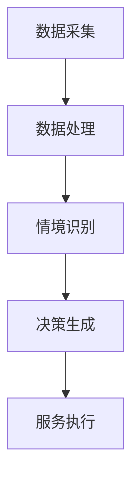

                 

## 引言

### 企业级情境感知系统的背景

随着信息技术的飞速发展，企业级信息系统在企业运营中的地位越来越重要。然而，随着系统复杂度和数据量的不断增大，传统的信息系统已经难以满足用户日益增长的个性化需求。这就促使了情境感知系统（Context-Aware System）的出现和普及。情境感知系统是一种能够识别并适应用户及其所处环境特征的信息系统，它通过获取、处理和分析环境数据，为用户提供更加个性化、智能化的服务。

在企业级应用中，情境感知系统具有广泛的应用前景。例如，在零售行业，情境感知系统可以帮助企业了解消费者的购物行为，提供个性化的商品推荐；在医疗行业，情境感知系统可以实时监测患者的健康状况，提供个性化的治疗方案；在金融行业，情境感知系统可以帮助银行识别欺诈行为，提高风险控制能力。总之，情境感知系统为企业提供了一个全新的运营和管理模式，极大地提升了企业的竞争力。

### 用户体验的重要性

用户体验（User Experience，简称UX）是衡量信息系统质量的重要指标。良好的用户体验不仅可以提高用户满意度，还可以增加用户忠诚度和粘性。在竞争激烈的市场环境中，用户体验甚至可以成为企业的核心竞争力。因此，优化用户体验已经成为企业级信息系统设计的重要目标。

用户体验的核心要素包括：

1. **易用性**：系统操作简便，用户能够快速上手。
2. **可靠性**：系统运行稳定，故障率低。
3. **交互性**：系统与用户之间的互动流畅，响应及时。
4. **美观性**：界面设计美观，色彩搭配和谐。
5. **个性化**：系统能够根据用户的需求和偏好提供定制化服务。

为了提升用户体验，企业需要不断进行用户体验优化。这不仅包括对现有系统的改进，还需要对新兴技术进行探索和应用。情境感知系统正是这样一种技术，它通过感知用户和环境的情境信息，为用户提供更加个性化和智能化的服务，从而优化用户体验。

### 情境感知系统的定义

情境感知系统是一种能够识别并适应用户及其所处环境特征的信息系统。它通过感知用户行为、环境变化以及其他相关信息，为用户提供动态、智能的服务。情境感知系统的核心在于“情境”二字，情境指的是用户及其所处的环境特征，包括地理位置、时间、天气、用户行为等多个方面。

情境感知系统的工作原理可以概括为以下几个步骤：

1. **数据采集**：通过传感器、用户输入等手段收集用户和环境的各种信息。
2. **数据处理**：对采集到的数据进行预处理，包括数据清洗、去噪、归一化等。
3. **情境识别**：利用算法模型对处理后的数据进行分析，识别用户的当前情境。
4. **决策生成**：根据识别出的情境，生成相应的服务策略或推荐。
5. **服务执行**：将决策结果传达给用户，实现个性化服务。

### 书籍目的与结构安排

本书旨在深入探讨企业级情境感知系统如何优化用户体验。通过系统地介绍情境感知系统的核心概念、技术实现、应用案例和最佳实践，帮助读者全面了解和掌握这一前沿技术。本书结构如下：

- **第一部分：引言**：介绍企业级情境感知系统的背景、重要性和本书的目的。
- **第二部分：核心概念介绍**：详细阐述情境感知系统的基本原理、应用领域及其与企业级系统的关系。
- **第三部分：用户体验优化策略**：讨论如何通过情境感知系统来优化用户体验，包括用户体验的核心要素、优化策略和技术实现。
- **第四部分：技术实现与架构设计**：介绍情境感知系统的技术实现，包括数据采集、数据处理、算法模型以及系统架构设计。
- **第五部分：案例分析**：提供实际案例，展示如何在实际项目中实施情境感知系统，并分析其效果。
- **第六部分：最佳实践与展望**：总结最佳实践，展望情境感知系统的未来发展趋势和潜在应用。

希望通过本书的阅读，读者能够对情境感知系统有一个全面深入的理解，并在实际工作中有效地运用这一技术，提升企业的竞争力和用户体验。## 情境感知系统的核心概念

### 情境感知原理

情境感知系统（Context-Aware System）的基本原理是通过感知和识别用户及其所处的环境特征，从而提供更加个性化、智能化的服务。这一过程涉及多个环节，包括数据采集、数据处理、情境识别和决策生成。

1. **数据采集**：情境感知系统通过多种传感器（如GPS、温度传感器、摄像头等）和用户输入（如点击、语音命令等）来收集用户和环境的各类信息。这些数据包括地理位置、时间、用户行为、设备状态、环境状态等。

2. **数据处理**：收集到的原始数据通常含有噪声和冗余信息，因此需要通过数据清洗、去噪、归一化等预处理步骤，使其适合后续分析。

3. **情境识别**：通过分析处理后的数据，系统可以识别出用户的当前情境。例如，当用户在一个寒冷的天气里外出时，系统会识别出“寒冷环境”这一情境。

4. **决策生成**：根据识别出的情境，系统会生成相应的服务策略或推荐。例如，系统可能会推荐用户打开暖风机或穿厚衣服。

5. **服务执行**：最后，系统将决策结果传达给用户，实现个性化服务。

### 情境感知的应用领域

情境感知系统在多个领域都有广泛的应用，以下是一些典型的应用场景：

1. **零售行业**：情境感知系统可以帮助零售商了解消费者的购物行为，从而提供个性化的商品推荐。例如，当用户在一个服装店浏览时，系统可以根据用户的地理位置、浏览历史和天气信息，推荐合适的衣物。

2. **医疗行业**：情境感知系统可以实时监测患者的健康状况，提供个性化的治疗方案。例如，系统可以根据患者的病史、实时生理数据和药物过敏史，为其推荐最适合的治疗方案。

3. **金融行业**：情境感知系统可以帮助银行识别欺诈行为，提高风险控制能力。例如，当用户进行大额转账时，系统可以分析用户的交易历史和实时行为，判断是否存在欺诈风险。

4. **教育行业**：情境感知系统可以为学生提供个性化的学习资源。例如，系统可以根据学生的学习进度、兴趣和学习效果，推荐适合的学习内容。

5. **智能家庭**：情境感知系统可以为家庭提供智能化的家居服务。例如，系统可以根据家庭成员的日常习惯和环境变化，自动调节室内温度、光线和安防措施。

### 情境感知与企业级系统的关系

情境感知系统在企业级系统中扮演着重要的角色。它不仅提升了系统的智能化程度，还为企业提供了更加高效、灵活的运营和管理方式。

1. **提升用户体验**：通过情境感知系统，企业可以为用户提供更加个性化、智能化的服务，从而提升用户体验。例如，在客户服务领域，情境感知系统可以根据客户的偏好和历史记录，提供定制化的解决方案。

2. **优化业务流程**：情境感知系统可以帮助企业优化业务流程，提高运营效率。例如，在生产制造领域，系统可以根据设备状态、原材料库存和订单需求，自动调整生产计划和资源分配。

3. **增强决策支持**：情境感知系统为企业提供了丰富的数据支持和智能分析，帮助管理层做出更加明智的决策。例如，在供应链管理领域，系统可以根据实时市场信息和客户需求，优化库存管理和物流配送。

4. **提高竞争力**：通过情境感知系统，企业可以快速响应市场变化，满足客户需求，从而提高市场竞争力。例如，在市场营销领域，系统可以根据客户行为和偏好，制定精准的营销策略，提高转化率。

总之，情境感知系统不仅是一种技术，更是一种新的商业模式和管理理念。它为企业提供了一个智能化、数据驱动的运营平台，帮助企业实现可持续发展。## 用户体验优化

### 用户体验的核心要素

用户体验（User Experience，简称UX）是衡量信息系统质量的重要指标，其核心要素包括：

1. **易用性**：易用性是用户体验的核心要素之一。一个系统如果操作复杂，用户难以上手，将大大降低用户体验。因此，系统的设计应该尽量简洁、直观，让用户能够轻松完成各种操作。

2. **可靠性**：可靠性指的是系统在长时间运行中表现出的稳定性和故障率。一个可靠的信息系统能够保证用户在需要时能够正常使用，不会因为系统故障而造成损失。

3. **交互性**：交互性指的是系统与用户之间的互动体验。一个良好的交互设计能够让用户感受到流畅、自然的操作体验，提高用户满意度。

4. **美观性**：美观性指的是系统的界面设计和视觉元素。一个美观的界面能够给用户带来愉悦的视觉体验，提升整体用户体验。

5. **个性化**：个性化指的是系统能够根据用户的需求和偏好提供定制化服务。个性化服务能够提高用户的归属感和满意度，增强用户忠诚度。

### 用户需求分析

为了优化用户体验，首先需要对用户需求进行深入分析。用户需求可以从以下几个方面进行分析：

1. **功能需求**：用户希望系统能够提供哪些基本功能，如搜索、浏览、下单等。了解用户的功能需求有助于设计一个功能完善、操作便捷的系统。

2. **性能需求**：用户对系统的性能有哪些期望，如响应速度、稳定性、兼容性等。了解用户的性能需求有助于优化系统的性能，提高用户体验。

3. **交互需求**：用户希望与系统进行怎样的互动，如使用键盘、鼠标、触摸屏等。了解用户的交互需求有助于设计一个符合用户操作习惯的界面。

4. **情感需求**：用户在使用系统时有哪些情感需求，如愉悦、轻松、高效等。了解用户情感需求有助于设计一个能够满足用户情感需求的系统。

### 用户行为分析

用户行为分析是优化用户体验的重要手段。通过分析用户的行为数据，可以了解用户在使用系统时的操作习惯、偏好和问题，从而针对性地进行改进。

1. **行为追踪**：通过行为追踪技术，可以记录用户在系统中的操作轨迹，如浏览路径、点击热图等。这些数据有助于了解用户的操作习惯和偏好。

2. **数据分析**：对行为数据进行统计分析，可以识别出用户使用系统的痛点，如频繁的出错、操作复杂等。这些数据有助于找到用户体验的瓶颈，进行针对性优化。

3. **A/B测试**：通过A/B测试，可以比较不同设计方案的优劣，找到最佳的优化方案。例如，通过对比两种不同界面的用户操作数据，可以判断哪种界面设计更符合用户需求。

### 通过情境感知系统优化用户体验

情境感知系统通过感知用户和环境的情境信息，可以为用户提供更加个性化、智能化的服务，从而优化用户体验。以下是一些具体的优化策略：

1. **个性化推荐**：根据用户的情境信息（如地理位置、时间、天气等），系统可以推荐用户可能感兴趣的内容或服务。例如，在用户位于寒冷的天气里时，系统可以推荐相关的保暖商品。

2. **智能提醒**：根据用户的情境信息，系统可以智能地推送提醒信息，帮助用户更好地管理时间和任务。例如，在用户即将出发去机场时，系统可以提醒用户检查行李、确认航班信息等。

3. **个性化界面**：根据用户的偏好和情境信息，系统可以自动调整界面布局和风格，提供更符合用户需求的界面体验。例如，在用户处于夜间时，系统可以调整界面亮度，减少对用户睡眠的影响。

4. **智能交互**：通过感知用户的行为和情境信息，系统可以提供更加智能的交互方式，如语音控制、手势操作等。这些交互方式能够提升用户的操作效率和体验。

总之，情境感知系统为优化用户体验提供了强大的技术支持。通过深入了解用户需求、分析用户行为，并结合情境信息，企业可以设计出更加个性化、智能化的信息系统，提升用户体验，增强用户满意度和忠诚度。## 情境感知系统的技术实现

### 数据采集

数据采集是情境感知系统的关键环节，它决定了系统能够感知到的情境信息的丰富度和准确度。数据采集可以通过多种方式实现，包括：

1. **传感器采集**：传感器是数据采集的主要工具，可以收集温度、湿度、光照、运动、声音等多种环境信息。例如，温度传感器可以用于监测室内的温度变化，摄像头可以用于识别用户的行为。

2. **用户输入**：用户输入包括用户在系统中的操作行为，如点击、滑动、输入文本等。这些行为可以通过前端技术（如JavaScript）进行采集。

3. **网络数据**：通过网络数据采集用户的位置信息、访问日志等。这通常通过Web分析工具（如Google Analytics）实现。

### 数据处理

数据处理是对采集到的原始数据进行清洗、去噪、归一化等处理，使其适合后续分析。数据处理步骤包括：

1. **数据清洗**：去除重复数据、缺失值和异常值，确保数据的完整性。

2. **数据去噪**：通过滤波算法（如中值滤波、高斯滤波）去除传感器采集数据中的噪声。

3. **数据归一化**：将不同量纲的数据转换到同一量纲，如将温度、湿度等数据进行归一化处理，便于后续分析。

4. **特征提取**：从原始数据中提取对情境识别有用的特征，如通过对图像数据使用SIFT算法提取关键点。

### 算法模型

算法模型是情境感知系统的核心，负责识别用户的当前情境。常见的算法模型包括：

1. **机器学习模型**：如决策树、随机森林、支持向量机等，通过训练模型来识别不同的情境。

2. **深度学习模型**：如卷积神经网络（CNN）、循环神经网络（RNN）等，通过多层神经网络提取深层次的情境特征。

3. **聚类算法**：如K-means、DBSCAN等，用于将数据分组，识别出不同的情境类别。

### 系统架构设计

情境感知系统的架构设计需要考虑数据流、模块划分和系统交互等因素。一个典型的情境感知系统架构包括以下几个模块：

1. **数据采集模块**：负责收集传感器数据和用户输入。

2. **数据处理模块**：对采集到的数据进行预处理，包括数据清洗、去噪、归一化和特征提取。

3. **情境识别模块**：使用算法模型对处理后的数据进行分析，识别用户的当前情境。

4. **决策生成模块**：根据识别出的情境，生成相应的服务策略或推荐。

5. **服务执行模块**：将决策结果传达给用户，实现个性化服务。

### 系统架构示例

以下是一个简化的情境感知系统架构设计，使用Mermaid流程图表示：

在这个架构中，数据采集模块负责收集各种数据，数据处理模块对数据进行分析和预处理，情境识别模块使用算法模型识别情境，决策生成模块根据情境生成服务策略，最后服务执行模块将决策结果传达给用户。

通过这种系统架构设计，情境感知系统可以实现高效的数据处理和情境识别，为用户提供个性化、智能化的服务，从而优化用户体验。## 案例分析

### 案例背景

为了更好地展示情境感知系统在实际项目中的应用效果，我们选择了一家在线教育平台作为案例。这家平台提供各种在线课程，包括编程、外语、艺术等，拥有大量的用户。然而，用户在寻找和学习课程时常常感到困惑，无法找到符合自己需求和兴趣的课程。为了提升用户体验，平台决定引入情境感知系统，通过感知用户的行为和情境信息，为用户提供个性化的课程推荐。

### 实施过程

1. **数据采集**：平台通过登录、浏览、搜索、购买等行为数据，以及用户的地理位置、时间等信息，收集用户的行为数据。同时，平台还使用传感器采集用户的学习状态，如学习时长、学习频率等。

2. **数据处理**：对采集到的原始数据进行清洗、去噪、归一化等处理，提取对情境识别有用的特征，如用户兴趣标签、学习进度、课程评分等。

3. **情境识别**：使用机器学习算法（如协同过滤、K-means聚类等）对处理后的数据进行分析，识别用户的当前学习情境。例如，当用户在晚上浏览课程时，系统会识别出“晚上学习”这一情境。

4. **决策生成**：根据识别出的情境，系统生成个性化的课程推荐策略。例如，当用户处于“晚上学习”情境时，系统会推荐一些轻松、有趣的课程，帮助用户放松。

5. **服务执行**：系统将决策结果通过用户界面展示给用户，用户可以根据推荐选择感兴趣的课程。

### 效果分析

引入情境感知系统后，平台在用户体验方面取得了显著的效果：

1. **用户满意度提升**：用户表示，通过个性化推荐，他们能够更快速地找到符合自己需求和兴趣的课程，学习体验得到显著提升。

2. **课程点击率提高**：个性化推荐使得课程点击率和购买转化率显著上升，平台收入有所增加。

3. **用户留存率提高**：由于推荐的内容更加符合用户需求，用户的学习积极性和满意度提高，平台用户留存率也有所提升。

4. **学习效率提升**：通过智能提醒和个性化学习计划，用户能够更好地管理学习时间，提高学习效率。

### 案例总结

该案例展示了情境感知系统在实际项目中的应用效果，通过感知用户的行为和情境信息，为用户提供个性化的课程推荐，提升了用户体验和平台的运营效果。这个案例不仅验证了情境感知系统在优化用户体验方面的有效性，也为其他企业提供了参考和启示。## 最佳实践与展望

### 总结

通过前面的讨论，我们可以看到情境感知系统在优化用户体验方面具有显著的效果。它不仅能够提供个性化的服务，提高用户满意度，还能通过智能提醒和个性化推荐，提升用户的学习效率。总之，情境感知系统为企业提供了一个智能化、数据驱动的运营平台，有助于提高企业的竞争力。

### 案例分析

在本章节中，我们详细分析了在线教育平台的情境感知系统案例。通过数据采集、数据处理、情境识别和决策生成等步骤，平台实现了个性化的课程推荐，显著提升了用户体验和平台运营效果。这一案例充分展示了情境感知系统在实际应用中的可行性和效果。

### 实施经验

以下是一些实施情境感知系统的经验：

1. **数据质量至关重要**：确保数据采集和处理的质量，是情境感知系统成功的关键。对原始数据进行清洗、去噪和归一化处理，能够提高数据的有效性和准确性。

2. **用户参与度**：在系统设计和实施过程中，重视用户的参与和反馈，有助于更好地理解用户需求，提高系统的个性化程度。

3. **技术选型**：根据具体应用场景，选择合适的技术和算法模型。例如，对于复杂情境识别，深度学习模型可能比传统机器学习模型效果更好。

4. **持续优化**：情境感知系统是一个动态变化的系统，需要不断优化和迭代。通过A/B测试、用户反馈和数据分析，持续改进系统性能。

### 挑战与机遇

虽然情境感知系统在优化用户体验方面具有巨大的潜力，但其在实际应用中也面临一些挑战：

1. **数据隐私和安全**：情境感知系统涉及大量的用户数据，如何保护用户隐私和数据安全是重要挑战。

2. **算法偏见**：如果算法模型存在偏见，可能会导致不公平的结果，甚至对特定群体造成负面影响。

3. **技术复杂性**：情境感知系统的技术实现复杂，需要多学科知识的综合运用，对于企业来说，技术选型和人才培养都是重要挑战。

然而，这些挑战也伴随着巨大的机遇：

1. **个性化服务**：随着用户对个性化服务需求的增加，情境感知系统将为企业提供新的商业模式和服务模式。

2. **数据驱动决策**：情境感知系统为企业提供了丰富的数据支持，有助于管理层做出更加明智的决策。

3. **跨界合作**：情境感知系统可以与其他新兴技术（如物联网、大数据等）相结合，为企业提供更加全面的解决方案。

### 未来发展趋势

展望未来，情境感知系统将继续发展，其应用领域将更加广泛。以下是一些可能的发展趋势：

1. **物联网融合**：情境感知系统将更加紧密地与物联网技术结合，实现设备间的智能互动。

2. **人工智能协同**：情境感知系统将集成更多人工智能技术，如深度学习、自然语言处理等，提升系统的智能化水平。

3. **边缘计算应用**：随着边缘计算的发展，情境感知系统将能够更加实时地处理数据，提高系统的响应速度和效率。

4. **跨领域融合**：情境感知系统将应用于更多领域，如智能制造、智慧城市、健康医疗等，为各行各业提供智能化的解决方案。

总之，情境感知系统作为一种新兴技术，正逐渐成为企业优化用户体验和提升竞争力的重要工具。通过不断创新和优化，情境感知系统将在未来发挥更加重要的作用。## 结语

### 总结与展望

通过本文的详细探讨，我们全面了解了企业级情境感知系统的背景、核心概念、用户体验优化策略、技术实现、案例分析以及最佳实践。情境感知系统作为一种先进的信息技术，不仅在优化用户体验方面表现出色，还能为企业提供智能化的运营和管理模式，提升企业的竞争力。

### 注意事项

在实施情境感知系统时，需要注意以下几点：

1. **数据隐私与安全**：情境感知系统涉及大量的用户数据，必须严格保护用户隐私，确保数据安全。
2. **算法公平性**：避免算法偏见，确保系统能够公平地服务于所有用户。
3. **技术选型**：根据具体应用场景，选择合适的技术和算法模型，确保系统性能和用户体验。
4. **用户参与**：在系统设计和实施过程中，重视用户参与和反馈，持续优化用户体验。

### 拓展阅读

对于希望深入了解情境感知系统的读者，以下书籍和资源提供了丰富的知识和案例：

1. **书籍**：
   - 《情境感知计算：原理与应用》
   - 《智能环境中的情境感知技术》
   - 《用户体验要素》

2. **在线课程**：
   - Coursera上的《机器学习》课程
   - edX上的《大数据与人工智能》课程

3. **论文与报告**：
   - IEEE Xplore上的相关学术论文
   - 报告《情境感知系统在智能城市中的应用》

通过阅读这些资源，读者可以进一步了解情境感知系统的最新研究进展和应用实践，为实际项目提供指导。作者：AI天才研究院/AI Genius Institute & 禅与计算机程序设计艺术 /Zen And The Art of Computer Programming

