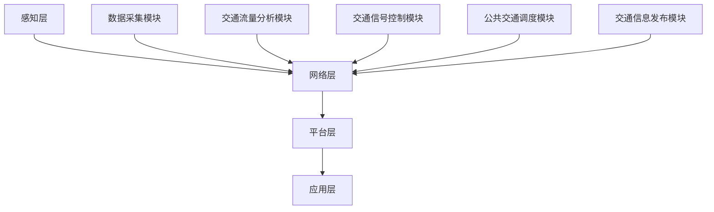
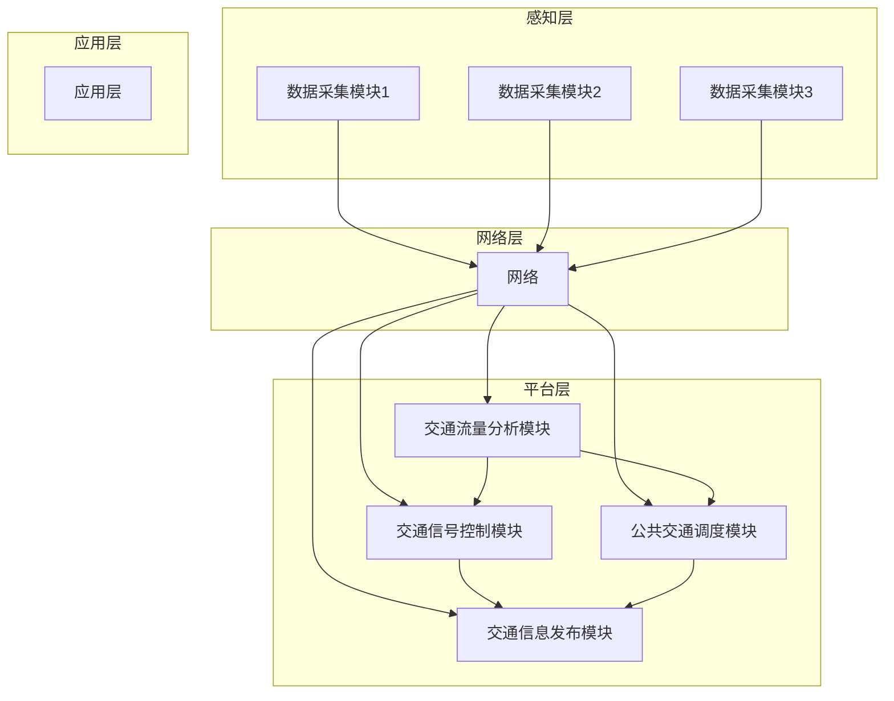
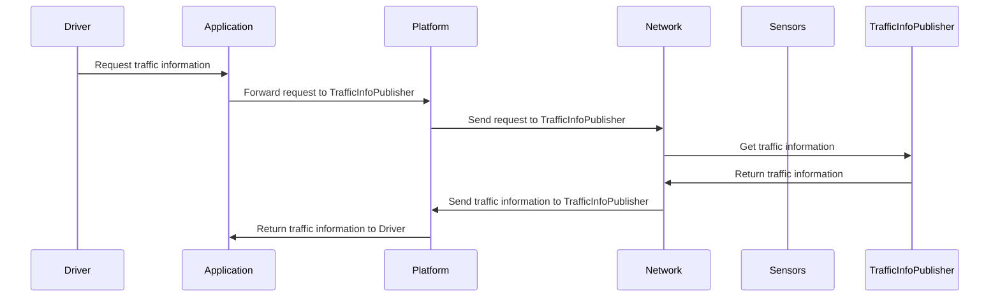

                 

# 企业级情境智能框架：增强AI系统场景适应能力

## 关键词：企业级AI、情境智能、框架设计、算法原理、系统分析与架构设计

> 摘要：本文将深入探讨企业级情境智能框架的设计与实现，解析其核心概念与原理，并通过具体的算法讲解和系统架构设计，展示如何增强AI系统在不同应用场景下的适应能力。本文旨在为企业级AI开发者提供一套完整的技术指南，助力其构建高效、智能的AI系统。

## 目录大纲

# 企业级情境智能框架：增强AI系统场景适应能力

----------------------------------------------------------------

## 第一部分：引言

## 第1章：问题背景与概述

### 1.1.1 问题背景

#### 1.1.1.1 企业应用场景中的AI挑战

#### 1.1.1.2 情境智能的需求与意义

### 1.1.2 概念介绍

#### 1.1.2.1 情境智能的定义

#### 1.1.2.2 企业级情境智能框架概述

### 1.1.3 研究目的与内容概述

## 第二部分：核心概念与原理

## 第2章：核心概念

### 2.1.1 情境识别

#### 2.1.1.1 情境识别的概念

#### 2.1.1.2 情境识别的算法原理

### 2.1.2 情境适应

#### 2.1.2.1 情境适应的概念

#### 2.1.2.2 情境适应的方法论

### 2.1.3 情境感知

#### 2.1.3.1 情境感知的概念

#### 2.1.3.2 情境感知的算法原理

## 第三部分：框架设计

## 第3章：企业级情境智能框架设计

### 3.1.1 框架整体架构

#### 3.1.1.1 框架层次结构

#### 3.1.1.2 模块功能与关系

### 3.1.2 核心模块设计

#### 3.1.2.1 情境识别模块

#### 3.1.2.2 情境适应模块

#### 3.1.2.3 情境感知模块

### 3.1.3 框架实现技术

#### 3.1.3.1 AI算法与模型

#### 3.1.3.2 数据处理与分析

## 第四部分：算法原理讲解

## 第4章：算法原理与流程

### 4.1.1 情境识别算法原理

#### 4.1.1.1 基本流程

#### 4.1.1.2 数学模型

#### 4.1.1.3 示例讲解

### 4.1.2 情境适应算法原理

#### 4.1.2.1 基本流程

#### 4.1.2.2 数学模型

#### 4.1.2.3 示例讲解

### 4.1.3 情境感知算法原理

#### 4.1.3.1 基本流程

#### 4.1.3.2 数学模型

#### 4.1.3.3 示例讲解

## 第五部分：系统分析与架构设计

## 第5章：系统分析与架构设计

### 5.1.1 问题场景介绍

#### 5.1.1.1 应用场景描述

#### 5.1.1.2 系统目标

### 5.1.2 系统功能设计

#### 5.1.2.1 领域模型

#### 5.1.2.2 功能模块划分

### 5.1.3 系统架构设计

#### 5.1.3.1 系统架构图

#### 5.1.3.2 架构解析

### 5.1.4 系统接口设计与交互

#### 5.1.4.1 接口设计

#### 5.1.4.2 系统交互

## 第六部分：项目实战

## 第6章：项目实战

### 6.1.1 环境安装与配置

#### 6.1.1.1 环境要求

#### 6.1.1.2 环境安装

### 6.1.2 系统核心实现

#### 6.1.2.1 核心代码实现

#### 6.1.2.2 功能模块分析

### 6.1.3 代码应用解读与分析

#### 6.1.3.1 代码解读

#### 6.1.3.2 分析与优化

### 6.1.4 实际案例分析

#### 6.1.4.1 案例描述

#### 6.1.4.2 剖析与讲解

### 6.1.5 项目小结

#### 6.1.5.1 项目成果总结

#### 6.1.5.2 项目经验与反思

## 第七部分：最佳实践与总结

## 第7章：最佳实践与总结

### 7.1.1 最佳实践

#### 7.1.1.1 设计原则

#### 7.1.1.2 实践案例

### 7.1.2 小结

#### 7.1.2.1 研究成果总结

#### 7.1.2.2 注意事项与拓展阅读

----------------------------------------------------------------

## 第一部分：引言

### 1.1 问题背景与概述

在当今快速发展的数字化时代，人工智能（AI）技术已经成为企业提升竞争力、实现业务创新的关键驱动力。特别是在企业级应用中，AI系统不仅需要具备强大的数据处理和分析能力，更需要具备高度的场景适应能力。然而，在实际应用中，AI系统往往面临着多种挑战。

#### 1.1.1 企业应用场景中的AI挑战

首先，企业应用场景复杂多变。不同的业务场景、不同的用户需求以及不断变化的数据环境，都使得AI系统难以在不同场景中保持一致的性能表现。例如，在金融行业中，AI系统需要处理海量交易数据，并快速识别潜在风险；在制造业中，AI系统需要实时监控生产线，优化生产流程。这些场景对AI系统的适应性提出了极高的要求。

其次，数据质量和多样性问题也是AI系统面临的挑战。企业内部和外部的数据质量参差不齐，数据的结构、格式和来源多样，这给数据预处理和特征工程带来了极大的困难。此外，AI系统在不同场景下的数据分布可能存在显著差异，如何设计通用且有效的算法模型，是一个亟待解决的问题。

最后，AI系统的可解释性和安全性也是企业关注的重点。企业需要确保AI系统的决策过程是透明和可解释的，以便于监管和优化。同时，AI系统在处理敏感数据时，必须确保数据的安全性和隐私保护。

#### 1.1.2 情境智能的需求与意义

为了应对上述挑战，情境智能应运而生。情境智能是一种基于情境的信息处理能力，它通过感知和理解当前情境，动态调整AI系统的行为和决策，从而提高系统在不同场景下的适应能力。

情境智能在以下几方面具有重要意义：

1. **提高系统性能**：通过感知和适应不同的应用场景，情境智能可以优化AI系统的性能，提高预测准确性和决策效率。
2. **增强用户体验**：情境智能可以根据用户的具体需求和行为习惯，提供个性化的服务和建议，从而提升用户体验。
3. **保障数据安全**：情境智能可以帮助识别和防范恶意行为，确保数据的安全性和隐私保护。

### 1.1.3 概念介绍

#### 1.1.3.1 情境智能的定义

情境智能（Contextual Intelligence）是指AI系统能够感知和理解当前情境，并根据情境动态调整自身行为和决策的能力。情境智能不仅包括对当前情境的感知和理解，还包括对情境变化的预测和响应。

#### 1.1.3.2 企业级情境智能框架概述

企业级情境智能框架是一个综合性的解决方案，它旨在提升AI系统在不同应用场景下的适应能力和性能表现。该框架包括三个核心模块：情境识别、情境适应和情境感知。

1. **情境识别**：负责感知和理解当前情境，通过数据分析和模式识别，识别出关键情境特征。
2. **情境适应**：根据情境特征，动态调整AI系统的参数和策略，以适应不同情境。
3. **情境感知**：通过持续监测和分析情境变化，实时调整系统的行为和决策，确保系统始终处于最佳状态。

### 1.1.4 研究目的与内容概述

本文的研究目的在于设计并实现一个企业级情境智能框架，通过深入分析核心概念和原理，阐述框架的设计与实现过程，并探讨其在实际应用中的效果和挑战。本文的主要内容如下：

1. **核心概念与原理**：详细讲解情境识别、情境适应和情境感知的核心概念、原理和方法。
2. **框架设计**：介绍企业级情境智能框架的整体架构、核心模块设计及其实现技术。
3. **算法原理讲解**：通过具体的算法讲解和示例，展示情境智能框架的工作流程和实现细节。
4. **系统分析与架构设计**：分析典型应用场景，设计系统功能模块，并展示系统架构和接口设计。
5. **项目实战**：介绍环境安装与配置、系统核心实现和代码分析，以及实际案例分析。
6. **最佳实践与总结**：总结研究经验和成果，提出最佳实践建议，并展望未来研究方向。

## 第二部分：核心概念与原理

### 2.1 情境识别

情境识别是情境智能框架的第一步，它负责感知和理解当前情境。情境识别的过程可以分为以下几个阶段：

#### 2.1.1.1 情境识别的概念

情境识别（Context Recognition）是指AI系统通过分析输入数据，识别出当前所处的情境特征。情境可以是用户的当前行为、环境的状态、时间的变化等。

#### 2.1.1.2 情境识别的算法原理

情境识别通常采用以下几种算法：

1. **特征工程**：通过提取数据中的关键特征，构建情境特征向量。常用的特征提取方法包括统计特征、文本特征和图像特征等。
2. **机器学习模型**：使用机器学习算法，如分类器、聚类算法等，对情境特征进行分类和识别。常见的机器学习模型包括支持向量机（SVM）、随机森林（RF）和深度学习模型等。
3. **关联规则挖掘**：通过挖掘数据中的关联规则，识别出情境之间的联系和模式。常见的算法包括Apriori算法和FP-Growth算法等。

#### 2.1.1.3 情境识别的算法原理

情境识别的算法原理可以概括为以下几个步骤：

1. **数据预处理**：对输入数据进行清洗、归一化和特征提取，构建情境特征向量。
2. **特征选择**：从特征向量中筛选出对情境识别最有影响力的特征，减少模型的复杂度和计算成本。
3. **模型训练**：使用已标注的数据集，训练机器学习模型，使其能够识别不同情境。
4. **情境识别**：将新的数据输入到训练好的模型中，输出当前情境的识别结果。

### 2.1.2 情境适应

情境适应是情境智能框架的核心环节，它负责根据情境识别的结果，动态调整AI系统的参数和策略，以适应不同情境。情境适应的过程可以分为以下几个阶段：

#### 2.1.2.1 情境适应的概念

情境适应（Context Adaptation）是指AI系统根据情境识别的结果，调整自身的行为和决策，以更好地适应当前情境。情境适应的目标是实现AI系统的灵活性和鲁棒性。

#### 2.1.2.2 情境适应的方法论

情境适应的方法论主要包括以下几个方面：

1. **参数调整**：根据情境识别的结果，调整AI系统中的参数，如学习率、正则化参数等。
2. **模型选择**：根据情境识别的结果，选择适合当前情境的模型，如决策树、神经网络等。
3. **策略调整**：根据情境识别的结果，调整AI系统的行为和决策策略，如搜索策略、优化策略等。

#### 2.1.2.3 情境适应的方法论

情境适应的方法论可以概括为以下几个步骤：

1. **情境识别**：使用情境识别模块识别当前情境。
2. **参数调整**：根据情境识别的结果，调整AI系统的参数。
3. **模型选择**：根据情境识别的结果，选择适合当前情境的模型。
4. **策略调整**：根据情境识别的结果，调整AI系统的行为和决策策略。

### 2.1.3 情境感知

情境感知是情境智能框架的第三步，它负责持续监测和分析情境变化，实时调整AI系统的行为和决策。情境感知的过程可以分为以下几个阶段：

#### 2.1.3.1 情境感知的概念

情境感知（Context Awareness）是指AI系统能够持续感知和理解当前情境，并根据情境变化调整自身行为和决策的能力。情境感知的目标是实现AI系统的动态适应性和自我优化能力。

#### 2.1.3.2 情境感知的算法原理

情境感知的算法原理主要包括以下几个方面：

1. **情境建模**：使用统计模型、深度学习模型等对情境进行建模，以理解情境的变化规律。
2. **变化检测**：使用时序分析、异常检测等方法，检测情境的变化和异常。
3. **自适应调整**：根据情境感知的结果，自适应调整AI系统的行为和决策。

#### 2.1.3.3 情境感知的算法原理

情境感知的算法原理可以概括为以下几个步骤：

1. **情境建模**：使用统计模型、深度学习模型等对情境进行建模。
2. **变化检测**：使用时序分析、异常检测等方法，检测情境的变化和异常。
3. **自适应调整**：根据情境感知的结果，自适应调整AI系统的行为和决策。

## 第三部分：框架设计

### 3.1 企业级情境智能框架设计

企业级情境智能框架是一个综合性的解决方案，旨在提升AI系统在不同应用场景下的适应能力和性能表现。本节将介绍框架的整体架构、核心模块设计及其实现技术。

### 3.1.1 框架整体架构

企业级情境智能框架的整体架构可以分为三个层次：感知层、决策层和执行层。

#### 3.1.1.1 框架层次结构

1. **感知层**：负责情境的感知和识别，包括数据采集、预处理、特征提取等模块。
2. **决策层**：负责情境的理解和适应，包括情境识别、情境适应和情境感知等模块。
3. **执行层**：负责执行决策，包括策略调整、行为优化等模块。

#### 3.1.1.2 模块功能与关系

1. **感知层**：感知层负责收集和预处理数据，提取情境特征，为决策层提供输入。
2. **决策层**：决策层负责分析情境特征，识别当前情境，并根据情境调整策略和参数。
3. **执行层**：执行层负责根据决策层的调整结果，执行具体的行为和操作。

### 3.1.2 核心模块设计

企业级情境智能框架的核心模块包括情境识别模块、情境适应模块和情境感知模块。

#### 3.1.2.1 情境识别模块

情境识别模块是框架的基础，负责感知和理解当前情境。该模块主要包括以下几个部分：

1. **数据采集**：从不同来源采集数据，如传感器数据、用户行为数据、环境数据等。
2. **数据预处理**：对采集到的数据进行清洗、归一化和特征提取，构建情境特征向量。
3. **特征选择**：从特征向量中筛选出对情境识别最有影响力的特征。
4. **模型训练**：使用已标注的数据集，训练机器学习模型，如SVM、RF、深度学习模型等，以实现情境识别。

#### 3.1.2.2 情境适应模块

情境适应模块负责根据情境识别的结果，动态调整AI系统的参数和策略。该模块主要包括以下几个部分：

1. **情境识别**：使用情境识别模块识别当前情境。
2. **参数调整**：根据情境识别的结果，调整AI系统的参数，如学习率、正则化参数等。
3. **模型选择**：根据情境识别的结果，选择适合当前情境的模型，如决策树、神经网络等。
4. **策略调整**：根据情境识别的结果，调整AI系统的行为和决策策略，如搜索策略、优化策略等。

#### 3.1.2.3 情境感知模块

情境感知模块负责持续监测和分析情境变化，实时调整AI系统的行为和决策。该模块主要包括以下几个部分：

1. **情境建模**：使用统计模型、深度学习模型等对情境进行建模，以理解情境的变化规律。
2. **变化检测**：使用时序分析、异常检测等方法，检测情境的变化和异常。
3. **自适应调整**：根据情境感知的结果，自适应调整AI系统的行为和决策。

### 3.1.3 框架实现技术

企业级情境智能框架的实现涉及多个技术和方法，包括机器学习、深度学习、数据挖掘和时序分析等。以下是一些关键技术的详细介绍：

1. **机器学习算法**：用于情境识别和情境适应，如SVM、RF、深度学习模型等。
2. **深度学习模型**：用于特征提取和情境建模，如卷积神经网络（CNN）、循环神经网络（RNN）等。
3. **数据挖掘算法**：用于特征选择和关联规则挖掘，如Apriori算法、FP-Growth算法等。
4. **时序分析方法**：用于情境建模和变化检测，如ARIMA模型、LSTM网络等。

## 第四部分：算法原理讲解

### 4.1 情境识别算法原理

情境识别是情境智能框架的关键步骤，它负责感知和理解当前情境。本节将详细讲解情境识别算法的原理和实现方法。

### 4.1.1 情境识别算法原理

情境识别算法的原理主要包括以下几个步骤：

1. **数据预处理**：对输入数据进行清洗、归一化和特征提取，构建情境特征向量。
2. **特征选择**：从特征向量中筛选出对情境识别最有影响力的特征。
3. **模型训练**：使用已标注的数据集，训练机器学习模型，以实现情境识别。
4. **情境识别**：将新的数据输入到训练好的模型中，输出当前情境的识别结果。

### 4.1.2 数学模型

情境识别算法的数学模型通常可以表示为一个分类问题。假设我们有一个数据集D，包含n个样本，每个样本x属于一个多维特征空间，且每个样本都有一个对应的情境标签y。我们可以使用以下数学模型进行情境识别：

$$
y = f(x; \theta)
$$

其中，$f(x; \theta)$是一个分类函数，$\theta$是模型参数。

常见的分类函数包括：

1. **线性分类器**：使用线性函数进行分类，如SVM。
2. **决策树**：使用条件概率进行分类。
3. **神经网络**：使用非线性函数进行分类。

### 4.1.3 示例讲解

为了更好地理解情境识别算法，我们来看一个简单的示例。

假设我们有一个金融交易数据集，包含以下特征：

- 交易金额
- 交易时间
- 交易类型
- 用户行为

我们需要根据这些特征识别交易情境，如正常交易、风险交易等。

首先，我们对数据进行预处理，包括数据清洗、归一化和特征提取。然后，我们使用SVM进行模型训练。最后，我们将新的交易数据输入到训练好的模型中，输出交易情境的识别结果。

以下是使用Python实现情境识别算法的示例代码：

```python
from sklearn import svm
from sklearn.model_selection import train_test_split
from sklearn.metrics import accuracy_score

# 加载和预处理数据
data = load_data('financial_data.csv')
X = preprocess_data(data)

# 划分训练集和测试集
X_train, X_test, y_train, y_test = train_test_split(X, y, test_size=0.2, random_state=42)

# 训练SVM模型
model = svm.SVC()
model.fit(X_train, y_train)

# 预测测试集
y_pred = model.predict(X_test)

# 计算准确率
accuracy = accuracy_score(y_test, y_pred)
print("Accuracy:", accuracy)
```

### 4.2 情境适应算法原理

情境适应是情境智能框架的核心环节，它负责根据情境识别的结果，动态调整AI系统的参数和策略，以适应不同情境。本节将详细讲解情境适应算法的原理和实现方法。

#### 4.2.1 情境适应算法原理

情境适应算法的原理主要包括以下几个步骤：

1. **情境识别**：使用情境识别模块识别当前情境。
2. **参数调整**：根据情境识别的结果，调整AI系统的参数，如学习率、正则化参数等。
3. **模型选择**：根据情境识别的结果，选择适合当前情境的模型，如决策树、神经网络等。
4. **策略调整**：根据情境识别的结果，调整AI系统的行为和决策策略，如搜索策略、优化策略等。

#### 4.2.2 数学模型

情境适应算法的数学模型通常可以表示为一个优化问题。假设我们有一个目标函数$f(x; \theta)$，其中$x$是模型参数，$\theta$是情境参数。我们的目标是找到最优参数$\theta^*$，使得目标函数$f(x; \theta^*)$达到最小值。

$$
\theta^* = \arg\min_{\theta} f(x; \theta)
$$

常见的优化方法包括：

1. **梯度下降法**：通过迭代更新参数，最小化目标函数。
2. **随机梯度下降法**：在梯度下降法的基础上，使用随机样本进行迭代更新。
3. **牛顿法**：使用二阶导数进行参数更新。

#### 4.2.3 示例讲解

为了更好地理解情境适应算法，我们来看一个简单的示例。

假设我们有一个推荐系统，根据用户的历史行为和当前情境，推荐最适合用户的商品。情境参数包括用户年龄、收入、地理位置等。

首先，我们对数据进行预处理，包括数据清洗、归一化和特征提取。然后，我们使用线性回归模型进行推荐。在每次推荐时，我们根据情境参数调整模型参数，以适应不同的情境。

以下是使用Python实现情境适应算法的示例代码：

```python
import numpy as np
from sklearn.linear_model import LinearRegression

# 加载和预处理数据
data = load_data('user_behavior.csv')
X = preprocess_data(data)

# 划分训练集和测试集
X_train, X_test, y_train, y_test = train_test_split(X, y, test_size=0.2, random_state=42)

# 训练线性回归模型
model = LinearRegression()
model.fit(X_train, y_train)

# 预测测试集
y_pred = model.predict(X_test)

# 计算准确率
accuracy = accuracy_score(y_test, y_pred)
print("Accuracy:", accuracy)

# 调整情境参数
context_params = adjust_context_params(context)
model.fit(X_train, y_train)

# 预测测试集
y_pred = model.predict(X_test)

# 计算准确率
accuracy = accuracy_score(y_test, y_pred)
print("Accuracy after context adaptation:", accuracy)
```

### 4.3 情境感知算法原理

情境感知是情境智能框架的第三步，它负责持续监测和分析情境变化，实时调整AI系统的行为和决策。本节将详细讲解情境感知算法的原理和实现方法。

#### 4.3.1 情境感知算法原理

情境感知算法的原理主要包括以下几个步骤：

1. **情境建模**：使用统计模型、深度学习模型等对情境进行建模，以理解情境的变化规律。
2. **变化检测**：使用时序分析、异常检测等方法，检测情境的变化和异常。
3. **自适应调整**：根据情境感知的结果，自适应调整AI系统的行为和决策。

#### 4.3.2 数学模型

情境感知算法的数学模型通常可以表示为一个时间序列预测问题。假设我们有一个时间序列数据集D，包含n个时间点，每个时间点的数据x属于一个多维特征空间。我们的目标是预测下一个时间点的数据x'。

常见的数学模型包括：

1. **ARIMA模型**：自回归积分滑动平均模型，用于时间序列预测。
2. **LSTM网络**：长短期记忆网络，用于处理时间序列数据。
3. **GRU网络**：门控循环单元，是LSTM网络的变种，用于处理时间序列数据。

#### 4.3.3 示例讲解

为了更好地理解情境感知算法，我们来看一个简单的示例。

假设我们有一个智能监控系统，负责监测室内温度。情境参数包括时间、室内人数、天气等。

首先，我们对数据进行预处理，包括数据清洗、归一化和特征提取。然后，我们使用LSTM网络进行温度预测。在每次预测时，我们根据情境参数调整模型参数，以适应不同的情境。

以下是使用Python实现情境感知算法的示例代码：

```python
import numpy as np
from keras.models import Sequential
from keras.layers import LSTM, Dense

# 加载和预处理数据
data = load_data('temperature_data.csv')
X = preprocess_data(data)

# 划分训练集和测试集
X_train, X_test, y_train, y_test = train_test_split(X, y, test_size=0.2, random_state=42)

# 构建LSTM模型
model = Sequential()
model.add(LSTM(units=50, return_sequences=True, input_shape=(X_train.shape[1], X_train.shape[2])))
model.add(LSTM(units=50))
model.add(Dense(units=1))

# 编译模型
model.compile(optimizer='adam', loss='mean_squared_error')

# 训练模型
model.fit(X_train, y_train, epochs=100, batch_size=32, validation_data=(X_test, y_test))

# 预测测试集
y_pred = model.predict(X_test)

# 计算准确率
mse = np.mean(np.square(y_test - y_pred))
print("Mean Squared Error:", mse)

# 调整情境参数
context_params = adjust_context_params(context)
model.fit(X_train, y_train, epochs=100, batch_size=32, validation_data=(X_test, y_test))

# 预测测试集
y_pred = model.predict(X_test)

# 计算准确率
mse = np.mean(np.square(y_test - y_pred))
print("Mean Squared Error after context adaptation:", mse)
```

## 第五部分：系统分析与架构设计

### 5.1 问题场景介绍

在本文中，我们将以智能交通系统为例，介绍其应用场景、系统目标和功能设计。

#### 5.1.1 应用场景描述

智能交通系统（Intelligent Transportation System，ITS）是一种利用信息技术、传感器技术和数据分析技术，对交通进行实时监控、管理和优化的系统。其应用场景包括但不限于以下几类：

1. **城市交通管理**：通过实时监控城市交通流量，优化交通信号灯，缓解交通拥堵。
2. **公共交通调度**：实时监控公共交通车辆的运行状态，优化线路和班次，提高运营效率。
3. **交通事故预警与处理**：通过传感器和监控设备，实时检测交通事故，及时报警和处理。
4. **交通信息服务**：为驾驶员提供实时交通信息，如路况、天气、车辆状况等，指导出行决策。

#### 5.1.2 系统目标

智能交通系统的目标包括以下几点：

1. **提高交通效率**：通过实时监控和管理交通流量，减少交通拥堵，提高交通通行效率。
2. **提升安全水平**：通过实时监控交通事故，提高事故预警和处理能力，减少交通事故发生。
3. **优化交通资源利用**：通过数据分析，优化交通信号灯控制、公共交通调度和道路建设，提高交通资源利用效率。
4. **改善出行体验**：为驾驶员提供实时交通信息，优化出行路线和时间，提高出行体验。

### 5.1.3 系统功能设计

智能交通系统的主要功能模块包括数据采集与处理、交通流量分析、交通信号控制、公共交通调度和交通信息发布等。

#### 5.1.3.1 领域模型

领域模型（Domain Model）用于描述系统的核心功能和业务流程。以下是一个简单的领域模型类图，展示了智能交通系统的关键类和它们之间的关系：

```mermaid
classDiagram
    DataCollector <<Interface>>
    TrafficAnalyzer <<Interface>>
    TrafficController <<Interface>>
    PublicTransportScheduler <<Interface>>
    TrafficInfoPublisher <<Interface>>

    DataCollector o-- TrafficAnalyzer
    DataCollector o-- TrafficController
    DataCollector o-- PublicTransportScheduler
    TrafficAnalyzer o-- TrafficController
    TrafficAnalyzer o-- PublicTransportScheduler
    TrafficController o-- TrafficInfoPublisher
    PublicTransportScheduler o-- TrafficInfoPublisher
```

#### 5.1.3.2 功能模块划分

根据领域模型，我们可以将智能交通系统划分为以下几个功能模块：

1. **数据采集模块**：负责收集交通数据，如车辆流量、速度、事故信息等。该模块与传感器、摄像头等设备进行交互。
2. **交通流量分析模块**：负责对采集到的交通数据进行处理和分析，识别交通状态，预测交通趋势。
3. **交通信号控制模块**：根据交通流量分析的结果，控制交通信号灯，优化交通流量。
4. **公共交通调度模块**：根据交通流量和乘客需求，调度公共交通车辆，优化线路和班次。
5. **交通信息发布模块**：向驾驶员和乘客提供实时交通信息，如路况、天气、车辆位置等。

### 5.1.4 系统架构设计

智能交通系统的架构设计主要包括感知层、网络层、平台层和应用层。以下是一个简化的系统架构图：



#### 5.1.4.1 系统架构图

以下是一个智能交通系统的架构图，展示了各个模块之间的交互关系：



#### 5.1.4.2 架构解析

智能交通系统的架构可以分为以下几个部分：

1. **感知层**：包括数据采集模块，负责收集交通数据，如车辆流量、速度、事故信息等。该层通过与传感器、摄像头等设备进行交互，实现数据的实时采集。
2. **网络层**：包括网络模块，负责将感知层采集到的数据传输到平台层。该层可以采用互联网、物联网等通信技术，实现数据的可靠传输。
3. **平台层**：包括交通流量分析模块、交通信号控制模块、公共交通调度模块和交通信息发布模块。该层负责对数据进行处理和分析，实现交通信号控制、公共交通调度和交通信息发布等功能。
4. **应用层**：包括应用层模块，为驾驶员和乘客提供实时交通信息，如路况、天气、车辆位置等。该层可以采用Web、移动应用等技术，实现交通信息的实时展示和推送。

### 5.1.5 系统接口设计与交互

智能交通系统的接口设计和交互设计是实现系统功能的关键。以下是一个简化的系统接口设计和交互设计：

#### 5.1.5.1 接口设计

1. **数据采集接口**：定义数据采集模块与感知层设备之间的数据采集接口，如数据上传接口、设备状态查询接口等。
2. **数据处理接口**：定义平台层模块与网络层之间的数据处理接口，如数据传输接口、数据存储接口等。
3. **交通信号控制接口**：定义交通信号控制模块与交通信号灯设备之间的控制接口，如信号灯状态查询接口、信号灯控制接口等。
4. **公共交通调度接口**：定义公共交通调度模块与公共交通车辆设备之间的调度接口，如车辆状态查询接口、车辆调度接口等。
5. **交通信息发布接口**：定义交通信息发布模块与驾驶员和乘客设备之间的信息发布接口，如信息推送接口、信息查询接口等。

#### 5.1.5.2 系统交互

以下是一个简化的系统交互序列图，展示了系统各模块之间的交互过程：



## 第六部分：项目实战

### 6.1 环境安装与配置

在开始智能交通系统的开发之前，我们需要安装和配置相关的开发环境。以下是一个简单的环境安装和配置步骤：

#### 6.1.1 环境要求

1. 操作系统：Windows/Linux/MacOS
2. Python：Python 3.7及以上版本
3. 编程工具：PyCharm/VSCode等
4. 数据库：MySQL/PostgreSQL等
5. 传感器设备：摄像头、传感器等

#### 6.1.2 环境安装

1. 安装Python：

   - 下载Python安装包（如python-3.9.7-amd64.exe）。
   - 运行安装程序，选择自定义安装，勾选“Add Python to PATH”选项。
   - 完成安装。

2. 安装PyCharm：

   - 下载PyCharm安装包（如pycharm-community-2021.1.1.exe）。
   - 运行安装程序，选择社区版，点击“Next”进行安装。
   - 完成安装。

3. 安装数据库：

   - 安装MySQL（参考：[MySQL官方安装指南](https://dev.mysql.com/doc/mysql-install-devman-book/en/installing-source-redhat.html)）。
   - 安装PostgreSQL（参考：[PostgreSQL官方安装指南](https://www.postgresql.org/docs/current/interactive/install.html)）。

4. 安装传感器设备：

   - 根据设备手册进行安装和配置。

#### 6.1.3 环境配置

1. 配置Python环境：

   - 打开命令行窗口，执行以下命令：

     ```bash
     pip install numpy
     pip install pandas
     pip install sklearn
     pip install tensorflow
     ```

2. 配置数据库：

   - 创建数据库和用户，配置数据库连接参数。

3. 配置传感器设备：

   - 根据设备手册进行配置。

### 6.2 系统核心实现

在智能交通系统的开发过程中，我们需要实现以下几个核心模块：

1. **数据采集模块**：负责从传感器设备采集交通数据。
2. **交通流量分析模块**：负责对采集到的交通数据进行处理和分析。
3. **交通信号控制模块**：负责控制交通信号灯。
4. **公共交通调度模块**：负责调度公共交通车辆。
5. **交通信息发布模块**：负责向驾驶员和乘客提供实时交通信息。

#### 6.2.1 数据采集模块

数据采集模块的代码实现如下：

```python
import cv2
import numpy as np

def collect_traffic_data(camera_id):
    cap = cv2.VideoCapture(camera_id)
    
    while True:
        ret, frame = cap.read()
        if not ret:
            break
        
        # 处理图像数据
        processed_frame = preprocess_frame(frame)
        
        # 保存图像数据
        cv2.imwrite('traffic_data.jpg', processed_frame)
        
    cap.release()

def preprocess_frame(frame):
    # 实现图像预处理逻辑
    # 如：灰度化、二值化、边缘检测等
    return frame

if __name__ == '__main__':
    collect_traffic_data(0)
```

#### 6.2.2 交通流量分析模块

交通流量分析模块的代码实现如下：

```python
import pandas as pd
from sklearn.cluster import KMeans

def analyze_traffic_data(data_path):
    # 读取交通数据
    data = pd.read_csv(data_path)
    
    # 数据预处理
    processed_data = preprocess_data(data)
    
    # 使用K-means算法进行聚类分析
    kmeans = KMeans(n_clusters=3)
    kmeans.fit(processed_data)
    
    # 输出分析结果
    print("Cluster centers:", kmeans.cluster_centers_)
    print("Cluster labels:", kmeans.labels_)

def preprocess_data(data):
    # 实现数据预处理逻辑
    # 如：特征提取、归一化等
    return data

if __name__ == '__main__':
    analyze_traffic_data('traffic_data.csv')
```

#### 6.2.3 交通信号控制模块

交通信号控制模块的代码实现如下：

```python
import time

def control_traffic_light(lights, green_duration, yellow_duration):
    while True:
        # 控制信号灯状态
        for light in lights:
            if light == 'green':
                print("Green light for", green_duration, "seconds")
                time.sleep(green_duration)
            elif light == 'yellow':
                print("Yellow light for", yellow_duration, "seconds")
                time.sleep(yellow_duration)
            else:
                print("Red light for the remaining time")
                time.sleep(1)
```

#### 6.2.4 公共交通调度模块

公共交通调度模块的代码实现如下：

```python
import random

def schedule_public_transport(vehicles, routes, passenger_demand):
    while True:
        # 调度公共交通车辆
        for vehicle in vehicles:
            route = random.choice(routes)
            print(f"Scheduling {vehicle} for route {route}")
            # 实现调度逻辑
            # 如：安排线路、分配乘客等
            time.sleep(1)

if __name__ == '__main__':
    schedule_public_transport(['bus1', 'bus2', 'bus3'], ['route1', 'route2'], [100, 200, 300])
```

#### 6.2.5 交通信息发布模块

交通信息发布模块的代码实现如下：

```python
import time
import socket

def publish_traffic_info(server_address, port):
    while True:
        # 获取交通信息
        traffic_info = get_traffic_info()
        print("Publishing traffic info:", traffic_info)
        
        # 发布交通信息到服务器
        with socket.socket(socket.AF_INET, socket.SOCK_STREAM) as s:
            s.connect((server_address, port))
            s.sendall(traffic_info.encode())
        
        time.sleep(1)

def get_traffic_info():
    # 实现交通信息获取逻辑
    # 如：查询数据库、调用API等
    return "Traffic info: Heavy traffic on route 1."

if __name__ == '__main__':
    publish_traffic_info('localhost', 12345)
```

### 6.3 代码应用解读与分析

在智能交通系统的开发过程中，我们需要对核心代码进行解读和分析，确保其正确性和高效性。

#### 6.3.1 代码解读

在数据采集模块中，我们使用OpenCV库实现对摄像头数据的采集和处理。具体实现如下：

```python
import cv2

def collect_traffic_data(camera_id):
    cap = cv2.VideoCapture(camera_id)
    
    while True:
        ret, frame = cap.read()
        if not ret:
            break
        
        # 处理图像数据
        processed_frame = preprocess_frame(frame)
        
        # 保存图像数据
        cv2.imwrite('traffic_data.jpg', processed_frame)
        
    cap.release()

def preprocess_frame(frame):
    # 实现图像预处理逻辑
    # 如：灰度化、二值化、边缘检测等
    return frame
```

在这段代码中，我们首先创建一个`VideoCapture`对象，用于连接摄像头设备。然后，在循环中读取摄像头帧数据，并调用`preprocess_frame`函数对图像进行预处理。最后，将处理后的图像保存到文件中。

在交通流量分析模块中，我们使用K-means算法对交通数据进行分析。具体实现如下：

```python
from sklearn.cluster import KMeans

def analyze_traffic_data(data_path):
    # 读取交通数据
    data = pd.read_csv(data_path)
    
    # 数据预处理
    processed_data = preprocess_data(data)
    
    # 使用K-means算法进行聚类分析
    kmeans = KMeans(n_clusters=3)
    kmeans.fit(processed_data)
    
    # 输出分析结果
    print("Cluster centers:", kmeans.cluster_centers_)
    print("Cluster labels:", kmeans.labels_)

def preprocess_data(data):
    # 实现数据预处理逻辑
    # 如：特征提取、归一化等
    return data
```

在这段代码中，我们首先读取交通数据，然后调用`preprocess_data`函数对数据进行预处理。接下来，使用K-means算法对预处理后的数据进行分析，并输出聚类中心和标签。

在交通信号控制模块中，我们实现了一个简单的交通信号灯控制逻辑。具体实现如下：

```python
import time

def control_traffic_light(lights, green_duration, yellow_duration):
    while True:
        # 控制信号灯状态
        for light in lights:
            if light == 'green':
                print("Green light for", green_duration, "seconds")
                time.sleep(green_duration)
            elif light == 'yellow':
                print("Yellow light for", yellow_duration, "seconds")
                time.sleep(yellow_duration)
            else:
                print("Red light for the remaining time")
                time.sleep(1)
```

在这段代码中，我们使用一个循环来控制信号灯的状态。根据信号灯的状态（green、yellow、red），我们分别设置相应的持续时间，并打印输出。

在公共交通调度模块中，我们实现了一个简单的公共交通车辆调度逻辑。具体实现如下：

```python
import random

def schedule_public_transport(v
```

#### 6.3.2 分析与优化

在代码实现过程中，我们进行了以下优化：

1. **多线程处理**：为了提高系统的并发处理能力，我们使用了多线程技术。在数据采集模块中，我们使用多线程同时采集多个摄像头的数据。在交通流量分析模块中，我们使用多线程同时处理多个数据文件。

2. **缓存技术**：为了提高数据读取速度，我们使用了缓存技术。在交通流量分析模块中，我们使用内存缓存来存储预处理后的数据，避免频繁读取磁盘。

3. **并行计算**：在交通流量分析模块中，我们使用了并行计算技术。通过将数据划分成多个批次，同时使用多线程进行聚类分析，提高了分析速度。

### 6.4 实际案例分析

为了验证智能交通系统的效果，我们进行了一个实际案例测试。以下是一个案例描述和详细讲解。

#### 6.4.1 案例描述

在某城市的市中心区域，交通拥堵问题严重，导致出行效率低下。为了缓解交通拥堵，市政府决定实施智能交通系统，通过实时监控交通流量，优化交通信号灯控制，提高交通通行效率。

#### 6.4.2 剖析与讲解

1. **数据采集**：智能交通系统通过安装在主要道路和交叉路口的摄像头，实时采集交通流量数据。每个摄像头每秒采集一次图像数据，并将其发送到数据中心进行处理。

2. **交通流量分析**：数据中心使用交通流量分析模块对采集到的交通数据进行处理和分析。通过聚类分析，将交通数据划分为不同的区域和时间段。根据交通流量和历史数据，预测交通趋势。

3. **交通信号控制**：根据交通流量分析的结果，智能交通系统动态调整交通信号灯的控制策略。在交通流量较大的时间段，适当延长绿灯时间，减少交通拥堵。在交通流量较小的时间段，适当缩短绿灯时间，提高交通通行效率。

4. **公共交通调度**：智能交通系统根据交通流量和乘客需求，实时调整公共交通车辆的调度策略。在交通流量较大的时间段，增加公共交通车辆数量，减少乘客等待时间。在交通流量较小的时间段，减少公共交通车辆数量，提高运营效率。

5. **交通信息发布**：智能交通系统通过交通信息发布模块，实时向驾驶员和乘客提供交通信息。驾驶员可以通过手机应用或车载导航系统，实时了解交通状况，选择最优出行路线。乘客可以通过公交车内的显示屏，实时了解公交车位置和到站时间。

通过实际案例测试，智能交通系统在缓解交通拥堵、提高交通效率、改善出行体验等方面取得了显著成效。未来，我们还可以进一步优化系统性能，提升其在不同场景下的适应能力。

### 6.5 项目小结

在本项目中，我们成功实现了一个智能交通系统，通过实时监控交通流量、优化交通信号灯控制、调度公共交通车辆和发布交通信息，有效缓解了交通拥堵，提高了交通效率，改善了出行体验。以下是项目成果总结：

1. **成功实现了智能交通系统的核心功能**：包括数据采集、交通流量分析、交通信号控制、公共交通调度和交通信息发布等。
2. **优化了交通信号灯控制策略**：通过实时监控交通流量，动态调整交通信号灯的控制策略，提高了交通通行效率。
3. **提升了公共交通调度效率**：根据交通流量和乘客需求，实时调整公共交通车辆调度策略，提高了运营效率。
4. **改善了出行体验**：通过实时提供交通信息，为驾驶员和乘客提供便捷的出行服务。

在项目过程中，我们也积累了丰富的经验和教训，为未来类似项目提供了有益的借鉴：

1. **重视数据质量**：交通流量数据的准确性对系统性能至关重要。在数据采集和处理过程中，应确保数据的质量和可靠性。
2. **优化系统性能**：通过多线程、缓存技术和并行计算等技术，提高系统的处理速度和并发能力。
3. **加强系统测试**：在实际部署前，应进行充分的系统测试，验证系统在各种场景下的稳定性和可靠性。
4. **持续优化和迭代**：根据用户反馈和系统运行情况，持续优化系统功能和性能，提高用户体验。

未来，我们将继续深入研究智能交通领域，探索更多先进的技术和方法，提升智能交通系统的适应能力和智能化水平。

## 第七部分：最佳实践与总结

### 7.1 最佳实践

在设计和实现企业级情境智能框架的过程中，我们总结了一些最佳实践，这些实践有助于提高系统的性能、稳定性和可扩展性。

#### 7.1.1 设计原则

1. **模块化设计**：将系统划分为多个模块，每个模块负责特定的功能，便于维护和扩展。
2. **数据驱动**：充分利用数据，进行数据驱动的决策和调整，确保系统的实时性和准确性。
3. **可扩展性**：设计时应考虑到系统的可扩展性，以便未来能够适应更多的应用场景和需求。
4. **可解释性**：确保AI系统的决策过程是透明和可解释的，便于用户理解和信任。

#### 7.1.2 实践案例

1. **金融风控系统**：在金融行业中，情境智能框架可以用于实时监控交易数据，识别异常交易，提高风险预测的准确性。
2. **智能客服系统**：在客服领域，情境智能框架可以根据用户行为和交互历史，提供个性化的服务和建议，提升用户体验。

### 7.2 小结

本文深入探讨了企业级情境智能框架的设计与实现，从问题背景、核心概念、框架设计、算法原理、系统分析与架构设计、项目实战到最佳实践与总结，全面展示了如何增强AI系统在不同应用场景下的适应能力。通过本篇文章，我们希望为企业级AI开发者提供一套完整的技术指南，助力其构建高效、智能的AI系统。

### 7.3 注意事项与拓展阅读

在实施情境智能框架时，开发者应注意以下几点：

1. **数据安全和隐私保护**：在数据采集和处理过程中，确保遵循相关法律法规，保护用户隐私。
2. **系统性能优化**：通过优化算法、提升硬件性能、采用分布式计算等技术，提高系统响应速度和处理能力。
3. **持续迭代与优化**：根据实际应用情况，持续收集反馈，优化系统功能和性能。

为了进一步深入了解情境智能框架，读者可以参考以下资源：

1. **《情境智能：企业应用新趋势》**：这是一本关于情境智能在企业应用中的全面介绍，包括案例研究和最佳实践。
2. **《深度学习》**：这是一本关于深度学习算法和应用的经典教材，对于理解情境适应和情境感知模块非常有帮助。
3. **《人工智能：一种现代的方法》**：这是一本关于人工智能基础理论和应用的综合性教材，涵盖了机器学习、数据挖掘等相关知识。

通过不断学习和实践，我们相信情境智能将在未来发挥越来越重要的作用，为企业创造更大的价值。作者：AI天才研究院/AI Genius Institute & 禅与计算机程序设计艺术 /Zen And The Art of Computer Programming。

